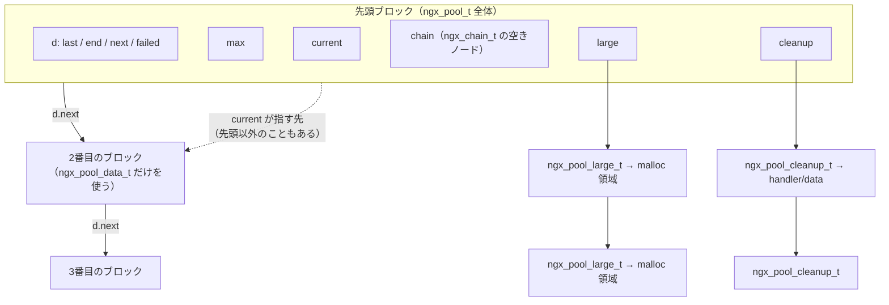
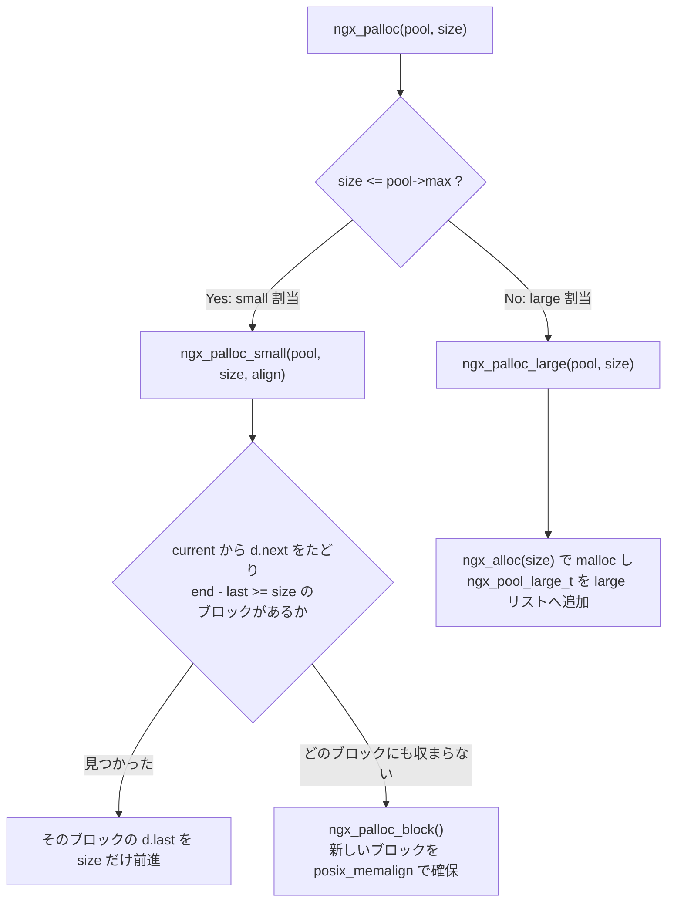
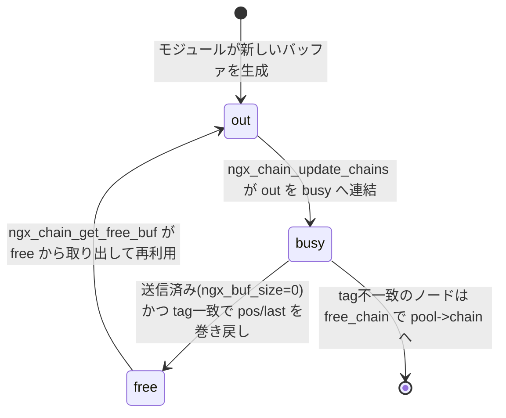

# 第3章 メモリプールとバッファ

> **本章で読むソース**
>
> - [`src/core/ngx_palloc.h`](https://github.com/nginx/nginx/blob/release-1.31.2/src/core/ngx_palloc.h)
> - [`src/core/ngx_palloc.c`](https://github.com/nginx/nginx/blob/release-1.31.2/src/core/ngx_palloc.c)
> - [`src/core/ngx_buf.h`](https://github.com/nginx/nginx/blob/release-1.31.2/src/core/ngx_buf.h)
> - [`src/core/ngx_buf.c`](https://github.com/nginx/nginx/blob/release-1.31.2/src/core/ngx_buf.c)
> - [`src/core/ngx_config.h`](https://github.com/nginx/nginx/blob/release-1.31.2/src/core/ngx_config.h)

## この章の狙い

第1章では、`ngx_cycle_t` が `pool` フィールドにメモリプールを持つことだけを確認した。
そのメモリプールの実体である `ngx_pool_t` の内部構造と、割当と解放の経路を本章で読む。
あわせて、nginx がデータの受け渡しに使う `ngx_buf_t` とバッファチェーン（`ngx_chain_t` による連結）を読み、この2つが「大量の小さな割当」と「大きなデータの受け渡し」をどう両立させているかを見る。

## 前提

C 言語のポインタ演算と `malloc`/`free` の基本的な挙動を前提とする。
ビット演算によるアライメント計算（`x & ~(a - 1)` のような式が `x` を `a` の倍数に切り上げること）も既知として説明する。

## リクエスト処理と大量の小さな割当

nginx は、1本の HTTP リクエストを処理する間に、ヘッダ1行分の文字列、`ngx_table_elt_t`、正規表現マッチの結果、upstream への送信バッファなど、小さなオブジェクトを何十回、何百回と確保する。
これを素朴に `malloc`/`free` で行うと、確保のたびに呼び出しごとの `free` を書く必要があり、エラー処理の途中で1箇所でも `free` を書き忘れると即座にメモリリークになる。
さらに、リクエストが終了した時点でその過程の割当はすべて不要になるという事実は、個々の `malloc`/`free` の対応関係からは見えてこない。

**メモリプール**（`ngx_pool_t`）は、この2つの問題に対する nginx の回答である。
一連の割当を1つのプールに紐づけ、プールの破棄という1回の操作で紐づいた割当をまとめて解放する。
個々の割当に対応する `free` を呼ぶ必要がなくなるため、解放漏れという分類のバグそのものが発生しなくなる。

## `ngx_pool_t` が管理する3つの領域

`ngx_pool_t` の定義は次のとおりである。

[`src/core/ngx_palloc.h` L57-L65](https://github.com/nginx/nginx/blob/release-1.31.2/src/core/ngx_palloc.h#L57-L65)

```c
struct ngx_pool_s {
    ngx_pool_data_t       d;
    size_t                max;
    ngx_pool_t           *current;
    ngx_chain_t          *chain;
    ngx_pool_large_t     *large;
    ngx_pool_cleanup_t   *cleanup;
    ngx_log_t            *log;
};
```

`d` は、そのプール自身が持つメモリ領域の使用状況を表す。

[`src/core/ngx_palloc.h` L49-L54](https://github.com/nginx/nginx/blob/release-1.31.2/src/core/ngx_palloc.h#L49-L54)

```c
typedef struct {
    u_char               *last;
    u_char               *end;
    ngx_pool_t           *next;
    ngx_uint_t            failed;
} ngx_pool_data_t;
```

`last` は次に割り当てる位置、`end` はこのブロックの終端、`next` は同じプールに連結された次のブロックを指す。
`ngx_pool_t` は1個の構造体ではなく、`d.next` でつながった**ブロック**（1回の `malloc` で確保された連続領域）の連結リストであり、先頭のブロックだけが `max`、`current`、`chain`、`large`、`cleanup`、`log` を持つ。

`large` は、プールの外側で `malloc` した大きな領域（**ラージ割当**）を指す連結リストである。

[`src/core/ngx_palloc.h` L41-L46](https://github.com/nginx/nginx/blob/release-1.31.2/src/core/ngx_palloc.h#L41-L46)

```c
typedef struct ngx_pool_large_s  ngx_pool_large_t;

struct ngx_pool_large_s {
    ngx_pool_large_t     *next;
    void                 *alloc;
};
```

`cleanup` は、プール破棄時に呼ぶべき後処理（ファイルディスクリプタのクローズなど）を並べた連結リストである。

[`src/core/ngx_palloc.h` L34-L38](https://github.com/nginx/nginx/blob/release-1.31.2/src/core/ngx_palloc.h#L34-L38)

```c
struct ngx_pool_cleanup_s {
    ngx_pool_cleanup_pt   handler;
    void                 *data;
    ngx_pool_cleanup_t   *next;
};
```

この3系統をまとめると、1個のプールは次のような形になる。



`ngx_create_pool()` は、この先頭ブロックを1回の `ngx_memalign()`（内部で `posix_memalign()` を呼ぶ）で確保する。

[`src/core/ngx_palloc.c` L18-L43](https://github.com/nginx/nginx/blob/release-1.31.2/src/core/ngx_palloc.c#L18-L43)

```c
ngx_pool_t *
ngx_create_pool(size_t size, ngx_log_t *log)
{
    ngx_pool_t  *p;

    p = ngx_memalign(NGX_POOL_ALIGNMENT, size, log);
    if (p == NULL) {
        return NULL;
    }

    p->d.last = (u_char *) p + sizeof(ngx_pool_t);
    p->d.end = (u_char *) p + size;
    p->d.next = NULL;
    p->d.failed = 0;

    size = size - sizeof(ngx_pool_t);
    p->max = (size < NGX_MAX_ALLOC_FROM_POOL) ? size : NGX_MAX_ALLOC_FROM_POOL;

    p->current = p;
    p->chain = NULL;
    p->large = NULL;
    p->cleanup = NULL;
    p->log = log;

    return p;
}
```

`d.last` は構造体自身の直後（`sizeof(ngx_pool_t)` だけ進んだ位置）から始まる。
つまり、`ngx_pool_t` のヘッダとそこから割り当てられるデータ領域は、同じ1回の `malloc` で確保された1個の連続領域の中に同居する。
`max` は「このプールが small 割当として扱う上限サイズ」であり、確保時に指定した `size` と `NGX_MAX_ALLOC_FROM_POOL` の小さい方になる。

[`src/core/ngx_palloc.h` L16-L20](https://github.com/nginx/nginx/blob/release-1.31.2/src/core/ngx_palloc.h#L16-L20)

```c
/*
 * NGX_MAX_ALLOC_FROM_POOL should be (ngx_pagesize - 1), i.e. 4095 on x86.
 * On Windows NT it decreases a number of locked pages in a kernel.
 */
#define NGX_MAX_ALLOC_FROM_POOL  (ngx_pagesize - 1)
```

`ngx_pagesize` は通常のシステムでは4096バイトなので、`max` の上限は4095バイトになる。
プール自体を `NGX_DEFAULT_POOL_SIZE`（16KB）より大きく作っても、1回の割当が4095バイトを超えれば必ずラージ割当に回る。
つまり、ページサイズ以上の割当はプール内に置かず、`malloc` へ直接回す設計であり、OS のページ確保単位をまたぐ割当をプール内に持たせないための上限だと考えられる。

`request_pool_size` のようにプールサイズを設定で変更できるディレクティブは、下限を `NGX_MIN_POOL_SIZE`（`ngx_pool_t` と `ngx_pool_large_t` 2個分をアライメントした値）でも検証する。

[`src/http/ngx_http_core_module.c` L5442-L5459](https://github.com/nginx/nginx/blob/release-1.31.2/src/http/ngx_http_core_module.c#L5442-L5459)

```c
static char *
ngx_http_core_pool_size(ngx_conf_t *cf, void *post, void *data)
{
    size_t *sp = data;

    if (*sp < NGX_MIN_POOL_SIZE) {
        ngx_conf_log_error(NGX_LOG_EMERG, cf, 0,
                           "the pool size must be no less than %uz",
                           NGX_MIN_POOL_SIZE);
        return NGX_CONF_ERROR;
    }

    if (*sp % NGX_POOL_ALIGNMENT) {
        ngx_conf_log_error(NGX_LOG_EMERG, cf, 0,
                           "the pool size must be a multiple of %uz",
                           NGX_POOL_ALIGNMENT);
        return NGX_CONF_ERROR;
    }
```

`request_pool_size` はリクエストごとのプールに関わる設定であり、その詳細は第9章で扱う。

## small、block、large という3つの割当経路

割当のエントリポイントは `ngx_palloc()` と `ngx_pnalloc()` である。

[`src/core/ngx_palloc.c` L122-L145](https://github.com/nginx/nginx/blob/release-1.31.2/src/core/ngx_palloc.c#L122-L145)

```c
void *
ngx_palloc(ngx_pool_t *pool, size_t size)
{
#if !(NGX_DEBUG_PALLOC)
    if (size <= pool->max) {
        return ngx_palloc_small(pool, size, 1);
    }
#endif

    return ngx_palloc_large(pool, size);
}


void *
ngx_pnalloc(ngx_pool_t *pool, size_t size)
{
#if !(NGX_DEBUG_PALLOC)
    if (size <= pool->max) {
        return ngx_palloc_small(pool, size, 0);
    }
#endif

    return ngx_palloc_large(pool, size);
}
```

両者の違いは、`ngx_palloc_small()` に渡す `align` 引数だけである。
`ngx_palloc()` はポインタとして使う値（構造体など）向けにアライメントし、`ngx_pnalloc()` は文字列のバイト列のようにアライメント不要な値向けに詰めて確保する。



`ngx_palloc_small()` は、`pool->current` から `d.next` をたどりながら、空きが `size` 以上あるブロックを探す。

[`src/core/ngx_palloc.c` L148-L174](https://github.com/nginx/nginx/blob/release-1.31.2/src/core/ngx_palloc.c#L148-L174)

```c
static ngx_inline void *
ngx_palloc_small(ngx_pool_t *pool, size_t size, ngx_uint_t align)
{
    u_char      *m;
    ngx_pool_t  *p;

    p = pool->current;

    do {
        m = p->d.last;

        if (align) {
            m = ngx_align_ptr(m, NGX_ALIGNMENT);
        }

        if ((size_t) (p->d.end - m) >= size) {
            p->d.last = m + size;

            return m;
        }

        p = p->d.next;

    } while (p);

    return ngx_palloc_block(pool, size);
}
```

見つかったブロックでは `p->d.last = m + size;` の1行だけで割当が完了する。
`malloc` の呼び出しも、確保領域の管理用ヘッダの作成も発生しない。

どのブロックにも空きがなければ、`ngx_palloc_block()` が新しいブロックを追加する。

[`src/core/ngx_palloc.c` L177-L210](https://github.com/nginx/nginx/blob/release-1.31.2/src/core/ngx_palloc.c#L177-L210)

```c
static void *
ngx_palloc_block(ngx_pool_t *pool, size_t size)
{
    u_char      *m;
    size_t       psize;
    ngx_pool_t  *p, *new;

    psize = (size_t) (pool->d.end - (u_char *) pool);

    m = ngx_memalign(NGX_POOL_ALIGNMENT, psize, pool->log);
    if (m == NULL) {
        return NULL;
    }

    new = (ngx_pool_t *) m;

    new->d.end = m + psize;
    new->d.next = NULL;
    new->d.failed = 0;

    m += sizeof(ngx_pool_data_t);
    m = ngx_align_ptr(m, NGX_ALIGNMENT);
    new->d.last = m + size;

    for (p = pool->current; p->d.next; p = p->d.next) {
        if (p->d.failed++ > 4) {
            pool->current = p->d.next;
        }
    }

    p->d.next = new;

    return m;
}
```

新しいブロックのサイズは、先頭ブロックと同じ `psize`（プール全体の初期サイズ）である。
ただし、新しいブロックのヘッダは `ngx_pool_data_t` の4フィールドだけを初期化しており、`max`、`current`、`large`、`cleanup` は使わない。
`m += sizeof(ngx_pool_data_t);` によって、2番目以降のブロックは `ngx_pool_t` 全体分ではなく `ngx_pool_data_t` の分だけヘッダを空け、その直後からデータ領域として使う。

新しいブロックを連結する直前の `for` ループは、`pool->current` から末尾までの各ブロックの `failed` カウンタを1つずつ増やし、失敗回数がすでに5回以上になっていたブロック（`p->d.failed++ > 4` は増分前の値で判定する）があれば `pool->current` をその次のブロックへ進める。
これにより、割当に使えなくなったブロック（先頭に近く、慢性的に空きが足りないブロック）は `ngx_palloc_small()` の探索対象から外れていく。
`ngx_palloc_small()` の探索は `pool->current` から始まるため、ブロック数が増えるほど1回の割当のたびに全ブロックを線形に走査する、という劣化を防いでいる。

`size` が `pool->max` を超える場合は `ngx_palloc_large()` を呼ぶ。

[`src/core/ngx_palloc.c` L213-L249](https://github.com/nginx/nginx/blob/release-1.31.2/src/core/ngx_palloc.c#L213-L249)

```c
static void *
ngx_palloc_large(ngx_pool_t *pool, size_t size)
{
    void              *p;
    ngx_uint_t         n;
    ngx_pool_large_t  *large;

    p = ngx_alloc(size, pool->log);
    if (p == NULL) {
        return NULL;
    }

    n = 0;

    for (large = pool->large; large; large = large->next) {
        if (large->alloc == NULL) {
            large->alloc = p;
            return p;
        }

        if (n++ > 3) {
            break;
        }
    }

    large = ngx_palloc_small(pool, sizeof(ngx_pool_large_t), 1);
    if (large == NULL) {
        ngx_free(p);
        return NULL;
    }

    large->alloc = p;
    large->next = pool->large;
    pool->large = large;

    return p;
}
```

`ngx_palloc_large()` は、まず `malloc`（`ngx_alloc()`）で領域を確保してから、その領域を指す `ngx_pool_large_t` ノードを `large` リストに追加する。
このノード自体は `ngx_palloc_small()` で確保するので、ラージ割当であっても管理用ノードの分だけは small 割当の仕組みに乗る。
`large` リストの先頭4件（`n++ > 3` まで）だけを走査して `alloc == NULL`（後述する `ngx_pfree()` で解放済みの空きスロット）を探すのも、`ngx_palloc_block()` の `failed > 4` と同じ発想であり、リストが伸びるほど走査コストが線形に増える事態を避けている。

## `ngx_pfree` が large 割当だけを対象にする理由

nginx がプールの中で個別に解放できるのは、ラージ割当だけである。

[`src/core/ngx_palloc.c` L277-L294](https://github.com/nginx/nginx/blob/release-1.31.2/src/core/ngx_palloc.c#L277-L294)

```c
ngx_int_t
ngx_pfree(ngx_pool_t *pool, void *p)
{
    ngx_pool_large_t  *l;

    for (l = pool->large; l; l = l->next) {
        if (p == l->alloc) {
            ngx_log_debug1(NGX_LOG_DEBUG_ALLOC, pool->log, 0,
                           "free: %p", l->alloc);
            ngx_free(l->alloc);
            l->alloc = NULL;

            return NGX_OK;
        }
    }

    return NGX_DECLINED;
}
```

`ngx_pfree()` は `pool->large` を線形に探し、一致する `alloc` が見つかれば `ngx_free()`（`free()`）を呼んで `alloc` を `NULL` に戻す。
small 割当がこの対象に含まれないのは、単なる機能不足ではない。
small 割当は、ブロックの中で `d.last` を前進させるだけで確保されており、確保したサイズや境界を記録する個別のヘッダを一切持たない。
`ngx_palloc_small()` が返すのはブロックの中の1点を指すポインタにすぎず、そのポインタだけから「どこからどこまでが1回分の割当か」を復元する手段がない。
一方、ラージ割当は確保のたびに `ngx_pool_large_t` という専用のノードを作り、`alloc` にポインタを保持しているため、後からそのノードを介して個別に `free()` できる。

## プールの破棄とクリーンアップハンドラ

プール自身が保持するリソース（ファイルディスクリプタなど、`free()` では戻らないもの）は、`ngx_pool_cleanup_add()` で登録しておく。

[`src/core/ngx_palloc.c` L311-L339](https://github.com/nginx/nginx/blob/release-1.31.2/src/core/ngx_palloc.c#L311-L339)

```c
ngx_pool_cleanup_t *
ngx_pool_cleanup_add(ngx_pool_t *p, size_t size)
{
    ngx_pool_cleanup_t  *c;

    c = ngx_palloc(p, sizeof(ngx_pool_cleanup_t));
    if (c == NULL) {
        return NULL;
    }

    if (size) {
        c->data = ngx_palloc(p, size);
        if (c->data == NULL) {
            return NULL;
        }

    } else {
        c->data = NULL;
    }

    c->handler = NULL;
    c->next = p->cleanup;

    p->cleanup = c;

    ngx_log_debug1(NGX_LOG_DEBUG_ALLOC, p->log, 0, "add cleanup: %p", c);

    return c;
}
```

呼び出し側は、戻り値の `ngx_pool_cleanup_t` に対して `handler` を自分で設定する。
`size` を渡すと、`handler` に渡す `data`（クリーンアップ対象の識別情報。ファイルなら fd や名前）用の領域も同じプールから確保してくれる。
たとえば `ngx_pool_cleanup_file()` は、`data` を `ngx_pool_cleanup_file_t`（fd、名前、ログを持つ）として `ngx_close_file()` を呼ぶハンドラである。

`ngx_pool_cleanup_add()` は `c->next = p->cleanup; p->cleanup = c;` と先頭挿入するので、`cleanup` リストは登録の逆順に並ぶ。
`ngx_destroy_pool()` はこのリストを先頭から末尾まで走査するため、各 `handler` は登録と逆順（LIFO）で呼ばれ、後から登録したリソースほど先に解放される。
その後 `large` の全ノードを `ngx_free()` し、最後にブロックの連結リストを1個ずつ `ngx_free()` する。

[`src/core/ngx_palloc.c` L46-L96](https://github.com/nginx/nginx/blob/release-1.31.2/src/core/ngx_palloc.c#L46-L96)

```c
void
ngx_destroy_pool(ngx_pool_t *pool)
{
    ngx_pool_t          *p, *n;
    ngx_pool_large_t    *l;
    ngx_pool_cleanup_t  *c;

    for (c = pool->cleanup; c; c = c->next) {
        if (c->handler) {
            ngx_log_debug1(NGX_LOG_DEBUG_ALLOC, pool->log, 0,
                           "run cleanup: %p", c);
            c->handler(c->data);
        }
    }

    // ... (中略) ...

    for (l = pool->large; l; l = l->next) {
        if (l->alloc) {
            ngx_free(l->alloc);
        }
    }

    for (p = pool, n = pool->d.next; /* void */; p = n, n = n->d.next) {
        ngx_free(p);

        if (n == NULL) {
            break;
        }
    }
}
```

プール上に確保した個々のオブジェクトに対する `free` は、この関数のどこにも現れない。
`ngx_destroy_pool()` が呼ぶ `ngx_free()` は、ブロックそのもの（`ngx_memalign()` で確保した単位）とラージ割当の単位に対してだけであり、その中に詰め込まれた無数の small 割当は、ブロックごとまとめて解放される。

プール全体を壊さずに使い回したい場合は `ngx_reset_pool()` を使う。

[`src/core/ngx_palloc.c` L99-L119](https://github.com/nginx/nginx/blob/release-1.31.2/src/core/ngx_palloc.c#L99-L119)

```c
void
ngx_reset_pool(ngx_pool_t *pool)
{
    ngx_pool_t        *p;
    ngx_pool_large_t  *l;

    for (l = pool->large; l; l = l->next) {
        if (l->alloc) {
            ngx_free(l->alloc);
        }
    }

    for (p = pool; p; p = p->d.next) {
        p->d.last = (u_char *) p + sizeof(ngx_pool_t);
        p->d.failed = 0;
    }

    pool->current = pool;
    pool->chain = NULL;
    pool->large = NULL;
}
```

`ngx_reset_pool()` はラージ割当だけを `ngx_free()` し、ブロック自体は解放せずに `d.last` を先頭へ巻き戻して再利用する。
2番目以降のブロックに対しても `sizeof(ngx_pool_t)` 分だけヘッダをあけて巻き戻しており、`ngx_palloc_block()` が本来使っている `sizeof(ngx_pool_data_t)` より広い。
2番目以降のブロックでは、`ngx_pool_t` と `ngx_pool_data_t` のサイズの差分だけ、`ngx_reset_pool()` 後に使える領域が本来より狭くなっている。

## メモリ領域とファイル領域を表す `ngx_buf_t`

**バッファ**（`ngx_buf_t`）は、nginx がリクエストとレスポンスのデータをやり取りするときの単位である。

[`src/core/ngx_buf.h` L20-L56](https://github.com/nginx/nginx/blob/release-1.31.2/src/core/ngx_buf.h#L20-L56)

```c
struct ngx_buf_s {
    u_char          *pos;
    u_char          *last;
    off_t            file_pos;
    off_t            file_last;

    u_char          *start;         /* start of buffer */
    u_char          *end;           /* end of buffer */
    ngx_buf_tag_t    tag;
    ngx_file_t      *file;
    ngx_buf_t       *shadow;


    /* the buf's content could be changed */
    unsigned         temporary:1;

    /*
     * the buf's content is in a memory cache or in a read only memory
     * and must not be changed
     */
    unsigned         memory:1;

    /* the buf's content is mmap()ed and must not be changed */
    unsigned         mmap:1;

    unsigned         recycled:1;
    unsigned         in_file:1;
    unsigned         flush:1;
    unsigned         sync:1;
    unsigned         last_buf:1;
    unsigned         last_in_chain:1;

    unsigned         last_shadow:1;
    unsigned         temp_file:1;

    /* STUB */ int   num;
};
```

`ngx_buf_t` は、メモリ上のデータとファイル上のデータの両方を、同じ構造体で表せるように作られている。

- `pos`と`last`：メモリ上のデータの範囲。`start`と`end` がそのメモリ領域自体の範囲を表すのに対し、`pos`と`last` は今読み出すべき部分だけを指す部分区間になる。
- `file_pos`と`file_last`：`file` が指すファイルの中で、このバッファが表すデータのオフセット範囲。

どちらの範囲を見ればよいかはフラグで決まる。
**temporary**：バッファの内容を書き換えてよいことを示す（呼び出し側が自分で確保したメモリを指す場合に立つ）。
**memory**：内容がキャッシュや読み取り専用領域にあり、書き換えてはならないことを示す。
**mmap**：内容が `mmap()` されたファイル領域であり、書き換えてはならないことを示す。
**in_file**：`pos`と`last` ではなく `file_pos`と`file_last` を見るべきデータであることを示す。

`temporary`、`memory`、`mmap` のいずれかが立っているかどうかは `ngx_buf_in_memory()` マクロで判定する。

[`src/core/ngx_buf.h` L125-L138](https://github.com/nginx/nginx/blob/release-1.31.2/src/core/ngx_buf.h#L125-L138)

```c
#define ngx_buf_in_memory(b)       ((b)->temporary || (b)->memory || (b)->mmap)
#define ngx_buf_in_memory_only(b)  (ngx_buf_in_memory(b) && !(b)->in_file)

#define ngx_buf_special(b)                                                   \
    (((b)->flush || (b)->last_buf || (b)->sync)                              \
     && !ngx_buf_in_memory(b) && !(b)->in_file)

#define ngx_buf_sync_only(b)                                                 \
    ((b)->sync && !ngx_buf_in_memory(b)                                      \
     && !(b)->in_file && !(b)->flush && !(b)->last_buf)

#define ngx_buf_size(b)                                                      \
    (ngx_buf_in_memory(b) ? (off_t) ((b)->last - (b)->pos):                  \
                            ((b)->file_last - (b)->file_pos))
```

`ngx_buf_size()` は、メモリ上のデータなら `last - pos`、ファイル上のデータなら `file_last - file_pos` を返す。
`flush`、`sync`、`last_buf` は、実データを持たずに「ここまでの出力を送信せよ」「これがリクエストの最後のバッファである」といった合図だけを運ぶために立てるフラグであり、`ngx_buf_special()` はその合図専用のバッファを判定する。
これらのフラグと、フィルタチェーンでの具体的な使われ方は第11章で扱う。

メモリとファイルの両方を1つの型で表せることは、`ngx_output_chain()` のような送信側の処理にとって意味を持つ。
ファイル領域を指すバッファをそのまま `sendfile()` に渡せば、カーネル空間でファイルからソケットへ直接データを送れる一方、メモリ領域を指すバッファは通常の `write()` で送る。
バッファチェーンの形を変えずに、どちらの送出方式を使うかをバッファ単位で切り替えられるのは、この2種類の範囲を同じ構造体に持たせているためだと考えられる。

`ngx_create_temp_buf()` は、指定サイズのメモリ領域をプールから確保し、`temporary` バッファとして初期化するユーティリティである。

[`src/core/ngx_buf.c` L12-L44](https://github.com/nginx/nginx/blob/release-1.31.2/src/core/ngx_buf.c#L12-L44)

```c
ngx_buf_t *
ngx_create_temp_buf(ngx_pool_t *pool, size_t size)
{
    ngx_buf_t *b;

    b = ngx_calloc_buf(pool);
    if (b == NULL) {
        return NULL;
    }

    b->start = ngx_palloc(pool, size);
    if (b->start == NULL) {
        return NULL;
    }

    /*
     * set by ngx_calloc_buf():
     *
     *     b->file_pos = 0;
     *     b->file_last = 0;
     *     b->file = NULL;
     *     b->shadow = NULL;
     *     b->tag = 0;
     *     and flags
     */

    b->pos = b->start;
    b->last = b->start;
    b->end = b->last + size;
    b->temporary = 1;

    return b;
}
```

`ngx_calloc_buf()`（`ngx_pcalloc(pool, sizeof(ngx_buf_t))`）で `ngx_buf_t` 自体をゼロ初期化してから、`ngx_palloc()` でデータ領域を確保する。
`ngx_buf_t` 自体もデータ領域も、どちらも呼び出し元が渡した同じプールの small 割当として確保される。

## バッファチェーンとリンクノードの使い回し

複数のバッファを順序付けて並べるとき、nginx は `ngx_buf_t` を配列にまとめるのではなく、`ngx_chain_t` という単方向リストで連結する。

[`src/core/ngx_buf.h` L59-L62](https://github.com/nginx/nginx/blob/release-1.31.2/src/core/ngx_buf.h#L59-L62)

```c
struct ngx_chain_s {
    ngx_buf_t    *buf;
    ngx_chain_t  *next;
};
```

**バッファチェーン**は、`ngx_chain_t` のこの連結を指す。
`ngx_chain_t` はリンクノードにすぎず、`buf` に実際のバッファへのポインタを持つだけで、バッファの中身は持たない。

このリンクノードの確保と再利用を担うのが `ngx_alloc_chain_link()` である。

[`src/core/ngx_buf.c` L47-L65](https://github.com/nginx/nginx/blob/release-1.31.2/src/core/ngx_buf.c#L47-L65)

```c
ngx_chain_t *
ngx_alloc_chain_link(ngx_pool_t *pool)
{
    ngx_chain_t  *cl;

    cl = pool->chain;

    if (cl) {
        pool->chain = cl->next;
        return cl;
    }

    cl = ngx_palloc(pool, sizeof(ngx_chain_t));
    if (cl == NULL) {
        return NULL;
    }

    return cl;
}
```

`pool->chain` は、`ngx_pool_t` が専用に持つ「不要になった `ngx_chain_t` ノードの置き場」である。
`ngx_alloc_chain_link()` はまずここを見て、空きノードがあればそれを返し、なければ通常どおり `ngx_palloc()` で新規に確保する。
ノードを `pool->chain` へ戻すのは、次のマクロである。

[`src/core/ngx_buf.h` L147-L150](https://github.com/nginx/nginx/blob/release-1.31.2/src/core/ngx_buf.h#L147-L150)

```c
ngx_chain_t *ngx_alloc_chain_link(ngx_pool_t *pool);
#define ngx_free_chain(pool, cl)                                             \
    (cl)->next = (pool)->chain;                                              \
    (pool)->chain = (cl)
```

`ngx_chain_t` は `ngx_output_chain()` やフィルタチェーンの各段で、1リクエストの中でも繰り返し確保と破棄が行われるノードである。
専用の空きリストを介して使い回すことで、この頻繁な確保のたびにブロックの `d.last` を前進させる必要をなくしている。

チェーンを別のチェーンへつなぎ替えるとき、`ngx_chain_add_copy()` はバッファの中身を一切コピーしない。

[`src/core/ngx_buf.c` L126-L153](https://github.com/nginx/nginx/blob/release-1.31.2/src/core/ngx_buf.c#L126-L153)

```c
ngx_int_t
ngx_chain_add_copy(ngx_pool_t *pool, ngx_chain_t **chain, ngx_chain_t *in)
{
    ngx_chain_t  *cl, **ll;

    ll = chain;

    for (cl = *chain; cl; cl = cl->next) {
        ll = &cl->next;
    }

    while (in) {
        cl = ngx_alloc_chain_link(pool);
        if (cl == NULL) {
            *ll = NULL;
            return NGX_ERROR;
        }

        cl->buf = in->buf;
        *ll = cl;
        ll = &cl->next;
        in = in->next;
    }

    *ll = NULL;

    return NGX_OK;
}
```

`cl->buf = in->buf;` が示すとおり、コピーされるのはリンクノードと `ngx_buf_t` へのポインタだけである。
`pos`/`last` が指すデータそのものは、複製も移動もされない。
このため、同じデータを指すバッファが複数のチェーンに同時に現れることが起こり得る（`ngx_buf_t` の `shadow` フィールドは、そのような重なりを追跡するために用意されている）。
モジュールがバッファをそのまま次のフィルタへ渡していく仕組みと、それによって実現される低コストなデータ受け渡しの詳細は第11章で扱う。

## `ngx_chain_update_chains` による free/busy リストの再利用

`pool->chain` がリンクノードだけを使い回すのに対し、`ngx_output_chain_ctx_t` のようなモジュールは、`ngx_buf_t` とそのデータ領域ごと使い回す `free`/`busy` という2本のチェーンを自前で持つ。
新しいバッファが必要なとき、モジュールはまず `ngx_chain_get_free_buf()` を呼ぶ。

[`src/core/ngx_buf.c` L156-L181](https://github.com/nginx/nginx/blob/release-1.31.2/src/core/ngx_buf.c#L156-L181)

```c
ngx_chain_t *
ngx_chain_get_free_buf(ngx_pool_t *p, ngx_chain_t **free)
{
    ngx_chain_t  *cl;

    if (*free) {
        cl = *free;
        *free = cl->next;
        cl->next = NULL;
        return cl;
    }

    cl = ngx_alloc_chain_link(p);
    if (cl == NULL) {
        return NULL;
    }

    cl->buf = ngx_calloc_buf(p);
    if (cl->buf == NULL) {
        return NULL;
    }

    cl->next = NULL;

    return cl;
}
```

`free` リストにノードがあればそれを使い、なければ `ngx_buf_t` ごと新規に確保する。
送信し終えたバッファを `busy` から `free` へ戻すのが `ngx_chain_update_chains()` である。

[`src/core/ngx_buf.c` L184-L223](https://github.com/nginx/nginx/blob/release-1.31.2/src/core/ngx_buf.c#L184-L223)

```c
void
ngx_chain_update_chains(ngx_pool_t *p, ngx_chain_t **free, ngx_chain_t **busy,
    ngx_chain_t **out, ngx_buf_tag_t tag)
{
    ngx_chain_t  *cl;

    if (*out) {
        if (*busy == NULL) {
            *busy = *out;

        } else {
            for (cl = *busy; cl->next; cl = cl->next) { /* void */ }

            cl->next = *out;
        }

        *out = NULL;
    }

    while (*busy) {
        cl = *busy;

        if (cl->buf->tag != tag) {
            *busy = cl->next;
            ngx_free_chain(p, cl);
            continue;
        }

        if (ngx_buf_size(cl->buf) != 0) {
            break;
        }

        cl->buf->pos = cl->buf->start;
        cl->buf->last = cl->buf->start;

        *busy = cl->next;
        cl->next = *free;
        *free = cl;
    }
}
```

処理は2段階に分かれる。
まず `*out`（このモジュールが今回新しく出力したチェーン）をすべて `*busy` の末尾へつなぎ、`*out` を空にする。
次に `*busy` の先頭から順に見て、`tag` が一致しないノード（このモジュール以外が確保したバッファ）はリンクノードだけを `ngx_free_chain()` で `pool->chain` へ返し、自分の `free` リストには入れない。
`tag` が一致し、かつ `ngx_buf_size()` が0（送信済みでデータが残っていない）なら、`pos`と`last` を `start` へ巻き戻したうえで `*busy` から `*free` へ移す。
`ngx_buf_size()` がまだ0でないバッファに達した時点でループを打ち切るのは、`busy` チェーンがデータの送信順を表しており、それより後ろのバッファは先に送り終わっているはずがないためである。



`free` に戻ったノードは `ngx_chain_get_free_buf()` で再び取り出せるので、同じデータ量を送るためのバッファ確保が、2回目以降は `ngx_palloc()` を経由しない。

## 最適化の工夫：ポインタの前進で完結する割当と一括解放

メモリプールが速いのは、確保と解放という2つの操作を、それぞれ別の仕組みで極端に軽くしているからである。

確保側では、`ngx_palloc_small()` が行うのは、アライメント計算とポインタの比較、そして `p->d.last = m + size;` という代入だけである。
アライメント自体もループや条件分岐ではなく、`ngx_align_ptr()` というビット演算1回で計算する。

[`src/core/ngx_config.h` L96-L102](https://github.com/nginx/nginx/blob/release-1.31.2/src/core/ngx_config.h#L96-L102)

```c
#ifndef NGX_ALIGNMENT
#define NGX_ALIGNMENT   sizeof(uintptr_t)    /* platform word */
#endif

#define ngx_align(d, a)     (((d) + (a - 1)) & ~(a - 1))
#define ngx_align_ptr(p, a)                                                   \
    (u_char *) (((uintptr_t) (p) + ((uintptr_t) a - 1)) & ~((uintptr_t) a - 1))
```

`a` を2の冪（`NGX_ALIGNMENT` はワードサイズ）に限定することで、除算や剰余を使わずに「`a` の倍数へ切り上げる」計算を、加算とマスクだけで済ませている。
`glibc` の `malloc` のような汎用アロケータは、要求サイズに応じたフリーリストの選択、チャンクの分割や結合、スレッド間の競合回避など、割当のたびに相応の処理を行う。
`ngx_palloc_small()` はこれらを一切行わず、空きがあるブロックを見つけたらポインタを前進させるだけで割当を終える。

解放側では、`ngx_destroy_pool()` が個々の small 割当を意識することは一度もない。
`ngx_free()` を呼ぶ対象は、`malloc` 単位（ブロックとラージ割当）に限られており、その中に詰め込まれた無数の小さなオブジェクトは、ブロックを解放した瞬間にまとめて無効になる。
確保時に1回も `free` を意識しない設計と、解放時に個々の割当を意識しない設計が対になっているからこそ、ラージ割当だけを例外的に `ngx_pool_large_t` で個別管理し、`ngx_pfree()` によるピンポイントな早期解放（プール全体の破棄を待たずに大きな領域だけ返す）を選択的に行えるようになっている。

## まとめ

- **メモリプール**（`ngx_pool_t`）は、`d.next` で連結したブロックの列と、`large`（ラージ割当の連結リスト）、`cleanup`（後処理の連結リスト）の3系統を1つの構造体にまとめて管理する
- `ngx_palloc()`/`ngx_pnalloc()` は、`size <= pool->max` なら `ngx_palloc_small()` でブロック内のポインタを前進させるだけで確保し、超える場合だけ `ngx_palloc_large()` で `malloc` する
- `ngx_pfree()` が個別解放できるのはラージ割当だけであり、small 割当は確保時の境界情報を持たないため個別には解放できない
- `ngx_destroy_pool()` は cleanup ハンドラの実行、ラージ割当の解放、ブロックの解放という3段階で、プールに紐づいたすべての割当を一括で無効化する
- `ngx_buf_t` は `pos`/`last`（メモリ）と `file_pos`/`file_last`（ファイル）の両方を持ち、フラグで解釈すべき範囲を切り替える
- `ngx_chain_t` によるバッファチェーンは、`ngx_chain_add_copy()` のようにバッファ本体をコピーせずポインタをつなぎ替えるだけであり、`ngx_chain_update_chains()` の free/busy リストがバッファとリンクノードの再利用を担う

## 関連する章

- [第1章 nginx とは何かとプロセスモデル](../part00-overview/01-what-is-nginx-and-process-model.md)
- [第4章 コアデータ構造](04-core-data-structures.md)
- [第9章 HTTP リクエストの受理とパース](../part03-http/09-http-request-parsing.md)
- [第11章 フィルタチェーンと output chain](../part03-http/11-filter-chain-and-output-chain.md)
