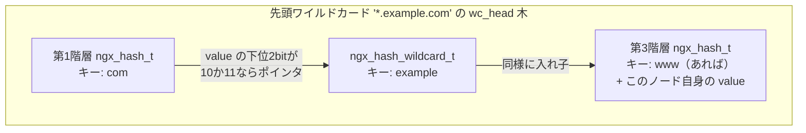
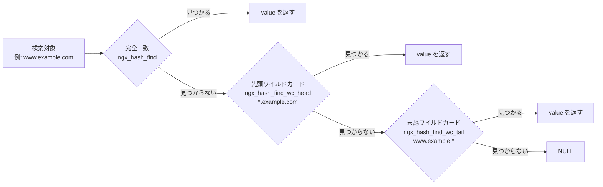

# 第4章 コアデータ構造

> **本章で読むソース**
>
> - [`src/core/ngx_string.h`](https://github.com/nginx/nginx/blob/release-1.31.2/src/core/ngx_string.h)
> - [`src/core/ngx_string.c`](https://github.com/nginx/nginx/blob/release-1.31.2/src/core/ngx_string.c)
> - [`src/core/ngx_array.h`](https://github.com/nginx/nginx/blob/release-1.31.2/src/core/ngx_array.h)
> - [`src/core/ngx_array.c`](https://github.com/nginx/nginx/blob/release-1.31.2/src/core/ngx_array.c)
> - [`src/core/ngx_list.h`](https://github.com/nginx/nginx/blob/release-1.31.2/src/core/ngx_list.h)
> - [`src/core/ngx_list.c`](https://github.com/nginx/nginx/blob/release-1.31.2/src/core/ngx_list.c)
> - [`src/core/ngx_queue.h`](https://github.com/nginx/nginx/blob/release-1.31.2/src/core/ngx_queue.h)
> - [`src/core/ngx_rbtree.h`](https://github.com/nginx/nginx/blob/release-1.31.2/src/core/ngx_rbtree.h)
> - [`src/core/ngx_rbtree.c`](https://github.com/nginx/nginx/blob/release-1.31.2/src/core/ngx_rbtree.c)
> - [`src/core/ngx_hash.h`](https://github.com/nginx/nginx/blob/release-1.31.2/src/core/ngx_hash.h)
> - [`src/core/ngx_hash.c`](https://github.com/nginx/nginx/blob/release-1.31.2/src/core/ngx_hash.c)
> - [`src/core/ngx_radix_tree.h`](https://github.com/nginx/nginx/blob/release-1.31.2/src/core/ngx_radix_tree.h)
> - [`src/core/ngx_radix_tree.c`](https://github.com/nginx/nginx/blob/release-1.31.2/src/core/ngx_radix_tree.c)

## この章の狙い

設定ファイルのパース、HTTP ヘッダの保持、location 名前の検索、タイマーの管理は、いずれも nginx が自前で用意した汎用データ構造の上に組み立てられている。
本章では、その部品にあたる **`ngx_str_t`**（長さ付き文字列）、**`ngx_array_t`**（配列）、**`ngx_list_t`**（連結リスト）、**`ngx_queue_t`**（侵入型双方向リスト）、**`ngx_rbtree_t`**（赤黒木）、**`ngx_hash_t`**（読み取り専用ハッシュ）、**`ngx_radix_tree_t`**（radix tree）を順に読む。
どれも標準ライブラリのコンテナを使わずに独自実装している理由が、メモリプールとの結び付きと、用途に応じた形状の使い分けにある。

## 前提

第3章で扱った**メモリプール**（`ngx_pool_t`）を前提とする。
本章で扱う配列、リスト、木、ハッシュはいずれもメモリプールの上に確保され、個々の要素を `free()` することはない。
C 言語の構造体、ポインタ演算、`offsetof` の基礎知識も前提とする。

## 長さ付き文字列 ngx_str_t

nginx の文字列はほぼすべて **`ngx_str_t`** という長さ付き文字列で表現される。

[`src/core/ngx_string.h` L16-L19](https://github.com/nginx/nginx/blob/release-1.31.2/src/core/ngx_string.h#L16-L19)

```c
typedef struct {
    size_t      len;
    u_char     *data;
} ngx_str_t;
```

`len` バイト先までが文字列の終わりであり、`data` が指す先が NUL で終端している保証はない。
この設計により、既存のバッファの一部を指す部分文字列を、コピーなしで作れる。
`data` を前へ進め、`len` を縮めるだけで、HTTP ヘッダの1行から `key` と `value` を切り出したり、設定ファイルの1トークンを切り出したりできる。

文字列操作の側もこの前提で書かれている。
`ngx_sprintf` などが使う書式指定子 `%V` は `ngx_str_t *` を受け取り、`strlen` を呼ばずに `len` バイトだけを出力する。

[`src/core/ngx_string.c` L252-L258](https://github.com/nginx/nginx/blob/release-1.31.2/src/core/ngx_string.c#L252-L258)

```c
            case 'V':
                v = va_arg(args, ngx_str_t *);

                buf = ngx_sprintf_str(buf, last, v->data, v->len, hex);
                fmt++;

                continue;
```

部分文字列の寿命が元のバッファより長く必要な場合だけ、明示的にコピーする。
`ngx_pstrdup` はその代表であり、`len` バイトの `memcpy` だけで完結し、NUL 終端のための余分な1バイトを確保しない。

[`src/core/ngx_string.c` L74-L87](https://github.com/nginx/nginx/blob/release-1.31.2/src/core/ngx_string.c#L74-L87)

```c
u_char *
ngx_pstrdup(ngx_pool_t *pool, ngx_str_t *src)
{
    u_char  *dst;

    dst = ngx_pnalloc(pool, src->len);
    if (dst == NULL) {
        return NULL;
    }

    ngx_memcpy(dst, src->data, src->len);

    return dst;
}
```

ソースコード中に埋め込まれた文字列リテラルを `ngx_str_t` に変換するときは、`ngx_string()` マクロを使う。

[`src/core/ngx_string.h` L40-L44](https://github.com/nginx/nginx/blob/release-1.31.2/src/core/ngx_string.h#L40-L44)

```c
#define ngx_string(str)     { sizeof(str) - 1, (u_char *) str }
#define ngx_null_string     { 0, NULL }
#define ngx_str_set(str, text)                                               \
    (str)->len = sizeof(text) - 1; (str)->data = (u_char *) text
#define ngx_str_null(str)   (str)->len = 0; (str)->data = NULL
```

`sizeof(str) - 1` はコンパイル時に確定する定数式であり、実行時に `strlen()` を走らせる必要がない。
ディレクティブ名やヘッダ名といった、ソース中に直接書かれた固定文字列の初期化はすべてこの形を通る。

## 配列 ngx_array_t と連結リスト ngx_list_t の使い分け

**`ngx_array_t`** は、要素をメモリ上に連続して並べる可変長配列である。

[`src/core/ngx_array.h` L16-L22](https://github.com/nginx/nginx/blob/release-1.31.2/src/core/ngx_array.h#L16-L22)

```c
typedef struct {
    void        *elts;
    ngx_uint_t   nelts;
    size_t       size;
    ngx_uint_t   nalloc;
    ngx_pool_t  *pool;
} ngx_array_t;
```

`elts` が要素の先頭、`nelts` が現在の要素数、`nalloc` が確保済みの容量、`size` が要素1個分のバイト数である。
容量が尽きたときの拡張戦略は `ngx_array_push()` に現れる。

[`src/core/ngx_array.c` L47-L91](https://github.com/nginx/nginx/blob/release-1.31.2/src/core/ngx_array.c#L47-L91)

```c
void *
ngx_array_push(ngx_array_t *a)
{
    void        *elt, *new;
    size_t       size;
    ngx_pool_t  *p;

    if (a->nelts == a->nalloc) {

        /* the array is full */

        size = a->size * a->nalloc;

        p = a->pool;

        if ((u_char *) a->elts + size == p->d.last
            && p->d.last + a->size <= p->d.end)
        {
            /*
             * the array allocation is the last in the pool
             * and there is space for new allocation
             */

            p->d.last += a->size;
            a->nalloc++;

        } else {
            /* allocate a new array */

            new = ngx_palloc(p, 2 * size);
            if (new == NULL) {
                return NULL;
            }

            ngx_memcpy(new, a->elts, size);
            a->elts = new;
            a->nalloc *= 2;
        }
    }

    elt = (u_char *) a->elts + a->size * a->nelts;
    a->nelts++;

    return elt;
}
```

満杯になったとき、この配列がメモリプール中で一番最後に確保されたブロックであれば、プールの空き領域をそのまま1要素分だけ伸ばして済ませる（`p->d.last += a->size;`）。
コピーはいらない。
それ以外の場合は倍の大きさで新しいブロックを確保し、既存の要素を `memcpy` でまとめて移す。
どちらの経路でも、配列全体が常に1つの連続領域に収まることは保証される反面、拡張によって要素が別アドレスへ移る可能性がある。
つまり `ngx_array_push()` が返したポインタは、その後さらに要素を追加すると無効になりうる。

この制約が問題になる場面が、HTTP ヘッダの保持である。
ヘッダはリクエストの解析が進むたびに1行ずつ追加され、しかも `Host` や `Content-Length` のように特定のヘッダへは他のフィールドから直接ポインタで参照する。
配列でヘッダを保持すると、後続のヘッダが増えるたびに配列が再配置され、既存のポインタが壊れかねない。
nginx はこの用途に **`ngx_list_t`** という連結リストを使う。

[`src/core/ngx_list.h` L18-L31](https://github.com/nginx/nginx/blob/release-1.31.2/src/core/ngx_list.h#L18-L31)

```c
struct ngx_list_part_s {
    void             *elts;
    ngx_uint_t        nelts;
    ngx_list_part_t  *next;
};


typedef struct {
    ngx_list_part_t  *last;
    ngx_list_part_t   part;
    size_t            size;
    ngx_uint_t        nalloc;
    ngx_pool_t       *pool;
} ngx_list_t;
```

`ngx_list_t` は `ngx_array_t` と同じ「固定要素サイズの連続領域」を **part**（`ngx_list_part_t`）という単位で複数個持ち、`next` で鎖状につなぐ。
1つの part が満杯になったら、新しい part を丸ごと確保して末尾に追加するだけで、既存の part は一切動かさない。

[`src/core/ngx_list.c` L30-L63](https://github.com/nginx/nginx/blob/release-1.31.2/src/core/ngx_list.c#L30-L63)

```c
void *
ngx_list_push(ngx_list_t *l)
{
    void             *elt;
    ngx_list_part_t  *last;

    last = l->last;

    if (last->nelts == l->nalloc) {

        /* the last part is full, allocate a new list part */

        last = ngx_palloc(l->pool, sizeof(ngx_list_part_t));
        if (last == NULL) {
            return NULL;
        }

        last->elts = ngx_palloc(l->pool, l->nalloc * l->size);
        if (last->elts == NULL) {
            return NULL;
        }

        last->nelts = 0;
        last->next = NULL;

        l->last->next = last;
        l->last = last;
    }

    elt = (char *) last->elts + l->size * last->nelts;
    last->nelts++;

    return elt;
}
```

`ngx_list_push()` が返すポインタは、以後どれだけ要素を追加しても動かない。
既存の part は増築の対象にならないためである。
その代わり、全要素を舐めるには part を1つずつたどる必要があり、ヘッダの型定義にもコメントとしてその走査手順が残されている。

[`src/core/ngx_list.h` L55-L77](https://github.com/nginx/nginx/blob/release-1.31.2/src/core/ngx_list.h#L55-L77)

```c
/*
 *
 *  the iteration through the list:
 *
 *  part = &list.part;
 *  data = part->elts;
 *
 *  for (i = 0 ;; i++) {
 *
 *      if (i >= part->nelts) {
 *          if (part->next == NULL) {
 *              break;
 *          }
 *
 *          part = part->next;
 *          data = part->elts;
 *          i = 0;
 *      }
 *
 *      ...  data[i] ...
 *
 *  }
 */
```

配列とリストの選択は、要素へのポインタをどれだけ長く生かしたいかで決まる。
実際、リクエストの入力ヘッダはこの `ngx_list_t` で保持される。

[`src/http/ngx_http_request.h` L185-L187](https://github.com/nginx/nginx/blob/release-1.31.2/src/http/ngx_http_request.h#L185-L187)

```c
typedef struct {
    ngx_list_t                        headers;
    ngx_uint_t                        count;
```

`ngx_http_headers_in_t` の `headers` がまさにこれであり、`Host` や `Content-Length` を指す個別フィールドは、この `ngx_list_t` の中に確保された `ngx_table_elt_t` を直接指す。
後から届く別のヘッダがどれだけ追加されても、既存のポインタは壊れない。

## 侵入型双方向リスト ngx_queue_t

**`ngx_queue_t`** はデータを持たない、リンクのためだけの構造体である。

[`src/core/ngx_queue.h` L16-L21](https://github.com/nginx/nginx/blob/release-1.31.2/src/core/ngx_queue.h#L16-L21)

```c
typedef struct ngx_queue_s  ngx_queue_t;

struct ngx_queue_s {
    ngx_queue_t  *prev;
    ngx_queue_t  *next;
};
```

`prev` と `next` の2本のポインタしか持たないため、単体では何のデータも表せない。
使うときは、保持したい構造体のフィールドとして `ngx_queue_t` を埋め込む。
これが**侵入型**（intrusive）と呼ばれる理由であり、リンク用のノードを別に確保するコストがかからない。
挿入と削除はポインタの付け替えだけで完結する。

[`src/core/ngx_queue.h` L33-L47](https://github.com/nginx/nginx/blob/release-1.31.2/src/core/ngx_queue.h#L33-L47)

```c
#define ngx_queue_insert_head(h, x)                                           \
    (x)->next = (h)->next;                                                    \
    (x)->next->prev = x;                                                      \
    (x)->prev = h;                                                            \
    (h)->next = x


#define ngx_queue_insert_after   ngx_queue_insert_head


#define ngx_queue_insert_tail(h, x)                                           \
    (x)->prev = (h)->prev;                                                    \
    (x)->prev->next = x;                                                      \
    (x)->next = h;                                                            \
    (h)->prev = x
```

埋め込まれた `ngx_queue_t` から、元の構造体へ戻る手段が要る。
これを担うのが `ngx_queue_data()` マクロである。

[`src/core/ngx_queue.h` L106-L107](https://github.com/nginx/nginx/blob/release-1.31.2/src/core/ngx_queue.h#L106-L107)

```c
#define ngx_queue_data(q, type, link)                                         \
    (type *) ((u_char *) q - offsetof(type, link))
```

`offsetof(type, link)` は、構造体 `type` の中でフィールド `link`（埋め込まれた `ngx_queue_t`）が先頭から何バイト目にあるかをコンパイル時に計算する。
`ngx_queue_t` のアドレスからこのオフセットを引けば、その `ngx_queue_t` を埋め込んでいた構造体自身のアドレスに戻れる。
リンク用の型がどの構造体にでも同じ形のまま埋め込める汎用性は、この1行の引き算に支えられている。

## 挿入コールバックで比較規則を差し替える ngx_rbtree_t

**赤黒木**（`ngx_rbtree_t`）も `ngx_queue_t` と同様に、ノードを構造体へ埋め込んで使う。

[`src/core/ngx_rbtree.h` L20-L41](https://github.com/nginx/nginx/blob/release-1.31.2/src/core/ngx_rbtree.h#L20-L41)

```c
typedef struct ngx_rbtree_node_s  ngx_rbtree_node_t;

struct ngx_rbtree_node_s {
    ngx_rbtree_key_t       key;
    ngx_rbtree_node_t     *left;
    ngx_rbtree_node_t     *right;
    ngx_rbtree_node_t     *parent;
    u_char                 color;
    u_char                 data;
};


typedef struct ngx_rbtree_s  ngx_rbtree_t;

typedef void (*ngx_rbtree_insert_pt) (ngx_rbtree_node_t *root,
    ngx_rbtree_node_t *node, ngx_rbtree_node_t *sentinel);

struct ngx_rbtree_s {
    ngx_rbtree_node_t     *root;
    ngx_rbtree_node_t     *sentinel;
    ngx_rbtree_insert_pt   insert;
};
```

`ngx_rbtree_t` は木の実体（`root`）と、葉の代わりに置く**番兵**（`sentinel`）に加えて、`insert` という関数ポインタを持つ。
この `insert` に何を渡すかは、木を初期化するマクロで決まる。

[`src/core/ngx_rbtree.h` L44-L48](https://github.com/nginx/nginx/blob/release-1.31.2/src/core/ngx_rbtree.h#L44-L48)

```c
#define ngx_rbtree_init(tree, s, i)                                           \
    ngx_rbtree_sentinel_init(s);                                              \
    (tree)->root = s;                                                         \
    (tree)->sentinel = s;                                                     \
    (tree)->insert = i
```

汎用の挿入関数 `ngx_rbtree_insert()` は、赤黒木の再平衡だけを自前で行い、二分探索木としての「どちらの枝へ降りるか」の判断をこの `insert` コールバックへ委譲する。

[`src/core/ngx_rbtree.c` L24-L44](https://github.com/nginx/nginx/blob/release-1.31.2/src/core/ngx_rbtree.c#L24-L44)

```c
void
ngx_rbtree_insert(ngx_rbtree_t *tree, ngx_rbtree_node_t *node)
{
    ngx_rbtree_node_t  **root, *temp, *sentinel;

    /* a binary tree insert */

    root = &tree->root;
    sentinel = tree->sentinel;

    if (*root == sentinel) {
        node->parent = NULL;
        node->left = sentinel;
        node->right = sentinel;
        ngx_rbt_black(node);
        *root = node;

        return;
    }

    tree->insert(*root, node, sentinel);
```

木が空でなければ `tree->insert(*root, node, sentinel)` を呼び、挿入位置を決めさせたあとで Cormen 流の再平衡ループに入る（再平衡そのものはノードの色と親子関係だけを見るので、キーの比較方法にはよらない）。
最も基本的な `insert` の実装が `ngx_rbtree_insert_value()` であり、キーの大小だけで単純に左右へ降りる。

[`src/core/ngx_rbtree.c` L96-L118](https://github.com/nginx/nginx/blob/release-1.31.2/src/core/ngx_rbtree.c#L96-L118)

```c
void
ngx_rbtree_insert_value(ngx_rbtree_node_t *temp, ngx_rbtree_node_t *node,
    ngx_rbtree_node_t *sentinel)
{
    ngx_rbtree_node_t  **p;

    for ( ;; ) {

        p = (node->key < temp->key) ? &temp->left : &temp->right;

        if (*p == sentinel) {
            break;
        }

        temp = *p;
    }

    *p = node;
    node->parent = temp;
    node->left = sentinel;
    node->right = sentinel;
    ngx_rbt_red(node);
}
```

もう1つの実装が `ngx_rbtree_insert_timer_value()` であり、イベントタイマーの管理に使われる。

[`src/core/ngx_rbtree.c` L121-L153](https://github.com/nginx/nginx/blob/release-1.31.2/src/core/ngx_rbtree.c#L121-L153)

```c
void
ngx_rbtree_insert_timer_value(ngx_rbtree_node_t *temp, ngx_rbtree_node_t *node,
    ngx_rbtree_node_t *sentinel)
{
    ngx_rbtree_node_t  **p;

    for ( ;; ) {

        /*
         * Timer values
         * 1) are spread in small range, usually several minutes,
         * 2) and overflow each 49 days, if milliseconds are stored in 32 bits.
         * The comparison takes into account that overflow.
         */

        /*  node->key < temp->key */

        p = ((ngx_rbtree_key_int_t) (node->key - temp->key) < 0)
            ? &temp->left : &temp->right;

        if (*p == sentinel) {
            break;
        }

        temp = *p;
    }

    *p = node;
    node->parent = temp;
    node->left = sentinel;
    node->right = sentinel;
    ngx_rbt_red(node);
}
```

タイマーのキーはミリ秒単位のカウンタであり、その型 `ngx_msec_t` は `ngx_rbtree_key_t`、すなわち `ngx_uint_t` の別名である。
キー幅はプラットフォームのポインタ幅に一致するため、32ビット環境では約49日で一周してオーバーフローする（引用中のコメントも「if milliseconds are stored in 32 bits」と条件を付けている）。
`node->key < temp->key` を素直に書くと、この周回をまたいだ2つの値の大小が逆転してしまう。
`(ngx_rbtree_key_int_t) (node->key - temp->key) < 0` という引き算に置き換えることで、符号付き整数の差分として周回を吸収し、周回をまたいでも正しい順序を保つ。
イベントタイマーの初期化はこの `ngx_rbtree_insert_timer_value` を `insert` として渡す。

[`src/event/ngx_event_timer.c` L13-L29](https://github.com/nginx/nginx/blob/release-1.31.2/src/event/ngx_event_timer.c#L13-L29)

```c
ngx_rbtree_t              ngx_event_timer_rbtree;
static ngx_rbtree_node_t  ngx_event_timer_sentinel;

/*
 * the event timer rbtree may contain the duplicate keys, however,
 * it should not be a problem, because we use the rbtree to find
 * a minimum timer value only
 */

ngx_int_t
ngx_event_timer_init(ngx_log_t *log)
{
    ngx_rbtree_init(&ngx_event_timer_rbtree, &ngx_event_timer_sentinel,
                    ngx_rbtree_insert_timer_value);

    return NGX_OK;
}
```

同じ再平衡ロジックのまま `insert` だけを差し替えれば、キーの意味が異なる別の木を作れる。
`ngx_rbtree_data()` マクロも `ngx_queue_data()` と同じ `offsetof` の手法で、埋め込まれたノードから元の構造体（イベントタイマーの場合は `ngx_event_t`）を復元する。
タイマー木を実際に走査する場面は第7章で扱う。

木のもう1つの要点が番兵である。
`ngx_rbtree_init()` は葉の代わりに単一の番兵ノードを全ノードで共有させ、`left` や `right` が実際に `NULL` になることはない。
番兵はあらかじめ黒に初期化されるため、再平衡のコードは「子が存在するかどうか」を毎回 `NULL` チェックする代わりに、番兵も含めてすべての子ノードに対して同じ色判定の分岐をそのまま適用できる。

## 構築時に確定する読み取り専用ハッシュ ngx_hash_t

**`ngx_hash_t`** は、`server_name` や MIME タイプ、設定ディレクティブ名の検索に使われるハッシュテーブルである。
挿入や削除の API を持たず、構築時にすべてのキーが出そろっていることを前提にする、読み取り専用の構造である。

[`src/core/ngx_hash.h` L16-L32](https://github.com/nginx/nginx/blob/release-1.31.2/src/core/ngx_hash.h#L16-L32)

```c
typedef struct {
    void             *value;
    u_short           len;
    u_char            name[1];
} ngx_hash_elt_t;


typedef struct {
    ngx_hash_elt_t  **buckets;
    ngx_uint_t        size;
} ngx_hash_t;


typedef struct {
    ngx_hash_t        hash;
    void             *value;
} ngx_hash_wildcard_t;
```

`ngx_hash_elt_t` の `name[1]` は、実際にはキーの長さぶんだけ後ろに続く可変長のバイト列を指す目印である。
検索は `ngx_hash_find()` が行う。

[`src/core/ngx_hash.c` L12-L49](https://github.com/nginx/nginx/blob/release-1.31.2/src/core/ngx_hash.c#L12-L49)

```c
void *
ngx_hash_find(ngx_hash_t *hash, ngx_uint_t key, u_char *name, size_t len)
{
    ngx_uint_t       i;
    ngx_hash_elt_t  *elt;

#if 0
    ngx_log_error(NGX_LOG_ALERT, ngx_cycle->log, 0, "hf:\"%*s\"", len, name);
#endif

    elt = hash->buckets[key % hash->size];

    if (elt == NULL) {
        return NULL;
    }

    while (elt->value) {
        if (len != (size_t) elt->len) {
            goto next;
        }

        for (i = 0; i < len; i++) {
            if (name[i] != elt->name[i]) {
                goto next;
            }
        }

        return elt->value;

    next:

        elt = (ngx_hash_elt_t *) ngx_align_ptr(&elt->name[0] + elt->len,
                                               sizeof(void *));
        continue;
    }

    return NULL;
}
```

`hash->buckets[key % hash->size]` でバケットの先頭要素を求めたあと、`while (elt->value)` でバケット内の要素を1つずつ比較していく。
ここで衝突した要素どうしをつないでいるのは `next` ポインタではない。
各要素は `value` へのポインタ、長さ `len`、そして `len` バイトの名前を1つの塊としてバケット内に連続して並べ、次の要素へは `&elt->name[0] + elt->len` をポインタサイズへ切り上げた位置へ進むだけで到達する。
バケットの終端は `value` が `NULL` の番兵要素で示される。
つまり衝突した要素どうしは、別々にヒープ確保されたノードをポインタで辿るのではなく、あらかじめ1本の連続領域に詰め込まれている。

## 最適化の工夫：ngx_hash_init がバケットをキャッシュラインに詰める

この「連続領域に詰め込む」配置を作るのが `ngx_hash_init()` であり、単にバケット数を決めるだけでなく、各バケットの中身をキャッシュラインに収まるよう並べ直す。

各要素が占めるバイト数は次のマクロで求まる。

[`src/core/ngx_hash.c` L248-L249](https://github.com/nginx/nginx/blob/release-1.31.2/src/core/ngx_hash.c#L248-L249)

```c
#define NGX_HASH_ELT_SIZE(name)                                               \
    (sizeof(void *) + ngx_align((name)->key.len + 2, sizeof(void *)))
```

`ngx_hash_init()` はまず、全キーをどのバケット数に収めれば `hinit->bucket_size` を超えないかを、候補のバケット数を1つずつ増やしながら試す。

[`src/core/ngx_hash.c` L296-L335](https://github.com/nginx/nginx/blob/release-1.31.2/src/core/ngx_hash.c#L296-L335)

```c
    bucket_size = hinit->bucket_size - sizeof(void *);

    start = nelts / (bucket_size / (2 * sizeof(void *)));
    start = start ? start : 1;

    if (hinit->max_size > 10000 && nelts && hinit->max_size / nelts < 100) {
        start = hinit->max_size - 1000;
    }

    for (size = start; size <= hinit->max_size; size++) {

        ngx_memzero(test, size * sizeof(u_short));

        for (n = 0; n < nelts; n++) {
            if (names[n].key.data == NULL) {
                continue;
            }

            key = names[n].key_hash % size;
            len = test[key] + NGX_HASH_ELT_SIZE(&names[n]);

#if 0
            ngx_log_error(NGX_LOG_ALERT, hinit->pool->log, 0,
                          "%ui: %ui %uz \"%V\"",
                          size, key, len, &names[n].key);
#endif

            if (len > bucket_size) {
                goto next;
            }

            test[key] = (u_short) len;
        }

        goto found;

    next:

        continue;
    }
```

`test[]` 配列は候補サイズごとの各バケットの使用バイト数を記録する作業領域であり、全キーを配ってもどのバケットも `bucket_size` を超えない候補が見つかった時点で `goto found` へ抜ける。
小さいバケット数から順に試すため、見つかった `size` は要素を詰め込める範囲でできるだけ小さい値になる。

サイズが決まったあと、`ngx_hash_init()` は各バケットの実バイト数をキャッシュラインの倍数に切り上げる。

[`src/core/ngx_hash.c` L346-L382](https://github.com/nginx/nginx/blob/release-1.31.2/src/core/ngx_hash.c#L346-L382)

```c
found:

    for (i = 0; i < size; i++) {
        test[i] = sizeof(void *);
    }

    for (n = 0; n < nelts; n++) {
        if (names[n].key.data == NULL) {
            continue;
        }

        key = names[n].key_hash % size;
        len = test[key] + NGX_HASH_ELT_SIZE(&names[n]);

        if (len > 65536 - ngx_cacheline_size) {
            ngx_log_error(NGX_LOG_EMERG, hinit->pool->log, 0,
                          "could not build %s, you should "
                          "increase %s_max_size: %i",
                          hinit->name, hinit->name, hinit->max_size);
            ngx_free(test);
            return NGX_ERROR;
        }

        test[key] = (u_short) len;
    }

    len = 0;

    for (i = 0; i < size; i++) {
        if (test[i] == sizeof(void *)) {
            continue;
        }

        test[i] = (u_short) (ngx_align(test[i], ngx_cacheline_size));

        len += test[i];
    }
```

`ngx_align(test[i], ngx_cacheline_size)` によって、各バケットの占有バイト数がキャッシュライン境界に切り上がる。
最後に、要素を詰め込む本体の領域 `elts` 自体もキャッシュライン境界へ揃えたうえで確保し、各バケットの先頭ポインタをその中の連続した区画へ割り当てる。

[`src/core/ngx_hash.c` L403-L418](https://github.com/nginx/nginx/blob/release-1.31.2/src/core/ngx_hash.c#L403-L418)

```c
    elts = ngx_palloc(hinit->pool, len + ngx_cacheline_size);
    if (elts == NULL) {
        ngx_free(test);
        return NGX_ERROR;
    }

    elts = ngx_align_ptr(elts, ngx_cacheline_size);

    for (i = 0; i < size; i++) {
        if (test[i] == sizeof(void *)) {
            continue;
        }

        buckets[i] = (ngx_hash_elt_t *) elts;
        elts += test[i];
    }
```

先頭がキャッシュラインに揃った領域を、バケットごとにキャッシュラインの倍数単位で切り出しているため、1つのバケットが2本のキャッシュラインをまたぐことは基本的に起きない。
`ngx_hash_find()` がバケット内を先頭から順に読み進めるとき、触れるキャッシュラインの本数はバケットの衝突要素数によらずおおむね一定になる。
バケットサイズの探索自体は設定読込やリロードのたびに一度だけ払うコストであり、そこで手間をかけてレイアウトを詰めておくことで、リクエストのたびに繰り返される検索側を速くしている。

## ワイルドカードハッシュと ngx_hash_combined_t の3段検索

`server_name` ディレクティブは、`*.example.com` のような先頭ワイルドカードと、`www.example.*` のような末尾ワイルドカードを許す。
これを1つの平たいハッシュへ詰め込むのではなく、ドット区切りのセグメントごとに `ngx_hash_t` を1段ずつ入れ子にした木として構築する。



構築側の `ngx_hash_wildcard_init()` は、各キーの最初のドットまでを現在の階層のキーとして切り出す。

[`src/core/ngx_hash.c` L521-L528](https://github.com/nginx/nginx/blob/release-1.31.2/src/core/ngx_hash.c#L521-L528)

```c
        dot = 0;

        for (len = 0; len < names[n].key.len; len++) {
            if (names[n].key.data[len] == '.') {
                dot = 1;
                break;
            }
        }
```

同じ先頭セグメントを持つキー群が2件以上残れば、そのグループの残り部分（ドットの後ろ）だけを渡して自分自身を再帰呼び出しし、1段下の `ngx_hash_wildcard_t` を作る。
できあがった下位ハッシュへのポインタは、`value` フィールドの下位2ビットにタグを埋め込んで格納する。

[`src/core/ngx_hash.c` L598-L620](https://github.com/nginx/nginx/blob/release-1.31.2/src/core/ngx_hash.c#L598-L620)

```c
        if (next_names.nelts) {

            h = *hinit;
            h.hash = NULL;

            if (ngx_hash_wildcard_init(&h, (ngx_hash_key_t *) next_names.elts,
                                       next_names.nelts)
                != NGX_OK)
            {
                return NGX_ERROR;
            }

            wdc = (ngx_hash_wildcard_t *) h.hash;

            if (names[n].key.len == len) {
                wdc->value = names[n].value;
            }

            name->value = (void *) ((uintptr_t) wdc | (dot ? 3 : 2));

        } else if (dot) {
            name->value = (void *) ((uintptr_t) name->value | 1);
        }
```

`ngx_hash_wildcard_t` は `ngx_hash_t` を先頭に含む構造なので、下位ハッシュへのポインタと本来の値へのポインタは、同じ `void *` の型で扱いつつ下位2ビットのタグだけで区別できる。
ポインタは `sizeof(void *)` 境界に揃っているため、下位2ビットは通常のアドレスとしては使われず、タグ専用に空いている。

検索側の `ngx_hash_find_wc_head()` は、名前を後ろから見て最後のセグメント（最後のドットより後ろ）を取り出し、それを鍵に現在の階層を検索する。

[`src/core/ngx_hash.c` L52-L143](https://github.com/nginx/nginx/blob/release-1.31.2/src/core/ngx_hash.c#L52-L143)

```c
void *
ngx_hash_find_wc_head(ngx_hash_wildcard_t *hwc, u_char *name, size_t len)
{
    void        *value;
    ngx_uint_t   i, n, key;

#if 0
    ngx_log_error(NGX_LOG_ALERT, ngx_cycle->log, 0, "wch:\"%*s\"", len, name);
#endif

    n = len;

    while (n) {
        if (name[n - 1] == '.') {
            break;
        }

        n--;
    }

    key = 0;

    for (i = n; i < len; i++) {
        key = ngx_hash(key, name[i]);
    }

#if 0
    ngx_log_error(NGX_LOG_ALERT, ngx_cycle->log, 0, "key:\"%ui\"", key);
#endif

    value = ngx_hash_find(&hwc->hash, key, &name[n], len - n);

#if 0
    ngx_log_error(NGX_LOG_ALERT, ngx_cycle->log, 0, "value:\"%p\"", value);
#endif

    if (value) {

        /*
         * the 2 low bits of value have the special meaning:
         *     00 - value is data pointer for both "example.com"
         *          and "*.example.com";
         *     01 - value is data pointer for "*.example.com" only;
         *     10 - value is pointer to wildcard hash allowing
         *          both "example.com" and "*.example.com";
         *     11 - value is pointer to wildcard hash allowing
         *          "*.example.com" only.
         */

        if ((uintptr_t) value & 2) {

            if (n == 0) {

                /* "example.com" */

                if ((uintptr_t) value & 1) {
                    return NULL;
                }

                hwc = (ngx_hash_wildcard_t *)
                                          ((uintptr_t) value & (uintptr_t) ~3);
                return hwc->value;
            }

            hwc = (ngx_hash_wildcard_t *) ((uintptr_t) value & (uintptr_t) ~3);

            value = ngx_hash_find_wc_head(hwc, name, n - 1);

            if (value) {
                return value;
            }

            return hwc->value;
        }

        if ((uintptr_t) value & 1) {

            if (n == 0) {

                /* "example.com" */

                return NULL;
            }

            return (void *) ((uintptr_t) value & (uintptr_t) ~3);
        }

        return value;
    }

    return hwc->value;
}
```

`"www.example.com"` を例にすると、最初の呼び出しは末尾セグメント `"com"` で検索し、見つかった値がタグ `10`/`11`（下位ハッシュへのポインタ）なら、残り `"www.example"` を引数に自分自身を再帰呼び出しする。
1回の呼び出しがドメインを右から1段ずつ剥がしていくので、木の深さはドットの個数だけになる。
末尾ワイルドカード `www.example.*` 向けの `ngx_hash_find_wc_tail()` は、逆に名前を先頭から見て最初のドットまでを切り出し、左から右へ同じ手順を繰り返す。

[`src/core/ngx_hash.c` L146-L207](https://github.com/nginx/nginx/blob/release-1.31.2/src/core/ngx_hash.c#L146-L207)

```c
void *
ngx_hash_find_wc_tail(ngx_hash_wildcard_t *hwc, u_char *name, size_t len)
{
    void        *value;
    ngx_uint_t   i, key;

#if 0
    ngx_log_error(NGX_LOG_ALERT, ngx_cycle->log, 0, "wct:\"%*s\"", len, name);
#endif

    key = 0;

    for (i = 0; i < len; i++) {
        if (name[i] == '.') {
            break;
        }

        key = ngx_hash(key, name[i]);
    }

    if (i == len) {
        return NULL;
    }

#if 0
    ngx_log_error(NGX_LOG_ALERT, ngx_cycle->log, 0, "key:\"%ui\"", key);
#endif

    value = ngx_hash_find(&hwc->hash, key, name, i);

#if 0
    ngx_log_error(NGX_LOG_ALERT, ngx_cycle->log, 0, "value:\"%p\"", value);
#endif

    if (value) {

        /*
         * the 2 low bits of value have the special meaning:
         *     00 - value is data pointer;
         *     11 - value is pointer to wildcard hash allowing "example.*".
         */

        if ((uintptr_t) value & 2) {

            i++;

            hwc = (ngx_hash_wildcard_t *) ((uintptr_t) value & (uintptr_t) ~3);

            value = ngx_hash_find_wc_tail(hwc, &name[i], len - i);

            if (value) {
                return value;
            }

            return hwc->value;
        }

        return value;
    }

    return hwc->value;
}
```

完全一致のハッシュ、先頭ワイルドカード用の木、末尾ワイルドカード用の木という3種類を1つにまとめたものが **`ngx_hash_combined_t`** である。

[`src/core/ngx_hash.h` L45-L49](https://github.com/nginx/nginx/blob/release-1.31.2/src/core/ngx_hash.h#L45-L49)

```c
typedef struct {
    ngx_hash_t            hash;
    ngx_hash_wildcard_t  *wc_head;
    ngx_hash_wildcard_t  *wc_tail;
} ngx_hash_combined_t;
```

検索は `ngx_hash_find_combined()` が3種類を決まった順序で試す。

[`src/core/ngx_hash.c` L210-L245](https://github.com/nginx/nginx/blob/release-1.31.2/src/core/ngx_hash.c#L210-L245)

```c
void *
ngx_hash_find_combined(ngx_hash_combined_t *hash, ngx_uint_t key, u_char *name,
    size_t len)
{
    void  *value;

    if (hash->hash.buckets) {
        value = ngx_hash_find(&hash->hash, key, name, len);

        if (value) {
            return value;
        }
    }

    if (len == 0) {
        return NULL;
    }

    if (hash->wc_head && hash->wc_head->hash.buckets) {
        value = ngx_hash_find_wc_head(hash->wc_head, name, len);

        if (value) {
            return value;
        }
    }

    if (hash->wc_tail && hash->wc_tail->hash.buckets) {
        value = ngx_hash_find_wc_tail(hash->wc_tail, name, len);

        if (value) {
            return value;
        }
    }

    return NULL;
}
```

この順序は、`server_name` の一致優先順位（完全一致、先頭ワイルドカード、末尾ワイルドカードの順）として nginx の公式ドキュメントが規定する仕様を、そのまま実装したものである。



`server_name` の検索がこの `ngx_hash_combined_t` に基づくことは第10章で扱う。

## ビット単位のトライ ngx_radix_tree_t

**`ngx_radix_tree_t`** は、IPv4/IPv6 アドレスのように固定長のビット列をキーにした検索木である。

[`src/core/ngx_radix_tree.h` L18-L34](https://github.com/nginx/nginx/blob/release-1.31.2/src/core/ngx_radix_tree.h#L18-L34)

```c
typedef struct ngx_radix_node_s  ngx_radix_node_t;

struct ngx_radix_node_s {
    ngx_radix_node_t  *right;
    ngx_radix_node_t  *left;
    ngx_radix_node_t  *parent;
    uintptr_t          value;
};


typedef struct {
    ngx_radix_node_t  *root;
    ngx_pool_t        *pool;
    ngx_radix_node_t  *free;
    char              *start;
    size_t             size;
} ngx_radix_tree_t;
```

各ノードは `left`（ビットが0）と `right`（ビットが1）の2方向にしか枝分かれしない、2分木である。
挿入 `ngx_radix32tree_insert()` は、キーの最上位ビットから `mask` が立っている桁数ぶんだけ順にたどり、ノードが存在しなければその場で確保する。

[`src/core/ngx_radix_tree.c` L108-L170](https://github.com/nginx/nginx/blob/release-1.31.2/src/core/ngx_radix_tree.c#L108-L170)

```c
ngx_int_t
ngx_radix32tree_insert(ngx_radix_tree_t *tree, uint32_t key, uint32_t mask,
    uintptr_t value)
{
    uint32_t           bit;
    ngx_radix_node_t  *node, *next;

    bit = 0x80000000;

    node = tree->root;
    next = tree->root;

    while (bit & mask) {
        if (key & bit) {
            next = node->right;

        } else {
            next = node->left;
        }

        if (next == NULL) {
            break;
        }

        bit >>= 1;
        node = next;
    }

    if (next) {
        if (node->value != NGX_RADIX_NO_VALUE) {
            return NGX_BUSY;
        }

        node->value = value;
        return NGX_OK;
    }

    while (bit & mask) {
        next = ngx_radix_alloc(tree);
        if (next == NULL) {
            return NGX_ERROR;
        }

        next->right = NULL;
        next->left = NULL;
        next->parent = node;
        next->value = NGX_RADIX_NO_VALUE;

        if (key & bit) {
            node->right = next;

        } else {
            node->left = next;
        }

        bit >>= 1;
        node = next;
    }

    node->value = value;

    return NGX_OK;
}
```

`mask` のビット数がそのまま木を降りる深さになるため、`/24` のような短いプレフィックスは浅いノードに、`/32` のような完全一致は深いノードに値を持つ。
すでに値が入っているノードへ同じプレフィックスを重ねて挿入しようとすると `NGX_BUSY` を返し、上書きにはならない。
CIDR 形式で許可リストと拒否リストを引く `geo` モジュールなどがこの木を使うが、モジュール側の詳細には立ち入らない。

## まとめ

nginx のコアデータ構造は、いずれもメモリプールの上に構築され、用途に応じて配置と拡張のされ方が異なる。

- `ngx_str_t` は長さと先頭ポインタの組であり、NUL 終端に頼らずにコピーなしの部分文字列を作れる
- `ngx_array_t` は連続領域で高速に走査できる一方、拡張時に要素が再配置されうる。`ngx_list_t` は part 単位で増築し、既存要素のアドレスを保ったまま伸びるため、ポインタを長期に握る HTTP ヘッダの保持に向く
- `ngx_queue_t` は構造体に埋め込む侵入型のリンクであり、`offsetof` を使う `ngx_queue_data()` でリンクから元の構造体へ戻る
- `ngx_rbtree_t` は再平衡のロジックを共通化し、二分探索の降り方だけを `insert` コールバックとして差し替えられる。イベントタイマーはオーバーフロー安全な比較を行う `ngx_rbtree_insert_timer_value` を使う
- `ngx_hash_t` は構築時にキーが確定する読み取り専用ハッシュであり、`ngx_hash_init()` はバケットサイズを探索したうえでキャッシュラインに詰めて配置する
- ワイルドカードハッシュはドット区切りのセグメントごとに `ngx_hash_t` を入れ子にし、`ngx_hash_combined_t` が完全一致、先頭ワイルドカード、末尾ワイルドカードの順に検索する
- `ngx_radix_tree_t` はビット単位のトライであり、CIDR 形式のプレフィックス検索に使われる

以降の章では、これらのデータ構造の上に設定ファイルのパースや共有メモリの管理が積み上がっていく。

## 関連する章

- [第3章 メモリプールとバッファ](03-memory-pool-and-buffer.md)
- [第5章 設定ファイルのパース](05-configuration-parsing.md)
- [第7章 イベントループとタイマー](../part02-event/07-event-loop-and-timers.md)
- [第10章 フェーズエンジンと location 検索](../part03-http/10-phase-engine-and-location.md)
