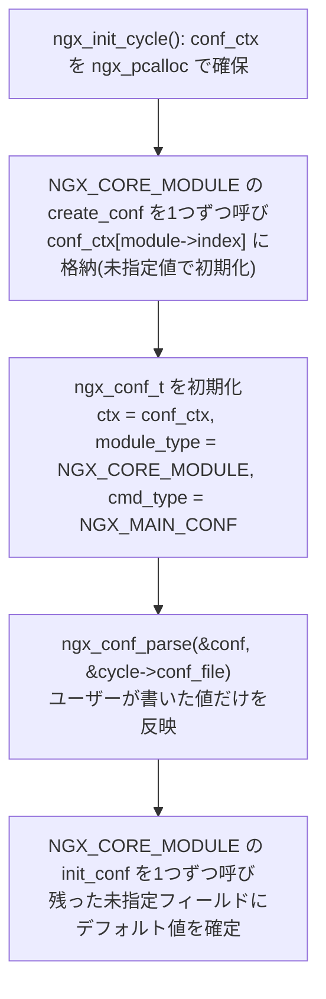
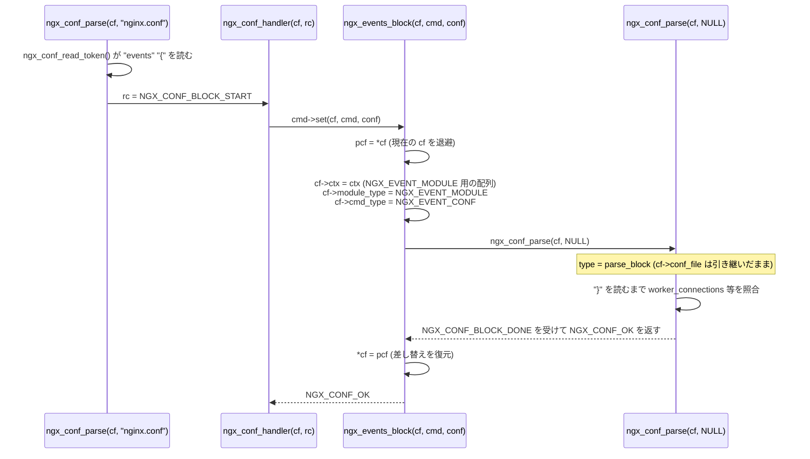

# 第5章 設定ファイルのパース

> **本章で読むソース**
>
> - [`src/core/ngx_conf_file.h`](https://github.com/nginx/nginx/blob/release-1.31.2/src/core/ngx_conf_file.h)
> - [`src/core/ngx_conf_file.c`](https://github.com/nginx/nginx/blob/release-1.31.2/src/core/ngx_conf_file.c)
> - [`src/core/ngx_cycle.c`](https://github.com/nginx/nginx/blob/release-1.31.2/src/core/ngx_cycle.c)
> - [`src/event/ngx_event.c`](https://github.com/nginx/nginx/blob/release-1.31.2/src/event/ngx_event.c)

## この章の狙い

前章では、モジュールが `ngx_command_t` の配列でディレクティブを宣言し、`conf` と `offset` の組み合わせで書き込み先を指定する仕組みを読んだ。
本章では、その `ngx_command_t` を実際に消費する側、つまり `nginx.conf` のテキストをどう読み、どうディレクティブ呼び出しへ変換するかを追う。

中心になるのは3つの関数である。
`ngx_conf_parse()` は設定ファイル（またはブロックの内側）を1個のまとまりとして解析するループを持ち、`ngx_conf_read_token()` を繰り返し呼んでトークンを集め、集まったトークン列を `ngx_conf_handler()` に渡す。
`ngx_conf_read_token()` は1文字ずつバッファを読み進める**字句解析**器であり、空白、セミコロン、波かっこ、引用符、コメントを区切りとして `cf->args` に**トークン**を積む。
`ngx_conf_handler()` は集まったトークン列の先頭を名前として全モジュールの `commands` 配列から照合し、一致したディレクティブの `set` コールバックを呼ぶ。

`events { ... }` や `http { ... }` のようなブロックディレクティブは、`set` コールバックの中で `ngx_conf_parse()` を自分自身にもう一度呼び出すことでブロックの中身を解析する。
この再帰の際に `cf->ctx` と `cf->module_type` を差し替えることで、ブロックの内側だけ別の型のモジュール群が有効になる。
本章では、`ngx_init_cycle()` がこの一連の解析をどう起動するかから始め、字句解析、ディレクティブ照合、ブロックの再帰、`include` ディレクティブによるファイル分割までを順に読む。

## 前提

- 第2章の[モジュールアーキテクチャ](../part00-overview/02-module-architecture.md)（`ngx_module_t`、`ngx_command_t`、`conf`/`offset` によるデータ駆動の書き込み）を理解していること。

## 設定パースの全体像

設定のパースは単独の関数呼び出しではなく、**cycle**（起動時や設定リロード時に生成される実行コンテキストであり、詳細は第1章で扱った）の初期化手順の一部として組み込まれている。
`ngx_init_cycle()` は、パースを始める前にまず設定を書き込む先の領域を確保する。

[`src/core/ngx_cycle.c` L200-L204](https://github.com/nginx/nginx/blob/release-1.31.2/src/core/ngx_cycle.c#L200-L204)

```c
    cycle->conf_ctx = ngx_pcalloc(pool, ngx_max_module * sizeof(void *));
    if (cycle->conf_ctx == NULL) {
        ngx_destroy_pool(pool);
        return NULL;
    }
```

`cycle->conf_ctx` は `ngx_module_t.index` を添字とする配列であり、モジュール1個につき1個の設定構造体へのポインタを保持する。
この時点では中身は空である。

続いて `ngx_init_cycle()` は、`NGX_CORE_MODULE` 型のモジュールだけを対象に `create_conf` を呼び、結果を `conf_ctx` へ格納する。

[`src/core/ngx_cycle.c` L233-L248](https://github.com/nginx/nginx/blob/release-1.31.2/src/core/ngx_cycle.c#L233-L248)

```c
    for (i = 0; cycle->modules[i]; i++) {
        if (cycle->modules[i]->type != NGX_CORE_MODULE) {
            continue;
        }

        module = cycle->modules[i]->ctx;

        if (module->create_conf) {
            rv = module->create_conf(cycle);
            if (rv == NULL) {
                ngx_destroy_pool(pool);
                return NULL;
            }
            cycle->conf_ctx[cycle->modules[i]->index] = rv;
        }
    }
```

`create_conf` は各モジュールの設定構造体を確保し、フィールドを `NGX_CONF_UNSET` などの「未指定」を表す値で初期化する役割を持つ。
これによって、設定ファイルに書かれなかったディレクティブのフィールドと、明示的に指定されたフィールドを、パース後に区別できるようになる。

`create_conf` が一通り終わると、パーサの状態を表す `ngx_conf_t` を組み立てて `ngx_conf_parse()` を呼ぶ。

[`src/core/ngx_cycle.c` L254-L274](https://github.com/nginx/nginx/blob/release-1.31.2/src/core/ngx_cycle.c#L254-L274)

```c
    ngx_memzero(&conf, sizeof(ngx_conf_t));
    /* STUB: init array ? */
    conf.args = ngx_array_create(pool, 10, sizeof(ngx_str_t));
    if (conf.args == NULL) {
        ngx_destroy_pool(pool);
        return NULL;
    }

    conf.temp_pool = ngx_create_pool(NGX_CYCLE_POOL_SIZE, log);
    if (conf.temp_pool == NULL) {
        ngx_destroy_pool(pool);
        return NULL;
    }


    conf.ctx = cycle->conf_ctx;
    conf.cycle = cycle;
    conf.pool = pool;
    conf.log = log;
    conf.module_type = NGX_CORE_MODULE;
    conf.cmd_type = NGX_MAIN_CONF;
```

[`src/core/ngx_cycle.c` L280-L290](https://github.com/nginx/nginx/blob/release-1.31.2/src/core/ngx_cycle.c#L280-L290)

```c
    if (ngx_conf_param(&conf) != NGX_CONF_OK) {
        environ = senv;
        ngx_destroy_cycle_pools(&conf);
        return NULL;
    }

    if (ngx_conf_parse(&conf, &cycle->conf_file) != NGX_CONF_OK) {
        environ = senv;
        ngx_destroy_cycle_pools(&conf);
        return NULL;
    }
```

`conf.ctx` には `cycle->conf_ctx`（全 `NGX_CORE_MODULE` の設定構造体の配列）を渡し、`conf.module_type` には `NGX_CORE_MODULE` を、`conf.cmd_type` には `NGX_MAIN_CONF`（ファイルの最上位に書けるディレクティブを示すフラグ）を渡す。
これらのフィールドの意味は次節で扱う。
`ngx_conf_param()` はコマンドライン `-g` オプションの文字列をあらかじめ解析するための呼び出しであり、`ngx_conf_parse()` を空のファイル名で呼ぶことで、ファイルを介さずに同じパーサを再利用する。
`ngx_conf_parse(&conf, &cycle->conf_file)` が本題であり、これが `nginx.conf` 全体を読み切るまで戻らない。

パースが正常に終わると、今度は `init_conf` を `NGX_CORE_MODULE` ごとに呼ぶ。

[`src/core/ngx_cycle.c` L297-L314](https://github.com/nginx/nginx/blob/release-1.31.2/src/core/ngx_cycle.c#L297-L314)

```c
    for (i = 0; cycle->modules[i]; i++) {
        if (cycle->modules[i]->type != NGX_CORE_MODULE) {
            continue;
        }

        module = cycle->modules[i]->ctx;

        if (module->init_conf) {
            if (module->init_conf(cycle,
                                  cycle->conf_ctx[cycle->modules[i]->index])
                == NGX_CONF_ERROR)
            {
                environ = senv;
                ngx_destroy_cycle_pools(&conf);
                return NULL;
            }
        }
    }
```

`init_conf` は、`create_conf` が `NGX_CONF_UNSET` のまま残したフィールドに、ハードコードされたデフォルト値を埋める。
つまり `create_conf` → `ngx_conf_parse()` → `init_conf` という3段階を経て初めて、設定構造体のすべてのフィールドが確定した状態になる。
`ngx_conf_parse()` の役割は、この3段階のちょうど真ん中、「ユーザーが明示的に書いた値だけを構造体へ反映する」段階を担うことである。



## ngx_conf_t：パーサの状態を保持する構造体

`ngx_conf_parse()` と `ngx_conf_read_token()` と `ngx_conf_handler()` は、それぞれ別の関数でありながら1個の `ngx_conf_t` を介して状態を共有する。

[`src/core/ngx_conf_file.h` L116-L132](https://github.com/nginx/nginx/blob/release-1.31.2/src/core/ngx_conf_file.h#L116-L132)

```c
struct ngx_conf_s {
    char                 *name;
    ngx_array_t          *args;

    ngx_cycle_t          *cycle;
    ngx_pool_t           *pool;
    ngx_pool_t           *temp_pool;
    ngx_conf_file_t      *conf_file;
    ngx_log_t            *log;

    void                 *ctx;
    ngx_uint_t            module_type;
    ngx_uint_t            cmd_type;

    ngx_conf_handler_pt   handler;
    void                 *handler_conf;
};
```

`args` は現在読み取り中のディレクティブのトークン列を保持する `ngx_array_t` であり、`ngx_conf_read_token()` がここへ単語を積み、`ngx_conf_handler()` が先頭要素をディレクティブ名として読む。
`pool` はディレクティブの引数文字列など、パース後も設定構造体から参照され続けるデータを確保する場所であり、`cycle->pool` そのものが渡される。
`temp_pool` はパース作業中だけ必要な一時領域であり、パースが終わった時点で破棄される（`ngx_cycle.c` の `ngx_init_cycle()` は成功時に `ngx_destroy_pool(conf.temp_pool)` を呼ぶ）。
`pool` と `temp_pool` を分けているのは、パース結果として生き残るデータと、パース中だけ使い捨てるデータの寿命が異なるためである（両者の実装である `ngx_pool_t` そのものは第3章のメモリプールとバッファで扱う）。

`conf_file` は現在解析中のファイル（バッファと行番号）を指す。
`ctx` と `module_type` と `cmd_type` の3個は、今どのブロックの内側にいるかを表す状態であり、ブロックへ入るたびに差し替わる。
`ctx` は現在のブロックに属するモジュール群の設定構造体の配列を指し、`module_type` はそのブロックの内側で有効なモジュールの型（`NGX_CORE_MODULE`、`NGX_EVENT_MODULE`、`NGX_HTTP_MODULE` など）を、`cmd_type` はディレクティブの `type` フィールドと照合するコンテキストフラグ（`NGX_MAIN_CONF`、`NGX_EVENT_CONF` など）を表す。
この3個をどう差し替えるかは、後述の「ブロックと再帰」で読む。

`handler` と `handler_conf` は、`ngx_command_t` による通常の名前照合を迂回するための脱出口である。
`ngx_conf_parse()` はこのフィールドが設定されている間、`ngx_conf_handler()` を経由せず、読み取った1行をそのまま `handler` へ渡す。
これは、`http` の `types { text/html html; ... }` のように、ブロックの中身が個々の登録済みディレクティブの並びではなく、任意の行として解釈すべき構文を持つ場合に使われる（該当箇所はコード中のコメントで明示されている）。

## ngx_conf_read_token：1文字ずつの字句解析

`ngx_conf_read_token()` は、`ngx_conf_parse()` のループから毎回1回呼ばれ、次の1個のディレクティブ分のトークン列を `cf->args` に積んで返る。

[`src/core/ngx_conf_file.c` L502-L527](https://github.com/nginx/nginx/blob/release-1.31.2/src/core/ngx_conf_file.c#L502-L527)

```c
static ngx_int_t
ngx_conf_read_token(ngx_conf_t *cf)
{
    u_char      *start, ch, *src, *dst;
    off_t        file_size;
    size_t       len;
    ssize_t      n, size;
    ngx_uint_t   found, need_space, last_space, sharp_comment, variable;
    ngx_uint_t   quoted, s_quoted, d_quoted, start_line;
    ngx_str_t   *word;
    ngx_buf_t   *b, *dump;

    found = 0;
    need_space = 0;
    last_space = 1;
    sharp_comment = 0;
    variable = 0;
    quoted = 0;
    s_quoted = 0;
    d_quoted = 0;

    cf->args->nelts = 0;
    b = cf->conf_file->buffer;
    dump = cf->conf_file->dump;
    start = b->pos;
    start_line = cf->conf_file->line;
```

`cf->args->nelts = 0` によって呼び出しのたびに前回のトークン列を捨て、同じ配列を使い回す。
`last_space` は「直前の文字が空白または区切り文字だったか」を表すフラグであり、これが真の間は新しいトークンの先頭を探す状態、偽の間はトークンの内部を読み進める状態を意味する。
`sharp_comment` は `#` コメントの内側、`s_quoted`/`d_quoted` はシングルクォートまたはダブルクォートの内側、`quoted` はバックスラッシュ直後の1文字をエスケープする状態を表す。
バッファが尽きたときにファイルから読み増す処理があるが、そこは本章末の「高速化の工夫」でまとめて扱う。

ここでは、バッファから取り出した1文字 `ch` をどう分類するかを読む。

[`src/core/ngx_conf_file.c` L613-L656](https://github.com/nginx/nginx/blob/release-1.31.2/src/core/ngx_conf_file.c#L613-L656)

```c
        ch = *b->pos++;

        if (ch == LF) {
            cf->conf_file->line++;

            if (sharp_comment) {
                sharp_comment = 0;
            }
        }

        if (sharp_comment) {
            continue;
        }

        if (quoted) {
            quoted = 0;
            continue;
        }

        if (need_space) {
            if (ch == ' ' || ch == '\t' || ch == CR || ch == LF) {
                last_space = 1;
                need_space = 0;
                continue;
            }

            if (ch == ';') {
                return NGX_OK;
            }

            if (ch == '{') {
                return NGX_CONF_BLOCK_START;
            }

            if (ch == ')') {
                last_space = 1;
                need_space = 0;

            } else {
                ngx_conf_log_error(NGX_LOG_EMERG, cf, 0,
                                   "unexpected \"%c\"", ch);
                return NGX_ERROR;
            }
        }
```

改行なら行番号を進め、コメントの内側なら読み捨て、エスケープ直後の1文字なら無条件に読み飛ばす。
`need_space` は、引用符付きトークンが閉じた直後など「次は空白か区切り文字が来るはずだ」という状態を表し、ここで空白以外の文字（`)` を除く）が来たら構文エラーになる。

ここまでのどれにも該当しなければ、`last_space` の値によって2方向に分岐する。
`last_space` が真、つまり新しいトークンの先頭にいる場合は次のように処理する。

[`src/core/ngx_conf_file.c` L658-L720](https://github.com/nginx/nginx/blob/release-1.31.2/src/core/ngx_conf_file.c#L658-L720)

```c
        if (last_space) {

            start = b->pos - 1;
            start_line = cf->conf_file->line;

            if (ch == ' ' || ch == '\t' || ch == CR || ch == LF) {
                continue;
            }

            switch (ch) {

            case ';':
            case '{':
                if (cf->args->nelts == 0) {
                    ngx_conf_log_error(NGX_LOG_EMERG, cf, 0,
                                       "unexpected \"%c\"", ch);
                    return NGX_ERROR;
                }

                if (ch == '{') {
                    return NGX_CONF_BLOCK_START;
                }

                return NGX_OK;

            case '}':
                if (cf->args->nelts != 0) {
                    ngx_conf_log_error(NGX_LOG_EMERG, cf, 0,
                                       "unexpected \"}\"");
                    return NGX_ERROR;
                }

                return NGX_CONF_BLOCK_DONE;

            case '#':
                sharp_comment = 1;
                continue;

            case '\\':
                quoted = 1;
                last_space = 0;
                continue;

            case '"':
                start++;
                d_quoted = 1;
                last_space = 0;
                continue;

            case '\'':
                start++;
                s_quoted = 1;
                last_space = 0;
                continue;

            case '$':
                variable = 1;
                last_space = 0;
                continue;

            default:
                last_space = 0;
            }
```

トークンの先頭では、`start` を現在位置に更新してから文字を見る。
`;` と `{` は、それまでに集めたトークンが1個もなければ構文エラーであり、あれば `NGX_OK` または `NGX_CONF_BLOCK_START` を返して呼び出し元（`ngx_conf_parse()`）に制御を戻す。
`}` は逆にトークンが0個のときだけ許され、`NGX_CONF_BLOCK_DONE` を返す。
`"` と `'` は `start` を1個進めて引用符自体をトークンに含めないようにし、以後は `d_quoted`/`s_quoted` の状態で読み進める。
`default` に落ちた場合、つまり通常の文字であれば `last_space = 0` にしてトークンの内部へ進む。

`last_space` が偽、つまりトークンの内部にいる場合は次の分岐に入る。

[`src/core/ngx_conf_file.c` L722-L815](https://github.com/nginx/nginx/blob/release-1.31.2/src/core/ngx_conf_file.c#L722-L815)

```c
        } else {
            if (ch == '{' && variable) {
                continue;
            }

            variable = 0;

            if (ch == '\\') {
                quoted = 1;
                continue;
            }

            if (ch == '$') {
                variable = 1;
                continue;
            }

            if (d_quoted) {
                if (ch == '"') {
                    d_quoted = 0;
                    need_space = 1;
                    found = 1;
                }

            } else if (s_quoted) {
                if (ch == '\'') {
                    s_quoted = 0;
                    need_space = 1;
                    found = 1;
                }

            } else if (ch == ' ' || ch == '\t' || ch == CR || ch == LF
                       || ch == ';' || ch == '{')
            {
                last_space = 1;
                found = 1;
            }

            if (found) {
                word = ngx_array_push(cf->args);
                if (word == NULL) {
                    return NGX_ERROR;
                }

                word->data = ngx_pnalloc(cf->pool, b->pos - 1 - start + 1);
                if (word->data == NULL) {
                    return NGX_ERROR;
                }

                for (dst = word->data, src = start, len = 0;
                     src < b->pos - 1;
                     len++)
                {
                    if (*src == '\\') {
                        switch (src[1]) {
                        case '"':
                        case '\'':
                        case '\\':
                            src++;
                            break;

                        case 't':
                            *dst++ = '\t';
                            src += 2;
                            continue;

                        case 'r':
                            *dst++ = '\r';
                            src += 2;
                            continue;

                        case 'n':
                            *dst++ = '\n';
                            src += 2;
                            continue;
                        }

                    }
                    *dst++ = *src++;
                }
                *dst = '\0';
                word->len = len;

                if (ch == ';') {
                    return NGX_OK;
                }

                if (ch == '{') {
                    return NGX_CONF_BLOCK_START;
                }

                found = 0;
            }
        }
```

トークンの内部では、引用符の外なら空白、`;`、`{` のいずれかがトークンの終端であり、引用符の内側なら対応する引用符自身だけが終端である。
`found` が立った時点で、`start` から現在位置までの生の文字列を `word->data`（`cf->pool` に確保）へコピーしながら、`\"`、`\'`、`\\`、`\t`、`\r`、`\n` の6種類のエスケープシーケンスを解決する。
`word->data` の確保は `cf->pool` を使う点に注意する。
トークンは設定構造体のフィールド（たとえば `ngx_str_t` の `server_name` の値）へそのまま代入されることが多く、パース後も参照され続けるため、パース中だけの `cf->temp_pool` ではなく寿命の長い `cf->pool` に置く必要がある。
最後にコピーし終えた `ch` が `;` なら `NGX_OK`、`{` なら `NGX_CONF_BLOCK_START` を返し、それ以外（空白など）ならトークンをもう1個続けて読むためにループへ戻る。

このように `ngx_conf_read_token()` は、正規表現エンジンや専用の状態遷移テーブルを使わず、`last_space` を中心とした数個のフラグと1個の `switch` だけで、空白区切り、引用符、エスケープ、コメント、ブロック境界を1パスで処理する。

## ngx_conf_handler：ディレクティブの照合とディスパッチ

`ngx_conf_read_token()` が1個のディレクティブ分のトークン列を返すと、`ngx_conf_parse()` はまず `cf->handler` の有無を見て、次にどちらの経路へ渡すかを決める。

[`src/core/ngx_conf_file.c` L292-L324](https://github.com/nginx/nginx/blob/release-1.31.2/src/core/ngx_conf_file.c#L292-L324)

```c
        if (cf->handler) {

            /*
             * the custom handler, i.e., that is used in the http's
             * "types { ... }" directive
             */

            if (rc == NGX_CONF_BLOCK_START) {
                ngx_conf_log_error(NGX_LOG_EMERG, cf, 0, "unexpected \"{\"");
                goto failed;
            }

            rv = (*cf->handler)(cf, NULL, cf->handler_conf);
            if (rv == NGX_CONF_OK) {
                continue;
            }

            if (rv == NGX_CONF_ERROR) {
                goto failed;
            }

            ngx_conf_log_error(NGX_LOG_EMERG, cf, 0, "%s", rv);

            goto failed;
        }


        rc = ngx_conf_handler(cf, rc);

        if (rc == NGX_ERROR) {
            goto failed;
        }
    }
```

`cf->handler` が設定されていなければ、通常の経路である `ngx_conf_handler(cf, rc)` を呼ぶ。
`rc` にはこの時点で `NGX_OK`（`;` で終端）か `NGX_CONF_BLOCK_START`（`{` で終端）のどちらかが入っており、`ngx_conf_handler()` はこれを「ディレクティブが `;` で終わったか `{` で終わったか」の判定に使う。

`ngx_conf_handler()` は、まず `cf->args` の先頭要素をディレクティブ名として、全モジュールの `commands` 配列を先頭から線形に照合する。

[`src/core/ngx_conf_file.c` L355-L397](https://github.com/nginx/nginx/blob/release-1.31.2/src/core/ngx_conf_file.c#L355-L397)

```c
static ngx_int_t
ngx_conf_handler(ngx_conf_t *cf, ngx_int_t last)
{
    char           *rv;
    void           *conf, **confp;
    ngx_uint_t      i, found;
    ngx_str_t      *name;
    ngx_command_t  *cmd;

    name = cf->args->elts;

    found = 0;

    for (i = 0; cf->cycle->modules[i]; i++) {

        cmd = cf->cycle->modules[i]->commands;
        if (cmd == NULL) {
            continue;
        }

        for ( /* void */ ; cmd->name.len; cmd++) {

            if (name->len != cmd->name.len) {
                continue;
            }

            if (ngx_strcmp(name->data, cmd->name.data) != 0) {
                continue;
            }

            found = 1;

            if (cf->cycle->modules[i]->type != NGX_CONF_MODULE
                && cf->cycle->modules[i]->type != cf->module_type)
            {
                continue;
            }

            /* is the directive's location right ? */

            if (!(cmd->type & cf->cmd_type)) {
                continue;
            }
```

名前が一致しても、そのモジュールの `type` が `NGX_CONF_MODULE`（`include` を宣言する `ngx_conf_module` の型であり、どの `module_type` の内側でも常に許可される）でなく、かつ `cf->module_type` とも一致しなければ、このディレクティブは今のブロックでは無効として次の候補を探す。
続けて `cmd->type & cf->cmd_type` を見て、ディレクティブが今のコンテキスト（`NGX_MAIN_CONF` や `NGX_EVENT_CONF` など）に書けるかを確認する。
この2段の判定が、「同じ名前のディレクティブでも `http {}` の中と `stream {}` の中で別の実装が呼ばれる」ような使い分けを支えている。

コンテキストが正しいと確認できたら、終端文字と引数の個数を検査する。

[`src/core/ngx_conf_file.c` L48-L59](https://github.com/nginx/nginx/blob/release-1.31.2/src/core/ngx_conf_file.c#L48-L59)

```c
/* The eight fixed arguments */

static ngx_uint_t argument_number[] = {
    NGX_CONF_NOARGS,
    NGX_CONF_TAKE1,
    NGX_CONF_TAKE2,
    NGX_CONF_TAKE3,
    NGX_CONF_TAKE4,
    NGX_CONF_TAKE5,
    NGX_CONF_TAKE6,
    NGX_CONF_TAKE7
};
```

[`src/core/ngx_conf_file.c` L399-L443](https://github.com/nginx/nginx/blob/release-1.31.2/src/core/ngx_conf_file.c#L399-L443)

```c
            if (!(cmd->type & NGX_CONF_BLOCK) && last != NGX_OK) {
                ngx_conf_log_error(NGX_LOG_EMERG, cf, 0,
                                  "directive \"%s\" is not terminated by \";\"",
                                  name->data);
                return NGX_ERROR;
            }

            if ((cmd->type & NGX_CONF_BLOCK) && last != NGX_CONF_BLOCK_START) {
                ngx_conf_log_error(NGX_LOG_EMERG, cf, 0,
                                   "directive \"%s\" has no opening \"{\"",
                                   name->data);
                return NGX_ERROR;
            }

            /* is the directive's argument count right ? */

            if (!(cmd->type & NGX_CONF_ANY)) {

                if (cmd->type & NGX_CONF_FLAG) {

                    if (cf->args->nelts != 2) {
                        goto invalid;
                    }

                } else if (cmd->type & NGX_CONF_1MORE) {

                    if (cf->args->nelts < 2) {
                        goto invalid;
                    }

                } else if (cmd->type & NGX_CONF_2MORE) {

                    if (cf->args->nelts < 3) {
                        goto invalid;
                    }

                } else if (cf->args->nelts > NGX_CONF_MAX_ARGS) {

                    goto invalid;

                } else if (!(cmd->type & argument_number[cf->args->nelts - 1]))
                {
                    goto invalid;
                }
            }
```

`NGX_CONF_BLOCK` を持たないディレクティブが `{` で終わっていたり、逆に `NGX_CONF_BLOCK` を持つディレクティブが `{` を伴わなかったりすれば、ここでエラーになる。
引数の個数は `NGX_CONF_FLAG`（真偽値、必ず2要素）、`NGX_CONF_1MORE`/`NGX_CONF_2MORE`（以上）、それ以外は `argument_number[]` を使って `NGX_CONF_TAKE1`〜`NGX_CONF_TAKE7` のビットと突き合わせる。
名前の照合、型とコンテキストの検査、引数の個数の検査が済んだ後、`cmd->conf` と `cmd->offset` を使って書き込み先の設定構造体を求め、`cmd->set(cf, cmd, conf)` を呼ぶ部分は、第2章の[モジュールアーキテクチャ](../part00-overview/02-module-architecture.md)で読んだとおりである。

## ブロックと再帰

`ngx_conf_read_token()` の戻り値は5種類あり、その値がそのまま `ngx_conf_parse()` の制御フローを決める。

[`src/core/ngx_conf_file.h` L63-L71](https://github.com/nginx/nginx/blob/release-1.31.2/src/core/ngx_conf_file.h#L63-L71)

```c
#define NGX_CONF_OK          NULL
#define NGX_CONF_ERROR       (void *) -1

#define NGX_CONF_BLOCK_START 1
#define NGX_CONF_BLOCK_DONE  2
#define NGX_CONF_FILE_DONE   3

#define NGX_CORE_MODULE      0x45524F43  /* "CORE" */
#define NGX_CONF_MODULE      0x464E4F43  /* "CONF" */
```

`ngx_conf_parse()` はこれらの戻り値を、今どんな呼ばれ方をしているかに応じて解釈する。
呼ばれ方は3種類あり、関数の冒頭で `type` というローカルな enum に区別される。

[`src/core/ngx_conf_file.c` L176-L239](https://github.com/nginx/nginx/blob/release-1.31.2/src/core/ngx_conf_file.c#L176-L239)

```c
    if (filename) {

        /* open configuration file */

        // ... (中略。fd のオープンと読み込みバッファ buf の初期化) ...

        type = parse_file;

        // ... (中略。ngx_dump_config が真のとき設定内容をダンプ用バッファへ複製登録する処理) ...

    } else if (cf->conf_file->file.fd != NGX_INVALID_FILE) {

        type = parse_block;

    } else {
        type = parse_param;
    }
```

`filename` が渡されれば新しいファイルを開く `parse_file`（トップレベルの `nginx.conf` や `include` で開くファイルがこれにあたる）。
`filename` が `NULL` でも既存のファイルを読んでいる途中（`cf->conf_file->file.fd` が有効）なら `parse_block`（ブロックディレクティブの内側を読む再帰呼び出し）。
どちらでもなければ `-g` オプションの文字列を読む `parse_param` である。
`type` の違いは、以下のメインループで `}` や EOF をどう扱うかに直結する。

[`src/core/ngx_conf_file.c` L242-L290](https://github.com/nginx/nginx/blob/release-1.31.2/src/core/ngx_conf_file.c#L242-L290)

```c
    for ( ;; ) {
        rc = ngx_conf_read_token(cf);

        /*
         * ngx_conf_read_token() may return
         *
         *    NGX_ERROR             there is error
         *    NGX_OK                the token terminated by ";" was found
         *    NGX_CONF_BLOCK_START  the token terminated by "{" was found
         *    NGX_CONF_BLOCK_DONE   the "}" was found
         *    NGX_CONF_FILE_DONE    the configuration file is done
         */

        if (rc == NGX_ERROR) {
            goto done;
        }

        if (rc == NGX_CONF_BLOCK_DONE) {

            if (type != parse_block) {
                ngx_conf_log_error(NGX_LOG_EMERG, cf, 0, "unexpected \"}\"");
                goto failed;
            }

            goto done;
        }

        if (rc == NGX_CONF_FILE_DONE) {

            if (type == parse_block) {
                ngx_conf_log_error(NGX_LOG_EMERG, cf, 0,
                                   "unexpected end of file, expecting \"}\"");
                goto failed;
            }

            goto done;
        }

        if (rc == NGX_CONF_BLOCK_START) {

            if (type == parse_param) {
                ngx_conf_log_error(NGX_LOG_EMERG, cf, 0,
                                   "block directives are not supported "
                                   "in -g option");
                goto failed;
            }
        }

        /* rc == NGX_OK || rc == NGX_CONF_BLOCK_START */
```

`NGX_CONF_BLOCK_DONE`（`}` を読んだ）は、`parse_block` として呼ばれているときだけ正常終了であり、トップレベルの `parse_file` で `}` が来れば「対応する `{` がない」構文エラーになる。
逆に `NGX_CONF_FILE_DONE`（ファイル終端）は `parse_block` の最中に来ると「`}` を書き忘れている」エラーになる。
`rc == NGX_CONF_BLOCK_START`（`{` を読んだ）は、この時点ではまだエラーにせず、直後の `ngx_conf_handler()` に処理を委ねる。
`ngx_conf_handler()` は、ディレクティブの `cmd->type` に `NGX_CONF_BLOCK` が立っていて、かつ `cmd->set` がブロック開始を正しく扱えるものであることを前提に `cmd->set(cf, cmd, conf)` を呼ぶ。

ブロックディレクティブの `set` コールバックは、`ngx_conf_parse()` をもう一度呼ぶことでブロックの中身を解析する。
`events {}` を例に取ると、`ngx_events_block()` がそれにあたる。

[`src/event/ngx_event.c` L1031-L1042](https://github.com/nginx/nginx/blob/release-1.31.2/src/event/ngx_event.c#L1031-L1042)

```c
    pcf = *cf;
    cf->ctx = ctx;
    cf->module_type = NGX_EVENT_MODULE;
    cf->cmd_type = NGX_EVENT_CONF;

    rv = ngx_conf_parse(cf, NULL);

    *cf = pcf;

    if (rv != NGX_CONF_OK) {
        return rv;
    }
```

`ngx_events_block()` は、この直前で `ngx_count_modules(cf->cycle, NGX_EVENT_MODULE)` を使って `NGX_EVENT_MODULE` 型のモジュール数を数え、その数だけの `void *` 配列 `ctx` を確保して各モジュールの `create_conf` を呼んでいる（この採番と配列確保は第2章で読んだ）。
ここではその `ctx` を `cf->ctx` に差し替え、`cf->module_type` を `NGX_EVENT_MODULE` に、`cf->cmd_type` を `NGX_EVENT_CONF` に差し替えてから `ngx_conf_parse(cf, NULL)` を呼ぶ。
`filename` が `NULL` で `cf->conf_file->file.fd` は開いたままなので、この再帰呼び出しは前述の `parse_block` として実行され、`}` に出会うまで `worker_connections` や `use` などのディレクティブを、今度は `NGX_EVENT_MODULE` の `commands` から照合していく。
再帰から戻ったら `*cf = pcf` で差し替え前の状態（元の `ctx`、`module_type`、`cmd_type`）を復元し、呼び出し元の `parse_file` ループはブロックの外側を読み進める。

`cf` という1個の構造体を、呼び出し前の値を退避してから書き換え、戻るときに復元するこの手順によって、ブロックの入れ子がどれだけ深くなっても、各階層は自分がどの型のモジュール群を相手にしているかを `cf->ctx`/`cf->module_type`/`cf->cmd_type` の3個のフィールドだけで把握できる。
`ngx_conf_parse()` 自身は再帰しているという自覚を持たず、渡された `cf` の状態に従って同じループを回しているだけである。



ループを抜けたときの後始末も、この入れ子構造を支えている。

[`src/core/ngx_conf_file.c` L326-L352](https://github.com/nginx/nginx/blob/release-1.31.2/src/core/ngx_conf_file.c#L326-L352)

```c
failed:

    rc = NGX_ERROR;

done:

    if (filename) {
        if (cf->conf_file->buffer->start) {
            ngx_free(cf->conf_file->buffer->start);
        }

        if (ngx_close_file(fd) == NGX_FILE_ERROR) {
            ngx_log_error(NGX_LOG_ALERT, cf->log, ngx_errno,
                          ngx_close_file_n " %s failed",
                          filename->data);
            rc = NGX_ERROR;
        }

        cf->conf_file = prev;
    }

    if (rc == NGX_ERROR) {
        return NGX_CONF_ERROR;
    }

    return NGX_CONF_OK;
}
```

`filename` が渡されていた（つまり `parse_file` として新しいファイルを開いていた）場合だけ、読み込みバッファを解放してファイルディスクリプタを閉じ、`cf->conf_file` を呼び出し前の値（`prev`）へ戻す。
`parse_block` として呼ばれた場合はファイルを開いていないので、この後始末は素通りし、`cf->conf_file` は呼び出し元と共有されたままになる。

## include ディレクティブと glob 展開

`include` はモジュールのディレクティブではなく、パーサ自身が属する `ngx_conf_module` が宣言する、唯一の組み込みディレクティブである。

[`src/core/ngx_conf_file.c` L19-L45](https://github.com/nginx/nginx/blob/release-1.31.2/src/core/ngx_conf_file.c#L19-L45)

```c
static ngx_command_t  ngx_conf_commands[] = {

    { ngx_string("include"),
      NGX_ANY_CONF|NGX_CONF_TAKE1,
      ngx_conf_include,
      0,
      0,
      NULL },

      ngx_null_command
};


ngx_module_t  ngx_conf_module = {
    NGX_MODULE_V1,
    NULL,                                  /* module context */
    ngx_conf_commands,                     /* module directives */
    NGX_CONF_MODULE,                       /* module type */
    NULL,                                  /* init master */
    NULL,                                  /* init module */
    NULL,                                  /* init process */
    NULL,                                  /* init thread */
    NULL,                                  /* exit thread */
    ngx_conf_flush_files,                  /* exit process */
    NULL,                                  /* exit master */
    NGX_MODULE_V1_PADDING
};
```

`include` の `type` は `NGX_ANY_CONF`（どのコンテキストでも許可）であり、`ngx_conf_module` の `type` は `NGX_CONF_MODULE` である。
前節の `ngx_conf_handler()` が持つ「モジュールの型が `NGX_CONF_MODULE` なら `cf->module_type` の一致を求めない」という特別扱いのおかげで、`include` は `http {}` の中でも `events {}` の中でも `server {}` の中でも同じ1個の `ngx_command_t` で扱える。

`ngx_conf_include()` は自分自身の `set` コールバックであり、渡されたパス（ワイルドカードを含んでよい）を新しい `ngx_conf_parse()` の呼び出しへ変換する。

[`src/core/ngx_conf_file.c` L820-L883](https://github.com/nginx/nginx/blob/release-1.31.2/src/core/ngx_conf_file.c#L820-L883)

```c
char *
ngx_conf_include(ngx_conf_t *cf, ngx_command_t *cmd, void *conf)
{
    char        *rv;
    ngx_int_t    n;
    ngx_str_t   *value, file, name;
    ngx_glob_t   gl;

    value = cf->args->elts;
    file = value[1];

    ngx_log_debug1(NGX_LOG_DEBUG_CORE, cf->log, 0, "include %s", file.data);

    if (ngx_conf_full_name(cf->cycle, &file, 1) != NGX_OK) {
        return NGX_CONF_ERROR;
    }

    if (strpbrk((char *) file.data, "*?[") == NULL) {

        ngx_log_debug1(NGX_LOG_DEBUG_CORE, cf->log, 0, "include %s", file.data);

        return ngx_conf_parse(cf, &file);
    }

    ngx_memzero(&gl, sizeof(ngx_glob_t));

    gl.pattern = file.data;
    gl.log = cf->log;
    gl.test = 1;

    if (ngx_open_glob(&gl) != NGX_OK) {
        ngx_conf_log_error(NGX_LOG_EMERG, cf, ngx_errno,
                           ngx_open_glob_n " \"%s\" failed", file.data);
        return NGX_CONF_ERROR;
    }

    rv = NGX_CONF_OK;

    for ( ;; ) {
        n = ngx_read_glob(&gl, &name);

        if (n != NGX_OK) {
            break;
        }

        file.len = name.len++;
        file.data = ngx_pstrdup(cf->pool, &name);
        if (file.data == NULL) {
            return NGX_CONF_ERROR;
        }

        ngx_log_debug1(NGX_LOG_DEBUG_CORE, cf->log, 0, "include %s", file.data);

        rv = ngx_conf_parse(cf, &file);

        if (rv != NGX_CONF_OK) {
            break;
        }
    }

    ngx_close_glob(&gl);

    return rv;
}
```

パスに `*`、`?`、`[` のいずれも含まなければ、`strpbrk()` が `NULL` を返すので、そのパス1個をそのまま `ngx_conf_parse(cf, &file)` に渡す。
ワイルドカードを含む場合は `ngx_open_glob()`/`ngx_read_glob()`/`ngx_close_glob()`（OS の glob 機構を薄く包んだラッパー）でマッチするパスを1個ずつ取り出し、マッチするたびに `ngx_conf_parse(cf, &file)` を呼ぶ。
複数ファイルにマッチした場合、`rv` が `NGX_CONF_OK` でなくなった時点でループを打ち切るため、途中のファイルで構文エラーがあれば以降のファイルは読まれない。

`include user.conf;` のように相対パスで書かれた場合、`ngx_conf_full_name()` が実際のパスへ展開する。

[`src/core/ngx_conf_file.c` L886-L894](https://github.com/nginx/nginx/blob/release-1.31.2/src/core/ngx_conf_file.c#L886-L894)

```c
ngx_int_t
ngx_conf_full_name(ngx_cycle_t *cycle, ngx_str_t *name, ngx_uint_t conf_prefix)
{
    ngx_str_t  *prefix;

    prefix = conf_prefix ? &cycle->conf_prefix : &cycle->prefix;

    return ngx_get_full_name(cycle->pool, prefix, name);
}
```

`ngx_conf_include()` は `conf_prefix` に `1` を渡しているため、`cycle->conf_prefix`（通常は主設定ファイルが置かれているディレクトリ）を基準にパスを解決する。
これに対して、他の多くのディレクティブは `conf_prefix` に `0` を渡し、`cycle->prefix`（インストールプレフィックス）を基準にする。
`include` だけが設定ファイル自身のディレクトリを基準にするのは、`nginx.conf` を別のディレクトリへコピーしても、`include` で分割した子ファイルとの相対関係が壊れないようにするためと考えられる。

`ngx_conf_parse(cf, &file)` として呼ばれた瞬間、`filename` が非 `NULL` になるので、前節で見た `parse_file` の経路に入る。
ここで呼び出し前の `cf->conf_file` は、`ngx_conf_parse()` 冒頭のローカル変数 `prev` に退避され、関数を抜けるときに `cf->conf_file = prev` として復元される。

[`src/core/ngx_conf_file.c` L189-L191](https://github.com/nginx/nginx/blob/release-1.31.2/src/core/ngx_conf_file.c#L189-L191)

```c
        prev = cf->conf_file;

        cf->conf_file = &conf_file;
```

これによって、`include` された子ファイルの読み込みバッファは親ファイルのバッファとは独立した領域に置かれ、子ファイルの解析が終わった時点で `cf->conf_file` は自動的に親ファイルを指す状態へ戻る。
親ファイル側のバッファは子ファイルの解析中も一切触られないため、`include` から戻った直後、親ファイルの続きは何事もなかったかのように読み進められる。

## 高速化の工夫：ngx_conf_read_token のバッファ管理

`ngx_conf_read_token()` は設定ファイルをまとめて読み込むのではなく、`NGX_CONF_BUFFER`（4096バイト）の固定バッファを使って少しずつ読む。

[`src/core/ngx_conf_file.c` L11](https://github.com/nginx/nginx/blob/release-1.31.2/src/core/ngx_conf_file.c#L11)

```c
#define NGX_CONF_BUFFER  4096
```

バッファが尽きた（`b->pos >= b->last`）ときの処理が、この章で最後に読む部分である。

[`src/core/ngx_conf_file.c` L529-L611](https://github.com/nginx/nginx/blob/release-1.31.2/src/core/ngx_conf_file.c#L529-L611)

```c
    file_size = ngx_file_size(&cf->conf_file->file.info);

    for ( ;; ) {

        if (b->pos >= b->last) {

            if (cf->conf_file->file.offset >= file_size) {

                if (cf->args->nelts > 0 || !last_space) {

                    if (cf->conf_file->file.fd == NGX_INVALID_FILE) {
                        ngx_conf_log_error(NGX_LOG_EMERG, cf, 0,
                                           "unexpected end of parameter, "
                                           "expecting \";\"");
                        return NGX_ERROR;
                    }

                    ngx_conf_log_error(NGX_LOG_EMERG, cf, 0,
                                       "unexpected end of file, "
                                       "expecting \";\" or \"}\"");
                    return NGX_ERROR;
                }

                return NGX_CONF_FILE_DONE;
            }

            len = b->pos - start;

            if (len == NGX_CONF_BUFFER) {
                cf->conf_file->line = start_line;

                if (d_quoted) {
                    ch = '"';

                } else if (s_quoted) {
                    ch = '\'';

                } else {
                    ngx_conf_log_error(NGX_LOG_EMERG, cf, 0,
                                       "too long parameter \"%*s...\" started",
                                       10, start);
                    return NGX_ERROR;
                }

                ngx_conf_log_error(NGX_LOG_EMERG, cf, 0,
                                   "too long parameter, probably "
                                   "missing terminating \"%c\" character", ch);
                return NGX_ERROR;
            }

            if (len) {
                ngx_memmove(b->start, start, len);
            }

            size = (ssize_t) (file_size - cf->conf_file->file.offset);

            if (size > b->end - (b->start + len)) {
                size = b->end - (b->start + len);
            }

            n = ngx_read_file(&cf->conf_file->file, b->start + len, size,
                              cf->conf_file->file.offset);

            if (n == NGX_ERROR) {
                return NGX_ERROR;
            }

            if (n != size) {
                ngx_conf_log_error(NGX_LOG_EMERG, cf, 0,
                                   ngx_read_file_n " returned "
                                   "only %z bytes instead of %z",
                                   n, size);
                return NGX_ERROR;
            }

            b->pos = b->start + len;
            b->last = b->pos + n;
            start = b->start;

            if (dump) {
                dump->last = ngx_cpymem(dump->last, b->pos, size);
            }
        }
```

`len = b->pos - start` は、現在読みかけのトークンのうち、すでにバッファへ読み込まれている部分の長さである（`start` はトークンの先頭、`b->pos` はバッファの終端に一致している）。
このトークンがバッファ全体（4096バイト）を占めてしまっていれば、それ以上読み進めても1個のトークンとして完結する見込みが薄いと判断し、「too long parameter」エラーで打ち切る。
そうでなければ、`ngx_memmove(b->start, start, len)` で読みかけのトークンの分だけをバッファの先頭へ詰め直し、その直後から新しいデータを `ngx_read_file()` で読み足す。

この設計の効果は2つある。
第一に、`b->pos` が指す位置さえ動かせば、`ngx_conf_read_token()` の残りのロジック（前述の文字ごとの分類）はバッファ境界をまたぐ1個のトークンと、またがない1個のトークンを区別する必要がない。
第二に、`ngx_memmove()` で移動する範囲は「読みかけのトークンの長さ」だけであり、バッファ全体でも、ファイル全体でもない。
設定ファイルの大半を占める、すでに確定した（`;` や改行で終わった）トークン群は移動の対象にならず、コピーのコストはファイルサイズにではなく個々のトークンの長さに比例する。
`ngx_read_file()` の呼び出し回数もファイルサイズを4096バイトずつ割った回数に収まり、1文字ごとに `read(2)` を呼ぶような字句解析器に比べてシステムコールの回数を大きく減らす。

## まとめ

`ngx_init_cycle()` は `conf_ctx` を確保し、`NGX_CORE_MODULE` の `create_conf` で設定構造体を未指定値のまま用意してから `ngx_conf_parse()` を起動し、パース完了後に `init_conf` でデフォルト値を確定する。
パース中の状態は `ngx_conf_t` の `ctx`/`module_type`/`cmd_type` に集約され、`ngx_conf_read_token()` が字句解析でトークン列を `cf->args` に積み、`ngx_conf_handler()` がディレクティブ名を全モジュールの `commands` から照合して `cmd->set` を呼ぶ。
`events {}` や `http {}` のようなブロックディレクティブは、`set` コールバックの中で `cf->ctx`/`cf->module_type`/`cf->cmd_type` を差し替えて `ngx_conf_parse()` を再帰させることでブロック内側の別型モジュール群を有効にし、`include` も同じ `ngx_conf_parse()` の再帰と `ngx_conf_module` の特別扱いによってファイル分割を実現する。
`ngx_conf_read_token()` は4096バイトの固定バッファと、読みかけのトークンだけを詰め直す `ngx_memmove()` によって、ファイルサイズに依存しない一定量のメモリと、バッファサイズに比例した回数の読み込みシステムコールで設定ファイル全体を読み切る。

## 関連する章

- 第2章の[モジュールアーキテクチャ](../part00-overview/02-module-architecture.md)：`ngx_module_t`、`ngx_command_t`、`conf`/`offset` によるディレクティブの書き込み先解決（本章の前提）。
- 第3章の[メモリプールとバッファ](03-memory-pool-and-buffer.md)：`cf->pool` と `cf->temp_pool` が使う `ngx_pool_t` の実装。
- 第4章の[コアデータ構造](04-core-data-structures.md)：`cf->args` として使われる `ngx_array_t` の実装。
- 第10章の[フェーズエンジンと location 検索](../part03-http/10-phase-engine-and-location.md)：`http {}` の内側で `main`/`srv`/`loc` の3階層がどう積み上がり、`merge_loc_conf` でマージされるかの詳細。
