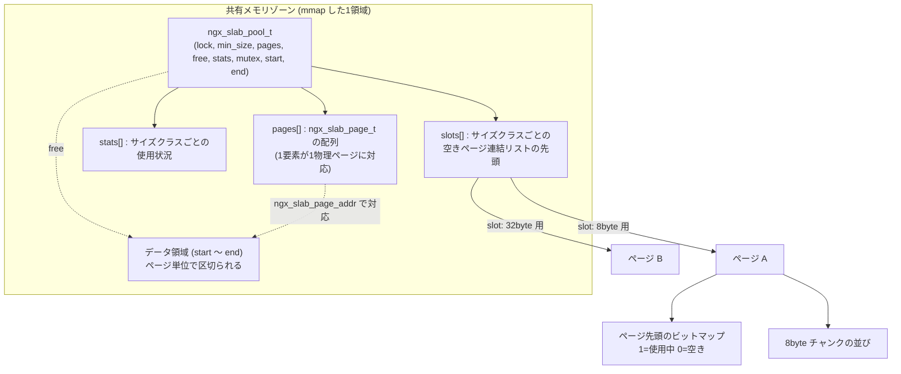

# 第6章 共有メモリとスラブアロケータ

> **本章で読むソース**
>
> - [`src/os/unix/ngx_shmem.h`](https://github.com/nginx/nginx/blob/release-1.31.2/src/os/unix/ngx_shmem.h)
> - [`src/os/unix/ngx_shmem.c`](https://github.com/nginx/nginx/blob/release-1.31.2/src/os/unix/ngx_shmem.c)
> - [`src/core/ngx_cycle.h`](https://github.com/nginx/nginx/blob/release-1.31.2/src/core/ngx_cycle.h)
> - [`src/core/ngx_cycle.c`](https://github.com/nginx/nginx/blob/release-1.31.2/src/core/ngx_cycle.c)
> - [`src/core/ngx_slab.h`](https://github.com/nginx/nginx/blob/release-1.31.2/src/core/ngx_slab.h)
> - [`src/core/ngx_slab.c`](https://github.com/nginx/nginx/blob/release-1.31.2/src/core/ngx_slab.c)
> - [`src/core/ngx_shmtx.h`](https://github.com/nginx/nginx/blob/release-1.31.2/src/core/ngx_shmtx.h)
> - [`src/core/ngx_shmtx.c`](https://github.com/nginx/nginx/blob/release-1.31.2/src/core/ngx_shmtx.c)
> - [`src/http/modules/ngx_http_limit_req_module.c`](https://github.com/nginx/nginx/blob/release-1.31.2/src/http/modules/ngx_http_limit_req_module.c)

## この章の狙い

第1章で見たとおり、nginx は master プロセスが `fork()` した複数の worker プロセスで接続を処理する。
`fork()` された各プロセスは独立したアドレス空間を持つため、第3章で扱う**メモリプール**（`ngx_pool_t`）はプロセスをまたいでは見えない。
それでも、アクセス制限のカウンタやキャッシュのインデックスのように、複数の worker が読み書きを揃えなければならない状態がある。
本章では、この worker 横断の状態を保持する**共有メモリ**の仕組みと、その領域を管理する**スラブアロケータ**（`ngx_slab_pool_t`）を読む。
`ngx_shm_alloc()` による OS レベルの確保、`ngx_shm_zone_t` によるゾーンの登録と reload をまたいだ再利用、スラブアロケータのサイズクラスとページ管理、そしてプロセス間の排他制御を行う `ngx_shmtx_t` の順に追う。

## 前提

fork、mmap、POSIX 共有メモリとセマフォといった OS の基礎知識を前提とする。
第1章で読んだプロセスモデル（master プロセスが worker プロセスを `fork()` する流れ）と、第3章で扱うメモリプールの構造を前提とする。

## worker プロセスをまたいで状態を共有する必要

`fork()` は親プロセスのアドレス空間を子プロセスに複製する。
複製された直後はページの内容が一致するが、以後どちらかのプロセスが書き込むと、その変更はコピーオンライトによって書き込んだプロセスだけのプライベートなページに閉じる。
したがって、worker プロセスがメモリプールに確保したデータを他の worker プロセスが読み書きすることはできない。

一方で、複数の worker プロセスにまたがって一貫性を保ちたい状態は珍しくない。
たとえば `limit_req_zone` ディレクティブは、クライアント単位のリクエスト回数を数えるカウンタを保持する。
このカウンタは、同じクライアントからの連続したリクエストがどの worker プロセスに割り振られても正しく積算されなければならない。
`ngx_http_limit_req_module` は、設定パース時に `ngx_shared_memory_add()` を呼んで名前付きの共有メモリ領域を確保する。

[`src/http/modules/ngx_http_limit_req_module.c` L941-L945](https://github.com/nginx/nginx/blob/release-1.31.2/src/http/modules/ngx_http_limit_req_module.c#L941-L945)

```c
    shm_zone = ngx_shared_memory_add(cf, &name, size,
                                     &ngx_http_limit_req_module);
    if (shm_zone == NULL) {
        return NGX_CONF_ERROR;
    }
```

第15章で扱う proxy キャッシュのインデックスも同じ仕組みの上に載る。
以降の節では、この `ngx_shared_memory_add()` が何を組み立てているのかを、OS レベルの確保から順に追う。

## `ngx_shm_alloc()` と3つの OS 実装

共有メモリの実体は、`ngx_shm_t` という薄い構造体で表される。

[`src/os/unix/ngx_shmem.h` L16-L22](https://github.com/nginx/nginx/blob/release-1.31.2/src/os/unix/ngx_shmem.h#L16-L22)

```c
typedef struct {
    u_char      *addr;
    size_t       size;
    ngx_str_t    name;
    ngx_log_t   *log;
    ngx_uint_t   exists;   /* unsigned  exists:1;  */
} ngx_shm_t;
```

`ngx_shm_alloc()` は、この `size` バイトの領域を実際に確保して `addr` に埋める関数である。
実装は3種類あり、`#if` による条件コンパイルでビルド環境ごとに1つだけが有効になる。
最初に評価されるのが `NGX_HAVE_MAP_ANON` で、Linux を含む多くの環境ではこの分岐が選ばれる。

[`src/os/unix/ngx_shmem.c` L12-L38](https://github.com/nginx/nginx/blob/release-1.31.2/src/os/unix/ngx_shmem.c#L12-L38)

```c
#if (NGX_HAVE_MAP_ANON)

ngx_int_t
ngx_shm_alloc(ngx_shm_t *shm)
{
    shm->addr = (u_char *) mmap(NULL, shm->size,
                                PROT_READ|PROT_WRITE,
                                MAP_ANON|MAP_SHARED, -1, 0);

    if (shm->addr == MAP_FAILED) {
        ngx_log_error(NGX_LOG_ALERT, shm->log, ngx_errno,
                      "mmap(MAP_ANON|MAP_SHARED, %uz) failed", shm->size);
        return NGX_ERROR;
    }

    return NGX_OK;
}


void
ngx_shm_free(ngx_shm_t *shm)
{
    if (munmap((void *) shm->addr, shm->size) == -1) {
        ngx_log_error(NGX_LOG_ALERT, shm->log, ngx_errno,
                      "munmap(%p, %uz) failed", shm->addr, shm->size);
    }
}
```

`mmap()` にファイルディスクリプタを渡さず `MAP_ANON`（無名マッピング）と `MAP_SHARED` を組み合わせている点が要である。
`MAP_PRIVATE` であれば `fork()` 後にコピーオンライトが働き、結局プロセスごとに別々のページになってしまう。
`MAP_SHARED` は、`fork()` した各プロセスが同じ物理ページを指し続けることを保証する。

`NGX_HAVE_MAP_ANON` が使えない環境では、`/dev/zero` をマッピングして無名マッピングを代替する。

[`src/os/unix/ngx_shmem.c` L40-L69](https://github.com/nginx/nginx/blob/release-1.31.2/src/os/unix/ngx_shmem.c#L40-L69)

```c
#elif (NGX_HAVE_MAP_DEVZERO)

ngx_int_t
ngx_shm_alloc(ngx_shm_t *shm)
{
    ngx_fd_t  fd;

    fd = open("/dev/zero", O_RDWR);

    if (fd == -1) {
        ngx_log_error(NGX_LOG_ALERT, shm->log, ngx_errno,
                      "open(\"/dev/zero\") failed");
        return NGX_ERROR;
    }

    shm->addr = (u_char *) mmap(NULL, shm->size, PROT_READ|PROT_WRITE,
                                MAP_SHARED, fd, 0);

    if (shm->addr == MAP_FAILED) {
        ngx_log_error(NGX_LOG_ALERT, shm->log, ngx_errno,
                      "mmap(/dev/zero, MAP_SHARED, %uz) failed", shm->size);
    }

    if (close(fd) == -1) {
        ngx_log_error(NGX_LOG_ALERT, shm->log, ngx_errno,
                      "close(\"/dev/zero\") failed");
    }

    return (shm->addr == MAP_FAILED) ? NGX_ERROR : NGX_OK;
}
```

`/dev/zero` を開いて渡す点以外は `MAP_ANON` 版とほぼ同じで、`mmap()` の完了直後に fd を閉じてよい点も共通する。
`mmap()` はページをカーネル内に対応づけた時点でマッピングが成立し、fd はそれ以降不要になるためである。

最後に、`mmap` 系の機能を持たない環境向けに、System V IPC の `shmget()` を使う実装が用意されている。

[`src/os/unix/ngx_shmem.c` L81-L114](https://github.com/nginx/nginx/blob/release-1.31.2/src/os/unix/ngx_shmem.c#L81-L114)

```c
#elif (NGX_HAVE_SYSVSHM)

#include <sys/ipc.h>
#include <sys/shm.h>


ngx_int_t
ngx_shm_alloc(ngx_shm_t *shm)
{
    int  id;

    id = shmget(IPC_PRIVATE, shm->size, (SHM_R|SHM_W|IPC_CREAT));

    if (id == -1) {
        ngx_log_error(NGX_LOG_ALERT, shm->log, ngx_errno,
                      "shmget(%uz) failed", shm->size);
        return NGX_ERROR;
    }

    ngx_log_debug1(NGX_LOG_DEBUG_CORE, shm->log, 0, "shmget id: %d", id);

    shm->addr = shmat(id, NULL, 0);

    if (shm->addr == (void *) -1) {
        ngx_log_error(NGX_LOG_ALERT, shm->log, ngx_errno, "shmat() failed");
    }

    if (shmctl(id, IPC_RMID, NULL) == -1) {
        ngx_log_error(NGX_LOG_ALERT, shm->log, ngx_errno,
                      "shmctl(IPC_RMID) failed");
    }

    return (shm->addr == (void *) -1) ? NGX_ERROR : NGX_OK;
}
```

`shmat()` で自プロセスのアドレス空間に取り付けた直後、`shmctl(id, IPC_RMID, NULL)` で削除予約をかけている。
System V の共有メモリセグメントは、削除予約をかけても取り付けているプロセスが1つ以上残っていれば実体は消えない。
`ngx_shm_alloc()` を呼んだプロセス（この時点ではまだ master プロセスのみ）が `fork()` で子を作れば、子は既存の取り付けをそのまま引き継ぐため、この削除予約はプロセスが異常終了してもセグメントが `ipcs` に残り続ける事態を防ぐ効果を持つ。

3つの実装に共通するのは、`ngx_shm_alloc()` が呼ばれる時点であり、いずれも第1章で読んだ `ngx_init_cycle()` の中、つまり `ngx_start_worker_processes()` が worker プロセスを `fork()` するより前に実行される。
確保したアドレスは、その後 `fork()` された全 worker プロセスに複製される仮想アドレス空間の一部として引き継がれる。
つまり、ある worker プロセスが共有メモリ内に格納したポインタは、他の worker プロセスでも同じ値のまま有効である。
アドレスをプロセスごとに再計算したり、共有メモリの先頭からの相対オフセットとして扱ったりする必要がない。
この前提が、次節で見るスラブアロケータの内部がポインタをそのまま使って構築されている理由になっている。

## `ngx_shm_zone_t` によるゾーンの登録

`ngx_shm_alloc()` は生の領域を確保するだけで、名前や再利用の判断は関与しない。
それを担うのが**共有メモリゾーン**（`ngx_shm_zone_t`）である。

[`src/core/ngx_cycle.h` L25-L36](https://github.com/nginx/nginx/blob/release-1.31.2/src/core/ngx_cycle.h#L25-L36)

```c
typedef struct ngx_shm_zone_s  ngx_shm_zone_t;

typedef ngx_int_t (*ngx_shm_zone_init_pt) (ngx_shm_zone_t *zone, void *data);

struct ngx_shm_zone_s {
    void                     *data;
    ngx_shm_t                 shm;
    ngx_shm_zone_init_pt      init;
    void                     *tag;
    void                     *sync;
    ngx_uint_t                noreuse;  /* unsigned  noreuse:1; */
};
```

`shm` フィールドが前節の `ngx_shm_t` で、実際のアドレスとサイズを持つ。
`tag` はゾーンを登録したモジュールを識別する値で、通常はそのモジュールの `ngx_module_t` へのポインタが入る。
`init` はゾーンの実体が確保された直後に呼ばれるコールバックで、モジュールはここで自分のデータ構造をゾーンの中に組み立てる。

`ngx_cycle_t` は、設定中に登録されたゾーンを `shared_memory` フィールドのリストとして持つ。

[`src/core/ngx_cycle.h` L60-L68](https://github.com/nginx/nginx/blob/release-1.31.2/src/core/ngx_cycle.h#L60-L68)

```c
    ngx_array_t               listening;
    ngx_array_t               paths;

    ngx_array_t               config_dump;
    ngx_rbtree_t              config_dump_rbtree;
    ngx_rbtree_node_t         config_dump_sentinel;

    ngx_list_t                open_files;
    ngx_list_t                shared_memory;
```

ディレクティブのハンドラは、設定パース中にこのリストへ `ngx_shared_memory_add()` でゾーンを追加する。

[`src/core/ngx_cycle.h` L136-L137](https://github.com/nginx/nginx/blob/release-1.31.2/src/core/ngx_cycle.h#L136-L137)

```c
ngx_shm_zone_t *ngx_shared_memory_add(ngx_conf_t *cf, ngx_str_t *name,
    size_t size, void *tag);
```

[`src/core/ngx_cycle.c` L1305-L1376](https://github.com/nginx/nginx/blob/release-1.31.2/src/core/ngx_cycle.c#L1305-L1376)

```c
ngx_shm_zone_t *
ngx_shared_memory_add(ngx_conf_t *cf, ngx_str_t *name, size_t size, void *tag)
{
    ngx_uint_t        i;
    ngx_shm_zone_t   *shm_zone;
    ngx_list_part_t  *part;

    part = &cf->cycle->shared_memory.part;
    shm_zone = part->elts;

    for (i = 0; /* void */ ; i++) {

        if (i >= part->nelts) {
            if (part->next == NULL) {
                break;
            }
            part = part->next;
            shm_zone = part->elts;
            i = 0;
        }

        if (name->len != shm_zone[i].shm.name.len) {
            continue;
        }

        if (ngx_strncmp(name->data, shm_zone[i].shm.name.data, name->len)
            != 0)
        {
            continue;
        }

        if (tag != shm_zone[i].tag) {
            ngx_conf_log_error(NGX_LOG_EMERG, cf, 0,
                            "the shared memory zone \"%V\" is "
                            "already declared for a different use",
                            &shm_zone[i].shm.name);
            return NULL;
        }

        if (shm_zone[i].shm.size == 0) {
            shm_zone[i].shm.size = size;
        }

        if (size && size != shm_zone[i].shm.size) {
            ngx_conf_log_error(NGX_LOG_EMERG, cf, 0,
                            "the size %uz of shared memory zone \"%V\" "
                            "conflicts with already declared size %uz",
                            size, &shm_zone[i].shm.name, shm_zone[i].shm.size);
            return NULL;
        }

        return &shm_zone[i];
    }

    shm_zone = ngx_list_push(&cf->cycle->shared_memory);

    if (shm_zone == NULL) {
        return NULL;
    }

    shm_zone->data = NULL;
    shm_zone->shm.log = cf->cycle->log;
    shm_zone->shm.addr = NULL;
    shm_zone->shm.size = size;
    shm_zone->shm.name = *name;
    shm_zone->shm.exists = 0;
    shm_zone->init = NULL;
    shm_zone->tag = tag;
    shm_zone->noreuse = 0;

    return shm_zone;
}
```

先頭のループは、同名のゾーンが既に登録されていないかを走査する。
同名で `tag` が異なる場合はエラーにする。
これは、`http` と `stream` のように別々のモジュールが同じゾーン名を取り合うことを防ぐためである。
同名で `tag` も一致すれば、新しいエントリを作らずに既存の `ngx_shm_zone_t` を返す。
`limit_req_zone` を複数の `location` で指定しても、参照する `ngx_shm_zone_t` は1つに集約される。
一致するエントリがなければ、`ngx_list_push()` でリストの末尾に新しいゾーンを作る。
この時点では `shm.addr` はまだ `NULL` であり、実際のメモリはまだ確保されていない。

## reload をまたいだ共有メモリの再利用

設定パース中に集めた `ngx_shm_zone_t` の配列に実際のメモリを割り当てるのは、`ngx_init_cycle()` の役目である。
`ngx_init_cycle()` は初回起動時だけでなく、`SIGHUP` による reload のたびにも呼ばれることを第1章で見た。
reload のたびにゾーンの中身を作り直すと、`limit_req_zone` のカウンタや `proxy_cache_path` のインデックスは reload するたびに消えてしまう。
そこで `ngx_init_cycle()` は、新しい `cycle` が要求するゾーンごとに、`old_cycle`（reload 前の稼働中の cycle）が既に持つゾーンを名前で探し、条件が合えば同じアドレスをそのまま引き継ぐ。

[`src/core/ngx_cycle.c` L415-L509](https://github.com/nginx/nginx/blob/release-1.31.2/src/core/ngx_cycle.c#L415-L509)

```c
    /* create shared memory */

    part = &cycle->shared_memory.part;
    shm_zone = part->elts;

    for (i = 0; /* void */ ; i++) {

        if (i >= part->nelts) {
            if (part->next == NULL) {
                break;
            }
            part = part->next;
            shm_zone = part->elts;
            i = 0;
        }

        if (shm_zone[i].shm.size == 0) {
            ngx_log_error(NGX_LOG_EMERG, log, 0,
                          "zero size shared memory zone \"%V\"",
                          &shm_zone[i].shm.name);
            goto failed;
        }

        shm_zone[i].shm.log = cycle->log;

        opart = &old_cycle->shared_memory.part;
        oshm_zone = opart->elts;

        data = NULL;

        for (n = 0; /* void */ ; n++) {

            if (n >= opart->nelts) {
                if (opart->next == NULL) {
                    break;
                }
                opart = opart->next;
                oshm_zone = opart->elts;
                n = 0;
            }

            if (shm_zone[i].shm.name.len != oshm_zone[n].shm.name.len) {
                continue;
            }

            if (ngx_strncmp(shm_zone[i].shm.name.data,
                            oshm_zone[n].shm.name.data,
                            shm_zone[i].shm.name.len)
                != 0)
            {
                continue;
            }

            if (shm_zone[i].tag == oshm_zone[n].tag && shm_zone[i].noreuse) {
                data = oshm_zone[n].data;
                break;
            }

            if (shm_zone[i].tag == oshm_zone[n].tag
                && shm_zone[i].shm.size == oshm_zone[n].shm.size)
            {
                shm_zone[i].shm.addr = oshm_zone[n].shm.addr;
                // ... (中略: NGX_WIN32 用のハンドル引き継ぎ) ...

                if (shm_zone[i].init(&shm_zone[i], oshm_zone[n].data)
                    != NGX_OK)
                {
                    goto failed;
                }

                goto shm_zone_found;
            }

            break;
        }

        if (ngx_shm_alloc(&shm_zone[i].shm) != NGX_OK) {
            goto failed;
        }

        if (ngx_init_zone_pool(cycle, &shm_zone[i]) != NGX_OK) {
            goto failed;
        }

        if (shm_zone[i].init(&shm_zone[i], data) != NGX_OK) {
            goto failed;
        }

    shm_zone_found:

        continue;
    }
```

名前が一致し、かつ `tag` とサイズも一致した場合だけ、`shm_zone[i].shm.addr = oshm_zone[n].shm.addr;` で旧ゾーンのアドレスをそのまま複製する。
このパスでは `ngx_shm_alloc()` を一度も呼ばない。
新しい `mmap()` を発行せず、旧ゾーンが指していた物理ページをそのまま新しい `ngx_cycle_t` からも指す。
`init` コールバックは呼ばれるが、渡されるデータは旧ゾーンの `data`（モジュールが保持していたポインタ）であり、モジュール側は中身を空にせず引き継ぐかどうかを自分で判断できる。
名前が一致しても `noreuse` フラグが立っているゾーンは、この複製を行わずに `data` だけを引き継いで新規に確保し直す。
動的に構成される upstream サーバー群のように、reload のたびに構造が変わりうるゾーンでは `noreuse` を立てて、アドレスの使い回しを避ける。

名前が一致するエントリがない場合、あるいは `noreuse` の場合は、ループを抜けたあとの `ngx_shm_alloc()` と `ngx_init_zone_pool()` に進む。
`ngx_init_zone_pool()` は、確保した領域の先頭にスラブアロケータの管理構造を組み立てる関数であり、次節で扱う。

```mermaid
sequenceDiagram
    participant Admin as 管理者
    participant M as master プロセス (新 cycle)
    participant Old as old_cycle (旧 cycle)

    Admin->>M: SIGHUP (nginx -s reload)
    M->>M: ngx_init_cycle() が新しい shm_zone[] を構築
    M->>Old: 名前が一致する oshm_zone を検索
    alt tag とサイズも一致 (noreuse でない)
        Old-->>M: shm.addr をそのまま複製し ngx_shm_alloc() を呼ばない
        M->>M: init(&shm_zone[i], oshm_zone[n].data) を再実行
    else 一致しない、または新規ゾーン
        M->>M: ngx_shm_alloc() で新たに mmap
        M->>M: ngx_init_zone_pool() が ngx_slab_init() を呼ぶ
    end
```



## スラブアロケータの全体構造

共有メモリゾーンの中身をどう区切って使うかは、モジュールに任されているわけではない。
`ngx_init_zone_pool()` が、確保したばかりの領域の先頭を `ngx_slab_pool_t` として初期化する。

[`src/core/ngx_cycle.c` L965-L1027](https://github.com/nginx/nginx/blob/release-1.31.2/src/core/ngx_cycle.c#L965-L1027)

```c
static ngx_int_t
ngx_init_zone_pool(ngx_cycle_t *cycle, ngx_shm_zone_t *zn)
{
    u_char           *file;
    ngx_slab_pool_t  *sp;

    sp = (ngx_slab_pool_t *) zn->shm.addr;

    if (zn->shm.exists) {

        if (sp == sp->addr) {
            return NGX_OK;
        }

        // ... (中略: NGX_WIN32 用の remap 処理) ...

        ngx_log_error(NGX_LOG_EMERG, cycle->log, 0,
                      "shared zone \"%V\" has no equal addresses: %p vs %p",
                      &zn->shm.name, sp->addr, sp);
        return NGX_ERROR;
    }

    sp->end = zn->shm.addr + zn->shm.size;
    sp->min_shift = 3;
    sp->addr = zn->shm.addr;

    // ... (中略: NGX_HAVE_ATOMIC_OPS が無い環境向けのロックファイル名生成) ...

    if (ngx_shmtx_create(&sp->mutex, &sp->lock, file) != NGX_OK) {
        return NGX_ERROR;
    }

    ngx_slab_init(sp);

    return NGX_OK;
}
```

`sp = (ngx_slab_pool_t *) zn->shm.addr;` が示すとおり、`ngx_slab_pool_t` はゾーンの先頭に直接置かれる。
別途ヒープから確保するのではなく、共有メモリそのものを管理構造とデータ領域に切り分けて使う。
`sp->addr = zn->shm.addr;` は「自分がどこにいるか」を自己記録しており、reload でゾーンを再利用した際に `sp == sp->addr` を確認することで、アドレスが変わっていないことを検証している。

`ngx_slab_pool_t` の定義は次のとおりである。

[`src/core/ngx_slab.h` L34-L59](https://github.com/nginx/nginx/blob/release-1.31.2/src/core/ngx_slab.h#L34-L59)

```c
typedef struct {
    ngx_shmtx_sh_t    lock;

    size_t            min_size;
    size_t            min_shift;

    ngx_slab_page_t  *pages;
    ngx_slab_page_t  *last;
    ngx_slab_page_t   free;

    ngx_slab_stat_t  *stats;
    ngx_uint_t        pfree;

    u_char           *start;
    u_char           *end;

    ngx_shmtx_t       mutex;

    u_char           *log_ctx;
    u_char            zero;

    unsigned          log_nomem:1;

    void             *data;
    void             *addr;
} ngx_slab_pool_t;
```

`pages` はページ管理配列の先頭、`free` は未使用ページの連結リストのヘッド、`start`/`end` は実際にデータを置ける範囲を指す。
ページ1つの単位は `ngx_slab_page_t` で表す。

[`src/core/ngx_slab.h` L16-L22](https://github.com/nginx/nginx/blob/release-1.31.2/src/core/ngx_slab.h#L16-L22)

```c
typedef struct ngx_slab_page_s  ngx_slab_page_t;

struct ngx_slab_page_s {
    uintptr_t         slab;
    ngx_slab_page_t  *next;
    uintptr_t         prev;
};
```

`ngx_slab_page_t` はページの中身を直接持たない。
`pages` 配列の各要素が物理ページ1つに対応するメタデータであり、実データは `start` 以降の別領域に置かれる。
`prev` の下位2ビットには、そのページが「未使用」「ページ単位割当て」「サイズクラス割当て」のどれとして使われているかを表すタグが埋め込まれる。

[`src/core/ngx_slab.c` L44-L54](https://github.com/nginx/nginx/blob/release-1.31.2/src/core/ngx_slab.c#L44-L54)

```c
#define ngx_slab_slots(pool)                                                  \
    (ngx_slab_page_t *) ((u_char *) (pool) + sizeof(ngx_slab_pool_t))

#define ngx_slab_page_type(page)   ((page)->prev & NGX_SLAB_PAGE_MASK)

#define ngx_slab_page_prev(page)                                              \
    (ngx_slab_page_t *) ((page)->prev & ~NGX_SLAB_PAGE_MASK)

#define ngx_slab_page_addr(pool, page)                                        \
    ((((page) - (pool)->pages) << ngx_pagesize_shift)                         \
     + (uintptr_t) (pool)->start)
```

`ngx_slab_page_t` はポインタ2つと `uintptr_t` 1つだけの小さな構造体である。
下位2ビットを種別タグに使う代わりに別のフィールドを増やさずに済ませており、`pages` 配列全体のメモリフットプリントを抑える。
`ngx_slab_page_addr()` は、`pages` 配列の何番目の要素かという添字を `ngx_pagesize_shift` だけ左シフトし、`start` に足すことで実データ領域のアドレスへ変換する。
`ngx_slab_slots(pool)` は、`ngx_slab_pool_t` 構造体の直後を**スロット**配列の先頭として扱うマクロである。

`ngx_slab_init()` は、この構造体一式をゾーンの中に敷き詰める。

[`src/core/ngx_slab.c` L98-L165](https://github.com/nginx/nginx/blob/release-1.31.2/src/core/ngx_slab.c#L98-L165)

```c
void
ngx_slab_init(ngx_slab_pool_t *pool)
{
    u_char           *p;
    size_t            size;
    ngx_int_t         m;
    ngx_uint_t        i, n, pages;
    ngx_slab_page_t  *slots, *page;

    pool->min_size = (size_t) 1 << pool->min_shift;

    slots = ngx_slab_slots(pool);

    p = (u_char *) slots;
    size = pool->end - p;

    ngx_slab_junk(p, size);

    n = ngx_pagesize_shift - pool->min_shift;

    for (i = 0; i < n; i++) {
        /* only "next" is used in list head */
        slots[i].slab = 0;
        slots[i].next = &slots[i];
        slots[i].prev = 0;
    }

    p += n * sizeof(ngx_slab_page_t);

    pool->stats = (ngx_slab_stat_t *) p;
    ngx_memzero(pool->stats, n * sizeof(ngx_slab_stat_t));

    p += n * sizeof(ngx_slab_stat_t);

    size -= n * (sizeof(ngx_slab_page_t) + sizeof(ngx_slab_stat_t));

    pages = (ngx_uint_t) (size / (ngx_pagesize + sizeof(ngx_slab_page_t)));

    pool->pages = (ngx_slab_page_t *) p;
    ngx_memzero(pool->pages, pages * sizeof(ngx_slab_page_t));

    page = pool->pages;

    /* only "next" is used in list head */
    pool->free.slab = 0;
    pool->free.next = page;
    pool->free.prev = 0;

    page->slab = pages;
    page->next = &pool->free;
    page->prev = (uintptr_t) &pool->free;

    pool->start = ngx_align_ptr(p + pages * sizeof(ngx_slab_page_t),
                                ngx_pagesize);

    m = pages - (pool->end - pool->start) / ngx_pagesize;
    if (m > 0) {
        pages -= m;
        page->slab = pages;
    }

    pool->last = pool->pages + pages;
    pool->pfree = pages;

    pool->log_nomem = 1;
    pool->log_ctx = &pool->zero;
    pool->zero = '\0';
}
```

`min_shift`（`ngx_init_zone_pool()` が3に固定していた）と、ページサイズを2の冪で割った `ngx_pagesize_shift` の差が、用意する**サイズクラス**の数 `n` になる。
最小チャンクが8バイト（`1 << 3`）、ページサイズが4096バイトなら、`n` は `12 - 3 = 9` 個であり、8バイトから2048バイトまで2倍刻みで9段階のサイズクラスを持つことになる。
`slots[i].next = &slots[i];` は、スロットの初期状態が「自分自身を指す空リスト」であることを表す。
ゾーンの先頭から順に、スロット配列、統計情報の配列（`stats`）、ページ管理配列（`pages`）を敷き、残りをページ境界に揃えたうえで実データ領域（`start` から `end`）として割り当てる。
確保直後は1本の巨大な空きページ列として `pool->free` の連結リストにぶら下がる。



## サイズクラスとページ内ビットマップによる小さな割当て

`ngx_slab_alloc_locked()` が実際の割当てを行う関数である。
`ngx_slab_alloc()` は、この関数を `ngx_shmtx_lock()`/`ngx_shmtx_unlock()` で挟むだけの薄いラッパーであり、ロックについては後述する。

要求サイズが `ngx_pagesize / 2`（`ngx_slab_max_size`）を超える場合は、サイズクラスを介さずページ単位でそのまま確保する。
それ以外は、要求サイズを収める最小の2の冪を `shift` として求め、`slot = shift - pool->min_shift` でスロット番号を決める。

[`src/core/ngx_slab.c` L183-L269](https://github.com/nginx/nginx/blob/release-1.31.2/src/core/ngx_slab.c#L183-L269)

```c
void *
ngx_slab_alloc_locked(ngx_slab_pool_t *pool, size_t size)
{
    size_t            s;
    uintptr_t         p, m, mask, *bitmap;
    ngx_uint_t        i, n, slot, shift, map;
    ngx_slab_page_t  *page, *prev, *slots;

    if (size > ngx_slab_max_size) {

        ngx_log_debug1(NGX_LOG_DEBUG_ALLOC, ngx_cycle->log, 0,
                       "slab alloc: %uz", size);

        page = ngx_slab_alloc_pages(pool, (size >> ngx_pagesize_shift)
                                          + ((size % ngx_pagesize) ? 1 : 0));
        if (page) {
            p = ngx_slab_page_addr(pool, page);

        } else {
            p = 0;
        }

        goto done;
    }

    if (size > pool->min_size) {
        shift = 1;
        for (s = size - 1; s >>= 1; shift++) { /* void */ }
        slot = shift - pool->min_shift;

    } else {
        shift = pool->min_shift;
        slot = 0;
    }

    pool->stats[slot].reqs++;

    ngx_log_debug2(NGX_LOG_DEBUG_ALLOC, ngx_cycle->log, 0,
                   "slab alloc: %uz slot: %ui", size, slot);

    slots = ngx_slab_slots(pool);
    page = slots[slot].next;

    if (page->next != page) {

        if (shift < ngx_slab_exact_shift) {

            bitmap = (uintptr_t *) ngx_slab_page_addr(pool, page);

            map = (ngx_pagesize >> shift) / (8 * sizeof(uintptr_t));

            for (n = 0; n < map; n++) {

                if (bitmap[n] != NGX_SLAB_BUSY) {

                    for (m = 1, i = 0; m; m <<= 1, i++) {
                        if (bitmap[n] & m) {
                            continue;
                        }

                        bitmap[n] |= m;

                        i = (n * 8 * sizeof(uintptr_t) + i) << shift;

                        p = (uintptr_t) bitmap + i;

                        pool->stats[slot].used++;

                        if (bitmap[n] == NGX_SLAB_BUSY) {
                            for (n = n + 1; n < map; n++) {
                                if (bitmap[n] != NGX_SLAB_BUSY) {
                                    goto done;
                                }
                            }

                            prev = ngx_slab_page_prev(page);
                            prev->next = page->next;
                            page->next->prev = page->prev;

                            page->next = NULL;
                            page->prev = NGX_SLAB_SMALL;
                        }

                        goto done;
                    }
                }
            }
```

`slots[slot].next` は、そのサイズクラスでまだ空きがあるページの連結リストの先頭を指す（「まだ空きがある」ページだけが載っている点が後述の最適化にかかわる）。
チャンクサイズが `ngx_slab_exact_size`（`ngx_slab_sizes_init()` が計算する、1ワードのビット数ぶんのチャンクがちょうど1ページに収まるサイズ）より小さい場合、ページの先頭がそのままビットマップになる。

[`src/core/ngx_slab.c` L85-L95](https://github.com/nginx/nginx/blob/release-1.31.2/src/core/ngx_slab.c#L85-L95)

```c
void
ngx_slab_sizes_init(void)
{
    ngx_uint_t  n;

    ngx_slab_max_size = ngx_pagesize / 2;
    ngx_slab_exact_size = ngx_pagesize / (8 * sizeof(uintptr_t));
    for (n = ngx_slab_exact_size; n >>= 1; ngx_slab_exact_shift++) {
        /* void */
    }
}
```

`bitmap[n]` は `uintptr_t` 1ワードぶん（64ビット環境で64個）のチャンクの使用状況をまとめて持つ。
割当ては、ワード単位で `NGX_SLAB_BUSY`（全ビット1）でないワードを探し、そのワードの中で立っていないビットを1本ずつ調べて最初の0ビットを1に変えるだけで完了する。
線形探索とはいえ対象はそのページの数ワードに限られ、ゾーン全体を舐める必要はない。
ページのすべてのビットが埋まったら、そのページを `slots[slot]` の連結リストから外し、以後の割当ての探索対象から除く。
これが「空きのあるページだけがリストに載る」という前提を保つ操作であり、リストを辿る回数を常に一定に近づける。

チャンクサイズが `ngx_slab_exact_size` と一致する場合（`NGX_SLAB_EXACT`）は、ページ内に別途ビットマップを置かず、`ngx_slab_page_t` 自身の `slab` フィールド（1ワード）をビットマップとして使う。
ちょうど1ワードのビット数だけチャンクが入るサイズだからこそ成立する省略である。
それより大きいチャンク（`NGX_SLAB_BIG`）は、1ページに収まるチャンク数がワードのビット数より少ないため、`slab` フィールドの上位ビット（`NGX_SLAB_MAP_MASK`）だけを使い、下位ビットにはチャンクサイズの `shift` を残しておく。
`NGX_SLAB_SMALL` / `NGX_SLAB_EXACT` / `NGX_SLAB_BIG` の3分岐は、いずれもチャンクの使用状況をビット単位で追跡する点で共通し、必要なビット数がページ内に収まるかどうかで置き場所を変えている。

空きページがどのスロットにもない場合は、`ngx_slab_alloc_pages()` で新しいページを1枚取得し、ビットマップを初期化してからスロットに繋ぎ直す。

[`src/core/ngx_slab.c` L332-L372](https://github.com/nginx/nginx/blob/release-1.31.2/src/core/ngx_slab.c#L332-L372)

```c
    page = ngx_slab_alloc_pages(pool, 1);

    if (page) {
        if (shift < ngx_slab_exact_shift) {
            bitmap = (uintptr_t *) ngx_slab_page_addr(pool, page);

            n = (ngx_pagesize >> shift) / ((1 << shift) * 8);

            if (n == 0) {
                n = 1;
            }

            /* "n" elements for bitmap, plus one requested */

            for (i = 0; i < (n + 1) / (8 * sizeof(uintptr_t)); i++) {
                bitmap[i] = NGX_SLAB_BUSY;
            }

            m = ((uintptr_t) 1 << ((n + 1) % (8 * sizeof(uintptr_t)))) - 1;
            bitmap[i] = m;

            map = (ngx_pagesize >> shift) / (8 * sizeof(uintptr_t));

            for (i = i + 1; i < map; i++) {
                bitmap[i] = 0;
            }

            page->slab = shift;
            page->next = &slots[slot];
            page->prev = (uintptr_t) &slots[slot] | NGX_SLAB_SMALL;

            slots[slot].next = page;

            pool->stats[slot].total += (ngx_pagesize >> shift) - n;

            p = ngx_slab_page_addr(pool, page) + (n << shift);

            pool->stats[slot].used++;

            goto done;
```

ビットマップ自体もページの先頭チャンクを消費して置かれるため、`n` 個ぶんのチャンクを先に「使用中」として塗りつぶしてから、その直後のチャンクを最初の割当て結果として返す。
以降のケース（`NGX_SLAB_EXACT` と `NGX_SLAB_BIG` の新規ページ確保）も同じ関数の続きに書かれているが、ビットマップをページ本体に置かない分だけ処理が単純になる点以外は同じ考え方であり、ここでは省略する。

## ページ単位の確保と解放

スロットが必要とする物理ページそのものは、`ngx_slab_alloc_pages()` が `pool->free` の連結リストから切り出す。

[`src/core/ngx_slab.c` L677-L730](https://github.com/nginx/nginx/blob/release-1.31.2/src/core/ngx_slab.c#L677-L730)

```c
static ngx_slab_page_t *
ngx_slab_alloc_pages(ngx_slab_pool_t *pool, ngx_uint_t pages)
{
    ngx_slab_page_t  *page, *p;

    for (page = pool->free.next; page != &pool->free; page = page->next) {

        if (page->slab >= pages) {

            if (page->slab > pages) {
                page[page->slab - 1].prev = (uintptr_t) &page[pages];

                page[pages].slab = page->slab - pages;
                page[pages].next = page->next;
                page[pages].prev = page->prev;

                p = (ngx_slab_page_t *) page->prev;
                p->next = &page[pages];
                page->next->prev = (uintptr_t) &page[pages];

            } else {
                p = (ngx_slab_page_t *) page->prev;
                p->next = page->next;
                page->next->prev = page->prev;
            }

            page->slab = pages | NGX_SLAB_PAGE_START;
            page->next = NULL;
            page->prev = NGX_SLAB_PAGE;

            pool->pfree -= pages;

            if (--pages == 0) {
                return page;
            }

            for (p = page + 1; pages; pages--) {
                p->slab = NGX_SLAB_PAGE_BUSY;
                p->next = NULL;
                p->prev = NGX_SLAB_PAGE;
                p++;
            }

            return page;
        }
    }

    if (pool->log_nomem) {
        ngx_slab_error(pool, NGX_LOG_CRIT,
                       "ngx_slab_alloc() failed: no memory");
    }

    return NULL;
}
```

空きページの連結リストは、連続する複数ページをまとめて1つのエントリとして持つ。
`slab` フィールドがその連続ページ数を表し、要求ページ数より多く連続していれば、先頭側を切り出して残りを新しいエントリとしてリストに戻す。
解放側の `ngx_slab_free_pages()`（本章では引用を省くが、`ngx_slab_free_locked()` から呼ばれる）は、返却したページの前後が空きページであれば1つのエントリに結合する。
分割と結合を対にすることで、細切れの小さな空きページ列が延々と残り続ける断片化を避けている。

割当ての逆方向、`ngx_slab_free_locked()` の `NGX_SLAB_SMALL` 分岐は、ポインタからページとビット位置を逆算してビットを下ろす。

[`src/core/ngx_slab.c` L460-L540](https://github.com/nginx/nginx/blob/release-1.31.2/src/core/ngx_slab.c#L460-L540)

```c
void
ngx_slab_free_locked(ngx_slab_pool_t *pool, void *p)
{
    size_t            size;
    uintptr_t         slab, m, *bitmap;
    ngx_uint_t        i, n, type, slot, shift, map;
    ngx_slab_page_t  *slots, *page;

    ngx_log_debug1(NGX_LOG_DEBUG_ALLOC, ngx_cycle->log, 0, "slab free: %p", p);

    if ((u_char *) p < pool->start || (u_char *) p > pool->end) {
        ngx_slab_error(pool, NGX_LOG_ALERT, "ngx_slab_free(): outside of pool");
        goto fail;
    }

    n = ((u_char *) p - pool->start) >> ngx_pagesize_shift;
    page = &pool->pages[n];
    slab = page->slab;
    type = ngx_slab_page_type(page);

    switch (type) {

    case NGX_SLAB_SMALL:

        shift = slab & NGX_SLAB_SHIFT_MASK;
        size = (size_t) 1 << shift;

        if ((uintptr_t) p & (size - 1)) {
            goto wrong_chunk;
        }

        n = ((uintptr_t) p & (ngx_pagesize - 1)) >> shift;
        m = (uintptr_t) 1 << (n % (8 * sizeof(uintptr_t)));
        n /= 8 * sizeof(uintptr_t);
        bitmap = (uintptr_t *)
                             ((uintptr_t) p & ~((uintptr_t) ngx_pagesize - 1));

        if (bitmap[n] & m) {
            slot = shift - pool->min_shift;

            if (page->next == NULL) {
                slots = ngx_slab_slots(pool);

                page->next = slots[slot].next;
                slots[slot].next = page;

                page->prev = (uintptr_t) &slots[slot] | NGX_SLAB_SMALL;
                page->next->prev = (uintptr_t) page | NGX_SLAB_SMALL;
            }

            bitmap[n] &= ~m;

            n = (ngx_pagesize >> shift) / ((1 << shift) * 8);

            if (n == 0) {
                n = 1;
            }

            i = n / (8 * sizeof(uintptr_t));
            m = ((uintptr_t) 1 << (n % (8 * sizeof(uintptr_t)))) - 1;

            if (bitmap[i] & ~m) {
                goto done;
            }

            map = (ngx_pagesize >> shift) / (8 * sizeof(uintptr_t));

            for (i = i + 1; i < map; i++) {
                if (bitmap[i]) {
                    goto done;
                }
            }

            ngx_slab_free_pages(pool, page, 1);

            pool->stats[slot].total -= (ngx_pagesize >> shift) - n;

            goto done;
        }

        goto chunk_already_free;
```

`(u_char *) p - pool->start` をページサイズで割ってページ番号を求め、`pool->pages[n]` からそのページのメタデータを引く。
ポインタ演算だけでチャンクがどのページのどのビットに属するかが定まるのは、`start` から `end` までがページサイズ単位で連続しているという `ngx_slab_init()` の初期化に支えられている。
`page->next == NULL` は、そのページが「満杯になってスロットのリストから外されていた」ことを意味し、1つでも空きが出た時点でリストへ戻す。
ビットマップのうち、そのページを覆う残り全ワードを見て、すべて0（全チャンクが空き）であれば `ngx_slab_free_pages()` でページそのものを `pool->free` へ返す。
一部でもビットが立っていれば、ページはスロットに残したままビットだけ下ろして終える。

## プロセス間ミューテックス `ngx_shmtx_t`

ここまでのスラブアロケータの操作は、複数の worker プロセスから同時に呼ばれうる。
`ngx_slab_alloc()`/`ngx_slab_free()` が `ngx_slab_pool_t` の `mutex` フィールドで排他制御を行っているのはこのためである。
この**プロセス間ミューテックス**を実装するのが `ngx_shmtx_t` である。

[`src/core/ngx_shmtx.h` L16-L37](https://github.com/nginx/nginx/blob/release-1.31.2/src/core/ngx_shmtx.h#L16-L37)

```c
typedef struct {
    ngx_atomic_t   lock;
#if (NGX_HAVE_POSIX_SEM)
    ngx_atomic_t   wait;
#endif
} ngx_shmtx_sh_t;


typedef struct {
#if (NGX_HAVE_ATOMIC_OPS)
    ngx_atomic_t  *lock;
#if (NGX_HAVE_POSIX_SEM)
    ngx_atomic_t  *wait;
    ngx_uint_t     semaphore;
    sem_t          sem;
#endif
#else
    ngx_fd_t       fd;
    u_char        *name;
#endif
    ngx_uint_t     spin;
} ngx_shmtx_t;
```

2つの構造体は役割が異なる。
`ngx_shmtx_sh_t` はロック状態そのもの（アトミック変数1語と、待機数を数えるカウンタ）で、`ngx_slab_pool_t` の `lock` フィールドとして共有メモリの中に直接埋め込まれる。
`ngx_shmtx_t` は、その状態を操作するための各プロセスのローカルな道具立てで、`lock`/`wait` は `ngx_shmtx_sh_t` を指すポインタとして設定される。
`ngx_slab_pool_t` 自体が共有メモリの先頭にあるため（前々節参照）、`ngx_shmtx_t mutex` フィールドも `ngx_shmtx_create()` を呼んだプロセスだけでなく全 worker プロセスから同じ内容で見える。
`ngx_shmtx_create()` はゾーンが新規に確保されたときだけ1回呼ばれ（`ngx_init_zone_pool()` 参照）、reload でゾーンを再利用する場合はこの初期化自体が再利用され、各 worker プロセスは自分で `ngx_shmtx_create()` をやり直す必要がない。

`ngx_shmtx_trylock()` は、ロック語が0であることを確認したうえで、アトミックな compare-and-swap で自分の pid を書き込む。

[`src/core/ngx_shmtx.c` L62-L66](https://github.com/nginx/nginx/blob/release-1.31.2/src/core/ngx_shmtx.c#L62-L66)

```c
ngx_uint_t
ngx_shmtx_trylock(ngx_shmtx_t *mtx)
{
    return (*mtx->lock == 0 && ngx_atomic_cmp_set(mtx->lock, 0, ngx_pid));
}
```

失敗しても即座に0を返すだけで、ブロックしない。
これに対して `ngx_shmtx_lock()` は、獲得できるまで戻らない。

[`src/core/ngx_shmtx.c` L69-L133](https://github.com/nginx/nginx/blob/release-1.31.2/src/core/ngx_shmtx.c#L69-L133)

```c
void
ngx_shmtx_lock(ngx_shmtx_t *mtx)
{
    ngx_uint_t         i, n;

    ngx_log_debug0(NGX_LOG_DEBUG_CORE, ngx_cycle->log, 0, "shmtx lock");

    for ( ;; ) {

        if (*mtx->lock == 0 && ngx_atomic_cmp_set(mtx->lock, 0, ngx_pid)) {
            return;
        }

        if (ngx_ncpu > 1) {

            for (n = 1; n < mtx->spin; n <<= 1) {

                for (i = 0; i < n; i++) {
                    ngx_cpu_pause();
                }

                if (*mtx->lock == 0
                    && ngx_atomic_cmp_set(mtx->lock, 0, ngx_pid))
                {
                    return;
                }
            }
        }

#if (NGX_HAVE_POSIX_SEM)

        if (mtx->semaphore) {
            (void) ngx_atomic_fetch_add(mtx->wait, 1);

            if (*mtx->lock == 0 && ngx_atomic_cmp_set(mtx->lock, 0, ngx_pid)) {
                (void) ngx_atomic_fetch_add(mtx->wait, -1);
                return;
            }

            ngx_log_debug1(NGX_LOG_DEBUG_CORE, ngx_cycle->log, 0,
                           "shmtx wait %uA", *mtx->wait);

            while (sem_wait(&mtx->sem) == -1) {
                ngx_err_t  err;

                err = ngx_errno;

                if (err != NGX_EINTR) {
                    ngx_log_error(NGX_LOG_ALERT, ngx_cycle->log, err,
                                  "sem_wait() failed while waiting on shmtx");
                    break;
                }
            }

            ngx_log_debug0(NGX_LOG_DEBUG_CORE, ngx_cycle->log, 0,
                           "shmtx awoke");

            continue;
        }

#endif

        ngx_sched_yield();
    }
}
```

処理は3段階に分かれる。
最初に1回だけ CAS を試み、成功すればシステムコールなしで即座に戻る。
2段階目は `ngx_ncpu > 1` のときだけ行う**スピン**（CPU を明け渡さずに条件を繰り返し確認する待ち方）で、`ngx_cpu_pause()` を挟みながら CAS を再試行する回数を1、2、4…と `mtx->spin`（`ngx_shmtx_create()` が設定する2048）まで倍々に増やす。
3段階目は、POSIX セマフォが使える環境であれば待機カウンタ `wait` を増やしたうえで `sem_wait()` によって実際にスリープし、セマフォが使えない環境では `ngx_sched_yield()` で自分の実行権を手放すだけにとどめる。

`ngx_shmtx_unlock()` は CAS でロックを外し、成功したときだけ `ngx_shmtx_wakeup()` を呼ぶ。

[`src/core/ngx_shmtx.c` L136-L146](https://github.com/nginx/nginx/blob/release-1.31.2/src/core/ngx_shmtx.c#L136-L146)

```c
void
ngx_shmtx_unlock(ngx_shmtx_t *mtx)
{
    if (mtx->spin != (ngx_uint_t) -1) {
        ngx_log_debug0(NGX_LOG_DEBUG_CORE, ngx_cycle->log, 0, "shmtx unlock");
    }

    if (ngx_atomic_cmp_set(mtx->lock, ngx_pid, 0)) {
        ngx_shmtx_wakeup(mtx);
    }
}
```

[`src/core/ngx_shmtx.c` L164-L196](https://github.com/nginx/nginx/blob/release-1.31.2/src/core/ngx_shmtx.c#L164-L196)

```c
static void
ngx_shmtx_wakeup(ngx_shmtx_t *mtx)
{
#if (NGX_HAVE_POSIX_SEM)
    ngx_atomic_uint_t  wait;

    if (!mtx->semaphore) {
        return;
    }

    for ( ;; ) {

        wait = *mtx->wait;

        if ((ngx_atomic_int_t) wait <= 0) {
            return;
        }

        if (ngx_atomic_cmp_set(mtx->wait, wait, wait - 1)) {
            break;
        }
    }

    ngx_log_debug1(NGX_LOG_DEBUG_CORE, ngx_cycle->log, 0,
                   "shmtx wake %uA", wait);

    if (sem_post(&mtx->sem) == -1) {
        ngx_log_error(NGX_LOG_ALERT, ngx_cycle->log, ngx_errno,
                      "sem_post() failed while wake shmtx");
    }

#endif
}
```

`wait <= 0` であれば `sem_post()` を呼ばずに戻る。
待っているプロセスがいないときに毎回セマフォ操作を発行するコストを避けている。
待機カウンタを1つだけ減らしてから `sem_post()` を1回だけ呼ぶため、目覚めるのは待機列のうち1プロセスに限られる。
ロックを取れなかった残りのプロセスは、次に自分がスピンの3段階目に到達したときに改めて待機カウンタへ加わる。

なお `NGX_HAVE_ATOMIC_OPS` が使えない環境向けに、ファイルロック（`ngx_fd_t` と `open`/`close`）で同じインタフェースを実装する版も同じファイルに存在する。
アトミック命令もセマフォも使えない古い環境向けの代替であり、Linux 環境では使われない。

## 最適化の工夫: スピンで待ってからスリープに落ちる2段構えのロック

`ngx_shmtx_lock()` が CAS の再試行を挟みながら3段階に分かれているのは、`ngx_shmtx_t` が守る臨界区間の多くが短いという前提に立った設計である。
スラブの割当ても `limit_req` のカウンタ更新も、実行時間はワード数個ぶんのビット操作程度で終わる。
このような短い臨界区間では、ロックが空くまでの実際の待ち時間が、`sem_wait()` によるコンテキストスイッチ1回のコストよりも短いことが多い。
`ngx_shmtx_lock()` は、この見込みに沿って、まずシステムコールを一切使わないスピンで待つ。
スピンで解放を検知できれば、カーネルに入ることなくロックを獲得できる。
`ngx_cpu_pause()` は x86 では `pause` 命令1つに展開され、CAS が成立するまでの間、パイプラインの投機実行を抑えてバス帯域の消費を減らすヒントとして働く。

スピンの回数を `mtx->spin`（2048）で頭打ちにしているのは、臨界区間が長引いた場合や、ロック保持者がスケジューラに追い出されている場合に、スピンし続けて CPU を空費し続けないためである。
その上限に達すると、POSIX セマフォが使える環境では待機カウンタに登録したうえで `sem_wait()` に切り替え、実際に**スリープ**する。
CPU をスケジューラへ返し、ロックが解放されて `ngx_shmtx_wakeup()` が `sem_post()` を呼ぶまで起こされない。

`ngx_ncpu > 1` のチェックにも同じ発想が表れている。
CPU が1つしかない環境では、ロックを保持している別プロセスは、自分が CPU を明け渡さない限り実行される機会がない。
その状況でスピンし続けても、保持者の実行を妨げるだけでロックが解放される見込みはない。
`ngx_shmtx_lock()` は、この場合スピンの段階を丸ごと飛ばし、`ngx_sched_yield()`（または `sem_wait()`）で即座に CPU を手放す方向に倒している。

## まとめ

- 共有メモリは、`fork()` 後に別アドレス空間へ分かれる worker プロセスどうしが状態を共有するための領域であり、`ngx_shm_alloc()` が `mmap(MAP_ANON|MAP_SHARED)` などの OS API で確保する
- `ngx_shm_alloc()` は worker プロセスを `fork()` する前に呼ばれるため、確保したアドレスとその中のポインタは全 worker プロセスで同じ値のまま使える
- `ngx_shm_zone_t` はモジュールが `ngx_shared_memory_add()` で宣言する名前付きゾーンで、`ngx_init_cycle()` は reload のたびに名前とタグとサイズが旧 cycle のゾーンと一致するものを探し、見つかればアドレスを複製してデータを保持する
- ゾーンの中身は `ngx_slab_pool_t` が管理し、2の冪のサイズクラスごとにスロットを持ち、小さなチャンクはページ先頭のビットマップで、ページ単位の確保と解放は分割と結合を行う空きページリストで管理する
- `ngx_shmtx_t` はプロセス間の排他制御を担い、CAS の即時トライ、スピン、`sem_t` によるスリープの3段階を臨界区間の長さに応じて使い分ける

## 関連する章

- [第1章 nginx とは何かとプロセスモデル](../part00-overview/01-what-is-nginx-and-process-model.md)
- [第3章 メモリプールとバッファ](03-memory-pool-and-buffer.md)
- [第5章 設定ファイルのパース](05-configuration-parsing.md)
- [第15章 proxy のバッファリングとキャッシュ](../part04-upstream/15-proxy-buffering-and-cache.md)
