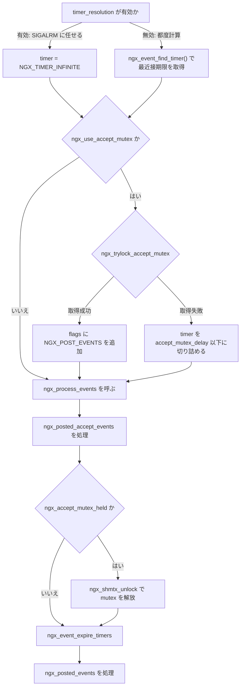
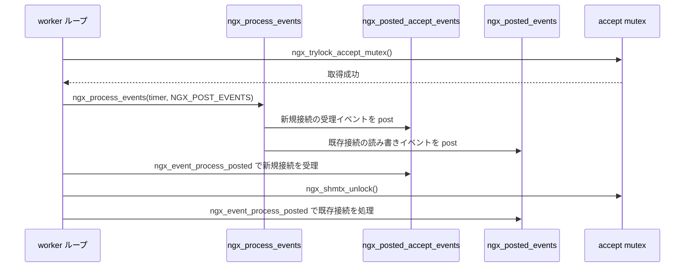

# 第7章 イベントループとタイマー

> **本章で読むソース**
>
> - [`src/event/ngx_event.h`](https://github.com/nginx/nginx/blob/release-1.31.2/src/event/ngx_event.h)
> - [`src/event/ngx_event.c`](https://github.com/nginx/nginx/blob/release-1.31.2/src/event/ngx_event.c)
> - [`src/event/ngx_event_timer.h`](https://github.com/nginx/nginx/blob/release-1.31.2/src/event/ngx_event_timer.h)
> - [`src/event/ngx_event_timer.c`](https://github.com/nginx/nginx/blob/release-1.31.2/src/event/ngx_event_timer.c)
> - [`src/event/ngx_event_posted.h`](https://github.com/nginx/nginx/blob/release-1.31.2/src/event/ngx_event_posted.h)
> - [`src/event/ngx_event_posted.c`](https://github.com/nginx/nginx/blob/release-1.31.2/src/event/ngx_event_posted.c)
> - [`src/core/ngx_times.c`](https://github.com/nginx/nginx/blob/release-1.31.2/src/core/ngx_times.c)
> - [`src/core/ngx_times.h`](https://github.com/nginx/nginx/blob/release-1.31.2/src/core/ngx_times.h)
> - [`src/os/unix/ngx_process_cycle.c`](https://github.com/nginx/nginx/blob/release-1.31.2/src/os/unix/ngx_process_cycle.c)
> - [`src/event/modules/ngx_epoll_module.c`](https://github.com/nginx/nginx/blob/release-1.31.2/src/event/modules/ngx_epoll_module.c)

## この章の狙い

第1章で読んだ `ngx_worker_process_cycle()` は、無限ループの中で毎周 `ngx_process_events_and_timers(cycle)` を呼んでいた。
この呼び出し1回が、**イベントループ**の1周にあたる。
本章では、この関数の内部を読み、`ngx_event_t` というイベント表現、タイマーを管理する**赤黒木**、mutex 保持中の処理を後回しにする **posted キュー**、そして毎周の時刻更新という4つの仕組みがどう組み合わさって1周を構成するかを追う。

`ngx_process_events_and_timers()` はバックエンド（epoll、kqueue、select など）の違いを `ngx_event_actions_t` という関数テーブル越しに吸収し、多重化待ちの結果を「読み書き可能になったイベント」と「タイムアウトしたイベント」の2種類に分けて後続処理へ渡す。
このテーブルの差し替え先である epoll モジュール自体の内部（`epoll_ctl` の呼び分けやエッジトリガの設定）は第8章で扱う。

## 前提

第1章で読んだ worker プロセスのメインループと、第4章で読んだ赤黒木（`ngx_rbtree_t`）の構造とキー比較の仕組みを前提とする。
accept mutex の取得と解放を実際に行う `ngx_trylock_accept_mutex()` の内部と、epoll モジュールが `ngx_event_actions_t` をどう実装するかは第8章で扱うため、本章では呼び出し側から見た振る舞いにとどめる。

## `ngx_event_t` によるイベントの表現

nginx は、ソケットが読み込み可能になった状態と書き込み可能になった状態を、どちらも `ngx_event_t` という共通の構造体で表す。
1本の接続は読み込み用と書き込み用の2つの `ngx_event_t` を持ち、`ngx_connection_t` の `read` と `write` フィールドがそれぞれを指す。

[`src/event/ngx_event.h` L30-L138](https://github.com/nginx/nginx/blob/release-1.31.2/src/event/ngx_event.h#L30-L138)

```c
struct ngx_event_s {
    void            *data;

    unsigned         write:1;

    unsigned         accept:1;

    /* used to detect the stale events in kqueue and epoll */
    unsigned         instance:1;

    /*
     * the event was passed or would be passed to a kernel;
     * in aio mode - operation was posted.
     */
    unsigned         active:1;

    unsigned         disabled:1;

    /* the ready event; in aio mode 0 means that no operation can be posted */
    unsigned         ready:1;

    unsigned         oneshot:1;

    /* aio operation is complete */
    unsigned         complete:1;

    unsigned         eof:1;
    unsigned         error:1;

    unsigned         timedout:1;
    unsigned         timer_set:1;

    unsigned         delayed:1;

    unsigned         deferred_accept:1;

    /* the pending eof reported by kqueue, epoll or in aio chain operation */
    unsigned         pending_eof:1;

    unsigned         posted:1;

    unsigned         closed:1;

    /* to test on worker exit */
    unsigned         channel:1;
    unsigned         resolver:1;

    unsigned         cancelable:1;

    // ... (中略) ...

    ngx_event_handler_pt  handler;

    // ... (中略) ...

    ngx_rbtree_node_t   timer;

    /* the posted queue */
    ngx_queue_t      queue;

    // ... (中略) ...
};
```

フィールドの大半は1ビットのフラグであり、状態1つにつき `unsigned foo:1` を1個ずつ割り当てている。
`accept` はこのイベントが listen ソケットの読み込みイベント、つまり新規接続の受理を表すことを示す。
`ready` は多重化待ちの結果イベントが発生済みであること、`timer_set` はこのイベントが後述のタイマー木に登録済みであること、`posted` は後述の posted キューに積まれていることを表す。
`handler` は、このイベントが発生したときに呼ぶ関数へのポインタであり、`ngx_event_accept`（新規接続の受理）や HTTP モジュールが登録する読み書きハンドラなど、イベントの種類ごとに異なる関数が入る。
`timer` は赤黒木のノードをイベント自身に埋め込んだフィールドであり、`queue` は posted キューへつなぐための侵入型リストのノードである。
どちらも第4章で読んだ「構造体へノードを埋め込む」という設計をそのまま利用している。

## バックエンドを差し替える `ngx_event_actions_t`

多重化の実装は epoll、kqueue、select など複数あるが、`ngx_process_events_and_timers()` はどれか1つに決め打ちしていない。
呼び出し先は `ngx_event_actions_t` という関数ポインタのテーブルであり、グローバル変数 `ngx_event_actions` に1組だけ保持される。

[`src/event/ngx_event.h` L166-L183](https://github.com/nginx/nginx/blob/release-1.31.2/src/event/ngx_event.h#L166-L183)

```c
typedef struct {
    ngx_int_t  (*add)(ngx_event_t *ev, ngx_int_t event, ngx_uint_t flags);
    ngx_int_t  (*del)(ngx_event_t *ev, ngx_int_t event, ngx_uint_t flags);

    ngx_int_t  (*enable)(ngx_event_t *ev, ngx_int_t event, ngx_uint_t flags);
    ngx_int_t  (*disable)(ngx_event_t *ev, ngx_int_t event, ngx_uint_t flags);

    ngx_int_t  (*add_conn)(ngx_connection_t *c);
    ngx_int_t  (*del_conn)(ngx_connection_t *c, ngx_uint_t flags);

    ngx_int_t  (*notify)(ngx_event_handler_pt handler);

    ngx_int_t  (*process_events)(ngx_cycle_t *cycle, ngx_msec_t timer,
                                 ngx_uint_t flags);

    ngx_int_t  (*init)(ngx_cycle_t *cycle, ngx_msec_t timer);
    void       (*done)(ngx_cycle_t *cycle);
} ngx_event_actions_t;
```

`add`/`del` は1つのイベントを多重化の監視対象に加えたり外したりする操作であり、`add_conn`/`del_conn` は読み書き両方のイベントを持つ接続単位で同じ操作をまとめて行う。
このうち `process_events` が、`epoll_wait()` や `kevent()` に相当する「実際に多重化待ちをするシステムコール」を呼ぶ関数であり、本章で追う `ngx_process_events_and_timers()` から毎周1回呼ばれる。
このテーブルは `use` ディレクティブで選んだイベントモジュールが `ngx_event_process_init()` の中で埋める。

[`src/event/ngx_event.c` L679-L696](https://github.com/nginx/nginx/blob/release-1.31.2/src/event/ngx_event.c#L679-L696)

```c
    for (m = 0; cycle->modules[m]; m++) {
        if (cycle->modules[m]->type != NGX_EVENT_MODULE) {
            continue;
        }

        if (cycle->modules[m]->ctx_index != ecf->use) {
            continue;
        }

        module = cycle->modules[m]->ctx;

        if (module->actions.init(cycle, ngx_timer_resolution) != NGX_OK) {
            /* fatal */
            exit(2);
        }

        break;
    }
```

`ecf->use` は `use epoll;` のように設定された値であり、`cycle->modules[]` から一致するイベントモジュールを探し、その `actions`（`ngx_event_module_t` が埋め込む `ngx_event_actions_t`）で `init()` を呼ぶ。
`init()` の内部で `ngx_event_actions` にそのバックエンドの `add` や `process_events` などが代入されるため、以後 `ngx_process_events` マクロ（`ngx_event_actions.process_events` への展開）を呼ぶコードは、選ばれたバックエンドを意識せずに済む。

## `ngx_process_events_and_timers()` が実行する処理順序

`ngx_worker_process_cycle()` の本体ループは、`ngx_exiting` などのフラグを見たあと、毎周この1行を呼ぶ。

[`src/os/unix/ngx_process_cycle.c` L710-L721](https://github.com/nginx/nginx/blob/release-1.31.2/src/os/unix/ngx_process_cycle.c#L710-L721)

```c
    for ( ;; ) {

        if (ngx_exiting) {
            if (ngx_event_no_timers_left() == NGX_OK) {
                ngx_log_error(NGX_LOG_NOTICE, cycle->log, 0, "exiting");
                ngx_worker_process_exit(cycle);
            }
        }

        ngx_log_debug0(NGX_LOG_DEBUG_EVENT, cycle->log, 0, "worker cycle");

        ngx_process_events_and_timers(cycle);
```

`ngx_process_events_and_timers()` は、多重化待ちのタイムアウト値を決める段階から始まる。

[`src/event/ngx_event.c` L194-L217](https://github.com/nginx/nginx/blob/release-1.31.2/src/event/ngx_event.c#L194-L217)

```c
void
ngx_process_events_and_timers(ngx_cycle_t *cycle)
{
    ngx_uint_t  flags;
    ngx_msec_t  timer, delta;

    if (ngx_timer_resolution) {
        timer = NGX_TIMER_INFINITE;
        flags = 0;

    } else {
        timer = ngx_event_find_timer();
        flags = NGX_UPDATE_TIME;

#if (NGX_WIN32)

        /* handle signals from master in case of network inactivity */

        if (timer == NGX_TIMER_INFINITE || timer > 500) {
            timer = 500;
        }

#endif
    }
```

`timer_resolution` ディレクティブが指定されていない場合、`timer` にはタイマー木の最近接期限を `ngx_event_find_timer()` で求めた値が入る。
多重化待ちのタイムアウトをこの値に合わせることで、次にどのタイマーも切れていない間は `process_events` をブロックさせたままにでき、タイムアウトが来た瞬間だけ制御を戻せる。
`timer_resolution` が指定されている場合は後述の SIGALRM に時刻更新を任せるため、ここでは `NGX_TIMER_INFINITE` を渡してタイマー木の期限計算そのものを省く。

続いて、accept mutex を使うかどうかの分岐に入る。
この分岐が読むグローバル変数は、次の8個である。

[`src/event/ngx_event.c` L51-L58](https://github.com/nginx/nginx/blob/release-1.31.2/src/event/ngx_event.c#L51-L58)

```c
ngx_atomic_t         *ngx_accept_mutex_ptr;
ngx_shmtx_t           ngx_accept_mutex;
ngx_uint_t            ngx_use_accept_mutex;
ngx_uint_t            ngx_accept_events;
ngx_uint_t            ngx_accept_mutex_held;
ngx_msec_t            ngx_accept_mutex_delay;
ngx_int_t             ngx_accept_disabled;
ngx_uint_t            ngx_use_exclusive_accept;
```

`ngx_use_accept_mutex` は、`ngx_event_process_init()` が起動時に一度だけ決める、mutex 方式を使うかどうかのフラグである。

[`src/event/ngx_event.c` L646-L656](https://github.com/nginx/nginx/blob/release-1.31.2/src/event/ngx_event.c#L646-L656)

```c
    ccf = (ngx_core_conf_t *) ngx_get_conf(cycle->conf_ctx, ngx_core_module);
    ecf = ngx_event_get_conf(cycle->conf_ctx, ngx_event_core_module);

    if (ccf->master && ccf->worker_processes > 1 && ecf->accept_mutex) {
        ngx_use_accept_mutex = 1;
        ngx_accept_mutex_held = 0;
        ngx_accept_mutex_delay = ecf->accept_mutex_delay;

    } else {
        ngx_use_accept_mutex = 0;
    }
```

`worker_processes` が1以下なら、そもそも新規接続の受理を複数 worker で競合する余地がないので `ngx_use_accept_mutex` は立たない。
`ngx_accept_mutex_held` は、直前の周で実際に mutex を取得できたかどうかを覚えている。

mutex を使う設定のときの本体は次のとおりである。

[`src/event/ngx_event.c` L219-L244](https://github.com/nginx/nginx/blob/release-1.31.2/src/event/ngx_event.c#L219-L244)

```c
    if (ngx_use_accept_mutex) {
        if (ngx_accept_disabled > 0) {
            ngx_accept_disabled--;

        } else {
            if (ngx_trylock_accept_mutex(cycle) == NGX_ERROR) {
                return;
            }

            if (ngx_accept_mutex_held) {
                flags |= NGX_POST_EVENTS;

            } else {
                if (timer == NGX_TIMER_INFINITE
                    || timer > ngx_accept_mutex_delay)
                {
                    timer = ngx_accept_mutex_delay;
                }
            }
        }
    }

    if (!ngx_queue_empty(&ngx_posted_next_events)) {
        ngx_event_move_posted_next(cycle);
        timer = 0;
    }
```

`ngx_accept_disabled` が正の間は、`ngx_trylock_accept_mutex()` の呼び出し自体を1周スキップし、代わりにカウンタを1減らすだけにとどめる。
このカウンタは、空き接続数が逼迫しているときに接続受理側の処理（第8章）が加算するもので、受理を一時的に控えるための仕組みである。
mutex の取得を試みて成功すれば、`flags` に `NGX_POST_EVENTS` を立てる。
このフラグの意味は次節で説明する。
取得できなかった場合は、`timer` を `ngx_accept_mutex_delay`（デフォルト 500ミリ秒）より長くしない。
これにより、mutex を持たない worker も一定間隔で必ず `ngx_process_events_and_timers()` を回り、次に mutex を取れる機会を待ちすぎない。

`NGX_UPDATE_TIME` と `NGX_POST_EVENTS` は次のように定義された、多重化待ちの呼び出しに渡す2種類のフラグである。

[`src/event/ngx_event.h` L481-L482](https://github.com/nginx/nginx/blob/release-1.31.2/src/event/ngx_event.h#L481-L482)

```c
#define NGX_UPDATE_TIME         1
#define NGX_POST_EVENTS         2
```

タイムアウト値と `flags` が決まったところで、実際に多重化待ちのシステムコールを呼ぶ。

[`src/event/ngx_event.c` L246-L264](https://github.com/nginx/nginx/blob/release-1.31.2/src/event/ngx_event.c#L246-L264)

```c
    delta = ngx_current_msec;

    (void) ngx_process_events(cycle, timer, flags);

    delta = ngx_current_msec - delta;

    ngx_log_debug1(NGX_LOG_DEBUG_EVENT, cycle->log, 0,
                   "timer delta: %M", delta);

    ngx_event_process_posted(cycle, &ngx_posted_accept_events);

    if (ngx_accept_mutex_held) {
        ngx_shmtx_unlock(&ngx_accept_mutex);
    }

    ngx_event_expire_timers();

    ngx_event_process_posted(cycle, &ngx_posted_events);
}
```

`ngx_process_events()` から戻った直後の順序に、この関数の設計が集約されている。
まず `ngx_posted_accept_events` を処理して新規接続をすべて受理し、そのあとで初めて `ngx_shmtx_unlock()` を呼んで accept mutex を手放す。
mutex を解放してから `ngx_event_expire_timers()` でタイマー切れを処理し、最後に `ngx_posted_events`（既存接続の読み書き）を処理する。
1周の流れを図にすると次のようになる。



## 赤黒木によるタイマー管理

nginx は、キープアライブのタイムアウトや upstream への接続タイムアウトなど、多数のタイマーを1本の**赤黒木**（`ngx_event_timer_rbtree`）で管理する。
木のキーはミリ秒カウンタであり、ノードの追加と削除はどちらも赤黒木の再平衡を伴うため計算量は木の高さに比例する `O(log n)` になる。

[`src/event/ngx_event_timer.c` L32-L50](https://github.com/nginx/nginx/blob/release-1.31.2/src/event/ngx_event_timer.c#L32-L50)

```c
ngx_msec_t
ngx_event_find_timer(void)
{
    ngx_msec_int_t      timer;
    ngx_rbtree_node_t  *node, *root, *sentinel;

    if (ngx_event_timer_rbtree.root == &ngx_event_timer_sentinel) {
        return NGX_TIMER_INFINITE;
    }

    root = ngx_event_timer_rbtree.root;
    sentinel = ngx_event_timer_rbtree.sentinel;

    node = ngx_rbtree_min(root, sentinel);

    timer = (ngx_msec_int_t) (node->key - ngx_current_msec);

    return (ngx_msec_t) (timer > 0 ? timer : 0);
}
```

`ngx_event_find_timer()` は、木の最小キーを持つノードを `ngx_rbtree_min()` で1回たどるだけで、最も近いタイムアウトを求める。
赤黒木は挿入時に必ずキー順で位置を決めるため、最小値は常に木の左端にあり、根から左の子をたどり続けるだけの `O(log n)` の探索で見つかる。

タイマーの追加と削除は `ngx_event_timer.h` のインライン関数として提供される。

[`src/event/ngx_event_timer.h` L31-L47](https://github.com/nginx/nginx/blob/release-1.31.2/src/event/ngx_event_timer.h#L31-L47)

```c
static ngx_inline void
ngx_event_del_timer(ngx_event_t *ev)
{
    ngx_log_debug2(NGX_LOG_DEBUG_EVENT, ev->log, 0,
                   "event timer del: %d: %M",
                    ngx_event_ident(ev->data), ev->timer.key);

    ngx_rbtree_delete(&ngx_event_timer_rbtree, &ev->timer);

#if (NGX_DEBUG)
    ev->timer.left = NULL;
    ev->timer.right = NULL;
    ev->timer.parent = NULL;
#endif

    ev->timer_set = 0;
}
```

`ngx_event_del_timer()` は `ngx_rbtree_delete()` を呼んだあと `ev->timer_set` を戻すだけの薄いラッパーである。
追加側の `ngx_event_add_timer()` はもう少し複雑で、木への挿入を省略できる場合がある。

[`src/event/ngx_event_timer.h` L50-L87](https://github.com/nginx/nginx/blob/release-1.31.2/src/event/ngx_event_timer.h#L50-L87)

```c
static ngx_inline void
ngx_event_add_timer(ngx_event_t *ev, ngx_msec_t timer)
{
    ngx_msec_t      key;
    ngx_msec_int_t  diff;

    key = ngx_current_msec + timer;

    if (ev->timer_set) {

        /*
         * Use a previous timer value if difference between it and a new
         * value is less than NGX_TIMER_LAZY_DELAY milliseconds: this allows
         * to minimize the rbtree operations for fast connections.
         */

        diff = (ngx_msec_int_t) (key - ev->timer.key);

        if (ngx_abs(diff) < NGX_TIMER_LAZY_DELAY) {
            ngx_log_debug3(NGX_LOG_DEBUG_EVENT, ev->log, 0,
                           "event timer: %d, old: %M, new: %M",
                            ngx_event_ident(ev->data), ev->timer.key, key);
            return;
        }

        ngx_del_timer(ev);
    }

    ev->timer.key = key;

    ngx_log_debug3(NGX_LOG_DEBUG_EVENT, ev->log, 0,
                   "event timer add: %d: %M:%M",
                    ngx_event_ident(ev->data), timer, ev->timer.key);

    ngx_rbtree_insert(&ngx_event_timer_rbtree, &ev->timer);

    ev->timer_set = 1;
}
```

HTTP のキープアライブ処理などは、パケットを受信するたびに同じイベントへ「あと60秒」のようなタイマーを何度も設定し直す。
愚直に実装すると、そのたびに `ngx_rbtree_delete()` と `ngx_rbtree_insert()` の組が発生し、再平衡のコストが接続あたりのパケット数に比例して積み上がる。
`ngx_event_add_timer()` は、新しいキーと現在木に入っているキーの差が `NGX_TIMER_LAZY_DELAY`（300ミリ秒）未満なら、木を触らずに即座に戻る。
タイムアウトの判定は「時刻がキー以上になったか」という不等号でしか使われないため、数百ミリ秒早めに切れても実害がなく、この誤差を許容することで頻繁な再設定のたびに木を触る回数を減らしている。

木からタイマー切れのイベントを取り出す側が `ngx_event_expire_timers()` であり、`ngx_process_events_and_timers()` の中で mutex 解放の直後に呼ばれていた。

[`src/event/ngx_event_timer.c` L53-L96](https://github.com/nginx/nginx/blob/release-1.31.2/src/event/ngx_event_timer.c#L53-L96)

```c
void
ngx_event_expire_timers(void)
{
    ngx_event_t        *ev;
    ngx_rbtree_node_t  *node, *root, *sentinel;

    sentinel = ngx_event_timer_rbtree.sentinel;

    for ( ;; ) {
        root = ngx_event_timer_rbtree.root;

        if (root == sentinel) {
            return;
        }

        node = ngx_rbtree_min(root, sentinel);

        /* node->key > ngx_current_msec */

        if ((ngx_msec_int_t) (node->key - ngx_current_msec) > 0) {
            return;
        }

        ev = ngx_rbtree_data(node, ngx_event_t, timer);

        ngx_log_debug2(NGX_LOG_DEBUG_EVENT, ev->log, 0,
                       "event timer del: %d: %M",
                       ngx_event_ident(ev->data), ev->timer.key);

        ngx_rbtree_delete(&ngx_event_timer_rbtree, &ev->timer);

#if (NGX_DEBUG)
        ev->timer.left = NULL;
        ev->timer.right = NULL;
        ev->timer.parent = NULL;
#endif

        ev->timer_set = 0;

        ev->timedout = 1;

        ev->handler(ev);
    }
}
```

`ngx_event_expire_timers()` は、木の最小キーを取り出しては現在時刻と比較する、という手続きを最小キーが現在時刻を超えるまで繰り返す。
最小キーからしか見ないため、切れていないタイマーを毎周すべて走査する必要がない。
1件取り出すごとに `timedout` を立てて `ev->handler(ev)` を呼ぶため、ハンドラの中身は「タイムアウトの後始末」と「イベント本来の処理」を `ev->timedout` の値で区別する作りになる。

## posted キューを2種類に分ける理由

`ngx_process_events()` は、多重化待ちが返したイベントをその場でハンドラに渡すとは限らない。
`flags` に `NGX_POST_EVENTS` が立っているとき、epoll モジュールはハンドラを呼ぶ代わりにイベントをキューへ積む。

[`src/event/modules/ngx_epoll_module.c` L883-L903](https://github.com/nginx/nginx/blob/release-1.31.2/src/event/modules/ngx_epoll_module.c#L883-L903)

```c
        if ((revents & EPOLLIN) && rev->active) {

#if (NGX_HAVE_EPOLLRDHUP)
            if (revents & EPOLLRDHUP) {
                rev->pending_eof = 1;
            }
#endif

            rev->ready = 1;
            rev->available = -1;

            if (flags & NGX_POST_EVENTS) {
                queue = rev->accept ? &ngx_posted_accept_events
                                    : &ngx_posted_events;

                ngx_post_event(rev, queue);

            } else {
                rev->handler(rev);
            }
        }
```

積み先は `rev->accept` の値で分かれる。
新規接続の受理イベント（listen ソケットの読み込みイベント）は `ngx_posted_accept_events` へ、それ以外の既存接続の読み書きイベントは `ngx_posted_events` へ積む。
`ngx_post_event` はキューへの追加をまとめたマクロである。

[`src/event/ngx_event_posted.h` L17-L28](https://github.com/nginx/nginx/blob/release-1.31.2/src/event/ngx_event_posted.h#L17-L28)

```c
#define ngx_post_event(ev, q)                                                 \
                                                                              \
    if (!(ev)->posted) {                                                      \
        (ev)->posted = 1;                                                     \
        ngx_queue_insert_tail(q, &(ev)->queue);                               \
                                                                              \
        ngx_log_debug1(NGX_LOG_DEBUG_CORE, (ev)->log, 0, "post event %p", ev);\
                                                                              \
    } else  {                                                                 \
        ngx_log_debug1(NGX_LOG_DEBUG_CORE, (ev)->log, 0,                      \
                       "update posted event %p", ev);                         \
    }
```

`posted` フラグが既に立っていれば二重に積まない、という点だけを守った単純な追加である。
キューの実体は3つのグローバル変数として宣言される。

[`src/event/ngx_event_posted.h` L45-L47](https://github.com/nginx/nginx/blob/release-1.31.2/src/event/ngx_event_posted.h#L45-L47)

```c
extern ngx_queue_t  ngx_posted_accept_events;
extern ngx_queue_t  ngx_posted_next_events;
extern ngx_queue_t  ngx_posted_events;
```

積まれたキューは、`ngx_event_process_posted()` が先頭から順に取り出してハンドラを呼ぶことで消費される。

[`src/event/ngx_event_posted.c` L18-L36](https://github.com/nginx/nginx/blob/release-1.31.2/src/event/ngx_event_posted.c#L18-L36)

```c
void
ngx_event_process_posted(ngx_cycle_t *cycle, ngx_queue_t *posted)
{
    ngx_queue_t  *q;
    ngx_event_t  *ev;

    while (!ngx_queue_empty(posted)) {

        q = ngx_queue_head(posted);
        ev = ngx_queue_data(q, ngx_event_t, queue);

        ngx_log_debug1(NGX_LOG_DEBUG_EVENT, cycle->log, 0,
                      "posted event %p", ev);

        ngx_delete_posted_event(ev);

        ev->handler(ev);
    }
}
```

`ngx_process_events_and_timers()` はこの関数を2回呼んでおり、`ngx_posted_accept_events` は mutex 解放より前、`ngx_posted_events` は mutex 解放とタイマー処理より後という順序になっていた。
2本に分ける理由は、この呼び出し順序に表れている。
accept mutex を持っている間にすべきことは新規接続の受理だけに絞り、既存接続の読み書きという時間のかかりうる処理は mutex を手放してから行う。
こうすることで、他の worker が accept mutex の空きを待っている時間を、新規接続の受理という短い処理の分だけに抑えられる。

もう1つの `ngx_posted_next_events` は、今の周で使わず次の周へ持ち越すためのキューである。

[`src/event/ngx_event_posted.c` L39-L60](https://github.com/nginx/nginx/blob/release-1.31.2/src/event/ngx_event_posted.c#L39-L60)

```c
void
ngx_event_move_posted_next(ngx_cycle_t *cycle)
{
    ngx_queue_t  *q;
    ngx_event_t  *ev;

    for (q = ngx_queue_head(&ngx_posted_next_events);
         q != ngx_queue_sentinel(&ngx_posted_next_events);
         q = ngx_queue_next(q))
    {
        ev = ngx_queue_data(q, ngx_event_t, queue);

        ngx_log_debug1(NGX_LOG_DEBUG_EVENT, cycle->log, 0,
                      "posted next event %p", ev);

        ev->ready = 1;
        ev->available = -1;
    }

    ngx_queue_add(&ngx_posted_events, &ngx_posted_next_events);
    ngx_queue_init(&ngx_posted_next_events);
}
```

`ngx_process_events_and_timers()` は、`ngx_posted_next_events` が空でなければこれを `ngx_posted_events` へ移し替え、`timer` を0にして多重化待ちを即座に返す設定に切り替える。
このキューへ積む側の処理は、HTTP/2 や SSL のバッファリングのようにモジュール内部の都合で1周遅らせたいイベントのためのものであり、詳細はそれぞれの機能を扱う章に委ねる。

posted キューの流れを、accept mutex の保持区間との関係でまとめると次のようになる。



## 時刻キャッシュと `ngx_time_update()`

HTTP のログや `Date` ヘッダ、キープアライブの期限計算は、いずれも現在時刻を必要とする。
リクエストのたびに `gettimeofday()` や `clock_gettime()` を呼ぶ代わりに、nginx は `ngx_current_msec` などのグローバル変数へ時刻をキャッシュし、リクエスト処理中はそれを読むだけにする。

[`src/core/ngx_times.h` L34-L49](https://github.com/nginx/nginx/blob/release-1.31.2/src/core/ngx_times.h#L34-L49)

```c
extern volatile ngx_time_t  *ngx_cached_time;

#define ngx_time()           ngx_cached_time->sec
#define ngx_timeofday()      (ngx_time_t *) ngx_cached_time

extern volatile ngx_str_t    ngx_cached_err_log_time;
extern volatile ngx_str_t    ngx_cached_http_time;
extern volatile ngx_str_t    ngx_cached_http_log_time;
extern volatile ngx_str_t    ngx_cached_http_log_iso8601;
extern volatile ngx_str_t    ngx_cached_syslog_time;

/*
 * milliseconds elapsed since some unspecified point in the past
 * and truncated to ngx_msec_t, used in event timers
 */
extern volatile ngx_msec_t  ngx_current_msec;
```

`ngx_time()` と `ngx_timeofday()` はシステムコールを呼ばず、`ngx_cached_time` が指す先を読むだけのマクロである。
このキャッシュを更新するのが `ngx_time_update()` であり、`ngx_process_events_and_timers()` の中では `flags` に `NGX_UPDATE_TIME` が立っているときに限り、`ngx_process_events()` の内部（バックエンドの多重化待ちが返った直後）で1回だけ呼ばれる。

[`src/event/modules/ngx_epoll_module.c` L804-L806](https://github.com/nginx/nginx/blob/release-1.31.2/src/event/modules/ngx_epoll_module.c#L804-L806)

```c
    if (flags & NGX_UPDATE_TIME || ngx_event_timer_alarm) {
        ngx_time_update();
    }
```

`epoll_wait()` を呼ぶこの部分自体は epoll モジュールに属し、詳細は第8章で扱うが、`NGX_UPDATE_TIME` フラグを消費している箇所として押さえておく。
呼ばれる頻度がイベントループ1周につき1回に抑えられているため、同じ周の中でリクエストを何本処理しても、時刻の読み出しはキャッシュへのアクセスで済む。

[`src/core/ngx_times.c` L15-L22](https://github.com/nginx/nginx/blob/release-1.31.2/src/core/ngx_times.c#L15-L22)

```c
/*
 * The time may be updated by signal handler or by several threads.
 * The time update operations are rare and require to hold the ngx_time_lock.
 * The time read operations are frequent, so they are lock-free and get time
 * values and strings from the current slot.  Thus thread may get the corrupted
 * values only if it is preempted while copying and then it is not scheduled
 * to run more than NGX_TIME_SLOTS seconds.
 */
```

このコメントが設計意図を要約している。
更新側は `ngx_time_lock` を取ってから書き込むが、読み出し側はロックを一切取らない。
矛盾を避ける仕組みは、64個ある `cached_time` の**スロット**を更新のたびに1つずつ進め、参照ポインタ `ngx_cached_time` を最後に書き換える点にある。

[`src/core/ngx_times.c` L80-L192](https://github.com/nginx/nginx/blob/release-1.31.2/src/core/ngx_times.c#L80-L192)

```c
void
ngx_time_update(void)
{
    u_char          *p0, *p1, *p2, *p3, *p4;
    ngx_tm_t         tm, gmt;
    time_t           sec;
    ngx_uint_t       msec;
    ngx_time_t      *tp;
    struct timeval   tv;

    if (!ngx_trylock(&ngx_time_lock)) {
        return;
    }

    ngx_gettimeofday(&tv);

    sec = tv.tv_sec;
    msec = tv.tv_usec / 1000;

    ngx_current_msec = ngx_monotonic_time(sec, msec);

    tp = &cached_time[slot];

    if (tp->sec == sec) {
        tp->msec = msec;
        ngx_unlock(&ngx_time_lock);
        return;
    }

    if (slot == NGX_TIME_SLOTS - 1) {
        slot = 0;
    } else {
        slot++;
    }

    tp = &cached_time[slot];

    tp->sec = sec;
    tp->msec = msec;

    // ... (中略) ...

    ngx_memory_barrier();

    ngx_cached_time = tp;
    ngx_cached_http_time.data = p0;
    ngx_cached_err_log_time.data = p1;
    ngx_cached_http_log_time.data = p2;
    ngx_cached_http_log_iso8601.data = p3;
    ngx_cached_syslog_time.data = p4;

    ngx_unlock(&ngx_time_lock);
}
```

`ngx_time_update()` はまず新しい秒とミリ秒を1つ先のスロットへ書き込み、`Date` ヘッダ用の文字列などを整形し終えてから、最後に `ngx_memory_barrier()` を挟んで `ngx_cached_time` を新しいスロットへ向け直す。
読み出し側が `ngx_cached_time` を読むタイミングが更新の前でも後でも、指している先のスロットは常に整形が完了した一貫データであり、ロックなしで安全に読める。
`tp->sec == sec` が成立する、つまり前回の更新から秒が変わっていない場合は、ミリ秒だけを書き換えてスロットを進めずに戻る早期リターンも入っており、同じ秒の中で何度呼ばれても文字列の再整形は発生しない。

`ngx_current_msec` はミリ秒精度のタイマー用カウンタであり、`gettimeofday()` の代わりに `CLOCK_MONOTONIC` から取る。

[`src/core/ngx_times.c` L195-L209](https://github.com/nginx/nginx/blob/release-1.31.2/src/core/ngx_times.c#L195-L209)

```c
static ngx_msec_t
ngx_monotonic_time(time_t sec, ngx_uint_t msec)
{
#if (NGX_HAVE_CLOCK_MONOTONIC)
    struct timespec  ts;

    clock_gettime(CLOCK_MONOTONIC, &ts);

    sec = ts.tv_sec;
    msec = ts.tv_nsec / 1000000;

#endif

    return (ngx_msec_t) sec * 1000 + msec;
}
```

`gettimeofday()` が返す壁時計時刻は、NTP による補正や管理者による手動変更で戻ることがある。
タイマー木のキー比較は時刻が単調に増える前提を置いているため、`ngx_event_add_timer()` や `ngx_event_expire_timers()` が使う `ngx_current_msec` は、`CLOCK_MONOTONIC` が使える環境ではそちらから取り、時刻の巻き戻りに影響されないようにしている。

`timer_resolution` ディレクティブは、この更新頻度そのものを変える設定である。
値は `ngx_event_module_init()` の中で静的変数へ写される。

[`src/event/ngx_event.c` L510-L512](https://github.com/nginx/nginx/blob/release-1.31.2/src/event/ngx_event.c#L510-L512)

```c
    ccf = (ngx_core_conf_t *) ngx_get_conf(cycle->conf_ctx, ngx_core_module);

    ngx_timer_resolution = ccf->timer_resolution;
```

`ngx_timer_resolution` が0でなく、かつバックエンドが自前のタイマー機構を持たない場合（Linux の epoll はこちらに該当する）、`ngx_event_process_init()` は `SIGALRM` の周期タイマーを仕込む。

[`src/event/ngx_event.c` L700-L723](https://github.com/nginx/nginx/blob/release-1.31.2/src/event/ngx_event.c#L700-L723)

```c
    if (ngx_timer_resolution && !(ngx_event_flags & NGX_USE_TIMER_EVENT)) {
        struct sigaction  sa;
        struct itimerval  itv;

        ngx_memzero(&sa, sizeof(struct sigaction));
        sa.sa_handler = ngx_timer_signal_handler;
        sigemptyset(&sa.sa_mask);

        if (sigaction(SIGALRM, &sa, NULL) == -1) {
            ngx_log_error(NGX_LOG_ALERT, cycle->log, ngx_errno,
                          "sigaction(SIGALRM) failed");
            return NGX_ERROR;
        }

        itv.it_interval.tv_sec = ngx_timer_resolution / 1000;
        itv.it_interval.tv_usec = (ngx_timer_resolution % 1000) * 1000;
        itv.it_value.tv_sec = ngx_timer_resolution / 1000;
        itv.it_value.tv_usec = (ngx_timer_resolution % 1000 ) * 1000;

        if (setitimer(ITIMER_REAL, &itv, NULL) == -1) {
            ngx_log_error(NGX_LOG_ALERT, cycle->log, ngx_errno,
                          "setitimer() failed");
        }
    }
```

ハンドラは実際の更新をせず、フラグを立てるだけにとどめる。

[`src/event/ngx_event.c` L622-L630](https://github.com/nginx/nginx/blob/release-1.31.2/src/event/ngx_event.c#L622-L630)

```c
static void
ngx_timer_signal_handler(int signo)
{
    ngx_event_timer_alarm = 1;

#if 1
    ngx_log_debug0(NGX_LOG_DEBUG_EVENT, ngx_cycle->log, 0, "timer signal");
#endif
}
```

`timer_resolution` を指定すると、`ngx_process_events_and_timers()` 側は `timer` を `NGX_TIMER_INFINITE` に固定して `flags` から `NGX_UPDATE_TIME` を外す一方、`SIGALRM` が指定した周期で届くたびに `epoll_wait()` が `EINTR` で中断され、`ngx_event_timer_alarm` を見た epoll モジュールが `ngx_time_update()` を呼ぶ。
つまり、時刻更新のタイミングを「多重化待ちが返るたび」から「一定周期のシグナル」に切り替える設定であり、多重化待ちの間隔が長くなりがちな低負荷時でも時刻の更新間隔を一定に保ちたい場合に使う。

## 最適化の工夫：posted キューで accept mutex の保持時間を切り詰める

`ngx_process_events_and_timers()` の処理順序をもう一度たどると、accept mutex を握っている区間がどこまで短くできているかがわかる。
`NGX_POST_EVENTS` フラグが立っている間、`ngx_process_events()` はイベントのハンドラを即座に呼ばず、新規接続の受理と既存接続の読み書きを別々のキューへ積むだけで終える。
mutex を握ったまま実行するのは、その直後の `ngx_event_process_posted(cycle, &ngx_posted_accept_events)` だけであり、これは `accept()` を呼んで `ngx_connection_t` を1つ組み立てる処理にとどまる。
既存接続の読み書き、つまり時間の読めない I/O やアプリケーション処理を含みうる `ngx_posted_events` の消費は、`ngx_shmtx_unlock(&ngx_accept_mutex)` より後に回っている。

この順序の効果は、accept mutex を待つ他の worker の視点に立つとわかりやすい。
mutex を握った worker が、たまたま多数の書き込みイベントを抱えていたとしても、その処理時間は mutex の保持時間に一切乗らない。
仮に posted キューへ分けず `ngx_process_events()` の場で全イベントのハンドラをその場で呼んでいたなら、1つの worker が重いレスポンス生成で長く CPU を使う間、他の worker は新規接続を受理できないまま mutex の解放を待つことになる。
posted キューによって accept mutex の臨界区間を「受理だけ」に切り詰めることで、複数 worker 間での新規接続の取りこぼしや偏りを抑えている。

## まとめ

- worker プロセスのメインループは毎周 `ngx_process_events_and_timers()` を呼び、この関数の1回の実行がイベントループの1周にあたる
- `ngx_event_t` は読み書き1本ずつのイベントを表し、`handler` 関数ポインタと `timer_set` や `posted` などのビットフラグで状態を持つ
- 多重化の実装差は `ngx_event_actions_t` という関数テーブルに吸収され、`use` ディレクティブで選んだバックエンドが `process_events` などを埋める
- タイマーは赤黒木 `ngx_event_timer_rbtree` で管理し、追加、削除、最近接期限の取得はいずれも `O(log n)` で済む
- `ngx_event_add_timer()` は `NGX_TIMER_LAZY_DELAY`（300ミリ秒）未満の再設定を木に反映せず、頻繁な再設定のたびに再平衡が走るのを避ける
- posted キューは accept キューと通常キューの2本に分かれ、accept mutex を保持する区間を新規接続の受理だけに切り詰める
- 時刻は `ngx_current_msec` などのキャッシュに1周1回だけ書き込まれ、リクエスト処理中はロックなしでキャッシュを読むだけで済む

## 関連する章

- [第1章 nginx とは何かとプロセスモデル](../part00-overview/01-what-is-nginx-and-process-model.md)
- [第4章 コアデータ構造](../part01-core/04-core-data-structures.md)
- [第8章 接続管理と epoll](08-connection-and-epoll.md)
