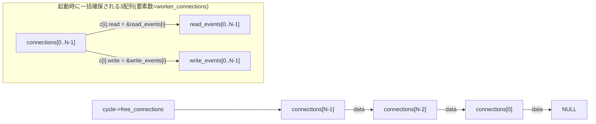
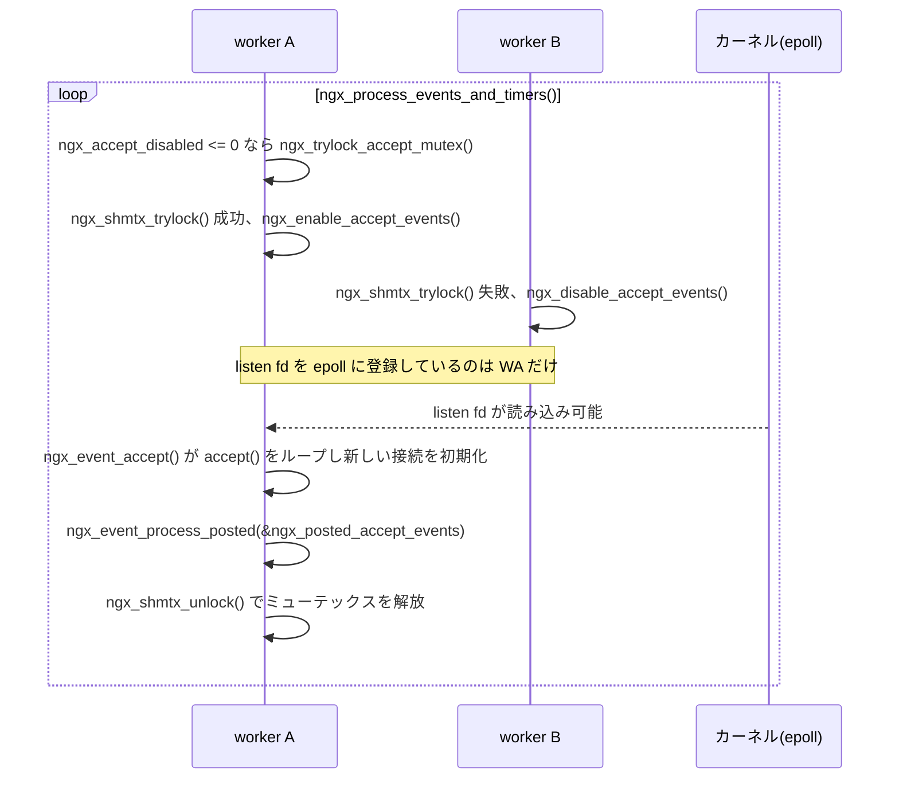

# 第8章 接続管理と epoll

> **本章で読むソース**
>
> - [`src/core/ngx_connection.h`](https://github.com/nginx/nginx/blob/release-1.31.2/src/core/ngx_connection.h)
> - [`src/core/ngx_connection.c`](https://github.com/nginx/nginx/blob/release-1.31.2/src/core/ngx_connection.c)
> - [`src/event/ngx_event.c`](https://github.com/nginx/nginx/blob/release-1.31.2/src/event/ngx_event.c)
> - [`src/event/ngx_event.h`](https://github.com/nginx/nginx/blob/release-1.31.2/src/event/ngx_event.h)
> - [`src/event/ngx_event_accept.c`](https://github.com/nginx/nginx/blob/release-1.31.2/src/event/ngx_event_accept.c)
> - [`src/event/modules/ngx_epoll_module.c`](https://github.com/nginx/nginx/blob/release-1.31.2/src/event/modules/ngx_epoll_module.c)

## この章の狙い

第7章では、`ngx_process_events_and_timers()` を軸にイベントループ全体の構造を追った。
本章はそのループが扱う中心的な対象、すなわち **接続**（`ngx_connection_t`）に焦点を絞る。
worker プロセスが起動時に接続とイベントの配列をどう確保し、`accept()` のたびにどう払い出し、切断のたびにどう回収するかを、`ngx_get_connection()` と `ngx_free_connection()` を軸に追う。
そのうえで、複数 worker が同じ listen ソケットを取り合わないための accept mutex、そして実際にイベントを届ける epoll モジュールの内部（`EPOLLET` の使い方と instance ビットによる stale event の検出）を読む。

## 前提

第1章の master/worker プロセスモデルと、第7章のイベントループの構造（`ngx_process_events_and_timers()` の呼び出し順、posted キューの役割）を前提とする。
`epoll_create()`、`epoll_ctl()`、`epoll_wait()` という epoll の基本 API と、レベルトリガとエッジトリガ（`EPOLLET`）の違いも前提とする。

## `ngx_connection_t` が表す接続1本

nginx は、TCP 接続や UDP セッションを問わず、通信路1本を **`ngx_connection_t`** という1つの構造体で表す。

[`src/core/ngx_connection.h` L127-L206](https://github.com/nginx/nginx/blob/release-1.31.2/src/core/ngx_connection.h#L127-L206)

```c
struct ngx_connection_s {
    void               *data;
    ngx_event_t        *read;
    ngx_event_t        *write;

    ngx_socket_t        fd;

    ngx_recv_pt         recv;
    ngx_send_pt         send;
    ngx_recv_chain_pt   recv_chain;
    ngx_send_chain_pt   send_chain;

    ngx_listening_t    *listening;

    off_t               sent;

    ngx_log_t          *log;

    ngx_pool_t         *pool;

    int                 type;

    struct sockaddr    *sockaddr;
    socklen_t           socklen;
    ngx_str_t           addr_text;

    // ... (中略) ...

    struct sockaddr    *local_sockaddr;
    socklen_t           local_socklen;

    ngx_buf_t          *buffer;

    ngx_queue_t         queue;

    ngx_atomic_uint_t   number;

    ngx_msec_t          start_time;
    ngx_uint_t          requests;

    unsigned            buffered:8;

    unsigned            log_error:3;     /* ngx_connection_log_error_e */

    unsigned            timedout:1;
    unsigned            error:1;
    unsigned            destroyed:1;
    unsigned            pipeline:1;

    unsigned            idle:1;
    unsigned            reusable:1;
    unsigned            close:1;
    unsigned            shared:1;

    // ... (中略) ...
};
```

`read` と `write` は、この接続の読み込みイベントと書き込みイベントを指す `ngx_event_t` へのポインタである。
`fd` はソケットディスクリプタ、`pool` はこの接続専用の**メモリプール**であり、接続が閉じるときにまとめて解放される（メモリプールの仕組みは第3章で扱う）。
`recv`/`send`/`recv_chain`/`send_chain` は実際の読み書きに使う関数ポインタであり、平文 TCP と TLS で異なる実装に差し替えられる（詳細は HTTP エンジンの章で扱う）。
`listening` はこの接続がどの listen ソケットから生まれたかを指し、`queue` は後述する reusable connections のキューに載せるためのフィールドである。
`idle`、`reusable`、`close` はいずれも1ビットのフラグであり、keepalive 中の接続をどう扱うかを表す。

## worker 起動時に一括確保される3つの配列と free list

nginx は、接続を1本使うたびに `malloc()` するのではなく、worker プロセスの起動時に **`worker_connections` の数だけ、接続とイベントの配列をあらかじめ一括確保する**。
この処理を担うのが `ngx_event_process_init()` であり、`worker_connections` ディレクティブの値は `cycle->connection_n`（デフォルト512、`ngx_event.c` の `DEFAULT_CONNECTIONS`）としてすでに読み込まれている。

[`src/event/ngx_event.c` L754-L800](https://github.com/nginx/nginx/blob/release-1.31.2/src/event/ngx_event.c#L754-L800)

```c
    cycle->connections =
        ngx_alloc(sizeof(ngx_connection_t) * cycle->connection_n, cycle->log);
    if (cycle->connections == NULL) {
        return NGX_ERROR;
    }

    c = cycle->connections;

    cycle->read_events = ngx_alloc(sizeof(ngx_event_t) * cycle->connection_n,
                                   cycle->log);
    if (cycle->read_events == NULL) {
        return NGX_ERROR;
    }

    rev = cycle->read_events;
    for (i = 0; i < cycle->connection_n; i++) {
        rev[i].closed = 1;
        rev[i].instance = 1;
    }

    cycle->write_events = ngx_alloc(sizeof(ngx_event_t) * cycle->connection_n,
                                    cycle->log);
    if (cycle->write_events == NULL) {
        return NGX_ERROR;
    }

    wev = cycle->write_events;
    for (i = 0; i < cycle->connection_n; i++) {
        wev[i].closed = 1;
    }

    i = cycle->connection_n;
    next = NULL;

    do {
        i--;

        c[i].data = next;
        c[i].read = &cycle->read_events[i];
        c[i].write = &cycle->write_events[i];
        c[i].fd = (ngx_socket_t) -1;

        next = &c[i];
    } while (i);

    cycle->free_connections = next;
    cycle->free_connection_n = cycle->connection_n;
```

`connections`、`read_events`、`write_events` の3つの配列は、この時点で `connection_n` 個ずつ確保され、以後 worker プロセスが終了するまで再配置されない。
`c[i].read = &cycle->read_events[i]` と `c[i].write = &cycle->write_events[i]` により、各 `connections[i]` は自分専用の読み込みイベントと書き込みイベントを恒久的に持つ。
このポインタは、接続が後で使い回されても張り替えられない。

同じループが、末尾の要素から順に `c[i].data = next` で1つ前の要素を指す単方向の連結リストを組み立てる。
`data` フィールドは、接続が使用中のときはモジュール固有のコンテキストを指すために使われるが、free list に載っている間だけ「次の空き接続」を指すポインタとして流用される。
組み上がったリストの先頭は `cycle->free_connections` に、要素数は `cycle->free_connection_n` に保存される。



## `ngx_get_connection()` と `ngx_free_connection()`：free list による O(1) の取得と返却

接続を1本必要とする箇所（`accept()` の直後や、upstream への接続時など）は、すべて `ngx_get_connection()` を呼ぶ。

[`src/core/ngx_connection.c` L1206-L1269](https://github.com/nginx/nginx/blob/release-1.31.2/src/core/ngx_connection.c#L1206-L1269)

```c
ngx_connection_t *
ngx_get_connection(ngx_socket_t s, ngx_log_t *log)
{
    ngx_uint_t         instance;
    ngx_event_t       *rev, *wev;
    ngx_connection_t  *c;

    /* disable warning: Win32 SOCKET is u_int while UNIX socket is int */

    if (ngx_cycle->files && (ngx_uint_t) s >= ngx_cycle->files_n) {
        ngx_log_error(NGX_LOG_ALERT, log, 0,
                      "the new socket has number %d, "
                      "but only %ui files are available",
                      s, ngx_cycle->files_n);
        return NULL;
    }

    ngx_drain_connections((ngx_cycle_t *) ngx_cycle);

    c = ngx_cycle->free_connections;

    if (c == NULL) {
        ngx_log_error(NGX_LOG_ALERT, log, 0,
                      "%ui worker_connections are not enough",
                      ngx_cycle->connection_n);

        return NULL;
    }

    ngx_cycle->free_connections = c->data;
    ngx_cycle->free_connection_n--;

    if (ngx_cycle->files && ngx_cycle->files[s] == NULL) {
        ngx_cycle->files[s] = c;
    }

    rev = c->read;
    wev = c->write;

    ngx_memzero(c, sizeof(ngx_connection_t));

    c->read = rev;
    c->write = wev;
    c->fd = s;
    c->log = log;

    instance = rev->instance;

    ngx_memzero(rev, sizeof(ngx_event_t));
    ngx_memzero(wev, sizeof(ngx_event_t));

    rev->instance = !instance;
    wev->instance = !instance;

    rev->index = NGX_INVALID_INDEX;
    wev->index = NGX_INVALID_INDEX;

    rev->data = c;
    wev->data = c;

    wev->write = 1;

    return c;
}
```

処理は単純である。
`free_connections` の先頭要素を取り出し（`c = ngx_cycle->free_connections`）、リストの先頭を1つ進める（`ngx_cycle->free_connections = c->data`）。
リストの走査もメモリ確保も発生しないため、この取得は要素数によらない定数時間で終わる。

`ngx_memzero(c, ...)` で構造体全体をゼロクリアする前に、`rev = c->read` と `wev = c->write` でイベントへのポインタを退避し、クリア後に書き戻している点に注意する。
`c[i].read`/`c[i].write` は前節で見たとおり配列要素との対応が固定されているため、ここで読み書きイベント自体を作り直す必要はない。
代わりに `rev->instance = !instance` として、そのイベントが持つ **instance ビット**を反転させる。
このビットの役割は、epoll のイベント処理を読む節で回収する。

返却は取得の逆であり、`ngx_free_connection()` が free list の先頭に戻す。

[`src/core/ngx_connection.c` L1272-L1282](https://github.com/nginx/nginx/blob/release-1.31.2/src/core/ngx_connection.c#L1272-L1282)

```c
void
ngx_free_connection(ngx_connection_t *c)
{
    c->data = ngx_cycle->free_connections;
    ngx_cycle->free_connections = c;
    ngx_cycle->free_connection_n++;

    if (ngx_cycle->files && ngx_cycle->files[c->fd] == c) {
        ngx_cycle->files[c->fd] = NULL;
    }
}
```

接続とイベントの配列を起動時に一括確保し、接続1本の生成と破棄のたびに発生するはずだった `malloc()`/`free()` を完全に排して、配列の再利用と1ポインタの付け替えだけで済ませている。
これが、`worker_connections` を数万に設定しても接続の出し入れ自体がボトルネックになりにくい理由である。

## 接続が枯渇したときの `ngx_drain_connections()`

`ngx_get_connection()` の冒頭には `ngx_drain_connections((ngx_cycle_t *) ngx_cycle)` という呼び出しがある。
これは、空き接続が少なくなってきたときに、**keepalive 中で今すぐ使われていない接続を強制的に閉じて回収する**機構である。

対象になるのは、`ngx_reusable_connection()` によって「再利用可能」（reusable）と印を付けられた接続である。

[`src/core/ngx_connection.c` L1373-L1401](https://github.com/nginx/nginx/blob/release-1.31.2/src/core/ngx_connection.c#L1373-L1401)

```c
void
ngx_reusable_connection(ngx_connection_t *c, ngx_uint_t reusable)
{
    ngx_log_debug1(NGX_LOG_DEBUG_CORE, c->log, 0,
                   "reusable connection: %ui", reusable);

    if (c->reusable) {
        ngx_queue_remove(&c->queue);
        ngx_cycle->reusable_connections_n--;

#if (NGX_STAT_STUB)
        (void) ngx_atomic_fetch_add(ngx_stat_waiting, -1);
#endif
    }

    c->reusable = reusable;

    if (reusable) {
        /* need cast as ngx_cycle is volatile */

        ngx_queue_insert_head(
            (ngx_queue_t *) &ngx_cycle->reusable_connections_queue, &c->queue);
        ngx_cycle->reusable_connections_n++;

#if (NGX_STAT_STUB)
        (void) ngx_atomic_fetch_add(ngx_stat_waiting, 1);
#endif
    }
}
```

HTTP モジュールは、次のリクエストを待つだけの keepalive 接続をこの関数で `reusable_connections_queue`（`ngx_connection_t` 側の `c->queue` フィールドを介した intrusive な双方向キュー）の先頭に登録する。
新しく reusable になった接続ほど先頭に積まれるため、このキューの末尾には最も長くアイドル状態が続いている接続が並ぶ。

[`src/core/ngx_connection.c` L1404-L1458](https://github.com/nginx/nginx/blob/release-1.31.2/src/core/ngx_connection.c#L1404-L1458)

```c
static void
ngx_drain_connections(ngx_cycle_t *cycle)
{
    ngx_uint_t         i, n;
    ngx_queue_t       *q;
    ngx_connection_t  *c;

    if (cycle->free_connection_n > cycle->connection_n / 16
        || cycle->reusable_connections_n == 0)
    {
        return;
    }

    if (cycle->connections_reuse_time != ngx_time()) {
        cycle->connections_reuse_time = ngx_time();

        ngx_log_error(NGX_LOG_WARN, cycle->log, 0,
                      "%ui worker_connections are not enough, "
                      "reusing connections",
                      cycle->connection_n);
    }

    c = NULL;
    n = ngx_max(ngx_min(32, cycle->reusable_connections_n / 8), 1);

    for (i = 0; i < n; i++) {
        if (ngx_queue_empty(&cycle->reusable_connections_queue)) {
            break;
        }

        q = ngx_queue_last(&cycle->reusable_connections_queue);
        c = ngx_queue_data(q, ngx_connection_t, queue);

        ngx_log_debug0(NGX_LOG_DEBUG_CORE, c->log, 0,
                       "reusing connection");

        c->close = 1;
        c->read->handler(c->read);
    }

    if (cycle->free_connection_n == 0 && c && c->reusable) {

        /*
         * if no connections were freed, try to reuse the last
         * connection again: this should free it as long as
         * previous reuse moved it to lingering close
         */

        ngx_log_debug0(NGX_LOG_DEBUG_CORE, c->log, 0,
                       "reusing connection again");

        c->close = 1;
        c->read->handler(c->read);
    }
}
```

空き接続が全体の1/16以下に減り、かつ reusable な接続が1つ以上あるときだけ動く。
`ngx_queue_last()` でキューの末尾、すなわち最も長くアイドルだった接続を取り出し、`c->close = 1` を立てたうえで、その接続の読み込みハンドラを直接呼び出す。
HTTP モジュール側のハンドラは `c->close` を見て、リクエストを待たずにその場で接続を閉じる（この処理は第9章で扱う）。
1回の呼び出しで回収する数は `reusable_connections_n / 8`（最大32、最小1）に抑えられており、枯渇時に大量の接続を一度に閉じて `close()` の呼び出しが瞬間的に集中するのを避けている。

この機構により、`worker_connections` に達しそうな瞬間でも、アイドル状態の keepalive 接続を犠牲にして新しい接続を受け入れる余地を作れる。
新規接続を即座に拒否するのではなく、既存の待機中接続を明け渡すことで、突発的な接続数の増加を吸収しやすくしている。

## `ngx_listening_t` と listen ソケットの準備

**`ngx_listening_t`** は、`listen` ディレクティブ1つに対応する listen ソケットの設定と状態を保持する構造体である。

[`src/core/ngx_connection.h` L18-L95](https://github.com/nginx/nginx/blob/release-1.31.2/src/core/ngx_connection.h#L18-L95)

```c
struct ngx_listening_s {
    ngx_socket_t        fd;

    struct sockaddr    *sockaddr;
    socklen_t           socklen;    /* size of sockaddr */
    size_t              addr_text_max_len;
    ngx_str_t           addr_text;

    int                 type;
    int                 protocol;

    int                 backlog;
    int                 rcvbuf;
    int                 sndbuf;
#if (NGX_HAVE_KEEPALIVE_TUNABLE)
    int                 keepidle;
    int                 keepintvl;
    int                 keepcnt;
#endif

    /* handler of accepted connection */
    ngx_connection_handler_pt   handler;

    void               *servers;  /* array of ngx_http_in_addr_t, for example */

    ngx_log_t           log;
    ngx_log_t          *logp;

    size_t              pool_size;
    /* should be here because of the AcceptEx() preread */
    size_t              post_accept_buffer_size;

    ngx_listening_t    *previous;
    ngx_connection_t   *connection;

    ngx_rbtree_t        rbtree;
    ngx_rbtree_node_t   sentinel;

    ngx_uint_t          worker;

    unsigned            open:1;
    unsigned            remain:1;
    unsigned            ignore:1;

    unsigned            bound:1;       /* already bound */
    unsigned            inherited:1;   /* inherited from previous process */
    unsigned            nonblocking_accept:1;
    unsigned            listen:1;
    unsigned            nonblocking:1;
    unsigned            shared:1;    /* shared between threads or processes */
    unsigned            addr_ntop:1;
    unsigned            wildcard:1;

#if (NGX_HAVE_INET6)
    unsigned            ipv6only:1;
#endif
    unsigned            reuseport:1;
    unsigned            add_reuseport:1;
    unsigned            keepalive:2;
    unsigned            quic:1;

    unsigned            change_protocol:1;

    // ... (中略) ...
};
```

`handler` は、この listen ソケットで accept した接続に最初に渡されるハンドラであり、HTTP であれば `ngx_http_init_connection` が入る（第9章）。
`pool_size` は、接続ごとに作るメモリプールの初期サイズを `listen` ディレクティブの `pool_size` パラメータから受け継ぐ。
`previous` は第1章で見た reload 時の listen ソケット引き継ぎに使うフィールドであり、`connection` はこの listen ソケット自身の accept イベントを保持する `ngx_connection_t` を指す。

実際に `socket()`、`bind()`、`listen()` を呼ぶのは `ngx_open_listening_sockets()` である。
まず listen ソケットを生成し、`SO_REUSEADDR` を設定する。

[`src/core/ngx_connection.c` L513-L540](https://github.com/nginx/nginx/blob/release-1.31.2/src/core/ngx_connection.c#L513-L540)

```c
            s = ngx_socket(ls[i].sockaddr->sa_family, ls[i].type,
                           ls[i].protocol);

            if (s == (ngx_socket_t) -1) {
                ngx_log_error(NGX_LOG_EMERG, log, ngx_socket_errno,
                              ngx_socket_n " %V failed", &ls[i].addr_text);
                return NGX_ERROR;
            }

            if (ls[i].type != SOCK_DGRAM || !ngx_test_config) {

                if (setsockopt(s, SOL_SOCKET, SO_REUSEADDR,
                               (const void *) &reuseaddr, sizeof(int))
                    == -1)
                {
                    ngx_log_error(NGX_LOG_EMERG, log, ngx_socket_errno,
                                  "setsockopt(SO_REUSEADDR) %V failed",
                                  &ls[i].addr_text);

                    if (ngx_close_socket(s) == -1) {
                        ngx_log_error(NGX_LOG_EMERG, log, ngx_socket_errno,
                                      ngx_close_socket_n " %V failed",
                                      &ls[i].addr_text);
                    }

                    return NGX_ERROR;
                }
            }
```

続けてノンブロッキングに設定してから `bind()` する。

[`src/core/ngx_connection.c` L611-L653](https://github.com/nginx/nginx/blob/release-1.31.2/src/core/ngx_connection.c#L611-L653)

```c
            if (!(ngx_event_flags & NGX_USE_IOCP_EVENT)) {
                if (ngx_nonblocking(s) == -1) {
                    ngx_log_error(NGX_LOG_EMERG, log, ngx_socket_errno,
                                  ngx_nonblocking_n " %V failed",
                                  &ls[i].addr_text);

                    if (ngx_close_socket(s) == -1) {
                        ngx_log_error(NGX_LOG_EMERG, log, ngx_socket_errno,
                                      ngx_close_socket_n " %V failed",
                                      &ls[i].addr_text);
                    }

                    return NGX_ERROR;
                }
            }

            ngx_log_debug2(NGX_LOG_DEBUG_CORE, log, 0,
                           "bind() %V #%d ", &ls[i].addr_text, s);

            if (bind(s, ls[i].sockaddr, ls[i].socklen) == -1) {
                err = ngx_socket_errno;

                if (err != NGX_EADDRINUSE || !ngx_test_config) {
                    ngx_log_error(NGX_LOG_EMERG, log, err,
                                  "bind() to %V failed", &ls[i].addr_text);
                }

                if (ngx_close_socket(s) == -1) {
                    ngx_log_error(NGX_LOG_EMERG, log, ngx_socket_errno,
                                  ngx_close_socket_n " %V failed",
                                  &ls[i].addr_text);
                }

                if (err != NGX_EADDRINUSE) {
                    return NGX_ERROR;
                }

                if (!ngx_test_config) {
                    failed = 1;
                }

                continue;
            }
```

`SOCK_STREAM`（TCP）の場合だけ、最後に `listen()` を呼んで fd を確定させる。

[`src/core/ngx_connection.c` L678-L719](https://github.com/nginx/nginx/blob/release-1.31.2/src/core/ngx_connection.c#L678-L719)

```c
            if (ls[i].type != SOCK_STREAM) {
                ls[i].fd = s;
                ls[i].open = 1;
                continue;
            }

            if (listen(s, ls[i].backlog) == -1) {
                err = ngx_socket_errno;

                /*
                 * on OpenVZ after suspend/resume EADDRINUSE
                 * may be returned by listen() instead of bind(), see
                 * https://bugs.openvz.org/browse/OVZ-5587
                 */

                if (err != NGX_EADDRINUSE || !ngx_test_config) {
                    ngx_log_error(NGX_LOG_EMERG, log, err,
                                  "listen() to %V, backlog %d failed",
                                  &ls[i].addr_text, ls[i].backlog);
                }

                if (ngx_close_socket(s) == -1) {
                    ngx_log_error(NGX_LOG_EMERG, log, ngx_socket_errno,
                                  ngx_close_socket_n " %V failed",
                                  &ls[i].addr_text);
                }

                if (err != NGX_EADDRINUSE) {
                    return NGX_ERROR;
                }

                if (!ngx_test_config) {
                    failed = 1;
                }

                continue;
            }

            ls[i].listen = 1;

            ls[i].fd = s;
            ls[i].open = 1;
```

第1章で見たとおり、reload をまたいでアドレスが変わらない listen ソケットは `fd` がすでに埋まっているため、このループでも `socket()`/`bind()`/`listen()` をやり直さずスキップする。

`socket()`、`bind()`、`listen()` のあとに呼ばれる `ngx_configure_listening_sockets()` は、`SO_RCVBUF`、`SO_SNDBUF`、`SO_KEEPALIVE` など、接続確立前に決まる各種ソケットオプションを設定する。

[`src/core/ngx_connection.c` L743-L792](https://github.com/nginx/nginx/blob/release-1.31.2/src/core/ngx_connection.c#L743-L792)

```c
void
ngx_configure_listening_sockets(ngx_cycle_t *cycle)
{
    int                        value;
    ngx_uint_t                 i;
    ngx_listening_t           *ls;

#if (NGX_HAVE_DEFERRED_ACCEPT && defined SO_ACCEPTFILTER)
    struct accept_filter_arg   af;
#endif

    ls = cycle->listening.elts;
    for (i = 0; i < cycle->listening.nelts; i++) {

        ls[i].log = *ls[i].logp;

        if (ls[i].rcvbuf != -1) {
            if (setsockopt(ls[i].fd, SOL_SOCKET, SO_RCVBUF,
                           (const void *) &ls[i].rcvbuf, sizeof(int))
                == -1)
            {
                ngx_log_error(NGX_LOG_ALERT, cycle->log, ngx_socket_errno,
                              "setsockopt(SO_RCVBUF, %d) %V failed, ignored",
                              ls[i].rcvbuf, &ls[i].addr_text);
            }
        }

        if (ls[i].sndbuf != -1) {
            if (setsockopt(ls[i].fd, SOL_SOCKET, SO_SNDBUF,
                           (const void *) &ls[i].sndbuf, sizeof(int))
                == -1)
            {
                ngx_log_error(NGX_LOG_ALERT, cycle->log, ngx_socket_errno,
                              "setsockopt(SO_SNDBUF, %d) %V failed, ignored",
                              ls[i].sndbuf, &ls[i].addr_text);
            }
        }

        if (ls[i].keepalive) {
            value = (ls[i].keepalive == 1) ? 1 : 0;

            if (setsockopt(ls[i].fd, SOL_SOCKET, SO_KEEPALIVE,
                           (const void *) &value, sizeof(int))
                == -1)
            {
                ngx_log_error(NGX_LOG_ALERT, cycle->log, ngx_socket_errno,
                              "setsockopt(SO_KEEPALIVE, %d) %V failed, ignored",
                              value, &ls[i].addr_text);
            }
        }
```

### `listen ... reuseport` による分散

`listen` ディレクティブに `reuseport` パラメータを付けると、1つの `ngx_listening_t` から `ngx_clone_listening()` が worker プロセスの数だけコピーを作る。

[`src/core/ngx_connection.c` L98-L131](https://github.com/nginx/nginx/blob/release-1.31.2/src/core/ngx_connection.c#L98-L131)

```c
ngx_int_t
ngx_clone_listening(ngx_cycle_t *cycle, ngx_listening_t *ls)
{
#if (NGX_HAVE_REUSEPORT)

    ngx_int_t         n;
    ngx_core_conf_t  *ccf;
    ngx_listening_t   ols;

    if (!ls->reuseport || ls->worker != 0) {
        return NGX_OK;
    }

    ols = *ls;

    ccf = (ngx_core_conf_t *) ngx_get_conf(cycle->conf_ctx, ngx_core_module);

    for (n = 1; n < ccf->worker_processes; n++) {

        /* create a socket for each worker process */

        ls = ngx_array_push(&cycle->listening);
        if (ls == NULL) {
            return NGX_ERROR;
        }

        *ls = ols;
        ls->worker = n;
    }

#endif

    return NGX_OK;
}
```

複製された各エントリは `worker` フィールドで担当 worker 番号を持ち、`ngx_open_listening_sockets()` はそれぞれに `SO_REUSEPORT` を立てた別々のソケットを `bind()` する。
`ngx_event_process_init()` は、自分の `ngx_worker` 番号と一致しない `reuseport` エントリを読み飛ばす。

[`src/event/ngx_event.c` L804-L813](https://github.com/nginx/nginx/blob/release-1.31.2/src/event/ngx_event.c#L804-L813)

```c
    ls = cycle->listening.elts;
    for (i = 0; i < cycle->listening.nelts; i++) {

#if (NGX_HAVE_REUSEPORT)
        if (ls[i].reuseport && ls[i].worker != ngx_worker) {
            continue;
        }
#endif

        c = ngx_get_connection(ls[i].fd, cycle->log);
```

同じアドレスとポートに対して worker の数だけ別々の listen ソケットが存在するため、新規接続の振り分けはカーネルの `SO_REUSEPORT` 実装に委ねられる。
以降の accept mutex の話は、`reuseport` を使わない従来の「1つの listen ソケットを全 worker が共有する」構成が対象になる。

## accept mutex と `ngx_trylock_accept_mutex()`：thundering herd の回避

`reuseport` を使わない構成では、複数の worker プロセスが同じ listen ソケットの fd を共有する。
そのまま全 worker が listen ソケットの読み込みイベントを自分の epoll インスタンスに登録すると、新規接続が1件届くたびに複数の worker が同時に起こされ、そのほとんどが `accept()` を空振りに終わらせて `EAGAIN` を受け取るだけの浪費が起きうる。
nginx はこれを **accept mutex** という共有メモリ上のミューテックスで避ける。

[`src/event/ngx_event.c` L649-L656](https://github.com/nginx/nginx/blob/release-1.31.2/src/event/ngx_event.c#L649-L656)

```c
    if (ccf->master && ccf->worker_processes > 1 && ecf->accept_mutex) {
        ngx_use_accept_mutex = 1;
        ngx_accept_mutex_held = 0;
        ngx_accept_mutex_delay = ecf->accept_mutex_delay;

    } else {
        ngx_use_accept_mutex = 0;
    }
```

`master_process` が有効で、`worker_processes` が2以上、かつ `accept_mutex` ディレクティブが有効なときだけ `ngx_use_accept_mutex` が立つ。
これが有効な間、イベントループは毎回 `ngx_trylock_accept_mutex()` でロックを取りにいく。

[`src/event/ngx_event_accept.c` L344-L379](https://github.com/nginx/nginx/blob/release-1.31.2/src/event/ngx_event_accept.c#L344-L379)

```c
ngx_int_t
ngx_trylock_accept_mutex(ngx_cycle_t *cycle)
{
    if (ngx_shmtx_trylock(&ngx_accept_mutex)) {

        ngx_log_debug0(NGX_LOG_DEBUG_EVENT, cycle->log, 0,
                       "accept mutex locked");

        if (ngx_accept_mutex_held && ngx_accept_events == 0) {
            return NGX_OK;
        }

        if (ngx_enable_accept_events(cycle) == NGX_ERROR) {
            ngx_shmtx_unlock(&ngx_accept_mutex);
            return NGX_ERROR;
        }

        ngx_accept_events = 0;
        ngx_accept_mutex_held = 1;

        return NGX_OK;
    }

    ngx_log_debug1(NGX_LOG_DEBUG_EVENT, cycle->log, 0,
                   "accept mutex lock failed: %ui", ngx_accept_mutex_held);

    if (ngx_accept_mutex_held) {
        if (ngx_disable_accept_events(cycle, 0) == NGX_ERROR) {
            return NGX_ERROR;
        }

        ngx_accept_mutex_held = 0;
    }

    return NGX_OK;
}
```

ロックを取れた worker だけが `ngx_enable_accept_events()` を呼び、すべての listen ソケットの読み込みイベントを epoll に登録する。

[`src/event/ngx_event_accept.c` L382-L404](https://github.com/nginx/nginx/blob/release-1.31.2/src/event/ngx_event_accept.c#L382-L404)

```c
ngx_int_t
ngx_enable_accept_events(ngx_cycle_t *cycle)
{
    ngx_uint_t         i;
    ngx_listening_t   *ls;
    ngx_connection_t  *c;

    ls = cycle->listening.elts;
    for (i = 0; i < cycle->listening.nelts; i++) {

        c = ls[i].connection;

        if (c == NULL || c->read->active) {
            continue;
        }

        if (ngx_add_event(c->read, NGX_READ_EVENT, 0) == NGX_ERROR) {
            return NGX_ERROR;
        }
    }

    return NGX_OK;
}
```

ロックを取れなかった、あるいは前回まで保持していたロックを手放した worker は、逆に `ngx_disable_accept_events()` で自分の epoll インスタンスから listen ソケットの登録を外す。

[`src/event/ngx_event_accept.c` L407-L444](https://github.com/nginx/nginx/blob/release-1.31.2/src/event/ngx_event_accept.c#L407-L444)

```c
static ngx_int_t
ngx_disable_accept_events(ngx_cycle_t *cycle, ngx_uint_t all)
{
    ngx_uint_t         i;
    ngx_listening_t   *ls;
    ngx_connection_t  *c;

    ls = cycle->listening.elts;
    for (i = 0; i < cycle->listening.nelts; i++) {

        c = ls[i].connection;

        if (c == NULL || !c->read->active) {
            continue;
        }

#if (NGX_HAVE_REUSEPORT)

        /*
         * do not disable accept on worker's own sockets
         * when disabling accept events due to accept mutex
         */

        if (ls[i].reuseport && !all) {
            continue;
        }

#endif

        if (ngx_del_event(c->read, NGX_READ_EVENT, NGX_DISABLE_EVENT)
            == NGX_ERROR)
        {
            return NGX_ERROR;
        }
    }

    return NGX_OK;
}
```

`reuseport` の listen ソケットは worker ごとに別物であり、accept mutex の対象ではないため、`all` が偽（通常の mutex 解放時）ならここでも読み飛ばされる。
この2関数の組み合わせにより、共有された listen ソケットの読み込みイベントを epoll に登録している worker は、ある時点で高々1つに保たれる。
新規接続の到着を検知できる epoll インスタンスが1つに絞られるので、複数 worker が同時に起こされて `accept()` を空振りするという浪費がそもそも発生しない。

accept mutex を保持した worker は、`ngx_process_events_and_timers()` の中で `epoll_wait()` に渡すフラグに `NGX_POST_EVENTS` を立てる。

[`src/event/ngx_event.c` L219-L239](https://github.com/nginx/nginx/blob/release-1.31.2/src/event/ngx_event.c#L219-L239)

```c
    if (ngx_use_accept_mutex) {
        if (ngx_accept_disabled > 0) {
            ngx_accept_disabled--;

        } else {
            if (ngx_trylock_accept_mutex(cycle) == NGX_ERROR) {
                return;
            }

            if (ngx_accept_mutex_held) {
                flags |= NGX_POST_EVENTS;

            } else {
                if (timer == NGX_TIMER_INFINITE
                    || timer > ngx_accept_mutex_delay)
                {
                    timer = ngx_accept_mutex_delay;
                }
            }
        }
    }
```

`NGX_POST_EVENTS` が立っていると、`ngx_epoll_process_events()` は listen ソケットで受け取ったイベントを即座に処理せず、第7章で見た posted キュー（`ngx_posted_accept_events`）に積む。

[`src/event/ngx_event.c` L255-L259](https://github.com/nginx/nginx/blob/release-1.31.2/src/event/ngx_event.c#L255-L259)

```c
    ngx_event_process_posted(cycle, &ngx_posted_accept_events);

    if (ngx_accept_mutex_held) {
        ngx_shmtx_unlock(&ngx_accept_mutex);
    }
```

accept 用の posted キューを処理し終えてから、ようやく `ngx_shmtx_unlock()` でミューテックスを手放す。
ミューテックスの保持中に実行するのは、posted キューに積まれた accept イベントの消化、すなわち `ngx_event_accept()` による新規接続の受理だけである。
既存接続の読み書きイベント（`ngx_posted_events`）はミューテックスの解放後に処理されるため、ロックを握る時間が既存接続のリクエスト処理に引きずられない。



## `ngx_event_accept()`：accept してconnectionを初期化する

listen ソケットの読み込みイベントに登録されているハンドラは `ngx_event_accept()` である（`ngx_event_process_init()` が `rev->handler = ngx_event_accept` を設定する）。

[`src/event/ngx_event_accept.c` L20-L49](https://github.com/nginx/nginx/blob/release-1.31.2/src/event/ngx_event_accept.c#L20-L49)

```c
void
ngx_event_accept(ngx_event_t *ev)
{
    socklen_t          socklen;
    ngx_err_t          err;
    ngx_log_t         *log;
    ngx_uint_t         level;
    ngx_socket_t       s;
    ngx_event_t       *rev, *wev;
    ngx_sockaddr_t     sa;
    ngx_listening_t   *ls;
    ngx_connection_t  *c, *lc;
    ngx_event_conf_t  *ecf;
#if (NGX_HAVE_ACCEPT4)
    static ngx_uint_t  use_accept4 = 1;
#endif

    if (ev->timedout) {
        if (ngx_enable_accept_events((ngx_cycle_t *) ngx_cycle) != NGX_OK) {
            return;
        }

        ev->timedout = 0;
    }

    ecf = ngx_event_get_conf(ngx_cycle->conf_ctx, ngx_event_core_module);

    if (!(ngx_event_flags & NGX_USE_KQUEUE_EVENT)) {
        ev->available = ecf->multi_accept;
    }
```

`multi_accept` ディレクティブが有効なら、`ev->available` に1が入る。
これが実際の accept ループの継続条件になる。

[`src/event/ngx_event_accept.c` L58-L78](https://github.com/nginx/nginx/blob/release-1.31.2/src/event/ngx_event_accept.c#L58-L78)

```c
    do {
        socklen = sizeof(ngx_sockaddr_t);

#if (NGX_HAVE_ACCEPT4)
        if (use_accept4) {
            s = accept4(lc->fd, &sa.sockaddr, &socklen, SOCK_NONBLOCK);
        } else {
            s = accept(lc->fd, &sa.sockaddr, &socklen);
        }
#else
        s = accept(lc->fd, &sa.sockaddr, &socklen);
#endif

        if (s == (ngx_socket_t) -1) {
            err = ngx_socket_errno;

            if (err == NGX_EAGAIN) {
                ngx_log_debug0(NGX_LOG_DEBUG_EVENT, ev->log, err,
                               "accept() not ready");
                return;
            }
```

`accept4()`（利用できない環境では `accept()` と `ngx_nonblocking()` の組み合わせ）でノンブロッキングなソケットを直接受け取る。
`multi_accept off`（デフォルト）では `ev->available` が0のままなので、`do { ... } while (ev->available);` は1回で終わり、1回の epoll 通知につき1本しか `accept()` しない。
`multi_accept on` にすると、`EAGAIN` を受け取るまでこのループを回し続け、listen ソケットの backlog に溜まった接続をまとめて受け入れる。
接続要求が瞬間的に集中する場面では、`accept()` を1本受け入れるたびに epoll へ戻ってイベントを再取得するより、backlog が尽きるまで居座って一括処理するほうが `epoll_wait()` の呼び出し回数を減らせる。

`accept()` に成功するたびに、`ngx_accept_disabled` を計算し直してから接続を取得する。

[`src/event/ngx_event_accept.c` L139-L151](https://github.com/nginx/nginx/blob/release-1.31.2/src/event/ngx_event_accept.c#L139-L151)

```c
        ngx_accept_disabled = ngx_cycle->connection_n / 8
                              - ngx_cycle->free_connection_n;

        c = ngx_get_connection(s, ev->log);

        if (c == NULL) {
            if (ngx_close_socket(s) == -1) {
                ngx_log_error(NGX_LOG_ALERT, ev->log, ngx_socket_errno,
                              ngx_close_socket_n " failed");
            }

            return;
        }
```

`ngx_get_connection()` に失敗する、すなわち free list が完全に尽きた場合は、`ngx_drain_connections()` を経てもなお空きがなかったということなので、受け入れたソケットをそのまま閉じて諦める。
接続の初期化（`c->pool` の作成、`sockaddr` のコピー、`ngx_nonblocking()` の設定など）を済ませたのち、最後に listen ソケットに登録されたハンドラを呼び出す。

[`src/event/ngx_event_accept.c` L327-L341](https://github.com/nginx/nginx/blob/release-1.31.2/src/event/ngx_event_accept.c#L327-L341)

```c
        log->data = NULL;
        log->handler = NULL;

        ls->handler(c);

        if (ngx_event_flags & NGX_USE_KQUEUE_EVENT) {
            ev->available--;
        }

    } while (ev->available);

#if (NGX_HAVE_EPOLLEXCLUSIVE)
    ngx_reorder_accept_events(ls);
#endif
}
```

`ls->handler` は `ngx_listening_t` の `handler` フィールドであり、HTTP の場合は `ngx_http_init_connection` が入る（第9章で扱う）。
この時点では、この接続の読み込みイベントと書き込みイベントはまだ epoll に登録されていない。
実際に読み書きイベントを epoll へ登録するのは `ngx_handle_read_event()`/`ngx_handle_write_event()` を経由する各プロトコルモジュール側の処理であり、次節で epoll モジュールの内部として扱う。

`NGX_HAVE_EPOLLEXCLUSIVE` が有効な環境では、`ngx_reorder_accept_events()` が一定間隔で listen ソケットの登録を付け替え、`EPOLLEXCLUSIVE` の仕様上 accept が最初に登録した worker へ偏りやすい問題を緩和する。

## `ngx_accept_disabled` による worker 間の負荷分散

`ngx_accept_disabled` は `ngx_cycle->connection_n / 8 - ngx_cycle->free_connection_n` という式で決まる。
空き接続が全体の1/8より多い（接続をまだ十分に受け入れられる）うちは負の値のままであり、`ngx_process_events_and_timers()` の `if (ngx_accept_disabled > 0)` は成立しない。
空き接続が1/8を下回ると値が正になり、その大きさは「あとどれだけ埋まっているか」に比例する。

先に見た `ngx_process_events_and_timers()` の該当箇所を思い出すと、`ngx_accept_disabled > 0` の間はカウンタを1減らすだけで `ngx_trylock_accept_mutex()` そのものを呼ばない。
つまり、自分の空き接続が少ない worker ほど、その回数分だけ accept mutex の獲得を自主的に見送る。
これは各 worker が自分のローカルな `free_connection_n` だけを見て下す判断であり、中央の調停役を必要としない。
新規接続は、その時点で余裕のある worker に相対的に多く流れることになる。

## `EPOLLET` の常用と instance ビットの仕掛け

epoll モジュールの初期化は `ngx_epoll_init()` が行う。

[`src/event/modules/ngx_epoll_module.c` L322-L380](https://github.com/nginx/nginx/blob/release-1.31.2/src/event/modules/ngx_epoll_module.c#L322-L380)

```c
static ngx_int_t
ngx_epoll_init(ngx_cycle_t *cycle, ngx_msec_t timer)
{
    ngx_epoll_conf_t  *epcf;

    epcf = ngx_event_get_conf(cycle->conf_ctx, ngx_epoll_module);

    if (ep == -1) {
        ep = epoll_create(cycle->connection_n / 2);

        if (ep == -1) {
            ngx_log_error(NGX_LOG_EMERG, cycle->log, ngx_errno,
                          "epoll_create() failed");
            return NGX_ERROR;
        }

        // ... (中略) ...
    }

    if (nevents < epcf->events) {
        if (event_list) {
            ngx_free(event_list);
        }

        event_list = ngx_alloc(sizeof(struct epoll_event) * epcf->events,
                               cycle->log);
        if (event_list == NULL) {
            return NGX_ERROR;
        }
    }

    nevents = epcf->events;

    ngx_io = ngx_os_io;

    ngx_event_actions = ngx_epoll_module_ctx.actions;

#if (NGX_HAVE_CLEAR_EVENT)
    ngx_event_flags = NGX_USE_CLEAR_EVENT
#else
    ngx_event_flags = NGX_USE_LEVEL_EVENT
#endif
                      |NGX_USE_GREEDY_EVENT
                      |NGX_USE_EPOLL_EVENT;

    return NGX_OK;
}
```

Linux では `NGX_HAVE_CLEAR_EVENT` が真になるため、`ngx_event_flags` に `NGX_USE_CLEAR_EVENT` が立つ。
このフラグの意味は `ngx_event.h` の定義にある。

[`src/event/ngx_event.h` L347-L361](https://github.com/nginx/nginx/blob/release-1.31.2/src/event/ngx_event.h#L347-L361)

```c
#elif (NGX_HAVE_EPOLL) && !(NGX_TEST_BUILD_EPOLL)

#define NGX_READ_EVENT     (EPOLLIN|EPOLLRDHUP)
#define NGX_WRITE_EVENT    EPOLLOUT

#define NGX_LEVEL_EVENT    0
#define NGX_CLEAR_EVENT    EPOLLET
#define NGX_ONESHOT_EVENT  0x70000000
#if 0
#define NGX_ONESHOT_EVENT  EPOLLONESHOT
#endif

#if (NGX_HAVE_EPOLLEXCLUSIVE)
#define NGX_EXCLUSIVE_EVENT  EPOLLEXCLUSIVE
#endif
```

`NGX_CLEAR_EVENT` は `EPOLLET` そのものである。
接続の読み書きイベントを登録する共通経路である `ngx_handle_read_event()`/`ngx_handle_write_event()` は、`NGX_USE_CLEAR_EVENT` が立っている環境（kqueue と epoll）で、この `NGX_CLEAR_EVENT` を明示的に付けてイベントを登録する。

[`src/event/ngx_event.c` L282-L294](https://github.com/nginx/nginx/blob/release-1.31.2/src/event/ngx_event.c#L282-L294)

```c
    if (ngx_event_flags & NGX_USE_CLEAR_EVENT) {

        /* kqueue, epoll */

        if (!rev->active && !rev->ready) {
            if (ngx_add_event(rev, NGX_READ_EVENT, NGX_CLEAR_EVENT)
                == NGX_ERROR)
            {
                return NGX_ERROR;
            }
        }

        return NGX_OK;
```

これが、確立済みの接続の読み書きイベントが常にエッジトリガで登録される経路である。
一方、listen ソケットの accept イベントは `ngx_event_process_init()` や `ngx_enable_accept_events()` から `ngx_add_event(rev, NGX_READ_EVENT, 0)` のようにフラグ0で登録されており、`EPOLLET` は付かない。
listen ソケット側は backlog が空になるまで `ngx_event_accept()` の `do...while` ループが自分で読み切るため、エッジトリガに頼らなくても取りこぼしが起きない。

実際に `epoll_ctl()` を呼ぶのが `ngx_epoll_add_event()` である。

[`src/event/modules/ngx_epoll_module.c` L578-L639](https://github.com/nginx/nginx/blob/release-1.31.2/src/event/modules/ngx_epoll_module.c#L578-L639)

```c
static ngx_int_t
ngx_epoll_add_event(ngx_event_t *ev, ngx_int_t event, ngx_uint_t flags)
{
    int                  op;
    uint32_t             events, prev;
    ngx_event_t         *e;
    ngx_connection_t    *c;
    struct epoll_event   ee;

    c = ev->data;

    events = (uint32_t) event;

    if (event == NGX_READ_EVENT) {
        e = c->write;
        prev = EPOLLOUT;
#if (NGX_READ_EVENT != EPOLLIN|EPOLLRDHUP)
        events = EPOLLIN|EPOLLRDHUP;
#endif

    } else {
        e = c->read;
        prev = EPOLLIN|EPOLLRDHUP;
#if (NGX_WRITE_EVENT != EPOLLOUT)
        events = EPOLLOUT;
#endif
    }

    if (e->active) {
        op = EPOLL_CTL_MOD;
        events |= prev;

    } else {
        op = EPOLL_CTL_ADD;
    }

#if (NGX_HAVE_EPOLLEXCLUSIVE && NGX_HAVE_EPOLLRDHUP)
    if (flags & NGX_EXCLUSIVE_EVENT) {
        events &= ~EPOLLRDHUP;
    }
#endif

    ee.events = events | (uint32_t) flags;
    ee.data.ptr = (void *) ((uintptr_t) c | ev->instance);

    ngx_log_debug3(NGX_LOG_DEBUG_EVENT, ev->log, 0,
                   "epoll add event: fd:%d op:%d ev:%08XD",
                   c->fd, op, ee.events);

    if (epoll_ctl(ep, op, c->fd, &ee) == -1) {
        ngx_log_error(NGX_LOG_ALERT, ev->log, ngx_errno,
                      "epoll_ctl(%d, %d) failed", op, c->fd);
        return NGX_ERROR;
    }

    ev->active = 1;
#if 0
    ev->oneshot = (flags & NGX_ONESHOT_EVENT) ? 1 : 0;
#endif

    return NGX_OK;
}
```

epoll は読み込みと書き込みを1つの fd につき1エントリで管理するため、読み込みイベントを追加登録する際に、すでに書き込みイベントが有効（`e->active`、`e` は反対側のイベント）であれば `EPOLL_CTL_MOD` で両方のビットを立て直し、そうでなければ `EPOLL_CTL_ADD` で新規登録する。
接続の初回登録（読み書き両方を1回で有効にしたい場合）には、代わりに `ngx_epoll_add_connection()` を使う。

[`src/event/modules/ngx_epoll_module.c` L700-L721](https://github.com/nginx/nginx/blob/release-1.31.2/src/event/modules/ngx_epoll_module.c#L700-L721)

```c
static ngx_int_t
ngx_epoll_add_connection(ngx_connection_t *c)
{
    struct epoll_event  ee;

    ee.events = EPOLLIN|EPOLLOUT|EPOLLET|EPOLLRDHUP;
    ee.data.ptr = (void *) ((uintptr_t) c | c->read->instance);

    ngx_log_debug2(NGX_LOG_DEBUG_EVENT, c->log, 0,
                   "epoll add connection: fd:%d ev:%08XD", c->fd, ee.events);

    if (epoll_ctl(ep, EPOLL_CTL_ADD, c->fd, &ee) == -1) {
        ngx_log_error(NGX_LOG_ALERT, c->log, ngx_errno,
                      "epoll_ctl(EPOLL_CTL_ADD, %d) failed", c->fd);
        return NGX_ERROR;
    }

    c->read->active = 1;
    c->write->active = 1;

    return NGX_OK;
}
```

これは、nginx 自身が接続を開始する側（upstream への接続やプロセス間通信の channel など）で使われ、accept で受け取ったばかりの接続には使われない。

どちらの関数にも共通する `ee.data.ptr = (void *) ((uintptr_t) c | ev->instance);` という1行が、本章のもう1つの主題である。
`ngx_connection_t` はアラインメントされたメモリ上に確保されるため、そのポインタの最下位ビットは常に0である。
nginx はこの空いているビットに、`ngx_event_t` が持つ **instance ビット**（`ngx_event.h` で `unsigned instance:1` として宣言されている1ビット）を重ねて格納する。

[`src/event/ngx_event.h` L30-L38](https://github.com/nginx/nginx/blob/release-1.31.2/src/event/ngx_event.h#L30-L38)

```c
struct ngx_event_s {
    void            *data;

    unsigned         write:1;

    unsigned         accept:1;

    /* used to detect the stale events in kqueue and epoll */
    unsigned         instance:1;
```

コメントにあるとおり、この1ビットの用途は kqueue と epoll における stale event（配信が遅れて届いた、すでに意味を失ったイベント）の検出である。
`ngx_get_connection()` は、接続を1本払い出すたびに `rev->instance = !instance` として、この接続配列スロットの instance ビットを必ず反転させる（前節で見たとおり）。
`epoll_ctl()` に渡す `ee.data.ptr` は、ポインタ本体と、払い出された時点での instance ビットの値をまとめて1つの `void *` に詰め込んでいる。

## `ngx_epoll_process_events()`：stale event の検出とposted キューへの積み替え

`epoll_wait()` が返したイベントを1件ずつ処理するのが `ngx_epoll_process_events()` である。

[`src/event/modules/ngx_epoll_module.c` L836-L854](https://github.com/nginx/nginx/blob/release-1.31.2/src/event/modules/ngx_epoll_module.c#L836-L854)

```c
    for (i = 0; i < events; i++) {
        c = event_list[i].data.ptr;

        instance = (uintptr_t) c & 1;
        c = (ngx_connection_t *) ((uintptr_t) c & (uintptr_t) ~1);

        rev = c->read;

        if (c->fd == -1 || rev->instance != instance) {

            /*
             * the stale event from a file descriptor
             * that was just closed in this iteration
             */

            ngx_log_debug1(NGX_LOG_DEBUG_EVENT, cycle->log, 0,
                           "epoll: stale event %p", c);
            continue;
        }
```

`event_list[i].data.ptr` から最下位ビットを取り出して `instance` に、残りのビットをマスクして `ngx_connection_t *` に戻す。
取り出した `instance` と、現在その接続スロットが持つ `rev->instance` を比較し、一致しなければ処理を `continue` で読み飛ばす。

この比較が必要になる理由は、同じ `epoll_wait()` の1回の呼び出しが返す `events[]` の中で、ある接続のイベントを処理した結果として別の接続が閉じられ、その `ngx_connection_t` スロットと fd が同じバッチの中で新しい接続に再利用されることがあるためである。
`close()` されたソケット fd は、OS 側で空き番号として扱われ、直後の `accept4()` によってごく短時間で同じ番号が払い出されることがある。
fd 番号の一致だけを見ていると、このように新しい接続が偶然古い fd を引き継いだ場合に区別できない。
`ngx_get_connection()` は fd 番号とは無関係に、接続を払い出すたびに instance ビットを必ず反転させるため、`event_list[i].data.ptr` に埋め込まれた instance ビットは「このイベントがどの世代の接続に対して発行されたものか」を fd 番号より確実に示す。

`c->fd == -1` という条件は、その接続がすでに `ngx_close_connection()` で完全に閉じられ、free list に戻された後であることを表す。
`rev->instance != instance` は、そのスロットが（同一 fd かどうかによらず）別の接続として払い出し直された後であることを表す。
どちらの条件も、`event_list[i].data.ptr` が指す `ngx_connection_t` の中身を、このイベントが発生した当時の接続として扱ってはならないことを意味する。

有効なイベントだけがここから先に進む。

[`src/event/modules/ngx_epoll_module.c` L883-L903](https://github.com/nginx/nginx/blob/release-1.31.2/src/event/modules/ngx_epoll_module.c#L883-L903)

```c
        if ((revents & EPOLLIN) && rev->active) {

#if (NGX_HAVE_EPOLLRDHUP)
            if (revents & EPOLLRDHUP) {
                rev->pending_eof = 1;
            }
#endif

            rev->ready = 1;
            rev->available = -1;

            if (flags & NGX_POST_EVENTS) {
                queue = rev->accept ? &ngx_posted_accept_events
                                    : &ngx_posted_events;

                ngx_post_event(rev, queue);

            } else {
                rev->handler(rev);
            }
        }
```

`NGX_POST_EVENTS`（前節で見た、accept mutex を保持している間に立つフラグ）が立っていれば、ハンドラをその場で呼ばず、`rev->accept` かどうかで `ngx_posted_accept_events` か `ngx_posted_events` のどちらかに積む。
このキューを消化する `ngx_event_process_posted()` は第7章で扱った関数であり、`ngx_process_events_and_timers()` の中で `epoll_wait()` から戻った直後に呼ばれる。
書き込みイベント側にも、同じ理由で instance ビットによる再チェックがある。

[`src/event/modules/ngx_epoll_module.c` L905-L919](https://github.com/nginx/nginx/blob/release-1.31.2/src/event/modules/ngx_epoll_module.c#L905-L919)

```c
        wev = c->write;

        if ((revents & EPOLLOUT) && wev->active) {

            if (c->fd == -1 || wev->instance != instance) {

                /*
                 * the stale event from a file descriptor
                 * that was just closed in this iteration
                 */

                ngx_log_debug1(NGX_LOG_DEBUG_EVENT, cycle->log, 0,
                               "epoll: stale event %p", c);
                continue;
            }
```

同じバッチの中で1件の `EPOLLIN|EPOLLOUT` イベントとして届いた場合でも、`EPOLLIN` 側のハンドラ呼び出しの中で接続が閉じられ再利用されうるため、`EPOLLOUT` を処理する直前にもう一度同じチェックをやり直している。

この仕組みが安価に成立している理由は、世代を区別する情報を接続やイベントの中に別テーブルとして持たせるのではなく、もともと1ビット余っているポインタの最下位ビットに同居させている点にある。
世代管理のための追加のメモリ確保や、世代番号を引くための連想配列は要らず、判定は整数のビット演算1回で済む。

## まとめ

worker プロセスは、`worker_connections` の数だけ `connections`、`read_events`、`write_events` の3配列を起動時に一括確保し、`free_connections` という単方向リストで接続の貸し出しと返却を管理する。

- `ngx_connection_t` が接続1本を表し、`ngx_listening_t` が listen ソケット1つの設定と状態を表す
- `ngx_get_connection()`/`ngx_free_connection()` は free list の先頭を操作するだけの O(1) 処理であり、接続の生成と破棄のたびに `malloc()`/`free()` を呼ばない
- 接続が枯渇に近づくと `ngx_drain_connections()` が keepalive 中の reusable な接続を強制的に閉じ、新規接続に空きを譲る
- `ngx_open_listening_sockets()`/`ngx_configure_listening_sockets()` が `socket()`/`bind()`/`listen()` と各種ソケットオプションを設定し、`reuseport` 構成では worker ごとに別々のソケットを持つ
- accept mutex は、共有された listen ソケットの読み込みイベントを epoll に登録する worker を高々1つに絞り、複数 worker が同時に起こされて `accept()` を空振りする浪費を避ける
- `ngx_event_accept()` は `multi_accept` が有効なら backlog が尽きるまで `accept4()` をループし、`ngx_accept_disabled` の値で worker 間の負荷を平準化する
- epoll モジュールは接続の読み書きイベントを `EPOLLET` で登録し、`ev.data.ptr` にポインタの空きビットと instance ビットを重ねて、閉じて再利用された接続への stale event を検出する

以降の章では、この接続の上に HTTP リクエストの受理とパースがどう積み上がるかを読み進める。

## 関連する章

- [第1章 nginx とは何かとプロセスモデル](../part00-overview/01-what-is-nginx-and-process-model.md)
- [第7章 イベントループとタイマー](07-event-loop-and-timers.md)
- [第9章 HTTP リクエストの受理とパース](../part03-http/09-http-request-parsing.md)
