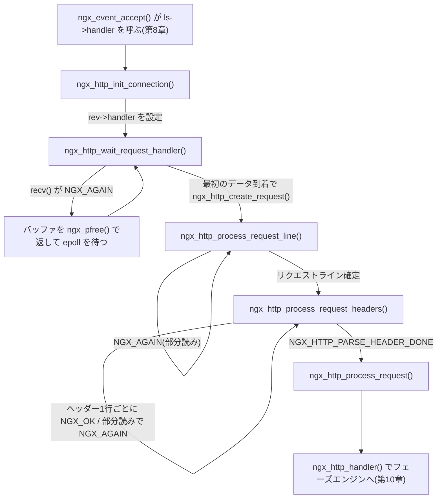
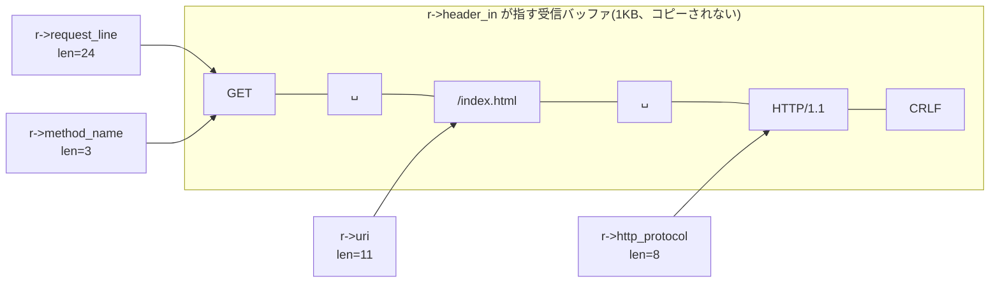
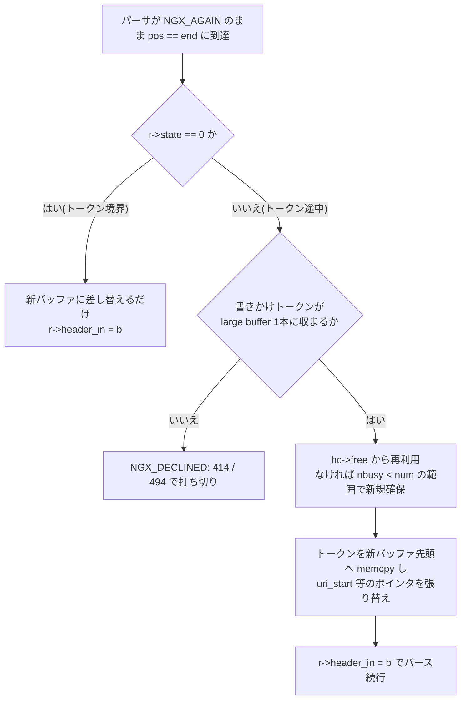

# 第9章 HTTP リクエストの受理とパース

> **本章で読むソース**
>
> - [`src/http/ngx_http_request.c`](https://github.com/nginx/nginx/blob/release-1.31.2/src/http/ngx_http_request.c)
> - [`src/http/ngx_http_request.h`](https://github.com/nginx/nginx/blob/release-1.31.2/src/http/ngx_http_request.h)
> - [`src/http/ngx_http_parse.c`](https://github.com/nginx/nginx/blob/release-1.31.2/src/http/ngx_http_parse.c)
> - [`src/http/ngx_http.c`](https://github.com/nginx/nginx/blob/release-1.31.2/src/http/ngx_http.c)
> - [`src/http/ngx_http_core_module.c`](https://github.com/nginx/nginx/blob/release-1.31.2/src/http/ngx_http_core_module.c)

## この章の狙い

第8章では、`ngx_event_accept()` が新しい接続を初期化し、最後に listen ソケットの `handler` を呼ぶところまでを読んだ。
HTTP の listen ソケットでは、この `handler` に `ngx_http_init_connection()` が入っている。
本章は、その `ngx_http_init_connection()` から始めて、クライアントが送ってきたバイト列が **HTTP リクエスト**（`ngx_http_request_t`）として組み上がるまでを追う。
具体的には、最初の1バイトを待つ `ngx_http_wait_request_handler()`、リクエストラインをパースする `ngx_http_process_request_line()` と `ngx_http_parse_request_line()`、ヘッダーをパースする `ngx_http_process_request_headers()` と `ngx_http_parse_header_line()`、そしてバッファが足りなくなったときの `ngx_http_alloc_large_header_buffer()` を読む。
パースを終えたリクエストは `ngx_http_process_request()` からフェーズエンジンへ渡されるが、フェーズエンジンの内部は第10章で扱う。

## 前提

第8章の接続管理（`ngx_connection_t`、`ngx_reusable_connection()`、accept mutex と posted キュー）と、第3章のメモリプールとバッファ（`ngx_pool_t`、`ngx_buf_t` の `pos`/`last`/`start`/`end`）を前提とする。
第4章のデータ構造のうち、`ngx_str_t`（長さとポインタの組で文字列を表し、NUL 終端に依存しない）、`ngx_list_t`、`ngx_hash_t` も使う。

## リクエスト受理の全体像

パースが完了するまでの処理は、接続の読み込みイベントに登録するハンドラを付け替えながら進む。
どの段階でも、データが足りなければハンドラはそのまま制御を返し、次に読み込みイベントが届いたときに同じハンドラが続きから再開する。



以降の節で、この図の各段階を順に読む。

## `ngx_http_init_connection()`：まだ何も確保しない

accept 直後の接続に対して最初に呼ばれるのが `ngx_http_init_connection()` である。
まず、HTTP 層がこの接続に対して持つ状態をまとめた **`ngx_http_connection_t`** を接続のメモリプールから確保し、`c->data` に載せる。

[`src/http/ngx_http_request.c` L209-L231](https://github.com/nginx/nginx/blob/release-1.31.2/src/http/ngx_http_request.c#L209-L231)

```c
void
ngx_http_init_connection(ngx_connection_t *c)
{
    ngx_uint_t                 i;
    ngx_event_t               *rev;
    struct sockaddr_in        *sin;
    ngx_http_port_t           *port;
    ngx_http_in_addr_t        *addr;
    ngx_http_log_ctx_t        *ctx;
    ngx_http_connection_t     *hc;
    ngx_http_core_srv_conf_t  *cscf;
#if (NGX_HAVE_INET6)
    struct sockaddr_in6       *sin6;
    ngx_http_in6_addr_t       *addr6;
#endif

    hc = ngx_pcalloc(c->pool, sizeof(ngx_http_connection_t));
    if (hc == NULL) {
        ngx_http_close_connection(c);
        return;
    }

    c->data = hc;
```

続く処理は、接続が届いたローカルアドレスとポートから、この接続に適用するデフォルトの server 設定（`hc->addr_conf` と `hc->conf_ctx`）を決める。
同じポートに複数のアドレスがぶら下がるワイルドカード構成では `getsockname()` で実アドレスを引き直すが、`listen` が1アドレスだけなら配列の先頭を使うだけで済む。

設定を決めたら、読み込みイベントのハンドラを差し替えて、最初のデータを待つ体勢に入る。

[`src/http/ngx_http_request.c` L327-L372](https://github.com/nginx/nginx/blob/release-1.31.2/src/http/ngx_http_request.c#L327-L372)

```c
    rev = c->read;
    rev->handler = ngx_http_wait_request_handler;
    c->write->handler = ngx_http_empty_handler;

#if (NGX_HTTP_V3)
    if (hc->addr_conf->quic) {
        ngx_http_v3_init_stream(c);
        return;
    }
#endif

#if (NGX_HTTP_SSL)
    if (hc->addr_conf->ssl) {
        hc->ssl = 1;
        c->log->action = "SSL handshaking";
        rev->handler = ngx_http_ssl_handshake;
    }
#endif

    if (hc->addr_conf->proxy_protocol) {
        hc->proxy_protocol = 1;
        c->log->action = "reading PROXY protocol";
    }

    if (rev->ready) {
        /* the deferred accept(), iocp */

        if (ngx_use_accept_mutex) {
            ngx_post_event(rev, &ngx_posted_events);
            return;
        }

        rev->handler(rev);
        return;
    }

    cscf = ngx_http_get_module_srv_conf(hc->conf_ctx, ngx_http_core_module);

    ngx_add_timer(rev, cscf->client_header_timeout);
    ngx_reusable_connection(c, 1);

    if (ngx_handle_read_event(rev, 0) != NGX_OK) {
        ngx_http_close_connection(c);
        return;
    }
}
```

TLS の listen ソケットならハンドラは `ngx_http_ssl_handshake` になり、ハンドシェイク完了後に同じ流れへ合流する（本章では平文の経路を追う）。
`rev->ready` が立っているのは、deferred accept などによって accept の時点ですでにデータが届いている場合であり、epoll を待たずにその場でハンドラを呼ぶ。
そうでなければ `client_header_timeout`（デフォルト60秒）のタイマーを掛け、`ngx_reusable_connection(c, 1)` で reusable キューに登録して、読み込みイベントを epoll に登録して戻る。

この関数が確保したのは `ngx_http_connection_t` の数十バイトだけであり、リクエスト構造体も受信バッファもまだ作らない。
accept された接続が1バイトも送らないまま放置される可能性がある以上、実際にデータが届くまで大きな確保を遅らせるほうが、接続あたりの常駐メモリを小さくできる。
`ngx_reusable_connection(c, 1)` は第8章で見た `ngx_drain_connections()` の回収対象に自分を差し出す操作であり、「まだ何も始まっていない接続は、接続が枯渇したら真っ先に切ってよい」という位置づけをここで与えている。

## `ngx_http_wait_request_handler()`：最初の読み込みとバッファの遅延確保

最初の読み込みイベントが届くと `ngx_http_wait_request_handler()` が動く。
タイムアウトしていれば接続を閉じ、第8章の `ngx_drain_connections()` が立てる `c->close` を見て枯渇時の回収にも応じる。
どちらでもなければ、ここで初めて受信バッファを確保する。

[`src/http/ngx_http_request.c` L404-L435](https://github.com/nginx/nginx/blob/release-1.31.2/src/http/ngx_http_request.c#L404-L435)

```c
    hc = c->data;
    cscf = ngx_http_get_module_srv_conf(hc->conf_ctx, ngx_http_core_module);

    size = cscf->client_header_buffer_size;

    b = c->buffer;

    if (b == NULL) {
        b = ngx_create_temp_buf(c->pool, size);
        if (b == NULL) {
            ngx_http_close_connection(c);
            return;
        }

        c->buffer = b;

    } else if (b->start == NULL) {

        b->start = ngx_palloc(c->pool, size);
        if (b->start == NULL) {
            ngx_http_close_connection(c);
            return;
        }

        b->pos = b->start;
        b->last = b->start;
        b->end = b->last + size;
    }

    size = b->end - b->last;

    n = c->recv(c, b->last, size);
```

バッファの大きさは `client_header_buffer_size` ディレクティブで決まり、デフォルトは1KBである。

[`src/http/ngx_http_core_module.c` L3573-L3579](https://github.com/nginx/nginx/blob/release-1.31.2/src/http/ngx_http_core_module.c#L3573-L3579)

```c
    ngx_conf_merge_msec_value(conf->client_header_timeout,
                              prev->client_header_timeout, 60000);
    ngx_conf_merge_size_value(conf->client_header_buffer_size,
                              prev->client_header_buffer_size, 1024);
    ngx_conf_merge_bufs_value(conf->large_client_header_buffers,
                              prev->large_client_header_buffers,
                              4, 8192);
```

`c->recv()` は第8章で見た接続の関数ポインタであり、平文なら `recv()` 系、TLS なら OpenSSL 経由の実装が呼ばれる。
読めるデータがなく `NGX_AGAIN` が返った場合の処理に、この関数のもう1つの工夫がある。

[`src/http/ngx_http_request.c` L437-L462](https://github.com/nginx/nginx/blob/release-1.31.2/src/http/ngx_http_request.c#L437-L462)

```c
    if (n == NGX_AGAIN) {

        if (!rev->timer_set) {
            ngx_add_timer(rev, cscf->client_header_timeout);
            ngx_reusable_connection(c, 1);
        }

        if (ngx_handle_read_event(rev, 0) != NGX_OK) {
            ngx_http_close_connection(c);
            return;
        }

        if (b->pos == b->last) {

            /*
             * We are trying to not hold c->buffer's memory for an
             * idle connection.
             */

            if (ngx_pfree(c->pool, b->start) == NGX_OK) {
                b->start = NULL;
            }
        }

        return;
    }
```

まだ1バイトも読めていない（`b->pos == b->last`）なら、確保したばかりのバッファ本体を `ngx_pfree()` でプールに返し、`b->start = NULL` にして「殻」だけを残す。
第3章で見たとおり、`ngx_pfree()` が個別解放できるのはプールの通常ブロックに収まらなかった large 確保だけであり、解放できたときに限って `NGX_OK` が返る。
デフォルト構成では接続プールが小さいためこの1KBは large 確保になり、解放が成立する。
keepalive で使い回される接続は「次のリクエストを待っているだけ」の時間が長いので、待機中の接続1本あたりのメモリを `ngx_http_connection_t` 程度まで落とせるこの仕掛けは、数万接続を張る構成で効いてくる。
先ほどのコードの `else if (b->start == NULL)` の分岐は、まさにこの「殻」にバッファ本体を再充填する経路である。

データが読めたら、HTTP/2 の接続プレフェイスの検査（`h2c` 構成の場合）と PROXY protocol の処理を挟んだのち、リクエスト構造体を作ってリクエストラインのパースへ進む。

[`src/http/ngx_http_request.c` L522-L534](https://github.com/nginx/nginx/blob/release-1.31.2/src/http/ngx_http_request.c#L522-L534)

```c
    c->log->action = "reading client request line";

    ngx_reusable_connection(c, 0);

    c->data = ngx_http_create_request(c);
    if (c->data == NULL) {
        ngx_http_close_connection(c);
        return;
    }

    rev->handler = ngx_http_process_request_line;
    ngx_http_process_request_line(rev);
}
```

`ngx_reusable_connection(c, 0)` で reusable キューから自分を外している点に注意する。
リクエストの処理が始まった接続は、もう枯渇時の回収対象にしてはならないからである。
`c->data` はここで `ngx_http_connection_t` から `ngx_http_request_t` に差し替わり、以後この接続のイベントはリクエストに対して配送される。

## `ngx_http_request_t`：リクエスト1件を表す構造体

`ngx_http_create_request()` の実体は `ngx_http_alloc_request()` であり、リクエスト専用のメモリプールを作って `ngx_http_request_t` を確保する。

[`src/http/ngx_http_request.c` L569-L606](https://github.com/nginx/nginx/blob/release-1.31.2/src/http/ngx_http_request.c#L569-L606)

```c
static ngx_http_request_t *
ngx_http_alloc_request(ngx_connection_t *c)
{
    ngx_pool_t                 *pool;
    ngx_time_t                 *tp;
    ngx_http_request_t         *r;
    ngx_http_connection_t      *hc;
    ngx_http_core_srv_conf_t   *cscf;
    ngx_http_core_main_conf_t  *cmcf;

    hc = c->data;

    cscf = ngx_http_get_module_srv_conf(hc->conf_ctx, ngx_http_core_module);

    pool = ngx_create_pool(cscf->request_pool_size, c->log);
    if (pool == NULL) {
        return NULL;
    }

    r = ngx_pcalloc(pool, sizeof(ngx_http_request_t));
    if (r == NULL) {
        ngx_destroy_pool(pool);
        return NULL;
    }

    r->pool = pool;

    r->http_connection = hc;
    r->signature = NGX_HTTP_MODULE;
    r->connection = c;

    r->main_conf = hc->conf_ctx->main_conf;
    r->srv_conf = hc->conf_ctx->srv_conf;
    r->loc_conf = hc->conf_ctx->loc_conf;

    r->read_event_handler = ngx_http_block_reading;

    r->header_in = hc->busy ? hc->busy->buf : c->buffer;
```

接続プールとは別に、`request_pool_size`（デフォルト4KB）のプールをリクエストごとに作る。
keepalive 接続では1本の接続の上を複数のリクエストが流れるため、寿命の異なる確保を同じプールに混ぜると、接続が閉じるまでメモリが返らない。
リクエスト由来の確保をリクエストプールに寄せておけば、レスポンスを返した時点でプールごと破棄できる。
`r->header_in` は、これからパーサが読む受信バッファを指す。
通常は先ほどの `c->buffer` だが、パイプラインで前のリクエストが大きなヘッダーバッファ（後述の `hc->busy`）に読み残しを抱えている場合は、そちらを引き継ぐ。

この後、`headers_out` のリストや変数テーブルを初期化し、`r->method = NGX_HTTP_UNKNOWN`、`r->headers_in.content_length_n = -1` などの初期値を入れて構造体を返す（[`src/http/ngx_http_request.c` L608-L668](https://github.com/nginx/nginx/blob/release-1.31.2/src/http/ngx_http_request.c#L608-L668)）。

構造体本体の主要フィールドを見ておく。

[`src/http/ngx_http_request.h` L385-L429](https://github.com/nginx/nginx/blob/release-1.31.2/src/http/ngx_http_request.h#L385-L429)

```c
struct ngx_http_request_s {
    uint32_t                          signature;         /* "HTTP" */

    ngx_connection_t                 *connection;

    void                            **ctx;
    void                            **main_conf;
    void                            **srv_conf;
    void                            **loc_conf;

    ngx_http_event_handler_pt         read_event_handler;
    ngx_http_event_handler_pt         write_event_handler;

    // ... (中略) ...

    ngx_pool_t                       *pool;
    ngx_buf_t                        *header_in;

    ngx_http_headers_in_t             headers_in;
    ngx_http_headers_out_t            headers_out;

    // ... (中略) ...

    ngx_uint_t                        method;
    ngx_uint_t                        http_version;

    ngx_str_t                         request_line;
    ngx_str_t                         uri;
    ngx_str_t                         args;
    ngx_str_t                         exten;
    ngx_str_t                         unparsed_uri;

    ngx_str_t                         method_name;
    ngx_str_t                         http_protocol;
    ngx_str_t                         schema;
```

`ctx` はモジュールごとのリクエストコンテキストの配列、`main_conf`/`srv_conf`/`loc_conf` は第2章で見た3階層の設定へのポインタ配列である。
`uri` や `args` などの `ngx_str_t` 群には、パースの結果が入る。
後で見るとおり、これらの `data` は受信バッファの中を直接指す。

構造体の末尾には、パーサ専用の作業領域がまとまっている。

[`src/http/ngx_http_request.h` L581-L613](https://github.com/nginx/nginx/blob/release-1.31.2/src/http/ngx_http_request.h#L581-L613)

```c
    /* used to parse HTTP headers */

    ngx_uint_t                        state;

    ngx_uint_t                        header_hash;
    ngx_uint_t                        lowcase_index;
    u_char                            lowcase_header[NGX_HTTP_LC_HEADER_LEN];

    u_char                           *header_name_start;
    u_char                           *header_name_end;
    u_char                           *header_start;
    u_char                           *header_end;

    /*
     * a memory that can be reused after parsing a request line
     * via ngx_http_ephemeral_t
     */

    u_char                           *uri_start;
    u_char                           *uri_end;
    u_char                           *uri_ext;
    u_char                           *args_start;
    u_char                           *request_start;
    u_char                           *request_end;
    u_char                           *method_end;
    u_char                           *schema_start;
    u_char                           *schema_end;
    u_char                           *host_start;
    u_char                           *host_end;

    unsigned                          http_minor:16;
    unsigned                          http_major:16;
};
```

`state` はパーサの状態機械の現在状態、`header_hash` と `lowcase_index` と `lowcase_header` はヘッダー名の処理用、`*_start`/`*_end` のポインタ群はパーサが受信バッファ内に見つけた各要素の位置である。
これらがリクエスト構造体側に置かれていること自体が、次節で見る「中断と再開」の仕掛けの土台になる。

## リクエストラインのパース：再開可能な状態機械

`ngx_http_process_request_line()` は、「読む」と「パースする」を交互に繰り返すループである。

[`src/http/ngx_http_request.c` L1136-L1170](https://github.com/nginx/nginx/blob/release-1.31.2/src/http/ngx_http_request.c#L1136-L1170)

```c
    rc = NGX_AGAIN;

    for ( ;; ) {

        if (rc == NGX_AGAIN) {
            n = ngx_http_read_request_header(r);

            if (n == NGX_AGAIN || n == NGX_ERROR) {
                break;
            }
        }

        rc = ngx_http_parse_request_line(r, r->header_in);

        if (rc == NGX_OK) {

            /* the request line has been parsed successfully */

            r->request_line.len = r->request_end - r->request_start;
            r->request_line.data = r->request_start;
            r->request_length = r->header_in->pos - r->request_start;

            ngx_log_debug1(NGX_LOG_DEBUG_HTTP, c->log, 0,
                           "http request line: \"%V\"", &r->request_line);

            r->method_name.len = r->method_end - r->request_start + 1;
            r->method_name.data = r->request_line.data;

            if (r->http_protocol.data) {
                r->http_protocol.len = r->request_end - r->http_protocol.data;
            }

            if (ngx_http_process_request_uri(r) != NGX_OK) {
                break;
            }
```

読み込み側の `ngx_http_read_request_header()` は、まずバッファに未消費のデータ（`last - pos`）が残っていればソケットに触らずそれを返し、なければ `c->recv()` でバッファの空きに追記する。

[`src/http/ngx_http_request.c` L1598-L1634](https://github.com/nginx/nginx/blob/release-1.31.2/src/http/ngx_http_request.c#L1598-L1634)

```c
static ssize_t
ngx_http_read_request_header(ngx_http_request_t *r)
{
    ssize_t                    n;
    ngx_event_t               *rev;
    ngx_connection_t          *c;
    ngx_http_core_srv_conf_t  *cscf;

    c = r->connection;
    rev = c->read;

    n = r->header_in->last - r->header_in->pos;

    if (n > 0) {
        return n;
    }

    if (rev->ready) {
        n = c->recv(c, r->header_in->last,
                    r->header_in->end - r->header_in->last);
    } else {
        n = NGX_AGAIN;
    }

    if (n == NGX_AGAIN) {
        if (!rev->timer_set) {
            cscf = ngx_http_get_module_srv_conf(r, ngx_http_core_module);
            ngx_add_timer(rev, cscf->client_header_timeout);
        }

        if (ngx_handle_read_event(rev, 0) != NGX_OK) {
            ngx_http_close_request(r, NGX_HTTP_INTERNAL_SERVER_ERROR);
            return NGX_ERROR;
        }

        return NGX_AGAIN;
    }
```

`NGX_AGAIN` なら外側のループが `break` して制御をイベントループへ返し、次の読み込みイベントで同じ `ngx_http_process_request_line()` が再入する。
このとき、前回どこまでパースしたかを覚えておく責任はパーサ側にある。

パーサ本体の `ngx_http_parse_request_line()` は、27状態の**状態機械**として書かれている。

[`src/http/ngx_http_parse.c` L107-L146](https://github.com/nginx/nginx/blob/release-1.31.2/src/http/ngx_http_parse.c#L107-L146)

```c
ngx_int_t
ngx_http_parse_request_line(ngx_http_request_t *r, ngx_buf_t *b)
{
    u_char  c, ch, *p, *m;
    enum {
        sw_start = 0,
        sw_method,
        sw_spaces_before_uri,
        sw_schema,
        sw_schema_slash,
        sw_schema_slash_slash,
        sw_spaces_before_host,
        sw_host_start,
        sw_host,
        sw_host_end,
        sw_host_ip_literal,
        sw_port_start,
        sw_port,
        sw_after_slash_in_uri,
        sw_check_uri,
        sw_uri,
        sw_http_09,
        sw_http_H,
        sw_http_HT,
        sw_http_HTT,
        sw_http_HTTP,
        sw_first_major_digit,
        sw_major_digit,
        sw_first_minor_digit,
        sw_minor_digit,
        sw_spaces_after_digit,
        sw_almost_done
    } state;

    state = r->state;

    for (p = b->pos; p < b->last; p++) {
        ch = *p;

        switch (state) {
```

冒頭で `state = r->state` と前回の状態を復元し、`b->pos` から1バイトずつ `switch` で処理する。
バッファを読み切ってもリクエストラインが終わっていなければ、関数末尾で現在位置と状態を保存して `NGX_AGAIN` を返す。

[`src/http/ngx_http_parse.c` L846-L867](https://github.com/nginx/nginx/blob/release-1.31.2/src/http/ngx_http_parse.c#L846-L867)

```c
    b->pos = p;
    r->state = state;

    return NGX_AGAIN;

done:

    b->pos = p + 1;

    if (r->request_end == NULL) {
        r->request_end = p;
    }

    r->http_version = r->http_major * 1000 + r->http_minor;
    r->state = sw_start;

    if (r->http_version == 9 && r->method != NGX_HTTP_GET) {
        return NGX_HTTP_PARSE_INVALID_09_METHOD;
    }

    return NGX_OK;
}
```

この「`r->state` に状態を、`b->pos` に消費位置を保存して中断し、次回そこから再開する」構造が、本章の最初の最適化である。
リクエストラインが TCP セグメントの境界でどこで千切れても、届いた分だけを進めて中断できるので、各バイトはちょうど1回しか走査されず、部分読みのたびに先頭からパースし直したり、届いた断片を別バッファへ繋ぎ直したりするコストが発生しない。
途中結果（`r->uri_start` などのポインタや `r->http_major` などの数値）はすべて `ngx_http_request_t` 側に置かれているため、パーサ関数自体はローカル変数に依存せず、何度呼び直しても続きから動く。

関数の直前には、コンパイラへの期待を述べたコメントがある。

[`src/http/ngx_http_parse.c` L105](https://github.com/nginx/nginx/blob/release-1.31.2/src/http/ngx_http_parse.c#L105)

```c
/* gcc, icc, msvc and others compile these switches as an jump table */
```

状態の分岐が `switch` の値で密に並んでいるため、コンパイラはこれをジャンプテーブルに落とせる。
1バイトあたりの処理が「テーブル参照1回で該当状態のコードへ飛ぶ」だけになり、状態数が増えても分岐コストが増えない。

### メソッド判定は4バイト整数の比較1回

`sw_method` 状態では、メソッド名の終わりの空白を見つけた時点で、先頭からの長さごとに既知のメソッドと比較する。

[`src/http/ngx_http_parse.c` L148-L182](https://github.com/nginx/nginx/blob/release-1.31.2/src/http/ngx_http_parse.c#L148-L182)

```c
        /* HTTP methods: GET, HEAD, POST */
        case sw_start:
            r->request_start = p;

            if (ch == CR || ch == LF) {
                break;
            }

            if ((ch < 'A' || ch > 'Z') && ch != '_' && ch != '-') {
                return NGX_HTTP_PARSE_INVALID_METHOD;
            }

            state = sw_method;
            break;

        case sw_method:
            if (ch == ' ') {
                r->method_end = p - 1;
                m = r->request_start;
                state = sw_spaces_before_uri;

                switch (p - m) {

                case 3:
                    if (ngx_str3_cmp(m, 'G', 'E', 'T', ' ')) {
                        r->method = NGX_HTTP_GET;
                        break;
                    }

                    if (ngx_str3_cmp(m, 'P', 'U', 'T', ' ')) {
                        r->method = NGX_HTTP_PUT;
                        break;
                    }

                    break;
```

比較マクロの実装は、リトルエンディアンかつ非整列アクセスが許される環境（x86 系など）では文字列比較ではない。

[`src/http/ngx_http_parse.c` L40-L49](https://github.com/nginx/nginx/blob/release-1.31.2/src/http/ngx_http_parse.c#L40-L49)

```c
#if (NGX_HAVE_LITTLE_ENDIAN && NGX_HAVE_NONALIGNED)

#define ngx_str3_cmp(m, c0, c1, c2, c3)                                       \
    *(uint32_t *) m == ((c3 << 24) | (c2 << 16) | (c1 << 8) | c0)

#define ngx_str3Ocmp(m, c0, c1, c2, c3)                                       \
    *(uint32_t *) m == ((c3 << 24) | (c2 << 16) | (c1 << 8) | c0)

#define ngx_str4cmp(m, c0, c1, c2, c3)                                        \
    *(uint32_t *) m == ((c3 << 24) | (c2 << 16) | (c1 << 8) | c0)
```

`"GET "` の4バイトを `uint32_t` 1個として読み、コンパイル時に計算される定数と1回比較する。
1文字ずつの比較4回とループ制御を、32ビットのロードと比較の各1命令に畳み込んでいるわけである。
`ngx_str3_cmp(m, 'G', 'E', 'T', ' ')` の4引数目が空白なのは、3文字のメソッドでは4バイト目に必ずメソッド終端の空白が来る（この分岐自体が `ch == ' '` で入る）ことを利用して、余った1バイトも既知の値として比較対象に含めるためである。

### パース結果の切り出しはゼロコピー

状態機械は、要素の内容をどこにもコピーしない。
たとえば URI の先頭を見つけたときにやるのは、ポインタを記録することだけである。

[`src/http/ngx_http_parse.c` L290-L296](https://github.com/nginx/nginx/blob/release-1.31.2/src/http/ngx_http_parse.c#L290-L296)

```c
        case sw_spaces_before_uri:

            if (ch == '/') {
                r->uri_start = p;
                state = sw_after_slash_in_uri;
                break;
            }
```

パースが完了すると、先ほど見た `ngx_http_process_request_line()` の `NGX_OK` 分岐が、これらのポインタの差分から `ngx_str_t` を組み立てる（`r->request_line.data = r->request_start` など）。
`ngx_str_t` は長さとポインタの組であり NUL 終端を要求しないので、受信バッファの中を指すだけで文字列として成立する。
メソッド、URI、引数、プロトコル名のどれについても、確保もコピーも起きない。



例外は、URI が `%` エンコードや `/./` を含む場合である。
この場合だけ `ngx_http_process_request_uri()` が複雑 URI と判定し、正規化した結果を新しい領域に書き出す（[`src/http/ngx_http_request.c` L1278-L1398](https://github.com/nginx/nginx/blob/release-1.31.2/src/http/ngx_http_request.c#L1278-L1398)）。
コピーを「必要になったリクエストだけ」に限定しているので、大多数を占める素直な URI のリクエストは切り出しのコストがゼロのまま通り抜ける。

リクエストラインが確定すると、ヘッダー用のリストを初期化してハンドラを付け替える。

[`src/http/ngx_http_request.c` L1204-L1231](https://github.com/nginx/nginx/blob/release-1.31.2/src/http/ngx_http_request.c#L1204-L1231)

```c
            if (r->http_version < NGX_HTTP_VERSION_10) {

                if (r->headers_in.server.len == 0
                    && ngx_http_set_virtual_server(r, &r->headers_in.server)
                       == NGX_ERROR)
                {
                    break;
                }

                ngx_http_process_request(r);
                break;
            }


            if (ngx_list_init(&r->headers_in.headers, r->pool, 20,
                              sizeof(ngx_table_elt_t))
                != NGX_OK)
            {
                ngx_http_close_request(r, NGX_HTTP_INTERNAL_SERVER_ERROR);
                break;
            }

            c->log->action = "reading client request headers";

            rev->handler = ngx_http_process_request_headers;
            ngx_http_process_request_headers(rev);

            break;
```

HTTP/0.9 にはヘッダーが存在しないため、この場合だけヘッダーのパースを飛ばして直接 `ngx_http_process_request()` へ進む。

## ヘッダーのパース：ハッシュを計算しながら読む

`ngx_http_process_request_headers()` も「読む、パースする」のループだが、パーサはヘッダー1行を単位として `NGX_OK` を返すため、行ごとに登録処理を挟みながら回る。
パーサ本体の `ngx_http_parse_header_line()` から見る。

[`src/http/ngx_http_parse.c` L870-L901](https://github.com/nginx/nginx/blob/release-1.31.2/src/http/ngx_http_parse.c#L870-L901)

```c
ngx_int_t
ngx_http_parse_header_line(ngx_http_request_t *r, ngx_buf_t *b,
    ngx_uint_t allow_underscores)
{
    u_char      c, ch, *p;
    ngx_uint_t  hash, i;
    enum {
        sw_start = 0,
        sw_name,
        sw_space_before_value,
        sw_value,
        sw_space_after_value,
        sw_ignore_line,
        sw_almost_done,
        sw_header_almost_done
    } state;

    /* the last '\0' is not needed because string is zero terminated */

    static u_char  lowcase[] =
        "\0\0\0\0\0\0\0\0\0\0\0\0\0\0\0\0\0\0\0\0\0\0\0\0\0\0\0\0\0\0\0\0"
        "\0\0\0\0\0\0\0\0\0\0\0\0\0-\0\0" "0123456789\0\0\0\0\0\0"
        "\0abcdefghijklmnopqrstuvwxyz\0\0\0\0\0"
        "\0abcdefghijklmnopqrstuvwxyz\0\0\0\0\0"
        "\0\0\0\0\0\0\0\0\0\0\0\0\0\0\0\0\0\0\0\0\0\0\0\0\0\0\0\0\0\0\0\0"
        "\0\0\0\0\0\0\0\0\0\0\0\0\0\0\0\0\0\0\0\0\0\0\0\0\0\0\0\0\0\0\0\0"
        "\0\0\0\0\0\0\0\0\0\0\0\0\0\0\0\0\0\0\0\0\0\0\0\0\0\0\0\0\0\0\0\0"
        "\0\0\0\0\0\0\0\0\0\0\0\0\0\0\0\0\0\0\0\0\0\0\0\0\0\0\0\0\0\0\0";

    state = r->state;
    hash = r->header_hash;
    i = r->lowcase_index;
```

こちらも `r->state` と、それに加えて計算途中のハッシュ値 `r->header_hash` と小文字化バッファの位置 `r->lowcase_index` を復元して始まる、再開可能な状態機械である。
`lowcase[]` は256エントリの静的テーブルであり、1回の配列参照が2つの仕事を兼ねる。
英字なら小文字に変換した文字が、数字とハイフンならその文字自身が返り、ヘッダー名として許さない文字なら0が返って弾かれる。
文字種の判定と小文字化を別々に行う必要がない。

ヘッダー名を読む `sw_name` 状態が、このテーブルの使い所である。

[`src/http/ngx_http_parse.c` L962-L990](https://github.com/nginx/nginx/blob/release-1.31.2/src/http/ngx_http_parse.c#L962-L990)

```c
        /* header name */
        case sw_name:
            c = lowcase[ch];

            if (c) {
                hash = ngx_hash(hash, c);
                r->lowcase_header[i++] = c;
                i &= (NGX_HTTP_LC_HEADER_LEN - 1);
                break;
            }

            if (ch == '_') {
                if (allow_underscores) {
                    hash = ngx_hash(hash, ch);
                    r->lowcase_header[i++] = ch;
                    i &= (NGX_HTTP_LC_HEADER_LEN - 1);

                } else {
                    r->invalid_header = 1;
                }

                break;
            }

            if (ch == ':') {
                r->header_name_end = p;
                state = sw_space_before_value;
                break;
            }
```

名前の1文字を読むたびに、小文字化した文字で `hash = ngx_hash(hash, c)` とハッシュを積み上げ、同じ文字を `r->lowcase_header[]`（32バイトのリングバッファ、`i &= 31` で折り返す）にも書き込む。
`ngx_hash()` は第4章で見た単純な乗算ハッシュである。

[`src/core/ngx_hash.h` L114](https://github.com/nginx/nginx/blob/release-1.31.2/src/core/ngx_hash.h#L114)

```c
#define ngx_hash(key, c)   ((ngx_uint_t) key * 31 + c)
```

つまり、ヘッダー名を読み終えた瞬間には、「小文字化された名前」と「そのハッシュ値」が副産物としてすでに手元にある。
後段のハッシュ表引きのために名前をもう一度走査する必要がない。
行末まで読むと、`header_name_start`/`header_name_end`/`header_start`/`header_end` の4ポインタで名前と値の位置を示して `NGX_OK` を返す。
空行（ヘッダーの終わり）を見つけたときだけ `NGX_HTTP_PARSE_HEADER_DONE` を返す。

[`src/http/ngx_http_parse.c` L1123-L1145](https://github.com/nginx/nginx/blob/release-1.31.2/src/http/ngx_http_parse.c#L1123-L1145)

```c
    b->pos = p;
    r->state = state;
    r->header_hash = hash;
    r->lowcase_index = i;

    return NGX_AGAIN;

done:

    b->pos = p + 1;
    r->state = sw_start;
    r->header_hash = hash;
    r->lowcase_index = i;

    return NGX_OK;

header_done:

    b->pos = p + 1;
    r->state = sw_start;

    return NGX_HTTP_PARSE_HEADER_DONE;
}
```

### `ngx_table_elt_t` への登録と `ngx_http_headers_in` のハッシュ表引き

呼び出し側の `ngx_http_process_request_headers()` は、`NGX_OK` が返るたびにヘッダー1本を `r->headers_in.headers` リストに積み、既知ヘッダーかどうかをハッシュ表で調べる。

[`src/http/ngx_http_request.c` L1482-L1552](https://github.com/nginx/nginx/blob/release-1.31.2/src/http/ngx_http_request.c#L1482-L1552)

```c
        rc = ngx_http_parse_header_line(r, r->header_in,
                                        cscf->underscores_in_headers);

        if (rc == NGX_OK) {

            // ... (中略) ...

            h = ngx_list_push(&r->headers_in.headers);
            if (h == NULL) {
                ngx_http_close_request(r, NGX_HTTP_INTERNAL_SERVER_ERROR);
                break;
            }

            h->hash = r->header_hash;

            h->key.len = r->header_name_end - r->header_name_start;
            h->key.data = r->header_name_start;
            h->key.data[h->key.len] = '\0';

            h->value.len = r->header_end - r->header_start;
            h->value.data = r->header_start;
            h->value.data[h->value.len] = '\0';

            h->lowcase_key = ngx_pnalloc(r->pool, h->key.len);
            if (h->lowcase_key == NULL) {
                ngx_http_close_request(r, NGX_HTTP_INTERNAL_SERVER_ERROR);
                break;
            }

            if (h->key.len == r->lowcase_index) {
                ngx_memcpy(h->lowcase_key, r->lowcase_header, h->key.len);

            } else {
                ngx_strlow(h->lowcase_key, h->key.data, h->key.len);
            }

            hh = ngx_hash_find(&cmcf->headers_in_hash, h->hash,
                               h->lowcase_key, h->key.len);

            if (hh && hh->handler(r, h, hh->offset) != NGX_OK) {
                break;
            }

            ngx_log_debug2(NGX_LOG_DEBUG_HTTP, r->connection->log, 0,
                           "http header: \"%V: %V\"",
                           &h->key, &h->value);

            continue;
        }
```

`h->key` と `h->value` はここでも受信バッファの中を指すだけであり、コピーされるのは小文字化した名前 `lowcase_key` だけである。
その小文字化も、名前が32バイト以内でリングバッファが折り返していなければ（`h->key.len == r->lowcase_index`）、パース中に作った `r->lowcase_header` を写すだけで済み、`ngx_strlow()` による再走査は長い名前のときにしか起きない。
名前と値の直後への `'\0'` の書き込みは、受信バッファ上の CR や `:` の位置を潰す破壊的な操作だが、そこはもうパーサが消費済みの区切り文字なので問題にならない。
これで `ngx_str_t` を C 文字列としても扱えるようになる。

検索先の `cmcf->headers_in_hash` は、`ngx_http_headers_in[]` という静的テーブルから作られる。

[`src/http/ngx_http_request.c` L80-L96](https://github.com/nginx/nginx/blob/release-1.31.2/src/http/ngx_http_request.c#L80-L96)

```c
ngx_http_header_t  ngx_http_headers_in[] = {
    { ngx_string("Host"), offsetof(ngx_http_headers_in_t, host),
                 ngx_http_process_host },

    { ngx_string("Connection"), offsetof(ngx_http_headers_in_t, connection),
                 ngx_http_process_connection },

    { ngx_string("Proxy-Connection"), 0,
                 ngx_http_process_proxy_connection },

    { ngx_string("If-Modified-Since"),
                 offsetof(ngx_http_headers_in_t, if_modified_since),
                 ngx_http_process_unique_header_line },

    { ngx_string("If-Unmodified-Since"),
                 offsetof(ngx_http_headers_in_t, if_unmodified_since),
                 ngx_http_process_unique_header_line },
```

各エントリは `ngx_http_header_t` であり、ヘッダー名、`ngx_http_headers_in_t` 構造体内のフィールドオフセット、処理ハンドラの3つ組である。

[`src/http/ngx_http_request.h` L172-L176](https://github.com/nginx/nginx/blob/release-1.31.2/src/http/ngx_http_request.h#L172-L176)

```c
typedef struct {
    ngx_str_t                         name;
    ngx_uint_t                        offset;
    ngx_http_header_handler_pt        handler;
} ngx_http_header_t;
```

このテーブルは設定の読み込み時に一度だけ `ngx_hash_t`（第4章で見た読み取り専用ハッシュ表）に焼き固められる。

[`src/http/ngx_http.c` L413-L451](https://github.com/nginx/nginx/blob/release-1.31.2/src/http/ngx_http.c#L413-L451)

```c
static ngx_int_t
ngx_http_init_headers_in_hash(ngx_conf_t *cf, ngx_http_core_main_conf_t *cmcf)
{
    ngx_array_t         headers_in;
    ngx_hash_key_t     *hk;
    ngx_hash_init_t     hash;
    ngx_http_header_t  *header;

    if (ngx_array_init(&headers_in, cf->temp_pool, 32, sizeof(ngx_hash_key_t))
        != NGX_OK)
    {
        return NGX_ERROR;
    }

    for (header = ngx_http_headers_in; header->name.len; header++) {
        hk = ngx_array_push(&headers_in);
        if (hk == NULL) {
            return NGX_ERROR;
        }

        hk->key = header->name;
        hk->key_hash = ngx_hash_key_lc(header->name.data, header->name.len);
        hk->value = header;
    }

    hash.hash = &cmcf->headers_in_hash;
    hash.key = ngx_hash_key_lc;
    hash.max_size = 512;
    hash.bucket_size = ngx_align(64, ngx_cacheline_size);
    hash.name = "headers_in_hash";
    hash.pool = cf->pool;
    hash.temp_pool = NULL;

    if (ngx_hash_init(&hash, headers_in.elts, headers_in.nelts) != NGX_OK) {
        return NGX_ERROR;
    }

    return NGX_OK;
}
```

`bucket_size` を CPU のキャッシュラインに揃えている（`ngx_align(64, ngx_cacheline_size)`）ため、1バケット内の衝突エントリの走査がキャッシュライン1本の読み込みで収まる。
まとめると、既知ヘッダーの振り分けは「パース中に副産物として得たハッシュ値でバケットを1回引き、バケット内の少数のエントリと長さ比較と memcmp をする」だけであり、`Host` や `Content-Length` のような頻出ヘッダーごとに `if` の連鎖で名前を比較する素朴な実装と違って、ヘッダーの種類数に比例するコストがかからない。
ヒットしたら `hh->handler(r, h, hh->offset)` が呼ばれ、たとえば `Host` なら `ngx_http_process_host()` が検証とバーチャルサーバーの選択を行い、多くのヘッダーでは汎用の `ngx_http_process_header_line()` が `offsetof` で示されたフィールド（`r->headers_in.host` など）にポインタを差すだけで終わる。
未知のヘッダーはハッシュにヒットせず、リストに残るだけで素通りする（proxy などのモジュールは後でこのリストを走査する）。

### ヘッダー完了後の検証

空行に到達して `NGX_HTTP_PARSE_HEADER_DONE` が返ると、`ngx_http_process_request_header()` がリクエスト全体の整合性を検証する。

[`src/http/ngx_http_request.c` L2022-L2052](https://github.com/nginx/nginx/blob/release-1.31.2/src/http/ngx_http_request.c#L2022-L2052)

```c
static ngx_int_t
ngx_http_process_request_header(ngx_http_request_t *r)
{
    ngx_http_core_srv_conf_t  *cscf;

    if (r->headers_in.server.len == 0
        && ngx_http_set_virtual_server(r, &r->headers_in.server)
           == NGX_ERROR)
    {
        return NGX_ERROR;
    }

    if (r->headers_in.host == NULL && r->http_version > NGX_HTTP_VERSION_10) {
        ngx_log_error(NGX_LOG_INFO, r->connection->log, 0,
                   "client sent HTTP/1.1 request without \"Host\" header");
        ngx_http_finalize_request(r, NGX_HTTP_BAD_REQUEST);
        return NGX_ERROR;
    }

    if (r->headers_in.content_length) {
        r->headers_in.content_length_n =
                            ngx_atoof(r->headers_in.content_length->value.data,
                                      r->headers_in.content_length->value.len);

        if (r->headers_in.content_length_n == NGX_ERROR) {
            ngx_log_error(NGX_LOG_INFO, r->connection->log, 0,
                          "client sent invalid \"Content-Length\" header");
            ngx_http_finalize_request(r, NGX_HTTP_BAD_REQUEST);
            return NGX_ERROR;
        }
    }
```

HTTP/1.1 なのに `Host` がない、`Content-Length` が数値でない、`Content-Length` と `Transfer-Encoding` が同時に指定されている、といったリクエストはここで 400 系の応答になる（[`src/http/ngx_http_request.c` L2054-L2113](https://github.com/nginx/nginx/blob/release-1.31.2/src/http/ngx_http_request.c#L2054-L2113)）。
最後の2つはリクエストスマグリング対策としての検査でもある。

## バッファが足りないとき：`ngx_http_alloc_large_header_buffer()`

ここまでの読み込みは、すべて `client_header_buffer_size`（デフォルト1KB）の `c->buffer` の上で行われてきた。
長い URI や大きな Cookie でこの1KBを使い切ると、パーサが `NGX_AGAIN` のままバッファの終端（`pos == end`）に到達する。
リクエストラインの途中なら `ngx_http_process_request_line()` が、ヘッダーの途中なら `ngx_http_process_request_headers()` が、それぞれ `ngx_http_alloc_large_header_buffer()` を呼ぶ。

[`src/http/ngx_http_request.c` L1251-L1271](https://github.com/nginx/nginx/blob/release-1.31.2/src/http/ngx_http_request.c#L1251-L1271)

```c
        /* NGX_AGAIN: a request line parsing is still incomplete */

        if (r->header_in->pos == r->header_in->end) {

            rv = ngx_http_alloc_large_header_buffer(r, 1);

            if (rv == NGX_ERROR) {
                ngx_http_close_request(r, NGX_HTTP_INTERNAL_SERVER_ERROR);
                break;
            }

            if (rv == NGX_DECLINED) {
                r->request_line.len = r->header_in->end - r->request_start;
                r->request_line.data = r->request_start;

                ngx_log_error(NGX_LOG_INFO, c->log, 0,
                              "client sent too long URI");
                ngx_http_finalize_request(r, NGX_HTTP_REQUEST_URI_TOO_LARGE);
                break;
            }
        }
```

`NGX_DECLINED` は「これ以上どうにもならない」の合図であり、リクエストラインなら 414 (`NGX_HTTP_REQUEST_URI_TOO_LARGE`)、ヘッダーなら内部コード494の `NGX_HTTP_REQUEST_HEADER_TOO_LARGE` で打ち切る（クライアントに返るページは "400 Request Header Or Cookie Too Large" である）。
関数本体は、まず打ち切り条件を判定する。

[`src/http/ngx_http_request.c` L1668-L1687](https://github.com/nginx/nginx/blob/release-1.31.2/src/http/ngx_http_request.c#L1668-L1687)

```c
    if (request_line && r->state == 0) {

        /* the client fills up the buffer with "\r\n" */

        r->header_in->pos = r->header_in->start;
        r->header_in->last = r->header_in->start;

        return NGX_OK;
    }

    old = request_line ? r->request_start : r->header_name_start;

    cscf = ngx_http_get_module_srv_conf(r, ngx_http_core_module);

    if (r->state != 0
        && (size_t) (r->header_in->pos - old)
                                     >= cscf->large_client_header_buffers.size)
    {
        return NGX_DECLINED;
    }
```

`r->state == 0` は状態機械が `sw_start` にいる、つまりトークンの途中ではないことを意味する。
リクエストライン待ちでバッファが CR LF だけで埋まったなら、バッファを巻き戻すだけでよい。
逆に、パース途中のトークン（`old` からの部分）がすでに大きなバッファ1本のサイズ以上あるなら、乗せ替えても入り切らないので `NGX_DECLINED` で諦める。
つまり `large_client_header_buffers.size`（デフォルト8KB）は「リクエストライン1本、またはヘッダー1行の最大長」の上限として働く。

続けて、新しいバッファを用意する。

[`src/http/ngx_http_request.c` L1689-L1726](https://github.com/nginx/nginx/blob/release-1.31.2/src/http/ngx_http_request.c#L1689-L1726)

```c
    hc = r->http_connection;

    if (hc->free) {
        cl = hc->free;
        hc->free = cl->next;

        b = cl->buf;

        ngx_log_debug2(NGX_LOG_DEBUG_HTTP, r->connection->log, 0,
                       "http large header free: %p %uz",
                       b->pos, b->end - b->last);

    } else if (hc->nbusy < cscf->large_client_header_buffers.num) {

        b = ngx_create_temp_buf(r->connection->pool,
                                cscf->large_client_header_buffers.size);
        if (b == NULL) {
            return NGX_ERROR;
        }

        cl = ngx_alloc_chain_link(r->connection->pool);
        if (cl == NULL) {
            return NGX_ERROR;
        }

        cl->buf = b;

        ngx_log_debug2(NGX_LOG_DEBUG_HTTP, r->connection->log, 0,
                       "http large header alloc: %p %uz",
                       b->pos, b->end - b->last);

    } else {
        return NGX_DECLINED;
    }

    cl->next = hc->busy;
    hc->busy = cl;
    hc->nbusy++;
```

大きなバッファは `ngx_http_connection_t` の `free` と `busy` という2本のチェーン（`ngx_chain_t`）で管理される。

[`src/http/ngx_http_request.h` L321-L341](https://github.com/nginx/nginx/blob/release-1.31.2/src/http/ngx_http_request.h#L321-L341)

```c
typedef struct {
    ngx_http_addr_conf_t             *addr_conf;
    ngx_http_conf_ctx_t              *conf_ctx;

#if (NGX_HTTP_SSL || NGX_COMPAT)
    ngx_str_t                        *ssl_servername;
#if (NGX_PCRE)
    ngx_http_regex_t                 *ssl_servername_regex;
#endif
#endif

    ngx_chain_t                      *busy;
    ngx_int_t                         nbusy;

    ngx_chain_t                      *free;

    ngx_msec_t                        keepalive_timeout;

    unsigned                          ssl:1;
    unsigned                          proxy_protocol:1;
} ngx_http_connection_t;
```

バッファ本体は接続プールから確保されるため、リクエストが終わっても解放されず、`free` チェーンに戻って同じ接続の次のリクエストで再利用される。
keepalive 接続で毎リクエスト8KBを確保し直さないための作りである。
使用中の本数 `nbusy` が `large_client_header_buffers.num`（デフォルト4本）に達すると、それ以上は増やさず `NGX_DECLINED` になる。
この2つのディレクティブで、1リクエストのヘッダー全体はデフォルトで最大 4 x 8KB に制限される。

新しいバッファへの乗せ替えで問題になるのは、パース途中のトークンである。
状態機械は `r->state` で「今トークンのどこにいるか」は覚えているが、トークンの中身は古いバッファのポインタでしか持っていない。
そこで、書きかけのトークンだけを新バッファの先頭へコピーし、パーサが記録してきたポインタ群をすべて新バッファ上の同じ相対位置へ張り替える。

[`src/http/ngx_http_request.c` L1728-L1773](https://github.com/nginx/nginx/blob/release-1.31.2/src/http/ngx_http_request.c#L1728-L1773)

```c
    if (r->state == 0) {
        /*
         * r->state == 0 means that a header line was parsed successfully
         * and we do not need to copy incomplete header line and
         * to relocate the parser header pointers
         */

        r->header_in = b;

        return NGX_OK;
    }

    ngx_log_debug1(NGX_LOG_DEBUG_HTTP, r->connection->log, 0,
                   "http large header copy: %uz", r->header_in->pos - old);

    if (r->header_in->pos - old > b->end - b->start) {
        ngx_log_error(NGX_LOG_ALERT, r->connection->log, 0,
                      "too large header to copy");
        return NGX_ERROR;
    }

    new = b->start;

    ngx_memcpy(new, old, r->header_in->pos - old);

    b->pos = new + (r->header_in->pos - old);
    b->last = new + (r->header_in->pos - old);

    if (request_line) {
        r->request_start = new;

        if (r->request_end) {
            r->request_end = new + (r->request_end - old);
        }

        if (r->method_end) {
            r->method_end = new + (r->method_end - old);
        }

        if (r->uri_start) {
            r->uri_start = new + (r->uri_start - old);
        }

        if (r->uri_end) {
            r->uri_end = new + (r->uri_end - old);
        }
```

同様の張り替えが `schema`/`host`/`args` の各ポインタと、ヘッダー側なら `header_name_start` などの4ポインタに対しても行われる（[`src/http/ngx_http_request.c` L1775-L1820](https://github.com/nginx/nginx/blob/release-1.31.2/src/http/ngx_http_request.c#L1775-L1820)）。
コピーされるのは書きかけのトークン1個分だけであり、パース済みの部分は移動しない。
リクエストラインの場合はライン全体が1つのトークンとして `r->request_start` からコピーされるため、確定済みの `ngx_str_t` が古いバッファを指したまま取り残されることもない。
ゼロコピーのパース結果と可変長の入力を両立させるための、例外時だけ払う最小限のコピーである。



## `ngx_http_process_request()` への引き渡し

ヘッダーの検証まで通ると、`ngx_http_process_request()` が呼ばれる。
TLS のクライアント証明書検証（`ssl_verify_client` 構成時）を済ませたあと、この関数がやることは切り替えの3点セットである。

[`src/http/ngx_http_request.c` L2190-L2206](https://github.com/nginx/nginx/blob/release-1.31.2/src/http/ngx_http_request.c#L2190-L2206)

```c
    if (c->read->timer_set) {
        ngx_del_timer(c->read);
    }

#if (NGX_STAT_STUB)
    (void) ngx_atomic_fetch_add(ngx_stat_reading, -1);
    r->stat_reading = 0;
    (void) ngx_atomic_fetch_add(ngx_stat_writing, 1);
    r->stat_writing = 1;
#endif

    c->read->handler = ngx_http_request_handler;
    c->write->handler = ngx_http_request_handler;
    r->read_event_handler = ngx_http_block_reading;

    ngx_http_handler(r);
}
```

`client_header_timeout` のタイマーはここで外れる。
ヘッダーは読み終えたので、以後のタイムアウトは処理段階ごと（ボディ読み込み、送信など）に個別に管理される。
読み書きのイベントハンドラは共通の `ngx_http_request_handler` に差し替えられ、イベントは以後 `r->read_event_handler`/`r->write_event_handler` を経由してリクエストの状態に応じた処理へ振り分けられる。
最後の `ngx_http_handler()` が、location の決定とフェーズエンジンの実行を開始する。
ここから先は第10章で読む。

## まとめ

accept された接続が HTTP リクエストになるまでを、ハンドラの付け替えとして追った。

- `ngx_http_init_connection()` は server 設定の解決とハンドラ設定だけを行い、リクエスト構造体も受信バッファも作らない
- `ngx_http_wait_request_handler()` は最初のデータ到着で初めて `client_header_buffer_size`（デフォルト1KB）のバッファを確保し、空振りなら `ngx_pfree()` で即座に返して、アイドル接続の常駐メモリを最小化する
- `ngx_http_request_t` はリクエスト専用プールの上に作られ、パーサの作業状態（`state`、`header_hash`、`*_start`/`*_end` ポインタ群）を自身のフィールドとして持つ
- `ngx_http_parse_request_line()` と `ngx_http_parse_header_line()` は再開可能な状態機械であり、部分読みで千切れた入力を再パースなしで続きから処理し、結果は受信バッファ内へのポインタ（`ngx_str_t`）としてゼロコピーで切り出す
- メソッド判定は `ngx_str3_cmp` 系マクロによる4バイト整数比較で、ヘッダー名は読みながら計算したハッシュ値で `ngx_http_headers_in` 由来のハッシュ表（バケットはキャッシュライン境界に整列）を1回引くだけで振り分ける
- 1KBに収まらないリクエストだけが `large_client_header_buffers`（デフォルト 4 x 8KB）へ段階的に移り、乗せ替え時のコピーは書きかけのトークン1個分に限られる
- パースと検証を終えたリクエストは `ngx_http_process_request()` でハンドラを常設の `ngx_http_request_handler` に切り替え、`ngx_http_handler()` からフェーズエンジンへ渡される

## 関連する章

- [第3章 メモリプールとバッファ](../part01-core/03-memory-pool-and-buffer.md)
- [第4章 コアデータ構造](../part01-core/04-core-data-structures.md)
- [第8章 接続管理と epoll](../part02-event/08-connection-and-epoll.md)
- [第10章 フェーズエンジンと location](10-phase-engine-and-location.md)
