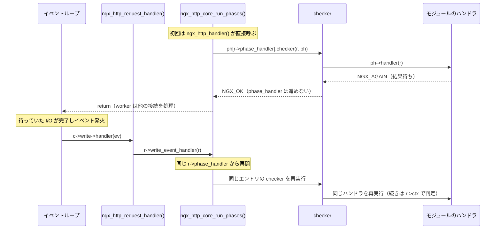
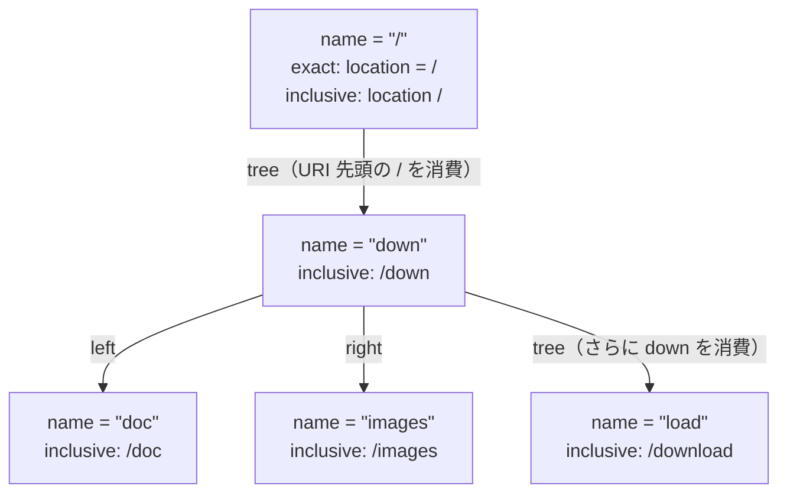

# 第10章 フェーズエンジンと location 検索

> **本章で読むソース**
>
> - [`src/http/ngx_http_core_module.h`](https://github.com/nginx/nginx/blob/release-1.31.2/src/http/ngx_http_core_module.h)
> - [`src/http/ngx_http_core_module.c`](https://github.com/nginx/nginx/blob/release-1.31.2/src/http/ngx_http_core_module.c)
> - [`src/http/ngx_http.c`](https://github.com/nginx/nginx/blob/release-1.31.2/src/http/ngx_http.c)
> - [`src/http/ngx_http_request.c`](https://github.com/nginx/nginx/blob/release-1.31.2/src/http/ngx_http_request.c)

## この章の狙い

第9章では、リクエストラインとヘッダのパースが完了し、`ngx_http_process_request()` が `ngx_http_handler()` を呼ぶところまでを追った。
本章は、そこから始まるリクエスト処理の本体、すなわち **フェーズエンジン**を読む。
nginx は1本のリクエストの処理を11個のフェーズに分割し、各モジュールは自分のハンドラを担当フェーズに登録する。
設定パースの最後にこれらのハンドラが1本の配列に平坦化され、実行時は `ngx_http_core_run_phases()` がその配列を先頭から走査するだけでリクエストが進行する。
フェーズの中でもっとも複雑な find config フェーズが行う location 検索についても、静的 location を**三分木**に組み上げる設定時の処理と、URI の前方一致検索を URI の文字数に比例する時間で終える実行時の処理を読む。

## 前提

第2章のモジュールアーキテクチャ、特に HTTP モジュールの `postconfiguration` コールバックと、main/srv/loc の3層の設定構造（`loc_conf` 配列）を前提とする。
第7章のイベントループ（イベントのハンドラ呼び出しと posted キュー）と、第9章で見た `ngx_http_request_t` の生成も前提とする。

## HTTP 処理を刻む11のフェーズ

nginx は、リクエスト1本の処理を `ngx_http_phases` 列挙で定義された11のフェーズに分割する。

[`src/http/ngx_http_core_module.h` L110-L129](https://github.com/nginx/nginx/blob/release-1.31.2/src/http/ngx_http_core_module.h#L110-L129)

```c
typedef enum {
    NGX_HTTP_POST_READ_PHASE = 0,

    NGX_HTTP_SERVER_REWRITE_PHASE,

    NGX_HTTP_FIND_CONFIG_PHASE,
    NGX_HTTP_REWRITE_PHASE,
    NGX_HTTP_POST_REWRITE_PHASE,

    NGX_HTTP_PREACCESS_PHASE,

    NGX_HTTP_ACCESS_PHASE,
    NGX_HTTP_POST_ACCESS_PHASE,

    NGX_HTTP_PRECONTENT_PHASE,

    NGX_HTTP_CONTENT_PHASE,

    NGX_HTTP_LOG_PHASE
} ngx_http_phases;
```

各フェーズの役割と、標準モジュールのうちそこへハンドラを登録する代表例は次のとおりである。

- **POST_READ**：ヘッダ読み込み直後の処理。`realip` モジュールがクライアントアドレスを付け替える。
- **SERVER_REWRITE**：server ブロックレベルの `rewrite`/`return`/`set` を実行する（`rewrite` モジュール）。
- **FIND_CONFIG**：URI に対応する location を検索し、`r->loc_conf` を確定する。モジュールのハンドラは置かれず、core が組み込む。
- **REWRITE**：location ブロックレベルの `rewrite` 等を実行する。
- **POST_REWRITE**：rewrite で URI が変わったかを確認し、変わっていれば FIND_CONFIG へ戻す。core が組み込む。
- **PREACCESS**：アクセス制御の前処理。`limit_req`/`limit_conn` がレート制限と同時接続数制限を課す。
- **ACCESS**：アクセス可否の判定。`access`（allow/deny）、`auth_basic`、`auth_request` が並ぶ。
- **POST_ACCESS**：ACCESS フェーズの判定結果（`satisfy` の集計）を精算する。core が組み込む。
- **PRECONTENT**：コンテンツ生成の直前処理。`try_files` と `mirror` がここに登録する。
- **CONTENT**：レスポンス本体を生成する。`index`、`autoindex`、`static` などのハンドラと、後述する `r->content_handler` が担う。
- **LOG**：アクセスログの出力（`log` モジュール）。

モジュールがフェーズへ登録する方法は一様で、`postconfiguration` コールバックの中で `cmcf->phases[<フェーズ>].handlers` という `ngx_array_t` にハンドラ関数を push する。
static モジュールを例に取る。

[`src/http/modules/ngx_http_static_module.c` L281-L297](https://github.com/nginx/nginx/blob/release-1.31.2/src/http/modules/ngx_http_static_module.c#L281-L297)

```c
static ngx_int_t
ngx_http_static_init(ngx_conf_t *cf)
{
    ngx_http_handler_pt        *h;
    ngx_http_core_main_conf_t  *cmcf;

    cmcf = ngx_http_conf_get_module_main_conf(cf, ngx_http_core_module);

    h = ngx_array_push(&cmcf->phases[NGX_HTTP_CONTENT_PHASE].handlers);
    if (h == NULL) {
        return NGX_ERROR;
    }

    *h = ngx_http_static_handler;

    return NGX_OK;
}
```

11フェーズのうち LOG フェーズだけは、後述するフェーズエンジンの配列に入らない。
LOG フェーズのハンドラは、リクエストの終了処理の中で `ngx_http_log_request()` が `cmcf->phases[NGX_HTTP_LOG_PHASE]` の配列を直接なめて呼び出す。

[`src/http/ngx_http_request.c` L4000-L4015](https://github.com/nginx/nginx/blob/release-1.31.2/src/http/ngx_http_request.c#L4000-L4015)

```c
static void
ngx_http_log_request(ngx_http_request_t *r)
{
    ngx_uint_t                  i, n;
    ngx_http_handler_pt        *log_handler;
    ngx_http_core_main_conf_t  *cmcf;

    cmcf = ngx_http_get_module_main_conf(r, ngx_http_core_module);

    log_handler = cmcf->phases[NGX_HTTP_LOG_PHASE].handlers.elts;
    n = cmcf->phases[NGX_HTTP_LOG_PHASE].handlers.nelts;

    for (i = 0; i < n; i++) {
        log_handler[i](r);
    }
}
```

ログはリクエストがどの経路で終わっても必ず1回だけ出力する必要があり、途中で中断や再開が起きるフェーズエンジンの進行とは性質が異なるため、エンジンの外に置かれていると考えられる。

## フェーズハンドラの1本の配列への平坦化

`cmcf->phases[]` はフェーズごとに独立した配列であり、そのまま実行すると「フェーズを進めるループ」と「フェーズ内のハンドラを進めるループ」の二重ループになる。
nginx はこれを設定パースの最終段階で1本の配列に**平坦化**する。
配列の要素は `ngx_http_phase_handler_t` で、モジュールのハンドラ本体に加えて、フェーズごとの実行規約を実装する **checker** 関数と、ジャンプ先インデックス `next` を持つ。

[`src/http/ngx_http_core_module.h` L131-L147](https://github.com/nginx/nginx/blob/release-1.31.2/src/http/ngx_http_core_module.h#L131-L147)

```c
typedef struct ngx_http_phase_handler_s  ngx_http_phase_handler_t;

typedef ngx_int_t (*ngx_http_phase_handler_pt)(ngx_http_request_t *r,
    ngx_http_phase_handler_t *ph);

struct ngx_http_phase_handler_s {
    ngx_http_phase_handler_pt  checker;
    ngx_http_handler_pt        handler;
    ngx_uint_t                 next;
};


typedef struct {
    ngx_http_phase_handler_t  *handlers;
    ngx_uint_t                 server_rewrite_index;
    ngx_uint_t                 location_rewrite_index;
} ngx_http_phase_engine_t;
```

平坦化を行うのが `ngx_http_init_phase_handlers()` である。
`ngx_http_block()`（`http` ブロックの処理本体）が全モジュールの `postconfiguration` を呼び終えた後、すなわちすべてのハンドラ登録が出そろった時点で1回だけ呼ばれる。
前半は配列サイズの計算と確保を行う。

[`src/http/ngx_http.c` L454-L485](https://github.com/nginx/nginx/blob/release-1.31.2/src/http/ngx_http.c#L454-L485)

```c
static ngx_int_t
ngx_http_init_phase_handlers(ngx_conf_t *cf, ngx_http_core_main_conf_t *cmcf)
{
    ngx_int_t                   j;
    ngx_uint_t                  i, n;
    ngx_uint_t                  find_config_index, use_rewrite, use_access;
    ngx_http_handler_pt        *h;
    ngx_http_phase_handler_t   *ph;
    ngx_http_phase_handler_pt   checker;

    cmcf->phase_engine.server_rewrite_index = (ngx_uint_t) -1;
    cmcf->phase_engine.location_rewrite_index = (ngx_uint_t) -1;
    find_config_index = 0;
    use_rewrite = cmcf->phases[NGX_HTTP_REWRITE_PHASE].handlers.nelts ? 1 : 0;
    use_access = cmcf->phases[NGX_HTTP_ACCESS_PHASE].handlers.nelts ? 1 : 0;

    n = 1                  /* find config phase */
        + use_rewrite      /* post rewrite phase */
        + use_access;      /* post access phase */

    for (i = 0; i < NGX_HTTP_LOG_PHASE; i++) {
        n += cmcf->phases[i].handlers.nelts;
    }

    ph = ngx_pcalloc(cf->pool,
                     n * sizeof(ngx_http_phase_handler_t) + sizeof(void *));
    if (ph == NULL) {
        return NGX_ERROR;
    }

    cmcf->phase_engine.handlers = ph;
    n = 0;
```

サイズは「全フェーズの登録ハンドラ数の合計」に、core が組み込む3エントリ（FIND_CONFIG は常に1、POST_REWRITE と POST_ACCESS はそれぞれ rewrite/access のハンドラが存在するときだけ1）を足したものになる。
`ngx_pcalloc()` で末尾に `sizeof(void *)` を余分に確保しているのは、配列の終端を `checker == NULL` で表すためである（ゼロクリアされているので終端エントリの `checker` は自然に NULL になる）。
POST_REWRITE と POST_ACCESS を無条件に組み込まない点は、実行時のループから「するべき仕事がないエントリ」を丸ごと取り除く判断であり、rewrite も access も使わない設定ではその分だけ配列が短くなる。

後半がフェーズごとの詰め込みである。

[`src/http/ngx_http.c` L487-L560](https://github.com/nginx/nginx/blob/release-1.31.2/src/http/ngx_http.c#L487-L560)

```c
    for (i = 0; i < NGX_HTTP_LOG_PHASE; i++) {
        h = cmcf->phases[i].handlers.elts;

        switch (i) {

        case NGX_HTTP_SERVER_REWRITE_PHASE:
            if (cmcf->phase_engine.server_rewrite_index == (ngx_uint_t) -1) {
                cmcf->phase_engine.server_rewrite_index = n;
            }
            checker = ngx_http_core_rewrite_phase;

            break;

        case NGX_HTTP_FIND_CONFIG_PHASE:
            find_config_index = n;

            ph->checker = ngx_http_core_find_config_phase;
            n++;
            ph++;

            continue;

        case NGX_HTTP_REWRITE_PHASE:
            if (cmcf->phase_engine.location_rewrite_index == (ngx_uint_t) -1) {
                cmcf->phase_engine.location_rewrite_index = n;
            }
            checker = ngx_http_core_rewrite_phase;

            break;

        case NGX_HTTP_POST_REWRITE_PHASE:
            if (use_rewrite) {
                ph->checker = ngx_http_core_post_rewrite_phase;
                ph->next = find_config_index;
                n++;
                ph++;
            }

            continue;

        case NGX_HTTP_ACCESS_PHASE:
            checker = ngx_http_core_access_phase;
            n++;
            break;

        case NGX_HTTP_POST_ACCESS_PHASE:
            if (use_access) {
                ph->checker = ngx_http_core_post_access_phase;
                ph->next = n;
                ph++;
            }

            continue;

        case NGX_HTTP_CONTENT_PHASE:
            checker = ngx_http_core_content_phase;
            break;

        default:
            checker = ngx_http_core_generic_phase;
        }

        n += cmcf->phases[i].handlers.nelts;

        for (j = cmcf->phases[i].handlers.nelts - 1; j >= 0; j--) {
            ph->checker = checker;
            ph->handler = h[j];
            ph->next = n;
            ph++;
        }
    }

    return NGX_OK;
}
```

読み取れる点が3つある。

第一に、`next` はすべて設定時に計算済みの定数である。
通常のフェーズでは `next` は「次のフェーズの先頭インデックス」を指し、POST_REWRITE のエントリだけは `find_config_index`、すなわち FIND_CONFIG エントリ自身を指す（URI が書き換わったときのループバック用）。
ACCESS フェーズの `case` で先に `n++` している点は、access ハンドラの `next` が POST_ACCESS エントリの1つ先を指すようにするためである（`satisfy any` で1つの access ハンドラが許可を出したとき、残りの access ハンドラと POST_ACCESS の精算をまとめて飛ばす。詳細は後述）。

第二に、フェーズ内のハンドラは登録の逆順（`j` を降順に走査）で配列に置かれる。
`postconfiguration` はモジュールの定義順に呼ばれるため、逆順に詰めると「後に定義されたモジュールほど先に実行される」ことになる。
CONTENT フェーズで、`static` より後に定義される `index` が先に実行され、ディレクトリ URI を index ファイルへの内部リダイレクトで処理してから `static` に実ファイルの配信が回る、という標準の実行順はこの反転で成立している。

第三に、`server_rewrite_index` が記録される。
これは内部リダイレクト（`ngx_http_internal_redirect()` など）で処理をやり直すとき、POST_READ を飛ばして SERVER_REWRITE から再開するための開始インデックスであり、次節の `ngx_http_handler()` で使われる。

代表的なモジュール構成での平坦化の結果を図示する。

```mermaid
graph LR
    subgraph phases["設定時: cmcf->phases[11]（フェーズ別の ngx_array_t）"]
        P0["POST_READ: realip"]
        P1["SERVER_REWRITE: rewrite"]
        P5["PREACCESS: limit_req, limit_conn"]
        P6["ACCESS: access, auth_basic"]
        P9["CONTENT: static, index"]
    end
    subgraph engine["実行時: phase_engine.handlers[]（1本の配列）"]
        E0["0: generic / realip"]
        E1["1: rewrite / rewrite(server)"]
        E2["2: find_config"]
        E3["3: rewrite / rewrite(location)"]
        E4["4: post_rewrite"]
        E5["5: generic / limit_req"]
        E6["6: generic / limit_conn"]
        E7["7: access / access"]
        E8["8: access / auth_basic"]
        E9["9: post_access"]
        E10["10: content / index"]
        E11["11: content / static"]
        E12["12: checker = NULL（終端）"]
    end
    phases -->|"ngx_http_init_phase_handlers()"| engine
    E4 -.->|"next = 2（URI 変更時に戻る）"| E2
    E7 -.->|"next = 10（satisfy any の許可時）"| E10
```



この平坦化そのものが本章の最適化の1つ目である。
実行時のエンジンは、後述のとおり `r->phase_handler` という整数インデックスを1つ進めるか `next` へ差し替えるかしかしない。
「いまどのフェーズにいるか」「このフェーズは空か」「次のフェーズはどこか」という判定はすべて設定時に済んでいて、リクエストごとに繰り返される実行ループからフェーズ境界の分岐が消えている。
これが速い理由は、リクエストごとに十数回は回るループの1周が「配列1要素の関数ポインタ呼び出し」だけに縮み、分岐予測もデータアクセスも単純な線形走査に収まるからである。

## 実行エンジン `ngx_http_core_run_phases()` と checker の契約

エンジンの入口は `ngx_http_handler()` である。

[`src/http/ngx_http_core_module.c` L840-L880](https://github.com/nginx/nginx/blob/release-1.31.2/src/http/ngx_http_core_module.c#L840-L880)

```c
void
ngx_http_handler(ngx_http_request_t *r)
{
    ngx_http_core_main_conf_t  *cmcf;

    r->connection->log->action = NULL;

    if (!r->internal) {

        // ... (中略) ...

        r->lingering_close = (r->headers_in.content_length_n > 0
                              || r->headers_in.chunked);
        r->phase_handler = 0;

    } else {
        cmcf = ngx_http_get_module_main_conf(r, ngx_http_core_module);
        r->phase_handler = cmcf->phase_engine.server_rewrite_index;
    }

    r->valid_location = 1;
#if (NGX_HTTP_GZIP)
    r->gzip_tested = 0;
    r->gzip_ok = 0;
    r->gzip_vary = 0;
#endif

    r->write_event_handler = ngx_http_core_run_phases;
    ngx_http_core_run_phases(r);
}
```

**`r->phase_handler`** は、フェーズエンジン配列の現在位置を表すリクエストごとのインデックスである（`ngx_http_request_t` のメンバ）。
クライアントから届いた通常のリクエストは0、すなわち配列の先頭から始まる。
`r->internal` が立ったリクエスト（内部リダイレクトや named location へのジャンプ）は、`server_rewrite_index` から再開する。
`r->write_event_handler` に `ngx_http_core_run_phases` を設定してから初回を直接呼んでいる点が、後述する非同期継続の仕掛けである。

エンジン本体は短い。

[`src/http/ngx_http_core_module.c` L883-L902](https://github.com/nginx/nginx/blob/release-1.31.2/src/http/ngx_http_core_module.c#L883-L902)

```c
void
ngx_http_core_run_phases(ngx_http_request_t *r)
{
    ngx_int_t                   rc;
    ngx_http_phase_handler_t   *ph;
    ngx_http_core_main_conf_t  *cmcf;

    cmcf = ngx_http_get_module_main_conf(r, ngx_http_core_module);

    ph = cmcf->phase_engine.handlers;

    while (ph[r->phase_handler].checker) {

        rc = ph[r->phase_handler].checker(r, &ph[r->phase_handler]);

        if (rc == NGX_OK) {
            return;
        }
    }
}
```

エンジンと checker の間の契約は2値だけである。

- checker が **NGX_AGAIN** を返す：`r->phase_handler` は checker 自身が更新済みであり、エンジンは次のエントリの処理を続ける。
- checker が **NGX_OK** を返す：エンジンは即座に return し、制御をイベントループへ返す。リクエストの処理は終了したか、または I/O 待ちで中断している。

モジュールのハンドラが返す多様な値（`NGX_OK`/`NGX_DECLINED`/`NGX_AGAIN`/`NGX_DONE`/HTTP ステータスコード）をこの2値に翻訳するのが checker の仕事であり、フェーズごとに翻訳規則が違う。
以下、checker を1つずつ読む。

### `ngx_http_core_generic_phase()`：素通し型のフェーズ

POST_READ、PREACCESS、PRECONTENT の3フェーズは共通の checker を使う。

[`src/http/ngx_http_core_module.c` L905-L939](https://github.com/nginx/nginx/blob/release-1.31.2/src/http/ngx_http_core_module.c#L905-L939)

```c
ngx_int_t
ngx_http_core_generic_phase(ngx_http_request_t *r, ngx_http_phase_handler_t *ph)
{
    ngx_int_t  rc;

    /*
     * generic phase checker,
     * used by the post read and pre-access phases
     */

    ngx_log_debug1(NGX_LOG_DEBUG_HTTP, r->connection->log, 0,
                   "generic phase: %ui", r->phase_handler);

    rc = ph->handler(r);

    if (rc == NGX_OK) {
        r->phase_handler = ph->next;
        return NGX_AGAIN;
    }

    if (rc == NGX_DECLINED) {
        r->phase_handler++;
        return NGX_AGAIN;
    }

    if (rc == NGX_AGAIN || rc == NGX_DONE) {
        return NGX_OK;
    }

    /* rc == NGX_ERROR || rc == NGX_HTTP_...  */

    ngx_http_finalize_request(r, rc);

    return NGX_OK;
}
```

ハンドラの戻り値の意味はここで確定する。

- **NGX_OK**：このフェーズの決着がついた。`next` で次フェーズの先頭へ飛ぶ（同じフェーズの残りのハンドラは呼ばれない）。
- **NGX_DECLINED**：自分の出る幕ではない。インデックスを1つ進め、同じフェーズの次のハンドラに委ねる。
- **NGX_AGAIN / NGX_DONE**：I/O 待ちなどで中断する。`r->phase_handler` を動かさずにエンジンを止め、再開時に同じハンドラをもう一度呼ばせる。
- それ以外（`NGX_ERROR` や HTTP ステータス）：`ngx_http_finalize_request()` でリクエストを終わらせる。

### `ngx_http_core_rewrite_phase()`：全ハンドラを必ず回す

SERVER_REWRITE と REWRITE の checker は generic とよく似ているが、`NGX_OK` の扱いが違う。

[`src/http/ngx_http_core_module.c` L942-L966](https://github.com/nginx/nginx/blob/release-1.31.2/src/http/ngx_http_core_module.c#L942-L966)

```c
ngx_int_t
ngx_http_core_rewrite_phase(ngx_http_request_t *r, ngx_http_phase_handler_t *ph)
{
    ngx_int_t  rc;

    ngx_log_debug1(NGX_LOG_DEBUG_HTTP, r->connection->log, 0,
                   "rewrite phase: %ui", r->phase_handler);

    rc = ph->handler(r);

    if (rc == NGX_DECLINED) {
        r->phase_handler++;
        return NGX_AGAIN;
    }

    if (rc == NGX_DONE) {
        return NGX_OK;
    }

    /* NGX_OK, NGX_AGAIN, NGX_ERROR, NGX_HTTP_...  */

    ngx_http_finalize_request(r, rc);

    return NGX_OK;
}
```

rewrite 系のハンドラは、続行するなら必ず `NGX_DECLINED` を返す約束であり、`NGX_OK` を返すとリクエストが終了扱いになる。
「1つのモジュールが決着をつけたら残りを飛ばす」という generic の規則を持たないのは、rewrite フェーズでは複数モジュール（`rewrite` 本体や第三者モジュール）の書き換えを全部適用してから次へ進む必要があるためである。

### `ngx_http_core_post_rewrite_phase()`：FIND_CONFIG へのループバック

REWRITE フェーズで `rewrite` ディレクティブが URI を書き換えると、`r->uri_changed` が立つ。
POST_REWRITE の checker はそれを検査し、書き換わっていれば location 検索をやり直させる。

[`src/http/ngx_http_core_module.c` L1064-L1105](https://github.com/nginx/nginx/blob/release-1.31.2/src/http/ngx_http_core_module.c#L1064-L1105)

```c
ngx_int_t
ngx_http_core_post_rewrite_phase(ngx_http_request_t *r,
    ngx_http_phase_handler_t *ph)
{
    ngx_http_core_srv_conf_t  *cscf;

    ngx_log_debug1(NGX_LOG_DEBUG_HTTP, r->connection->log, 0,
                   "post rewrite phase: %ui", r->phase_handler);

    if (!r->uri_changed) {
        r->phase_handler++;
        return NGX_AGAIN;
    }

    // ... (中略) ...

    r->uri_changes--;

    if (r->uri_changes == 0) {
        ngx_log_error(NGX_LOG_ERR, r->connection->log, 0,
                      "rewrite or internal redirection cycle "
                      "while processing \"%V\"", &r->uri);

        ngx_http_finalize_request(r, NGX_HTTP_INTERNAL_SERVER_ERROR);
        return NGX_OK;
    }

    r->phase_handler = ph->next;

    cscf = ngx_http_get_module_srv_conf(r, ngx_http_core_module);
    r->loc_conf = cscf->ctx->loc_conf;

    return NGX_AGAIN;
}
```

このエントリの `next` は、平坦化のときに `find_config_index` へ差し替えられていた。
`r->loc_conf` を server ブロックのデフォルト（`cscf->ctx->loc_conf`）へ戻してから FIND_CONFIG へ飛ぶので、新しい URI に対する location 検索が最初からやり直される。
`r->uri_changes`（初期値10）が尽きたら 500 を返すのは、`rewrite` の書き換え同士が循環したときの無限ループ防止である。

### `ngx_http_core_access_phase()` と `ngx_http_core_post_access_phase()`：satisfy の実現

ACCESS フェーズの checker は、`satisfy all`（既定）と `satisfy any` の意味論をここで実装する。

[`src/http/ngx_http_core_module.c` L1108-L1182](https://github.com/nginx/nginx/blob/release-1.31.2/src/http/ngx_http_core_module.c#L1108-L1182)

```c
ngx_int_t
ngx_http_core_access_phase(ngx_http_request_t *r, ngx_http_phase_handler_t *ph)
{
    ngx_int_t                  rc;
    ngx_table_elt_t           *h;
    ngx_http_core_loc_conf_t  *clcf;

    if (r != r->main) {
        r->phase_handler = ph->next;
        return NGX_AGAIN;
    }

    ngx_log_debug1(NGX_LOG_DEBUG_HTTP, r->connection->log, 0,
                   "access phase: %ui", r->phase_handler);

    rc = ph->handler(r);

    if (rc == NGX_DECLINED) {
        r->phase_handler++;
        return NGX_AGAIN;
    }

    if (rc == NGX_AGAIN || rc == NGX_DONE) {
        return NGX_OK;
    }

    clcf = ngx_http_get_module_loc_conf(r, ngx_http_core_module);

    if (clcf->satisfy == NGX_HTTP_SATISFY_ALL) {

        if (rc == NGX_OK) {
            r->phase_handler++;
            return NGX_AGAIN;
        }

    } else {
        if (rc == NGX_OK) {
            r->access_code = 0;

            // ... (中略) ...

            r->phase_handler = ph->next;
            return NGX_AGAIN;
        }

        if (rc == NGX_HTTP_FORBIDDEN
            || rc == NGX_HTTP_UNAUTHORIZED
            || rc == NGX_HTTP_PROXY_AUTH_REQUIRED)
        {
            if (r->access_code != NGX_HTTP_UNAUTHORIZED
                && r->access_code != NGX_HTTP_PROXY_AUTH_REQUIRED)
            {
                r->access_code = rc;
            }

            r->phase_handler++;
            return NGX_AGAIN;
        }
    }

    /* rc == NGX_ERROR || rc == NGX_HTTP_...  */

    if (rc == NGX_HTTP_UNAUTHORIZED || rc == NGX_HTTP_PROXY_AUTH_REQUIRED) {
        r->access_code = rc;
        return ngx_http_core_auth_delay(r);
    }

    ngx_http_finalize_request(r, rc);
    return NGX_OK;
}
```

冒頭の `r != r->main` はサブリクエストの判定であり、サブリクエストは `next` で ACCESS と POST_ACCESS を丸ごと飛ばす（アクセス可否は親リクエストで判定済みのため、と考えられる）。
`satisfy all` では、ハンドラが `NGX_OK`（許可）を返しても次の access ハンドラへ進み、全員の許可が要る。
`satisfy any` では、1つの `NGX_OK` で `next`（POST_ACCESS の1つ先。平坦化の節で見た `n++` の効果）へ飛び、拒否（403/401 等）はその場で終わらせず `r->access_code` に記録して次のハンドラに望みをつなぐ。

記録された `access_code` を精算するのが POST_ACCESS である。

[`src/http/ngx_http_core_module.c` L1185-L1216](https://github.com/nginx/nginx/blob/release-1.31.2/src/http/ngx_http_core_module.c#L1185-L1216)

```c
ngx_int_t
ngx_http_core_post_access_phase(ngx_http_request_t *r,
    ngx_http_phase_handler_t *ph)
{
    ngx_int_t  access_code;

    ngx_log_debug1(NGX_LOG_DEBUG_HTTP, r->connection->log, 0,
                   "post access phase: %ui", r->phase_handler);

    access_code = r->access_code;

    if (access_code) {
        if (access_code == NGX_HTTP_FORBIDDEN) {
            ngx_log_error(NGX_LOG_ERR, r->connection->log, 0,
                          "access forbidden by rule");
        }

        if (access_code == NGX_HTTP_UNAUTHORIZED
            || access_code == NGX_HTTP_PROXY_AUTH_REQUIRED)
        {
            return ngx_http_core_auth_delay(r);
        }

        r->access_code = 0;

        ngx_http_finalize_request(r, access_code);
        return NGX_OK;
    }

    r->phase_handler++;
    return NGX_AGAIN;
}
```

`satisfy any` で誰も許可しないままここへ到達すると、記録済みの拒否コードでリクエストが終了する。
`access_code` が空なら素通りである。

## NGX_AGAIN と非同期継続

checker が `NGX_OK` を返してエンジンが止まるのは、リクエストが終了した場合だけではない。
ハンドラが `NGX_AGAIN` や `NGX_DONE` を返した場合（`auth_request` がサブリクエストの完了を待つ、PREACCESS のモジュールが外部 I/O を待つ、など）もエンジンは return し、worker プロセスはそのままイベントループへ戻って他の接続を処理する。

再開の経路は第9章までに出そろっている部品の組み合わせである。
`ngx_http_process_request()` は、フェーズエンジンに入る直前に接続の読み書きイベントのハンドラを `ngx_http_request_handler` へ差し替えている。

[`src/http/ngx_http_request.c` L2201-L2205](https://github.com/nginx/nginx/blob/release-1.31.2/src/http/ngx_http_request.c#L2201-L2205)

```c
    c->read->handler = ngx_http_request_handler;
    c->write->handler = ngx_http_request_handler;
    r->read_event_handler = ngx_http_block_reading;

    ngx_http_handler(r);
```

以後、この接続でイベントが発火するたびに `ngx_http_request_handler()` が呼ばれ、リクエスト側のイベントハンドラへ委譲する。

[`src/http/ngx_http_request.c` L2576-L2610](https://github.com/nginx/nginx/blob/release-1.31.2/src/http/ngx_http_request.c#L2576-L2610)

```c
static void
ngx_http_request_handler(ngx_event_t *ev)
{
    ngx_connection_t    *c;
    ngx_http_request_t  *r;

    c = ev->data;
    r = c->data;

    ngx_http_set_log_request(c->log, r);

    ngx_log_debug2(NGX_LOG_DEBUG_HTTP, c->log, 0,
                   "http run request: \"%V?%V\"", &r->uri, &r->args);

    if (c->close) {
        r->main->count++;
        ngx_http_terminate_request(r, 0);
        ngx_http_run_posted_requests(c);
        return;
    }

    if (ev->delayed && ev->timedout) {
        ev->delayed = 0;
        ev->timedout = 0;
    }

    if (ev->write) {
        r->write_event_handler(r);

    } else {
        r->read_event_handler(r);
    }

    ngx_http_run_posted_requests(c);
}
```

`ngx_http_handler()` が `r->write_event_handler = ngx_http_core_run_phases` を設定していたので、書き込みイベントが発火すると `ngx_http_core_run_phases()` がもう一度呼ばれる。
このとき `r->phase_handler` は中断時のまま動いていないため、エンジンは中断したハンドラと同じエントリの checker から実行を再開する。
つまり中断と再開のための状態は、リクエスト構造体の整数インデックス1個に集約されている。
同じハンドラが再度呼ばれるので、各モジュールは自分のモジュールコンテキスト（`r->ctx`）に進行状態を持ち、2回目の呼び出しで「待っていた結果が届いたか」を自分で判定する。



## location 検索：FIND_CONFIG フェーズ

### location の種類と設定時のソート

`location` ディレクティブには、完全一致（`=`）、前方一致（修飾子なし）、正規表現抑止つき前方一致（`^~`）、正規表現（`~` と `~*`）、named location（`@`）の5種類がある（`if` ブロックなどが作る無名 location もある）。
設定パース中、server ブロック直下の location は `ngx_http_location_queue_t` のキューに集められる。

[`src/http/ngx_http_core_module.h` L462-L470](https://github.com/nginx/nginx/blob/release-1.31.2/src/http/ngx_http_core_module.h#L462-L470)

```c
typedef struct {
    ngx_queue_t                      queue;
    ngx_http_core_loc_conf_t        *exact;
    ngx_http_core_loc_conf_t        *inclusive;
    ngx_str_t                       *name;
    u_char                          *file_name;
    ngx_uint_t                       line;
    ngx_queue_t                      list;
} ngx_http_location_queue_t;
```

完全一致の location は `exact` に、前方一致の location は `inclusive` に入る（後で同名の両者が1要素に併合されるため、フィールドが分かれている）。
`http` ブロックの処理の終盤で、`ngx_http_init_locations()` がこのキューを `ngx_queue_sort()`（安定マージソート）で並べ替える。
比較関数の末尾が静的 location の順序を決める。

[`src/http/ngx_http.c` L927-L997](https://github.com/nginx/nginx/blob/release-1.31.2/src/http/ngx_http.c#L927-L997)

```c
static ngx_int_t
ngx_http_cmp_locations(const ngx_queue_t *one, const ngx_queue_t *two)
{
    ngx_int_t                   rc;
    ngx_http_core_loc_conf_t   *first, *second;
    ngx_http_location_queue_t  *lq1, *lq2;

    lq1 = (ngx_http_location_queue_t *) one;
    lq2 = (ngx_http_location_queue_t *) two;

    first = lq1->exact ? lq1->exact : lq1->inclusive;
    second = lq2->exact ? lq2->exact : lq2->inclusive;

    // ... (中略) ...

#if (NGX_PCRE)

    if (first->regex && !second->regex) {
        /* shift the regex matches to the end */
        return 1;
    }

    if (!first->regex && second->regex) {
        /* shift the regex matches to the end */
        return -1;
    }

    if (first->regex || second->regex) {
        /* do not sort the regex matches */
        return 0;
    }

#endif

    rc = ngx_filename_cmp(first->name.data, second->name.data,
                          ngx_min(first->name.len, second->name.len) + 1);

    if (rc == 0 && !first->exact_match && second->exact_match) {
        /* an exact match must be before the same inclusive one */
        return 1;
    }

    return rc;
}
```

省略した前半は、無名 location と named location をキューの末尾へ送る。
正規表現 location は末尾寄りに集めるだけで互いの順序を変えない（`return 0` と安定ソートの組み合わせ）。
正規表現の評価は設定ファイルに書いた順という nginx の仕様が、この「並べ替えない」比較で守られている。
静的 location は名前の辞書順に並び、同名なら完全一致が前方一致の直前に来る。

ソート後、`ngx_http_init_locations()` はキューを後ろから切り分け、named location の配列（`cscf->named_locations`）と正規表現 location の配列（`pclcf->regex_locations`）を作る。
キューに残った先頭部分が静的（完全一致と前方一致の）location であり、これが三分木の材料になる。

### 三分木の構築：`ngx_http_init_static_location_trees()`

静的 location の木を組み立てる入口は次の関数である。

[`src/http/ngx_http.c` L799-L842](https://github.com/nginx/nginx/blob/release-1.31.2/src/http/ngx_http.c#L799-L842)

```c
static ngx_int_t
ngx_http_init_static_location_trees(ngx_conf_t *cf,
    ngx_http_core_loc_conf_t *pclcf)
{
    ngx_queue_t                *q, *locations;
    ngx_http_core_loc_conf_t   *clcf;
    ngx_http_location_queue_t  *lq;

    locations = pclcf->locations;

    if (locations == NULL) {
        return NGX_OK;
    }

    if (ngx_queue_empty(locations)) {
        return NGX_OK;
    }

    for (q = ngx_queue_head(locations);
         q != ngx_queue_sentinel(locations);
         q = ngx_queue_next(q))
    {
        lq = (ngx_http_location_queue_t *) q;

        clcf = lq->exact ? lq->exact : lq->inclusive;

        if (ngx_http_init_static_location_trees(cf, clcf) != NGX_OK) {
            return NGX_ERROR;
        }
    }

    if (ngx_http_join_exact_locations(cf, locations) != NGX_OK) {
        return NGX_ERROR;
    }

    ngx_http_create_locations_list(locations, ngx_queue_head(locations));

    pclcf->static_locations = ngx_http_create_locations_tree(cf, locations, 0);
    if (pclcf->static_locations == NULL) {
        return NGX_ERROR;
    }

    return NGX_OK;
}
```

再帰の先頭でネストした location（location ブロックの中の location）にも同じ処理を適用し、そのうえで3段階の変形を行う。

第1段階の `ngx_http_join_exact_locations()` は、ソートで隣り合った同名の完全一致と前方一致（`location = /x` と `location /x`）を1つのキュー要素に併合する。

[`src/http/ngx_http.c` L1000-L1038](https://github.com/nginx/nginx/blob/release-1.31.2/src/http/ngx_http.c#L1000-L1038)

```c
static ngx_int_t
ngx_http_join_exact_locations(ngx_conf_t *cf, ngx_queue_t *locations)
{
    ngx_queue_t                *q, *x;
    ngx_http_location_queue_t  *lq, *lx;

    q = ngx_queue_head(locations);

    while (q != ngx_queue_last(locations)) {

        x = ngx_queue_next(q);

        lq = (ngx_http_location_queue_t *) q;
        lx = (ngx_http_location_queue_t *) x;

        if (lq->name->len == lx->name->len
            && ngx_filename_cmp(lq->name->data, lx->name->data, lx->name->len)
               == 0)
        {
            if ((lq->exact && lx->exact) || (lq->inclusive && lx->inclusive)) {
                ngx_log_error(NGX_LOG_EMERG, cf->log, 0,
                              "duplicate location \"%V\" in %s:%ui",
                              lx->name, lx->file_name, lx->line);

                return NGX_ERROR;
            }

            lq->inclusive = lx->inclusive;

            ngx_queue_remove(x);

            continue;
        }

        q = ngx_queue_next(q);
    }

    return NGX_OK;
}
```

これにより、木の1ノードが `exact` と `inclusive` の両方を持てるようになり、同名の2種類の location を1回の文字列比較で同時に判定できる。

第2段階の `ngx_http_create_locations_list()` は、ある前方一致 location の名前を接頭辞に持つ後続の location 群を、その要素の `list` フィールドへぶら下げる。

[`src/http/ngx_http.c` L1041-L1097](https://github.com/nginx/nginx/blob/release-1.31.2/src/http/ngx_http.c#L1041-L1097)

```c
static void
ngx_http_create_locations_list(ngx_queue_t *locations, ngx_queue_t *q)
{
    u_char                     *name;
    size_t                      len;
    ngx_queue_t                *x, tail;
    ngx_http_location_queue_t  *lq, *lx;

    if (q == ngx_queue_last(locations)) {
        return;
    }

    lq = (ngx_http_location_queue_t *) q;

    if (lq->inclusive == NULL) {
        ngx_http_create_locations_list(locations, ngx_queue_next(q));
        return;
    }

    len = lq->name->len;
    name = lq->name->data;

    for (x = ngx_queue_next(q);
         x != ngx_queue_sentinel(locations);
         x = ngx_queue_next(x))
    {
        lx = (ngx_http_location_queue_t *) x;

        if (len > lx->name->len
            || ngx_filename_cmp(name, lx->name->data, len) != 0)
        {
            break;
        }
    }

    q = ngx_queue_next(q);

    if (q == x) {
        ngx_http_create_locations_list(locations, x);
        return;
    }

    ngx_queue_split(locations, q, &tail);
    ngx_queue_add(&lq->list, &tail);

    if (x == ngx_queue_sentinel(locations)) {
        ngx_http_create_locations_list(&lq->list, ngx_queue_head(&lq->list));
        return;
    }

    ngx_queue_split(&lq->list, x, &tail);
    ngx_queue_add(locations, &tail);

    ngx_http_create_locations_list(&lq->list, ngx_queue_head(&lq->list));

    ngx_http_create_locations_list(locations, x);
}
```

ソート済みキューでは接頭辞関係にある location が必ず連続して並ぶため、この走査は「自分の名前 `len` 文字と一致し続ける区間」を切り出すだけで済む。
たとえば `/down` と `/download` があれば、`/download` は `/down` の `list` に移る。

第3段階の `ngx_http_create_locations_tree()` が木本体を組み立てる。

[`src/http/ngx_http.c` L1100-L1175](https://github.com/nginx/nginx/blob/release-1.31.2/src/http/ngx_http.c#L1100-L1175)

```c
/*
 * to keep cache locality for left leaf nodes, allocate nodes in following
 * order: node, left subtree, right subtree, inclusive subtree
 */

static ngx_http_location_tree_node_t *
ngx_http_create_locations_tree(ngx_conf_t *cf, ngx_queue_t *locations,
    size_t prefix)
{
    size_t                          len;
    ngx_queue_t                    *q, tail;
    ngx_http_location_queue_t      *lq;
    ngx_http_location_tree_node_t  *node;

    q = ngx_queue_middle(locations);

    lq = (ngx_http_location_queue_t *) q;
    len = lq->name->len - prefix;

    node = ngx_palloc(cf->pool,
                      offsetof(ngx_http_location_tree_node_t, name) + len);
    if (node == NULL) {
        return NULL;
    }

    node->left = NULL;
    node->right = NULL;
    node->tree = NULL;
    node->exact = lq->exact;
    node->inclusive = lq->inclusive;

    node->auto_redirect = (u_char) ((lq->exact && lq->exact->auto_redirect)
                           || (lq->inclusive && lq->inclusive->auto_redirect));

    node->len = (u_short) len;
    ngx_memcpy(node->name, &lq->name->data[prefix], len);

    ngx_queue_split(locations, q, &tail);

    if (ngx_queue_empty(locations)) {
        /*
         * ngx_queue_split() insures that if left part is empty,
         * then right one is empty too
         */
        goto inclusive;
    }

    node->left = ngx_http_create_locations_tree(cf, locations, prefix);
    if (node->left == NULL) {
        return NULL;
    }

    ngx_queue_remove(q);

    if (ngx_queue_empty(&tail)) {
        goto inclusive;
    }

    node->right = ngx_http_create_locations_tree(cf, &tail, prefix);
    if (node->right == NULL) {
        return NULL;
    }

inclusive:

    if (ngx_queue_empty(&lq->list)) {
        return node;
    }

    node->tree = ngx_http_create_locations_tree(cf, &lq->list, prefix + len);
    if (node->tree == NULL) {
        return NULL;
    }

    return node;
}
```

ノードは3本の枝を持つ。

[`src/http/ngx_http_core_module.h` L473-L484](https://github.com/nginx/nginx/blob/release-1.31.2/src/http/ngx_http_core_module.h#L473-L484)

```c
struct ngx_http_location_tree_node_s {
    ngx_http_location_tree_node_t   *left;
    ngx_http_location_tree_node_t   *right;
    ngx_http_location_tree_node_t   *tree;

    ngx_http_core_loc_conf_t        *exact;
    ngx_http_core_loc_conf_t        *inclusive;

    u_short                          len;
    u_char                           auto_redirect;
    u_char                           name[1];
};
```

`left`/`right` は辞書順で小さい側と大きい側、`tree` は自分の名前を接頭辞に持つ location 群（第2段階で `list` にぶら下げたもの）である。
このため本書ではこの構造を「三分木」と呼ぶ。
`ngx_queue_middle()` でソート済みキューの中央要素を根に選ぶ再帰なので、left/right 方向は平衡した二分探索木になる。
`tree` 方向へ降りるとき `prefix` が伸び、ノードには接頭辞を除いた差分（`&lq->name->data[prefix]` から `len` バイト）だけが格納される。
親と重複する接頭辞をノードに持たないため、検索中に同じ文字を二度比較することがない。

`location = /`、`location /`、`location /doc`、`location /down`、`location /download`、`location /images` という設定なら、次の木ができる。



`/` はすべての静的 location の接頭辞なので、残り全部が根の `tree` 側へ入り、`/download` は `/down` の `tree` 側で差分 `load` として保持される。

### 実行時の検索：`ngx_http_core_find_static_location()`

実行時の木の走査は1つのループである。

[`src/http/ngx_http_core_module.c` L1505-L1589](https://github.com/nginx/nginx/blob/release-1.31.2/src/http/ngx_http_core_module.c#L1505-L1589)

```c
/*
 * NGX_OK       - exact match
 * NGX_DONE     - auto redirect
 * NGX_AGAIN    - inclusive match
 * NGX_DECLINED - no match
 */

static ngx_int_t
ngx_http_core_find_static_location(ngx_http_request_t *r,
    ngx_http_location_tree_node_t *node)
{
    u_char     *uri;
    size_t      len, n;
    ngx_int_t   rc, rv;

    len = r->uri.len;
    uri = r->uri.data;

    rv = NGX_DECLINED;

    for ( ;; ) {

        if (node == NULL) {
            return rv;
        }

        ngx_log_debug2(NGX_LOG_DEBUG_HTTP, r->connection->log, 0,
                       "test location: \"%*s\"",
                       (size_t) node->len, node->name);

        n = (len <= (size_t) node->len) ? len : node->len;

        rc = ngx_filename_cmp(uri, node->name, n);

        if (rc != 0) {
            node = (rc < 0) ? node->left : node->right;

            continue;
        }

        if (len > (size_t) node->len) {

            if (node->inclusive) {

                r->loc_conf = node->inclusive->loc_conf;
                rv = NGX_AGAIN;

                node = node->tree;
                uri += n;
                len -= n;

                continue;
            }

            /* exact only */

            node = node->right;

            continue;
        }

        if (len == (size_t) node->len) {

            if (node->exact) {
                r->loc_conf = node->exact->loc_conf;
                return NGX_OK;

            } else {
                r->loc_conf = node->inclusive->loc_conf;
                return NGX_AGAIN;
            }
        }

        /* len < node->len */

        if (len + 1 == (size_t) node->len && node->auto_redirect) {

            r->loc_conf = (node->exact) ? node->exact->loc_conf:
                                          node->inclusive->loc_conf;
            rv = NGX_DONE;
        }

        node = node->left;
    }
}
```

各ノードでは URI の先頭 `n` バイト（ノード名と URI の短いほう）だけを比較する。
不一致なら大小に応じて `left`/`right` へ降りる。
一致して URI のほうが長ければ、そのノードは前方一致でマッチしているので `r->loc_conf` を仮確定して `rv = NGX_AGAIN` を記録し、`uri += n; len -= n` で照合済みの接頭辞を捨てて `tree` 側へ降りる。
より長い location がその先で見つかればマッチが上書きされ、見つからなければ最後に記録した `loc_conf`（最長の前方一致）が生き残る。
「前方一致は最長のものが勝つ」という nginx の仕様は、この上書きの副産物として実現されている。
長さまで一致すれば `exact` を優先して確定（`NGX_OK`）し、なければ前方一致として確定（`NGX_AGAIN`）する。
`len + 1 == node->len` かつ `auto_redirect` の分岐は、`location /dir/` に `proxy_pass` 等が置かれているとき、URI `/dir` を `/dir/` へ301リダイレクトさせるための検出（`NGX_DONE`）である。

ここに本章の最適化の2つ目がある。
`tree` 方向へ進む場合だけ接頭辞を消費する。left/right 方向では同じ `uri` と `len` のまま別ノードを比較する。
left/right 方向の移動は平衡二分探索木の下降であり、比較はノード名の長さ分までで打ち切られる。
その結果、検索時間は URI の文字数にほぼ比例し、location の個数には対数的にしか依存しない。
これが速い理由は、location を先頭から1つずつ `strncmp` する素朴な実装で起きる「同じ接頭辞を location の数だけ繰り返し比較する」仕事が、木の構造によって1回に畳み込まれるからである。
さらに、木の生成コメント（前掲）が示すとおり、ノードを「自分、左部分木、右部分木、tree 部分木」の順にメモリプールへ確保することで、辞書順で小さい側をたどる典型的な下降がメモリ上の近い領域を読むようになっており、キャッシュ局所性にも配慮されている。

### `ngx_http_core_find_location()`：静的検索と正規表現の合流

静的な木の検索と正規表現の順次マッチを束ねるのが `ngx_http_core_find_location()` である。

[`src/http/ngx_http_core_module.c` L1427-L1502](https://github.com/nginx/nginx/blob/release-1.31.2/src/http/ngx_http_core_module.c#L1427-L1502)

```c
/*
 * NGX_OK       - exact or regex match
 * NGX_DONE     - auto redirect
 * NGX_AGAIN    - inclusive match
 * NGX_ERROR    - regex error
 * NGX_DECLINED - no match
 */

static ngx_int_t
ngx_http_core_find_location(ngx_http_request_t *r)
{
    ngx_int_t                  rc;
    ngx_http_core_loc_conf_t  *pclcf;
#if (NGX_PCRE)
    ngx_int_t                  n;
    ngx_uint_t                 noregex;
    ngx_http_core_loc_conf_t  *clcf, **clcfp;

    noregex = 0;
#endif

    pclcf = ngx_http_get_module_loc_conf(r, ngx_http_core_module);

    rc = ngx_http_core_find_static_location(r, pclcf->static_locations);

    if (rc == NGX_AGAIN) {

#if (NGX_PCRE)
        clcf = ngx_http_get_module_loc_conf(r, ngx_http_core_module);

        noregex = clcf->noregex;
#endif

        /* look up nested locations */

        rc = ngx_http_core_find_location(r);
    }

    if (rc == NGX_OK || rc == NGX_DONE) {
        return rc;
    }

    /* rc == NGX_DECLINED or rc == NGX_AGAIN in nested location */

#if (NGX_PCRE)

    if (noregex == 0 && pclcf->regex_locations) {

        for (clcfp = pclcf->regex_locations; *clcfp; clcfp++) {

            ngx_log_debug1(NGX_LOG_DEBUG_HTTP, r->connection->log, 0,
                           "test location: ~ \"%V\"", &(*clcfp)->name);

            n = ngx_http_regex_exec(r, (*clcfp)->regex, &r->uri);

            if (n == NGX_OK) {
                r->loc_conf = (*clcfp)->loc_conf;

                /* look up nested locations */

                rc = ngx_http_core_find_location(r);

                return (rc == NGX_ERROR) ? rc : NGX_OK;
            }

            if (n == NGX_DECLINED) {
                continue;
            }

            return NGX_ERROR;
        }
    }
#endif

    return rc;
}
```

処理の順序が location マッチの優先順位をそのまま表している。
まず静的な木を検索し、完全一致（`NGX_OK`）か auto redirect（`NGX_DONE`）ならそこで確定する。
前方一致（`NGX_AGAIN`）なら、マッチした location の内部にネストした location を同じ手順で再帰的に検索する。
そのうえで、`^~` 修飾子の location にマッチしていた場合（`clcf->noregex`）を除き、`regex_locations` 配列を設定ファイルに書かれた順に `ngx_http_regex_exec()` で試し、最初にマッチした正規表現 location が前方一致の結果を上書きする。
静的 location が名前順ソートと木構造で「書いた順序に依存しない最長一致」を提供するのに対し、正規表現 location は配列の順次走査で「書いた順に最初の一致」を提供する、という対比になっている。

### FIND_CONFIG フェーズの checker

以上の検索を呼び出すのが `ngx_http_core_find_config_phase()` である。

[`src/http/ngx_http_core_module.c` L969-L1000](https://github.com/nginx/nginx/blob/release-1.31.2/src/http/ngx_http_core_module.c#L969-L1000)

```c
ngx_int_t
ngx_http_core_find_config_phase(ngx_http_request_t *r,
    ngx_http_phase_handler_t *ph)
{
    u_char                    *p;
    size_t                     len;
    ngx_int_t                  rc;
    ngx_http_core_loc_conf_t  *clcf;

    r->content_handler = NULL;
    r->uri_changed = 0;

    rc = ngx_http_core_find_location(r);

    if (rc == NGX_ERROR) {
        ngx_http_finalize_request(r, NGX_HTTP_INTERNAL_SERVER_ERROR);
        return NGX_OK;
    }

    clcf = ngx_http_get_module_loc_conf(r, ngx_http_core_module);

    if (!r->internal && clcf->internal) {
        ngx_http_finalize_request(r, NGX_HTTP_NOT_FOUND);
        return NGX_OK;
    }

    ngx_log_debug2(NGX_LOG_DEBUG_HTTP, r->connection->log, 0,
                   "using configuration \"%s%V\"",
                   (clcf->noname ? "*" : (clcf->exact_match ? "=" : "")),
                   &clcf->name);

    ngx_http_update_location_config(r);
```

冒頭で `r->content_handler` と `r->uri_changed` をリセットしている点に注意する。
POST_REWRITE からループバックして再検索する場合も、前回の location に紐づいた content ハンドラが持ち越されないようにするためである。
検索後の `ngx_http_update_location_config()` は、確定した location の設定（`sendfile`、keepalive の可否、リクエストボディの扱いなど）を `r` に反映する。
残りの部分は、`client_max_body_size` の超過を 413 で拒否し、検索結果が `NGX_DONE`（auto redirect）なら `Location` ヘッダを組み立てて 301 を返し、それ以外は `r->phase_handler++` で次のエントリへ進む。

[`src/http/ngx_http_core_module.c` L1059-L1061](https://github.com/nginx/nginx/blob/release-1.31.2/src/http/ngx_http_core_module.c#L1059-L1061)

```c
    r->phase_handler++;
    return NGX_AGAIN;
}
```

## content フェーズと `content_handler`

CONTENT フェーズには、レスポンスを生成する経路が2つある。
1つは、これまで見てきたフェーズ配列に登録されたハンドラ（`index`、`static` など）で、どの location でも呼ばれうる。
もう1つは **`r->content_handler`** で、特定の location に置かれたディレクティブがその location 専用のコンテンツ生成関数を指定する経路である。

たとえば `proxy_pass` ディレクティブは、パース時に自分の location の `clcf->handler` へ proxy モジュールのハンドラを設定する。

[`src/http/modules/ngx_http_proxy_module.c` L4308-L4318](https://github.com/nginx/nginx/blob/release-1.31.2/src/http/modules/ngx_http_proxy_module.c#L4308-L4318)

```c
    if (plcf->upstream.upstream || plcf->proxy_lengths) {
        return "is duplicate";
    }

    clcf = ngx_http_conf_get_module_loc_conf(cf, ngx_http_core_module);

    clcf->handler = ngx_http_proxy_handler;

    if (clcf->name.len && clcf->name.data[clcf->name.len - 1] == '/') {
        clcf->auto_redirect = 1;
    }
```

（前節で見た auto redirect のフラグも、ここで一緒に立てられている。）
FIND_CONFIG フェーズで location が確定すると、`ngx_http_update_location_config()` の末尾が `clcf->handler` をリクエストへ写す。

[`src/http/ngx_http_core_module.c` L1421-L1424](https://github.com/nginx/nginx/blob/release-1.31.2/src/http/ngx_http_core_module.c#L1421-L1424)

```c
    if (clcf->handler) {
        r->content_handler = clcf->handler;
    }
}
```

CONTENT フェーズの checker は、この `content_handler` を最優先で実行する。

[`src/http/ngx_http_core_module.c` L1291-L1341](https://github.com/nginx/nginx/blob/release-1.31.2/src/http/ngx_http_core_module.c#L1291-L1341)

```c
ngx_int_t
ngx_http_core_content_phase(ngx_http_request_t *r,
    ngx_http_phase_handler_t *ph)
{
    size_t     root;
    ngx_int_t  rc;
    ngx_str_t  path;

    if (r->content_handler) {
        r->write_event_handler = ngx_http_request_empty_handler;
        ngx_http_finalize_request(r, r->content_handler(r));
        return NGX_OK;
    }

    ngx_log_debug1(NGX_LOG_DEBUG_HTTP, r->connection->log, 0,
                   "content phase: %ui", r->phase_handler);

    rc = ph->handler(r);

    if (rc != NGX_DECLINED) {
        ngx_http_finalize_request(r, rc);
        return NGX_OK;
    }

    /* rc == NGX_DECLINED */

    ph++;

    if (ph->checker) {
        r->phase_handler++;
        return NGX_AGAIN;
    }

    /* no content handler was found */

    if (r->uri.data[r->uri.len - 1] == '/') {

        if (ngx_http_map_uri_to_path(r, &path, &root, 0) != NULL) {
            ngx_log_error(NGX_LOG_ERR, r->connection->log, 0,
                          "directory index of \"%s\" is forbidden", path.data);
        }

        ngx_http_finalize_request(r, NGX_HTTP_FORBIDDEN);
        return NGX_OK;
    }

    ngx_log_error(NGX_LOG_ERR, r->connection->log, 0, "no handler found");

    ngx_http_finalize_request(r, NGX_HTTP_NOT_FOUND);
    return NGX_OK;
}
```

`content_handler` がある場合、フェーズ配列に登録された CONTENT ハンドラは一切呼ばれず、戻り値がそのまま `ngx_http_finalize_request()` に渡る。
その直前に `r->write_event_handler` を空ハンドラへ差し替えているのは、以後のイベント駆動を content ハンドラ側（proxy であれば第13章で扱う upstream 機構）が自前の `read_event_handler`/`write_event_handler` で引き継ぐためであり、書き込みイベントのたびにフェーズエンジンが再入してくるのを止めている。

`content_handler` がない場合は、フェーズ配列の CONTENT ハンドラたちが順に試される。
generic フェーズと違い、`NGX_DECLINED` 以外の戻り値はすべて `ngx_http_finalize_request()` へ直行する。
全ハンドラが `NGX_DECLINED` を返して配列の終端（`ph->checker == NULL`）に達したら、URI がスラッシュで終わるなら 403、そうでなければ 404 で決着する。
`autoindex` が無効なディレクトリ URI に nginx が 403 を返すのは、この最終分岐である。

## まとめ

nginx の HTTP リクエスト処理は、設定時に組み上げた1本のフェーズハンドラ配列を、整数インデックス `r->phase_handler` で走査するだけの構造に還元されている。

- リクエスト処理は11フェーズに分かれ、モジュールは `postconfiguration` で `cmcf->phases[]` にハンドラを登録する（LOG フェーズだけはエンジン外で実行される）
- `ngx_http_init_phase_handlers()` が全フェーズを {checker, handler, next} の1本の配列へ平坦化し、フェーズ境界の判定と空フェーズのスキップを設定時に済ませる
- `ngx_http_core_run_phases()` は checker が NGX_AGAIN の間だけ回り、NGX_OK で即座にイベントループへ制御を返す
- ハンドラが NGX_AGAIN/NGX_DONE で中断すると `r->phase_handler` が動かないまま止まり、イベント発火時に `r->write_event_handler`（= `ngx_http_core_run_phases`）経由で同じ位置から再開する
- FIND_CONFIG フェーズの location 検索は、完全一致と前方一致を三分木（left/right が辞書順、tree が接頭辞の続き）で URI 長に比例する時間で解き、正規表現 location だけを記述順の順次マッチで処理する
- `proxy_pass` などが設定する `clcf->handler` は location 確定時に `r->content_handler` へ写され、CONTENT フェーズで配列のハンドラ群より優先して実行される

次章では、CONTENT フェーズが生成したレスポンスがクライアントへ届くまでの経路、すなわちフィルタチェーンと output chain を読む。

## 関連する章

- [第2章 モジュールアーキテクチャ](../part00-overview/02-module-architecture.md)
- [第7章 イベントループとタイマー](../part02-event/07-event-loop-and-timers.md)
- [第9章 HTTP リクエストの受理とパース](09-http-request-parsing.md)
- [第11章 フィルタチェーンと output chain](11-filter-chain-and-output-chain.md)
- [第12章 変数と rewrite](12-variables-and-rewrite.md)
- [第13章 upstream 機構](../part04-upstream/13-upstream-mechanism.md)
