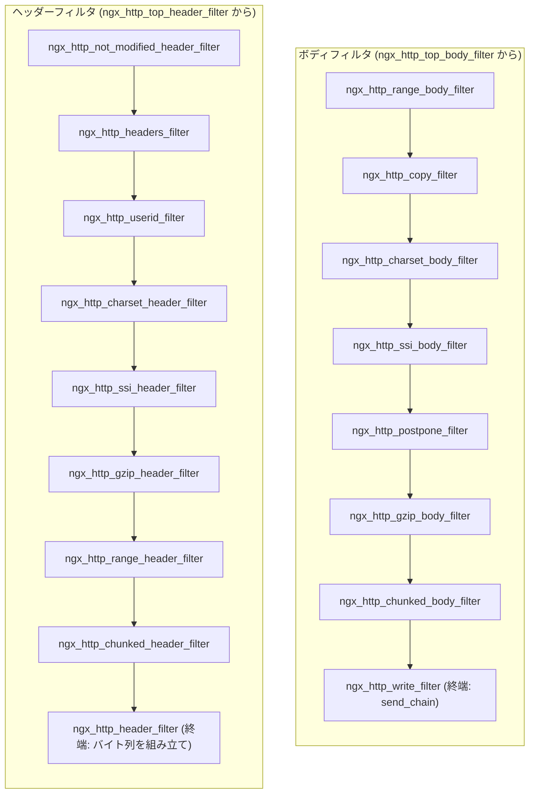
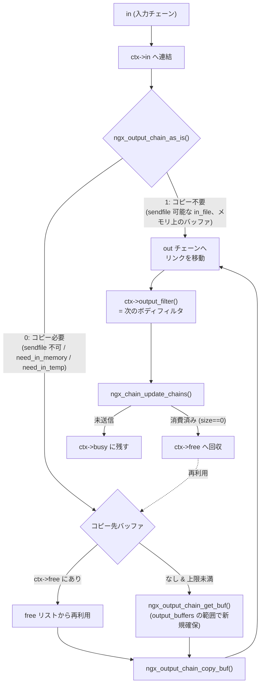

# 第11章 フィルタチェーンと output chain

> **本章で読むソース**
>
> - [`src/http/ngx_http_core_module.c`](https://github.com/nginx/nginx/blob/release-1.31.2/src/http/ngx_http_core_module.c)
> - [`src/http/ngx_http_header_filter_module.c`](https://github.com/nginx/nginx/blob/release-1.31.2/src/http/ngx_http_header_filter_module.c)
> - [`src/http/modules/ngx_http_chunked_filter_module.c`](https://github.com/nginx/nginx/blob/release-1.31.2/src/http/modules/ngx_http_chunked_filter_module.c)
> - [`src/http/ngx_http_postpone_filter_module.c`](https://github.com/nginx/nginx/blob/release-1.31.2/src/http/ngx_http_postpone_filter_module.c)
> - [`src/http/ngx_http_copy_filter_module.c`](https://github.com/nginx/nginx/blob/release-1.31.2/src/http/ngx_http_copy_filter_module.c)
> - [`src/http/ngx_http_write_filter_module.c`](https://github.com/nginx/nginx/blob/release-1.31.2/src/http/ngx_http_write_filter_module.c)
> - [`src/core/ngx_output_chain.c`](https://github.com/nginx/nginx/blob/release-1.31.2/src/core/ngx_output_chain.c)
> - [`src/core/ngx_buf.c`](https://github.com/nginx/nginx/blob/release-1.31.2/src/core/ngx_buf.c)
> - [`src/os/unix/ngx_linux_sendfile_chain.c`](https://github.com/nginx/nginx/blob/release-1.31.2/src/os/unix/ngx_linux_sendfile_chain.c)

## この章の狙い

第10章では、フェーズエンジンがコンテンツハンドラを選び出すまでを追った。
本章は、そのハンドラが生成したレスポンスがクライアントへ届くまでの経路、すなわち**フィルタチェーン**を読む。
nginx のレスポンス出力は、ヘッダー用とボディ用の2本の関数ポインタ連結リストとして組織されており、gzip 圧縮や chunked 符号化といった変換はすべて、このリストに差し込まれたフィルタモジュールが担う。
チェーンの末端では、write filter が `send_chain()` を呼んでソケットへの書き込みを行う。
あわせて、フィルタとハンドラの双方から使われる汎用出力機構 `ngx_output_chain()` を読み、バッファをコピーせずに送る条件判定と、チェーンリンクの再利用（busy/free リスト）、そして sendfile によるゼロコピー送信がどう連携するかを確認する。

## 前提

第3章のメモリプールとバッファ（`ngx_buf_t` のフラグ群と `ngx_chain_t` によるバッファの連結）、第2章のモジュールアーキテクチャ（`postconfiguration` フックの役割）、第9章の `ngx_http_request_t` の構造を前提とする。
第8章で見た `ngx_connection_t` の `send_chain` 関数ポインタと、`ngx_handle_write_event()` による epoll への登録も前提とする。

## 2本の連結リスト：`ngx_http_top_header_filter` と `ngx_http_top_body_filter`

フィルタは、ヘッダーを処理する**ヘッダーフィルタ**と、ボディを処理する**ボディフィルタ**の2種類に分かれ、それぞれが関数ポインタの型として定義されている。

[`src/http/ngx_http_core_module.h` L530-L534](https://github.com/nginx/nginx/blob/release-1.31.2/src/http/ngx_http_core_module.h#L530-L534)

```c
typedef ngx_int_t (*ngx_http_output_header_filter_pt)(ngx_http_request_t *r);
typedef ngx_int_t (*ngx_http_output_body_filter_pt)
    (ngx_http_request_t *r, ngx_chain_t *chain);
typedef ngx_int_t (*ngx_http_request_body_filter_pt)
    (ngx_http_request_t *r, ngx_chain_t *chain);
```

チェーンの先頭は、グローバル変数として1本ずつ保持される。

[`src/http/ngx_http.c` L74-L77](https://github.com/nginx/nginx/blob/release-1.31.2/src/http/ngx_http.c#L74-L77)

```c
ngx_http_output_header_filter_pt  ngx_http_top_header_filter;
ngx_http_output_header_filter_pt  ngx_http_top_early_hints_filter;
ngx_http_output_body_filter_pt    ngx_http_top_body_filter;
ngx_http_request_body_filter_pt   ngx_http_top_request_body_filter;
```

連結リストといっても、`next` フィールドを持つノードの列ではない。
各フィルタモジュールが、自分のファイルスコープに `static` 変数として「次のフィルタ」への関数ポインタを1つ持ち、初期化時にそれを組み替えることでリストを形成する。
chunked filter の初期化関数が典型である。

[`src/http/modules/ngx_http_chunked_filter_module.c` L333-L343](https://github.com/nginx/nginx/blob/release-1.31.2/src/http/modules/ngx_http_chunked_filter_module.c#L333-L343)

```c
static ngx_int_t
ngx_http_chunked_filter_init(ngx_conf_t *cf)
{
    ngx_http_next_header_filter = ngx_http_top_header_filter;
    ngx_http_top_header_filter = ngx_http_chunked_header_filter;

    ngx_http_next_body_filter = ngx_http_top_body_filter;
    ngx_http_top_body_filter = ngx_http_chunked_body_filter;

    return NGX_OK;
}
```

現在の先頭を自分の `ngx_http_next_*_filter` に退避してから、先頭を自分に付け替える。
つまりフィルタは常に**チェーンの先頭へ差し込まれる**。
この初期化関数は各モジュールの `postconfiguration` フックであり、`ngx_http_block()`（`http` ブロックの処理本体）がモジュール登録順に呼び出す。

[`src/http/ngx_http.c` L303-L315](https://github.com/nginx/nginx/blob/release-1.31.2/src/http/ngx_http.c#L303-L315)

```c
    for (m = 0; cf->cycle->modules[m]; m++) {
        if (cf->cycle->modules[m]->type != NGX_HTTP_MODULE) {
            continue;
        }

        module = cf->cycle->modules[m]->ctx;

        if (module->postconfiguration) {
            if (module->postconfiguration(cf) != NGX_OK) {
                return NGX_CONF_ERROR;
            }
        }
    }
```

先頭差し込みの帰結として、**モジュール一覧で後に登録されたフィルタほど、実行時にはチェーンの前段に来る**。
この登録順はビルドスクリプトが管理しており、順序が意味を持つことがコメントで明言されている。

[`auto/modules` L122-L143](https://github.com/nginx/nginx/blob/release-1.31.2/auto/modules#L122-L143)

```text
    # the filter order is important
    #     ngx_http_write_filter
    #     ngx_http_header_filter
    #     ngx_http_chunked_filter
    #     ngx_http_v2_filter
    #     ngx_http_v3_filter
    #     ngx_http_range_header_filter
    #     ngx_http_gzip_filter
    #     ngx_http_postpone_filter
    #     ngx_http_ssi_filter
    #     ngx_http_charset_filter
    #         ngx_http_xslt_filter
    #         ngx_http_image_filter
    #         ngx_http_sub_filter
    #         ngx_http_addition_filter
    #         ngx_http_gunzip_filter
    #         ngx_http_userid_filter
    #         ngx_http_headers_filter
    #     ngx_http_copy_filter
    #     ngx_http_range_body_filter
    #     ngx_http_not_modified_filter
    #     ngx_http_slice_filter
```

write filter が最初に登録されるため、実行時にはボディフィルタチェーンの最後尾に位置し、ソケットへの書き込みという終端処理を担う。
デフォルトビルドでの実行順を図示すると次のようになる。



この構造の利点は、フィルタの追加と削除がグローバル変数1本の付け替えで済み、チェーンの走査が単なる関数呼び出しの連鎖になることである。
各フィルタは自分の仕事を終えたら `ngx_http_next_*_filter(r, ...)` を呼ぶだけであり、チェーン全体を管理する仲介役は存在しない。

## 入口：`ngx_http_send_header()` と `ngx_http_output_filter()`

コンテンツハンドラから見たフィルタチェーンの入口は2つの関数である。
ヘッダー側の入口 `ngx_http_send_header()` は、二重送信を検査したうえでヘッダーフィルタチェーンの先頭を呼ぶ。

[`src/http/ngx_http_core_module.c` L1871-L1890](https://github.com/nginx/nginx/blob/release-1.31.2/src/http/ngx_http_core_module.c#L1871-L1890)

```c
ngx_int_t
ngx_http_send_header(ngx_http_request_t *r)
{
    if (r->post_action) {
        return NGX_OK;
    }

    if (r->header_sent) {
        ngx_log_error(NGX_LOG_ALERT, r->connection->log, 0,
                      "header already sent");
        return NGX_ERROR;
    }

    if (r->err_status) {
        r->headers_out.status = r->err_status;
        r->headers_out.status_line.len = 0;
    }

    return ngx_http_top_header_filter(r);
}
```

ボディ側の入口 `ngx_http_output_filter()` は、チェーン（`ngx_chain_t`）を受け取ってボディフィルタチェーンの先頭に渡す。

[`src/http/ngx_http_core_module.c` L1924-L1943](https://github.com/nginx/nginx/blob/release-1.31.2/src/http/ngx_http_core_module.c#L1924-L1943)

```c
ngx_int_t
ngx_http_output_filter(ngx_http_request_t *r, ngx_chain_t *in)
{
    ngx_int_t          rc;
    ngx_connection_t  *c;

    c = r->connection;

    ngx_log_debug2(NGX_LOG_DEBUG_HTTP, c->log, 0,
                   "http output filter \"%V?%V\"", &r->uri, &r->args);

    rc = ngx_http_top_body_filter(r, in);

    if (rc == NGX_ERROR) {
        /* NGX_ERROR may be returned by any filter */
        c->error = 1;
    }

    return rc;
}
```

ハンドラは `r->headers_out` にステータスや Content-Length を設定して `ngx_http_send_header()` を呼び、続けてボディのバッファを `ngx_http_output_filter()` に渡す。
ボディが一度に揃わない場合（upstream からの受信中など）は、`ngx_http_output_filter()` が繰り返し呼ばれる。
また、送り切れなかった分を後から再送するときは `in` に `NULL` を渡して呼ぶ（後述の `ngx_http_writer()` がこの使い方をする）。

## header filter：レスポンスヘッダーの組み立て

ヘッダーフィルタチェーンの終端 `ngx_http_header_filter()` は、`r->headers_out` の内容を HTTP/1.x のステータス行とヘッダー行のバイト列へ直列化する。
この関数は**2パス**で動く。
第1パスでは、出力に必要なバイト数 `len` だけを積算する。

[`src/http/ngx_http_header_filter_module.c` L302-L327](https://github.com/nginx/nginx/blob/release-1.31.2/src/http/ngx_http_header_filter_module.c#L302-L327)

```c
    if (r->headers_out.date == NULL) {
        len += sizeof("Date: Mon, 28 Sep 1970 06:00:00 GMT" CRLF) - 1;
    }

    if (r->headers_out.content_type.len) {
        len += sizeof("Content-Type: ") - 1
               + r->headers_out.content_type.len + 2;

        if (r->headers_out.content_type_len == r->headers_out.content_type.len
            && r->headers_out.charset.len)
        {
            len += sizeof("; charset=") - 1 + r->headers_out.charset.len;
        }
    }

    if (r->headers_out.content_length == NULL
        && r->headers_out.content_length_n >= 0)
    {
        len += sizeof("Content-Length: ") - 1 + NGX_OFF_T_LEN + 2;
    }

    if (r->headers_out.last_modified == NULL
        && r->headers_out.last_modified_time != -1)
    {
        len += sizeof("Last-Modified: Mon, 28 Sep 1970 06:00:00 GMT" CRLF) - 1;
    }
```

固定ヘッダーの見積もりに続いて、モジュールが `r->headers_out.headers`（第4章で見た `ngx_list_t`）に追加した可変ヘッダーの長さを合算し、その合計でバッファを1回だけ確保する。

[`src/http/ngx_http_header_filter_module.c` L419-L445](https://github.com/nginx/nginx/blob/release-1.31.2/src/http/ngx_http_header_filter_module.c#L419-L445)

```c
    part = &r->headers_out.headers.part;
    header = part->elts;

    for (i = 0; /* void */; i++) {

        if (i >= part->nelts) {
            if (part->next == NULL) {
                break;
            }

            part = part->next;
            header = part->elts;
            i = 0;
        }

        if (header[i].hash == 0) {
            continue;
        }

        len += header[i].key.len + sizeof(": ") - 1 + header[i].value.len
               + sizeof(CRLF) - 1;
    }

    b = ngx_create_temp_buf(r->pool, len);
    if (b == NULL) {
        return NGX_ERROR;
    }
```

`hash == 0` のエントリは「削除済み」の印であり、長さの計算からも第2パスの書き込みからも除外される。
第2パスは、確保したバッファに `ngx_cpymem()`/`ngx_sprintf()` でステータス行から順に書き込んでいく。
最後に空行（CRLF）を書いてヘッダーを閉じ、チェーンリンク1個に包んで write filter に直接渡す。

[`src/http/ngx_http_header_filter_module.c` L616-L629](https://github.com/nginx/nginx/blob/release-1.31.2/src/http/ngx_http_header_filter_module.c#L616-L629)

```c
    /* the end of HTTP header */
    *b->last++ = CR; *b->last++ = LF;

    r->header_size = b->last - b->pos;

    if (r->header_only) {
        b->last_buf = 1;
    }

    out.buf = b;
    out.next = NULL;

    return ngx_http_write_filter(r, &out);
}
```

ここで `ngx_http_next_body_filter` ではなく `ngx_http_write_filter()` を名指しで呼んでいる点に注意する。
直列化されたヘッダーはもはや変換の対象ではないため、chunked filter や gzip filter を通す必要がなく、終端の write filter に直行する。
ただし write filter は後述のとおり即座に送信するとは限らず、ヘッダーはいったん `r->out` に積まれて、続くボディと同じ `writev()` でまとめて送られることが多い。

2パス方式は、この関数の高速化の工夫でもある。
先に正確な長さを計算してから確保するため、ヘッダー全体が過不足のない1個の連続バッファに収まり、伸長のための再確保や、ヘッダー行ごとの細かいバッファ確保が発生しない。
送信時にも、ヘッダー全体が `writev()` の iovec 1エントリで済む。

なお、この関数の冒頭では `r->header_sent = 1` を立てて二重実行を防ぎ、サブリクエスト（`r != r->main`）と HTTP/0.9 では何もせずに `NGX_OK` を返す。
チェーン先頭の付け替えは `postconfiguration` で行われる。

[`src/http/ngx_http_header_filter_module.c` L734-L741](https://github.com/nginx/nginx/blob/release-1.31.2/src/http/ngx_http_header_filter_module.c#L734-L741)

```c
static ngx_int_t
ngx_http_header_filter_init(ngx_conf_t *cf)
{
    ngx_http_top_header_filter = ngx_http_header_filter;
    ngx_http_top_early_hints_filter = ngx_http_early_hints_filter;

    return NGX_OK;
}
```

header filter モジュールは write filter の直後に登録されるため、ヘッダーフィルタチェーンの最後尾になる。
以降に登録されるすべてのヘッダーフィルタは、この直列化処理より前に実行される。

## chunked filter：長さ不明のボディを chunked 符号化する

chunked filter は、ヘッダーフィルタとボディフィルタの両方を持つモジュールの典型である。
ヘッダーフィルタ側は、レスポンスの長さが確定しているかを見て符号化の要否を決める。

[`src/http/modules/ngx_http_chunked_filter_module.c` L76-L103](https://github.com/nginx/nginx/blob/release-1.31.2/src/http/modules/ngx_http_chunked_filter_module.c#L76-L103)

```c
    if (r->headers_out.content_length_n == -1
        || r->expect_trailers)
    {
        clcf = ngx_http_get_module_loc_conf(r, ngx_http_core_module);

        if (r->http_version >= NGX_HTTP_VERSION_11
            && clcf->chunked_transfer_encoding)
        {
            if (r->expect_trailers) {
                ngx_http_clear_content_length(r);
            }

            r->chunked = 1;

            ctx = ngx_pcalloc(r->pool, sizeof(ngx_http_chunked_filter_ctx_t));
            if (ctx == NULL) {
                return NGX_ERROR;
            }

            ngx_http_set_ctx(r, ctx, ngx_http_chunked_filter_module);

        } else if (r->headers_out.content_length_n == -1) {
            r->keepalive = 0;
        }
    }

    return ngx_http_next_header_filter(r);
}
```

Content-Length が不明（`content_length_n == -1`）で HTTP/1.1 なら `r->chunked` を立てる。
このフラグを、後段の `ngx_http_header_filter()` が見て `Transfer-Encoding: chunked` ヘッダーを出力する。
chunked が使えない HTTP/1.0 では、代わりに `r->keepalive` を落とし、接続のクローズでボディの終端を伝える。
ヘッダーフィルタが「判断とフラグ設定」を、終端フィルタが「直列化」を分担する関係である。

ボディフィルタ側は、入力チェーンを1周してデータの合計サイズを求めながら、出力チェーンにリンクを張り直す。

[`src/http/modules/ngx_http_chunked_filter_module.c` L122-L154](https://github.com/nginx/nginx/blob/release-1.31.2/src/http/modules/ngx_http_chunked_filter_module.c#L122-L154)

```c
    out = NULL;
    ll = &out;

    size = 0;
    cl = in;

    for ( ;; ) {
        ngx_log_debug1(NGX_LOG_DEBUG_HTTP, r->connection->log, 0,
                       "http chunk: %O", ngx_buf_size(cl->buf));

        size += ngx_buf_size(cl->buf);

        if (cl->buf->flush
            || cl->buf->sync
            || ngx_buf_in_memory(cl->buf)
            || cl->buf->in_file)
        {
            tl = ngx_alloc_chain_link(r->pool);
            if (tl == NULL) {
                return NGX_ERROR;
            }

            tl->buf = cl->buf;
            *ll = tl;
            ll = &tl->next;
        }

        if (cl->next == NULL) {
            break;
        }

        cl = cl->next;
    }
```

データ本体のバッファはコピーせず、チェーンリンクだけを新しく作って同じ `ngx_buf_t` を指させる。
そのうえで、合計サイズを16進数で書いたチャンクサイズ行のバッファを先頭に挿入する。

[`src/http/modules/ngx_http_chunked_filter_module.c` L156-L185](https://github.com/nginx/nginx/blob/release-1.31.2/src/http/modules/ngx_http_chunked_filter_module.c#L156-L185)

```c
    if (size) {
        tl = ngx_chain_get_free_buf(r->pool, &ctx->free);
        if (tl == NULL) {
            return NGX_ERROR;
        }

        b = tl->buf;
        chunk = b->start;

        if (chunk == NULL) {
            /* the "0000000000000000" is 64-bit hexadecimal string */

            chunk = ngx_palloc(r->pool, sizeof("0000000000000000" CRLF) - 1);
            if (chunk == NULL) {
                return NGX_ERROR;
            }

            b->start = chunk;
            b->end = chunk + sizeof("0000000000000000" CRLF) - 1;
        }

        b->tag = (ngx_buf_tag_t) &ngx_http_chunked_filter_module;
        b->memory = 0;
        b->temporary = 1;
        b->pos = chunk;
        b->last = ngx_sprintf(chunk, "%xO" CRLF, size);

        tl->next = out;
        out = tl;
    }
```

チャンクサイズ行のバッファは `ngx_chain_get_free_buf()` で取得する。
この関数は、モジュールごとの free リストに返却済みのバッファがあればそれを再利用し、なければプールから新規に確保する。

[`src/core/ngx_buf.c` L156-L181](https://github.com/nginx/nginx/blob/release-1.31.2/src/core/ngx_buf.c#L156-L181)

```c
ngx_chain_t *
ngx_chain_get_free_buf(ngx_pool_t *p, ngx_chain_t **free)
{
    ngx_chain_t  *cl;

    if (*free) {
        cl = *free;
        *free = cl->next;
        cl->next = NULL;
        return cl;
    }

    cl = ngx_alloc_chain_link(p);
    if (cl == NULL) {
        return NULL;
    }

    cl->buf = ngx_calloc_buf(p);
    if (cl->buf == NULL) {
        return NULL;
    }

    cl->next = NULL;

    return cl;
}
```

末尾には、最終チャンク（`last_buf` が立っている場合は `CRLF "0" CRLF CRLF` とトレイラー）またはチャンク終端の CRLF を追加し、組み上がったチェーンを次のフィルタへ渡す。
渡し終えた直後に `ngx_chain_update_chains()` を呼び、送信が完了したバッファを free リストへ回収する。

[`src/http/modules/ngx_http_chunked_filter_module.c` L221-L227](https://github.com/nginx/nginx/blob/release-1.31.2/src/http/modules/ngx_http_chunked_filter_module.c#L221-L227)

```c
    rc = ngx_http_next_body_filter(r, out);

    ngx_chain_update_chains(r->pool, &ctx->free, &ctx->busy, &out,
                            (ngx_buf_tag_t) &ngx_http_chunked_filter_module);

    return rc;
}
```

`ngx_chain_update_chains()` の中身は `ngx_output_chain()` の節でまとめて読む。
この実装は2重に節約している。
第一に、chunked 符号化は本体データを1バイトもコピーせず、サイズ行と終端 CRLF という小さなバッファをチェーンに「挟み込む」だけで実現されている。
第二に、その小さなバッファ自体も、レスポンスが何千チャンクに及ぼうと free リストで使い回され、リクエストの生存期間中にプールを際限なく消費しない。
チャンクサイズ行の領域を64ビット16進数の最大幅（16桁 + CRLF）で確保しておくのは、再利用のたびにどんなサイズでも `ngx_sprintf()` で書き直せるようにするためである。

## postpone filter：サブリクエストの出力順序を守る

SSI のようにサブリクエストを使う機能では、複数のリクエストが同じ接続へ出力を流そうとする。
postpone filter は、その出力順序を制御する関門である。
接続の `c->data` には「いま出力してよいリクエスト」が入っており（第9章）、それ以外のリクエストの出力はいったん取り置かれる。

[`src/http/ngx_http_postpone_filter_module.c` L69-L95](https://github.com/nginx/nginx/blob/release-1.31.2/src/http/ngx_http_postpone_filter_module.c#L69-L95)

```c
    if (r != c->data) {

        if (in) {
            if (ngx_http_postpone_filter_add(r, in) != NGX_OK) {
                return NGX_ERROR;
            }

            return NGX_OK;
        }

#if 0
        /* TODO: SSI may pass NULL */
        ngx_log_error(NGX_LOG_ALERT, c->log, 0,
                      "http postpone filter NULL inactive request");
#endif

        return NGX_OK;
    }

    if (r->postponed == NULL) {

        if (in || c->buffered) {
            return ngx_http_next_body_filter(r->main, in);
        }

        return NGX_OK;
    }
```

出力権のないリクエストのデータは `ngx_http_postpone_filter_add()` が `r->postponed` リストに退避し、次のフィルタへは流さない。
出力権のあるリクエストに取り置きがなければ、そのまま次のフィルタへ通す。
取り置きがある場合は、それを先頭から処理する。

[`src/http/ngx_http_postpone_filter_module.c` L103-L135](https://github.com/nginx/nginx/blob/release-1.31.2/src/http/ngx_http_postpone_filter_module.c#L103-L135)

```c
    do {
        pr = r->postponed;

        if (pr->request) {

            ngx_log_debug2(NGX_LOG_DEBUG_HTTP, c->log, 0,
                           "http postpone filter wake \"%V?%V\"",
                           &pr->request->uri, &pr->request->args);

            r->postponed = pr->next;

            c->data = pr->request;

            return ngx_http_post_request(pr->request, NULL);
        }

        if (pr->out == NULL) {
            ngx_log_error(NGX_LOG_ALERT, c->log, 0,
                          "http postpone filter NULL output");

        } else {
            ngx_log_debug2(NGX_LOG_DEBUG_HTTP, c->log, 0,
                           "http postpone filter output \"%V?%V\"",
                           &r->uri, &r->args);

            if (ngx_http_next_body_filter(r->main, pr->out) == NGX_ERROR) {
                return NGX_ERROR;
            }
        }

        r->postponed = pr->next;

    } while (r->postponed);
```

`r->postponed` の要素は「サブリクエスト」か「取り置かれたデータ」のどちらかである。
データなら次のフィルタへ流し、サブリクエストなら `c->data` をそのサブリクエストに切り替えて処理を委ねる。
これにより、親リクエストのボディの途中にサブリクエストの出力を正しい位置で差し込める。
以降のフィルタ呼び出しがすべて `r->main` を第1引数にしている点も重要で、postpone filter を通過した後のデータは「メインリクエストの出力」として一元的に扱われる。

## copy filter と `ngx_output_chain()`：バッファのコピー戦略

copy filter は、それ自身では何も変換しない。
その仕事は、汎用出力機構 **`ngx_output_chain()`** をボディフィルタチェーンに組み込むことである。
初回呼び出しで `ngx_output_chain_ctx_t` を作り、後段フィルタの要求とディレクティブの設定をコンテキストに写す。

[`src/http/ngx_http_copy_filter_module.c` L98-L139](https://github.com/nginx/nginx/blob/release-1.31.2/src/http/ngx_http_copy_filter_module.c#L98-L139)

```c
    if (ctx == NULL) {
        ctx = ngx_pcalloc(r->pool, sizeof(ngx_output_chain_ctx_t));
        if (ctx == NULL) {
            return NGX_ERROR;
        }

        ngx_http_set_ctx(r, ctx, ngx_http_copy_filter_module);

        conf = ngx_http_get_module_loc_conf(r, ngx_http_copy_filter_module);
        clcf = ngx_http_get_module_loc_conf(r, ngx_http_core_module);

        ctx->sendfile = c->sendfile;
        ctx->need_in_memory = r->main_filter_need_in_memory
                              || r->filter_need_in_memory;
        ctx->need_in_temp = r->filter_need_temporary;

        ctx->alignment = clcf->directio_alignment;

        ctx->pool = r->pool;
        ctx->bufs = conf->bufs;
        ctx->tag = (ngx_buf_tag_t) &ngx_http_copy_filter_module;

        ctx->output_filter = (ngx_output_chain_filter_pt)
                                  ngx_http_next_body_filter;
        ctx->filter_ctx = r;

        // ... (中略) ...

        if (in && in->buf && ngx_buf_size(in->buf)) {
            r->request_output = 1;
        }
    }
```

`need_in_memory` は、後段に「データをメモリ上で読みたい」フィルタ（gzip、charset、SSI など）がいるときに立つ。
これらのフィルタは自分の `header filter` で `r->filter_need_in_memory` などのフラグを立てておき、copy filter がそれを集約する。
`output_filter` には次のボディフィルタが入るので、`ngx_output_chain()` から見ると「出力先」はフィルタチェーンの続きそのものである。
本体は `ngx_output_chain()` の呼び出しと、処理しきれなかった入力の有無を `r->buffered` に反映するだけである。

[`src/http/ngx_http_copy_filter_module.c` L145-L158](https://github.com/nginx/nginx/blob/release-1.31.2/src/http/ngx_http_copy_filter_module.c#L145-L158)

```c
    rc = ngx_output_chain(ctx, in);

    if (ctx->in == NULL) {
        r->buffered &= ~NGX_HTTP_COPY_BUFFERED;

    } else {
        r->buffered |= NGX_HTTP_COPY_BUFFERED;
    }

    ngx_log_debug3(NGX_LOG_DEBUG_HTTP, c->log, 0,
                   "http copy filter: %i \"%V?%V\"", rc, &r->uri, &r->args);

    return rc;
}
```

### `ngx_output_chain_ctx_t` と入出力の構造

`ngx_output_chain()` は HTTP 専用ではなく、core 層の汎用機構である（upstream の `ngx_chain_writer` も同じファイルにあり、第13章で扱う）。
状態はすべて `ngx_output_chain_ctx_t` に持つ。

[`src/core/ngx_buf.h` L78-L110](https://github.com/nginx/nginx/blob/release-1.31.2/src/core/ngx_buf.h#L78-L110)

```c
struct ngx_output_chain_ctx_s {
    ngx_buf_t                   *buf;
    ngx_chain_t                 *in;
    ngx_chain_t                 *free;
    ngx_chain_t                 *busy;

    unsigned                     sendfile:1;
    unsigned                     directio:1;
    unsigned                     unaligned:1;
    unsigned                     need_in_memory:1;
    unsigned                     need_in_temp:1;
    unsigned                     aio:1;

    // ... (中略) ...

    off_t                        alignment;

    ngx_pool_t                  *pool;
    ngx_int_t                    allocated;
    ngx_bufs_t                   bufs;
    ngx_buf_tag_t                tag;

    ngx_output_chain_filter_pt   output_filter;
    void                        *filter_ctx;
};
```

`in` は未処理の入力チェーン、`buf` はコピー先として使用中のバッファである。
`busy` は `output_filter` に渡したがまだ送信が完了していないバッファの列、`free` は送信が完了して再利用できるバッファの列であり、この2本が後述する再利用機構の主役になる。
`bufs` は `output_buffers` ディレクティブの値（デフォルト 2個 32KB）で、コピー用バッファの数と大きさの上限を定める。

関数本体の冒頭には、最頻ケースを最短で通すための**短絡路**がある。

[`src/core/ngx_output_chain.c` L41-L72](https://github.com/nginx/nginx/blob/release-1.31.2/src/core/ngx_output_chain.c#L41-L72)

```c
ngx_int_t
ngx_output_chain(ngx_output_chain_ctx_t *ctx, ngx_chain_t *in)
{
    off_t         bsize;
    ngx_int_t     rc, last;
    ngx_chain_t  *cl, *out, **last_out;

    if (ctx->in == NULL && ctx->busy == NULL
#if (NGX_HAVE_FILE_AIO || NGX_THREADS)
        && !ctx->aio
#endif
       )
    {
        /*
         * the short path for the case when the ctx->in and ctx->busy chains
         * are empty, the incoming chain is empty too or has the single buf
         * that does not require the copy
         */

        if (in == NULL) {
            return ctx->output_filter(ctx->filter_ctx, in);
        }

        if (in->next == NULL
#if (NGX_SENDFILE_LIMIT)
            && !(in->buf->in_file && in->buf->file_last > NGX_SENDFILE_LIMIT)
#endif
            && ngx_output_chain_as_is(ctx, in->buf))
        {
            return ctx->output_filter(ctx->filter_ctx, in);
        }
    }
```

持ち越しがなく、入力がバッファ1個で、そのバッファがコピー不要なら、チェーンの組み替えもコンテキストの更新も一切せずに次のフィルタへ素通しする。
静的ファイルを sendfile で送る典型ケースはこの3行で終わる。

### `ngx_output_chain_as_is()`：コピーするか、そのまま送るか

コピーの要否を判定するのが `ngx_output_chain_as_is()` である。
判定の材料は、第3章で見た `ngx_buf_t` のフラグ群を集約したマクロである。

[`src/core/ngx_buf.h` L125-L138](https://github.com/nginx/nginx/blob/release-1.31.2/src/core/ngx_buf.h#L125-L138)

```c
#define ngx_buf_in_memory(b)       ((b)->temporary || (b)->memory || (b)->mmap)
#define ngx_buf_in_memory_only(b)  (ngx_buf_in_memory(b) && !(b)->in_file)

#define ngx_buf_special(b)                                                   \
    (((b)->flush || (b)->last_buf || (b)->sync)                              \
     && !ngx_buf_in_memory(b) && !(b)->in_file)

#define ngx_buf_sync_only(b)                                                 \
    ((b)->sync && !ngx_buf_in_memory(b)                                      \
     && !(b)->in_file && !(b)->flush && !(b)->last_buf)

#define ngx_buf_size(b)                                                      \
    (ngx_buf_in_memory(b) ? (off_t) ((b)->last - (b)->pos):                  \
                            ((b)->file_last - (b)->file_pos))
```

1つのバッファは「メモリ上にある」（`temporary`/`memory`/`mmap` のいずれか）と「ファイル上にある」（`in_file`）の両方の顔を同時に持てる。
たとえば proxy がファイルにバッファしたレスポンスは、ページキャッシュ経由でメモリからも読めるしファイルとしても送れる。
`as_is` 判定は、このフラグと送信手段の組み合わせで決まる。

[`src/core/ngx_output_chain.c` L249-L306](https://github.com/nginx/nginx/blob/release-1.31.2/src/core/ngx_output_chain.c#L249-L306)

```c
static ngx_inline ngx_int_t
ngx_output_chain_as_is(ngx_output_chain_ctx_t *ctx, ngx_buf_t *buf)
{
    ngx_uint_t  sendfile;

    if (ngx_buf_special(buf)) {
        return 1;
    }

    // ... (中略) ...

    sendfile = ctx->sendfile;

    // ... (中略) ...

#if !(NGX_HAVE_SENDFILE_NODISKIO)

    /*
     * With DIRECTIO, disable sendfile() unless sendfile(SF_NOCACHE)
     * is available.
     */

    if (buf->in_file && buf->file->directio) {
        sendfile = 0;
    }

#endif

    if (!sendfile) {

        if (!ngx_buf_in_memory(buf)) {
            return 0;
        }

        buf->in_file = 0;
    }

    if (ctx->need_in_memory && !ngx_buf_in_memory(buf)) {
        return 0;
    }

    if (ctx->need_in_temp && (buf->memory || buf->mmap)) {
        return 0;
    }

    return 1;
}
```

コピーが必要になる（0 を返す）のは、次の3つの場合である。

- **sendfile が使えないのに、データがファイル上にしかない**：ソケットへ書くにはメモリへ読み出すしかない。
- **後段が `need_in_memory` を要求しているのに、データがファイル上にしかない**：gzip はファイルの中身をメモリで見なければ圧縮できない。
- **後段が `need_in_temp`（書き換え可能なバッファ）を要求しているのに、データが読み取り専用（`memory`/`mmap`）にある**：charset filter は文字コードをその場で書き換えるため、`temporary` なコピーが要る。

逆に、sendfile が有効でバッファが `in_file` なら、メモリに読み出さずそのまま 1 を返す（as is）。
sendfile が無効でもデータがメモリにあれば、`in_file` フラグを落として「メモリ側の顔」だけで送る。
つまり `in_file`/`in_memory` の二面性は、送信手段と後段の要求に応じて**どちらの顔で送るかを遅延決定する**ための仕掛けである。

### コピーループと busy/free リスト

コピーが必要なバッファは、メインループの中で `ctx->buf` へ読み出される。
コピー先バッファの調達順序に、再利用の設計がよく表れている。

[`src/core/ngx_output_chain.c` L148-L190](https://github.com/nginx/nginx/blob/release-1.31.2/src/core/ngx_output_chain.c#L148-L190)

```c
            if (ngx_output_chain_as_is(ctx, ctx->in->buf)) {

                /* move the chain link to the output chain */

                cl = ctx->in;
                ctx->in = cl->next;

                *last_out = cl;
                last_out = &cl->next;
                cl->next = NULL;

                continue;
            }

            if (ctx->buf == NULL) {

                rc = ngx_output_chain_align_file_buf(ctx, bsize);

                if (rc == NGX_ERROR) {
                    return NGX_ERROR;
                }

                if (rc != NGX_OK) {

                    if (ctx->free) {

                        /* get the free buf */

                        cl = ctx->free;
                        ctx->buf = cl->buf;
                        ctx->free = cl->next;

                        ngx_free_chain(ctx->pool, cl);

                    } else if (out || ctx->allocated == ctx->bufs.num) {

                        break;

                    } else if (ngx_output_chain_get_buf(ctx, bsize) != NGX_OK) {
                        return NGX_ERROR;
                    }
                }
            }
```

free リストに返却済みバッファがあればそれを使い、なければ `output_buffers` の上限（`ctx->bufs.num`）まで新規確保する。
上限に達したら `break` してループを抜け、まず手持ちの `out` を送信に回す。
つまりコピー用バッファの総量は `output_buffers` で確実に頭打ちになり、巨大なファイルを送るときも `bufs.num` 個のバッファを回転させながら少しずつ進む。

実際のコピーは `ngx_output_chain_copy_buf()` が行う。
メモリ上のデータは `ngx_memcpy()` で写すが、コピー元が `in_file` でもあり sendfile が使えるなら、コピー先にもファイル情報を引き継ぐ。

[`src/core/ngx_output_chain.c` L528-L549](https://github.com/nginx/nginx/blob/release-1.31.2/src/core/ngx_output_chain.c#L528-L549)

```c
    if (ngx_buf_in_memory(src)) {
        ngx_memcpy(dst->pos, src->pos, (size_t) size);
        src->pos += (size_t) size;
        dst->last += (size_t) size;

        if (src->in_file) {

            if (sendfile) {
                dst->in_file = 1;
                dst->file = src->file;
                dst->file_pos = src->file_pos;
                dst->file_last = src->file_pos + size;

            } else {
                dst->in_file = 0;
            }

            src->file_pos += size;

        } else {
            dst->in_file = 0;
        }
```

ファイル上にしかないデータは `ngx_read_file()`（設定によっては AIO やスレッドプール）で読み出す。
ループの末尾で、組み上がった `out` チェーンを `output_filter`（次のボディフィルタ）へ渡し、戻ってきたら `ngx_chain_update_chains()` で後始末をする。

[`src/core/ngx_output_chain.c` L227-L246](https://github.com/nginx/nginx/blob/release-1.31.2/src/core/ngx_output_chain.c#L227-L246)

```c
        if (out == NULL && last != NGX_NONE) {

            if (ctx->in) {
                return NGX_AGAIN;
            }

            return last;
        }

        last = ctx->output_filter(ctx->filter_ctx, out);

        if (last == NGX_ERROR || last == NGX_DONE) {
            return last;
        }

        ngx_chain_update_chains(ctx->pool, &ctx->free, &ctx->busy, &out,
                                ctx->tag);
        last_out = &out;
    }
}
```

`ngx_chain_update_chains()` は、chunked filter でも登場した回収関数である。

[`src/core/ngx_buf.c` L184-L223](https://github.com/nginx/nginx/blob/release-1.31.2/src/core/ngx_buf.c#L184-L223)

```c
void
ngx_chain_update_chains(ngx_pool_t *p, ngx_chain_t **free, ngx_chain_t **busy,
    ngx_chain_t **out, ngx_buf_tag_t tag)
{
    ngx_chain_t  *cl;

    if (*out) {
        if (*busy == NULL) {
            *busy = *out;

        } else {
            for (cl = *busy; cl->next; cl = cl->next) { /* void */ }

            cl->next = *out;
        }

        *out = NULL;
    }

    while (*busy) {
        cl = *busy;

        if (cl->buf->tag != tag) {
            *busy = cl->next;
            ngx_free_chain(p, cl);
            continue;
        }

        if (ngx_buf_size(cl->buf) != 0) {
            break;
        }

        cl->buf->pos = cl->buf->start;
        cl->buf->last = cl->buf->start;

        *busy = cl->next;
        cl->next = *free;
        *free = cl;
    }
}
```

まず、いま渡した `out` を丸ごと busy リストの末尾につなぐ。
次に busy リストを先頭から見て、`ngx_buf_size()` が 0 になったバッファ、すなわち後段（最終的には write filter の `send_chain()`）が `pos` を進めて消費し終えたバッファを回収する。
`tag` が自分のものなら `pos`/`last` を巻き戻して free リストへ戻し、他モジュールのバッファならチェーンリンクだけをプールのリンク置き場（`ngx_free_chain()`）へ返す。
サイズが 0 でないバッファに出会ったら、そこで打ち切る。
チェーンは送信順に並んでいるため、未送信バッファより後ろが先に空くことはなく、先頭から見るだけで回収漏れがない。

この busy/free の回転が、2つ目の高速化の工夫である。
`ngx_buf_t` とチェーンリンクの確保はリクエストのプールから行われ、プールには個別の解放がない（第3章）。
再利用機構がなければ、長いレスポンスを流すあいだ消費済みバッファのメモリが積み上がる一方になる。
free リストへの回収により、コピー用バッファは `output_buffers` の個数だけ、チャンクヘッダーは数個だけを、レスポンス全体で使い回すことができ、メモリ使用量がレスポンス長に比例しない。



## write filter：チェーン終端の送信と持ち越し

ボディフィルタチェーンの終端 `ngx_http_write_filter()` は、前回送り切れなかった持ち越しチェーン `r->out` と今回の入力 `in` を連結し、合計サイズとフラグ（`flush`/`recycled`/`sync`/`last_buf`）を集計してから、送信するかどうかを決める。

[`src/http/ngx_http_write_filter_module.c` L211-L226](https://github.com/nginx/nginx/blob/release-1.31.2/src/http/ngx_http_write_filter_module.c#L211-L226)

```c
    clcf = ngx_http_get_module_loc_conf(r, ngx_http_core_module);

    /*
     * avoid the output if there are no last buf, no flush point,
     * there are the incoming bufs and the size of all bufs
     * is smaller than "postpone_output" directive
     */

    if (!last && !flush && in && size < (off_t) clcf->postpone_output) {
        return NGX_OK;
    }

    if (c->write->delayed) {
        c->buffered |= NGX_HTTP_WRITE_BUFFERED;
        return NGX_AGAIN;
    }
```

レスポンスの終端（`last_buf`）でもフラッシュ指示でもなく、溜まった量が `postpone_output`（デフォルト 1460 バイト）未満なら、システムコールを発行せずに `NGX_OK` で戻る。
数十バイトの断片が届くたびに `writev()` を呼ぶのではなく、TCP セグメント1個分程度に育つまで `r->out` に溜めることで、システムコール回数と小さなパケットの送出を減らす。
送信すると決めたら、レート制限（`limit_rate`）を計算したうえで接続の `send_chain` を呼ぶ。

[`src/http/ngx_http_write_filter_module.c` L294-L307](https://github.com/nginx/nginx/blob/release-1.31.2/src/http/ngx_http_write_filter_module.c#L294-L307)

```c
    sent = c->sent;

    ngx_log_debug1(NGX_LOG_DEBUG_HTTP, c->log, 0,
                   "http write filter limit %O", limit);

    chain = c->send_chain(c, r->out, limit);

    ngx_log_debug1(NGX_LOG_DEBUG_HTTP, c->log, 0,
                   "http write filter %p", chain);

    if (chain == NGX_CHAIN_ERROR) {
        c->error = 1;
        return NGX_ERROR;
    }
```

`send_chain()` は「送り切れなかった残りのチェーン」を返す。
戻ってきたら、送信済みのリンクを解放し、残りを `r->out` に持ち越す。

[`src/http/ngx_http_write_filter_module.c` L334-L362](https://github.com/nginx/nginx/blob/release-1.31.2/src/http/ngx_http_write_filter_module.c#L334-L362)

```c
    if (chain && c->write->ready && !c->write->delayed) {
        ngx_post_event(c->write, &ngx_posted_next_events);
    }

    for (cl = r->out; cl && cl != chain; /* void */) {
        ln = cl;
        cl = cl->next;
        ngx_free_chain(r->pool, ln);
    }

    r->out = chain;

    if (chain) {
        c->buffered |= NGX_HTTP_WRITE_BUFFERED;
        return NGX_AGAIN;
    }

    c->buffered &= ~NGX_HTTP_WRITE_BUFFERED;

    if (last) {
        r->response_sent = 1;
    }

    if ((c->buffered & NGX_LOWLEVEL_BUFFERED) && r->postponed == NULL) {
        return NGX_AGAIN;
    }

    return NGX_OK;
}
```

残りがあれば `NGX_HTTP_WRITE_BUFFERED` を立てて `NGX_AGAIN` を返す。
この戻り値とフラグが、前段のフィルタと `ngx_output_chain()` の busy リスト、そしてリクエストの完了判定にまで伝播していく。

### 書き込みイベントの遅延登録

write filter 自身は、epoll に書き込みイベントを登録しない。
nginx は「まず書いてみる」方針を取る。
コンテンツハンドラの延長でフィルタチェーンを通り、`send_chain()` がソケットバッファに全量を書き込めれば、書き込みイベントは一度も epoll に登録されない。
登録が必要になるのは、送り切れずに `r->buffered` や `c->buffered` が立ったまま `ngx_http_finalize_request()` に到達したときだけである。

[`src/http/ngx_http_request.c` L2814-L2821](https://github.com/nginx/nginx/blob/release-1.31.2/src/http/ngx_http_request.c#L2814-L2821)

```c
    if (r->buffered || c->buffered || r->postponed) {

        if (ngx_http_set_write_handler(r) != NGX_OK) {
            ngx_http_terminate_request(r, 0);
        }

        return;
    }
```

`ngx_http_set_write_handler()` が、リクエストの書き込みハンドラを `ngx_http_writer` に差し替え、送信タイムアウトのタイマーとともに epoll への登録を行う。

[`src/http/ngx_http_request.c` L3003-L3033](https://github.com/nginx/nginx/blob/release-1.31.2/src/http/ngx_http_request.c#L3003-L3033)

```c
static ngx_int_t
ngx_http_set_write_handler(ngx_http_request_t *r)
{
    ngx_event_t               *wev;
    ngx_http_core_loc_conf_t  *clcf;

    r->http_state = NGX_HTTP_WRITING_REQUEST_STATE;

    r->read_event_handler = r->discard_body ?
                                ngx_http_discarded_request_body_handler:
                                ngx_http_test_reading;
    r->write_event_handler = ngx_http_writer;

    wev = r->connection->write;

    if (wev->ready && wev->delayed) {
        return NGX_OK;
    }

    clcf = ngx_http_get_module_loc_conf(r, ngx_http_core_module);
    if (!wev->delayed) {
        ngx_add_timer(wev, clcf->send_timeout);
    }

    if (ngx_handle_write_event(wev, clcf->send_lowat) != NGX_OK) {
        ngx_http_close_request(r, 0);
        return NGX_ERROR;
    }

    return NGX_OK;
}
```

以後、ソケットが書き込み可能になるたびに `ngx_http_writer()` が呼ばれ、`in` に `NULL` を渡してフィルタチェーンを再駆動する。

[`src/http/ngx_http_request.c` L3076-L3098](https://github.com/nginx/nginx/blob/release-1.31.2/src/http/ngx_http_request.c#L3076-L3098)

```c
    rc = ngx_http_output_filter(r, NULL);

    ngx_log_debug3(NGX_LOG_DEBUG_HTTP, c->log, 0,
                   "http writer output filter: %i, \"%V?%V\"",
                   rc, &r->uri, &r->args);

    if (rc == NGX_ERROR) {
        ngx_http_finalize_request(r, rc);
        return;
    }

    if (r->buffered || r->postponed || (r == r->main && c->buffered)) {

        if (!wev->delayed) {
            ngx_add_timer(wev, clcf->send_timeout);
        }

        if (ngx_handle_write_event(wev, clcf->send_lowat) != NGX_OK) {
            ngx_http_close_request(r, 0);
        }

        return;
    }
```

チェーンを `NULL` 入力で再駆動すると、各フィルタが自分の持ち越し分（copy filter の `ctx->in`、write filter の `r->out` など）を続きから流す。
この遅延登録が3つ目の高速化の工夫である。
多くのレスポンスはソケットバッファに一度で収まるため、書き込みイベントの登録と削除に伴う `epoll_ctl()` のシステムコールを、混雑した接続だけに限定できる。
なお、送信直後にまだ `chain` が残っていてもソケットが書き込み可能（`c->write->ready`）な場合は、先の write filter の抜粋にあったとおり `ngx_posted_next_events` に書き込みイベントを積み、epoll を経由せずに次のイベントループ周回で続きを送る（posted キューは第7章）。

## sendfile とバッファフラグ：ゼロコピー送信の経路

最後に、`send_chain()` の実体を読み、`in_file` フラグがカーネルの sendfile にどうつながるかを確認する。
`sendfile` ディレクティブが有効で OS が対応していれば、`ngx_http_update_location_config()` が接続に印を付ける。

[`src/http/ngx_http_core_module.c` L1360-L1365](https://github.com/nginx/nginx/blob/release-1.31.2/src/http/ngx_http_core_module.c#L1360-L1365)

```c
    if ((ngx_io.flags & NGX_IO_SENDFILE) && clcf->sendfile) {
        r->connection->sendfile = 1;

    } else {
        r->connection->sendfile = 0;
    }
```

この `c->sendfile` が、先に見た copy filter 経由で `ctx->sendfile` に写り、`ngx_output_chain_as_is()` の判定材料になる。
Linux では、接続の `send_chain` 関数ポインタの実体は OS 抽象化層で `ngx_linux_sendfile_chain` に束ねられている。

[`src/os/unix/ngx_linux_init.c` L16-L30](https://github.com/nginx/nginx/blob/release-1.31.2/src/os/unix/ngx_linux_init.c#L16-L30)

```c
static ngx_os_io_t ngx_linux_io = {
    ngx_unix_recv,
    ngx_readv_chain,
    ngx_udp_unix_recv,
    ngx_unix_send,
    ngx_udp_unix_send,
    ngx_udp_unix_sendmsg_chain,
#if (NGX_HAVE_SENDFILE)
    ngx_linux_sendfile_chain,
    NGX_IO_SENDFILE
#else
    ngx_writev_chain,
    0
#endif
};
```

`ngx_linux_sendfile_chain()` は、渡されたチェーンを先頭から見て、メモリ上のバッファ（ヘッダーや chunked のサイズ行）とファイル上のバッファ（レスポンス本体）で送信方法を切り替える。

[`src/os/unix/ngx_linux_sendfile_chain.c` L160-L198](https://github.com/nginx/nginx/blob/release-1.31.2/src/os/unix/ngx_linux_sendfile_chain.c#L160-L198)

```c
        /* get the file buf */

        if (header.count == 0 && cl && cl->buf->in_file && send < limit) {
            file = cl->buf;

            /* coalesce the neighbouring file bufs */

            file_size = (size_t) ngx_chain_coalesce_file(&cl, limit - send);

            send += file_size;
#if 1
            if (file_size == 0) {
                ngx_debug_point();
                return NGX_CHAIN_ERROR;
            }
#endif

            n = ngx_linux_sendfile(c, file, file_size);

            if (n == NGX_ERROR) {
                return NGX_CHAIN_ERROR;
            }

            if (n == NGX_DONE) {
                /* thread task posted */
                return in;
            }

            sent = (n == NGX_AGAIN) ? 0 : n;

        } else {
            n = ngx_writev(c, &header);

            if (n == NGX_ERROR) {
                return NGX_CHAIN_ERROR;
            }

            sent = (n == NGX_AGAIN) ? 0 : n;
        }
```

メモリ上のバッファ群は `ngx_output_chain_to_iovec()` で iovec にまとめて `writev()` 1回で送る。
`in_file` のバッファ群は、同じファイルで隣接するものを `ngx_chain_coalesce_file()` で1区間に束ねてから `ngx_linux_sendfile()` に渡す。
ヘッダーの直後にファイルが続く場合は、同関数の前半で TCP_CORK を設定し、ヘッダーだけの小さなセグメントが先に飛ばないようにしてある。
`ngx_linux_sendfile()` の中身は `sendfile(2)` の呼び出しである。

[`src/os/unix/ngx_linux_sendfile_chain.c` L256-L282](https://github.com/nginx/nginx/blob/release-1.31.2/src/os/unix/ngx_linux_sendfile_chain.c#L256-L282)

```c
eintr:

    ngx_log_debug2(NGX_LOG_DEBUG_EVENT, c->log, 0,
                   "sendfile: @%O %uz", file->file_pos, size);

    n = sendfile(c->fd, file->file->fd, &offset, size);

    if (n == -1) {
        err = ngx_errno;

        switch (err) {
        case NGX_EAGAIN:
            ngx_log_debug0(NGX_LOG_DEBUG_EVENT, c->log, err,
                           "sendfile() is not ready");
            return NGX_AGAIN;

        case NGX_EINTR:
            ngx_log_debug0(NGX_LOG_DEBUG_EVENT, c->log, err,
                           "sendfile() was interrupted");
            goto eintr;

        default:
            c->write->error = 1;
            ngx_connection_error(c, err, "sendfile() failed");
            return NGX_ERROR;
        }
    }
```

これが4つ目の、そして本章で最も効果の大きい高速化の工夫、**ゼロコピー送信**である。
`read()` と `write()` でファイルを送ると、データはページキャッシュからユーザー空間バッファへ、そしてユーザー空間からソケットバッファへと2回コピーされ、システムコールも読み書きで2系統必要になる。
`sendfile(2)` はページキャッシュの内容をカーネル内で直接ソケットへ転送するため、ユーザー空間との往復コピーがなくなり、1回のシステムコールで済む。
フィルタチェーン全体がこの前提で設計されている。
静的ファイル配信では、ハンドラが作る `ngx_buf_t` は `in_file` フラグとファイルオフセットだけを持つ「データの参照」であり、chunked filter はその前後に小さなメモリバッファを挟むだけ、`ngx_output_chain_as_is()` はコピー不要と判定して素通しし、実データは worker プロセスのアドレス空間に一度も現れないまま `sendfile()` でクライアントに届く。
gzip のようにデータの中身を見るフィルタが有効なときだけ、`need_in_memory` を通じてこのゼロコピー経路が解除される。

## まとめ

レスポンスの出力は、先頭差し込みで組み上がる2本の関数ポインタチェーンと、その終端の送信処理、そしてバッファの再利用機構の組み合わせでできている。

- フィルタは `postconfiguration` で `ngx_http_top_header_filter`/`ngx_http_top_body_filter` の先頭に自分を差し込み、モジュール一覧で後に登録されたものほど前段で実行される
- 入口は `ngx_http_send_header()` と `ngx_http_output_filter()` であり、ハンドラはチェーンの構成を知らずにレスポンスを流せる
- header filter は2パス（長さ計算と書き込み）で `r->headers_out` を1個の連続バッファに直列化し、write filter に直行する
- chunked filter は本体をコピーせず、サイズ行と CRLF の小さなバッファを挟み込み、それらを free/busy リストで使い回す
- postpone filter は `c->data` と `r->postponed` でサブリクエストの出力順序を守る
- `ngx_output_chain()` は `ngx_output_chain_as_is()` でコピーの要否を判定し、コピーが要る場合も `output_buffers` 個のバッファを `ngx_chain_update_chains()` で回転させる
- write filter は `postpone_output` 未満の出力を溜め、`send_chain()` の残りを `r->out` に持ち越し、送り切れないときだけ epoll に書き込みイベントが登録される
- `in_file` フラグを持つバッファは、Linux では `ngx_linux_sendfile_chain()` が `sendfile(2)` でゼロコピー送信する

次章では、フィルタやハンドラから設定値とリクエスト情報を引き出す変数機構と、rewrite モジュールを読む。

## 関連する章

- [第3章 メモリプールとバッファ](../part01-core/03-memory-pool-and-buffer.md)
- [第7章 イベントループとタイマー](../part02-event/07-event-loop-and-timers.md)
- [第9章 HTTP リクエストの受理とパース](09-http-request-parsing.md)
- [第10章 フェーズエンジンと location 検索](10-phase-engine-and-location.md)
- [第13章 upstream 機構](../part04-upstream/13-upstream-mechanism.md)
- [第15章 proxy のバッファリングとキャッシュ](../part04-upstream/15-proxy-buffering-and-cache.md)
