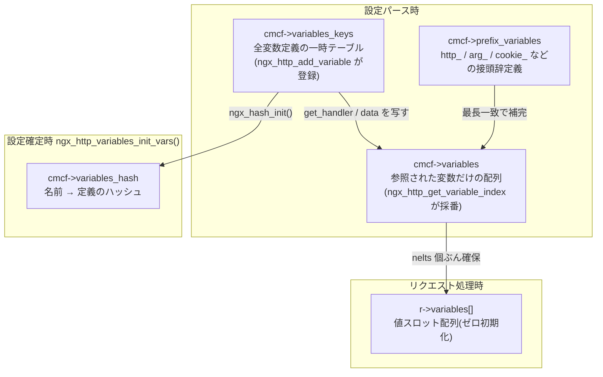
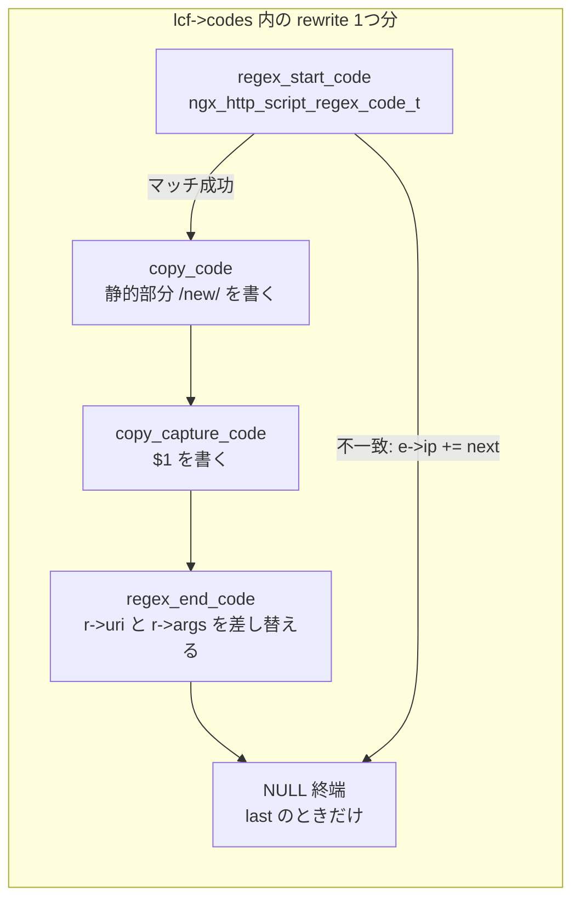

# 第12章 変数と rewrite

> **本章で読むソース**
>
> - [`src/http/ngx_http_variables.h`](https://github.com/nginx/nginx/blob/release-1.31.2/src/http/ngx_http_variables.h)
> - [`src/http/ngx_http_variables.c`](https://github.com/nginx/nginx/blob/release-1.31.2/src/http/ngx_http_variables.c)
> - [`src/http/ngx_http_script.h`](https://github.com/nginx/nginx/blob/release-1.31.2/src/http/ngx_http_script.h)
> - [`src/http/ngx_http_script.c`](https://github.com/nginx/nginx/blob/release-1.31.2/src/http/ngx_http_script.c)
> - [`src/http/modules/ngx_http_rewrite_module.c`](https://github.com/nginx/nginx/blob/release-1.31.2/src/http/modules/ngx_http_rewrite_module.c)

## この章の狙い

nginx の設定ファイルには `$remote_addr` や `$uri` のような **変数** が至るところに現れる。
`log_format` の書式、`proxy_pass` の URL、`rewrite` の置換文字列、`if` の条件式は、どれも同じ変数機構の上に成り立っている。
本章は、この変数機構を `ngx_http_variables.c` から読み解く。
変数の定義（`ngx_http_variable_t`）と値（`ngx_http_variable_value_t`）がどう分離されているか、設定パース時に変数名がどうインデックスへ解決されるか、実行時の取得がどうキャッシュされるかを順に追う。
そのうえで、「$変数を含む文字列」を設定時にコード列へコンパイルするスクリプトエンジン（`ngx_http_script.c`）と、その最大の利用者である rewrite モジュール（`ngx_http_rewrite_module.c`）を読む。
`rewrite`、`if`、`set` の3ディレクティブが、設定時にどんなコード列へ変換され、rewrite フェーズでどう実行されるかが本章の後半の主題である。

## 前提

第4章のハッシュ（`ngx_hash_t`）と配列（`ngx_array_t`）、第5章の設定パース（ディレクティブのハンドラが設定読み込み時に一度だけ走ること）を前提とする。
また、HTTP リクエストがフェーズエンジンの各フェーズを順に流れること、その中に `NGX_HTTP_SERVER_REWRITE_PHASE` と `NGX_HTTP_REWRITE_PHASE` があることは第10章で扱う内容を前提とする。
正規表現のマッチング自体は PCRE ライブラリに委ねられているため、本章の `ngx_regex_exec()` は「キャプチャ位置の配列を埋めて返すもの」として扱う。

## 変数の定義と値の分離

nginx の変数機構は、「変数とは何か」を表す **変数定義** と、「このリクエストでの値」を表す **変数値** を別の構造体に分けている。
変数値 `ngx_http_variable_value_t` は、コア文字列モジュールの `ngx_variable_value_t` の別名である。

[`src/core/ngx_string.h` L28-L37](https://github.com/nginx/nginx/blob/release-1.31.2/src/core/ngx_string.h#L28-L37)

```c
typedef struct {
    unsigned    len:28;

    unsigned    valid:1;
    unsigned    no_cacheable:1;
    unsigned    not_found:1;
    unsigned    escape:1;

    u_char     *data;
} ngx_variable_value_t;
```

`data` と `len` が値の本体であり、`ngx_str_t` と同様に NUL 終端を要求しないバイト列を指す。
残る4ビットのうち `valid`、`no_cacheable`、`not_found` の3つが、後述するリクエスト内キャッシュの状態を表す。
`valid` は「値が計算済みで使える」、`not_found` は「評価したが存在しなかった」（未定義の変数や、リクエストに含まれない `$arg_foo` など）、`no_cacheable` は「読むたびに再評価が要る」ことを意味する。

変数定義 `ngx_http_variable_t` は、名前と値の計算方法を持つ。

[`src/http/ngx_http_variables.h` L29-L44](https://github.com/nginx/nginx/blob/release-1.31.2/src/http/ngx_http_variables.h#L29-L44)

```c
#define NGX_HTTP_VAR_CHANGEABLE   1
#define NGX_HTTP_VAR_NOCACHEABLE  2
#define NGX_HTTP_VAR_INDEXED      4
#define NGX_HTTP_VAR_NOHASH       8
#define NGX_HTTP_VAR_WEAK         16
#define NGX_HTTP_VAR_PREFIX       32


struct ngx_http_variable_s {
    ngx_str_t                     name;   /* must be first to build the hash */
    ngx_http_set_variable_pt      set_handler;
    ngx_http_get_variable_pt      get_handler;
    uintptr_t                     data;
    ngx_uint_t                    flags;
    ngx_uint_t                    index;
};
```

`get_handler` が値を計算するコールバックであり、`data` はその引数（構造体オフセットや名前へのポインタなど、ハンドラごとに意味が異なる）である。
`set_handler` は `set` ディレクティブで代入可能な変数（`$args` や `$limit_rate`）だけが持つ。
フラグは6種類ある。
`NGX_HTTP_VAR_CHANGEABLE` は同名の再定義を許し、`NGX_HTTP_VAR_NOCACHEABLE` は値のキャッシュを禁じる。
`NGX_HTTP_VAR_INDEXED`、`NGX_HTTP_VAR_NOHASH`、`NGX_HTTP_VAR_PREFIX` は本章でこれから見る名前解決の経路を制御し、`NGX_HTTP_VAR_WEAK` は `set` による仮定義が本定義に上書きされることを許す。

定義と値を分けているのは、定義が設定全体で1つあれば足りるのに対し、値はリクエストごとに変わるためである。
たとえば `$uri` の定義は、リクエスト構造体の `uri` フィールドを読むハンドラとして1回だけ登録される。

[`src/http/ngx_http_variables.c` L244-L249](https://github.com/nginx/nginx/blob/release-1.31.2/src/http/ngx_http_variables.c#L244-L249)

```c
    { ngx_string("request_uri"), NULL, ngx_http_variable_request,
      offsetof(ngx_http_request_t, unparsed_uri), 0, 0 },

    { ngx_string("uri"), NULL, ngx_http_variable_request,
      offsetof(ngx_http_request_t, uri),
      NGX_HTTP_VAR_NOCACHEABLE, 0 },
```

`$uri` に `NGX_HTTP_VAR_NOCACHEABLE` が付いているのは、rewrite によってリクエスト処理の途中で URI が書き換わるためである。
一度読んだ値を使い回すと、書き換え後に古い URI が見えてしまう。

## コア変数の登録と名前解決の器

変数定義の置き場は、HTTP コアモジュールの main 設定 `ngx_http_core_main_conf_t` にまとまっている。

[`src/http/ngx_http_core_module.h` L162-L174](https://github.com/nginx/nginx/blob/release-1.31.2/src/http/ngx_http_core_module.h#L162-L174)

```c
    ngx_hash_t                 variables_hash;

    ngx_array_t                variables;         /* ngx_http_variable_t */
    ngx_array_t                prefix_variables;  /* ngx_http_variable_t */
    ngx_uint_t                 ncaptures;

    ngx_uint_t                 server_names_hash_max_size;
    ngx_uint_t                 server_names_hash_bucket_size;

    ngx_uint_t                 variables_hash_max_size;
    ngx_uint_t                 variables_hash_bucket_size;

    ngx_hash_keys_arrays_t    *variables_keys;
```

4つの器の役割は次のとおりである。

- **`variables_keys`**：設定パース中だけ存在する、全変数定義の一覧（ハッシュ構築用の一時テーブル）
- **`variables`**：この設定で実際に参照される変数だけを集めた配列（本章の中心となるインデックスの実体）
- **`prefix_variables`**：`http_` や `arg_` など、名前の前方一致で無数の変数を生む **接頭辞変数** の定義
- **`variables_hash`**：設定確定後に `variables_keys` から構築される、名前から定義を引くためのハッシュ

コアが提供する変数は、HTTP コアモジュールの preconfiguration フックである `ngx_http_variables_add_core_vars()` が登録する。

[`src/http/ngx_http_core_module.c` L3449-L3453](https://github.com/nginx/nginx/blob/release-1.31.2/src/http/ngx_http_core_module.c#L3449-L3453)

```c
static ngx_int_t
ngx_http_core_preconfiguration(ngx_conf_t *cf)
{
    return ngx_http_variables_add_core_vars(cf);
}
```

[`src/http/ngx_http_variables.c` L2745-L2785](https://github.com/nginx/nginx/blob/release-1.31.2/src/http/ngx_http_variables.c#L2745-L2785)

```c
ngx_int_t
ngx_http_variables_add_core_vars(ngx_conf_t *cf)
{
    ngx_http_variable_t        *cv, *v;
    ngx_http_core_main_conf_t  *cmcf;

    cmcf = ngx_http_conf_get_module_main_conf(cf, ngx_http_core_module);

    cmcf->variables_keys = ngx_pcalloc(cf->temp_pool,
                                       sizeof(ngx_hash_keys_arrays_t));
    if (cmcf->variables_keys == NULL) {
        return NGX_ERROR;
    }

    cmcf->variables_keys->pool = cf->pool;
    cmcf->variables_keys->temp_pool = cf->pool;

    if (ngx_hash_keys_array_init(cmcf->variables_keys, NGX_HASH_SMALL)
        != NGX_OK)
    {
        return NGX_ERROR;
    }

    if (ngx_array_init(&cmcf->prefix_variables, cf->pool, 8,
                       sizeof(ngx_http_variable_t))
        != NGX_OK)
    {
        return NGX_ERROR;
    }

    for (cv = ngx_http_core_variables; cv->name.len; cv++) {
        v = ngx_http_add_variable(cf, &cv->name, cv->flags);
        if (v == NULL) {
            return NGX_ERROR;
        }

        *v = *cv;
    }

    return NGX_OK;
}
```

静的テーブル `ngx_http_core_variables[]` の全エントリを `ngx_http_add_variable()` で `variables_keys` に登録する。
他のモジュール（upstream、SSL、gzip など）も、自分の preconfiguration フックから同じ `ngx_http_add_variable()` を呼んで変数を追加する。
テーブルの末尾には、接頭辞変数の定義が並んでいる。

[`src/http/ngx_http_variables.c` L396-L412](https://github.com/nginx/nginx/blob/release-1.31.2/src/http/ngx_http_variables.c#L396-L412)

```c
    { ngx_string("http_"), NULL, ngx_http_variable_unknown_header_in,
      0, NGX_HTTP_VAR_PREFIX, 0 },

    { ngx_string("sent_http_"), NULL, ngx_http_variable_unknown_header_out,
      0, NGX_HTTP_VAR_PREFIX, 0 },

    { ngx_string("sent_trailer_"), NULL, ngx_http_variable_unknown_trailer_out,
      0, NGX_HTTP_VAR_PREFIX, 0 },

    { ngx_string("cookie_"), NULL, ngx_http_variable_cookie,
      0, NGX_HTTP_VAR_PREFIX, 0 },

    { ngx_string("arg_"), NULL, ngx_http_variable_argument,
      0, NGX_HTTP_VAR_NOCACHEABLE|NGX_HTTP_VAR_PREFIX, 0 },

      ngx_http_null_variable
};
```

`$http_x_custom_header` や `$arg_page` のような変数は、1つずつ定義されているのではない。
`NGX_HTTP_VAR_PREFIX` が立った定義が `prefix_variables` 配列に入り、前方一致した任意の名前に同じ `get_handler` を適用する。
ハンドラは変数名そのものを受け取り、接頭辞を除いた残り（ヘッダ名やクエリパラメータ名）で実際の検索を行う。

## 設定時のインデックス化と `r->variables`

変数機構でまず押さえるべきなのは、`cmcf->variables` 配列と、その **インデックス** の意味である。
設定ファイルのどこかで `$host` が参照されるたびに、参照する側のモジュールは設定パース時に `ngx_http_get_variable_index()` を呼ぶ。

[`src/http/ngx_http_variables.c` L558-L615](https://github.com/nginx/nginx/blob/release-1.31.2/src/http/ngx_http_variables.c#L558-L615)

```c
ngx_int_t
ngx_http_get_variable_index(ngx_conf_t *cf, ngx_str_t *name)
{
    ngx_uint_t                  i;
    ngx_http_variable_t        *v;
    ngx_http_core_main_conf_t  *cmcf;

    if (name->len == 0) {
        ngx_conf_log_error(NGX_LOG_EMERG, cf, 0,
                           "invalid variable name \"$\"");
        return NGX_ERROR;
    }

    cmcf = ngx_http_conf_get_module_main_conf(cf, ngx_http_core_module);

    v = cmcf->variables.elts;

    if (v == NULL) {
        if (ngx_array_init(&cmcf->variables, cf->pool, 4,
                           sizeof(ngx_http_variable_t))
            != NGX_OK)
        {
            return NGX_ERROR;
        }

    } else {
        for (i = 0; i < cmcf->variables.nelts; i++) {
            if (name->len != v[i].name.len
                || ngx_strncasecmp(name->data, v[i].name.data, name->len) != 0)
            {
                continue;
            }

            return i;
        }
    }

    v = ngx_array_push(&cmcf->variables);
    if (v == NULL) {
        return NGX_ERROR;
    }

    v->name.len = name->len;
    v->name.data = ngx_pnalloc(cf->pool, name->len);
    if (v->name.data == NULL) {
        return NGX_ERROR;
    }

    ngx_strlow(v->name.data, name->data, name->len);

    v->set_handler = NULL;
    v->get_handler = NULL;
    v->data = 0;
    v->flags = 0;
    v->index = cmcf->variables.nelts - 1;

    return v->index;
}
```

同じ名前が登録済みならその添字を返し、初出なら配列に追加して新しい添字を返す。
この時点では `get_handler` は NULL のままであり、名前を予約しているだけである点に注意する。
定義との突き合わせは、全モジュールの設定処理が終わったあとに一括で行われる（後述の `ngx_http_variables_init_vars()`）。

このインデックスが実行時に意味を持つのは、リクエスト構造体の生成時に、`cmcf->variables` と同じ要素数の値スロット配列が確保されるからである。

[`src/http/ngx_http_request.c` L630-L637](https://github.com/nginx/nginx/blob/release-1.31.2/src/http/ngx_http_request.c#L630-L637)

```c
    cmcf = ngx_http_get_module_main_conf(r, ngx_http_core_module);

    r->variables = ngx_pcalloc(r->pool, cmcf->variables.nelts
                                        * sizeof(ngx_http_variable_value_t));
    if (r->variables == NULL) {
        ngx_destroy_pool(r->pool);
        return NULL;
    }
```

`ngx_pcalloc()` によるゼロ初期化で、全スロットは `valid = 0` かつ `not_found = 0`、すなわち「未評価」の状態から始まる。
`cmcf->variables` の i 番目の定義に対応する値は、常に `r->variables[i]` にある。
設定時に名前をインデックスへ解決しておくことで、実行時の変数アクセスは名前のハッシュ計算も文字列比較も伴わない、配列の直接参照1回になる。
これが変数機構の最初の最適化である。

設定パースがすべて終わると、`ngx_http_variables_init_vars()` が「参照された変数」と「定義された変数」を突き合わせる。

[`src/http/ngx_http_variables.c` L2806-L2832](https://github.com/nginx/nginx/blob/release-1.31.2/src/http/ngx_http_variables.c#L2806-L2832)

```c
    for (i = 0; i < cmcf->variables.nelts; i++) {

        for (n = 0; n < cmcf->variables_keys->keys.nelts; n++) {

            av = key[n].value;

            if (v[i].name.len == key[n].key.len
                && ngx_strncmp(v[i].name.data, key[n].key.data, v[i].name.len)
                   == 0)
            {
                v[i].get_handler = av->get_handler;
                v[i].data = av->data;

                av->flags |= NGX_HTTP_VAR_INDEXED;
                v[i].flags = av->flags;

                av->index = i;

                if (av->get_handler == NULL
                    || (av->flags & NGX_HTTP_VAR_WEAK))
                {
                    break;
                }

                goto next;
            }
        }
```

インデックス化された各変数に、定義側の `get_handler` と `data` を写す。
同時に定義側へ `NGX_HTTP_VAR_INDEXED` フラグと `index` を書き戻し、「この変数はインデックスを持つ」ことを後の名前検索から参照できるようにする。
`variables_keys` に見つからなかった変数は、接頭辞変数の最長一致で解決を試みる（`$arg_page` のような名前がここで `arg_` の定義に落ちる）。
このとき `v[i].data` には変数名そのものへのポインタが入り、実行時にハンドラが接頭辞の残りを取り出せるようにする。

最後に、名前からの実行時検索に使うハッシュを構築して、一時テーブルを破棄する。

[`src/http/ngx_http_variables.c` L2876-L2891](https://github.com/nginx/nginx/blob/release-1.31.2/src/http/ngx_http_variables.c#L2876-L2891)

```c
    hash.hash = &cmcf->variables_hash;
    hash.key = ngx_hash_key;
    hash.max_size = cmcf->variables_hash_max_size;
    hash.bucket_size = cmcf->variables_hash_bucket_size;
    hash.name = "variables_hash";
    hash.pool = cf->pool;
    hash.temp_pool = NULL;

    if (ngx_hash_init(&hash, cmcf->variables_keys->keys.elts,
                      cmcf->variables_keys->keys.nelts)
        != NGX_OK)
    {
        return NGX_ERROR;
    }

    cmcf->variables_keys = NULL;
```

構造の全体を図にまとめる。



## 実行時の取得とリクエスト内キャッシュ

インデックスを知っている呼び出し側は、実行時に `ngx_http_get_indexed_variable()` で値を取る。

[`src/http/ngx_http_variables.c` L618-L665](https://github.com/nginx/nginx/blob/release-1.31.2/src/http/ngx_http_variables.c#L618-L665)

```c
ngx_http_variable_value_t *
ngx_http_get_indexed_variable(ngx_http_request_t *r, ngx_uint_t index)
{
    ngx_http_variable_t        *v;
    ngx_http_core_main_conf_t  *cmcf;

    cmcf = ngx_http_get_module_main_conf(r, ngx_http_core_module);

    if (cmcf->variables.nelts <= index) {
        ngx_log_error(NGX_LOG_ALERT, r->connection->log, 0,
                      "unknown variable index: %ui", index);
        return NULL;
    }

    if (r->variables[index].not_found || r->variables[index].valid) {
        return &r->variables[index];
    }

    v = cmcf->variables.elts;

    if (ngx_http_variable_depth == 0) {
        ngx_log_error(NGX_LOG_ERR, r->connection->log, 0,
                      "cycle while evaluating variable \"%V\"",
                      &v[index].name);
        return NULL;
    }

    ngx_http_variable_depth--;

    if (v[index].get_handler(r, &r->variables[index], v[index].data)
        == NGX_OK)
    {
        ngx_http_variable_depth++;

        if (v[index].flags & NGX_HTTP_VAR_NOCACHEABLE) {
            r->variables[index].no_cacheable = 1;
        }

        return &r->variables[index];
    }

    ngx_http_variable_depth++;

    r->variables[index].valid = 0;
    r->variables[index].not_found = 1;

    return NULL;
}
```

スロットが `valid` か `not_found` なら、ハンドラを呼ばずにそのまま返す。
これが **変数値のリクエスト内キャッシュ** である。
`$remote_addr` のように計算に文字列整形を伴う変数や、`$request_id` のように乱数生成を伴う変数でも、1リクエスト内で何度参照されようとハンドラの実行は1回で済む。
未評価のときだけ `get_handler` を呼び、結果をスロットに書き込む。
`NGX_HTTP_VAR_NOCACHEABLE` な変数は、評価後に `no_cacheable = 1` の印が付く。
値そのものはスロットに残るため、「キャッシュを使ってよい場面」と「捨てるべき場面」の判断は呼び出し側に委ねられる。

`ngx_http_variable_depth` は再帰の深さを制限するガードである。

[`src/http/ngx_http_variables.c` L421](https://github.com/nginx/nginx/blob/release-1.31.2/src/http/ngx_http_variables.c#L421)

```c
static ngx_uint_t  ngx_http_variable_depth = 100;
```

`map` で定義した変数が別の変数を参照するといった連鎖は正当だが、循環定義を書くと評価が無限再帰する。
ハンドラ呼び出しのたびに深さを1減らし、100段でエラーにする。

キャッシュを捨てる側の入口が `ngx_http_get_flushed_variable()` である。

[`src/http/ngx_http_variables.c` L668-L685](https://github.com/nginx/nginx/blob/release-1.31.2/src/http/ngx_http_variables.c#L668-L685)

```c
ngx_http_variable_value_t *
ngx_http_get_flushed_variable(ngx_http_request_t *r, ngx_uint_t index)
{
    ngx_http_variable_value_t  *v;

    v = &r->variables[index];

    if (v->valid || v->not_found) {
        if (!v->no_cacheable) {
            return v;
        }

        v->valid = 0;
        v->not_found = 0;
    }

    return ngx_http_get_indexed_variable(r, index);
}
```

キャッシュ可能な変数ならそのまま返し、`no_cacheable` な変数だけキャッシュを無効化して評価し直す。
2つの関数の使い分けは評価のタイミングで決まる。
ログ出力のようにリクエストの最後で1回だけ読む場面や、1つの式の評価中で値が変わらないと分かっている場面は `ngx_http_get_indexed_variable()` でよい。
rewrite 処理のように `$uri` が途中で書き換わりうる場面は、`ngx_http_get_flushed_variable()` で読む。

## 名前による実行時検索と接頭辞変数

インデックスを持たない場面もある。
SSI の `<!--# echo var="..." -->` や perl モジュールの `$r->variable(...)` のように、変数名が実行時にしか決まらない機能は、名前とそのハッシュ値で `ngx_http_get_variable()` を呼ぶ。

[`src/http/ngx_http_variables.c` L688-L755](https://github.com/nginx/nginx/blob/release-1.31.2/src/http/ngx_http_variables.c#L688-L755)

```c
ngx_http_variable_value_t *
ngx_http_get_variable(ngx_http_request_t *r, ngx_str_t *name, ngx_uint_t key)
{
    size_t                      len;
    ngx_uint_t                  i, n;
    ngx_http_variable_t        *v;
    ngx_http_variable_value_t  *vv;
    ngx_http_core_main_conf_t  *cmcf;

    cmcf = ngx_http_get_module_main_conf(r, ngx_http_core_module);

    v = ngx_hash_find(&cmcf->variables_hash, key, name->data, name->len);

    if (v) {
        if (v->flags & NGX_HTTP_VAR_INDEXED) {
            return ngx_http_get_flushed_variable(r, v->index);
        }

        if (ngx_http_variable_depth == 0) {
            ngx_log_error(NGX_LOG_ERR, r->connection->log, 0,
                          "cycle while evaluating variable \"%V\"", name);
            return NULL;
        }

        ngx_http_variable_depth--;

        vv = ngx_palloc(r->pool, sizeof(ngx_http_variable_value_t));

        if (vv && v->get_handler(r, vv, v->data) == NGX_OK) {
            ngx_http_variable_depth++;
            return vv;
        }

        ngx_http_variable_depth++;
        return NULL;
    }

    vv = ngx_palloc(r->pool, sizeof(ngx_http_variable_value_t));
    if (vv == NULL) {
        return NULL;
    }

    len = 0;

    v = cmcf->prefix_variables.elts;
    n = cmcf->prefix_variables.nelts;

    for (i = 0; i < cmcf->prefix_variables.nelts; i++) {
        if (name->len >= v[i].name.len && name->len > len
            && ngx_strncmp(name->data, v[i].name.data, v[i].name.len) == 0)
        {
            len = v[i].name.len;
            n = i;
        }
    }

    if (n != cmcf->prefix_variables.nelts) {
        if (v[n].get_handler(r, vv, (uintptr_t) name) == NGX_OK) {
            return vv;
        }

        return NULL;
    }

    vv->not_found = 1;

    return vv;
}
```

処理は3段構えである。
まず `variables_hash` を引き、定義に `NGX_HTTP_VAR_INDEXED` が立っていれば、インデックス経由のキャッシュ付き取得に合流する。
名前検索で入ってきても、その変数がどこかでインデックス化されていれば、キャッシュの恩恵を受けられるということである。
定義はあるがインデックス化されていない変数は、プールから値を確保してハンドラを直接呼ぶ（この経路にキャッシュはない）。
ハッシュに存在しない名前は、`prefix_variables` を線形に走査して **最長一致** する接頭辞を探す。
最長一致にしているのは、`http_` と `sent_http_` のように一方が他方を含む接頭辞が共存するためである。

接頭辞変数のハンドラは、渡された変数名から接頭辞を取り除いて残りをキーに使う。
`$arg_page` を処理する `ngx_http_variable_argument()` を見る。

[`src/http/ngx_http_variables.c` L1108-L1133](https://github.com/nginx/nginx/blob/release-1.31.2/src/http/ngx_http_variables.c#L1108-L1133)

```c
static ngx_int_t
ngx_http_variable_argument(ngx_http_request_t *r, ngx_http_variable_value_t *v,
    uintptr_t data)
{
    ngx_str_t *name = (ngx_str_t *) data;

    u_char     *arg;
    size_t      len;
    ngx_str_t   value;

    len = name->len - (sizeof("arg_") - 1);
    arg = name->data + sizeof("arg_") - 1;

    if (len == 0 || ngx_http_arg(r, arg, len, &value) != NGX_OK) {
        v->not_found = 1;
        return NGX_OK;
    }

    v->data = value.data;
    v->len = value.len;
    v->valid = 1;
    v->no_cacheable = 0;
    v->not_found = 0;

    return NGX_OK;
}
```

値の `data` はクエリ文字列（`r->args`）の中を直接指しており、複製は起きない。
変数値がバイト列へのポインタと長さの組であることが、このゼロコピーを可能にしている。
`$http_...` のハンドラも同様に、パース済みヘッダのリストを名前で探し、ヘッダ値そのものを指して返す。

## スクリプトエンジン：$変数を含む文字列のコンパイル

変数を1個ずつ取得する API の上に、「`/new/$1?user=$arg_user` のような文字列全体を評価する」層がある。
これが **スクリプトエンジン**（`ngx_http_script.c`）であり、`rewrite` の置換文字列、`proxy_pass` の URL、`log_format` の書式など、$変数を含むあらゆる設定値の共通基盤である。

スクリプトエンジンの方針は、実行時に文字列をパースしないことに尽きる。
設定時に `ngx_http_script_compile()` が文字列を一度だけパースし、「静的部分の複製」「変数値の複製」「キャプチャの複製」といった操作の列、すなわち **コード列** に変換する。
コンパイルの入出力は `ngx_http_script_compile_t` にまとまっている。

[`src/http/ngx_http_script.h` L39-L63](https://github.com/nginx/nginx/blob/release-1.31.2/src/http/ngx_http_script.h#L39-L63)

```c
typedef struct {
    ngx_conf_t                 *cf;
    ngx_str_t                  *source;

    ngx_array_t               **flushes;
    ngx_array_t               **lengths;
    ngx_array_t               **values;

    ngx_uint_t                  variables;
    ngx_uint_t                  ncaptures;
    ngx_uint_t                  captures_mask;
    ngx_uint_t                  size;

    void                       *main;

    unsigned                    compile_args:1;
    unsigned                    complete_lengths:1;
    unsigned                    complete_values:1;
    unsigned                    zero:1;
    unsigned                    conf_prefix:1;
    unsigned                    root_prefix:1;

    unsigned                    dup_capture:1;
    unsigned                    args:1;
} ngx_http_script_compile_t;
```

出力は3本の配列である。
`lengths` には「評価結果の長さを求めるコード」、`values` には「実際にバイト列を書き出すコード」が積まれ、`flushes` にはこの文字列が参照する変数のインデックス一覧が入る（評価前に `no_cacheable` な変数を一括で無効化するために使う）。
コンパイル本体は `source` を1文字ずつ走査し、`$` の後続で分岐する。

[`src/http/ngx_http_script.c` L474-L498](https://github.com/nginx/nginx/blob/release-1.31.2/src/http/ngx_http_script.c#L474-L498)

```c
        if (sc->source->data[i] == '$') {

            if (++i == sc->source->len) {
                goto invalid_variable;
            }

            if (sc->source->data[i] >= '1' && sc->source->data[i] <= '9') {
#if (NGX_PCRE)
                ngx_uint_t  n;

                n = sc->source->data[i] - '0';

                if (sc->captures_mask & ((ngx_uint_t) 1 << n)) {
                    sc->dup_capture = 1;
                }

                sc->captures_mask |= (ngx_uint_t) 1 << n;

                if (ngx_http_script_add_capture_code(sc, n) != NGX_OK) {
                    return NGX_ERROR;
                }

                i++;

                continue;
```

`$1` から `$9` は正規表現キャプチャの参照としてコンパイルされる。
それ以外は英数字とアンダースコア（`${name}` の括弧形式も可）を変数名として切り出し、変数参照コードを積む。

[`src/http/ngx_http_script.c` L548-L558](https://github.com/nginx/nginx/blob/release-1.31.2/src/http/ngx_http_script.c#L548-L558)

```c
            if (name.len == 0) {
                goto invalid_variable;
            }

            sc->variables++;

            if (ngx_http_script_add_var_code(sc, &name) != NGX_OK) {
                return NGX_ERROR;
            }

            continue;
```

`$` を含まない区間は、そのまま静的コピーのコードになる。

[`src/http/ngx_http_script.c` L595-L601](https://github.com/nginx/nginx/blob/release-1.31.2/src/http/ngx_http_script.c#L595-L601)

```c
        sc->size += name.len;

        if (ngx_http_script_add_copy_code(sc, &name, (i == sc->source->len))
            != NGX_OK)
        {
            return NGX_ERROR;
        }
```

変数参照コードを積む `ngx_http_script_add_var_code()` が、前節のインデックス化と接続する箇所である。

[`src/http/ngx_http_script.c` L888-L930](https://github.com/nginx/nginx/blob/release-1.31.2/src/http/ngx_http_script.c#L888-L930)

```c
static ngx_int_t
ngx_http_script_add_var_code(ngx_http_script_compile_t *sc, ngx_str_t *name)
{
    ngx_int_t                    index, *p;
    ngx_http_script_var_code_t  *code;

    index = ngx_http_get_variable_index(sc->cf, name);

    if (index == NGX_ERROR) {
        return NGX_ERROR;
    }

    if (sc->flushes) {
        p = ngx_array_push(*sc->flushes);
        if (p == NULL) {
            return NGX_ERROR;
        }

        *p = index;
    }

    code = ngx_http_script_add_code(*sc->lengths,
                                    sizeof(ngx_http_script_var_code_t), NULL);
    if (code == NULL) {
        return NGX_ERROR;
    }

    code->code = (ngx_http_script_code_pt) (void *)
                                             ngx_http_script_copy_var_len_code;
    code->index = (uintptr_t) index;

    code = ngx_http_script_add_code(*sc->values,
                                    sizeof(ngx_http_script_var_code_t),
                                    &sc->main);
    if (code == NULL) {
        return NGX_ERROR;
    }

    code->code = ngx_http_script_copy_var_code;
    code->index = (uintptr_t) index;

    return NGX_OK;
}
```

変数名はここで `ngx_http_get_variable_index()` によりインデックスへ解決され、コード列には名前ではなく添字だけが埋め込まれる。
`lengths` 側には長さ計算用、`values` 側には複製用と、同じインデックスを持つコードが対で積まれる。
コード列に文字列としての変数名が残らないため、実行時には名前の解釈という工程そのものが存在しない。

## length/copy の2パス評価：`ngx_http_script_run()`

コード列の実行単位は、命令ポインタとレジスタをまとめた `ngx_http_script_engine_t` である。
`ip` がコード列上の現在位置、`pos` が出力バッファへの書き込み位置を指し、各コードは自分を実行し終えると `ip` を自分のサイズ分だけ進める。
もっとも単純な実行器が、log モジュールなどで使われる `ngx_http_script_run()` である。

[`src/http/ngx_http_script.c` L614-L660](https://github.com/nginx/nginx/blob/release-1.31.2/src/http/ngx_http_script.c#L614-L660)

```c
u_char *
ngx_http_script_run(ngx_http_request_t *r, ngx_str_t *value,
    void *code_lengths, size_t len, void *code_values)
{
    ngx_uint_t                    i;
    ngx_http_script_code_pt       code;
    ngx_http_script_len_code_pt   lcode;
    ngx_http_script_engine_t      e;
    ngx_http_core_main_conf_t    *cmcf;

    cmcf = ngx_http_get_module_main_conf(r, ngx_http_core_module);

    for (i = 0; i < cmcf->variables.nelts; i++) {
        if (r->variables[i].no_cacheable) {
            r->variables[i].valid = 0;
            r->variables[i].not_found = 0;
        }
    }

    ngx_memzero(&e, sizeof(ngx_http_script_engine_t));

    e.ip = code_lengths;
    e.request = r;
    e.flushed = 1;

    while (*(uintptr_t *) e.ip) {
        lcode = *(ngx_http_script_len_code_pt *) e.ip;
        len += lcode(&e);
    }


    value->len = len;
    value->data = ngx_pnalloc(r->pool, len);
    if (value->data == NULL) {
        return NULL;
    }

    e.ip = code_values;
    e.pos = value->data;

    while (*(uintptr_t *) e.ip) {
        code = *(ngx_http_script_code_pt *) e.ip;
        code((ngx_http_script_engine_t *) &e);
    }

    return e.pos;
}
```

評価は2パスで進む。
1パス目は `lengths` のコード列を実行して結果の総バイト数だけを求め、その長さでメモリプールから出力バッファを1回だけ確保する。
2パス目は `values` のコード列を実行して、確保済みバッファへ順に書き出す。
長さが先に確定しているので、途中での再確保（realloc 相当）も、断片文字列を連結し直す一時バッファも要らない。
これがスクリプトエンジンの2つ目の最適化であり、可変長の文字列合成をプール確保1回と `memcpy` の列に還元している。

2パスが成立するには、1パス目と2パス目で変数の値が一致しなければならない。
長さ計算のあとに値が変わると、バッファあふれか切り詰めが起きる。
これを保証しているのが前述のリクエスト内キャッシュである。
冒頭で `no_cacheable` な変数のキャッシュを一括で無効化し（`flushes` 配列を持つ呼び出し側は `ngx_http_script_flush_no_cacheable_variables()` で同じことをする）、以後は `e.flushed = 1` を立てる。
変数参照コードの実体を見ると、このフラグで取得経路を切り替えている。

[`src/http/ngx_http_script.c` L933-L955](https://github.com/nginx/nginx/blob/release-1.31.2/src/http/ngx_http_script.c#L933-L955)

```c
size_t
ngx_http_script_copy_var_len_code(ngx_http_script_engine_t *e)
{
    ngx_http_variable_value_t   *value;
    ngx_http_script_var_code_t  *code;

    code = (ngx_http_script_var_code_t *) e->ip;

    e->ip += sizeof(ngx_http_script_var_code_t);

    if (e->flushed) {
        value = ngx_http_get_indexed_variable(e->request, code->index);

    } else {
        value = ngx_http_get_flushed_variable(e->request, code->index);
    }

    if (value && !value->not_found) {
        return value->len;
    }

    return 0;
}
```

[`src/http/ngx_http_script.c` L958-L987](https://github.com/nginx/nginx/blob/release-1.31.2/src/http/ngx_http_script.c#L958-L987)

```c
void
ngx_http_script_copy_var_code(ngx_http_script_engine_t *e)
{
    u_char                      *p;
    ngx_http_variable_value_t   *value;
    ngx_http_script_var_code_t  *code;

    code = (ngx_http_script_var_code_t *) e->ip;

    e->ip += sizeof(ngx_http_script_var_code_t);

    if (!e->skip) {

        if (e->flushed) {
            value = ngx_http_get_indexed_variable(e->request, code->index);

        } else {
            value = ngx_http_get_flushed_variable(e->request, code->index);
        }

        if (value && !value->not_found) {
            p = e->pos;
            e->pos = ngx_copy(p, value->data, value->len);

            ngx_log_debug2(NGX_LOG_DEBUG_HTTP,
                           e->request->connection->log, 0,
                           "http script var: \"%*s\"", e->pos - p, p);
        }
    }
}
```

`flushed` が立っている間は `ngx_http_get_indexed_variable()`、すなわちキャッシュ優先の経路を使う。
1パス目の評価がキャッシュに値を書き込むので、2パス目は同じ値をキャッシュから読むだけになり、長さと内容の一致が機構として保証される。
キャッシュは高速化のためだけでなく、2パス評価の正しさの前提でもある。

## rewrite モジュール：ディレクティブのコンパイルと rewrite フェーズでの実行

スクリプトエンジンの最大の利用者が rewrite モジュールである。
rewrite モジュールは、location 設定 `ngx_http_rewrite_loc_conf_t` の `codes` 配列に、`rewrite`、`if`、`set`、`return`、`break` の各ディレクティブをコード列としてためこむ。
実行の入口はフェーズハンドラとして2箇所に登録される。

[`src/http/modules/ngx_http_rewrite_module.c` L271-L294](https://github.com/nginx/nginx/blob/release-1.31.2/src/http/modules/ngx_http_rewrite_module.c#L271-L294)

```c
static ngx_int_t
ngx_http_rewrite_init(ngx_conf_t *cf)
{
    ngx_http_handler_pt        *h;
    ngx_http_core_main_conf_t  *cmcf;

    cmcf = ngx_http_conf_get_module_main_conf(cf, ngx_http_core_module);

    h = ngx_array_push(&cmcf->phases[NGX_HTTP_SERVER_REWRITE_PHASE].handlers);
    if (h == NULL) {
        return NGX_ERROR;
    }

    *h = ngx_http_rewrite_handler;

    h = ngx_array_push(&cmcf->phases[NGX_HTTP_REWRITE_PHASE].handlers);
    if (h == NULL) {
        return NGX_ERROR;
    }

    *h = ngx_http_rewrite_handler;

    return NGX_OK;
}
```

server コンテキストのディレクティブは `NGX_HTTP_SERVER_REWRITE_PHASE`（location 選択の前）、location コンテキストのものは `NGX_HTTP_REWRITE_PHASE`（location 選択の後）で実行される。
ハンドラ本体は、コード列を先頭から実行するだけのループである。

[`src/http/modules/ngx_http_rewrite_module.c` L136-L184](https://github.com/nginx/nginx/blob/release-1.31.2/src/http/modules/ngx_http_rewrite_module.c#L136-L184)

```c
static ngx_int_t
ngx_http_rewrite_handler(ngx_http_request_t *r)
{
    ngx_int_t                     index;
    ngx_http_script_code_pt       code;
    ngx_http_script_engine_t     *e;
    ngx_http_core_srv_conf_t     *cscf;
    ngx_http_core_main_conf_t    *cmcf;
    ngx_http_rewrite_loc_conf_t  *rlcf;

    cmcf = ngx_http_get_module_main_conf(r, ngx_http_core_module);
    cscf = ngx_http_get_module_srv_conf(r, ngx_http_core_module);
    index = cmcf->phase_engine.location_rewrite_index;

    if (r->phase_handler == index && r->loc_conf == cscf->ctx->loc_conf) {
        /* skipping location rewrite phase for server null location */
        return NGX_DECLINED;
    }

    rlcf = ngx_http_get_module_loc_conf(r, ngx_http_rewrite_module);

    if (rlcf->codes == NULL) {
        return NGX_DECLINED;
    }

    e = ngx_pcalloc(r->pool, sizeof(ngx_http_script_engine_t));
    if (e == NULL) {
        return NGX_HTTP_INTERNAL_SERVER_ERROR;
    }

    e->sp = ngx_pcalloc(r->pool,
                        rlcf->stack_size * sizeof(ngx_http_variable_value_t));
    if (e->sp == NULL) {
        return NGX_HTTP_INTERNAL_SERVER_ERROR;
    }

    e->ip = rlcf->codes->elts;
    e->request = r;
    e->quote = 1;
    e->log = rlcf->log;
    e->status = NGX_DECLINED;

    while (*(uintptr_t *) e->ip) {
        code = *(ngx_http_script_code_pt *) e->ip;
        code(e);
    }

    return e->status;
}
```

`while` ループは、`ip` の指す位置から関数ポインタを読み、呼び出す、の繰り返しである。
各コードが `ip` を進める（あるいはジャンプさせる）ため、これは事実上のバイトコードインタプリタであり、コード列は設定時に生成済みの命令列にあたる。
実行時の rewrite 処理に、正規表現のコンパイルも条件式の構文解析も現れないのはこのためである。
設定ファイルの1行を毎リクエスト解釈し直す方式と比べ、実行時に残る仕事は関数ポインタの間接呼び出しだけになる。
`e->sp` は `if` の条件評価に使うオペランドスタック（後述）で、`stack_size`（デフォルト10）ぶんの値スロットが確保される。

`rewrite regex replacement [flag];` のコンパイルを担う `ngx_http_rewrite()` を見る。
まず正規表現をコンパイルし、コード列の先頭に `ngx_http_script_regex_code_t` を置く。

[`src/http/modules/ngx_http_rewrite_module.c` L326-L341](https://github.com/nginx/nginx/blob/release-1.31.2/src/http/modules/ngx_http_rewrite_module.c#L326-L341)

```c
    ngx_memzero(&rc, sizeof(ngx_regex_compile_t));

    rc.pattern = value[1];
    rc.err.len = NGX_MAX_CONF_ERRSTR;
    rc.err.data = errstr;

    /* TODO: NGX_REGEX_CASELESS */

    regex->regex = ngx_http_regex_compile(cf, &rc);
    if (regex->regex == NULL) {
        return NGX_CONF_ERROR;
    }

    regex->code = ngx_http_script_regex_start_code;
    regex->uri = 1;
    regex->name = value[1];
```

続いて置換文字列をスクリプトエンジンでコンパイルする。
`values` の出力先が `lcf->codes` そのものである点が要である。

[`src/http/modules/ngx_http_rewrite_module.c` L388-L410](https://github.com/nginx/nginx/blob/release-1.31.2/src/http/modules/ngx_http_rewrite_module.c#L388-L410)

```c
    ngx_memzero(&sc, sizeof(ngx_http_script_compile_t));

    sc.cf = cf;
    sc.source = &value[2];
    sc.lengths = &regex->lengths;
    sc.values = &lcf->codes;
    sc.variables = ngx_http_script_variables_count(&value[2]);
    sc.main = regex;
    sc.complete_lengths = 1;
    sc.compile_args = !regex->redirect;

    if (ngx_http_script_compile(&sc) != NGX_OK) {
        return NGX_CONF_ERROR;
    }

    regex = sc.main;

    regex->size = sc.size;
    regex->args = sc.args;

    if (sc.variables == 0 && !sc.dup_capture) {
        regex->lengths = NULL;
    }
```

置換文字列の複製コードは、正規表現コードの直後に同じ `codes` 配列へ並ぶ。
一方、長さ計算コードは `regex->lengths` という別配列に隔離される。
置換文字列に変数が1つもなく、同じキャプチャの重複参照もなければ、`regex->lengths` は捨てられ、静的部分の合計 `sc.size` だけが `regex->size` に残る。
最後に終端コードを置き、不一致時の飛び越し先を記録する。

[`src/http/modules/ngx_http_rewrite_module.c` L412-L438](https://github.com/nginx/nginx/blob/release-1.31.2/src/http/modules/ngx_http_rewrite_module.c#L412-L438)

```c
    regex_end = ngx_http_script_add_code(lcf->codes,
                                      sizeof(ngx_http_script_regex_end_code_t),
                                      &regex);
    if (regex_end == NULL) {
        return NGX_CONF_ERROR;
    }

    regex_end->code = ngx_http_script_regex_end_code;
    regex_end->uri = regex->uri;
    regex_end->args = regex->args;
    regex_end->add_args = regex->add_args;
    regex_end->redirect = regex->redirect;

    if (last) {
        code = ngx_http_script_add_code(lcf->codes, sizeof(uintptr_t), &regex);
        if (code == NULL) {
            return NGX_CONF_ERROR;
        }

        *code = NULL;
    }

    regex->next = (u_char *) lcf->codes->elts + lcf->codes->nelts
                                              - (u_char *) regex;

    return NGX_CONF_OK;
}
```

`regex->next` は、この `rewrite` 一式（正規表現コードから終端コードまで）のバイト数である。
`last` や `break` の指定があれば NULL コードが置かれ、実行ループはそこで止まる。
`rewrite ^/old/(.+)$ /new/$1 last;` のコード列は次の形になる。



実行時の `ngx_http_script_regex_start_code()` は、まず対象文字列を決めて正規表現を実行する。

[`src/http/ngx_http_script.c` L1057-L1065](https://github.com/nginx/nginx/blob/release-1.31.2/src/http/ngx_http_script.c#L1057-L1065)

```c
    if (code->uri) {
        e->line = r->uri;
    } else {
        e->sp--;
        e->line.len = e->sp->len;
        e->line.data = e->sp->data;
    }

    rc = ngx_http_regex_exec(r, code->regex, &e->line);
```

`rewrite` ディレクティブなら対象は `r->uri`、`if ($var ~ regex)` の条件ならスタックから取り出した値である。
不一致（`NGX_DECLINED`）の場合の分岐に、`next` フィールドが効く。

[`src/http/ngx_http_script.c` L1076-L1093](https://github.com/nginx/nginx/blob/release-1.31.2/src/http/ngx_http_script.c#L1076-L1093)

```c
        if (code->test) {
            if (code->negative_test) {
                e->sp->len = 1;
                e->sp->data = (u_char *) "1";

            } else {
                e->sp->len = 0;
                e->sp->data = (u_char *) "";
            }

            e->sp++;

            e->ip += sizeof(ngx_http_script_regex_code_t);
            return;
        }

        e->ip += code->next;
        return;
```

条件テスト（`test`）なら真偽値をスタックに積んで次のコードへ進み、`rewrite` なら `e->ip += code->next` で置換コード一式を丸ごと飛び越す。
マッチした場合は、出力バッファの長さを決めて確保する。
ここで、コンパイル時に `lengths` を捨てられたかどうかで経路が分かれる。

[`src/http/ngx_http_script.c` L1145-L1179](https://github.com/nginx/nginx/blob/release-1.31.2/src/http/ngx_http_script.c#L1145-L1179)

```c
    if (code->lengths == NULL) {
        e->buf.len = code->size;

        cap = r->captures;
        p = r->captures_data;

        for (n = 2; n < r->ncaptures; n += 2) {
            e->buf.len += cap[n + 1] - cap[n];

            if (code->uri) {
                if (r->quoted_uri || r->plus_in_uri) {
                    e->buf.len += 2 * ngx_escape_uri(NULL, &p[cap[n]],
                                                     cap[n + 1] - cap[n],
                                                     NGX_ESCAPE_ARGS);
                }
            }
        }

    } else {
        ngx_memzero(&le, sizeof(ngx_http_script_engine_t));

        le.ip = code->lengths->elts;
        le.line = e->line;
        le.request = r;
        le.quote = code->redirect;

        len = 0;

        while (*(uintptr_t *) le.ip) {
            lcode = *(ngx_http_script_len_code_pt *) le.ip;
            len += lcode(&le);
        }

        e->buf.len = len;
    }
```

変数を含まない置換文字列では、長さは「設定時に計算済みの静的長 `code->size` とキャプチャ長の和」だけで求まり、長さ計算のコード列すら実行しない。
変数を含む場合は、別エンジン `le` を作って `lengths` のコード列を実行する（`ngx_http_script_run()` の1パス目と同じ構図である）。
どちらの場合も、そのあと本体のエンジン `e` が `values` 側の複製コードを順に実行して置換結果を書き上げる。
仕上げの `ngx_http_script_regex_end_code()` が、組み上がった文字列をリクエストに反映する。

[`src/http/ngx_http_script.c` L1289-L1301](https://github.com/nginx/nginx/blob/release-1.31.2/src/http/ngx_http_script.c#L1289-L1301)

```c
    if (code->uri) {
        r->uri = e->buf;

        if (r->uri.len == 0) {
            ngx_log_error(NGX_LOG_ERR, r->connection->log, 0,
                          "the rewritten URI has a zero length");
            e->ip = ngx_http_script_exit;
            e->status = NGX_HTTP_INTERNAL_SERVER_ERROR;
            return;
        }

        ngx_http_set_exten(r);
    }
```

`redirect` 系のフラグが立っていれば `r->uri` の代わりに `Location` ヘッダを組み立て、`last` 相当なら `r->uri_changed = 1` が立って location 選択がやり直される（フェーズエンジン側の post rewrite 処理は第10章の範囲である）。

## 正規表現キャプチャと `ngx_http_regex_exec()`

rewrite の `$1` や名前付きキャプチャ `(?<name>...)` は、正規表現ラッパー `ngx_http_regex_t` が変数機構へ橋渡しする。
コンパイル時の `ngx_http_regex_compile()` は、2つの下準備をする。
1つ目は、キャプチャ数の全体最大値の記録である。

[`src/http/ngx_http_variables.c` L2628-L2629](https://github.com/nginx/nginx/blob/release-1.31.2/src/http/ngx_http_variables.c#L2628-L2629)

```c
    cmcf = ngx_http_conf_get_module_main_conf(cf, ngx_http_core_module);
    cmcf->ncaptures = ngx_max(cmcf->ncaptures, re->ncaptures);
```

2つ目は、名前付きキャプチャの変数登録である。

[`src/http/ngx_http_variables.c` L2648-L2667](https://github.com/nginx/nginx/blob/release-1.31.2/src/http/ngx_http_variables.c#L2648-L2667)

```c
    for (i = 0; i < n; i++) {
        rv[i].capture = 2 * ((p[0] << 8) + p[1]);

        name.data = &p[2];
        name.len = ngx_strlen(name.data);

        v = ngx_http_add_variable(cf, &name, NGX_HTTP_VAR_CHANGEABLE);
        if (v == NULL) {
            return NULL;
        }

        rv[i].index = ngx_http_get_variable_index(cf, &name);
        if (rv[i].index == NGX_ERROR) {
            return NULL;
        }

        v->get_handler = ngx_http_variable_not_found;

        p += size;
    }
```

キャプチャ名ごとに変数を登録してインデックスを取り、「PCRE 内のキャプチャ番号」と「変数インデックス」の対応表 `re->variables` を作る。
実行時の `ngx_http_regex_exec()` は、この対応表を使って一致結果を変数へ流し込む。

[`src/http/ngx_http_variables.c` L2673-L2740](https://github.com/nginx/nginx/blob/release-1.31.2/src/http/ngx_http_variables.c#L2673-L2740)

```c
ngx_int_t
ngx_http_regex_exec(ngx_http_request_t *r, ngx_http_regex_t *re, ngx_str_t *s)
{
    ngx_int_t                   rc, index;
    ngx_uint_t                  i, n, len;
    ngx_http_variable_value_t  *vv;
    ngx_http_core_main_conf_t  *cmcf;

    cmcf = ngx_http_get_module_main_conf(r, ngx_http_core_module);

    if (re->ncaptures) {
        len = cmcf->ncaptures;

        if (r->captures == NULL || r->realloc_captures) {
            r->realloc_captures = 0;

            r->captures = ngx_palloc(r->pool, len * sizeof(int));
            if (r->captures == NULL) {
                return NGX_ERROR;
            }
        }

    } else {
        len = 0;
    }

    rc = ngx_regex_exec(re->regex, s, r->captures, len);

    if (rc == NGX_REGEX_NO_MATCHED) {
        return NGX_DECLINED;
    }

    // ... (中略) ...

    for (i = 0; i < re->nvariables; i++) {

        n = re->variables[i].capture;
        index = re->variables[i].index;
        vv = &r->variables[index];

        vv->len = r->captures[n + 1] - r->captures[n];
        vv->valid = 1;
        vv->no_cacheable = 0;
        vv->not_found = 0;
        vv->data = &s->data[r->captures[n]];

        // ... (中略) ...
    }

    r->ncaptures = rc * 2;
    r->captures_data = s->data;

    return NGX_OK;
}
```

キャプチャ位置の配列 `r->captures` は、リクエストにつき1本だけ確保して全正規表現で使い回す。
サイズを個々の正規表現ではなく全体最大の `cmcf->ncaptures` に合わせてあるため、`rewrite` が何本連続しても確保は初回の1回で済む。
名前付きキャプチャの値は `vv->data = &s->data[...]` と対象文字列の中を直接指し、`valid = 1` で `r->variables` に直接書き込まれる。
`get_handler` を経由しないので、以後この変数を読む側は通常のキャッシュヒットと同じ経路で値を得る。
番号参照の `$1` から `$9` は、`r->captures` と `r->captures_data` に残った一致結果を `copy_capture_code` が読む。

## `if` と `set`：スタックマシンによる条件評価

`if` ディレクティブの条件式も、実行時には一切パースされない。
`ngx_http_rewrite_if_condition()` が設定時に条件を後置記法のコード列へ変換し、`ngx_http_rewrite_handler()` のループがオペランドスタック `e->sp` の上で評価する。
たとえば `if ($request_method = POST)` は、「変数を積む」「定数を積む」「比較して真偽値を積む」「真偽値で分岐する」の4コードになる。

変数を積むコードは、条件式の左辺に現れた変数を設定時にインデックス化して埋め込む。

[`src/http/modules/ngx_http_rewrite_module.c` L867-L893](https://github.com/nginx/nginx/blob/release-1.31.2/src/http/modules/ngx_http_rewrite_module.c#L867-L893)

```c
static char *
ngx_http_rewrite_variable(ngx_conf_t *cf, ngx_http_rewrite_loc_conf_t *lcf,
    ngx_str_t *value)
{
    ngx_int_t                    index;
    ngx_http_script_var_code_t  *var_code;

    value->len--;
    value->data++;

    index = ngx_http_get_variable_index(cf, value);

    if (index == NGX_ERROR) {
        return NGX_CONF_ERROR;
    }

    var_code = ngx_http_script_start_code(cf->pool, &lcf->codes,
                                          sizeof(ngx_http_script_var_code_t));
    if (var_code == NULL) {
        return NGX_CONF_ERROR;
    }

    var_code->code = ngx_http_script_var_code;
    var_code->index = index;

    return NGX_CONF_OK;
}
```

実行時の `ngx_http_script_var_code()` は、キャッシュを考慮した取得（flushed 経路）でスタックに値を積む。

[`src/http/ngx_http_script.c` L1875-L1902](https://github.com/nginx/nginx/blob/release-1.31.2/src/http/ngx_http_script.c#L1875-L1902)

```c
void
ngx_http_script_var_code(ngx_http_script_engine_t *e)
{
    ngx_http_variable_value_t   *value;
    ngx_http_script_var_code_t  *code;

    ngx_log_debug0(NGX_LOG_DEBUG_HTTP, e->request->connection->log, 0,
                   "http script var");

    code = (ngx_http_script_var_code_t *) e->ip;

    e->ip += sizeof(ngx_http_script_var_code_t);

    value = ngx_http_get_flushed_variable(e->request, code->index);

    if (value && !value->not_found) {
        ngx_log_debug1(NGX_LOG_DEBUG_HTTP, e->request->connection->log, 0,
                       "http script var: \"%v\"", value);

        *e->sp = *value;
        e->sp++;

        return;
    }

    *e->sp = ngx_http_variable_null_value;
    e->sp++;
}
```

比較コードは、スタックの上2つを取り出して真偽値1つに置き換える。

[`src/http/ngx_http_script.c` L1562-L1587](https://github.com/nginx/nginx/blob/release-1.31.2/src/http/ngx_http_script.c#L1562-L1587)

```c
void
ngx_http_script_equal_code(ngx_http_script_engine_t *e)
{
    ngx_http_variable_value_t  *val, *res;

    ngx_log_debug0(NGX_LOG_DEBUG_HTTP, e->request->connection->log, 0,
                   "http script equal");

    e->sp--;
    val = e->sp;
    res = e->sp - 1;

    e->ip += sizeof(uintptr_t);

    if (val->len == res->len
        && ngx_strncmp(val->data, res->data, res->len) == 0)
    {
        *res = ngx_http_variable_true_value;
        return;
    }

    ngx_log_debug0(NGX_LOG_DEBUG_HTTP, e->request->connection->log, 0,
                   "http script equal: no");

    *res = ngx_http_variable_null_value;
}
```

正規表現条件（`~`、`~*`、`!~`、`!~*`）は、前節の `ngx_http_script_regex_code_t` を `test = 1` で使う。

[`src/http/modules/ngx_http_rewrite_module.c` L774-L780](https://github.com/nginx/nginx/blob/release-1.31.2/src/http/modules/ngx_http_rewrite_module.c#L774-L780)

```c
            regex->code = ngx_http_script_regex_start_code;
            regex->next = sizeof(ngx_http_script_regex_code_t);
            regex->test = 1;
            if (p[0] == '!') {
                regex->negative_test = 1;
            }
            regex->name = value[last];
```

分岐そのものが `ngx_http_script_if_code()` である。

[`src/http/ngx_http_script.c` L1533-L1559](https://github.com/nginx/nginx/blob/release-1.31.2/src/http/ngx_http_script.c#L1533-L1559)

```c
void
ngx_http_script_if_code(ngx_http_script_engine_t *e)
{
    ngx_http_script_if_code_t  *code;

    code = (ngx_http_script_if_code_t *) e->ip;

    ngx_log_debug0(NGX_LOG_DEBUG_HTTP, e->request->connection->log, 0,
                   "http script if");

    e->sp--;

    if (e->sp->len && (e->sp->len != 1 || e->sp->data[0] != '0')) {
        if (code->loc_conf) {
            e->request->loc_conf = code->loc_conf;
            ngx_http_update_location_config(e->request);
        }

        e->ip += sizeof(ngx_http_script_if_code_t);
        return;
    }

    ngx_log_debug0(NGX_LOG_DEBUG_HTTP, e->request->connection->log, 0,
                   "http script if: false");

    e->ip += code->next;
}
```

スタックから真偽値を1つ取り出し、真なら次のコード（ブロック内のディレクティブ列）へ進み、偽なら `code->next` でブロック全体を飛び越す。
条件が真のときの `loc_conf` の差し替えが示すとおり、`if` ブロックの実体は暗黙の location である。
`ngx_http_rewrite_if()` は設定時にブロック用の loc_conf 一式を生成し、ブロック内のディレクティブを親と同じ `codes` 配列へ続けてコンパイルする。

[`src/http/modules/ngx_http_rewrite_module.c` L594-L607](https://github.com/nginx/nginx/blob/release-1.31.2/src/http/modules/ngx_http_rewrite_module.c#L594-L607)

```c
    if_code = ngx_array_push_n(lcf->codes, sizeof(ngx_http_script_if_code_t));
    if (if_code == NULL) {
        return NGX_CONF_ERROR;
    }

    if_code->code = ngx_http_script_if_code;

    elts = lcf->codes->elts;


    /* the inner directives must be compiled to the same code array */

    nlcf = ctx->loc_conf[ngx_http_rewrite_module.ctx_index];
    nlcf->codes = lcf->codes;
```

ブロックのパースが終わった時点で、飛び越し幅 `next` を確定する。

[`src/http/modules/ngx_http_rewrite_module.c` L631-L637](https://github.com/nginx/nginx/blob/release-1.31.2/src/http/modules/ngx_http_rewrite_module.c#L631-L637)

```c
    if (elts != lcf->codes->elts) {
        if_code = (ngx_http_script_if_code_t *)
                   ((u_char *) if_code + ((u_char *) lcf->codes->elts - elts));
    }

    if_code->next = (u_char *) lcf->codes->elts + lcf->codes->nelts
                                                - (u_char *) if_code;
```

途中で `codes` 配列が再配置された可能性に備えて `if_code` のポインタを補正してから、配列末尾までのバイト数を `next` に書き込む。
条件分岐が「相対オフセットによる前方ジャンプ」として実装されており、この点でもコード列はバイトコードと同じ構造をしている。

`set $var value;` のコンパイルは `ngx_http_rewrite_set()` が行う。

[`src/http/modules/ngx_http_rewrite_module.c` L915-L932](https://github.com/nginx/nginx/blob/release-1.31.2/src/http/modules/ngx_http_rewrite_module.c#L915-L932)

```c
    value[1].len--;
    value[1].data++;

    v = ngx_http_add_variable(cf, &value[1],
                              NGX_HTTP_VAR_CHANGEABLE|NGX_HTTP_VAR_WEAK);
    if (v == NULL) {
        return NGX_CONF_ERROR;
    }

    index = ngx_http_get_variable_index(cf, &value[1]);
    if (index == NGX_ERROR) {
        return NGX_CONF_ERROR;
    }

    if (v->get_handler == NULL) {
        v->get_handler = ngx_http_rewrite_var;
        v->data = index;
    }
```

変数を `NGX_HTTP_VAR_CHANGEABLE|NGX_HTTP_VAR_WEAK` で定義（既存定義があればそれを使う）し、インデックスを確保する。
`get_handler` に入る `ngx_http_rewrite_var` は、`set` が実行される前に読まれた場合の受け皿であり、警告ログとともに空値を返すだけである。
値の式は `ngx_http_rewrite_value()` がコンパイルする。
静的な文字列なら値をそのまま埋め込んだ `value_code`、変数を含むなら2パス評価で文字列を合成してスタックに積む `complex_value_code` になる。
最後に置かれる代入コードは、スタックの値を `r->variables` のスロットへ直接書く。

[`src/http/ngx_http_script.c` L1821-L1839](https://github.com/nginx/nginx/blob/release-1.31.2/src/http/ngx_http_script.c#L1821-L1839)

```c
void
ngx_http_script_set_var_code(ngx_http_script_engine_t *e)
{
    ngx_http_request_t          *r;
    ngx_http_script_var_code_t  *code;

    code = (ngx_http_script_var_code_t *) e->ip;

    e->ip += sizeof(ngx_http_script_var_code_t);

    r = e->request;

    e->sp--;

    r->variables[code->index].len = e->sp->len;
    r->variables[code->index].valid = 1;
    r->variables[code->index].no_cacheable = 0;
    r->variables[code->index].not_found = 0;
    r->variables[code->index].data = e->sp->data;
```

`valid = 1` を立てて書き込むため、以後の参照はすべてキャッシュヒットになり、`get_handler` は二度と呼ばれない。
名前付きキャプチャの書き込み（`ngx_http_regex_exec()`）とまったく同じ構図であり、「値スロットへの直接代入」がインデックス化された変数の書き込み側の共通形だと分かる。
なお `$args` のように `set_handler` を持つ変数への `set` は、スロットではなくハンドラ経由（`var_set_handler_code`）でリクエスト構造体側を書き換える。

## まとめ

nginx の変数と rewrite は、「名前の解決とパースを設定時に済ませ、実行時は添字と関数ポインタだけで動く」よう一貫して設計されている。

- 変数は定義（`ngx_http_variable_t`、設定全体で共有）と値（`ngx_http_variable_value_t`、リクエストごと）に分離されている
- 定義は preconfiguration で `variables_keys` に集められ、`ngx_http_variables_init_vars()` が参照側の `cmcf->variables` と突き合わせて `variables_hash` を構築する
- 設定時の `ngx_http_get_variable_index()` が変数名を添字へ解決し、実行時の取得は `r->variables[index]` への配列参照1回になる
- 値スロットの `valid`/`not_found` がリクエスト内キャッシュとして働き、`no_cacheable` な変数だけが `ngx_http_get_flushed_variable()` で再評価される
- 実行時にしか名前が決まらない参照は `ngx_http_get_variable()` がハッシュと接頭辞（`http_`、`arg_`、`cookie_` など）の最長一致で解決する
- スクリプトエンジンは $変数を含む文字列を lengths/values のコード列へコンパイルし、長さ計算と複製の2パス評価でプール確保1回の文字列合成を行う
- `rewrite`/`if`/`set` は設定時にコード列へコンパイルされ、rewrite フェーズの `ngx_http_rewrite_handler()` がバイトコードインタプリタとして実行する
- 正規表現キャプチャは全体最大サイズで1回だけ確保した `r->captures` を使い回し、名前付きキャプチャは値スロットへの直接代入で変数になる

次章以降で扱う upstream 系モジュールは、`proxy_pass` の URL や各種ヘッダの組み立てに、本章の complex value（スクリプトエンジン）を全面的に使う。

## 関連する章

- [第4章 コアデータ構造](../part01-core/04-core-data-structures.md)
- [第5章 設定ファイルのパース](../part01-core/05-configuration-parsing.md)
- [第9章 HTTP リクエストの受理とパース](09-http-request-parsing.md)
- [第10章 フェーズエンジンと location 選択](10-phase-engine-and-location.md)
