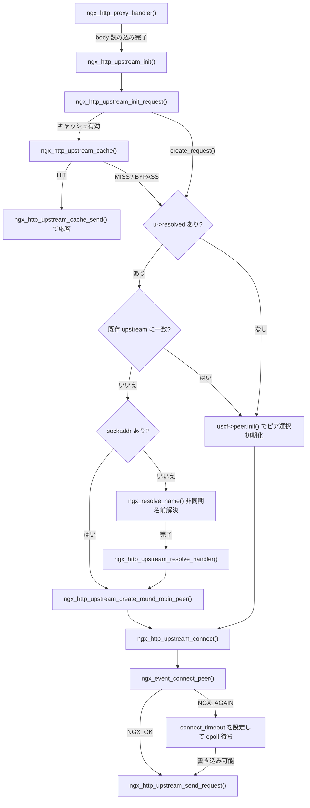
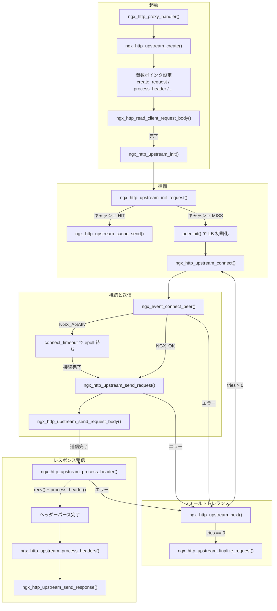

# 第13章 upstream 機構

> **本章で読むソース**
>
> - [`src/http/ngx_http_upstream.h`](https://github.com/nginx/nginx/blob/release-1.31.2/src/http/ngx_http_upstream.h)
> - [`src/http/ngx_http_upstream.c`](https://github.com/nginx/nginx/blob/release-1.31.2/src/http/ngx_http_upstream.c)
> - [`src/http/modules/ngx_http_proxy_module.c`](https://github.com/nginx/nginx/blob/release-1.31.2/src/http/modules/ngx_http_proxy_module.c)

## この章の狙い

nginx のリバースプロキシ機能は、クライアントからのリクエストを別サーバー（**upstream**）へ転送し、その応答をクライアントへ返す一連の機構の上に成り立っている。
本章は `ngx_http_upstream.c` と `ngx_http_upstream.h` を中心に、upstream 処理の全体像を追う。
`ngx_http_upstream_t` 構造体が持つフィールド群、`proxy_pass` ディレクティブが `ngx_http_proxy_handler()` からどのように upstream を起動するか、接続の確立からリクエスト送信、レスポンスヘッダーの受信、そして `ngx_http_upstream_next()` による次のサーバーへの切り替えまでを読む。
個別のプロトコル処理（HTTP ヘッダーの組み立てやパース）は proxy モジュール側の責務であり、本章では upstream 機構が提供する共通の骨格に集中する。

## 前提

第9章の HTTP リクエスト受理（`ngx_http_request_t` の生成とパース完了までの流れ）、第10章のフェーズエンジン（content ハンドラが呼ばれるタイミング）、第11章のフィルタチェーンと output chain（`ngx_output_chain()` と `ngx_chain_t`）を前提とする。
第8章の接続管理（`ngx_connection_t`、`ngx_event_connect_peer()`）も参照する。

## `ngx_http_upstream_t`：upstream 処理の本体

upstream 処理の中心となる構造体は `ngx_http_upstream_t` である。
`ngx_http_request_t` の `upstream` フィールドに置かれ、接続の選択からレスポンスの転送まで、1件の upstream 処理に必要なすべての状態を持つ。

[`src/http/ngx_http_upstream.h` L337-L421](https://github.com/nginx/nginx/blob/release-1.31.2/src/http/ngx_http_upstream.h#L337-L421)

```c
struct ngx_http_upstream_s {
    ngx_http_upstream_handler_pt     read_event_handler;
    ngx_http_upstream_handler_pt     write_event_handler;

    ngx_peer_connection_t            peer;

    ngx_event_pipe_t                *pipe;

    ngx_chain_t                     *request_bufs;

    ngx_output_chain_ctx_t           output;
    ngx_chain_writer_ctx_t           writer;

    ngx_http_upstream_conf_t        *conf;
    ngx_http_upstream_srv_conf_t    *upstream;
#if (NGX_HTTP_CACHE)
    ngx_array_t                     *caches;
#endif

    ngx_http_upstream_headers_in_t   headers_in;

    ngx_http_upstream_resolved_t    *resolved;

    ngx_buf_t                        from_client;

    ngx_buf_t                        buffer;
    off_t                            length;
    off_t                            early_hints_length;

    ngx_chain_t                     *out_bufs;
    ngx_chain_t                     *busy_bufs;
    ngx_chain_t                     *free_bufs;

    ngx_int_t                      (*input_filter_init)(void *data);
    ngx_int_t                      (*input_filter)(void *data, ssize_t bytes);
    void                            *input_filter_ctx;

    // ... (中略) ...

    ngx_int_t                      (*create_request)(ngx_http_request_t *r);
    ngx_int_t                      (*reinit_request)(ngx_http_request_t *r);
    ngx_int_t                      (*process_header)(ngx_http_request_t *r);
    void                           (*abort_request)(ngx_http_request_t *r);
    void                           (*finalize_request)(ngx_http_request_t *r,
                                         ngx_int_t rc);
    ngx_int_t                      (*rewrite_redirect)(ngx_http_request_t *r,
                                         ngx_table_elt_t *h, size_t prefix);
    ngx_int_t                      (*rewrite_cookie)(ngx_http_request_t *r,
                                         ngx_table_elt_t *h);

    ngx_msec_t                       start_time;

    ngx_http_upstream_state_t       *state;

    ngx_str_t                        method;
    ngx_str_t                        schema;
    ngx_str_t                        uri;

    // ... (中略) ...

    unsigned                         store:1;
    unsigned                         cacheable:1;
    unsigned                         accel:1;
    unsigned                         ssl:1;

    unsigned                         buffering:1;
    unsigned                         keepalive:1;
    unsigned                         upgrade:1;
    unsigned                         error:1;

    unsigned                         request_sent:1;
    unsigned                         request_body_sent:1;
    unsigned                         request_body_blocked:1;
    unsigned                         header_sent:1;
    unsigned                         response_received:1;
};
```

構造体は大きく3つの役割に分かれる。

1つ目は **upstream 接続の管理**である。
`peer` は `ngx_peer_connection_t` であり、選択されたサーバーのアドレスや接続状態、残りの試行回数（`tries`）を持つ。
`read_event_handler` と `write_event_handler` は upstream 接続のイベントで呼ばれるハンドラであり、処理の段階に応じて付け替えられる。

2つ目は **プロトコル固有の処理を委譲する関数ポインタ群**である。
`create_request` は upstream へ送るリクエストを組み立て、`process_header` は upstream からのレスポンスの最初のバイト列を解釈する。
これらの実装は proxy、fastcgi、uwsgi などの各モジュールが提供する。
upstream 機構自体はプロトコルを知らず、関数ポインタ経由で委譲することで、複数のプロトコルに共通の接続管理とフォールトトレランスの枠組みを提供している。

3つ目は **レスポンスの転送制御**である。
`buffering` フラグでバッファリングの有無を切り替え、`pipe` は `ngx_event_pipe_t` 構造体としてバッファリング付きの転送を担う。
`out_bufs`、`busy_bufs`、`free_bufs` の3本のチェーンは、upstream から読んだデータの出力待ち・送出中・空きという状態別のバッファ管理に使われる。

## upstream 処理の起動：`ngx_http_proxy_handler()` から `ngx_http_upstream_init()` まで

`proxy_pass` ディレクティブは content ハンドラとして `ngx_http_proxy_handler()` を登録する。
この関数はまず `ngx_http_upstream_create()` で `ngx_http_upstream_t` を確保し、プロトコル固有の関数ポインタを埋める。

[`src/http/modules/ngx_http_proxy_module.c` L922-L928](https://github.com/nginx/nginx/blob/release-1.31.2/src/http/modules/ngx_http_proxy_module.c#L922-L928)

```c
    u->create_request = ngx_http_proxy_create_request;
    u->reinit_request = ngx_http_proxy_reinit_request;
    u->process_header = ngx_http_proxy_process_status_line;
    u->abort_request = ngx_http_proxy_abort_request;
    u->finalize_request = ngx_http_proxy_finalize_request;
    r->state = 0;
```

`process_header` の初期値が `ngx_http_proxy_process_status_line` である点に注意する。
upstream からの応答は HTTP ステータスラインから始まるため、最初の1回だけはステータスライン用のパーサが呼ばれ、そこでバージョンとステータスコードを取り出したあとで `ngx_http_proxy_process_header` に切り替わってヘッダー行のパースに入る。
このように `process_header` を段階的に付け替える構造は、パーサの状態機械を1つのバッファ上で中断・再開する nginx の方針と合致している。

続けて `pipe` の確保と `input_filter` の設定を行い、クライアントのリクエストボディを読み込んでから `ngx_http_upstream_init()` を呼び出す。

[`src/http/modules/ngx_http_proxy_module.c` L962](https://github.com/nginx/nginx/blob/release-1.31.2/src/http/modules/ngx_http_proxy_module.c#L962)

```c
    rc = ngx_http_read_client_request_body(r, ngx_http_upstream_init);
```

`ngx_http_read_client_request_body()` はボディの読み込みが完了すると（あるいはボディが存在しない場合は直ちに）第2引数のポストハンドラを呼ぶ。
ここで `ngx_http_upstream_init()` が upstream 処理の本体を開始する。

## `ngx_http_upstream_init_request()`：サーバーの選択と接続準備

`ngx_http_upstream_init()` はクライアントの読み込みタイムアウトを削除し、`ngx_http_upstream_init_request()` を呼ぶ。

[`src/http/ngx_http_upstream.c` L536-L577](https://github.com/nginx/nginx/blob/release-1.31.2/src/http/ngx_http_upstream.c#L536-L577)

```c
void
ngx_http_upstream_init(ngx_http_request_t *r)
{
    ngx_connection_t     *c;

    c = r->connection;

    ngx_log_debug1(NGX_LOG_DEBUG_HTTP, c->log, 0,
                   "http init upstream, client timer: %d", c->read->timer_set);

    // ... (中略) ...

    if (c->read->timer_set) {
        ngx_del_timer(c->read);
    }

    // ... (中略) ...

    ngx_http_upstream_init_request(r);
}
```

`ngx_http_upstream_init_request()` は以下の順で処理を進める。

1. キャッシュの確認（`ngx_http_upstream_cache()` により、キャッシュヒットなら upstream へ接続せずに応答を返す）
2. クライアント接続の監視設定（`ngx_http_upstream_rd_check_broken_connection()` 等を `read_event_handler`、`write_event_handler` に設定し、クライアントが接続を切ったことを検知できるようにする）
3. `u->create_request(r)` を呼んで upstream へのリクエストバッファ列を作成
4. `ngx_http_upstream_state_t` を `r->upstream_states` 配列に確保（タイミング計測用）
5. クリーンアップハンドラ（`ngx_http_upstream_cleanup()`）を登録
6. upstream サーバーの選択（`uscf->peer.init()` を呼んでロードバランシングを初期化）
7. `ngx_http_upstream_connect()` で接続を開始

サーバーの選択経路は3つに分かれる。
`u->resolved` が NULL でない場合、つまり `proxy_pass` の引数に変数を含む場合は、さらに3つの経路に分かれる。
まず、既存の upstream 定義に host/port が一致する場合、`goto found` で `uscf->peer.init(r, uscf)` を呼び、ロードバランシングモジュールの初期化関数を実行してから接続に移る。
次に、`u->resolved->sockaddr` が設定済みの場合、`ngx_http_upstream_create_round_robin_peer()` によりラウンドロビンのピアリストを作り、resolver を経由せず直接 `ngx_http_upstream_connect()` に進む。
最後に、いずれにも該当しない場合、`ngx_resolve_name()` による非同期の名前解決を経由する。
名前解決完了後に `ngx_http_upstream_resolve_handler()` が呼ばれ、そこで `ngx_http_upstream_create_round_robin_peer()` によりラウンドロビンのピアリストが作られてから接続に移る。
`u->resolved` が NULL の場合、つまり `upstream` ブロックで定義済みの名前の場合は、`uscf->peer.init(r, uscf)` を呼んでロードバランシングモジュールの初期化関数を実行する。
デフォルトのラウンドロビンでは `ngx_http_upstream_init_round_robin_peer()` が呼ばれる（第14章で詳しく読む）。



## `ngx_http_upstream_connect()`：接続の確立とハンドラの設定

`ngx_http_upstream_connect()` は upstream 処理の接続段階を担う。

[`src/http/ngx_http_upstream.c` L1556-L1729](https://github.com/nginx/nginx/blob/release-1.31.2/src/http/ngx_http_upstream.c#L1556-L1729)

```c
static void
ngx_http_upstream_connect(ngx_http_request_t *r, ngx_http_upstream_t *u)
{
    ngx_int_t                  rc;
    ngx_connection_t          *c;
    ngx_http_core_loc_conf_t  *clcf;

    r->connection->log->action = "connecting to upstream";

    // ... (中略) ...

    u->start_time = ngx_current_msec;

    u->state->response_time = (ngx_msec_t) -1;
    u->state->connect_time = (ngx_msec_t) -1;
    u->state->header_time = (ngx_msec_t) -1;

    rc = ngx_event_connect_peer(&u->peer);

    // ... (中略) ...

    c = u->peer.connection;

    c->requests++;

    c->data = r;

    c->write->handler = ngx_http_upstream_handler;
    c->read->handler = ngx_http_upstream_handler;

    u->write_event_handler = ngx_http_upstream_send_request_handler;
    u->read_event_handler = ngx_http_upstream_process_header;

    // ... (中略) ...

    if (rc == NGX_AGAIN) {
        ngx_add_timer(c->write, u->conf->connect_timeout);
        return;
    }

    // ... (中略) ...

    ngx_http_upstream_send_request(r, u, 1);
}
```

`ngx_event_connect_peer()` は第8章で見た関数であり、非ブロッキングの `connect()` を発行する。
`NGX_AGAIN` が返った場合は `connect_timeout` のタイマーを設定してイベントループに制御を返す。
接続が即座に確立した場合（`NGX_OK`）はそのまま `ngx_http_upstream_send_request()` へ進む。

接続の `c->data` にはリクエスト構造体 `r` が設定される。
upstream 接続のイベントハンドラ `ngx_http_upstream_handler()` は、`c->data` から `r` を取り出し、`u->read_event_handler` または `u->write_event_handler` を呼び出す中継役である。

[`src/http/ngx_http_upstream.c` L1301-L1332](https://github.com/nginx/nginx/blob/release-1.31.2/src/http/ngx_http_upstream.c#L1301-L1332)

```c
static void
ngx_http_upstream_handler(ngx_event_t *ev)
{
    ngx_connection_t     *c;
    ngx_http_request_t   *r;
    ngx_http_upstream_t  *u;

    c = ev->data;
    r = c->data;

    u = r->upstream;
    c = r->connection;

    ngx_http_set_log_request(c->log, r);

    ngx_log_debug2(NGX_LOG_DEBUG_HTTP, c->log, 0,
                   "http upstream request: \"%V?%V\"", &r->uri, &r->args);

    if (ev->delayed && ev->timedout) {
        ev->delayed = 0;
        ev->timedout = 0;
    }

    if (ev->write) {
        u->write_event_handler(r, u);

    } else {
        u->read_event_handler(r, u);
    }

    ngx_http_run_posted_requests(c);
}
```

upstream 接続のイベントとクライアント接続のイベントは別の `ngx_connection_t` で処理されるが、`ngx_http_upstream_handler()` が両者を橋渡しする。
`ngx_http_run_posted_requests()` を呼ぶのは、イベント処理中にサブリクエストの発行やリクエストのファイナライズが posted キューに積まれる可能性があるためである。

## リクエストの送信とレスポンスヘッダーの受信

`ngx_http_upstream_send_request()` は `ngx_http_upstream_send_request_body()` を介して `u->request_bufs` を upstream 接続へ書き出す。

[`src/http/ngx_http_upstream.c` L2147-L2262](https://github.com/nginx/nginx/blob/release-1.31.2/src/http/ngx_http_upstream.c#L2147-L2262)

```c
static void
ngx_http_upstream_send_request(ngx_http_request_t *r, ngx_http_upstream_t *u,
    ngx_uint_t do_write)
{
    ngx_int_t          rc;
    ngx_connection_t  *c;

    c = u->peer.connection;

    // ... (中略) ...

    if (u->state->connect_time == (ngx_msec_t) -1) {
        u->state->connect_time = ngx_current_msec - u->start_time;
    }

    if (!u->request_sent && ngx_http_upstream_test_connect(c) != NGX_OK) {
        ngx_http_upstream_next(r, u, NGX_HTTP_UPSTREAM_FT_ERROR);
        return;
    }

    c->log->action = "sending request to upstream";

    rc = ngx_http_upstream_send_request_body(r, u, do_write);

    // ... (中略) ...

    /* rc == NGX_OK */

    if (c->write->timer_set) {
        ngx_del_timer(c->write);
    }

    // ... (中略) ...

    if (!u->request_body_sent) {
        u->request_body_sent = 1;

        if (u->header_sent) {
            return;
        }

        if (u->conf->ignore_input) {
            ngx_http_upstream_process_header(r, u);
            return;
        }

        ngx_add_timer(c->read, u->conf->read_timeout);

        if (c->read->ready) {
            ngx_http_upstream_process_header(r, u);
            return;
        }
    }
}
```

リクエストの送信が完了すると、`read_timeout` のタイマーを設定して `ngx_http_upstream_process_header()` に進む。
`ngx_http_upstream_test_connect()` は `getsockopt(SO_ERROR)` で接続の成否を確認する関数であり、`connect()` の非同期完了後にエラーが潜んでいないかを検査する。

`ngx_http_upstream_process_header()` は upstream からの応答を読み込みながら `u->process_header()` を呼ぶループである。

[`src/http/ngx_http_upstream.c` L2444-L2630](https://github.com/nginx/nginx/blob/release-1.31.2/src/http/ngx_http_upstream.c#L2444-L2630)

```c
static void
ngx_http_upstream_process_header(ngx_http_request_t *r, ngx_http_upstream_t *u)
{
    ssize_t            n;
    ngx_int_t          rc;
    ngx_connection_t  *c;

    c = u->peer.connection;

    // ... (中略) ...

    if (u->buffer.start == NULL) {
        u->buffer.start = ngx_palloc(r->pool, u->conf->buffer_size);
        if (u->buffer.start == NULL) {
            ngx_http_upstream_finalize_request(r, u,
                                               NGX_HTTP_INTERNAL_SERVER_ERROR);
            return;
        }

        u->buffer.pos = u->buffer.start;
        u->buffer.last = u->buffer.start;
        u->buffer.end = u->buffer.start + u->conf->buffer_size;
        u->buffer.temporary = 1;

        u->buffer.tag = u->output.tag;

        // ... (中略) ...
    }

    for ( ;; ) {

        n = c->recv(c, u->buffer.last, u->buffer.end - u->buffer.last);

        if (n == NGX_AGAIN) {
            // ... (中略) ...
            return;
        }

        if (n == 0) {
            ngx_log_error(NGX_LOG_ERR, c->log, 0,
                          "upstream prematurely closed connection");
        }

        if (n == NGX_ERROR || n == 0) {
            ngx_http_upstream_next(r, u, NGX_HTTP_UPSTREAM_FT_ERROR);
            return;
        }

        u->state->bytes_received += n;

        u->buffer.last += n;

        u->response_received = 1;

again:

        rc = u->process_header(r);

        if (rc == NGX_AGAIN) {

            if (u->buffer.last == u->buffer.end) {
                ngx_log_error(NGX_LOG_ERR, c->log, 0,
                              "upstream sent too big header");

                ngx_http_upstream_next(r, u,
                                       NGX_HTTP_UPSTREAM_FT_INVALID_HEADER);
                return;
            }

            continue;
        }

        // ... (中略) ...

        break;
    }

    // ... (中略) ...

    /* rc == NGX_OK */

    u->state->header_time = ngx_current_msec - u->start_time;

    if (u->headers_in.status_n >= NGX_HTTP_SPECIAL_RESPONSE) {

        if (ngx_http_upstream_test_next(r, u) == NGX_OK) {
            return;
        }

        if (ngx_http_upstream_intercept_errors(r, u) == NGX_OK) {
            return;
        }
    }

    // ... (中略) ...

    if (ngx_http_upstream_process_headers(r, u) != NGX_OK) {
        return;
    }

    ngx_http_upstream_send_response(r, u);
}
```

バッファの大きさは `proxy_buffer_size`（`u->conf->buffer_size`）で決まり、デフォルトはページサイズ（4KB または 8KB）である。
`process_header()` が `NGX_AGAIN` を返す間は、バッファが満杯になるまで「読む、パースする」を繰り返す。
バッファが満杯になってもパースが終わらなければ「upstream sent too big header」として `NGX_HTTP_UPSTREAM_FT_INVALID_HEADER` で次のサーバーへの切り替えを試みる。
パースが成功（`NGX_OK`）すると、`ngx_http_upstream_process_headers()` が upstream のヘッダーをクライアント応答の `r->headers_out` へコピーし、`ngx_http_upstream_send_response()` でレスポンスボディの転送に入る。

## `ngx_http_upstream_next()`：次のサーバーへの切り替え

upstream の接続や応答に問題が起きたとき、`ngx_http_upstream_next()` がフォールトトレランスの中心となる。

[`src/http/ngx_http_upstream.c` L4584-L4739](https://github.com/nginx/nginx/blob/release-1.31.2/src/http/ngx_http_upstream.c#L4584-L4739)

```c
static void
ngx_http_upstream_next(ngx_http_request_t *r, ngx_http_upstream_t *u,
    ngx_uint_t ft_type)
{
    ngx_msec_t  timeout;
    ngx_uint_t  status, state;

    ngx_log_debug1(NGX_LOG_DEBUG_HTTP, r->connection->log, 0,
                   "http next upstream, %xi", ft_type);

    if (u->peer.sockaddr) {

        if (u->peer.connection) {
            u->state->bytes_sent = u->peer.connection->sent;
        }

        if (ft_type == NGX_HTTP_UPSTREAM_FT_HTTP_403
            || ft_type == NGX_HTTP_UPSTREAM_FT_HTTP_404)
        {
            state = NGX_PEER_NEXT;

        } else {
            state = NGX_PEER_FAILED;
        }

        u->peer.free(&u->peer, u->peer.data, state);
        u->peer.sockaddr = NULL;

        // ... (中略) ...
    }

    // ... (中略) ...

    if (u->peer.tries == 0
        || ((u->conf->next_upstream & ft_type) != ft_type)
        || (u->request_sent && r->request_body_no_buffering)
        || (timeout && ngx_current_msec - u->peer.start_time >= timeout))
    {
        // ... (中略) ...
        ngx_http_upstream_finalize_request(r, u, status);
        return;
    }

    if (u->peer.connection) {
        // ... (中略) ...
        if (u->peer.connection->pool) {
            ngx_destroy_pool(u->peer.connection->pool);
        }

        ngx_close_connection(u->peer.connection);
        u->peer.connection = NULL;
    }

    ngx_http_upstream_connect(r, u);
}
```

処理は以下の順で進む。

1. 現在のピアを `u->peer.free()` で解放する。
   403 と 404 は `NGX_PEER_NEXT`（単なるスキップ）、それ以外は `NGX_PEER_FAILED`（失敗として記録）で解放する。
2. 試行回数が尽きた、`next_upstream` の設定に該当しない、タイムアウトを超えた、のいずれかなら、ここで終了する。
3. いずれでもない場合は、現在の接続を閉じて `ngx_http_upstream_connect()` を呼び、次のピアへの接続を開始する。

`next_upstream` ディレクティブで指定できる条件はビットマスクで管理されている。

[`src/http/ngx_http_upstream.h` L20-L35](https://github.com/nginx/nginx/blob/release-1.31.2/src/http/ngx_http_upstream.h#L20-L35)

```c
#define NGX_HTTP_UPSTREAM_FT_ERROR           0x00000002
#define NGX_HTTP_UPSTREAM_FT_TIMEOUT         0x00000004
#define NGX_HTTP_UPSTREAM_FT_INVALID_HEADER  0x00000008
#define NGX_HTTP_UPSTREAM_FT_HTTP_500        0x00000010
#define NGX_HTTP_UPSTREAM_FT_HTTP_502        0x00000020
#define NGX_HTTP_UPSTREAM_FT_HTTP_503        0x00000040
#define NGX_HTTP_UPSTREAM_FT_HTTP_504        0x00000080
#define NGX_HTTP_UPSTREAM_FT_HTTP_403        0x00000100
#define NGX_HTTP_UPSTREAM_FT_HTTP_404        0x00000200
#define NGX_HTTP_UPSTREAM_FT_HTTP_429        0x00000400
#define NGX_HTTP_UPSTREAM_FT_UPDATING        0x00000800
#define NGX_HTTP_UPSTREAM_FT_BUSY_LOCK       0x00001000
#define NGX_HTTP_UPSTREAM_FT_MAX_WAITING     0x00002000
#define NGX_HTTP_UPSTREAM_FT_NON_IDEMPOTENT  0x00004000
#define NGX_HTTP_UPSTREAM_FT_NOLIVE          0x40000000
#define NGX_HTTP_UPSTREAM_FT_OFF             0x80000000
```

デフォルトは `error | timeout` であり、接続エラーとタイムアウトだけが次のサーバーへの切り替えを引き起こす。
`next_upstream http_500 http_502 http_503 http_504;` のように設定すれば、特定のステータスコードでも切り替えが発生する。

非冪等なリクエスト（POST、LOCK、PATCH）に対する配慮もある。

[`src/http/ngx_http_upstream.c` L4673-L4677](https://github.com/nginx/nginx/blob/release-1.31.2/src/http/ngx_http_upstream.c#L4673-L4677)

```c
    if (u->request_sent
        && (r->method & (NGX_HTTP_POST|NGX_HTTP_LOCK|NGX_HTTP_PATCH)))
    {
        ft_type |= NGX_HTTP_UPSTREAM_FT_NON_IDEMPOTENT;
    }
```

リクエスト送信後に失敗した非冪等リクエストを自動的にリトライすると、upstream で二重に副作用が発生する可能性がある。
`NGX_HTTP_UPSTREAM_FT_NON_IDEMPOTENT` を `ft_type` に重ねることで、`next_upstream` の設定に明示的に `non_idempotent` が含まれていない限り、リトライを抑制する。

## upstream 処理の全体フロー

本章で読んだ処理を1つの図にまとめる。



## まとめ

- `ngx_http_upstream_t` は upstream 処理の全状態を持ち、プロトコル固有の処理は関数ポインタで各モジュールに委譲する。
- `proxy_pass` の content ハンドラは `ngx_http_proxy_handler()` であり、upstream 構造体を確保して関数ポインタを埋め、ボディ読み込み後に `ngx_http_upstream_init()` を起動する。
- `ngx_http_upstream_init_request()` はキャッシュの確認、リクエストバッファの作成、ピア選択の初期化を経て `ngx_http_upstream_connect()` に至る。
- `ngx_http_upstream_connect()` は `ngx_event_connect_peer()` で接続し、成功すれば `ngx_http_upstream_send_request()` でリクエストを送信する。
- `ngx_http_upstream_process_header()` は upstream から読みながら `process_header()` を呼び、ヘッダーのパースに成功すると `ngx_http_upstream_send_response()` でボディの転送に入る。
- `ngx_http_upstream_next()` はエラーや設定されたステータスコードに応じて次のピアへ接続し直すフォールトトレランスの機構であり、非冪等リクエストのリトライは既定で抑制される。

## 関連する章

- [第9章 HTTP リクエストの受理とパース](../part03-http/09-http-request-parsing.md)
- [第10章 フェーズエンジンと location 検索](../part03-http/10-phase-engine-and-location.md)
- [第11章 フィルタチェーンと output chain](../part03-http/11-filter-chain-and-output-chain.md)
- [第14章 ロードバランシング](14-load-balancing.md)
- [第15章 proxy のバッファリングとキャッシュ](15-proxy-buffering-and-cache.md)
