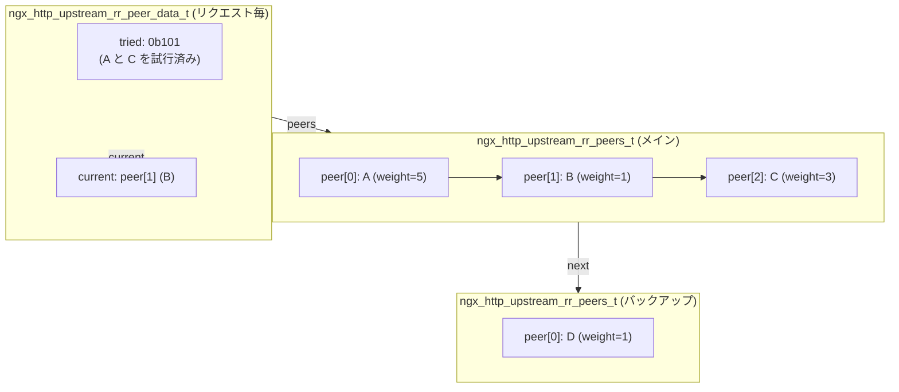

# 第14章 ロードバランシング

> **本章で読むソース**
>
> - [`src/http/ngx_http_upstream_round_robin.h`](https://github.com/nginx/nginx/blob/release-1.31.2/src/http/ngx_http_upstream_round_robin.h)
> - [`src/http/ngx_http_upstream_round_robin.c`](https://github.com/nginx/nginx/blob/release-1.31.2/src/http/ngx_http_upstream_round_robin.c)
> - [`src/http/ngx_http_upstream.h`](https://github.com/nginx/nginx/blob/release-1.31.2/src/http/ngx_http_upstream.h)
> - [`src/http/ngx_http_upstream.c`](https://github.com/nginx/nginx/blob/release-1.31.2/src/http/ngx_http_upstream.c)

## この章の狙い

`upstream` ブロックに複数の `server` ディレクティブを並べると、nginx はリクエストをそれらのサーバーに分散する。
本章は、この**ロードバランシング**のデフォルト実装である**ラウンドロビン**を `ngx_http_upstream_round_robin.c` から読み解く。
設定パース時に `ngx_http_upstream_rr_peers_t` と `ngx_http_upstream_rr_peer_t` のリンクリストがどう構築されるか、リクエストごとに `ngx_http_upstream_get_round_robin_peer()` がどうピアを選択するか、失敗したピアをどう記録して次回以降の選択に反映するかを追う。
重み付きラウンドロビンのアルゴリズム、バックアップサーバーへのフェールオーバー、接続数制限による選択除外、そしてビットマスクによる既試行ピアの管理が本章の主題である。

## 前提

第13章の upstream 機構（`ngx_http_upstream_t`、`ngx_http_upstream_connect()`、`ngx_http_upstream_next()`）を前提とする。
第3章のメモリプール（`ngx_pcalloc()`、`ngx_palloc()`）、第4章のデータ構造（リンクリスト）も参照する。

## ピアリストの構築：`ngx_http_upstream_init_round_robin()`

`upstream` ブロックの設定パースが完了すると、`ngx_http_upstream_init_round_robin()` が呼ばれる。
この関数は、`upstream` ブロック内の `server` ディレクティブで指定されたサーバー一覧から、ラウンドロビン用のピアリストを構築する。

[`src/http/ngx_http_upstream_round_robin.c` L36-L161](https://github.com/nginx/nginx/blob/release-1.31.2/src/http/ngx_http_upstream_round_robin.c#L36-L161)

```c
ngx_int_t
ngx_http_upstream_init_round_robin(ngx_conf_t *cf,
    ngx_http_upstream_srv_conf_t *us)
{
    ngx_url_t                      u;
    ngx_uint_t                     i, j, n, r, w, t;
    ngx_http_upstream_server_t    *server;
    ngx_http_upstream_rr_peer_t   *peer, **peerp;
    ngx_http_upstream_rr_peers_t  *peers, *backup;

    us->peer.init = ngx_http_upstream_init_round_robin_peer;

    if (us->servers) {
        server = us->servers->elts;

        n = 0;
        r = 0;
        w = 0;
        t = 0;

        for (i = 0; i < us->servers->nelts; i++) {

            if (server[i].backup) {
                continue;
            }

            n += server[i].naddrs;
            w += server[i].naddrs * server[i].weight;

            if (!server[i].down) {
                t += server[i].naddrs;
            }
        }

        // ... (中略) ...

        peers = ngx_pcalloc(cf->pool, sizeof(ngx_http_upstream_rr_peers_t));
        if (peers == NULL) {
            return NGX_ERROR;
        }

        peer = ngx_pcalloc(cf->pool, sizeof(ngx_http_upstream_rr_peer_t)
                                     * (n + r));
        if (peer == NULL) {
            return NGX_ERROR;
        }

        peers->single = (n == 1);
        peers->number = n;
        peers->weighted = (w != n);
        peers->total_weight = w;
        peers->tries = t;
        peers->name = &us->host;
```

まず `backup` でないサーバーについて、アドレス数 `n`、重みの合計 `w`、利用可能なサーバー数 `t` を集計する。
`naddrs` は1つの `server` ディレクティブが名前解決で複数のアドレスを持つ場合に2以上になる。
次に `ngx_http_upstream_rr_peers_t` を1つ、`ngx_http_upstream_rr_peer_t` を `n` 個ぶん確保する。

`ngx_http_upstream_rr_peers_t` はピア集団のメタ情報を持つ。

[`src/http/ngx_http_upstream_round_robin.h` L108-L130](https://github.com/nginx/nginx/blob/release-1.31.2/src/http/ngx_http_upstream_round_robin.h#L108-L130)

```c
struct ngx_http_upstream_rr_peers_s {
    ngx_uint_t                      number;

    // ... (中略) ...

    ngx_uint_t                      total_weight;
    ngx_uint_t                      tries;

    unsigned                        single:1;
    unsigned                        weighted:1;

    ngx_str_t                      *name;

    ngx_http_upstream_rr_peers_t   *next;

    ngx_http_upstream_rr_peer_t    *peer;
};
```

`single` はピアが1つだけのとき立つフラグで、選択の最適化に効く。
`weighted` は重みの合計がアドレス数と異なる（つまりデフォルトの1以外が指定されている）ときに立つ。
`tries` はこの集団で試行できる最大回数であり、`down` でないサーバーのアドレス数の合計である。
`next` はバックアップサーバー集団へのポインタである。

`ngx_http_upstream_rr_peer_t` は個別のサーバーを表す。

[`src/http/ngx_http_upstream_round_robin.h` L47-L105](https://github.com/nginx/nginx/blob/release-1.31.2/src/http/ngx_http_upstream_round_robin.h#L47-L105)

```c
struct ngx_http_upstream_rr_peer_s {
    struct sockaddr                *sockaddr;
    socklen_t                       socklen;
    ngx_str_t                       name;
    ngx_str_t                       server;

    ngx_int_t                       current_weight;
    ngx_int_t                       effective_weight;
    ngx_int_t                       weight;

    ngx_uint_t                      conns;
    ngx_uint_t                      max_conns;

    ngx_uint_t                      fails;
    time_t                          accessed;
    time_t                          checked;

    ngx_uint_t                      max_fails;
    time_t                          fail_timeout;
    ngx_msec_t                      slow_start;
    ngx_msec_t                      start_time;

    ngx_uint_t                      down;

    // ... (中略) ...

    ngx_http_upstream_rr_peer_t    *next;

    // ... (中略) ...
};
```

重みに関連するフィールドが3つある。
`weight` は設定ファイルで指定された不変の重み、`effective_weight` は失敗に応じて減衰し回復する動的な重み、`current_weight` は各選択ラウンドで累積する現在値である。
`conns` は現在このピアに対して確立中の接続数、`max_conns` はその上限である。
`fails` は連続失敗回数、`max_fails` は選択除外の閾値、`fail_timeout` は選択除外の期間（秒）である。

各ピアの初期化は、設定で指定された値をそのまま写すだけである。

[`src/http/ngx_http_upstream_round_robin.c` L215-L239](https://github.com/nginx/nginx/blob/release-1.31.2/src/http/ngx_http_upstream_round_robin.c#L215-L239)

```c
            for (j = 0; j < server[i].naddrs; j++) {
                peer[n].sockaddr = server[i].addrs[j].sockaddr;
                peer[n].socklen = server[i].addrs[j].socklen;
                peer[n].name = server[i].addrs[j].name;
                peer[n].weight = server[i].weight;
                peer[n].effective_weight = server[i].weight;
                peer[n].current_weight = 0;
                peer[n].max_conns = server[i].max_conns;
                peer[n].max_fails = server[i].max_fails;
                peer[n].fail_timeout = server[i].fail_timeout;
                peer[n].down = server[i].down;
                peer[n].server = server[i].name;

                // ... (中略) ...

                *peerp = &peer[n];
                peerp = &peer[n].next;
                n++;
            }
```

ピアは `next` ポインタでつながれた**片方向リンクリスト**を形成する。
配列ではなくリンクリストを使うのは、バックアップサーバーの追加や、共有メモリ上の動的なサーバー追加・削除（`zone` ディレクティブ）に対応しやすくするためである。

バックアップサーバーの処理は、メインのピアリストの構築後に同じ手順で繰り返される。

[`src/http/ngx_http_upstream_round_robin.c` L283-L384](https://github.com/nginx/nginx/blob/release-1.31.2/src/http/ngx_http_upstream_round_robin.c#L283-L384)

```c
        backup = ngx_pcalloc(cf->pool, sizeof(ngx_http_upstream_rr_peers_t));
        if (backup == NULL) {
            return NGX_ERROR;
        }

        // ... (中略) ...

        backup->single = 0;
        backup->number = n;
        backup->weighted = (w != n);
        backup->total_weight = w;
        backup->tries = t;
        backup->name = &us->host;

        // ... (中略) ...

        peers->next = backup;
```

バックアップ集団は `peers->next` でメイン集団に接続される。
メインのピアがすべて選択不能になったときだけ、バックアップが使われる。

## リクエストごとの初期化：`ngx_http_upstream_init_round_robin_peer()`

リクエストが upstream に到達すると、`ngx_http_upstream_init_round_robin_peer()` が呼ばれる。
この関数はリクエストごとに、選択状態を管理する `ngx_http_upstream_rr_peer_data_t` を確保する。

[`src/http/ngx_http_upstream_round_robin.c` L514-L574](https://github.com/nginx/nginx/blob/release-1.31.2/src/http/ngx_http_upstream_round_robin.c#L514-L574)

```c
ngx_int_t
ngx_http_upstream_init_round_robin_peer(ngx_http_request_t *r,
    ngx_http_upstream_srv_conf_t *us)
{
    ngx_uint_t                         n;
    ngx_http_upstream_rr_peer_data_t  *rrp;

    rrp = r->upstream->peer.data;

    if (rrp == NULL) {
        rrp = ngx_palloc(r->pool, sizeof(ngx_http_upstream_rr_peer_data_t));
        if (rrp == NULL) {
            return NGX_ERROR;
        }

        r->upstream->peer.data = rrp;
    }

    rrp->peers = us->peer.data;
    rrp->current = NULL;

    // ... (中略) ...

    n = rrp->peers->number;

    if (rrp->peers->next && rrp->peers->next->number > n) {
        n = rrp->peers->next->number;
    }

    r->upstream->peer.tries = ngx_http_upstream_tries(rrp->peers);

    // ... (中略) ...

    if (n <= 8 * sizeof(uintptr_t)) {
        rrp->tried = &rrp->data;
        rrp->data = 0;

    } else {
        n = (n + (8 * sizeof(uintptr_t) - 1)) / (8 * sizeof(uintptr_t));

        rrp->tried = ngx_pcalloc(r->pool, n * sizeof(uintptr_t));
        if (rrp->tried == NULL) {
            return NGX_ERROR;
        }
    }

    r->upstream->peer.get = ngx_http_upstream_get_round_robin_peer;
    r->upstream->peer.free = ngx_http_upstream_free_round_robin_peer;

    return NGX_OK;
}
```

`ngx_http_upstream_rr_peer_data_t` の定義は次のとおりである。

[`src/http/ngx_http_upstream_round_robin.h` L241-L247](https://github.com/nginx/nginx/blob/release-1.31.2/src/http/ngx_http_upstream_round_robin.h#L241-L247)

```c
typedef struct {
    ngx_uint_t                      config;
    ngx_http_upstream_rr_peers_t   *peers;
    ngx_http_upstream_rr_peer_t    *current;
    uintptr_t                      *tried;
    uintptr_t                       data;
} ngx_http_upstream_rr_peer_data_t;
```

`tried` は**ビットマスク**であり、すでに試行したピアを記録する。
ピア数が `8 * sizeof(uintptr_t)`（64ビット環境では64）以下なら `data` フィールドを直接使い、配列確保を避ける。
これがこの章の最初の最適化である。
ほとんどの upstream ブロックは数個から十数個のサーバーしか持たないため、配列確保のオーバーヘッドを完全に除去できる。
ビットマスクの各ビットはピアの添字に対応し、1が立っていれば「このピアはすでに試行済み」を意味する。

`peer.get` と `peer.free` に関数ポインタを設定することで、`ngx_http_upstream_connect()` と `ngx_http_upstream_next()` から共通のインターフェースでピアの選択と解放を呼び出せるようにする。

## ピアの選択：`ngx_http_upstream_get_round_robin_peer()`

`ngx_event_connect_peer()` の内部で `peer.get` が呼ばれると、`ngx_http_upstream_get_round_robin_peer()` がピアを選択する。

[`src/http/ngx_http_upstream_round_robin.c` L696-L807](https://github.com/nginx/nginx/blob/release-1.31.2/src/http/ngx_http_upstream_round_robin.c#L696-L807)

```c
ngx_int_t
ngx_http_upstream_get_round_robin_peer(ngx_peer_connection_t *pc, void *data)
{
    ngx_http_upstream_rr_peer_data_t  *rrp = data;

    ngx_int_t                      rc;
    ngx_uint_t                     i, n;
    ngx_http_upstream_rr_peer_t   *peer;
    ngx_http_upstream_rr_peers_t  *peers;

    ngx_log_debug1(NGX_LOG_DEBUG_HTTP, pc->log, 0,
                   "get rr peer, try: %ui", pc->tries);

    pc->cached = 0;
    pc->connection = NULL;

    peers = rrp->peers;
    ngx_http_upstream_rr_peers_wlock(peers);

    // ... (中略) ...

    if (peers->single) {
        peer = peers->peer;

        if (peer->down) {
            goto failed;
        }

        if (peer->max_conns && peer->conns >= peer->max_conns) {
            goto failed;
        }

        rrp->current = peer;

    } else {

        /* there are several peers */

        peer = ngx_http_upstream_get_peer(rrp, pc);

        if (peer == NULL) {
            goto failed;
        }

        // ... (中略) ...
    }

    pc->sockaddr = peer->sockaddr;
    pc->socklen = peer->socklen;
    pc->name = &peer->name;

    peer->conns++;

    ngx_http_upstream_rr_peers_unlock(peers);

    return NGX_OK;

failed:

    if (peers->next) {

        ngx_log_debug0(NGX_LOG_DEBUG_HTTP, pc->log, 0, "backup servers");

        rrp->peers = peers->next;

        n = (rrp->peers->number + (8 * sizeof(uintptr_t) - 1))
                / (8 * sizeof(uintptr_t));

        for (i = 0; i < n; i++) {
            rrp->tried[i] = 0;
        }

        ngx_http_upstream_rr_peers_unlock(peers);

        rc = ngx_http_upstream_get_round_robin_peer(pc, rrp);

        if (rc != NGX_BUSY) {
            return rc;
        }

        ngx_http_upstream_rr_peers_wlock(peers);
    }

    // ... (中略) ...

    pc->name = peers->name;

    return NGX_BUSY;
}
```

ピアが1つだけの場合（`peers->single`）は、`down` でなく `max_conns` に達していなければそのピアを選ぶ。
複数のピアがある場合は `ngx_http_upstream_get_peer()` で重み付きラウンドロビンにより選択する。
選択されたピアの `conns` を1増やしてからアドレスを `pc` に設定して返る。

メインのピア集団で選択不能（`failed`）の場合、`peers->next` にバックアップ集団があれば、`rrp->peers` を入れ替えてビットマスクをリセットし、再帰的に同じ関数を呼ぶ。
バックアップでも選択不能なら `NGX_BUSY` を返す。
`NGX_BUSY` を受け取った `ngx_http_upstream_connect()` は `ngx_http_upstream_next()` を呼び、`next_upstream` の設定に応じて最終的なエラー処理に入る。

## 重み付きラウンドロビン：`ngx_http_upstream_get_peer()`

`ngx_http_upstream_get_peer()` は、重み付きラウンドロビンの核心である。

[`src/http/ngx_http_upstream_round_robin.c` L810-L929](https://github.com/nginx/nginx/blob/release-1.31.2/src/http/ngx_http_upstream_round_robin.c#L810-L929)

```c
static ngx_http_upstream_rr_peer_t *
ngx_http_upstream_get_peer(ngx_http_upstream_rr_peer_data_t *rrp,
    ngx_peer_connection_t *pc)
{
    time_t                        now;
    uintptr_t                     m;
    ngx_int_t                     total;
    ngx_uint_t                    i, n, p;
    ngx_http_upstream_rr_peer_t  *peer, *best;

    now = ngx_time();

    best = NULL;
    total = 0;

    for (peer = rrp->peers->peer, i = 0;
         peer;
         peer = peer->next, i++)
    {
        n = i / (8 * sizeof(uintptr_t));
        m = (uintptr_t) 1 << i % (8 * sizeof(uintptr_t));

        if (rrp->tried[n] & m) {
            continue;
        }

        if (peer->down) {
            continue;
        }

        if (peer->max_fails
            && peer->fails >= peer->max_fails
            && now - peer->checked <= peer->fail_timeout)
        {
            continue;
        }

        if (peer->max_conns && peer->conns >= peer->max_conns) {
            continue;
        }

        peer->current_weight += peer->effective_weight;
        total += peer->effective_weight;

        if (peer->effective_weight < peer->weight) {
            peer->effective_weight++;
        }

        if (best == NULL || peer->current_weight > best->current_weight) {
            best = peer;
            p = i;
        }
    }

    if (best == NULL) {
        return NULL;
    }

    best->current_weight -= total;

    rrp->current = best;

    n = p / (8 * sizeof(uintptr_t));
    m = (uintptr_t) 1 << p % (8 * sizeof(uintptr_t));

    rrp->tried[n] |= m;

    if (now - best->checked > best->fail_timeout) {
        best->checked = now;
    }

    return best;
}
```

リンクリストを先頭から走査し、以下の4条件のいずれかに該当するピアをスキップする。

1. ビットマスクで「試行済み」と記録されている
2. `down` フラグが立っている
3. `fails >= max_fails` かつ `now - checked <= fail_timeout`（選択除外期間中）
4. `max_conns > 0` かつ `conns >= max_conns`（接続数上限に達している）

残ったピアの中から、`current_weight` が最大のピアを選ぶ。
各ピアの `current_weight` には `effective_weight` が加算され、選ばれたピアの `current_weight` からは `total`（全ピアの `effective_weight` の合計）が減算される。

このアルゴリズムの意味を具体的な例で示す。
ピアが A（重み5）、B（重み1）の2つで、いずれも `effective_weight == weight` の状態から始める。

| ラウンド | A の current_weight | B の current_weight | 選択 | 選択後の A | 選択後の B |
|-----------|---------------------|---------------------|------|-----------|-----------|
| 1 | 0+5=5 | 0+1=1 | A | 5-6=-1 | 1 |
| 2 | -1+5=4 | 1+1=2 | A | 4-6=-2 | 2 |
| 3 | -2+5=3 | 2+1=3 | A | 3-6=-3 | 3 |
| 4 | -3+5=2 | 3+1=4 | B | 2 | 4-6=-2 |
| 5 | 2+5=7 | -2+1=-1 | A | 7-6=1 | -1 |
| 6 | 1+5=6 | -1+1=0 | A | 6-6=0 | 0 |

重みの比 5:1 に従って、6ラウンド中に A が5回、B が1回選ばれる。
ただし、単純な「5回連続でA、1回B」ではなく、`current_weight` の大小で決まるため、B が選ばれた直後は A の `current_weight` が相対的に低く、次の選択では B が連続しない限り A が選ばれる。
分布が均等に散らばる性質は、特定のサーバーにリクエストが集中する時間帯を短くする。

`effective_weight` の回復機構も見逃せない。
初期値は `weight` に等しいが、ピアの失敗時に `weight / max_fails` ずつ減る。
成功時には1ずつ `weight` まで戻る。

[`src/http/ngx_http_upstream_round_robin.c` L884-L889](https://github.com/nginx/nginx/blob/release-1.31.2/src/http/ngx_http_upstream_round_robin.c#L884-L889)

```c
        peer->current_weight += peer->effective_weight;
        total += peer->effective_weight;

        if (peer->effective_weight < peer->weight) {
            peer->effective_weight++;
        }
```

選択のたびに `effective_weight` が1ずつ回復するため、失敗したピアは即座に完全に除外されるのではなく、徐々に選択頻度を下げながら定期的に試行される。
これは**スローリカバリ**と呼ばれる挙動であり、一時的な障害から回復したサーバーを、急激に全トラフィックを任せるのではなく、段階的に復帰させる効果がある。

## ピアの解放と失敗の記録：`ngx_http_upstream_free_round_robin_peer()`

upstream の接続が完了（成功または失敗）すると、`ngx_http_upstream_free_round_robin_peer()` が呼ばれる。

[`src/http/ngx_http_upstream_round_robin.c` L1022-L1100](https://github.com/nginx/nginx/blob/release-1.31.2/src/http/ngx_http_upstream_round_robin.c#L1022-L1100)

```c
void
ngx_http_upstream_free_round_robin_peer_locked(ngx_peer_connection_t *pc,
    void *data, ngx_uint_t state)
{
    ngx_http_upstream_rr_peer_data_t  *rrp = data;

    time_t                       now;
    ngx_http_upstream_rr_peer_t  *peer;

    ngx_log_debug2(NGX_LOG_DEBUG_HTTP, pc->log, 0,
                   "free rr peer %ui %ui", pc->tries, state);

    peer = rrp->current;

    if (rrp->peers->single) {

        if (peer->fails) {
            peer->fails = 0;
        }

        peer->conns--;

        // ... (中略) ...

        pc->tries = 0;
        return;
    }

    if (state & NGX_PEER_FAILED) {
        now = ngx_time();

        peer->fails++;
        peer->accessed = now;
        peer->checked = now;

        if (peer->max_fails) {
            peer->effective_weight -= peer->weight / peer->max_fails;

            if (peer->fails >= peer->max_fails) {
                ngx_log_error(NGX_LOG_WARN, pc->log, 0,
                              "upstream server temporarily disabled");
            }
        }

        // ... (中略) ...

        if (peer->effective_weight < 0) {
            peer->effective_weight = 0;
        }

    } else {

        /* mark peer live if check passed */

        if (peer->accessed < peer->checked) {
            peer->fails = 0;
        }
    }

    peer->conns--;

    // ... (中略) ...

    if (pc->tries) {
        pc->tries--;
    }
}
```

ピアが1つだけの場合（`single`）は、失敗カウントをリセットして `conns` を減らすだけで終わる。
選択の余地がないため、失敗を記録しても次の選択肢がないからである。

複数のピアがある場合、`NGX_PEER_FAILED` が渡されると以下の処理が行われる。

1. `fails` を1増やし、`accessed` と `checked` を現在時刻に更新する
2. `effective_weight` から `weight / max_fails` を減じる。
   `max_fails` がデフォルトの1なら、1回の失敗で `effective_weight` は0になる
3. `fails >= max_fails` に達すると「upstream server temporarily disabled」の警告ログを出す

失敗でなかった場合（`NGX_PEER_NEXT`、403 や 404 の場合など）は、`accessed < checked` のとき、すなわち前回のチェック以降にアクセスがなかった場合に限り `fails` を0にリセットする。
これは、選択されて実際に接続してみたら応答があったことを「生存の確認」とみなす機構である。

最後に `conns` を1減らし、`pc->tries` を1減らす。
`tries` が0になると、`ngx_http_upstream_next()` はこれ以上ピアを切り替えられず、最終的なエラー応答をクライアントに返す。

## データ構造の全体像



## まとめ

- `ngx_http_upstream_init_round_robin()` は `server` ディレクティブのリストから `ngx_http_upstream_rr_peer_t` のリンクリストを構築し、メインとバックアップの2つの `ngx_http_upstream_rr_peers_t` をつなぐ。
- `ngx_http_upstream_init_round_robin_peer()` はリクエストごとに `ngx_http_upstream_rr_peer_data_t` を確保し、既試行ピアを記録するビットマスクを初期化する。
- `ngx_http_upstream_get_round_robin_peer()` は `ngx_http_upstream_get_peer()` で重み付きラウンドロビンにより最適なピアを選び、`conns` を増やして返す。
- 重み付きラウンドロビンは `current_weight` に `effective_weight` を加算して最大値のピアを選ぶアルゴリズムで、重みの比に従いつつ分布を均等に散らす。
- `ngx_http_upstream_free_round_robin_peer()` は失敗時に `fails` を増やし `effective_weight` を減じる。
  成功時には `fails` をリセットし、`effective_weight` は選択のたびに1ずつ `weight` まで回復する（スローリカバリ）。
- ピア数が64以下ならビットマスクを構造体内の `uintptr_t data` に置き、配列確保を避ける最適化がある。

## 関連する章

- [第13章 upstream 機構](13-upstream-mechanism.md)
- [第15章 proxy のバッファリングとキャッシュ](15-proxy-buffering-and-cache.md)
- [第6章 共有メモリとスラブアロケータ](../part01-core/06-shared-memory-and-slab.md)
