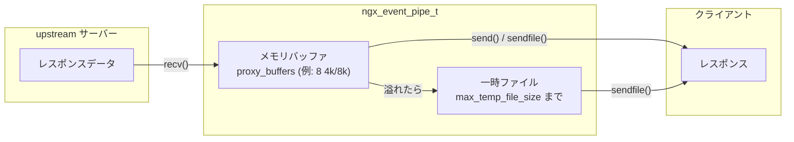

# 第15章 proxy のバッファリングとキャッシュ

> **本章で読むソース**
>
> - [`src/http/ngx_http_upstream.c`](https://github.com/nginx/nginx/blob/release-1.31.2/src/http/ngx_http_upstream.c)
> - [`src/http/ngx_http_upstream.h`](https://github.com/nginx/nginx/blob/release-1.31.2/src/http/ngx_http_upstream.h)
> - [`src/http/ngx_http_file_cache.c`](https://github.com/nginx/nginx/blob/release-1.31.2/src/http/ngx_http_file_cache.c)
> - [`src/http/ngx_http_cache.h`](https://github.com/nginx/nginx/blob/release-1.31.2/src/http/ngx_http_cache.h)

## この章の狙い

upstream から受け取ったレスポンスをクライアントへどう渡すかは、nginx の性能と耐久性を決める中枢である。
本章は2つの転送モードと、ファイルキャッシュの機構を読む。
1つ目は**非バッファリング**であり、upstream から読んだデータをそのままクライアントへ流す。
2つ目は**バッファリング**であり、`ngx_event_pipe_t` がメモリバッファと一時ファイルを使いながら upstream の読み込みとクライアントへの書き出しを並行して進める。
最後に、`proxy_cache` ディレクティブで有効になる**ファイルキャッシュ**の機構を `ngx_http_file_cache.c` から読む。
キャッシュキーの生成、共有メモリ上の赤黒木によるエントリ管理、キャッシュファイルのフォーマット、stale なエントリの扱いが本章の主題である。

## 前提

第13章の upstream 機構（`ngx_http_upstream_send_response()` の呼び出し時点の流れ）、第11章のフィルタチェーンと output chain（`ngx_output_chain()`、`ngx_chain_t`、`ngx_buf_t`）、第6章の共有メモリとスラブアロケータ（`ngx_shmtx_lock()`、`ngx_slab_alloc()`）を前提とする。

## 転送モードの分岐：`ngx_http_upstream_send_response()`

第13章で見た `ngx_http_upstream_send_response()` は、まず `ngx_http_send_header()` でクライアントにレスポンスヘッダーを送り、その後 `u->buffering` フラグで転送モードを分岐する。

[`src/http/ngx_http_upstream.c` L3261-L3380](https://github.com/nginx/nginx/blob/release-1.31.2/src/http/ngx_http_upstream.c#L3261-L3380)

```c
static void
ngx_http_upstream_send_response(ngx_http_request_t *r, ngx_http_upstream_t *u)
{
    ssize_t                    n;
    ngx_int_t                  rc;
    ngx_event_pipe_t          *p;
    ngx_connection_t          *c;
    ngx_http_core_loc_conf_t  *clcf;

    rc = ngx_http_send_header(r);

    if (rc == NGX_ERROR || rc > NGX_OK || r->post_action) {
        ngx_http_upstream_finalize_request(r, u, rc);
        return;
    }

    u->header_sent = 1;

    if (u->upgrade) {
        // ... (中略) ...
        ngx_http_upstream_upgrade(r, u);
        return;
    }

    c = r->connection;

    // ... (中略) ...

    if (!u->buffering) {

        // ... (中略) ...

        if (u->input_filter == NULL) {
            u->input_filter_init = ngx_http_upstream_non_buffered_filter_init;
            u->input_filter = ngx_http_upstream_non_buffered_filter;
            u->input_filter_ctx = r;
        }

        u->read_event_handler = ngx_http_upstream_process_non_buffered_upstream;
        r->write_event_handler =
                             ngx_http_upstream_process_non_buffered_downstream;

        // ... (中略) ...

        n = u->buffer.last - u->buffer.pos;

        if (n) {
            u->buffer.last = u->buffer.pos;

            u->state->response_length += n;

            if (u->input_filter(u->input_filter_ctx, n) == NGX_ERROR) {
                ngx_http_upstream_finalize_request(r, u, NGX_ERROR);
                return;
            }

            ngx_http_upstream_process_non_buffered_downstream(r);

        } else {
            u->buffer.pos = u->buffer.start;
            u->buffer.last = u->buffer.start;

            if (ngx_http_send_special(r, NGX_HTTP_FLUSH) == NGX_ERROR) {
                ngx_http_upstream_finalize_request(r, u, NGX_ERROR);
                return;
            }

            ngx_http_upstream_process_non_buffered_upstream(r, u);
        }

        return;
    }
```

`buffering` が無効（`proxy_buffering off`）なら非バッファリング経路に入る。
`u->input_filter` に `ngx_http_upstream_non_buffered_filter` を設定し、upstream の読み込みイベントとクライアントの書き込みイベントにそれぞれのハンドラを登録する。
すでに `u->buffer` にヘッダーパース時に読み込まれたデータがあれば、それを `input_filter` に通してから `ngx_http_upstream_process_non_buffered_downstream()` でクライアントへの書き出しを始める。

`buffering` が有効（デフォルト）なら、以降のコードで `ngx_event_pipe_t` を使ったバッファリング転送の準備に入る。

## 非バッファリング転送

非バッファリングモードでは、upstream から読んだデータをメモリにためず、そのままクライアントへ書き出す。
`ngx_http_upstream_non_buffered_filter()` が upstream から読んだバイト列を `ngx_chain_t` の鎖につなぎ、`ngx_http_upstream_process_non_buffered_downstream()` がそれをクライアントへ送る。

[`src/http/ngx_http_upstream.c` L4073-L4131](https://github.com/nginx/nginx/blob/release-1.31.2/src/http/ngx_http_upstream.c#L4073-L4131)

```c
ngx_int_t
ngx_http_upstream_non_buffered_filter(void *data, ssize_t bytes)
{
    ngx_http_request_t  *r = data;

    ngx_buf_t            *b;
    ngx_chain_t          *cl, **ll;
    ngx_http_upstream_t  *u;

    u = r->upstream;

    if (u->length == 0) {
        ngx_log_error(NGX_LOG_WARN, r->connection->log, 0,
                      "upstream sent more data than specified in "
                      "\"Content-Length\" header");
        return NGX_OK;
    }

    for (cl = u->out_bufs, ll = &u->out_bufs; cl; cl = cl->next) {
        ll = &cl->next;
    }

    cl = ngx_chain_get_free_buf(r->pool, &u->free_bufs);
    if (cl == NULL) {
        return NGX_ERROR;
    }

    *ll = cl;

    cl->buf->flush = 1;
    cl->buf->memory = 1;

    b = &u->buffer;

    cl->buf->pos = b->last;
    b->last += bytes;
    cl->buf->last = b->last;
    cl->buf->tag = u->output.tag;

    if (u->length == -1) {
        return NGX_OK;
    }

    if (bytes > u->length) {

        ngx_log_error(NGX_LOG_WARN, r->connection->log, 0,
                      "upstream sent more data than specified in "
                      "\"Content-Length\" header");

        cl->buf->last = cl->buf->pos + u->length;
        u->length = 0;

        return NGX_OK;
    }

    u->length -= bytes;

    return NGX_OK;
}
```

`u->buffer` は `proxy_buffer_size` の大きさの固定バッファであり、upstream から読むたびにこのバッファの `last` が進む。
`ngx_chain_get_free_buf()` は `u->free_bufs` チェーンから空きバッファを取るが、非バッファリングではバッファを使い切るとクライアントへの書き出し完了を待って解放されるため、事実上この1個のバッファが使い回される。
`flush = 1` は「このバッファの内容をためずに即座に送れ」の指示であり、各チャンクが下流のフィルタチェーンを経由してクライアントのソケットへ書き出される。

非バッファリングはレイテンシが最小になるが、upstream が遅いとクライアントへの書き出しも遅くなり、接続が長時間占有される。
SSE（Server-Sent Events）やストリーミング API のように、リアルタイム性が求められ、かつレスポンス全体をため込む必要がない場面で適する。

## バッファリング転送：`ngx_event_pipe_t`

バッファリングモードでは、`ngx_event_pipe_t`（以後「パイプ」）が upstream の読み込みとクライアントへの書き出しを仲介する。

[`src/http/ngx_http_upstream.c` L3476-L3601](https://github.com/nginx/nginx/blob/release-1.31.2/src/http/ngx_http_upstream.c#L3476-L3601)

```c
    p = u->pipe;

    p->output_filter = ngx_http_upstream_output_filter;
    p->output_ctx = r;
    p->tag = u->output.tag;
    p->bufs = u->conf->bufs;
    p->busy_size = u->conf->busy_buffers_size;
    p->upstream = u->peer.connection;
    p->downstream = c;
    p->pool = r->pool;
    p->log = c->log;
    p->limit_rate = ngx_http_complex_value_size(r, u->conf->limit_rate, 0);
    p->start_sec = ngx_time();

    p->cacheable = u->cacheable || u->store;

    p->temp_file = ngx_pcalloc(r->pool, sizeof(ngx_temp_file_t));
    if (p->temp_file == NULL) {
        ngx_http_upstream_finalize_request(r, u, NGX_ERROR);
        return;
    }

    p->temp_file->file.fd = NGX_INVALID_FILE;
    p->temp_file->file.log = c->log;
    p->temp_file->path = u->conf->temp_path;
    p->temp_file->pool = r->pool;

    if (p->cacheable) {
        p->temp_file->persistent = 1;

#if (NGX_HTTP_CACHE)
        if (r->cache && !r->cache->file_cache->use_temp_path) {
            p->temp_file->path = r->cache->file_cache->path;
            p->temp_file->file.name = r->cache->file.name;
        }
#endif

    } else {
        p->temp_file->log_level = NGX_LOG_WARN;
        p->temp_file->warn = "an upstream response is buffered "
                             "to a temporary file";
    }

    p->max_temp_file_size = u->conf->max_temp_file_size;
    p->temp_file_write_size = u->conf->temp_file_write_size;

    // ... (中略) ...

    p->preread_bufs = ngx_alloc_chain_link(r->pool);
    if (p->preread_bufs == NULL) {
        ngx_http_upstream_finalize_request(r, u, NGX_ERROR);
        return;
    }

    p->preread_bufs->buf = &u->buffer;
    p->preread_bufs->next = NULL;
    u->buffer.recycled = 1;

    p->preread_size = u->buffer.last - u->buffer.pos;

    // ... (中略) ...

    u->read_event_handler = ngx_http_upstream_process_upstream;
    r->write_event_handler = ngx_http_upstream_process_downstream;

    ngx_http_upstream_process_upstream(r, u);
}
```

パイプの設定で押さえるべき点は3つある。

1つ目は **バッファの構成**である。
`p->bufs` は `proxy_buffers` ディレクティブで指定されたバッファの数とサイズ（`ngx_bufs_t`）であり、upstream からデータを読むたびに確保される。
`p->busy_size` は `proxy_busy_buffers_size` で、同時にクライアントへ書き出し中のバッファが占有できる上限である。
この上限を超えると、パイプは upstream から読むのを一時停止する。

2つ目は **一時ファイル**である。
`max_temp_file_size`（`proxy_max_temp_file_size`、デフォルト1GB）を超えると、パイプはレスポンスを一時ファイルに書き出す。
`temp_file_write_size`（`proxy_temp_file_write_size`）は1回の書き込みサイズである。
レスポンスがメモリバッファに収まらない大きな場合でも、一時ファイルに逃がすことでメモリ使用量を抑える。

3つ目は **キャッシュとの統合**である。
`p->cacheable` が立っている場合、一時ファイルは `persistent = 1` になり、レスポンスの書き込み完了後も削除されない。
`use_temp_path` が無効なら、キャッシュディレクトリに直接書き込むことで、ファイル名の変更（`rename()`）だけでキャッシュエントリを確定できる。

パイプの動作は、upstream の読み込みイベントで `ngx_http_upstream_process_upstream()` が、クライアントの書き込みイベントで `ngx_http_upstream_process_downstream()` が呼ばれる二重の駆動構造になっている。
どちらのイベントが先に届いても、それぞれの方向で進められるところまで処理が進む。



## ファイルキャッシュの概要

`proxy_cache` ディレクティブでキャッシュが有効だと、`ngx_http_upstream_init_request()` の冒頭で `ngx_http_upstream_cache()` が呼ばれる。

[`src/http/ngx_http_upstream.c` L854-L931](https://github.com/nginx/nginx/blob/release-1.31.2/src/http/ngx_http_upstream.c#L854-L931)

```c
static ngx_int_t
ngx_http_upstream_cache(ngx_http_request_t *r, ngx_http_upstream_t *u)
{
    ngx_int_t               rc;
    ngx_http_cache_t       *c;
    ngx_http_file_cache_t  *cache;

    c = r->cache;

    if (c == NULL) {

        if (!(r->method & u->conf->cache_methods)) {
            return NGX_DECLINED;
        }

        rc = ngx_http_upstream_cache_get(r, u, &cache);

        if (rc != NGX_OK) {
            return rc;
        }

        // ... (中略) ...

        if (ngx_http_file_cache_new(r) != NGX_OK) {
            return NGX_ERROR;
        }

        if (u->create_key(r) != NGX_OK) {
            return NGX_ERROR;
        }

        /* TODO: add keys */

        ngx_http_file_cache_create_key(r);

        // ... (中略) ...

        u->cacheable = 1;

        c = r->cache;

        c->body_start = u->conf->buffer_size;
        c->min_uses = u->conf->cache_min_uses;
        c->file_cache = cache;

        switch (ngx_http_test_predicates(r, u->conf->cache_bypass)) {

        case NGX_ERROR:
            return NGX_ERROR;

        case NGX_DECLINED:
            u->cache_status = NGX_HTTP_CACHE_BYPASS;
            return NGX_DECLINED;

        default: /* NGX_OK */
            break;
        }

        c->lock = u->conf->cache_lock;
        c->lock_timeout = u->conf->cache_lock_timeout;
        c->lock_age = u->conf->cache_lock_age;

        u->cache_status = NGX_HTTP_CACHE_MISS;
    }

    rc = ngx_http_file_cache_open(r);

    // ... (中略) ...

    switch (rc) {

    case NGX_OK:
        u->cache_status = NGX_HTTP_CACHE_HIT;

    // ... (中略) ...
    }
```

キャッシュの処理は以下の順で進む。

1. `cache_methods`（デフォルト GET と HEAD）に含まれないメソッドならスキップ
2. キャッシュゾーンを特定（`proxy_cache` で直接指定、または `proxy_cache` 変数の評価）
3. `ngx_http_file_cache_new()` で `ngx_http_cache_t` を確保
4. `u->create_key(r)` でキャッシュキーの元になる文字列群を `c->keys` に集める（proxy モジュールでは `proxy_cache_key` の評価結果）
5. `ngx_http_file_cache_create_key()` でキー文字列群から MD5 ハッシュ（16バイト）を計算
6. `cache_bypass` 条件を評価し、該当すれば `NGX_HTTP_CACHE_BYPASS` として upstream へ進む
7. `ngx_http_file_cache_open()` でキャッシュエントリを検索

`ngx_http_file_cache_open()` の結果が `NGX_OK` ならキャッシュヒット（`NGX_HTTP_CACHE_HIT`）、`NGX_DECLINED` ならミスマッチで upstream へ、`NGX_HTTP_CACHE_STALE` なら期限切れだが条件付きで使える状態である。

## キャッシュキーの生成：MD5 と CRC32

`ngx_http_file_cache_create_key()` は、キャッシュキーの元になる文字列群から2つのハッシュを計算する。

[`src/http/ngx_http_file_cache.c` L227-L261](https://github.com/nginx/nginx/blob/release-1.31.2/src/http/ngx_http_file_cache.c#L227-L261)

```c
void
ngx_http_file_cache_create_key(ngx_http_request_t *r)
{
    size_t             len;
    ngx_str_t         *key;
    ngx_uint_t         i;
    ngx_md5_t          md5;
    ngx_http_cache_t  *c;

    c = r->cache;

    len = 0;

    ngx_crc32_init(c->crc32);
    ngx_md5_init(&md5);

    key = c->keys.elts;
    for (i = 0; i < c->keys.nelts; i++) {
        ngx_log_debug1(NGX_LOG_DEBUG_HTTP, r->connection->log, 0,
                       "http cache key: \"%V\"", &key[i]);

        len += key[i].len;

        ngx_crc32_update(&c->crc32, key[i].data, key[i].len);
        ngx_md5_update(&md5, key[i].data, key[i].len);
    }

    c->header_start = sizeof(ngx_http_file_cache_header_t)
                      + sizeof(ngx_http_file_cache_key) + len + 1;

    ngx_crc32_final(c->crc32);
    ngx_md5_final(c->key, &md5);

    ngx_memcpy(c->main, c->key, NGX_HTTP_CACHE_KEY_LEN);
}
```

MD5（16バイト）はキャッシュエントリの**主キー**として使われる。
ファイルパスの構築、共有メモリ上の赤黒木の検索、キャッシュファイル内の照合に用いる。
CRC32（4バイト）は**高速照合用**である。
キャッシュファイルを読み込んだとき、MD5 の全文照合の前に CRC32 で快速に不一致を弾く。
MD5 の衝突は理論上あり得るため、ファイルには元のキー文字列も書き込まれ、読み込み時に完全照合される。

`c->header_start` はキャッシュファイルのヘッダー部分のバイト数であり、`ngx_http_file_cache_header_t` のサイズにキー識別子の長さ（`LF, 'K', 'E', 'Y', ':', ' '` の6バイト）とキー文字列の長さ、終端の LF を加えたものである。
この値は `proxy_buffer_size` と比較され、バッファがヘッダーを収容できなければキャッシュは無効化される。

## 共有メモリ上のエントリ管理：`ngx_http_file_cache_exists()`

キャッシュエントリの検索と登録は、共有メモリ上の赤黒木に対して行う。

[`src/http/ngx_http_file_cache.c` L881-L990](https://github.com/nginx/nginx/blob/release-1.31.2/src/http/ngx_http_file_cache.c#L881-L990)

```c
ngx_int_t
ngx_http_file_cache_exists(ngx_http_file_cache_t *cache, ngx_http_cache_t *c)
{
    ngx_int_t                    rc;
    ngx_http_file_cache_node_t  *fcn;

    ngx_shmtx_lock(&cache->shpool->mutex);

    fcn = c->node;

    if (fcn == NULL) {
        fcn = ngx_http_file_cache_lookup(cache, c->key);
    }

    if (fcn) {
        ngx_queue_remove(&fcn->queue);

        if (c->node == NULL) {
            fcn->uses++;
            fcn->count++;
        }

        if (fcn->error) {

            if (fcn->valid_sec < ngx_time()) {
                goto renew;
            }

            rc = NGX_OK;

            goto done;
        }

        if (fcn->exists || fcn->uses >= c->min_uses) {

            c->exists = fcn->exists;
            if (fcn->body_start && !c->update_variant) {
                c->body_start = fcn->body_start;
            }

            rc = NGX_OK;

            goto done;
        }

        rc = NGX_AGAIN;

        goto done;
    }

    fcn = ngx_slab_calloc_locked(cache->shpool,
                                 sizeof(ngx_http_file_cache_node_t));
    if (fcn == NULL) {
        ngx_http_file_cache_set_watermark(cache);

        ngx_shmtx_unlock(&cache->shpool->mutex);

        (void) ngx_http_file_cache_forced_expire(cache);

        ngx_shmtx_lock(&cache->shpool->mutex);

        fcn = ngx_slab_calloc_locked(cache->shpool,
                                     sizeof(ngx_http_file_cache_node_t));
        if (fcn == NULL) {
            ngx_log_error(NGX_LOG_ALERT, ngx_cycle->log, 0,
                          "could not allocate node%s", cache->shpool->log_ctx);
            rc = NGX_ERROR;
            goto failed;
        }
    }

    cache->sh->count++;

    ngx_memcpy((u_char *) &fcn->node.key, c->key, sizeof(ngx_rbtree_key_t));

    ngx_memcpy(fcn->key, &c->key[sizeof(ngx_rbtree_key_t)],
               NGX_HTTP_CACHE_KEY_LEN - sizeof(ngx_rbtree_key_t));

    ngx_rbtree_insert(&cache->sh->rbtree, &fcn->node);

    fcn->uses = 1;
    fcn->count = 1;

renew:

    rc = NGX_DECLINED;

    fcn->valid_msec = 0;
    fcn->error = 0;
    fcn->exists = 0;
    fcn->valid_sec = 0;
    fcn->uniq = 0;
    fcn->body_start = 0;
    fcn->fs_size = 0;

done:

    fcn->expire = ngx_time() + cache->inactive;

    ngx_queue_insert_head(&cache->sh->queue, &fcn->queue);

    c->uniq = fcn->uniq;
    c->error = fcn->error;
    c->node = fcn;

failed:

    ngx_shmtx_unlock(&cache->shpool->mutex);

    return rc;
}
```

`ngx_http_file_cache_lookup()` は MD5 キーの先頭 `sizeof(ngx_rbtree_key_t)` バイトを赤黒木の `node.key` として使い、残りのバイトを `fcn->key` に格納して2段の照合を行う。

[`src/http/ngx_http_file_cache.c` L1028-L1070](https://github.com/nginx/nginx/blob/release-1.31.2/src/http/ngx_http_file_cache.c#L1028-L1070)

```c
static ngx_http_file_cache_node_t *
ngx_http_file_cache_lookup(ngx_http_file_cache_t *cache, u_char *key)
{
    ngx_int_t                    rc;
    ngx_rbtree_key_t             node_key;
    ngx_rbtree_node_t           *node, *sentinel;
    ngx_http_file_cache_node_t  *fcn;

    ngx_memcpy((u_char *) &node_key, key, sizeof(ngx_rbtree_key_t));

    node = cache->sh->rbtree.root;
    sentinel = cache->sh->rbtree.sentinel;

    while (node != sentinel) {

        if (node_key < node->key) {
            node = node->left;
            continue;
        }

        if (node_key > node->key) {
            node = node->right;
            continue;
        }

        /* node_key == node->key */

        fcn = (ngx_http_file_cache_node_t *) node;

        rc = ngx_memcmp(&key[sizeof(ngx_rbtree_key_t)], fcn->key,
                        NGX_HTTP_CACHE_KEY_LEN - sizeof(ngx_rbtree_key_t));

        if (rc == 0) {
            return fcn;
        }

        node = (rc < 0) ? node->left : node->right;
    }

    /* not found */

    return NULL;
}
```

16バイトの MD5 キーのうち先頭4バイト（`ngx_rbtree_key_t` は `uint32_t`）を赤黒木の探索キーにし、残りの12バイトはノードのキーが等しいときに `memcmp` で照合する。
これにより、赤黒木の探索は4バイト整数の比較で枝を絞り、衝突が起きたときだけ残りの12バイトを比較する。
共有メモリ上の全エントリを線形走査するのと比べ、検索コストはエントリ数の対数に比例する。

エントリが見つかった場合の戻り値は4通りに分かれる。

- `NGX_OK`：キャッシュファイルが存在する（`fcn->exists`）、または `min_uses` に達した
- `NGX_DECLINED`：新規エントリを赤黒木に挿入した（キャッシュファイルはまだ存在しない）
- `NGX_AGAIN`：エントリはあるが `min_uses` に達していない（まだキャッシュしない）
- `NGX_HTTP_CACHE_SCARCE`：`min_uses > 1` で `cold` フラグが立っていない状態

`min_uses`（`proxy_cache_min_uses`、デフォルト1）は、同じキーが何回リクエストされてからキャッシュファイルを実際に書き始めるかを制御する。
頻度の低いレスポンスをキャッシュファイルとしてディスクに書き込む無駄を省く仕組みである。

## キャッシュファイルのフォーマット

キャッシュファイルは、`ngx_http_file_cache_header_t` のバイナリヘッダーに続いて、キー文字列、そして HTTP レスポンスのボディが並ぶ構造を持つ。

[`src/http/ngx_http_cache.h` L128-L144](https://github.com/nginx/nginx/blob/release-1.31.2/src/http/ngx_http_cache.h#L128-L144)

```c
typedef struct {
    ngx_uint_t                       version;
    time_t                           valid_sec;
    time_t                           updating_sec;
    time_t                           error_sec;
    time_t                           last_modified;
    time_t                           date;
    uint32_t                         crc32;
    u_short                          valid_msec;
    u_short                          header_start;
    u_short                          body_start;
    u_char                           etag_len;
    u_char                           etag[NGX_HTTP_CACHE_ETAG_LEN];
    u_char                           vary_len;
    u_char                           vary[NGX_HTTP_CACHE_VARY_LEN];
    u_char                           variant[NGX_HTTP_CACHE_KEY_LEN];
} ngx_http_file_cache_header_t;
```

`version` はキャッシュフォーマットのバージョン（現在は5）であり、nginx のバージョンアップでヘッダー構造が変わったときに古いキャッシュファイルを無効化する。
`valid_sec` はこのエントリの有効期限（UNIX時刻）、`body_start` は HTTP ヘッダー部分のバイト数（ここからがボディ）、`crc32` はキーの CRC32 である。

`ngx_http_file_cache_set_header()` は、upstream からのレスポンスをキャッシュファイルに書き込むときに、このバイナリヘッダーをファイルの先頭に埋め込む。

[`src/http/ngx_http_file_cache.c` L1303-L1364](https://github.com/nginx/nginx/blob/release-1.31.2/src/http/ngx_http_file_cache.c#L1303-L1364)

```c
ngx_http_file_cache_set_header(ngx_http_request_t *r, u_char *buf)
{
    ngx_http_file_cache_header_t  *h = (ngx_http_file_cache_header_t *) buf;

    u_char            *p;
    ngx_str_t         *key;
    ngx_uint_t         i;
    ngx_http_cache_t  *c;

    ngx_log_debug0(NGX_LOG_DEBUG_HTTP, r->connection->log, 0,
                   "http file cache set header");

    c = r->cache;

    ngx_memzero(h, sizeof(ngx_http_file_cache_header_t));

    h->version = NGX_HTTP_CACHE_VERSION;
    h->valid_sec = c->valid_sec;
    h->updating_sec = c->updating_sec;
    h->error_sec = c->error_sec;
    h->last_modified = c->last_modified;
    h->date = c->date;
    h->crc32 = c->crc32;
    h->valid_msec = (u_short) c->valid_msec;
    h->header_start = (u_short) c->header_start;
    h->body_start = (u_short) c->body_start;

    // ... (中略) ...

    p = buf + sizeof(ngx_http_file_cache_header_t);

    p = ngx_cpymem(p, ngx_http_file_cache_key, sizeof(ngx_http_file_cache_key));

    key = c->keys.elts;
    for (i = 0; i < c->keys.nelts; i++) {
        p = ngx_copy(p, key[i].data, key[i].len);
    }

    *p = LF;

    return NGX_OK;
}
```

バイナリヘッダーの直後に `LF, 'K', 'E', 'Y', ':', ' '` の6バイトの識別子が続き、その後にキャッシュキーの原文、最後に LF が置かれる。
キャッシュファイルを読み込んだとき、このキー原文と計算済みのキーを照合することで、MD5 の衝突を最終的に検出する。

## キャッシュの読み込みと有効期限の判定

`ngx_http_file_cache_read()` はキャッシュファイルを読み込み、ヘッダーを検証する。

[`src/http/ngx_http_file_cache.c` L542-L680](https://github.com/nginx/nginx/blob/release-1.31.2/src/http/ngx_http_file_cache.c#L542-L680)

```c
static ngx_int_t
ngx_http_file_cache_read(ngx_http_request_t *r, ngx_http_cache_t *c)
{
    u_char                        *p;
    time_t                         now;
    ssize_t                        n;
    ngx_str_t                     *key;
    ngx_int_t                      rc;
    ngx_uint_t                     i;
    ngx_http_file_cache_t         *cache;
    ngx_http_file_cache_header_t  *h;

    n = ngx_http_file_cache_aio_read(r, c);

    if (n < 0) {
        return n;
    }

    if ((size_t) n < c->header_start) {
        ngx_log_error(NGX_LOG_CRIT, r->connection->log, 0,
                      "cache file \"%s\" is too small", c->file.name.data);
        return NGX_DECLINED;
    }

    h = (ngx_http_file_cache_header_t *) c->buf->pos;

    if (h->version != NGX_HTTP_CACHE_VERSION) {
        ngx_log_error(NGX_LOG_INFO, r->connection->log, 0,
                      "cache file \"%s\" version mismatch", c->file.name.data);
        return NGX_DECLINED;
    }

    if (h->crc32 != c->crc32 || (size_t) h->header_start != c->header_start) {
        ngx_log_error(NGX_LOG_CRIT, r->connection->log, 0,
                      "cache file \"%s\" has md5 collision", c->file.name.data);
        return NGX_DECLINED;
    }

    p = c->buf->pos + sizeof(ngx_http_file_cache_header_t)
        + sizeof(ngx_http_file_cache_key);

    key = c->keys.elts;
    for (i = 0; i < c->keys.nelts; i++) {
        if (ngx_memcmp(p, key[i].data, key[i].len) != 0) {
            ngx_log_error(NGX_LOG_CRIT, r->connection->log, 0,
                          "cache file \"%s\" has md5 collision",
                          c->file.name.data);
            return NGX_DECLINED;
        }

        p += key[i].len;
    }

    // ... (中略) ...

    c->valid_sec = h->valid_sec;
    c->updating_sec = h->updating_sec;
    c->error_sec = h->error_sec;
    c->last_modified = h->last_modified;
    c->date = h->date;
    c->valid_msec = h->valid_msec;
    c->body_start = h->body_start;
    c->etag.len = h->etag_len;
    c->etag.data = h->etag;

    r->cached = 1;

    // ... (中略) ...

    now = ngx_time();

    if (c->valid_sec < now) {
        c->stale_updating = c->valid_sec + c->updating_sec >= now;
        c->stale_error = c->valid_sec + c->error_sec >= now;

        ngx_shmtx_lock(&cache->shpool->mutex);

        if (c->node->updating) {
            rc = NGX_HTTP_CACHE_UPDATING;

        } else {
            c->node->updating = 1;
            c->updating = 1;
            c->lock_time = c->node->lock_time;
            rc = NGX_HTTP_CACHE_STALE;
        }

        ngx_shmtx_unlock(&cache->shpool->mutex);

        // ... (中略) ...

        return rc;
    }

    return NGX_OK;
}
```

検証は4段階で進む。

1. ファイルサイズが `header_start` 未満なら不正
2. `version` の不一致はフォーマット違いとして破棄
3. `crc32` と `header_start` の照合で、MD5 衝突の快速検出
4. キー原文の照合で、MD5 衝突の最終確認

すべて通過すると `c->valid_sec` をファイルヘッダーから取り出し、現在時刻と比較する。
有効期限を過ぎていれば `NGX_HTTP_CACHE_STALE` を返す。
このとき `stale_updating` と `stale_error` を計算し、`proxy_cache_use_stale updating` や `proxy_cache_use_stale error` の設定に応じて、期限切れのエントリを一時的に使えるかを判定する。

## キャッシュの更新とアトミックな確定

`ngx_http_file_cache_update()` は、upstream から受け取ったレスポンスをキャッシュファイルとして確定する。

[`src/http/ngx_http_file_cache.c` L1417-L1452](https://github.com/nginx/nginx/blob/release-1.31.2/src/http/ngx_http_file_cache.c#L1417-L1452)

```c
void
ngx_http_file_cache_update(ngx_http_request_t *r, ngx_temp_file_t *tf)
{
    off_t                   fs_size;
    ngx_int_t               rc;
    ngx_file_uniq_t         uniq;
    ngx_file_info_t         fi;
    ngx_http_cache_t        *c;
    ngx_ext_rename_file_t   ext;
    ngx_http_file_cache_t  *cache;

    c = r->cache;

    if (c->updated) {
        return;
    }

    ngx_log_debug0(NGX_LOG_DEBUG_HTTP, r->connection->log, 0,
                   "http file cache update");

    cache = c->file_cache;

    c->updated = 1;
    c->updating = 0;

    uniq = 0;
    fs_size = 0;

    ngx_log_debug2(NGX_LOG_DEBUG_HTTP, r->connection->log, 0,
                   "http file cache rename: \"%s\" to \"%s\"",
                   tf->file.name.data, c->file.name.data);

    ext.access = NGX_FILE_OWNER_ACCESS;
    ext.path_access = NGX_FILE_OWNER_ACCESS;
    ext.time = -1;
    ext.create_path = 1;
```

レスポンスはまず一時ファイルに書き込まれ、全データが揃った時点で `ngx_ext_rename_file()` によりキャッシュファイルのパスへ `rename()` される。
`rename()` は POSIX でアトミックな操作であり、書き込み途中のファイルが他のリクエストから見えることはない。
これがキャッシュの整合性を保証する機構である。

## まとめ

- `ngx_http_upstream_send_response()` は `u->buffering` フラグで非バッファリングとバッファリングの2つの転送モードを分岐する。
- 非バッファリングは `ngx_http_upstream_non_buffered_filter()` を介して upstream から読んだデータを即座にクライアントへ送る。
  レイテンシが最小になるが、upstream が遅いと接続が長時間占有される。
- バッファリングは `ngx_event_pipe_t` がメモリバッファ（`proxy_buffers`）と一時ファイル（`proxy_max_temp_file_size`）を使い、upstream の読み込みとクライアントへの書き出しを並行して進める。
- キャッシュは `ngx_http_upstream_cache()` から始まり、MD5 の16バイトキーでエントリを管理する。
- `ngx_http_file_cache_exists()` は共有メモリ上の赤黒木を操作し、MD5 の先頭4バイトを木のキー、残り12バイトをノード内照合に使う2段構成で検索する。
- キャッシュファイルはバイナリヘッダー（`ngx_http_file_cache_header_t`）にキー原文とボディを続けた構造を持ち、CRC32 の快速照合とキー原文の完全照合の2段階で MD5 衝突を検出する。
- キャッシュファイルの確定は `rename()` によりアトミックに行われ、書き込み途中のファイルが他のリクエストから見えることはない。

## 関連する章

- [第13章 upstream 機構](13-upstream-mechanism.md)
- [第14章 ロードバランシング](14-load-balancing.md)
- [第11章 フィルタチェーンと output chain](../part03-http/11-filter-chain-and-output-chain.md)
- [第6章 共有メモリとスラブアロケータ](../part01-core/06-shared-memory-and-slab.md)
