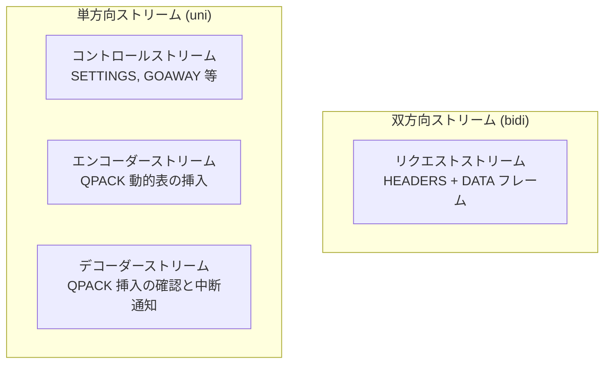

# 第18章 HTTP/3

> **本章で読むソース**
>
> - [`src/http/v3/ngx_http_v3.h`](https://github.com/nginx/nginx/blob/release-1.31.2/src/http/v3/ngx_http_v3.h)
> - [`src/http/v3/ngx_http_v3.c`](https://github.com/nginx/nginx/blob/release-1.31.2/src/http/v3/ngx_http_v3.c)
> - [`src/http/v3/ngx_http_v3_request.c`](https://github.com/nginx/nginx/blob/release-1.31.2/src/http/v3/ngx_http_v3_request.c)
> - [`src/http/v3/ngx_http_v3_filter_module.c`](https://github.com/nginx/nginx/blob/release-1.31.2/src/http/v3/ngx_http_v3_filter_module.c)
> - [`src/http/v3/ngx_http_v3_uni.c`](https://github.com/nginx/nginx/blob/release-1.31.2/src/http/v3/ngx_http_v3_uni.c)
> - [`src/http/v3/ngx_http_v3_parse.c`](https://github.com/nginx/nginx/blob/release-1.31.2/src/http/v3/ngx_http_v3_parse.c)
> - [`src/http/v3/ngx_http_v3_encode.c`](https://github.com/nginx/nginx/blob/release-1.31.2/src/http/v3/ngx_http_v3_encode.c)
> - [`src/http/v3/ngx_http_v3_table.c`](https://github.com/nginx/nginx/blob/release-1.31.2/src/http/v3/ngx_http_v3_table.c)
> - [`src/http/v3/ngx_http_v3_module.c`](https://github.com/nginx/nginx/blob/release-1.31.2/src/http/v3/ngx_http_v3_module.c)

## この章の狙い

本章は、QUIC 上で HTTP を動作させる HTTP/3 の実装を読む。
HTTP/3 は HTTP/2 のフレームとヘッダー符号化を QUIC に載せ替えたプロトコルであり、TCP と TLS の代わりに QUIC のストリームと TLS 1.3 を使う。
nginx の実装では、QUIC ストリームごとに `ngx_connection_t` が作られ（第17章）、その上で HTTP/3 のフレームを解釈して `ngx_http_request_t` を組み上げる。
具体的には、セッションの初期化、ユニダイレクショナルストリームの管理、QPACK によるヘッダーの符号化と復号、リクエストの受理からレスポンスの出力までを追う。

## 前提

第17章の QUIC トランスポート（`ngx_quic_connection_t`、ストリームの赤黒木、フロー制御）を前提とする。
第16章の HTTP/2 の実装（ストリーム多重化、HPACK、フィルタチェーンの差し替え方式）も参照する。
HTTP/3 は HTTP/2 と概念的に似ているため、両者の対応関係を意識しながら読むと理解しやすい。

## セッションの初期化

HTTP/3 の接続は、QUIC のハンドシェイクが完了した後に `ngx_http_v3_init()` でセッションが初期化される。

[`src/http/v3/ngx_http_v3.c` L17-L61](https://github.com/nginx/nginx/blob/release-1.31.2/src/http/v3/ngx_http_v3.c#L17-L61)

```c
ngx_int_t
ngx_http_v3_init_session(ngx_connection_t *c)
{
    ngx_pool_cleanup_t     *cln;
    ngx_http_connection_t  *hc;
    ngx_http_v3_session_t  *h3c;

    hc = c->data;

    ngx_log_debug0(NGX_LOG_DEBUG_HTTP, c->log, 0, "http3 init session");

    h3c = ngx_pcalloc(c->pool, sizeof(ngx_http_v3_session_t));
    if (h3c == NULL) {
        goto failed;
    }

    h3c->http_connection = hc;

    ngx_queue_init(&h3c->blocked);

    h3c->keepalive.log = c->log;
    h3c->keepalive.data = c;
    h3c->keepalive.handler = ngx_http_v3_keepalive_handler;

    h3c->table.send_insert_count.log = c->log;
    h3c->table.send_insert_count.data = c;
    h3c->table.send_insert_count.handler = ngx_http_v3_inc_insert_count_handler;

    cln = ngx_pool_cleanup_add(c->pool, 0);
    if (cln == NULL) {
        goto failed;
    }

    cln->handler = ngx_http_v3_cleanup_session;
    cln->data = h3c;

    c->data = h3c;

    return NGX_OK;

failed:

    ngx_log_error(NGX_LOG_ERR, c->log, 0, "failed to create http3 session");
    return NGX_ERROR;
}
```

`ngx_http_v3_session_t` は HTTP/3 セッション1つ分の状態を持つ。
`blocked` キューは QPACK の動的表の参照がまだ解決できていないストリームを管理し、`keepalive` は接続のアイドルタイムアウトを管理する。
`table` は QPACK の動的表であり、`send_insert_count` はエンコーダーストリームからの挿入カウントの通知を処理するイベントである。

`ngx_http_v3_init()` はセッションの初期化に加えて、SETTINGS フレームの送信と、デコーダーストリームの開設を行う。

[`src/http/v3/ngx_http_v3_request.c` L100-L148](https://github.com/nginx/nginx/blob/release-1.31.2/src/http/v3/ngx_http_v3_request.c#L100-L148)

```c
ngx_int_t
ngx_http_v3_init(ngx_connection_t *c)
{
    // ... (中略) ...

    if (ngx_http_v3_init_session(c) != NGX_OK) {
        return NGX_ERROR;
    }

    h3c = ngx_http_v3_get_session(c);
    clcf = ngx_http_v3_get_module_loc_conf(c, ngx_http_core_module);
    ngx_add_timer(&h3c->keepalive, clcf->keepalive_timeout);

    h3scf = ngx_http_v3_get_module_srv_conf(c, ngx_http_v3_module);

    if (h3scf->enable_hq) {
        if (!h3scf->enable) {
            h3c->hq = 1;
            return NGX_OK;
        }

        SSL_get0_alpn_selected(c->ssl->connection, &data, &len);

        if (len == sizeof(NGX_HTTP_V3_HQ_PROTO) - 1
            && ngx_strncmp(data, NGX_HTTP_V3_HQ_PROTO, len) == 0)
        {
            h3c->hq = 1;
            return NGX_OK;
        }
    }

    if (ngx_http_v3_send_settings(c) != NGX_OK) {
        return NGX_ERROR;
    }

    if (h3scf->max_table_capacity > 0) {
        if (ngx_http_v3_get_uni_stream(c, NGX_HTTP_V3_STREAM_DECODER) == NULL) {
            return NGX_ERROR;
        }
    }

    return NGX_OK;
}
```

ALPN で `hq-interop` が選ばれた場合は `h3c->hq` を立てて QPACK をスキップする。
通常の HTTP/3（`h3`）では、SETTINGS フレームを送り、動的表の容量が0より大きければデコーダーストリームも開設する。

## ストリームの種類とユニダイレクショナルストリーム

HTTP/3 は QUIC のストリームを4種類に使う。



クライアントもサーバーもそれぞれコントロール、エンコーダー、デコーダーの3本のユニダイレクショナルストリームを開く。
nginx のサーバー側では、クライアントから開かれたこれら6本のストリーム（クライアント3本 + サーバー3本）を `known_streams[]` で管理する。

[`src/http/v3/ngx_http_v3.h` L48-L55](https://github.com/nginx/nginx/blob/release-1.31.2/src/http/v3/ngx_http_v3.h#L48-L55)

```c
#define NGX_HTTP_V3_STREAM_CLIENT_CONTROL          0
#define NGX_HTTP_V3_STREAM_SERVER_CONTROL          1
#define NGX_HTTP_V3_STREAM_CLIENT_ENCODER          2
#define NGX_HTTP_V3_STREAM_SERVER_ENCODER          3
#define NGX_HTTP_V3_STREAM_CLIENT_DECODER          4
#define NGX_HTTP_V3_STREAM_SERVER_DECODER          5
#define NGX_HTTP_V3_MAX_KNOWN_STREAM               6
#define NGX_HTTP_V3_MAX_UNI_STREAMS                3
```

ユニダイレクショナルストリームが届くと、`ngx_http_v3_init_uni_stream()` がストリームの種類を識別して適切なハンドラを設定する。

[`src/http/v3/ngx_http_v3_uni.c` L25-L75](https://github.com/nginx/nginx/blob/release-1.31.2/src/http/v3/ngx_http_v3_uni.c#L25-L75)

```c
void
ngx_http_v3_init_uni_stream(ngx_connection_t *c)
{
    uint64_t                   n;
    ngx_http_v3_session_t     *h3c;
    ngx_http_v3_uni_stream_t  *us;

    h3c = ngx_http_v3_get_session(c);
    if (h3c->hq) {
        ngx_http_v3_finalize_connection(c,
                                        NGX_HTTP_V3_ERR_STREAM_CREATION_ERROR,
                                        "uni stream in hq mode");
        c->data = NULL;
        ngx_http_v3_close_uni_stream(c);
        return;
    }

    ngx_log_debug0(NGX_LOG_DEBUG_HTTP, c->log, 0, "http3 init uni stream");

    n = c->quic->id >> 2;

    if (n >= NGX_HTTP_V3_MAX_UNI_STREAMS) {
        ngx_http_v3_finalize_connection(c,
                                      NGX_HTTP_V3_ERR_STREAM_CREATION_ERROR,
                                      "reached maximum number of uni streams");
        c->data = NULL;
        ngx_http_v3_close_uni_stream(c);
        return;
    }

    ngx_quic_cancelable_stream(c);

    us = ngx_pcalloc(c->pool, sizeof(ngx_http_v3_uni_stream_t));
    // ... (中略) ...

    us->index = -1;

    c->data = us;

    c->read->handler = ngx_http_v3_uni_read_handler;
    c->write->handler = ngx_http_v3_uni_dummy_write_handler;

    ngx_http_v3_uni_read_handler(c->read);
}
```

ストリームIDの上位ビット（`id >> 2`）がストリームの種類を表す。
`NGX_HTTP_V3_MAX_UNI_STREAMS`（3本）を超えると接続エラーになる。
`ngx_quic_cancelable_stream()` は、このストリームが接続のクローズをブロックしないことを宣言する。

ユニダイレクショナルストリームの読み込みハンドラは、最初の可変長整数でストリームの種類を判定し、コントロールストリームなら SETTINGS フレームの解釈、エンコーダーストリームなら QPACK の動的表への挿入、デコーダーストリームなら挿入確認の処理を行う。

## リクエストの受理

双方向ストリームにリクエストが届くと、`ngx_http_v3_init_request_stream()` が呼ばれる。

[`src/http/v3/ngx_http_v3_request.c` L179-L200](https://github.com/nginx/nginx/blob/release-1.31.2/src/http/v3/ngx_http_v3_request.c#L179-L200)

```c
static void
ngx_http_v3_init_request_stream(ngx_connection_t *c)
{
    uint64_t                   n;
    ngx_event_t               *rev;
    ngx_pool_cleanup_t        *cln;
    ngx_http_connection_t     *hc;
    ngx_http_v3_session_t     *h3c;
    ngx_http_core_loc_conf_t  *clcf;

    ngx_log_debug0(NGX_LOG_DEBUG_HTTP, c->log, 0, "http3 init request stream");

    // ... (中略) ...

    hc = c->data;

    clcf = ngx_http_get_module_loc_conf(hc->conf_ctx, ngx_http_core_module);

    n = c->quic->id >> 2;
```

HTTP/3 のリクエストストリームでは、まず HEADERS フレームを読み、QPACK で復号したヘッダーから `ngx_http_request_t` を構築する。
この処理は `ngx_http_v3_wait_request_handler()` で始まり、HTTP/1.x の `ngx_http_wait_request_handler()`（第9章）と対応する。

HTTP/3 のフレームは QUIC ストリームの上を流れる。
フレームは可変長整数の種別と可変長整数の長さ、そしてペイロードの3要素で構成される。

[`src/http/v3/ngx_http_v3_encode.c` L13-L60](https://github.com/nginx/nginx/blob/release-1.31.2/src/http/v3/ngx_http_v3_encode.c#L13-L60)

```c
uintptr_t
ngx_http_v3_encode_varlen_int(u_char *p, uint64_t value)
{
    if (value <= 63) {
        if (p == NULL) {
            return 1;
        }

        *p++ = value;
        return (uintptr_t) p;
    }

    if (value <= 16383) {
        if (p == NULL) {
            return 2;
        }

        *p++ = 0x40 | (value >> 8);
        *p++ = value;
        return (uintptr_t) p;
    }

    if (value <= 1073741823) {
        if (p == NULL) {
            return 4;
        }

        *p++ = 0x80 | (value >> 24);
        *p++ = (value >> 16);
        *p++ = (value >> 8);
        *p++ = value;
        return (uintptr_t) p;
    }

    if (p == NULL) {
        return 8;
    }

    *p++ = 0xc0 | (value >> 56);
    *p++ = (value >> 48);
    *p++ = (value >> 40);
    *p++ = (value >> 32);
    *p++ = (value >> 24);
    *p++ = (value >> 16);
    *p++ = (value >> 8);
    *p++ = value;
    return (uintptr_t) p;
}
```

QUIC の可変長整数は、上位2ビットで長さを符号化する。
`p == NULL` で呼ぶと必要なバイト数だけを返すため、バッファのサイズ見積もりに使える。
これは HTTP/3 の符号化関数全体に共通するパターンであり、第1パスで長さを積算し、第2パスで実際に書き込む2パス方式を可能にする。

## QPACK：ヘッダーの圧縮

HTTP/3 のヘッダー圧縮には QPACK（RFC 9204）が使われる。
QPACK は HPACK（RFC 7541）を拡張した方式で、静的表と動的表を持つ点は同じだが、エンコーダーとデコーダーの間の双方向通信（エンコーダーストリームとデコーダーストリーム）を使って動的表を同期する。

### 静的表

QPACK の静的表は99エントリで、HPACK の62エントリより多い。
HTTP/3 のフィルターモジュールでは、静的表のインデックスがマクロで定義されている。

[`src/http/v3/ngx_http_v3_filter_module.c` L13-L31](https://github.com/nginx/nginx/blob/release-1.31.2/src/http/v3/ngx_http_v3_filter_module.c#L13-L31)

```c
/* static table indices */
#define NGX_HTTP_V3_HEADER_AUTHORITY                 0
#define NGX_HTTP_V3_HEADER_PATH_ROOT                 1
#define NGX_HTTP_V3_HEADER_CONTENT_LENGTH_ZERO       4
#define NGX_HTTP_V3_HEADER_DATE                      6
#define NGX_HTTP_V3_HEADER_LAST_MODIFIED             10
#define NGX_HTTP_V3_HEADER_LOCATION                  12
#define NGX_HTTP_V3_HEADER_METHOD_GET                17
#define NGX_HTTP_V3_HEADER_SCHEME_HTTP               22
#define NGX_HTTP_V3_HEADER_SCHEME_HTTPS              23
#define NGX_HTTP_V3_HEADER_STATUS_103                24
#define NGX_HTTP_V3_HEADER_STATUS_200                25
#define NGX_HTTP_V3_HEADER_ACCEPT_ENCODING           31
#define NGX_HTTP_V3_HEADER_CONTENT_TYPE_TEXT_PLAIN   53
#define NGX_HTTP_V3_HEADER_VARY_ACCEPT_ENCODING      59
#define NGX_HTTP_V3_HEADER_ACCEPT_LANGUAGE           72
#define NGX_HTTP_V3_HEADER_SERVER                    92
#define NGX_HTTP_V3_HEADER_USER_AGENT                95
```

`:status: 200` や `:method: GET` などの高頻度のヘッダーは、静的表のインデックス参照1つで符号化できる。

### 出力側の2パス方式

HTTP/3 のヘッダーフィルタは、まず `p == NULL` で各符号化関数を呼んで必要なバイト数を積算し、次に実際のバッファを確保して書き込む。

[`src/http/v3/ngx_http_v3_filter_module.c` L147-L326](https://github.com/nginx/nginx/blob/release-1.31.2/src/http/v3/ngx_http_v3_filter_module.c#L147-L326)

```c
    out = NULL;
    ll = &out;

    len = ngx_http_v3_encode_field_section_prefix(NULL, 0, 0, 0);

    if (r->headers_out.status == NGX_HTTP_OK) {
        len += ngx_http_v3_encode_field_ri(NULL, 0,
                                           NGX_HTTP_V3_HEADER_STATUS_200);

    } else {
        len += ngx_http_v3_encode_field_lri(NULL, 0,
                                            NGX_HTTP_V3_HEADER_STATUS_200,
                                            NULL, 3);
    }

    // ... (中略: 各ヘッダーの長さ積算) ...

    b = ngx_create_temp_buf(r->pool, len);
    if (b == NULL) {
        return NGX_ERROR;
    }

    b->last = (u_char *) ngx_http_v3_encode_field_section_prefix(b->last,
                                                                 0, 0, 0);

    // ... (中略: 各ヘッダーの実際の符号化) ...
```

`ngx_http_v3_encode_field_ri()` は静的表のインデックス参照を、`ngx_http_v3_encode_field_lri()` は静的表の名前参照とリテラル値の組み合わせを符号化する。
この2パス方式は HTTP/1.x の `ngx_http_header_filter()`（第11章）と同じパターンであり、過不足のない1個の連続バッファにヘッダー全体を収める。

### フレームヘッダーの付加

QPACK で符号化したヘッダーブロックは、HEADERS フレームとして送出される。
フレームは種別（HEADERS = 0x01）と長さの2つの可変長整数で始まる。

[`src/http/v3/ngx_http_v3_filter_module.c` L519-L544](https://github.com/nginx/nginx/blob/release-1.31.2/src/http/v3/ngx_http_v3_filter_module.c#L519-L544)

```c
    n = b->last - b->pos;

    h3c->payload_bytes += n;

    len = ngx_http_v3_encode_varlen_int(NULL, NGX_HTTP_V3_FRAME_HEADERS)
          + ngx_http_v3_encode_varlen_int(NULL, n);

    b = ngx_create_temp_buf(r->pool, len);
    if (b == NULL) {
        return NGX_ERROR;
    }

    b->last = (u_char *) ngx_http_v3_encode_varlen_int(b->last,
                                                    NGX_HTTP_V3_FRAME_HEADERS);
    b->last = (u_char *) ngx_http_v3_encode_varlen_int(b->last, n);

    hl = ngx_alloc_chain_link(r->pool);
    if (hl == NULL) {
        return NGX_ERROR;
    }

    hl->buf = b;
    hl->next = cl;

    *ll = hl;
    ll = &cl->next;
```

フレームヘッダー用のバッファとヘッダー本体のバッファをチェーンで繋ぎ、`ngx_http_write_filter()` に渡す。
write filter は最終的に QUIC ストリームの `send_chain` を呼び、データが QUIC 層に渡される。

## ボディフィルタ：DATA フレームの付加

HTTP/3 のボディフィルタは、入力チェーンの各チャンクに DATA フレームヘッダーを付加する。

[`src/http/v3/ngx_http_v3_filter_module.c` L738-L852](https://github.com/nginx/nginx/blob/release-1.31.2/src/http/v3/ngx_http_v3_filter_module.c#L738-L852)

```c
static ngx_int_t
ngx_http_v3_body_filter(ngx_http_request_t *r, ngx_chain_t *in)
{
    // ... (中略) ...

    if (size) {
        tl = ngx_chain_get_free_buf(r->pool, &ctx->free);
        if (tl == NULL) {
            return NGX_ERROR;
        }

        b = tl->buf;
        chunk = b->start;

        if (chunk == NULL) {
            chunk = ngx_palloc(r->pool, NGX_HTTP_V3_VARLEN_INT_LEN * 2);
            if (chunk == NULL) {
                return NGX_ERROR;
            }

            b->start = chunk;
            b->end = chunk + NGX_HTTP_V3_VARLEN_INT_LEN * 2;
        }

        b->tag = (ngx_buf_tag_t) &ngx_http_v3_filter_module;
        b->memory = 0;
        b->temporary = 1;
        b->pos = chunk;

        b->last = (u_char *) ngx_http_v3_encode_varlen_int(chunk,
                                                       NGX_HTTP_V3_FRAME_DATA);
        b->last = (u_char *) ngx_http_v3_encode_varlen_int(b->last, size);

        tl->next = out;
        out = tl;

        h3c->payload_bytes += size;
    }

    if (cl->buf->last_buf) {
        tl = ngx_http_v3_create_trailers(r, ctx);
        if (tl == NULL) {
            return NGX_ERROR;
        }

        cl->buf->last_buf = 0;

        *ll = tl;

    } else {
        *ll = NULL;
    }

    // ... (中略) ...

    rc = ngx_http_next_body_filter(r, out);

    ngx_chain_update_chains(r->pool, &ctx->free, &ctx->busy, &out,
                            (ngx_buf_tag_t) &ngx_http_v3_filter_module);

    return rc;
}
```

DATA フレームヘッダーのバッファは `ctx->free` リストで再利用される。
`chunk == NULL` のときだけ新規に確保し、以後は `ngx_chain_update_chains()` で回収されたバッファを使い回す。
チャンクサイズは可変長整数で符号化されるため、最大でも8バイト + 8バイト = 16バイトの領域があれば足りる。
この再利用が、ボディフィルタの最適化の工夫である。
レスポンスが何千チャンクに及んでも、フレームヘッダー用のバッファは数個を回転させるだけで済み、プールのメモリを消費しない。

`last_buf` の場合は `ngx_http_v3_create_trailers()` がトレイラーを HEADERS フレームとして付加する。

## HTTP/2 との対応関係

HTTP/3 と HTTP/2 の実装を比較すると、概念的な対応が明確になる。

| HTTP/2 | HTTP/3 | 違い |
|--------|--------|------|
| HPACK | QPACK | QPACK は動的表の同期に専用ストリームを使う |
| フレーム（9バイトヘッダー） | フレーム（可変長整数ヘッダー） | QUIC ストリーム上で動く |
| ストリーム多重化（TCP 上） | ストリーム多重化（QUIC 上） | Head-of-line blocking がない |
| 優先度ツリー | 優先度の廃止 | HTTP/3 には優先度の仕組みがない |
| 接続1本 = TCP 1本 | 接続1本 = QUIC 1本（UDP 上） | 接続マイグレーション対応 |
| `c->send_chain()` で送信 | QUIC ストリームの `send_chain` で送信 | 最終的に UDP データグラム |

HTTP/3 では HTTP/2 の優先度制御が廃止され、代わりにクライアントが `Priority` ヘッダーでヒントを送る（ただし nginx は現時点でこれを解釈しない）。
ストリームのスケジューリングは QUIC 層のフロー制御と輻輳制御に委ねられる。

## フィルタチェーンへの組み込み

HTTP/3 のフィルターモジュールは、`postconfiguration` でヘッダーフィルタとボディフィルタの両方をチェーンの先頭に差し込む。

[`src/http/v3/ngx_http_v3_filter_module.c` L989-L1002](https://github.com/nginx/nginx/blob/release-1.31.2/src/http/v3/ngx_http_v3_filter_module.c#L989-L1002)

```c
static ngx_int_t
ngx_http_v3_filter_init(ngx_conf_t *cf)
{
    ngx_http_next_header_filter = ngx_http_top_header_filter;
    ngx_http_top_header_filter = ngx_http_v3_header_filter;

    ngx_http_next_early_hints_filter = ngx_http_top_early_hints_filter;
    ngx_http_top_early_hints_filter = ngx_http_v3_early_hints_filter;

    ngx_http_next_body_filter = ngx_http_top_body_filter;
    ngx_http_top_body_filter = ngx_http_v3_body_filter;

    return NGX_OK;
}
```

`ngx_http_v3_header_filter()` は `r->http_version != NGX_HTTP_VERSION_30` の場合は `ngx_http_next_header_filter(r)` を呼んで次のフィルタに処理を委ねる。
HTTP/3 のストリームでは `r->http_version` が `NGX_HTTP_VERSION_30` に設定されるため、HTTP/3 のリクエストだけがこのフィルタで処理される。

## フラッド検出

HTTP/3 も HTTP/2 と同じ方式でフラッドを検出する。

[`src/http/v3/ngx_http_v3.c` L95-L111](https://github.com/nginx/nginx/blob/release-1.31.2/src/http/v3/ngx_http_v3.c#L95-L111)

```c
ngx_int_t
ngx_http_v3_check_flood(ngx_connection_t *c)
{
    ngx_http_v3_session_t  *h3c;

    h3c = ngx_http_v3_get_session(c);

    if (h3c->total_bytes / 8 > h3c->payload_bytes + 1048576) {
        ngx_log_error(NGX_LOG_INFO, c->log, 0, "http3 flood detected");

        ngx_http_v3_finalize_connection(c, NGX_HTTP_V3_ERR_NO_ERROR,
                                        "HTTP/3 flood detected");
        return NGX_ERROR;
    }

    return NGX_OK;
}
```

HTTP/2 と同じく、総バイト数がペイロードの8倍を超え、1MBの余裕を超えた場合にフラッドと判定する。

## まとめ

- HTTP/3 は QUIC 上で動き、セッションは `ngx_http_v3_session_t` で管理される。
- 4種類のストリーム（リクエスト、コントロール、エンコーダー、デコーダー）が使い分けられる。
- QPACK は HPACK を拡張し、動的表の同期に専用ストリームを使うことで、ストリームの独立性を保つ。
- 符号化関数は `p == NULL` で長さを返す2パス方式で、過不足のないバッファ確保を可能にする。
- ボディフィルタは DATA フレームヘッダー用のバッファをフリーリストで再利用し、レスポンス長に関わらずメモリ使用量を一定に保つ。
- HTTP/2 との主な違いは、トランスポートが QUIC（UDP）になったこと、優先度ツリーが廃止されたこと、ヘッダー圧縮が QPACK に変わったことである。

## 関連する章

- [第11章 フィルタチェーンと output chain](../part03-http/11-filter-chain-and-output-chain.md)
- [第16章 HTTP/2](16-http2.md)
- [第17章 QUIC トランスポート](17-quic-transport.md)
