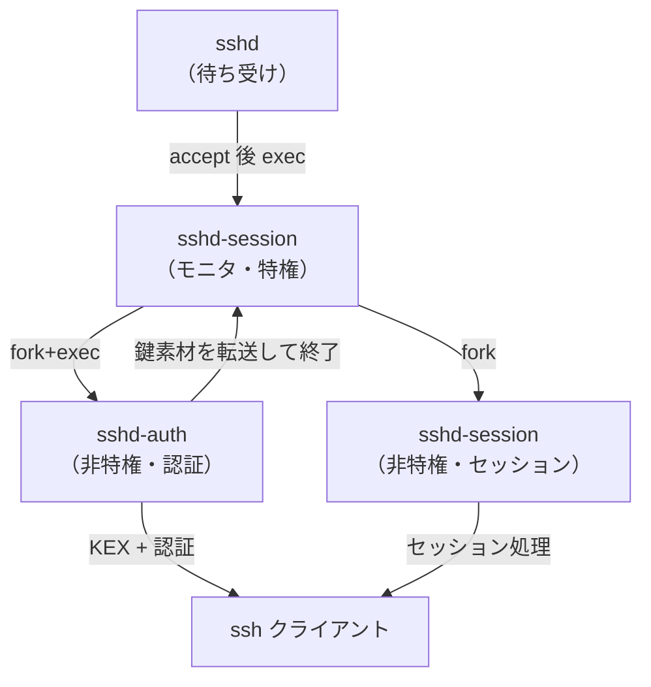

# 第1章 OpenSSH の全体像

> 本章で読むソース
>
> - [`version.h`](https://github.com/openssh/openssh-portable/blob/V_10_3_P1/version.h#L1-L6)
> - [`Makefile.in`](https://github.com/openssh/openssh-portable/blob/V_10_3_P1/Makefile.in#L78-L78)
> - [`sshd.c`](https://github.com/openssh/openssh-portable/blob/V_10_3_P1/sshd.c#L1287-L1904)
> - [`sshd-session.c`](https://github.com/openssh/openssh-portable/blob/V_10_3_P1/sshd-session.c#L783-L1321)
> - [`sshd-auth.c`](https://github.com/openssh/openssh-portable/blob/V_10_3_P1/sshd-auth.c#L435-L771)
> - [`ssh.c`](https://github.com/openssh/openssh-portable/blob/V_10_3_P1/ssh.c#L639-L718)
> - [`ssh-keygen.c`](https://github.com/openssh/openssh-portable/blob/V_10_3_P1/ssh-keygen.c#L3289-L3368)
> - [`ssh-agent.c`](https://github.com/openssh/openssh-portable/blob/V_10_3_P1/ssh-agent.c#L2229-L2308)
> - [`configure.ac`](https://github.com/openssh/openssh-portable/blob/V_10_3_P1/configure.ac#L16-L50)

## この章の狙い

OpenSSH がどのようなプログラム群から構成され、どのようなプロセス構造で動作するのかを大まかに把握する。

## 前提

読者は SSH プロトコルの基本的な概念（暗号化トンネル、公開鍵認証、ポート転送）を理解していることを前提とする。

## OpenSSH の歴史とプロジェクト構成

OpenSSH は OpenBSD プロジェクトの一部として1999年に生まれた。
Tatu Ylonen が開発したオリジナルの SSH（SSH Communications Security 社製）のライセンス制約を受けず、自由に利用・改変できる実装を目指した。
現在では SSH プロトコル version 2 の事実上の標準実装であり、ほぼすべての Unix 系 OS で使われている。

Portable OpenSSH は OpenBSD 上のコードを他の OS に移植したバージョンである。
OpenBSD 由来の API をエミュレーションする `openbsd-compat/` 層、PAM や Kerberos など OS 固有の認証機構への対応、プラットフォームごとの sandbox 機構の追加が、portable 版の主要な差分である。

本ドキュメントが対象とするバージョンは OpenSSH 10.3（タグ `V_10_3_P1`）である。

```c
#define SSH_VERSION	"OpenSSH_10.3"
#define SSH_PORTABLE	"p1"
#define SSH_RELEASE	SSH_VERSION SSH_PORTABLE
```

## プログラム一覧

OpenSSH は次の14の実行ファイルから構成される。

[`Makefile.in`](https://github.com/openssh/openssh-portable/blob/V_10_3_P1/Makefile.in#L78-L78) に全ターゲットが並ぶ。

```makefile
TARGETS=ssh$(EXEEXT) sshd$(EXEEXT) sshd-session$(EXEEXT) sshd-auth$(EXEEXT) ssh-add$(EXEEXT) ssh-keygen$(EXEEXT) ssh-keyscan${EXEEXT} ssh-keysign${EXEEXT} ssh-pkcs11-helper$(EXEEXT) ssh-agent$(EXEEXT) scp$(EXEEXT) sftp-server$(EXEEXT) sftp$(EXEEXT) ssh-sk-helper$(EXEEXT) $(SK_STANDALONE)
```

### クライアントプログラム

**`ssh`**（リモートログインのクライアント）。
設定ファイルの読み込み（`readconf.c`）、サーバへの接続（`sshconnect.c`）、認証（`sshconnect2.c`）、チャネル転送と端末制御（`clientloop.c`）を一貫して行う。
`ssh.c` の `main` 関数（`ssh.c:639`）がエントリポイントである。

**`scp`**（リモートファイルコピー）。
伝送路に ssh を使う `rcp` 由来のプログラムである。

**`sftp`**（SFTP プロトコルを用いた対話的ファイル転送クライアント）。
SSH のサブシステムとして `sftp-server` と通信する。

**`ssh-keygen`**（鍵生成・管理・署名のためのスイスアーミーナイフ）。
ホスト鍵の生成、証明書の作成・検証、`known_hosts` の管理、KRL（Key Revocation List）の操作、SSH 署名の生成までを一手に担う。
`ssh-keygen.c:3289` の `main` 関数で引数に応じて動作を分岐する。

**`ssh-agent`**（認証エージェント）。
秘密鍵をメモリ上に保持し、エージェント転送を通じて認証要求に署名するデーモンである。
`ssh-agent.c:2229` の `main` がエントリポイントである。

**`ssh-add`**（認証エージェントへの鍵の追加・削除・一覧表示）。
`ssh-agent` と通信するためのフロントエンドである。

**`ssh-keyscan`**（リモートホストの公開鍵を収集するツール）。
`known_hosts` の初期構築に使われる。

**`ssh-keysign`**（ホストベース認証で使う署名ヘルパー）。
setuid された補助プログラムであり、ホスト秘密鍵で署名する。

### サーバプログラム

**`sshd`**（接続待ち受け用の親プロセス）。
設定の読み込み、ホスト鍵の準備、listen ソケットの管理を行い、接続を受け付けると `sshd-session` を `exec` する。
`sshd.c:1287` の `main` 関数がエントリポイントである。

**`sshd-session`**（一セッションを処理する特権モニタプロセス）。
`sshd` から re-exec され、実際の接続処理を開始する。
事前認証フェーズでは `sshd-auth` を子プロセスとして `fork` + `exec` し、認証成功後はさらに `fork` して非特権の子プロセスでセッションを実行する。

**`sshd-auth`**（事前認証処理を行う非特権子プロセス）。
`sshd-session` から `fork` + `exec` され、キー交換と認証を担当する。
認証が完了すると、鍵素材を `sshd-session` のモニタに渡して終了する。

### 補助プログラム

**`sftp-server`**（SFTP サブシステムのサーバ実装）。
`sshd-session` からサブシステムとして起動され、ファイル操作要求を処理する。

**`ssh-pkcs11-helper`**（PKCS#11 トークン（スマートカードやハードウェアトークン）との通信を代行する小さなプログラム）。
`ssh-agent` から起動され、トークン上の秘密鍵操作を隔離して実行する。

**`ssh-sk-helper`**（FIDO/U2F セキュリティキー（YubiKey など）との通信を代行するプログラム）。
`ssh-pkcs11-helper` と同様に、署名操作のアドレス空間を `ssh-agent` から分離する。

## v10 でのアーキテクチャ変更：sshd の三分割

OpenSSH 10.0 より前では `sshd` が伝統的に一つのバイナリで接続待ち受け、認証、セッション処理のすべてを担っていた。
v10 ではこれが三つの独立したバイナリに分割された。

設計上の動機は**攻撃表面の分離**である。
認証処理は複雑で脆弱性が発見されやすい一方、認証が通った後のセッション処理は比較的単純である。
両者を別プロセスに分ければ、認証処理のコードにバグがあっても認証が通るまではセッション処理の特権に到達できず、侵入被害を認証フェーズに限定できる。
さらに、親プロセスである `sshd` にはネットワーク待ち受けと設定読み込みだけを残し、プロトコル処理のコードを完全に排除することで、待ち受けプロセスの攻撃表面を最小化している。

次の Mermaid 図が三つのバイナリの関係を示す。



流れは次の通りである。

1. `sshd` がポート22で待ち受ける。
2. 接続を受け付けると `fork` し、子プロセスが `sshd-session` を `exec` する。
   `sshd.c:1771` で `rexec_argv[0]` に `sshd_session_path` を設定し、`execv` で実行する。
3. `sshd-session` はまず設定を受け取り（`recv_rexec_state`）、`privsep_preauth` で `fork` する。
4. 子プロセスは `sshd-auth` を `exec` する（`sshd-session.c:363`）。
5. `sshd-auth` は非特権ユーザに落とされ（`privsep_child_demote`）、キー交換と認証を実施する。
6. 認証成功後、`mm_send_keystate` で鍵素材を親（`sshd-session` の特権モニタ）に渡して終了する。
7. `sshd-session` の特権モニタは認証完了を検知し、`privsep_postauth` で再び `fork` する。
8. 新しい子プロセスが非特権ユーザでセッション処理（シェルやサブシステムの実行）を行う。

## ビルドシステム

OpenSSH は autoconf ベースのビルドシステムを採用している。

**`configure.ac`** が Autoconf の入力であり、OS ごとの機能チェック、ヘッダ・ライブラリの有無、コンパイラフラグの設定を記述する。
`autoreconf` により `configure` スクリプトが生成される。

```m4
AC_INIT([OpenSSH], [Portable], [openssh-unix-dev@mindrot.org])
AC_CONFIG_MACRO_DIR([m4])
AC_CONFIG_SRCDIR([ssh.c])

# Check for stale configure as early as possible.
for i in $srcdir/configure.ac $srcdir/m4/*.m4; do
	if test "$i" -nt "$srcdir/configure"; then
		AC_MSG_ERROR([$i newer than configure, run autoreconf])
	fi
done

AC_LANG([C])

AC_CONFIG_HEADERS([config.h])
AC_PROG_CC([cc gcc clang])

# XXX relax this after reimplementing logit() etc.
AC_MSG_CHECKING([if $CC supports C99-style variadic macros])
AC_COMPILE_IFELSE([AC_LANG_PROGRAM([[
int f(int a, int b, int c) { return a + b + c; }
#define F(a, ...) f(a, __VA_ARGS__)
]], [[return F(1, 2, -3);]])],
	[ AC_MSG_RESULT([yes]) ],
	[ AC_MSG_ERROR([*** OpenSSH requires support for C99-style variadic macros]) ]
)

AC_CANONICAL_HOST
AC_C_BIGENDIAN

# Checks for programs.
AC_PROG_AWK
AC_PROG_CPP
AC_PROG_RANLIB
AC_PROG_INSTALL
AC_PROG_EGREP
```

**`Makefile.in`** が Makefile のテンプレートである。
`configure` が `@CC@` や `@CFLAGS@` などのプレースホルダを実際の値に置換して `Makefile` を生成する。
プログラムのリンクには各バイナリ用のオブジェクトリスト（`SSHOBJS`、`SSHDOBJS` など）が使われる。

ビルドに最低限必要なのは C コンパイラと標準ライブラリのみである。
暗号ライブラリ（LibreSSL / OpenSSL / AWS-LC / BoringSSL）は crypto アルゴリズムの提供に使われ、zlib はトランスポート圧縮に使われる（いずれも省略可能）。

## ディレクトリ構成

ソースツリーは次のような構成である。

| パス | 内容 |
|------|------|
| `*.c`, `*.h` | すべてのソースファイルはトップレベルに置かれる |
| `openbsd-compat/` | OpenBSD 以外の OS 向け互換性レイヤ |
| `m4/` | Autoconf マクロ |
| `contrib/` | 各種 OS 向けの起動スクリプトや設定例 |
| `regress/` | テストスイート |
| `configure.ac` | Autoconf 設定ファイル |
| `Makefile.in` | Makefile テンプレート |

ライブラリとして `libssh.a`（コアライブラリ）がまずビルドされ、各プログラムがこれをリンクする。
`LIBOPENSSH_OBJS` が `ssh_api.o`、`sshbuf.o`、`sshkey.o` などの基本オブジェクトを、`LIBSSH_OBJS` がそれに加えて channels、packet、kex などの通信処理を含む。

## まとめ

OpenSSH はクライアント・サーバ・鍵管理・ファイル転送をカバーする14の実行ファイルから構成される。
v10 ではサーバ側が `sshd`（待ち受け）、`sshd-session`（モニタ）、`sshd-auth`（認証）の三つに分割され、攻撃表面の分離が強化された。
ビルドシステムは autoconf + make を採用し、portable 版は OpenBSD 由来のコードを `openbsd-compat/` 層でラップする。

## 関連する章

- 第3章（sshd の待ち受けと接続受付）
- 第4章（sshd-session のプロセス管理）
- 第5章（sshd-auth の認証処理）
