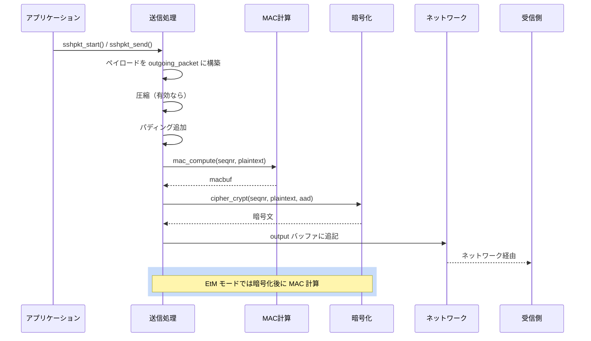

# 第2章 パケットプロトコル

> 本章で読むソース
>
> - [`packet.h`](https://github.com/openssh/openssh-portable/blob/V_10_3_P1/packet.h)
> - [`packet.c`](https://github.com/openssh/openssh-portable/blob/V_10_3_P1/packet.c)

## この章の狙い

SSH トランスポート層は、TCP 上で暗号化・認証されたパケットをやり取りする。
本章では、パケットの構造、暗号化/復号の流れ、圧縮、シーケンス番号によるリプレイ保護、
そして鍵更新（NewKeys）の機構を解説する。

## 前提

[第1章](../part00-overview/01-openssh-overview.md)で説明したように、接続確立後にクライアントとサーバーは
SSH2 バイナリパケットプロトコル（RFC 4253）に従って通信する。

## 中央接続オブジェクト `struct ssh`

接続一つ分の状態は `struct ssh` が保持する。

[`packet.h L55-L92`](https://github.com/openssh/openssh-portable/blob/V_10_3_P1/packet.h#L55-L92)

```c
struct ssh {
	/* Session state */
	struct session_state *state;

	/* Key exchange */
	struct kex *kex;

	/* cached local and remote ip addresses and ports */
	char *remote_ipaddr;
	int remote_port;
	char *local_ipaddr;
	int local_port;
	char *rdomain_in;

	/* Optional preamble for log messages (e.g. username) */
	char *log_preamble;

	/* Dispatcher table */
	dispatch_fn *dispatch[DISPATCH_MAX];
	/* number of packets to ignore in the dispatcher */
	int dispatch_skip_packets;

	/* datafellows */
	uint32_t compat;

	/* Lists for private and public keys */
	TAILQ_HEAD(, key_entry) private_keys;
	TAILQ_HEAD(, key_entry) public_keys;

	/* Client/Server authentication context */
	void *authctxt;

	/* Channels context */
	struct ssh_channels *chanctxt;

	/* APP data */
	void *app_data;
};
```

`struct ssh` はセッション全体を統括する。
内部の `state`（`struct session_state`）がパケット送受信に必要なバッファ、暗号コンテキスト、
シーケンス番号、rekeying 閾値を保持する。

[`packet.c L114-L230`](https://github.com/openssh/openssh-portable/blob/V_10_3_P1/packet.c#L114-L230)

```c
struct session_state {
	int connection_in;
	int connection_out;
	u_int remote_protocol_flags;
	struct sshcipher_ctx *receive_context;
	struct sshcipher_ctx *send_context;
	struct sshbuf *input;
	struct sshbuf *output;
	struct sshbuf *outgoing_packet;
	struct sshbuf *incoming_packet;
	struct sshbuf *compression_buffer;
// ... (中略) ...
	struct newkeys *newkeys[MODE_MAX];
	struct packet_state p_read, p_send;
	uint64_t hard_max_blocks_in, hard_max_blocks_out;
	uint64_t max_blocks_in, max_blocks_out, rekey_limit;
	uint32_t rekey_interval;
	time_t rekey_time;
	u_int packlen;
	int rekeying;
	TAILQ_HEAD(, packet) outgoing;
};
```

`newkeys[MODE_MAX]` は現在アクティブな暗号・MAC・圧縮の設定を保持する。
鍵交換が完了するたびに新しい `newkeys` がここにインストールされる（後述の `ssh_set_newkeys`）。

## SSH2 パケット形式

SSH2 のパケットは次の構造を持つ。

```text
+------------------+------------------+------------------+------------------+
|  packet_length   |  padding_length  |   payload (可変長)  |   padding        |
|    (4 bytes)     |    (1 byte)      |                    |   (可変長)       |
+------------------+------------------+------------------+------------------+
|           MAC (HMAC もしくは AEAD タグ)         |
|             (可変長, 0 のときもある)             |
+------------------------------------------------+
```

`packet_length` は `padding_length` + `payload` + `padding` の合計長を表す。
`padding` は暗号ブロックサイズに揃えるためのもので、最低 4 バイト必要である。
AEAD モード（GCM, ChaCha20-Poly1305）では MAC フィールドが暗号の認証タグに置き換わる。

## 送信処理: `ssh_packet_send2_wrapped()`

パケット送信は `ssh_packet_send2_wrapped()` が担う。

[`packet.c L1220-L1384`](https://github.com/openssh/openssh-portable/blob/V_10_3_P1/packet.c#L1220-L1384)

```c
int
ssh_packet_send2_wrapped(struct ssh *ssh)
{
	struct session_state *state = ssh->state;
	u_char type, *cp, macbuf[SSH_DIGEST_MAX_LENGTH];
	u_char tmp, padlen, pad = 0;
	u_int authlen = 0, aadlen = 0;
	u_int len;
	struct sshenc *enc   = NULL;
	struct sshmac *mac   = NULL;
	struct sshcomp *comp = NULL;
	int r, block_size;

	if (state->newkeys[MODE_OUT] != NULL) {
		enc  = &state->newkeys[MODE_OUT]->enc;
		mac  = &state->newkeys[MODE_OUT]->mac;
		comp = &state->newkeys[MODE_OUT]->comp;
		if ((authlen = cipher_authlen(enc->cipher)) != 0)
			mac = NULL;
	}
	block_size = enc ? enc->block_size : 8;
	aadlen = (mac && mac->enabled && mac->etm) || authlen ? 4 : 0;
// ... (中略) ...
	if (comp && comp->enabled) {
		len = sshbuf_len(state->outgoing_packet);
		if ((r = sshbuf_consume(state->outgoing_packet, 5)) != 0)
			goto out;
// ... (中略 圧縮処理) ...
	}
// ... (中略) ...
	/* compute MAC over seqnr and packet */
	if (mac && mac->enabled && !mac->etm) {
		if ((r = mac_compute(mac, state->p_send.seqnr,
		    sshbuf_ptr(state->outgoing_packet), len,
		    macbuf, sizeof(macbuf))) != 0)
			goto out;
	}
	/* encrypt packet and append to output buffer. */
	if ((r = cipher_crypt(state->send_context, state->p_send.seqnr, cp,
	    sshbuf_ptr(state->outgoing_packet),
	    len - aadlen, aadlen, authlen)) != 0)
		goto out;
// ... (中略) ...
	if (++state->p_send.seqnr == 0) { /* シーケンス番号ラップ対策 */ }
// ... (中略) ...
	if (type == SSH2_MSG_NEWKEYS)
		r = ssh_set_newkeys(ssh, MODE_OUT);
// ... (中略) ...
}
```

処理の流れは次のとおりである。

1. compression: ペイロードが有効なら zlib 圧縮する。
2. padding: `block_size` に合うようにパディング長を計算し、ランダムパディングを追加する。
3. MAC 計算（EaM モード）: 暗号化前に平文の MAC を計算する（Encrypt-and-MAC）。
4. 暗号化: `cipher_crypt()` で暗号化する。AAD（Additional Authenticated Data）があれば一緒に処理する。
5. MAC 付加（EtM モード）: Encrypt-then-MAC なら暗号文に対して MAC を計算する。
6. シーケンス番号をインクリメントする。
7. NEWKEYS メッセージなら `ssh_set_newkeys()` を呼び出して送信側の鍵を切り替える。

## 受信処理: `ssh_packet_read_poll2()`

受信は `ssh_packet_read_poll2()` で行う。

[`packet.c L1619-L1853`](https://github.com/openssh/openssh-portable/blob/V_10_3_P1/packet.c#L1619-L1853)

```c
int
ssh_packet_read_poll2(struct ssh *ssh, u_char *typep, uint32_t *seqnr_p)
{
	struct session_state *state = ssh->state;
	u_int padlen, need;
	u_char *cp;
	u_int maclen, aadlen = 0, authlen = 0, block_size;
	struct sshenc *enc   = NULL;
	struct sshmac *mac   = NULL;
	struct sshcomp *comp = NULL;
	int r;
// ... (中略) ...
	if (aadlen && state->packlen == 0) {
		if (cipher_get_length(state->receive_context,
		    &state->packlen, state->p_read.seqnr,
		    sshbuf_ptr(state->input), sshbuf_len(state->input)) != 0)
			return 0;
	} else if (state->packlen == 0) {
		/* 暗号ブロックを復号してパケット長を取り出す */
		if ((r = cipher_crypt(state->receive_context,
		    state->p_send.seqnr, cp, sshbuf_ptr(state->input),
		    block_size, 0, 0)) != 0)
			goto out;
		state->packlen = PEEK_U32(sshbuf_ptr(state->incoming_packet));
	}
// ... (中略) ...
	/* EtM なら先に MAC 検証 */
	if (mac && mac->enabled && mac->etm) {
		if ((r = mac_check(mac, state->p_read.seqnr,
		    sshbuf_ptr(state->input), aadlen + need, ...)) != 0)
			goto out;
	}
	/* 暗号化データを復号 */
	if ((r = cipher_crypt(state->receive_context, state->p_read.seqnr, cp,
	    sshbuf_ptr(state->input), need, aadlen, authlen)) != 0)
		goto out;
	/* EaM なら平文の MAC を検証 */
	if (mac && mac->enabled) {
		if (!mac->etm && (r = mac_check(mac, state->p_read.seqnr, ...)) != 0)
			goto out;
	}
// ... (中略) ...
	if (comp && comp->enabled) {
		/* 伸長 */
		if ((r = uncompress_buffer(ssh, state->incoming_packet,
		    state->compression_buffer)) != 0)
			goto out;
	}
// ... (中略) ...
	if (*typep == SSH2_MSG_NEWKEYS && ssh->kex->kex_strict) {
		state->p_read.seqnr = 0;  /* strict KEX でシーケンス番号リセット */
	}
// ... (中略) ...
}
```

受信処理は送信の逆順である。

1. パケット長の取得: AEAD モードでは `cipher_get_length()` で、非 AEAD では最初のブロックを復号して取得する。
2. MAC 検証: EtM モードなら復号前に暗号文の MAC を検証する。
3. 復号: `cipher_crypt()` で復号する。
4. MAC 検証（EaM）: 平文の MAC を検証する。
5. 伸長: 圧縮が有効なら `uncompress_buffer()` で伸長する。
6. タイプ取り出し: 先頭バイトからパケットタイプを取得する。

## シーケンス番号とリプレイ保護

各方向（クライアント→サーバー、サーバー→クライアント）に独立した 32 ビットのシーケンス番号がある。
MAC 計算時にはこのシーケンス番号が入力に含まれ、リプレイ攻撃を防止する。

シーケンス番号はカウンターとして管理され、パケットごとにインクリメントされる。
`packet.c L1358-L1364` では、ラップアラウンドが発生すると disconnect または rekey を強制する。
strict KEX モードでは NEWKEYS 受信後にシーケンス番号が 0 にリセットされる（`packet.c L1844-L1847`）。

## 鍵インストール: `ssh_set_newkeys()`

鍵交換で生成された新しい鍵をアクティブにするのが `ssh_set_newkeys()` である。

[`packet.c L971-L1068`](https://github.com/openssh/openssh-portable/blob/V_10_3_P1/packet.c#L971-L1068)

```c
int
ssh_set_newkeys(struct ssh *ssh, int mode)
{
	struct session_state *state = ssh->state;
// ... (中略) ...
	if (state->newkeys[mode] != NULL) {
		kex_free_newkeys(state->newkeys[mode]);
		state->newkeys[mode] = NULL;
	}
	ps->packets = ps->blocks = 0;
	if ((state->newkeys[mode] = ssh->kex->newkeys[mode]) == NULL)
		return SSH_ERR_INTERNAL_ERROR;
	ssh->kex->newkeys[mode] = NULL;
// ... (中略) ...
	if ((r = cipher_init(ccp, enc->cipher, enc->key, enc->key_len,
	    enc->iv, enc->iv_len, crypt_type)) != 0)
		return r;
// ... (中略) ...
	if (enc->block_size >= 16)
		*hard_max_blocks = (uint64_t)1 << (enc->block_size*2);
	else
		*hard_max_blocks = ((uint64_t)1 << 30) / enc->block_size;
// ... (中略) ...
}
```

この関数は次のことを行う。

1. 以前の `newkeys` があれば解放する。
2. `kex->newkeys[mode]` を `state->newkeys[mode]` に移す（鍵の所有権が KEX からセッションに移る）。
3. `cipher_init()` で暗号コンテキストを初期化する。
4. MAC を初期化する。
5. ブロック数ベースの rekey 上限を計算する。

この関数は送信側では NEWKEYS メッセージ送信後に、受信側では NEWKEYS 受信後に呼ばれる。

## Mermaid: パケットの流れ



## 最適化の工夫: Encrypt-then-MAC（EtM）

SSH では二種類の MAC 戦略がある。

- **Encrypt-and-MAC（EaM）**: 平文を MAC で認証する。暗号化前に MAC を計算する（従来方式）。
- **Encrypt-then-MAC（EtM）**: 暗号文を MAC で認証する。復号前に MAC 検証でき、無効なパケットを早期に破棄できる。

EtM は `mac->etm` フラグで区別される（`mac.c L58-L80` の `etm` フィールド）。
`ssh_packet_read_poll2()` では、EtM の場合に MAC 検証を復号より先に行う（`packet.c L1732-L1741`）。
これにより無効なパケットの復号処理を回避でき、セキュリティ（ timing attack の緩和）と性能の両方で利点がある。

## 圧縮の統合

OpenSSH は zlib による圧縮をサポートする（`WITH_ZLIB`）。
`ssh_packet_send2_wrapped()` では、暗号化前に `compress_buffer()` でペイロードを圧縮する（`packet.c L1251-L1268`）。
受信側では復号後に `uncompress_buffer()` で伸長する（`packet.c L1803-L1814`）。

圧縮は遅延圧縮（`COMP_DELAYED`）をサポートし、認証後に有効化される（`ssh_packet_enable_delayed_compress()`,
`packet.c L1168-L1198`）。これにより認証前の圧縮を利用した既知平文攻撃（CRIME など）を防ぐ。

## まとめ

- `struct ssh` が接続全体を管理し、`struct session_state` がパケット送受信の状態を保持する。
- SSH2 パケットは length / padding_length / payload / padding / MAC の構造を持つ。
- 送信は「圧縮 → パディング → MAC（EaM）→ 暗号化 → MAC（EtM）」の順、受信はその逆順で処理する。
- シーケンス番号は MAC 計算に含まれ、リプレイ攻撃を防ぐ。
- `ssh_set_newkeys()` が鍵交換の完了時に新旧の鍵を切り替える。

## 関連する章

- [第3章 鍵交換](03-key-exchange.md): NewKeys のトリガーとなる鍵交換の流れを解説する。
- [第4章 暗号と MAC の抽象化](04-cipher-and-mac.md): `cipher_crypt()` や `mac_compute()` の内部実装を解説する。
