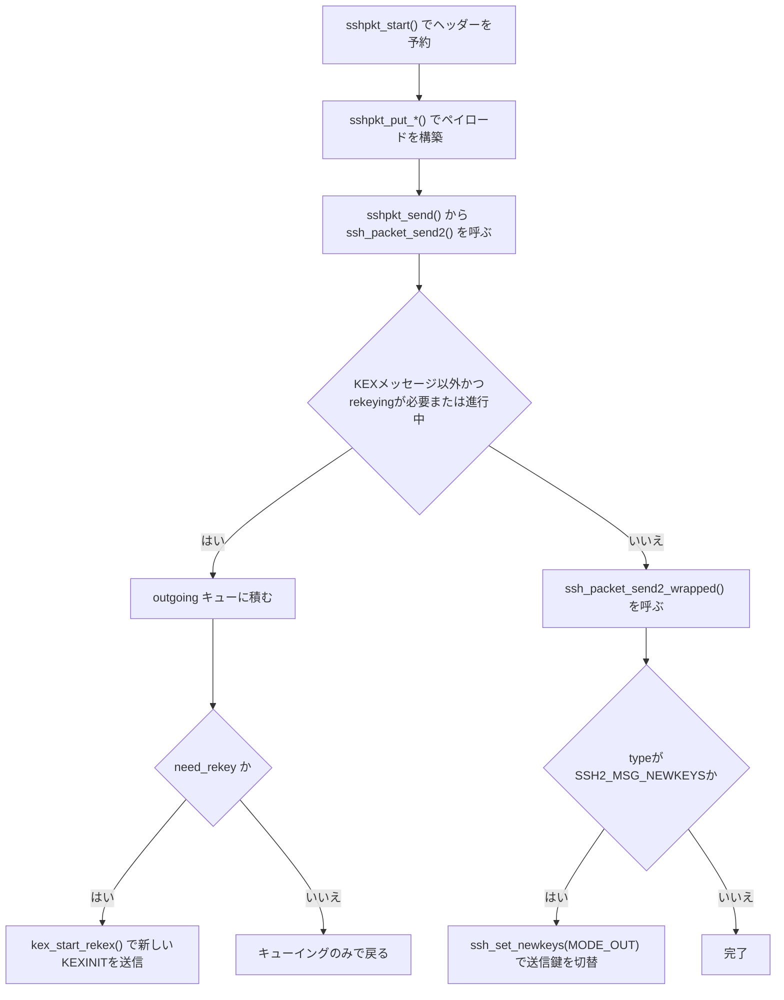
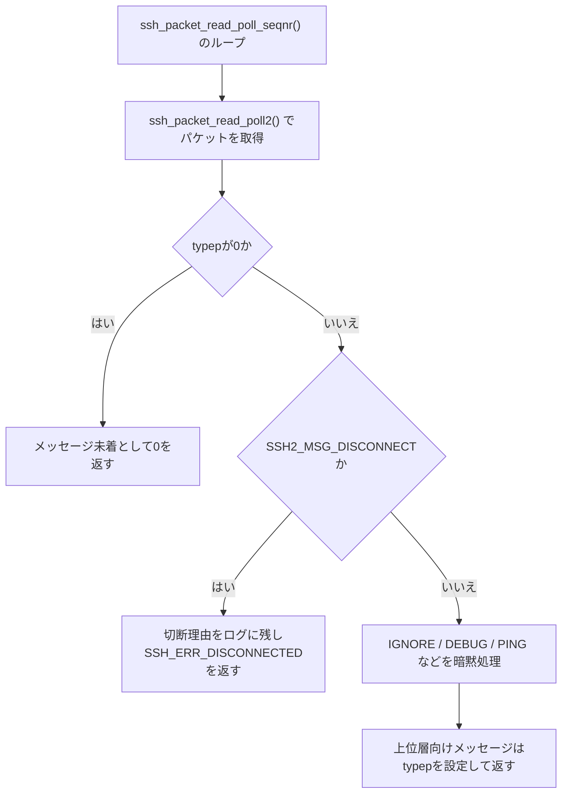
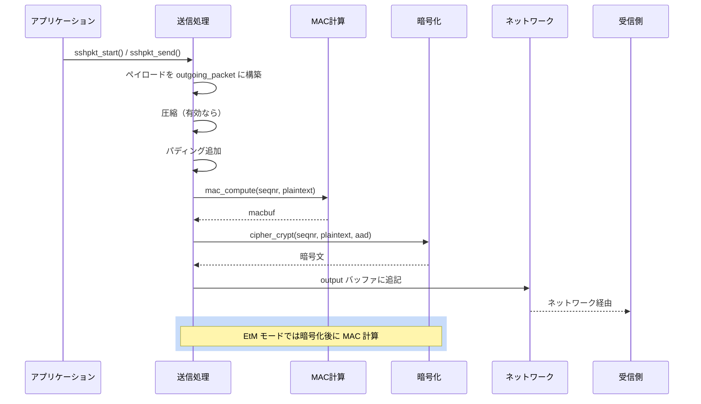

# 第2章 パケットプロトコル

> 本章で読むソース
>
> - [`packet.h`](https://github.com/openssh/openssh-portable/blob/V_10_3_P1/packet.h)
> - [`packet.c`](https://github.com/openssh/openssh-portable/blob/V_10_3_P1/packet.c)

## この章の狙い

SSH トランスポート層は、TCP 上で暗号化され認証されたパケットをやり取りする。
本章では、パケットの構造、暗号化/復号の流れ、圧縮、シーケンス番号によるリプレイ保護、
そして鍵更新（NewKeys）の機構を解説する。

## 前提

[第1章](../part00-overview/01-openssh-overview.md)で説明したように、接続確立後にクライアントとサーバーは
SSH2 バイナリパケットプロトコル（RFC 4253）に従って通信する。

## 中央接続オブジェクト `struct ssh`

接続一つ分の状態は `struct ssh` が保持する。

[`packet.h L55-L92`](https://github.com/openssh/openssh-portable/blob/V_10_3_P1/packet.h#L55-L92)

```c
struct ssh {
	/* Session state */
	struct session_state *state;

	/* Key exchange */
	struct kex *kex;

	/* cached local and remote ip addresses and ports */
	char *remote_ipaddr;
	int remote_port;
	char *local_ipaddr;
	int local_port;
	char *rdomain_in;

	/* Optional preamble for log messages (e.g. username) */
	char *log_preamble;

	/* Dispatcher table */
	dispatch_fn *dispatch[DISPATCH_MAX];
	/* number of packets to ignore in the dispatcher */
	int dispatch_skip_packets;

	/* datafellows */
	uint32_t compat;

	/* Lists for private and public keys */
	TAILQ_HEAD(, key_entry) private_keys;
	TAILQ_HEAD(, key_entry) public_keys;

	/* Client/Server authentication context */
	void *authctxt;

	/* Channels context */
	struct ssh_channels *chanctxt;

	/* APP data */
	void *app_data;
};
```

`struct ssh` はセッション全体を統括する。
内部の `state`（`struct session_state`）がパケット送受信に必要なバッファ、暗号コンテキスト、
シーケンス番号、rekeying 閾値を保持する。

[`packet.c L114-L230`](https://github.com/openssh/openssh-portable/blob/V_10_3_P1/packet.c#L114-L230)

```c
struct session_state {
	int connection_in;
	int connection_out;
	u_int remote_protocol_flags;
	struct sshcipher_ctx *receive_context;
	struct sshcipher_ctx *send_context;
	struct sshbuf *input;
	struct sshbuf *output;
	struct sshbuf *outgoing_packet;
	struct sshbuf *incoming_packet;
	struct sshbuf *compression_buffer;
// ... (中略) ...
	struct newkeys *newkeys[MODE_MAX];
	struct packet_state p_read, p_send;
	uint64_t hard_max_blocks_in, hard_max_blocks_out;
	uint64_t max_blocks_in, max_blocks_out, rekey_limit;
	uint32_t rekey_interval;
	time_t rekey_time;
	u_int packlen;
	int rekeying;
	TAILQ_HEAD(, packet) outgoing;
};
```

`newkeys[MODE_MAX]` は現在アクティブな暗号、MAC、圧縮の設定を保持する。
鍵交換が完了するたびに新しい `newkeys` がここにインストールされる（後述の `ssh_set_newkeys`）。

## SSH2 パケット形式

SSH2 のパケットは次の構造を持つ。

```text
+------------------+------------------+------------------+------------------+
|  packet_length   |  padding_length  |   payload (可変長)  |   padding        |
|    (4 bytes)     |    (1 byte)      |                    |   (可変長)       |
+------------------+------------------+------------------+------------------+
|           MAC (HMAC もしくは AEAD タグ)         |
|             (可変長, 0 のときもある)             |
+------------------------------------------------+
```

`packet_length` は `padding_length` + `payload` + `padding` の合計長を表す。
`padding` は暗号ブロックサイズに揃えるためのもので、最低 4 バイト必要である。
AEAD モード（GCM, ChaCha20-Poly1305）では MAC フィールドが暗号の認証タグに置き換わる。

## 送信処理: 入口から `ssh_packet_send2_wrapped()` まで

パケット送信は三段階で進む。
`sshpkt_start()` が送信バッファを初期化し、呼び出し側が `sshpkt_put_*()` 系の関数でペイロードを積んだ後、`sshpkt_send()` 経由で `ssh_packet_send2()` が呼ばれる。
`ssh_packet_send2()` は rekeying 中かどうかで分岐し、通常時は `ssh_packet_send2_wrapped()` が圧縮からMAC付加までの本処理を行う。

### sshpkt_start(): 送信バッファの初期化

[`packet.c L2835-2844`](https://github.com/openssh/openssh-portable/blob/V_10_3_P1/packet.c#L2835-L2844)

```c
int
sshpkt_start(struct ssh *ssh, u_char type)
{
	u_char buf[6]; /* u32 packet length, u8 pad len, u8 type */

	DBG(debug("packet_start[%d]", type));
	memset(buf, 0, sizeof(buf));
	buf[sizeof(buf) - 1] = type;
	sshbuf_reset(ssh->state->outgoing_packet);
	return sshbuf_put(ssh->state->outgoing_packet, buf, sizeof(buf));
}
```

`outgoing_packet` バッファをリセットし、`packet_length`（4 バイト）と `padding_length`（1 バイト）の領域を予約したうえで、6 バイト目にメッセージタイプを書き込む。
packet_length と padding_length の実際の値は、パディング量が確定する送信処理の終盤（`ssh_packet_send2_wrapped()` 内）で書き戻される。

### ssh_packet_send2(): rekeying 中のキューイング判定

`sshpkt_send()`（[`packet.c L2910-2915`](https://github.com/openssh/openssh-portable/blob/V_10_3_P1/packet.c#L2910-L2915)）は多重化（mux）用でなければ `ssh_packet_send2()` に処理を渡す。

[`packet.c L1399-1479`](https://github.com/openssh/openssh-portable/blob/V_10_3_P1/packet.c#L1399-L1479)

```c
int
ssh_packet_send2(struct ssh *ssh)
{
	struct session_state *state = ssh->state;
	struct packet *p;
	u_char type;
	int r, need_rekey;

	if (sshbuf_len(state->outgoing_packet) < 6)
		return SSH_ERR_INTERNAL_ERROR;
	type = sshbuf_ptr(state->outgoing_packet)[5];
	need_rekey = !ssh_packet_type_is_kex(type) &&
	    ssh_packet_need_rekeying(ssh, sshbuf_len(state->outgoing_packet));
// ... (中略 pre-auth 時の hard rekey limit チェック) ...
	if ((need_rekey || state->rekeying) && !ssh_packet_type_is_kex(type)) {
		if (need_rekey)
			debug3_f("rekex triggered");
		debug("enqueue packet: %u", type);
		p = calloc(1, sizeof(*p));
		if (p == NULL)
			return SSH_ERR_ALLOC_FAIL;
		p->type = type;
		p->payload = state->outgoing_packet;
		TAILQ_INSERT_TAIL(&state->outgoing, p, next);
		state->outgoing_packet = sshbuf_new();
		if (state->outgoing_packet == NULL)
			return SSH_ERR_ALLOC_FAIL;
		if (need_rekey) {
			/*
			 * This packet triggered a rekey, so send the
			 * KEXINIT now.
			 * NB. reenters this function via kex_start_rekex().
			 */
			return kex_start_rekex(ssh);
		}
		return 0;
	}

	if (type == SSH2_MSG_KEXINIT)
		state->rekeying = 1;

	if ((r = ssh_packet_send2_wrapped(ssh)) != 0)
		return r;
// ... (中略 NEWKEYS 送信後にキューをフラッシュする処理) ...
	return 0;
}
```

送信しようとしているパケットの種別は、`outgoing_packet` バッファの 6 バイト目（`sshpkt_start()` が書き込んだタイプフィールド）から取り出す。
KEX メッセージ以外を送ろうとしていて、かつ rekeying が必要またはすでに rekeying 中であれば、パケットを `outgoing` キューへ積んで即座に戻る。
`need_rekey` が真の場合はここで `kex_start_rekex()` を呼び、新しい KEXINIT の送信を開始する。
キューに積んだ通常パケットは NEWKEYS 完了後まで送信を待たされる。
それ以外の通常時は `ssh_packet_send2_wrapped()` を直接呼び出す。
NEWKEYS 送信（`type == SSH2_MSG_NEWKEYS`）が完了すると、キューに溜まったパケットを先頭から取り出して順に `ssh_packet_send2_wrapped()` で送信する。



### ssh_packet_send2_wrapped(): 圧縮、パディング、MAC、暗号化

実際の圧縮、パディング、MAC、暗号化は `ssh_packet_send2_wrapped()` が担う。

[`packet.c L1220-1384`](https://github.com/openssh/openssh-portable/blob/V_10_3_P1/packet.c#L1220-L1384)

```c
int
ssh_packet_send2_wrapped(struct ssh *ssh)
{
	struct session_state *state = ssh->state;
	u_char type, *cp, macbuf[SSH_DIGEST_MAX_LENGTH];
	u_char tmp, padlen, pad = 0;
	u_int authlen = 0, aadlen = 0;
	u_int len;
	struct sshenc *enc   = NULL;
	struct sshmac *mac   = NULL;
	struct sshcomp *comp = NULL;
	int r, block_size;

	if (state->newkeys[MODE_OUT] != NULL) {
		enc  = &state->newkeys[MODE_OUT]->enc;
		mac  = &state->newkeys[MODE_OUT]->mac;
		comp = &state->newkeys[MODE_OUT]->comp;
		if ((authlen = cipher_authlen(enc->cipher)) != 0)
			mac = NULL;
	}
	block_size = enc ? enc->block_size : 8;
	aadlen = (mac && mac->enabled && mac->etm) || authlen ? 4 : 0;
// ... (中略) ...
	if (comp && comp->enabled) {
		len = sshbuf_len(state->outgoing_packet);
		if ((r = sshbuf_consume(state->outgoing_packet, 5)) != 0)
			goto out;
// ... (中略 圧縮処理) ...
	}
// ... (中略 パディング長の計算) ...
	/* compute MAC over seqnr and packet(length fields, payload, padding) */
	if (mac && mac->enabled && !mac->etm) {
		if ((r = mac_compute(mac, state->p_send.seqnr,
		    sshbuf_ptr(state->outgoing_packet), len,
		    macbuf, sizeof(macbuf))) != 0)
			goto out;
	}
	/* encrypt packet and append to output buffer. */
	if ((r = cipher_crypt(state->send_context, state->p_send.seqnr, cp,
	    sshbuf_ptr(state->outgoing_packet),
	    len - aadlen, aadlen, authlen)) != 0)
		goto out;
	/* append unencrypted MAC */
	if (mac && mac->enabled) {
		if (mac->etm) {
			/* EtM: compute mac over aadlen + cipher text */
			if ((r = mac_compute(mac, state->p_send.seqnr,
			    cp, len, macbuf, sizeof(macbuf))) != 0)
				goto out;
		}
		if ((r = sshbuf_put(state->output, macbuf, mac->mac_len)) != 0)
			goto out;
	}
// ... (中略) ...
	/* increment sequence number for outgoing packets */
	if (++state->p_send.seqnr == 0) {
		if ((ssh->kex->flags & KEX_INITIAL) != 0) {
			ssh_packet_disconnect(ssh, "outgoing sequence number "
			    "wrapped during initial key exchange");
		}
		logit("outgoing seqnr wraps around");
	}
// ... (中略) ...
	if (type == SSH2_MSG_NEWKEYS)
		r = ssh_set_newkeys(ssh, MODE_OUT);
	else if (type == SSH2_MSG_USERAUTH_SUCCESS && state->server_side)
		r = ssh_packet_enable_delayed_compress(ssh);
	else
		r = 0;
 out:
	return r;
}
```

処理の流れは次のとおりである。

1. compression: ペイロードが有効なら zlib 圧縮する。
2. padding: `block_size` に合うようにパディング長を計算し、ランダムパディングを追加する。
3. MAC 計算（EaM モード）: 暗号化前に平文の MAC を計算する（Encrypt-and-MAC）。
4. 暗号化: AAD（Additional Authenticated Data）があれば一緒に処理しつつ `cipher_crypt()` で暗号化する。
5. MAC 付加（EtM モード）: Encrypt-then-MAC なら暗号文に対して MAC を計算する。
6. シーケンス番号をインクリメントし、ラップアラウンドが発生した場合は初期鍵交換中なら切断し、それ以外は警告ログのみを出して継続する。
7. NEWKEYS メッセージなら `ssh_set_newkeys()` を呼び出して送信側の鍵を切り替える。
8. 認証成功メッセージ（`SSH2_MSG_USERAUTH_SUCCESS`）を送るときは、サーバー側で遅延圧縮を有効化する。

## 受信処理: 入口から `ssh_packet_read_poll2()` まで

受信も二段階である。
`ssh_packet_read_poll_seqnr()` が読み取りループを回してトランスポート層メッセージを振り分け、実際のパケット解析（復号、MAC 検証、伸長）は `ssh_packet_read_poll2()` が行う。

### ssh_packet_read_poll_seqnr(): 読み取りループとディスパッチ

[`packet.c L1856-1950`](https://github.com/openssh/openssh-portable/blob/V_10_3_P1/packet.c#L1856-L1950)

```c
int
ssh_packet_read_poll_seqnr(struct ssh *ssh, u_char *typep, uint32_t *seqnr_p)
{
	struct session_state *state = ssh->state;
	u_int reason, seqnr;
	int r;
	u_char *msg;
	const u_char *d;
	size_t len;

	for (;;) {
		msg = NULL;
		r = ssh_packet_read_poll2(ssh, typep, seqnr_p);
		if (r != 0)
			return r;
		if (*typep == 0) {
			/* no message ready */
			return 0;
		}
		state->keep_alive_timeouts = 0;
		DBG(debug("received packet type %d", *typep));

		/* Always process disconnect messages */
		if (*typep == SSH2_MSG_DISCONNECT) {
			if ((r = sshpkt_get_u32(ssh, &reason)) != 0 ||
			    (r = sshpkt_get_string(ssh, &msg, NULL)) != 0)
				return r;
// ... (中略 切断理由のログ出力) ...
			free(msg);
			return SSH_ERR_DISCONNECTED;
		}
// ... (中略 strict KEX 中のガードと SSH2_MSG_IGNORE / DEBUG / UNIMPLEMENTED / PING / PONG の暗黙処理) ...
	}
}
```

呼び出し側（`ssh_packet_read()` など）は、このループから `typep` に入ったメッセージタイプを受け取る。
`ssh_packet_read_poll2()` がまだ完全なパケットを受信していなければ `*typep == 0` で戻り、呼び出し側はソケットから追加データを読んでから再試行する。
`SSH2_MSG_DISCONNECT` は常にここで処理し、切断理由をログに残して `SSH_ERR_DISCONNECTED` を返す。
`SSH2_MSG_IGNORE` や `SSH2_MSG_DEBUG`、keepalive 用の `SSH2_MSG_PING`/`SSH2_MSG_PONG` などトランスポート層のメッセージはこの関数内で暗黙に処理され、呼び出し側には渡らない（strict KEX による初期鍵交換中はこの暗黙処理をスキップする）。
それ以外のメッセージ（チャネルデータや認証メッセージなど上位層向け）は `typep` を設定したまま呼び出し側に返す。



### ssh_packet_read_poll2(): 復号、MAC 検証、伸長

パケットの実体を読み取り、復号と MAC 検証を行うのが `ssh_packet_read_poll2()` である。

[`packet.c L1619-1853`](https://github.com/openssh/openssh-portable/blob/V_10_3_P1/packet.c#L1619-L1853)

```c
int
ssh_packet_read_poll2(struct ssh *ssh, u_char *typep, uint32_t *seqnr_p)
{
	struct session_state *state = ssh->state;
	u_int padlen, need;
	u_char *cp;
	u_int maclen, aadlen = 0, authlen = 0, block_size;
	struct sshenc *enc   = NULL;
	struct sshmac *mac   = NULL;
	struct sshcomp *comp = NULL;
	int r;
// ... (中略 鍵、MAC、圧縮コンテキストの取得) ...
	if (aadlen && state->packlen == 0) {
		if (cipher_get_length(state->receive_context,
		    &state->packlen, state->p_read.seqnr,
		    sshbuf_ptr(state->input), sshbuf_len(state->input)) != 0)
			return 0;
// ... (中略 パケット長の妥当性チェック) ...
	} else if (state->packlen == 0) {
		/*
		 * check if input size is less than the cipher block size,
		 * decrypt first block and extract length of incoming packet
		 */
		if (sshbuf_len(state->input) < block_size)
			return 0;
// ... (中略) ...
		if ((r = cipher_crypt(state->receive_context,
		    state->p_send.seqnr, cp, sshbuf_ptr(state->input),
		    block_size, 0, 0)) != 0)
			goto out;
		state->packlen = PEEK_U32(sshbuf_ptr(state->incoming_packet));
// ... (中略) ...
	}
// ... (中略 need バイト数の計算) ...
	/* EtM: check mac over encrypted input */
	if (mac && mac->enabled && mac->etm) {
		if ((r = mac_check(mac, state->p_read.seqnr,
		    sshbuf_ptr(state->input), aadlen + need,
		    sshbuf_ptr(state->input) + aadlen + need + authlen,
		    maclen)) != 0) {
			if (r == SSH_ERR_MAC_INVALID)
				logit("Corrupted MAC on input.");
			goto out;
		}
	}
	if ((r = sshbuf_reserve(state->incoming_packet, aadlen + need,
	    &cp)) != 0)
		goto out;
	if ((r = cipher_crypt(state->receive_context, state->p_read.seqnr, cp,
	    sshbuf_ptr(state->input), need, aadlen, authlen)) != 0)
		goto out;
	if ((r = sshbuf_consume(state->input, aadlen + need + authlen)) != 0)
		goto out;
	if (mac && mac->enabled) {
		/* Not EtM: check MAC over cleartext */
		if (!mac->etm && (r = mac_check(mac, state->p_read.seqnr,
		    sshbuf_ptr(state->incoming_packet),
		    sshbuf_len(state->incoming_packet),
		    sshbuf_ptr(state->input), maclen)) != 0) {
// ... (中略 MAC不一致時のログとdiscard呼び出し) ...
			return ssh_packet_start_discard(ssh, enc, mac,
			    sshbuf_len(state->incoming_packet),
			    PACKET_MAX_SIZE - need - block_size);
		}
		/* Remove MAC from input buffer */
		if ((r = sshbuf_consume(state->input, mac->mac_len)) != 0)
			goto out;
	}
// ... (中略 シーケンス番号のインクリメントとpadlenの取り出し) ...
	if (comp && comp->enabled) {
		sshbuf_reset(state->compression_buffer);
		if ((r = uncompress_buffer(ssh, state->incoming_packet,
		    state->compression_buffer)) != 0)
			goto out;
// ... (中略) ...
	}
// ... (中略 パケットタイプの取り出し) ...
	if (*typep == SSH2_MSG_NEWKEYS && ssh->kex->kex_strict) {
		debug_f("resetting read seqnr %u", state->p_read.seqnr);
		state->p_read.seqnr = 0;
	}

	if ((r = ssh_packet_check_rekey(ssh)) != 0)
		return r;
 out:
	return r;
}
```

受信処理は送信の逆順である。

1. パケット長の取得: AEAD モードでは `cipher_get_length()` で、非 AEAD では最初のブロックを復号して取得する。
2. MAC 検証: EtM モードなら復号前に暗号文の MAC を検証する。
3. 復号: `cipher_crypt()` で復号する。
4. MAC 検証（EaM）: 平文の MAC を検証し、不一致なら `ssh_packet_start_discard()` を呼ぶ（後述）。
5. 伸長: 圧縮が有効なら `uncompress_buffer()` で伸長する。
6. タイプ取り出し: 先頭バイトからパケットタイプを取得し、`ssh_packet_check_rekey()` で rekeying が必要かどうかも確認する。

## MAC 検証失敗時の処理: `ssh_packet_start_discard()`

CBC モードで MAC 検証に失敗した場合、`ssh_packet_read_poll2()` は即座にエラーを返さず、入力を読み捨ててから失敗を報告する。

[`packet.c L411-434`](https://github.com/openssh/openssh-portable/blob/V_10_3_P1/packet.c#L411-L434)

```c
static int
ssh_packet_start_discard(struct ssh *ssh, struct sshenc *enc,
    struct sshmac *mac, size_t mac_already, u_int discard)
{
	struct session_state *state = ssh->state;
	int r;

	if (enc == NULL || !cipher_is_cbc(enc->cipher) || (mac && mac->etm)) {
		if ((r = sshpkt_disconnect(ssh, "Packet corrupt")) != 0)
			return r;
		return SSH_ERR_MAC_INVALID;
	}
	/*
	 * Record number of bytes over which the mac has already
	 * been computed in order to minimize timing attacks.
	 */
	if (mac && mac->enabled) {
		state->packet_discard_mac = mac;
		state->packet_discard_mac_already = mac_already;
	}
	if (sshbuf_len(state->input) >= discard)
		return ssh_packet_stop_discard(ssh);
	state->packet_discard = discard - sshbuf_len(state->input);
	return 0;
}
```

暗号が CBC モードでなく（AEAD や EtM の場合）MAC 検証に失敗したときは、この関数は即座に `sshpkt_disconnect()` で切断する。
CBC モードかつ EaM のときだけ読み捨て経路に入る。
コメントにあるとおり（`in order to minimize timing attacks`）、MAC 検証に失敗するまでの処理時間や読み捨てるバイト数の違いから復号結果に関する情報が漏れることを防ぐための対策である。
`state->packet_discard_mac` に MAC 検証に使ったコンテキストを保持しておき、`ssh_packet_stop_discard()`（`packet.c L384-408`）が呼ばれた時点で `PACKET_MAX_SIZE` に達するまでダミーデータに対して MAC 計算を継続する。
不正なパケットであっても、正しいパケットを最後まで受信した場合とほぼ同じ処理時間や処理量になるようにそろえることで、応答時間の差から情報が漏れるのを防ぐ。

## シーケンス番号とリプレイ保護

各方向（クライアント→サーバー、サーバー→クライアント）に独立した 32 ビットのシーケンス番号がある。
MAC 計算時にはこのシーケンス番号が入力に含まれ、リプレイ攻撃を防止する。

シーケンス番号はカウンターとして管理され、パケットごとにインクリメントされる。
前掲の `ssh_packet_send2_wrapped()` の引用（`packet.c L1358-1364` 相当）で見たとおり、送信側でラップアラウンドが発生すると初期鍵交換中は切断し、それ以外は警告ログのみで継続する。
strict KEX モードでは NEWKEYS 受信後にシーケンス番号が 0 にリセットされる。
これも前掲の `ssh_packet_read_poll2()` の引用（`packet.c L1844-1847` 相当）に含まれている。

## 鍵インストール: `ssh_set_newkeys()`

鍵交換で生成された新しい鍵をアクティブにするのが `ssh_set_newkeys()` である。

[`packet.c L971-L1068`](https://github.com/openssh/openssh-portable/blob/V_10_3_P1/packet.c#L971-L1068)

```c
int
ssh_set_newkeys(struct ssh *ssh, int mode)
{
	struct session_state *state = ssh->state;
// ... (中略) ...
	if (state->newkeys[mode] != NULL) {
		kex_free_newkeys(state->newkeys[mode]);
		state->newkeys[mode] = NULL;
	}
	ps->packets = ps->blocks = 0;
	if ((state->newkeys[mode] = ssh->kex->newkeys[mode]) == NULL)
		return SSH_ERR_INTERNAL_ERROR;
	ssh->kex->newkeys[mode] = NULL;
// ... (中略) ...
	if ((r = cipher_init(ccp, enc->cipher, enc->key, enc->key_len,
	    enc->iv, enc->iv_len, crypt_type)) != 0)
		return r;
// ... (中略) ...
	if (enc->block_size >= 16)
		*hard_max_blocks = (uint64_t)1 << (enc->block_size*2);
	else
		*hard_max_blocks = ((uint64_t)1 << 30) / enc->block_size;
// ... (中略) ...
}
```

この関数は次のことを行う。

1. 以前の `newkeys` があれば解放する。
2. `kex->newkeys[mode]` を `state->newkeys[mode]` に移す（鍵の所有権が KEX からセッションに移る）。
3. `cipher_init()` で暗号コンテキストを初期化する。
4. MAC を初期化する。
5. ブロック数ベースの rekey 上限を計算する。

この関数は送信側では NEWKEYS メッセージ送信後に、受信側では NEWKEYS 受信後に呼ばれる。

## Mermaid: パケットの流れ



## 最適化の工夫: Encrypt-then-MAC（EtM）

SSH では二種類の MAC 戦略がある。

- **Encrypt-and-MAC（EaM）**: 暗号化前に平文を MAC で認証する従来方式である。
- **Encrypt-then-MAC（EtM）**: 暗号文を MAC で認証し、復号前に MAC 検証することで無効なパケットを早期に破棄できる。

EtM は `mac->etm` フラグで区別される（`mac.c L58-L80` の `etm` フィールド）。
`ssh_packet_read_poll2()` では、EtM の場合に MAC 検証を復号より先に行う（`packet.c L1732-L1741`）。
これにより無効なパケットの復号処理を回避でき、セキュリティ（ timing attack の緩和）と性能の両方で利点がある。

## 圧縮の統合

OpenSSH は zlib による圧縮をサポートする（`WITH_ZLIB`）。
`ssh_packet_send2_wrapped()` では、暗号化前に `compress_buffer()` でペイロードを圧縮する（`packet.c L1251-L1268`）。
受信側では復号後に `uncompress_buffer()` で伸長する（`packet.c L1803-L1814`）。

圧縮は遅延圧縮（`COMP_DELAYED`）をサポートし、認証後に有効化される（`ssh_packet_enable_delayed_compress()`, `packet.c L1168-L1198`）。
これは、認証前の圧縮を利用した既知平文攻撃（CRIME など）を防ぐためである。

## まとめ

- `struct ssh` が接続全体を管理し、`struct session_state` がパケット送受信の状態を保持する。
- SSH2 パケットは length / padding_length / payload / padding / MAC の構造を持つ。
- 送信は `sshpkt_start()` でヘッダーを予約し、`ssh_packet_send2()` が rekeying 中かどうかで即時送信とキューイングを分岐し、`ssh_packet_send2_wrapped()` が「圧縮 → パディング → MAC（EaM）→ 暗号化 → MAC（EtM）」の順で処理する。
- 受信は `ssh_packet_read_poll_seqnr()` のループがトランスポート層メッセージを暗黙処理しつつ、`ssh_packet_read_poll2()` が送信の逆順（長さ取得 → MAC 検証 → 復号 → 伸長）で本体を処理する。
- CBC モードで MAC 検証に失敗すると、`ssh_packet_start_discard()` が入力を一定量読み捨ててから失敗を報告し、応答時間の差から情報が漏れるのを防ぐ。
- シーケンス番号は MAC 計算に含まれ、リプレイ攻撃を防ぐ。
- `ssh_set_newkeys()` が鍵交換の完了時に新旧の鍵を切り替える。

## 関連する章

- [第3章 鍵交換](03-key-exchange.md): NewKeys のトリガーとなる鍵交換の流れを解説する。
- [第4章 暗号と MAC の抽象化](04-cipher-and-mac.md): `cipher_crypt()` や `mac_compute()` の内部実装を解説する。
