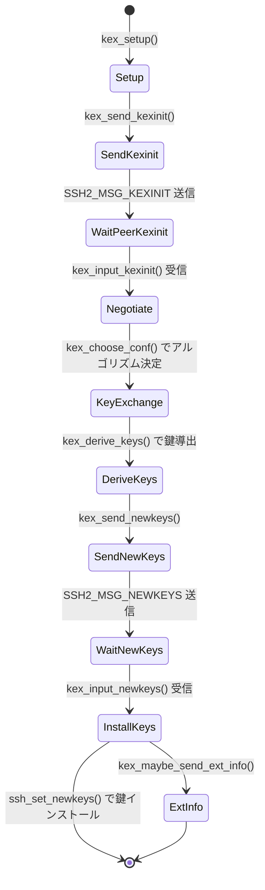
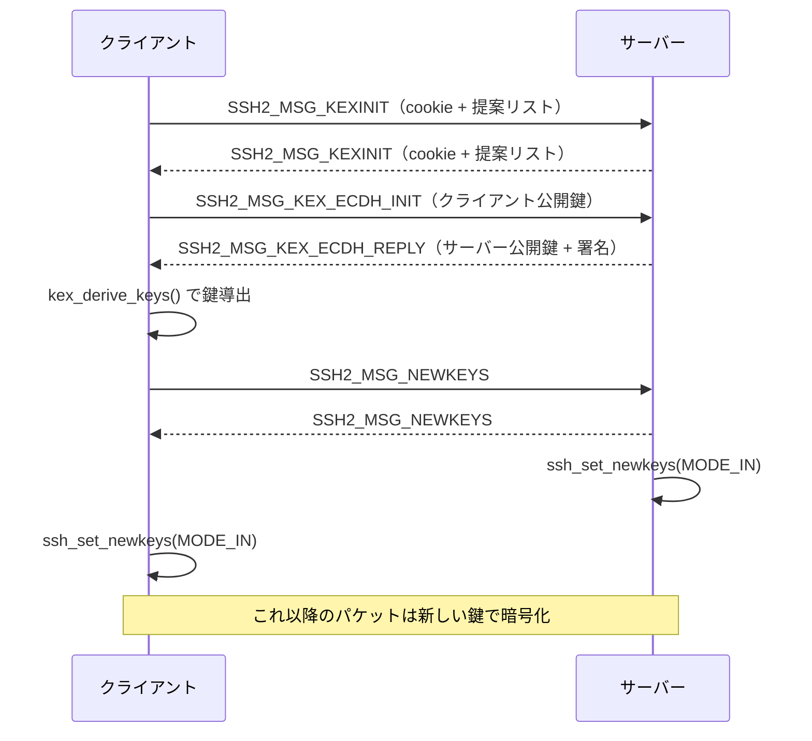

# 第3章 鍵交換

> 本章で読むソース
>
> - [`kex.h`](https://github.com/openssh/openssh-portable/blob/V_10_3_P1/kex.h)
> - [`kex.c`](https://github.com/openssh/openssh-portable/blob/V_10_3_P1/kex.c)
> - [`kex-names.c`](https://github.com/openssh/openssh-portable/blob/V_10_3_P1/kex-names.c)
> - [`myproposal.h`](https://github.com/openssh/openssh-portable/blob/V_10_3_P1/myproposal.h)
> - [`kexdh.c`](https://github.com/openssh/openssh-portable/blob/V_10_3_P1/kexdh.c)
> - [`kexecdh.c`](https://github.com/openssh/openssh-portable/blob/V_10_3_P1/kexecdh.c)
> - [`kexc25519.c`](https://github.com/openssh/openssh-portable/blob/V_10_3_P1/kexc25519.c)
> - [`kexmlkem768x25519.c`](https://github.com/openssh/openssh-portable/blob/V_10_3_P1/kexmlkem768x25519.c)
> - [`kexsntrup761x25519.c`](https://github.com/openssh/openssh-portable/blob/V_10_3_P1/kexsntrup761x25519.c)

## この章の狙い

SSH の鍵交換は、暗号化と認証に使う鍵を通信相手と安全に共有するためのプロトコルである。
本章では、KEX の状態機械、アルゴリズム交渉、各鍵交換方式（DH, ECDH, Curve25519）、
耐量子ハイブリッド KEM（ML-KEM, NTRU Prime）、および rekeying の仕組みを解説する。

## 前提

[第2章](02-packet-protocol.md)で述べたように、暗号化・MAC のための鍵は接続開始時には未設定であり、
KEX が完了した時点で `ssh_set_newkeys()` によりインストールされる。

## KEX 状態機械

鍵交換は以下の状態遷移で進行する。



以下、各ステップを実装コードとともに見ていく。

### kex_setup()

[`kex.c L767-L779`](https://github.com/openssh/openssh-portable/blob/V_10_3_P1/kex.c#L767-L779)

```c
int
kex_setup(struct ssh *ssh, char *proposal[PROPOSAL_MAX])
{
	int r;

	if ((r = kex_ready(ssh, proposal)) != 0)
		return r;
	if ((r = kex_send_kexinit(ssh)) != 0) {		/* we start */
		kex_free(ssh->kex);
		ssh->kex = NULL;
		return r;
	}
	return 0;
}
```

`kex_setup()` は KEX 開始のエントリポイントである。
`kex_ready()` が提案リストをバッファに詰め、ディスパッチャに `SSH2_MSG_KEXINIT` のハンドラを登録した後、
`kex_send_kexinit()` で自らの KEXINIT メッセージを送信する。

### kex_send_kexinit()

[`kex.c L574-L609`](https://github.com/openssh/openssh-portable/blob/V_10_3_P1/kex.c#L574-L609)

```c
int
kex_send_kexinit(struct ssh *ssh)
{
	u_char *cookie;
	struct kex *kex = ssh->kex;
	int r;
// ... (中略) ...
	kex->done = 0;
	cookie = sshbuf_mutable_ptr(kex->my);
	arc4random_buf(cookie, KEX_COOKIE_LEN);
// ... (中略) ...
	if ((r = sshpkt_start(ssh, SSH2_MSG_KEXINIT)) != 0 ||
	    (r = sshpkt_putb(ssh, kex->my)) != 0 ||
	    (r = sshpkt_send(ssh)) != 0) {
		return r;
	}
	kex->flags |= KEX_INIT_SENT;
	return 0;
}
```

16 バイトのランダムな cookie を生成し、提案リストを乗せた KEXINIT メッセージを送信する。

### kex_input_kexinit()

[`kex.c L612-L671`](https://github.com/openssh/openssh-portable/blob/V_10_3_P1/kex.c#L612-L671)

```c
int
kex_input_kexinit(int type, uint32_t seq, struct ssh *ssh)
{
	struct kex *kex = ssh->kex;
// ... (中略) ...
	ptr = sshpkt_ptr(ssh, &dlen);
	if ((r = sshbuf_put(kex->peer, ptr, dlen)) != 0)
		return r;
// ... (中略: cookie と提案を読み飛ばす) ...
	if (!(kex->flags & KEX_INIT_SENT))
		if ((r = kex_send_kexinit(ssh)) != 0)
			return r;
	if ((r = kex_choose_conf(ssh, seq)) != 0)
		return r;
	if (kex->kex_type < KEX_MAX && kex->kex[kex_type] != NULL)
		return (kex->kex[kex->kex_type])(ssh);
// ... (中略) ...
}
```

相手の KEXINIT を受信すると、自らの KEXINIT が未送信なら先に送信し、
`kex_choose_conf()` でアルゴリズムを選び、選ばれた KEX メソッドの関数ポインタを呼び出す。

### kex_choose_conf()

[`kex.c L931-L1061`](https://github.com/openssh/openssh-portable/blob/V_10_3_P1/kex.c#L931-L1061)

```c
static int
kex_choose_conf(struct ssh *ssh, uint32_t seq)
{
	struct kex *kex = ssh->kex;
	struct newkeys *newkeys;
	char **my = NULL, **peer = NULL;
	char **cprop, **sprop;
// ... (中略) ...
	/* Algorithm Negotiation */
	if ((r = choose_kex(kex, cprop[PROPOSAL_KEX_ALGS],
	    sprop[PROPOSAL_KEX_ALGS])) != 0)
		goto out;
	if ((r = choose_hostkeyalg(kex, cprop[PROPOSAL_SERVER_HOST_KEY_ALGS],
	    sprop[PROPOSAL_SERVER_HOST_KEY_ALGS])) != 0)
		goto out;
	for (mode = 0; mode < MODE_MAX; mode++) {
		if ((newkeys = calloc(1, sizeof(*newkeys))) == NULL) {
			r = SSH_ERR_ALLOC_FAIL;
			goto out;
		}
		kex->newkeys[mode] = newkeys;
		// 方向別に暗号・MAC・圧縮を選択
		if ((r = choose_enc(&newkeys->enc, cprop[nenc],
		    sprop[nenc])) != 0)
			goto out;
		if ((r = choose_mac(ssh, &newkeys->mac, cprop[nmac],
		    sprop[nmac])) != 0)
			goto out;
		if ((r = choose_comp(&newkeys->comp, cprop[ncomp],
		    sprop[ncomp])) != 0)
			goto out;
	}
// ... (中略) ...
}
```

`kex_choose_conf()` は次の 6 種類のアルゴリズムを両方向（ctos/stoc）について選択する。

- 鍵交換アルゴリズム（`choose_kex`）
- ホスト鍵アルゴリズム（`choose_hostkeyalg`）
- 暗号アルゴリズム（`choose_enc`）
- MAC アルゴリズム（`choose_mac`）
- 圧縮アルゴリズム（`choose_comp`）

選択は `match_list()`（`match.c`）によるパターンマッチで、クライアント提案とサーバー提案の
共通部分から最初のアルゴリズムを選ぶ。

### kex_derive_keys()

[`kex.c L1129-L1165`](https://github.com/openssh/openssh-portable/blob/V_10_3_P1/kex.c#L1129-L1165)

```c
int
kex_derive_keys(struct ssh *ssh, u_char *hash, u_int hashlen,
    const struct sshbuf *shared_secret)
{
	struct kex *kex = ssh->kex;
	u_char *keys[NKEYS];
	u_int i, j, mode, ctos;
	int r;
// ... (中略) ...
	for (i = 0; i < NKEYS; i++) {
		if ((r = derive_key(ssh, 'A'+i, kex->we_need, hash, hashlen,
		    shared_secret, &keys[i])) != 0)
			return r;
	}
	for (mode = 0; mode < MODE_MAX; mode++) {
		ctos = (!kex->server && mode == MODE_OUT) ||
		    (kex->server && mode == MODE_IN);
		kex->newkeys[mode]->enc.iv  = keys[ctos ? 0 : 1];
		kex->newkeys[mode]->enc.key = keys[ctos ? 2 : 3];
		kex->newkeys[mode]->mac.key = keys[ctos ? 4 : 5];
	}
	return 0;
}
```

`derive_key()`（`kex.c L1064-L1125`）は RFC 4253 の鍵導出を実装する。
`K = HASH(K || H || letter || session_id)` の形で 6 つの鍵（IV 2 つ + 暗号鍵 2 つ + MAC 鍵 2 つ）を導出する。
`derive_key()` 内のループ（`kex.c L1101-L1113`）は「必要バイト数までハッシュを伸長する」処理で、
`Kn = HASH(K || H || K1 || K2 || ... || Kn-1)` と繰り返して十分な鍵長を得る。

### kex_send_newkeys() と kex_input_newkeys()

`kex_send_newkeys()`（`kex.c L391-L405`）は SSH2_MSG_NEWKEYS を送信し、ディスパッチャを設定する。
`kex_input_newkeys()`（`kex.c L528-L571`）は NEWKEYS 受信時に呼ばれ、`ssh_set_newkeys()` で
受信側の鍵をインストールした後、`kex->done = 1` で KEX 完了を記録する。

## アルゴリズム提案

デフォルトの提案リストは `myproposal.h` で定義される（サーバーとクライアントで異なる）。

[`myproposal.h L27-L121`](https://github.com/openssh/openssh-portable/blob/V_10_3_P1/myproposal.h#L27-L121)

```c
#define KEX_SERVER_KEX	\
	"mlkem768x25519-sha256," \
	"sntrup761x25519-sha512," \
	// ... (中略) ...
	"ecdh-sha2-nistp521" \

#define KEX_CLIENT_KEX KEX_SERVER_KEX "," \
	"diffie-hellman-group-exchange-sha256," \
	"diffie-hellman-group16-sha512," \
	"diffie-hellman-group18-sha512," \
	"diffie-hellman-group14-sha256"

#define KEX_SERVER_ENCRYPT \
	"chacha20-poly1305@openssh.com," \
	"aes128-gcm@openssh.com,aes256-gcm@openssh.com," \
	"aes128-ctr,aes192-ctr,aes256-ctr"
// ... (中略) ...
```

サーバーの KEX 提案は `mlkem768x25519-sha256` を最優先に置いている。
クライアントの提案はサーバー提案に DH グループ交換を追加した構成である。
暗号は `chacha20-poly1305@openssh.com` を最優先としている。

## 各鍵交換方式

### Diffie-Hellman（kexdh.c）

[`kexdh.c L46-L68`](https://github.com/openssh/openssh-portable/blob/V_10_3_P1/kexdh.c#L46-L68)

```c
int
kex_dh_keygen(struct kex *kex)
{
	switch (kex->kex_type) {
	case KEX_DH_GRP1_SHA1:
		kex->dh = dh_new_group1();
		break;
	case KEX_DH_GRP14_SHA1:
	case KEX_DH_GRP14_SHA256:
		kex->dh = dh_new_group14();
		break;
// ... (中略) ...
	}
	return (dh_gen_key(kex->dh, kex->we_need * 8));
}
```

OpenSSL の DH 実装を用いる。グループ 1（768 ビット）、14（2048 ビット）、16（4096 ビット）、
18（8192 ビット）のいずれかを選択する。

### ECDH（kexecdh.c）

[`kexecdh.c L49-L88`](https://github.com/openssh/openssh-portable/blob/V_10_3_P1/kexecdh.c#L49-L88)

```c
int
kex_ecdh_keypair(struct kex *kex)
{
	EC_KEY *client_key = NULL;
	const EC_GROUP *group;
	const EC_POINT *public_key;
	struct sshbuf *buf = NULL;
	int r;

	if ((client_key = EC_KEY_new_by_curve_name(kex->ec_nid)) == NULL)
		goto out;
	if (EC_KEY_generate_key(client_key) != 1)
		goto out;
// ... (中略) ...
}
```

NIST P-256, P-384, P-521 のいずれかを用いる。OpenSSL の ECC 実装に依存する。

### Curve25519（kexc25519.c）

[`kexc25519.c L49-L56`](https://github.com/openssh/openssh-portable/blob/V_10_3_P1/kexc25519.c#L49-L56)

```c
void
kexc25519_keygen(u_char key[CURVE25519_SIZE], u_char pub[CURVE25519_SIZE])
{
	static const u_char basepoint[CURVE25519_SIZE] = {9};

	arc4random_buf(key, CURVE25519_SIZE);
	crypto_scalarmult_curve25519(pub, key, basepoint);
}
```

Curve25519 は DH より高速な楕円曲線 Diffie-Hellman である。
NIST 曲線と異なり定数時間実装が容易で、サイドチャネル耐性に優れる。
OpenSSL がなくても利用できる（`#ifdef HAVE_EVP_SHA256 || !WITH_OPENSSL`）。

### ML-KEM 768 + X25519 ハイブリッド（kexmlkem768x25519.c）

[`kexmlkem768x25519.c L49-L85`](https://github.com/openssh/openssh-portable/blob/V_10_3_P1/kexmlkem768x25519.c#L49-L85)

```c
int
kex_kem_mlkem768x25519_keypair(struct kex *kex)
{
	struct sshbuf *buf = NULL;
	u_char rnd[LIBCRUX_ML_KEM_KEY_PAIR_PRNG_LEN], *cp = NULL;
	size_t need;
	int r;
	struct libcrux_mlkem768_keypair keypair;
// ... (中略) ...
	keypair = libcrux_ml_kem_mlkem768_portable_generate_key_pair(rnd);
	memcpy(cp, keypair.pk.value, crypto_kem_mlkem768_PUBLICKEYBYTES);
	memcpy(kex->mlkem768_client_key, keypair.sk.value,
	    sizeof(kex->mlkem768_client_key));
	cp += crypto_kem_mlkem768_PUBLICKEYBYTES;
	kexc25519_keygen(kex->c25519_client_key, cp);
// ... (中略) ...
}
```

ML-KEM 768 は NIST が標準化した耐量子 KEM（Key Encapsulation Mechanism）である。
`kexmlkem768x25519.c` では ML-KEM 768 と X25519 をハイブリッドで組み合わせる。
両方の鍵交換結果を SHA-256 で結合し、そのダイジェストを shared secret として使う（`kex.c L163-L166` 相当）。
どちらか一方が破られても安全性が保たれる（hybrid security）。

### Streamlined NTRU Prime 761 + X25519 ハイブリッド（kexsntrup761x25519.c）

[`kexsntrup761x25519.c L47-L74`](https://github.com/openssh/openssh-portable/blob/V_10_3_P1/kexsntrup761x25519.c#L47-L74)

```c
int
kex_kem_sntrup761x25519_keypair(struct kex *kex)
{
// ... (中略) ...
	crypto_kem_sntrup761_keypair(cp, kex->sntrup761_client_key);
	cp += crypto_kem_sntrup761_PUBLICKEYBYTES;
	kexc25519_keygen(kex->c25519_client_key, cp);
// ... (中略) ...
}
```

NTRU Prime 761 は別の耐量子 KEM であり、こちらも X25519 とのハイブリッド構成をとる。
`kexsntrup761x25519.c` の構造は `kexmlkem768x25519.c` と同一である。

### KEX アルゴリズムの対応表

[`kex-names.c L53-L90`](https://github.com/openssh/openssh-portable/blob/V_10_3_P1/kex-names.c#L53-L90)

```c
static const struct kexalg kexalgs[] = {
	{ KEX_DH1, KEX_DH_GRP1_SHA1, 0, SSH_DIGEST_SHA1, KEX_NOT_PQ },
	{ KEX_DH14_SHA256, KEX_DH_GRP14_SHA256, 0, SSH_DIGEST_SHA256, KEX_NOT_PQ },
// ... (中略) ...
	{ KEX_ECDH_SHA2_NISTP256, KEX_ECDH_SHA2,
	    NID_X9_62_prime256v1, SSH_DIGEST_SHA256, KEX_NOT_PQ },
	{ KEX_CURVE25519_SHA256, KEX_C25519_SHA256, 0, SSH_DIGEST_SHA256, KEX_NOT_PQ },
	{ KEX_SNTRUP761X25519_SHA512, KEX_KEM_SNTRUP761X25519_SHA512, 0,
	    SSH_DIGEST_SHA512, KEX_IS_PQ },
	{ KEX_MLKEM768X25519_SHA256, KEX_KEM_MLKEM768X25519_SHA256, 0,
	    SSH_DIGEST_SHA256, KEX_IS_PQ },
	{ NULL, 0, -1, -1, 0 },
};
```

各アルゴリズムは `struct kexalg` で名前、種別、楕円曲線 NID、ハッシュ関数、耐量子フラグを持つ。
`kex_type_from_name()` が名前から `kex_type` を解決し、`kex->kex[kex_type]` の関数ポインタで
実際の鍵交換処理がディスパッチされる。

## Rekeying

鍵交換（KEX）は最初の接続時だけでなく、その後も定期的に行われる（rekeying）。
トリガーは次の三つである。

- **ブロック数ベース**: 暗号の安全性限界（`ssh_set_newkeys()` で計算、`packet.c L1056-L1059`）
- **パケット数ベース**: `MAX_PACKETS`（2^31）に達した場合（`packet.c L1091-L1093`）
- **時間ベース**: `rekey_interval` 秒を経過した場合（`packet.c L1128-L1130`）

`ssh_packet_need_rekeying()`（`packet.c L1108-L1133`）で条件をチェックし、
`kex_start_rekex()`（`kex.c L786-L798`）で新しい KEXINIT を送信する。

Rekey 中は通常のパケットがキューイングされる（`ssh_packet_send2()` `packet.c L1421-L1442`）。
NEWKEYS 送信後にキューがフラッシュされる。

## Mermaid: KEX メッセージシーケンス（クライアント起点）



耐量子ハイブリッド KEM の場合、`KEX_ECDH_INIT` / `KEX_ECDH_REPLY` の代わりに
KEM 固有のメッセージ（暗号文の交換）が行われる。

## 最適化の工夫: KEX の関数ポインタテーブル

`struct kex` は `int (*kex[KEX_MAX])(struct ssh *)` という関数ポインタ配列を持つ（`kex.h L180`）。
`kex_choose_conf()` で `kex_type` が決まった後は、`kex->kex[kex_type]` を直接呼び出すだけで
対応する鍵交換処理（`kex_gen_client`, `kex_gen_server` など）に分岐できる。

```c
if (kex->kex_type < KEX_MAX && kex->kex[kex_type] != NULL)
    return (kex->kex[kex->kex_type])(ssh);
```

この設計では、新しい鍵交換方式を追加するときは（1）`enum kex_exchange` に値を追加し、
（2）`kex->kex[type]` に関数ポインタを代入するだけで済む。
`kex-names.c` の `kexalgs[]` テーブルは名前と内部種別の対応を一元管理し、
switch 文の分散を防いでいる。

## まとめ

- KEX の状態機械は `kex_setup()` → `kex_send_kexinit()` → `kex_input_kexinit()` → `kex_choose_conf()`
  → 鍵交換処理 → `kex_derive_keys()` → NEWKEYS 送受信 → `ssh_set_newkeys()` の順に進行する。
- アルゴリズム交渉は `myproposal.h` のデフォルト提案をベースに `match_list()` で共通部分を選ぶ。
- 鍵交換方式として DH（OpenSSL）、ECDH（OpenSSL）、Curve25519（組み込み）、
  ML-KEM 768 + X25519（耐量子ハイブリッド）、NTRU Prime 761 + X25519（耐量子ハイブリッド）をサポートする。
- Rekeying はブロック数・パケット数・経過時間の三つの条件でトリガーされる。

## 関連する章

- [第2章 パケットプロトコル](02-packet-protocol.md): NewKeys による鍵インストールの詳細を解説する。
- [第4章 暗号と MAC の抽象化](04-cipher-and-mac.md): 鍵交換で選ばれた暗号・MAC の実装を解説する。
