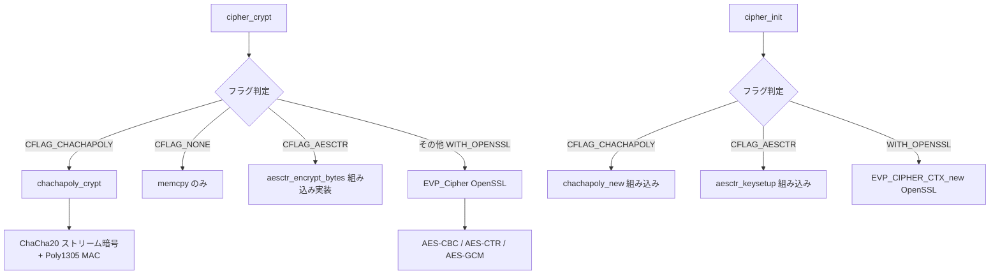
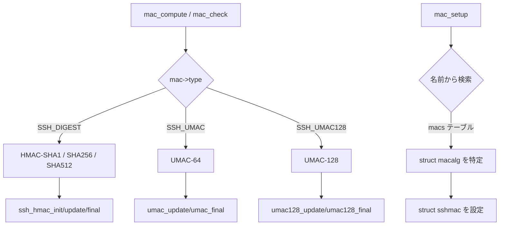

# 第4章 暗号と MAC の抽象化

> 本章で読むソース
>
> - [`cipher.h`](https://github.com/openssh/openssh-portable/blob/V_10_3_P1/cipher.h)
> - [`cipher.c`](https://github.com/openssh/openssh-portable/blob/V_10_3_P1/cipher.c)
> - [`cipher-chachapoly.h`](https://github.com/openssh/openssh-portable/blob/V_10_3_P1/cipher-chachapoly.h)
> - [`cipher-chachapoly.c`](https://github.com/openssh/openssh-portable/blob/V_10_3_P1/cipher-chachapoly.c)
> - [`chacha.c`](https://github.com/openssh/openssh-portable/blob/V_10_3_P1/chacha.c)
> - [`poly1305.c`](https://github.com/openssh/openssh-portable/blob/V_10_3_P1/poly1305.c)
> - [`mac.h`](https://github.com/openssh/openssh-portable/blob/V_10_3_P1/mac.h)
> - [`mac.c`](https://github.com/openssh/openssh-portable/blob/V_10_3_P1/mac.c)
> - [`umac.c`](https://github.com/openssh/openssh-portable/blob/V_10_3_P1/umac.c)
> - [`digest.h`](https://github.com/openssh/openssh-portable/blob/V_10_3_P1/digest.h)
> - [`digest.c`](https://github.com/openssh/openssh-portable/blob/V_10_3_P1/digest.c)

## この章の狙い

OpenSSH は暗号・MAC を統一的に扱う抽象化層を持つ。
本章では `cipher.c` の暗号ディスパッチ機構、`mac.c` の MAC 抽象化、
独自実装の ChaCha20-Poly1305 AEAD、UMAC（高速 MAC）、
そして `digest.c` のハッシュ関数 API を解説する。

## 前提

[第2章](02-packet-protocol.md)と[第3章](03-key-exchange.md)で見たように、
鍵交換で選ばれた暗号と MAC は `packet.c` の `cipher_crypt()` と `mac_compute()` から
呼び出される。

## 暗号抽象化層 cipher.c

### 暗号アルゴリズムの登録

[`cipher.c L85-L110`](https://github.com/openssh/openssh-portable/blob/V_10_3_P1/cipher.c#L85-L110)

```c
static const struct sshcipher ciphers[] = {
#ifdef WITH_OPENSSL
	{ "3des-cbc",		8, 24, 0, 0, CFLAG_CBC, EVP_des_ede3_cbc },
	{ "aes128-cbc",		16, 16, 0, 0, CFLAG_CBC, EVP_aes_128_cbc },
	{ "aes192-cbc",		16, 24, 0, 0, CFLAG_CBC, EVP_aes_192_cbc },
	{ "aes256-cbc",		16, 32, 0, 0, CFLAG_CBC, EVP_aes_256_cbc },
	{ "aes128-ctr",		16, 16, 0, 0, 0, EVP_aes_128_ctr },
	{ "aes192-ctr",		16, 24, 0, 0, 0, EVP_aes_192_ctr },
	{ "aes256-ctr",		16, 32, 0, 0, 0, EVP_aes_256_ctr },
	{ "aes128-gcm@openssh.com", 16, 16, 12, 16, 0, EVP_aes_128_gcm },
	{ "aes256-gcm@openssh.com", 16, 32, 12, 16, 0, EVP_aes_256_gcm },
#else
	{ "aes128-ctr",		16, 16, 0, 0, CFLAG_AESCTR, NULL },
	{ "aes192-ctr",		16, 24, 0, 0, CFLAG_AESCTR, NULL },
	{ "aes256-ctr",		16, 32, 0, 0, CFLAG_AESCTR, NULL },
#endif
	{ "chacha20-poly1305@openssh.com", 8, 64, 0, 16, CFLAG_CHACHAPOLY, NULL },
	{ "none",		8, 0, 0, 0, CFLAG_NONE, NULL },
	{ NULL,			0, 0, 0, 0, 0, NULL }
};
```

`struct sshcipher`（`cipher.c L66-L83`）は名前、ブロックサイズ、鍵長、IV 長、認証タグ長、
フラグ、そして OpenSSL EVP 関数ポインタを持つ。

```c
struct sshcipher {
	char	*name;
	u_int	block_size;
	u_int	key_len;
	u_int	iv_len;
	u_int	auth_len;
	u_int	flags;
#define CFLAG_CBC		(1<<0)
#define CFLAG_CHACHAPOLY	(1<<1)
#define CFLAG_AESCTR		(1<<2)
#define CFLAG_NONE		(1<<3)
#ifdef WITH_OPENSSL
	const EVP_CIPHER	*(*evptype)(void);
#else
	void	*ignored;
#endif
};
```

フラグは実装方式を区別する（CBC は OpenSSL EVP、CHACHAPOLY は組み込み実装、
AESCTR は OpenSSL なしの場合の組み込み AES-CTR）。

### cipher_by_name()

[`cipher.c L192-L200`](https://github.com/openssh/openssh-portable/blob/V_10_3_P1/cipher.c#L192-L200)

```c
const struct sshcipher *
cipher_by_name(const char *name)
{
	const struct sshcipher *c;
	for (c = ciphers; c->name != NULL; c++)
		if (strcmp(c->name, name) == 0)
			return c;
	return NULL;
}
```

名前で暗号を線形探索する。ciphers[] は要素数が少ないため線形探索で十分である。

### cipher_init()

[`cipher.c L236-L322`](https://github.com/openssh/openssh-portable/blob/V_10_3_P1/cipher.c#L236-L322)

```c
int
cipher_init(struct sshcipher_ctx **ccp, const struct sshcipher *cipher,
    const u_char *key, u_int keylen, const u_char *iv, u_int ivlen,
    int do_encrypt)
{
	struct sshcipher_ctx *cc = NULL;
// ... (中略) ...
	cc->cipher = cipher;
	if ((cc->cipher->flags & CFLAG_CHACHAPOLY) != 0) {
		cc->cp_ctx = chachapoly_new(key, keylen);
		goto out;
	}
	if ((cc->cipher->flags & CFLAG_NONE) != 0) {
		ret = 0;
		goto out;
	}
#ifndef WITH_OPENSSL
	if ((cc->cipher->flags & CFLAG_AESCTR) != 0) {
		aesctr_keysetup(&cc->ac_ctx, key, 8 * keylen, 8 * ivlen);
		aesctr_ivsetup(&cc->ac_ctx, iv);
		goto out;
	}
#else
	type = (*cipher->evptype)();
	cc->evp = EVP_CIPHER_CTX_new();
	EVP_CipherInit(cc->evp, type, NULL, (u_char *)iv, do_encrypt);
// ... (中略) ...
#endif
}
```

`cipher_init()` はフラグに応じて三つの経路に分岐する。

1. **ChaCha20-Poly1305**: 組み込みの `chachapoly_new()` を使う。
2. **AES-CTR（OpenSSL なし）**: 組み込みの `aesctr_keysetup()` を使う。
3. **OpenSSL EVP**: OpenSSL の `EVP_CipherInit()` で暗号コンテキストを初期化する。

`struct sshcipher_ctx`（`cipher.c L57-L64`）は三つの実装を union 的に保持する。

```c
struct sshcipher_ctx {
	int	plaintext;
	int	encrypt;
	EVP_CIPHER_CTX *evp;
	struct chachapoly_ctx *cp_ctx;
	struct aesctr_ctx ac_ctx;
	const struct sshcipher *cipher;
};
```

### cipher_crypt()

[`cipher.c L335-L394`](https://github.com/openssh/openssh-portable/blob/V_10_3_P1/cipher.c#L335-L394)

```c
int
cipher_crypt(struct sshcipher_ctx *cc, u_int seqnr, u_char *dest,
   const u_char *src, u_int len, u_int aadlen, u_int authlen)
{
	if ((cc->cipher->flags & CFLAG_CHACHAPOLY) != 0) {
		return chachapoly_crypt(cc->cp_ctx, seqnr, dest, src,
		    len, aadlen, authlen, cc->encrypt);
	}
	if ((cc->cipher->flags & CFLAG_NONE) != 0) {
		memcpy(dest, src, aadlen + len);
		return 0;
	}
// ... (中略) ...
#ifdef WITH_OPENSSL
	if (authlen) {
		/* AES-GCM: IV increment, tag set/get */
		EVP_CIPHER_CTX_ctrl(cc->evp, EVP_CTRL_GCM_IV_GEN, 1, lastiv);
	}
	if (aadlen) {
		EVP_Cipher(cc->evp, NULL, (u_char *)src, aadlen);
		memcpy(dest, src, aadlen);
	}
	EVP_Cipher(cc->evp, dest + aadlen, (u_char *)src + aadlen, len);
	if (authlen) {
		EVP_Cipher(cc->evp, NULL, NULL, 0); /* finalize */
		EVP_CIPHER_CTX_ctrl(cc->evp, EVP_CTRL_GCM_GET_TAG, ...);
	}
#endif
}
```

`cipher_crypt()` は AAD（Additional Authenticated Data）と認証タグを同時に処理する統一インタフェースを持つ。
`aadlen` バイトのヘッダはそのままコピーされ（暗号化されない）、`len` バイトのペイロードが暗号化される。
AEAD モードでは `authlen` バイトの認証タグが付加される。

## ChaCha20-Poly1305 AEAD

ChaCha20-Poly1305 は OpenSSH が独自に実装する AEAD 暗号である。
OpenSSL がなくても利用できる。

[`cipher-chachapoly.h L29-L38`](https://github.com/openssh/openssh-portable/blob/V_10_3_P1/cipher-chachapoly.h#L29-L38)

```c
struct chachapoly_ctx *chachapoly_new(const u_char *key, u_int keylen)
    __attribute__((__bounded__(__buffer__, 1, 2)));
void chachapoly_free(struct chachapoly_ctx *cpctx);

int	chachapoly_crypt(struct chachapoly_ctx *cpctx, u_int seqnr,
    u_char *dest, const u_char *src, u_int len, u_int aadlen, u_int authlen,
    int do_encrypt);
int	chachapoly_get_length(struct chachapoly_ctx *cpctx,
    u_int *plenp, u_int seqnr, const u_char *cp, u_int len)
    __attribute__((__bounded__(__buffer__, 4, 5)));

#endif /* CHACHA_POLY_AEAD_H */
```

SSH 用の ChaCha20-Poly1305 は RFC 8439 とは異なる方式を採用する。
64 バイトの鍵（実際には ChaCha20 用 32 バイト + Poly1305 用 32 バイト）を使用し、
シーケンス番号を nonce として使う。

`chachapoly_get_length()` はパケット長フィールドだけを復号するための特別な関数である。
この設計により、AEAD パケットでも最初の 4 バイト（パケット長）だけを先に復号でき、
残りのペイロードはまとめて復号できる。

## Mermaid: 暗号ディスパッチ



## MAC 抽象化層 mac.c

### MAC アルゴリズムの登録

[`mac.c L58-L80`](https://github.com/openssh/openssh-portable/blob/V_10_3_P1/mac.c#L58-L80)

```c
static const struct macalg macs[] = {
	/* Encrypt-and-MAC (encrypt-and-authenticate) variants */
	{ "hmac-sha1",				SSH_DIGEST, SSH_DIGEST_SHA1, 0, 0, 0, 0 },
	{ "hmac-sha1-96",			SSH_DIGEST, SSH_DIGEST_SHA1, 96, 0, 0, 0 },
	{ "hmac-sha2-256",			SSH_DIGEST, SSH_DIGEST_SHA256, 0, 0, 0, 0 },
	{ "hmac-sha2-512",			SSH_DIGEST, SSH_DIGEST_SHA512, 0, 0, 0, 0 },
	{ "hmac-md5",				SSH_DIGEST, SSH_DIGEST_MD5, 0, 0, 0, 0 },
	{ "hmac-md5-96",			SSH_DIGEST, SSH_DIGEST_MD5, 96, 0, 0, 0 },
	{ "umac-64@openssh.com",		SSH_UMAC, 0, 0, 128, 64, 0 },
	{ "umac-128@openssh.com",		SSH_UMAC128, 0, 0, 128, 128, 0 },

	/* Encrypt-then-MAC variants */
	{ "hmac-sha1-etm@openssh.com",		SSH_DIGEST, SSH_DIGEST_SHA1, 0, 0, 0, 1 },
	{ "hmac-sha1-96-etm@openssh.com",	SSH_DIGEST, SSH_DIGEST_SHA1, 96, 0, 0, 1 },
	{ "hmac-sha2-256-etm@openssh.com",	SSH_DIGEST, SSH_DIGEST_SHA256, 0, 0, 0, 1 },
	{ "hmac-sha2-512-etm@openssh.com",	SSH_DIGEST, SSH_DIGEST_SHA512, 0, 0, 0, 1 },
	{ "hmac-md5-etm@openssh.com",		SSH_DIGEST, SSH_DIGEST_MD5, 0, 0, 0, 1 },
	{ "hmac-md5-96-etm@openssh.com",	SSH_DIGEST, SSH_DIGEST_MD5, 96, 0, 0, 1 },
	{ "umac-64-etm@openssh.com",		SSH_UMAC, 0, 0, 128, 64, 1 },
	{ "umac-128-etm@openssh.com",		SSH_UMAC128, 0, 0, 128, 128, 1 },

	{ NULL,					0, 0, 0, 0, 0, 0 }
};
```

`struct macalg`（`mac.c L48-L56`）は名前、種別（SSH_DIGEST / SSH_UMAC / SSH_UMAC128）、
ハッシュアルゴリズム ID、切り詰めビット数、鍵長、MAC 長、EtM フラグを持つ。
`mac_setup()`（`mac.c L116-L128`）は名前からテーブルを検索し、`struct sshmac` を初期化する。

### struct sshmac

[`mac.h L31-L41`](https://github.com/openssh/openssh-portable/blob/V_10_3_P1/mac.h#L31-L41)

```c
struct sshmac {
	char	*name;
	int	enabled;
	u_int	mac_len;
	u_char	*key;
	u_int	key_len;
	int	type;
	int	etm;		/* Encrypt-then-MAC */
	struct ssh_hmac_ctx	*hmac_ctx;
	struct umac_ctx		*umac_ctx;
};
```

HMAC と UMAC のコンテキストを両方保持できる設計である。
`type` フィールドでどちらを使うかを切り替える。

### mac_compute()

[`mac.c L155-L198`](https://github.com/openssh/openssh-portable/blob/V_10_3_P1/mac.c#L155-L198)

```c
int
mac_compute(struct sshmac *mac, uint32_t seqno,
    const u_char *data, int datalen, u_char *digest, size_t dlen)
{
	switch (mac->type) {
	case SSH_DIGEST:
		put_u32(b, seqno);
		ssh_hmac_init(mac->hmac_ctx, NULL, 0);
		ssh_hmac_update(mac->hmac_ctx, b, sizeof(b));
		ssh_hmac_update(mac->hmac_ctx, data, datalen);
		ssh_hmac_final(mac->hmac_ctx, u.m, sizeof(u.m));
		break;
	case SSH_UMAC:
		POKE_U64(nonce, seqno);
		umac_update(mac->umac_ctx, data, datalen);
		umac_final(mac->umac_ctx, u.m, nonce);
		break;
	case SSH_UMAC128:
		put_u64(nonce, seqno);
		umac128_update(mac->umac_ctx, data, datalen);
		umac128_final(mac->umac_ctx, u.m, nonce);
		break;
	}
	memcpy(digest, u.m, MIN(dlen, mac->mac_len));
	return 0;
}
```

全ての MAC 計算にシーケンス番号が先頭に付加される。
UMAC は nonce（シーケンス番号）を追加パラメータとして受け取る。

### mac_check()

[`mac.c L201-L216`](https://github.com/openssh/openssh-portable/blob/V_10_3_P1/mac.c#L201-L216)

```c
int
mac_check(struct sshmac *mac, uint32_t seqno,
    const u_char *data, size_t dlen,
    const u_char *theirmac, size_t mlen)
{
	u_char ourmac[SSH_DIGEST_MAX_LENGTH];
	int r;

	if ((r = mac_compute(mac, seqno, data, dlen, ourmac, sizeof(ourmac))) != 0)
		return r;
	if (timingsafe_bcmp(ourmac, theirmac, mac->mac_len) != 0)
		return SSH_ERR_MAC_INVALID;
	return 0;
}
```

`mac_check()` は MAC を計算し、定数時間比較（`timingsafe_bcmp`）で検証する。
定数時間比較によりタイミング攻撃を防ぐ。

## UMAC: 高速 MAC

UMAC（`umac.c`, `umac128.c`）はユニバーサルハッシュに基づく MAC であり、
HMAC より高速である。SSH の仕様では非標準だが、OpenSSH が独自に拡張として実装する。

UMAC の鍵は 128 ビットで、内部では AES を使ってサブ鍵を生成する（`umac_new()`）。
SSH バージョンは 64 ビットと 128 ビット出力の二種類を提供する。
UMAC は主に Encrypt-then-MAC（`*-etm@openssh.com`）として使われ、
HMAC の代わりに使用できる。

## ダイジェスト抽象化 digest.c

`digest.c` はハッシュ関数の統一的インタフェースを提供する。

[`digest.h L52-L57`](https://github.com/openssh/openssh-portable/blob/V_10_3_P1/digest.h#L52-L57)

```c
int ssh_digest_memory(int alg, const void *m, size_t mlen,
    u_char *d, size_t dlen)
	__attribute__((__bounded__(__buffer__, 2, 3)))
	__attribute__((__bounded__(__buffer__, 4, 5)));
int ssh_digest_buffer(int alg, const struct sshbuf *b, u_char *d, size_t dlen)
	__attribute__((__bounded__(__buffer__, 3, 4)));
```

`ssh_digest_memory()` は指定されたハッシュアルゴリズムでデータを一度にハッシュ化する。
`kex_derive_keys()` の鍵導出や、ハイブリッド KEM での shared secret 結合に使われる。

サポートするアルゴリズムは SHA-1, SHA-256, SHA-384, SHA-512 である（`digest.h L25-L29`）。

## Mermaid: MAC ディスパッチ



## 最適化の工夫: 暗号コンテキストの戦略的分岐

`cipher_crypt()` と `cipher_init()` はフラグによる分岐で、実行時に動的ディスパッチせずに
実装を切り替える。これにより次の利点がある。

- OpenSSL が利用可能かどうかで AES-CTR の実装を切り替えられる（`#ifndef WITH_OPENSSL` の分岐）。
- ChaCha20-Poly1305 は独自実装で OpenSSL EVP を経由しないため、関数呼び出しのオーバーヘッドが少ない。
- 暗号テーブル `ciphers[]` は静的な配列で、線形探索とはいえ要素数が 10 程度しかなく、
  キャッシュに乗りやすい。

特に ChaCha20-Poly1305 は、OpenSSL の EVP ラッパーを介さず `chacha.c` と `poly1305.c` の
直接実装を呼び出す。EVP 層の動的メモリ確保や仮想関数呼び出しを回避でき、
組み込み環境でも一定の性能を発揮する。

## まとめ

- `cipher.c` は OpenSSL EVP / ChaCha20-Poly1305 組み込み / AES-CTR 組み込みの三通りの
  暗号実装をフラグ分岐で統一的に扱う。
- サポートする暗号は AES-CBC, AES-CTR, AES-GCM, ChaCha20-Poly1305, none である。
- `mac.c` は HMAC（SHA-1/256/512）と UMAC（64/128）を統一的に扱う。
  Encrypt-then-MAC と Encrypt-and-MAC の二種類のモードをサポートする。
- `digest.c` は SHA-1/256/384/512 のワンショット API を提供し、鍵導出とハイブリッド KEM で使われる。

## 関連する章

- [第2章 パケットプロトコル](02-packet-protocol.md): `cipher_crypt()` と `mac_compute()` が
  パケット送受信でどのように呼ばれるかを解説する。
- [第3章 鍵交換](03-key-exchange.md): KEX で選ばれた暗号と MAC が `ssh_set_newkeys()` で
  インストールされる流れを解説する。
