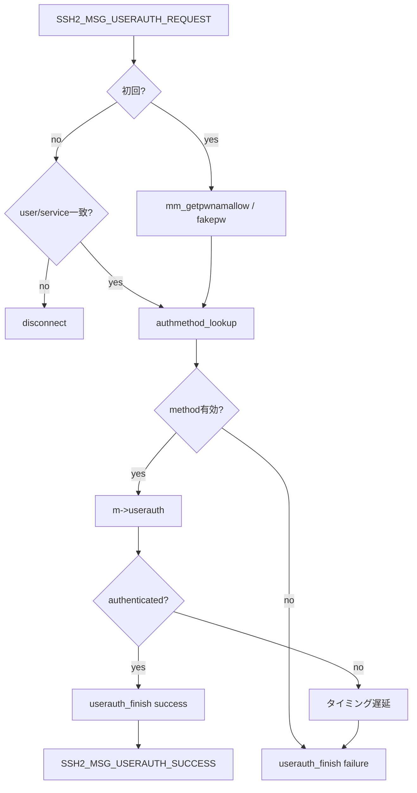
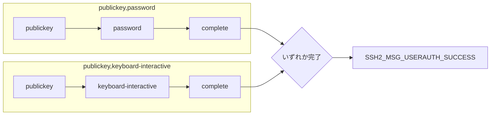

# 第5章 認証フレームワーク

> 本章で読むソース
>
> - [`auth2.c`](https://github.com/openssh/openssh-portable/blob/V_10_3_P1/auth2.c)
> - [`auth.h`](https://github.com/openssh/openssh-portable/blob/V_10_3_P1/auth.h)
> - [`auth2-methods.c`](https://github.com/openssh/openssh-portable/blob/V_10_3_P1/auth2-methods.c)
> - [`auth.c`](https://github.com/openssh/openssh-portable/blob/V_10_3_P1/auth.c)

## この章の狙い

SSH2 プロトコルの認証サブシステムは、サーバーが**どのようにしてユーザーを認証し、複数の方式を直列に組み合わせるか**を定義する。
本章では認証コンテキスト（Authctxt）の構造、メッセージディスパッチの流れ、メソッドリストの定義、認証状態機械、そして多要素認証（AuthenticationMethods）を解説する。

## 前提

- 第2章（パケットプロトコル）で説明した `dispatch` 機構が認証メッセージの振り分けに使われる。
- 鍵交換（第3章）が完了し、SSH2_MSG_SERVICE_REQUEST で "ssh-userauth" サービスが開始された直後から認証フェーズが始まる。

## Authctxt：認証コンテキスト

認証の進行状態はすべて `Authctxt` 構造体で管理される。

[`auth.h L55-L98`](https://github.com/openssh/openssh-portable/blob/V_10_3_P1/auth.h#L55-L98)

```c
struct Authctxt {
	sig_atomic_t	 success;
	int		 authenticated;
	int		 postponed;
	int		 valid;
	int		 attempt;
	int		 failures;
	int		 server_caused_failure;
	int		 force_pwchange;
	char		*user;
	char		*service;
	struct passwd	*pw;
	char		*style;

	/* Method lists for multiple authentication */
	char		**auth_methods;
	u_int		 num_auth_methods;

	void		*methoddata;
	void		*kbdintctxt;

	struct sshbuf	*loginmsg;

	struct sshkey	**prev_keys;
	u_int		 nprev_keys;

	struct sshkey	*auth_method_key;
	char		*auth_method_info;

	struct sshbuf	*session_info;
};
```

`success` は `sig_atomic_t` で宣言されており、シグナルハンドラから安全に読み取れる。
認証ループの終了条件はこのフラグである。
`valid` はユーザーが存在しログインを許可されているかを示す。
存在しないユーザーに対しては `fakepw()`（`auth.c L627-L658`）で偽のパスワードエントリが割り当てられ、認証自体は（失敗するように）実行される。
これはユーザー列挙攻撃を防ぐための機構である。

`prev_keys` は多要素認証で同一鍵の再利用を防ぐために保持される。

## 認証ディスパッチの開始

`do_authentication2()` は sshd のメインループから呼ばれるエントリポイントである。

[`auth2.c L170-L181`](https://github.com/openssh/openssh-portable/blob/V_10_3_P1/auth2.c#L170-L181)

```c
void
do_authentication2(struct ssh *ssh)
{
	Authctxt *authctxt = ssh->authctxt;

	ssh_dispatch_init(ssh, &dispatch_protocol_error);
	if (ssh->kex->ext_info_c)
		ssh_dispatch_set(ssh, SSH2_MSG_EXT_INFO, &kex_input_ext_info);
	ssh_dispatch_set(ssh, SSH2_MSG_SERVICE_REQUEST, &input_service_request);
	ssh_dispatch_run_fatal(ssh, DISPATCH_BLOCK, &authctxt->success);
	ssh->authctxt = NULL;
}
```

`ssh_dispatch_run_fatal` は `authctxt->success` が真になるまでブロックしながらメッセージを処理する。
最初に `SSH2_MSG_SERVICE_REQUEST` が来ると `input_service_request()` が呼ばれ、"ssh-userauth" サービスの受け入れ後に `SSH2_MSG_USERAUTH_REQUEST` のディスパッチが設定される。

### input_service_request()

[`auth2.c L183-L222`](https://github.com/openssh/openssh-portable/blob/V_10_3_P1/auth2.c#L183-L222)

クライアントから "ssh-userauth" が要求されると `SSH2_MSG_SERVICE_ACCEPT` を返し、以降の `SSH2_MSG_USERAUTH_REQUEST` を `input_userauth_request()` で処理するようディスパッチテーブルを切り替える。

### input_userauth_request()

[`auth2.c L268-L358`](https://github.com/openssh/openssh-portable/blob/V_10_3_P1/auth2.c#L268-L358)

```c
static int
input_userauth_request(int type, uint32_t seq, struct ssh *ssh)
{
	Authctxt *authctxt = ssh->authctxt;
	Authmethod *m = NULL;
	char *user = NULL, *service = NULL, *method = NULL, *style = NULL;
	int r, authenticated = 0;
	double tstart = monotime_double();

	if (authctxt == NULL)
		fatal("input_userauth_request: no authctxt");

	if ((r = sshpkt_get_cstring(ssh, &user, NULL)) != 0 ||
	    (r = sshpkt_get_cstring(ssh, &service, NULL)) != 0 ||
	    (r = sshpkt_get_cstring(ssh, &method, NULL)) != 0)
		goto out;
	debug("userauth-request for user %s service %s method %s", user, service, method);
	debug("attempt %d failures %d", authctxt->attempt, authctxt->failures);

	if ((style = strchr(user, ':')) != NULL)
		*style++ = 0;

	if (authctxt->attempt >= 1024)
		auth_maxtries_exceeded(ssh);
	if (authctxt->attempt++ == 0) {
		/* setup auth context */
		authctxt->pw = mm_getpwnamallow(ssh, user);
		authctxt->user = xstrdup(user);
		authctxt->service = xstrdup(service);
		authctxt->style = style ? xstrdup(style) : NULL;
		if (authctxt->pw && strcmp(service, "ssh-connection")==0) {
			authctxt->valid = 1;
			debug2_f("setting up authctxt for %s", user);
		} else {
			authctxt->valid = 0;
			/* Invalid user, fake password information */
			authctxt->pw = fakepw();
#ifdef SSH_AUDIT_EVENTS
			mm_audit_event(ssh, SSH_INVALID_USER);
#endif
		}
#ifdef USE_PAM
		if (options.use_pam)
			mm_start_pam(ssh);
#endif
		ssh_packet_set_log_preamble(ssh, "%suser %s",
		    authctxt->valid ? "authenticating " : "invalid ", user);
		setproctitle("%s [net]", authctxt->valid ? user : "unknown");
		mm_inform_authserv(service, style);
		userauth_banner(ssh);
		if ((r = kex_server_update_ext_info(ssh)) != 0)
			fatal_fr(r, "kex_server_update_ext_info failed");
		if (auth2_setup_methods_lists(authctxt) != 0)
			ssh_packet_disconnect(ssh,
			    "no authentication methods enabled");
	} else if (strcmp(user, authctxt->user) != 0 ||
	    strcmp(service, authctxt->service) != 0) {
		ssh_packet_disconnect(ssh, "Change of username or service "
		    "not allowed: (%s,%s) -> (%s,%s)",
		    authctxt->user, authctxt->service, user, service);
	}
	/* reset state */
	auth2_challenge_stop(ssh);

#ifdef GSSAPI
	/* XXX move to auth2_gssapi_stop() */
	ssh_dispatch_set(ssh, SSH2_MSG_USERAUTH_GSSAPI_TOKEN, NULL);
	ssh_dispatch_set(ssh, SSH2_MSG_USERAUTH_GSSAPI_EXCHANGE_COMPLETE, NULL);
#endif

	auth2_authctxt_reset_info(authctxt);
	authctxt->postponed = 0;
	authctxt->server_caused_failure = 0;

	/* try to authenticate user */
	m = authmethod_lookup(authctxt, method);
	if (m != NULL && authctxt->failures < options.max_authtries) {
		debug2("input_userauth_request: try method %s", method);
		authenticated =	m->userauth(ssh, method);
	}
	if (!authctxt->authenticated && strcmp(method, "none") != 0)
		ensure_minimum_time_since(tstart,
		    user_specific_delay(authctxt->user));
	userauth_finish(ssh, authenticated, method, NULL);
	r = 0;
 out:
	free(service);
	free(user);
	free(method);
	return r;
}
```

この関数が認証の**中央ハブ**である。
パケットから user, service, method を抽出し、初回呼び出しでは認証コンテキストを初期化する。

処理の流れは以下の通り。

1. **初回呼び出し**（`authctxt->attempt == 0`）：`mm_getpwnamallow()` でユーザー情報を取得し、`fakepw()` で存在しないユーザーを偽装する。
   PAM 初期化、バナーの送信、メソッドリストの準備を行う。
2. **二回目以降**：user と service の不変性をチェックする。
3. 各認証前に `auth2_challenge_stop()` と GSSAPI の後片付けを行う。
4. `authmethod_lookup()` でメソッドを検索し、有効かつ AuthenticationMethods に許可されていれば `m->userauth()` を呼び出す。
5. 認証が成功しなかった場合（"none" 以外）、ユーザー固有の時間遅延を挟む（`ensure_minimum_time_since`）。
6. `userauth_finish()` で結果をクライアントに返す。



### タイミング遅延による辞書攻撃対策

[`auth2.c L224-L266`](https://github.com/openssh/openssh-portable/blob/V_10_3_P1/auth2.c#L224-L266)

`user_specific_delay()` はユーザー名と secret から SHA512 ハッシュを計算し、5ms から 5秒の範囲でユーザー固有の遅延量を決める。
`ensure_minimum_time_since()` は認証処理にかかった実経過時間を計測し、目標遅延に満たなければ `nanosleep` で補う。
これによりパスワード試行の総時間がユーザーごとに異なり、辞書攻撃の効率が下がる。

## メソッドリストと Authmethod 構造体

各認証方式は `Authmethod` 構造体で表現される。

[`auth2-methods.c L42-L73`](https://github.com/openssh/openssh-portable/blob/V_10_3_P1/auth2-methods.c#L42-L73)

```c
struct authmethod_cfg methodcfg_pubkey = {
	"publickey",
	"publickey-hostbound-v00@openssh.com",
	&options.pubkey_authentication
};
struct authmethod_cfg methodcfg_passwd = {
	"password",
	NULL,
	&options.password_authentication
};
struct authmethod_cfg methodcfg_kbdint = {
	"keyboard-interactive",
	NULL,
	&options.kbd_interactive_authentication
};
// ... hostbased, gssapi-with-mic, none
```

`authmethod_cfg` は名前、シノニム、有効フラグへのポインタを持つ。
`Authmethod` はこの設定と実際の認証関数ポインタを束ねる。

[`auth2.c L77-L87`](https://github.com/openssh/openssh-portable/blob/V_10_3_P1/auth2.c#L77-L87)

```c
Authmethod *authmethods[] = {
	&method_none,
	&method_pubkey,
#ifdef GSSAPI
	&method_gssapi,
#endif
	&method_passwd,
	&method_kbdint,
	&method_hostbased,
	NULL
};
```

この配列の順序は `authmethods_get()` でクライアントに提示されるメソッドリストに影響する。

### "none" メソッド

[`auth2-none.c L53-L64`](https://github.com/openssh/openssh-portable/blob/V_10_3_P1/auth2-none.c#L53-L64)

"none" は実際の認証を行わず、初回の認証リクエストとして使われる。
`none_enabled` は一度使われると 0 になり、二度目の "none" は失敗扱いとなる。
ただし `permit_empty_passwd` とパスワード認証が有効なら空パスワードで認証を試みる。

## userauth_finish：成功／失敗／部分認証

[`auth2.c L360-L464`](https://github.com/openssh/openssh-portable/blob/V_10_3_P1/auth2.c#L360-L464)

`userauth_finish()` は全認証方式から呼ばれる共通の後処理関数である。

- **authenticated == 1**：root ログイン制限の確認、AuthenticationMethods の完了チェック、PAM account モジュールの呼び出しを経て `SSH2_MSG_USERAUTH_SUCCESS` を送信する。
- **authenticated == 0 かつ partial == 0**：`authctxt->failures` をインクリメントし、上限に達したら `auth_maxtries_exceeded()` で切断する。
- **authenticated == 0 かつ partial == 1**：`SSH2_MSG_USERAUTH_FAILURE` の partial フラグを立て、クライアントに「追加の認証方式が必要」と伝える。

`authmethods_get()` は有効かつ許可されたメソッドのカンマ区切りリストを動的に生成する。

## AuthenticationMethods：多要素認証

[`auth2.c L563-L600`](https://github.com/openssh/openssh-portable/blob/V_10_3_P1/auth2.c#L563-L600)

```c
int
auth2_setup_methods_lists(Authctxt *authctxt)
{
	u_int i;

	/* First, normalise away the "any" pseudo-method */
	if (options.num_auth_methods == 1 &&
	    strcmp(options.auth_methods[0], "any") == 0) {
		free(options.auth_methods[0]);
		options.auth_methods[0] = NULL;
		options.num_auth_methods = 0;
	}

	if (options.num_auth_methods == 0)
		return 0;
	debug3_f("checking methods");
	authctxt->auth_methods = xcalloc(options.num_auth_methods,
	    sizeof(*authctxt->auth_methods));
	authctxt->num_auth_methods = 0;
	for (i = 0; i < options.num_auth_methods; i++) {
		if (auth2_methods_valid(options.auth_methods[i], 1) != 0) {
			logit("Authentication methods list \"%s\" contains "
			    "disabled method, skipping",
			    options.auth_methods[i]);
			continue;
		}
		debug("authentication methods list %d: %s",
		    authctxt->num_auth_methods, options.auth_methods[i]);
		authctxt->auth_methods[authctxt->num_auth_methods++] =
		    xstrdup(options.auth_methods[i]);
	}
	if (authctxt->num_auth_methods == 0) {
		error("No AuthenticationMethods left after eliminating "
		    "disabled methods");
		return -1;
	}
	return 0;
}
```

`sshd_config` の `AuthenticationMethods` ディレクティブは、完了しなければならないメソッドのリストを定義する。

```text
AuthenticationMethods publickey,password publickey,keyboard-interactive
```

これは「公開鍵＋パスワード」か「公開鍵＋キーボードインタラクティブ」のどちらかを要求する。

`auth2_setup_methods_lists()` は設定から無効なメソッドを含むリストを除去する。
`auth2_update_methods_lists()` は認証成功時にそのメソッドを各リストの先頭から削除し、空になったリストがあれば認証完了とみなす。



`auth2_key_already_used()`（`auth2.c L746-L764`）は同一鍵の再使用を防ぐため、成功した認証鍵を `prev_keys` に記録し、以降のリクエストで拒否する。

## 認証ログ

[`auth.c L263-L328`](https://github.com/openssh/openssh-portable/blob/V_10_3_P1/auth.c#L263-L328)

`auth_log()` は認証の成否を syslog に記録する。
Accepted / Failed / Postponed / Partial の区別と、使用された鍵のフィンガープリントや方式を出力する。
パスワード認証や失敗率が高い場合にはログレベルが INFO に上がる。

## まとめ

OpenSSH の認証フレームワークは `Authctxt` 状態とディスパッチループで構成され、各認証方式は `Authmethod` 構造体の関数ポインタとして統一的に扱われる。
多要素認証はメソッドリストの prefix 削除により実現され、タイミング遅延や偽パスワードでサイドチャネル攻撃を緩和する。
次章以降で個別の方式（公開鍵、パスワード、KBDINT、GSSAPI、hostbased）の実装を詳読する。

## 関連する章

- [第6章 公開鍵認証](06-public-key-auth.md)
- [第7章 パスワード・KBDINT・GSSAPI 認証](07-password-kbdint-gssapi.md)
- [第11章 権限分離](../part04-security/11-privilege-separation.md)（monitor との通信）
