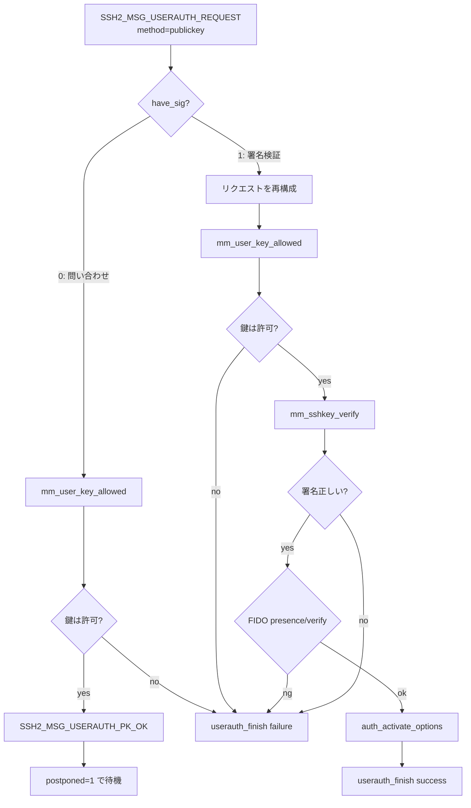
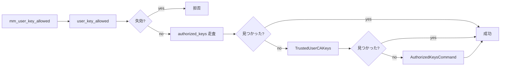

# 第6章 公開鍵認証

> 本章で読むソース
>
> - [`auth2-pubkey.c`](https://github.com/openssh/openssh-portable/blob/V_10_3_P1/auth2-pubkey.c)
> - [`auth2-pubkeyfile.c`](https://github.com/openssh/openssh-portable/blob/V_10_3_P1/auth2-pubkeyfile.c)
> - [`auth-options.c`](https://github.com/openssh/openssh-portable/blob/V_10_3_P1/auth-options.c)
> - [`auth-options.h`](https://github.com/openssh/openssh-portable/blob/V_10_3_P1/auth-options.h)
> - [`hostfile.c`](https://github.com/openssh/openssh-portable/blob/V_10_3_P1/hostfile.c)

## この章の狙い

公開鍵認証は OpenSSH の主要な認証方式であり、署名の検証と authorized_keys による**鍵の許可管理**を組み合わせる。
本章では `userauth_pubkey()` による署名検証フロー、authorized_keys のパースとオプション処理、証明書（certificate）の認可、および known_hosts によるホスト鍵検証を解説する。

## 前提

- 認証フレームワーク（第5章）の `Authctxt` と `Authmethod` 構造体を理解していること。
- 権限分離（第11章）において、実際の署名検証は特権モニタプロセスが行うことを前提とする。

## userauth_pubkey：公開鍵＋署名検証

[`auth2-pubkey.c L87-L315`](https://github.com/openssh/openssh-portable/blob/V_10_3_P1/auth2-pubkey.c#L87-L315)

```c
static int
userauth_pubkey(struct ssh *ssh, const char *method)
{
	Authctxt *authctxt = ssh->authctxt;
	struct passwd *pw = authctxt->pw;
	struct sshbuf *b = NULL;
	struct sshkey *key = NULL, *hostkey = NULL;
	char *pkalg = NULL, *userstyle = NULL, *key_s = NULL, *ca_s = NULL;
	u_char *pkblob = NULL, *sig = NULL, have_sig;
	size_t blen, slen;
	int hostbound, r, pktype;
	int req_presence = 0, req_verify = 0, authenticated = 0;
	struct sshauthopt *authopts = NULL;
	struct sshkey_sig_details *sig_details = NULL;

	hostbound = strcmp(method, "publickey-hostbound-v00@openssh.com") == 0;

	if ((r = sshpkt_get_u8(ssh, &have_sig)) != 0 ||
	    (r = sshpkt_get_cstring(ssh, &pkalg, NULL)) != 0 ||
	    (r = sshpkt_get_string(ssh, &pkblob, &blen)) != 0)
		fatal_fr(r, "parse %s packet", method);

	/* hostbound auth includes the hostkey offered at initial KEX */
	if (hostbound) {
		if ((r = sshpkt_getb_froms(ssh, &b)) != 0 ||
		    (r = sshkey_fromb(b, &hostkey)) != 0)
			fatal_fr(r, "parse %s hostkey", method);
		if (ssh->kex->initial_hostkey == NULL)
			fatal_f("internal error: initial hostkey not recorded");
		if (!sshkey_equal(hostkey, ssh->kex->initial_hostkey))
			fatal_f("%s packet contained wrong host key", method);
		sshbuf_free(b);
		b = NULL;
	}
// ... (中略) ...
	pktype = sshkey_type_from_name(pkalg);
	if (pktype == KEY_UNSPEC) {
		/* this is perfectly legal */
		verbose_f("unsupported public key algorithm: %s", pkalg);
		goto done;
	}
	if ((r = sshkey_from_blob(pkblob, blen, &key)) != 0) {
		error_fr(r, "parse key");
		goto done;
	}
	if (key == NULL) {
		error_f("cannot decode key: %s", pkalg);
		goto done;
	}
	if (key->type != pktype || (sshkey_type_plain(pktype) == KEY_ECDSA &&
	    sshkey_ecdsa_nid_from_name(pkalg) != key->ecdsa_nid)) {
		error_f("key type mismatch for decoded key "
		    "(received %s, expected %s)", sshkey_ssh_name(key), pkalg);
		goto done;
	}
	if (auth2_key_already_used(authctxt, key)) {
		logit("refusing previously-used %s key", sshkey_type(key));
		goto done;
	}
	if (match_pattern_list(pkalg, options.pubkey_accepted_algos, 0) != 1) {
		logit_f("signature algorithm %s not in "
		    "PubkeyAcceptedAlgorithms", pkalg);
		goto done;
	}
	if ((r = sshkey_check_cert_sigtype(key,
	    options.ca_sign_algorithms)) != 0) {
		logit_fr(r, "certificate signature algorithm %s",
		    (key->cert == NULL || key->cert->signature_type == NULL) ?
		    "(null)" : key->cert->signature_type);
		goto done;
	}
	if ((r = sshkey_check_rsa_length(key,
	    options.required_rsa_size)) != 0) {
		logit_r(r, "refusing %s key", sshkey_type(key));
		goto done;
	}
	key_s = format_key(key);
	if (sshkey_is_cert(key))
		ca_s = format_key(key->cert->signature_key);

	if (have_sig) {
		debug3_f("%s have %s signature for %s%s%s",
		    method, pkalg, key_s,
		    ca_s == NULL ? "" : " CA ", ca_s == NULL ? "" : ca_s);
		if ((r = sshpkt_get_string(ssh, &sig, &slen)) != 0 ||
		    (r = sshpkt_get_end(ssh)) != 0)
			fatal_fr(r, "parse signature packet");
		if ((b = sshbuf_new()) == NULL)
			fatal_f("sshbuf_new failed");
		if (ssh->compat & SSH_OLD_SESSIONID) {
			if ((r = sshbuf_putb(b, ssh->kex->session_id)) != 0)
				fatal_fr(r, "put old session id");
		} else {
			if ((r = sshbuf_put_stringb(b,
			    ssh->kex->session_id)) != 0)
				fatal_fr(r, "put session id");
		}
		if (!authctxt->valid || authctxt->user == NULL) {
			debug2_f("disabled because of invalid user");
			goto done;
		}
		/* reconstruct packet */
		xasprintf(&userstyle, "%s%s%s", authctxt->user,
		    authctxt->style ? ":" : "",
		    authctxt->style ? authctxt->style : "");
		if ((r = sshbuf_put_u8(b, SSH2_MSG_USERAUTH_REQUEST)) != 0 ||
		    (r = sshbuf_put_cstring(b, userstyle)) != 0 ||
		    (r = sshbuf_put_cstring(b, authctxt->service)) != 0 ||
		    (r = sshbuf_put_cstring(b, method)) != 0 ||
		    (r = sshbuf_put_u8(b, have_sig)) != 0 ||
		    (r = sshbuf_put_cstring(b, pkalg)) != 0 ||
		    (r = sshbuf_put_string(b, pkblob, blen)) != 0)
			fatal_fr(r, "reconstruct %s packet", method);
		if (hostbound &&
		    (r = sshkey_puts(ssh->kex->initial_hostkey, b)) != 0)
			fatal_fr(r, "reconstruct %s packet", method);
#ifdef DEBUG_PK
		sshbuf_dump(b, stderr);
#endif
		/* test for correct signature */
		authenticated = 0;
		if (mm_user_key_allowed(ssh, pw, key, 1, &authopts) &&
		    mm_sshkey_verify(key, sig, slen,
		    sshbuf_ptr(b), sshbuf_len(b),
		    (ssh->compat & SSH_BUG_SIGTYPE) == 0 ? pkalg : NULL,
		    ssh->compat, &sig_details) == 0) {
			authenticated = 1;
		}
		if (authenticated == 1 && sig_details != NULL) {
			auth2_record_info(authctxt, "signature count = %u",
			    sig_details->sk_counter);
			debug_f("sk_counter = %u, sk_flags = 0x%02x",
			    sig_details->sk_counter, sig_details->sk_flags);
			req_presence = (options.pubkey_auth_options &
			    PUBKEYAUTH_TOUCH_REQUIRED) ||
			    !authopts->no_require_user_presence;
			if (req_presence && (sig_details->sk_flags &
			    SSH_SK_USER_PRESENCE_REQD) == 0) {
				error("public key %s signature for %s%s from "
				    "%.128s port %d rejected: user presence "
				    "(authenticator touch) requirement "
				    "not met ", key_s,
				    authctxt->valid ? "" : "invalid user ",
				    authctxt->user, ssh_remote_ipaddr(ssh),
				    ssh_remote_port(ssh));
				authenticated = 0;
				goto done;
			}
			req_verify = (options.pubkey_auth_options &
			    PUBKEYAUTH_VERIFY_REQUIRED) ||
			    authopts->require_verify;
			if (req_verify && (sig_details->sk_flags &
			    SSH_SK_USER_VERIFICATION_REQD) == 0) {
				error("public key %s signature for %s%s from "
				    "%.128s port %d rejected: user "
				    "verification requirement not met ", key_s,
				    authctxt->valid ? "" : "invalid user ",
				    authctxt->user, ssh_remote_ipaddr(ssh),
				    ssh_remote_port(ssh));
				authenticated = 0;
				goto done;
			}
		}
		auth2_record_key(authctxt, authenticated, key);
	} else {
		debug_f("%s test pkalg %s pkblob %s%s%s", method, pkalg, key_s,
		    ca_s == NULL ? "" : " CA ", ca_s == NULL ? "" : ca_s);

		if ((r = sshpkt_get_end(ssh)) != 0)
			fatal_fr(r, "parse packet");

		if (!authctxt->valid || authctxt->user == NULL) {
			debug2_f("disabled because of invalid user");
			goto done;
		}
		/* XXX fake reply and always send PK_OK ? */
		/*
		 * XXX this allows testing whether a user is allowed
		 * to login: if you happen to have a valid pubkey this
		 * message is sent. the message is NEVER sent at all
		 * if a user is not allowed to login. is this an
		 * issue? -markus
		 */
		if (mm_user_key_allowed(ssh, pw, key, 0, NULL)) {
			if ((r = sshpkt_start(ssh, SSH2_MSG_USERAUTH_PK_OK))
			    != 0 ||
			    (r = sshpkt_put_cstring(ssh, pkalg)) != 0 ||
			    (r = sshpkt_put_string(ssh, pkblob, blen)) != 0 ||
			    (r = sshpkt_send(ssh)) != 0 ||
			    (r = ssh_packet_write_wait(ssh)) != 0)
				fatal_fr(r, "send packet");
			authctxt->postponed = 1;
		}
	}
done:
	if (authenticated == 1 && auth_activate_options(ssh, authopts) != 0) {
		debug_f("key options inconsistent with existing");
		authenticated = 0;
	}
	debug2_f("authenticated %d pkalg %s", authenticated, pkalg);

	sshbuf_free(b);
	sshauthopt_free(authopts);
	sshkey_free(key);
	sshkey_free(hostkey);
	free(userstyle);
	free(pkalg);
	free(pkblob);
	free(key_s);
	free(ca_s);
	free(sig);
	sshkey_sig_details_free(sig_details);
	return authenticated;
}
```

`userauth_pubkey()` はプロトコル上、**二つのフェーズ**に分かれる。

**フェーズ1：問い合わせ（have_sig == 0）**
クライアントは鍵を提示するだけで署名を添付しない。
サーバーは `mm_user_key_allowed()` で鍵が authorized_keys に存在するかを調べ、存在すれば `SSH2_MSG_USERAUTH_PK_OK` を返す。
`authctxt->postponed = 1` と設定し、後続の署名付きリクエストを待つ。

**フェーズ2：署名検証（have_sig == 1）**
クライアントは署名を添付して認証リクエストを送る。
サーバーは以下の手順で検証する。

1. セッションIDとリクエスト内容を `sshbuf` に再構成する（署名対象データの生成）。
2. `mm_user_key_allowed()` で鍵が許可されているか確認する。
3. `mm_sshkey_verify()` で署名を検証する（実際の検証はモニタプロセスが実行）。
4. FIDO/U2F 鍵の場合、`SSH_SK_USER_PRESENCE_REQD` や `SSH_SK_USER_VERIFICATION_REQD` フラグのチェックを行う。

`hostbound` 変数は拡張方式 `"publickey-hostbound-v00@openssh.com"` を表す。
この方式ではクライアントが最初の鍵交換で使ったホスト鍵を認証パケットに含め、特定のホストへのバインディングを強化する。



### 署名対象データの再構成

サーバーは認証リクエストを**受信した内容から完全に再構成**してから署名検証を行う（`auth2-pubkey.c L191-L217`）。
これにより、クライアントが途中で改ざんしたデータを署名検証に使うことを防ぐ。

```c
if ((r = sshbuf_put_u8(b, SSH2_MSG_USERAUTH_REQUEST)) != 0 ||
    (r = sshbuf_put_cstring(b, userstyle)) != 0 ||
    (r = sshbuf_put_cstring(b, authctxt->service)) != 0 ||
    (r = sshbuf_put_cstring(b, method)) != 0 ||
    (r = sshbuf_put_u8(b, have_sig)) != 0 ||
    (r = sshbuf_put_cstring(b, pkalg)) != 0 ||
    (r = sshbuf_put_string(b, pkblob, blen)) != 0)
```

署名対象は `session_id || SSH2_MSG_USERAUTH_REQUEST || user || service || method ...` の形で構成される。
`session_id` は鍵交換フェーズで確立されたもので、同一セッション内で一意に定まる。

## 鍵の許可チェイン

`mm_user_key_allowed()` は特権モニタに委譲される。
実際の `user_key_allowed()`（`auth2-pubkey.c L789-L874`）は以下の順で鍵を調べる。

1. 鍵（または証明書の CA 鍵）が失効リストに載っていないか確認（`auth_key_is_revoked`）。
2. `authorized_keys_files` の glob 展開結果を走査し、各ファイルを `user_key_allowed2()` でチェック。
3. ファイルに見つからなければ、`user_cert_trusted_ca()` で TrustedUserCAKeys を確認。
4. それでも見つからなければ、`user_key_command_allowed2()` で AuthorizedKeysCommand を実行。



## authorized_keys のパース

### auth_openkeyfile と auth_check_authkeys_file

[`auth2-pubkeyfile.c L501-L505`](https://github.com/openssh/openssh-portable/blob/V_10_3_P1/auth2-pubkeyfile.c#L501-L505)

`auth_openkeyfile()` は `auth_openfile()` を呼び、ファイルのオープンと `safe_path_fd()` によるパーミッションチェックを行う。
`~/.ssh/authorized_keys` は所有者以外の書き込み権限があると拒否される。

[`auth2-pubkeyfile.c L418-L452`](https://github.com/openssh/openssh-portable/blob/V_10_3_P1/auth2-pubkeyfile.c#L418-L452)

`auth_check_authkeys_file()` はファイルを行単位で読み、各行を `auth_check_authkey_line()` に渡す。

### auth_check_authkey_line

[`auth2-pubkeyfile.c L267-L412`](https://github.com/openssh/openssh-portable/blob/V_10_3_P1/auth2-pubkeyfile.c#L267-L412)

1. 行から鍵オプション文字列を分離する（`key_options`）。
2. `sshkey_read()` で鍵データをパースする。
3. `sshauthopt_parse()` で鍵オプションをパースする。
4. 証明書の場合は CA 鍵との一致を、平鍵の場合は鍵そのものの一致を確認する。
5. `auth_authorise_keyopts()` で制約（有効期限、from、source-address など）を検証する。
6. 証明書の場合、`sshauthopt_from_cert()` と `sshauthopt_merge()` で鍵オプションと証明書オプションを統合する。

#### 高速化の工夫：証明書による認可の一元化

公開鍵認証の高速化は、**証明書（certificate）を使うことで authorized_keys の行数が劇的に減る**点にある。
ひとつの CA 鍵を authorized_keys に `cert-authority` フラグで登録すれば、その CA が署名した全証明書を個別の authorized_keys エントリなしで受け入れられる。
管理者は `~/.ssh/authorized_keys` のメンテナンスから解放される。

### 鍵オプションのパース（sshauthopt_parse）

[`auth-options.c L321-L498`](https://github.com/openssh/openssh-portable/blob/V_10_3_P1/auth-options.c#L321-L498)

認可された鍵には以下のオプションを付与できる。

| オプション | 意味 |
|---|---|
| `command="..."` | 強制コマンド（force-command） |
| `from="..."` | 接続元ホストの制限 |
| `permitopen="..."` | 許可する転送先 |
| `permitlisten="..."` | 許可するリッスンアドレス |
| `principals="..."` | 証明書のプリンシパル制限 |
| `cert-authority` | CA 鍵の指定 |
| `restrict` | 全転送を禁止し、個別に許可を上書き |
| `environment="..."` | 環境変数の設定 |
| `expiry-time="..."` | 有効期限 |
| `touch-required` | FIDO のユーザープレゼンス要求 |

`sshauthopt_merge()`（`auth-options.c L531-L653`）は authorized_keys のオプションと証明書のオプションを統合する。
許可フラグは論理積（両方で許可されていれば許可）、制限フラグは論理和（どちらかが要求すれば要求）で結合される。

## 証明書認可：authorized_principals

[`auth2-pubkey.c L317-L508`](https://github.com/openssh/openssh-portable/blob/V_10_3_P1/auth2-pubkey.c#L317-L508)

`AuthorizedPrincipalsFile` または `AuthorizedPrincipalsCommand` で、証明書に記載されたプリンシパル名の許可リストを指定できる。
`match_principals_file()` はファイルの各行を `auth_check_principals_line()` で検査し、証明書のプリンシパル配列のいずれかと一致するかを検証する。

`match_principals_command()` は外部コマンドを実行し、その標準出力から許可プリンシパルを読み取る。
コマンドには `%u`（ユーザー名）、`%f`（鍵フィンガープリント）、`%k`（鍵の Base64 表現）などのトークンが渡される。

## hostfile.c：known_hosts とホスト鍵検証

[`hostfile.c L349-L405`](https://github.com/openssh/openssh-portable/blob/V_10_3_P1/hostfile.c#L349-L405)

`check_hostkeys_by_key_or_type()` はホスト鍵または CA 鍵を known_hosts ファイルから検索する。
ホスト鍵は平鍵の場合 `sshkey_equal()`、証明書の場合は `sshkey_equal_public()` で CA 鍵と比較する。
`check_key_not_revoked()`（`hostfile.c L316-L332`）で失効マーカー（`@revoked`）が付いたエントリと照合する。

`hostkeys_foreach_file()`（`hostfile.c L789-L963`）は known_hosts ファイルの各行をパースし、ハッシュ化されたホスト名（`\|1|...`）の検証も行う。
`match_maybe_hashed()` が HMAC-SHA1 ベースのホスト名ハッシュを復号することなく比較する。

## まとめ

公開鍵認証は鍵の提示と署名検証の二段階で構成され、authorized_keys のパース、オプション処理、証明書認可という複数の層でアクセス制御を行う。
署名検証は権限分離によりモニタプロセスに委譲され、認証の安全性を高めている。
証明書は authorized_keys の肥大化を防ぎ、管理コストを削減する。

## 関連する章

- [第5章 認証フレームワーク](05-auth-framework.md)
- [第11章 権限分離](../part04-security/11-privilege-separation.md)
- [第12章 鍵管理](../part04-security/12-key-management.md)
