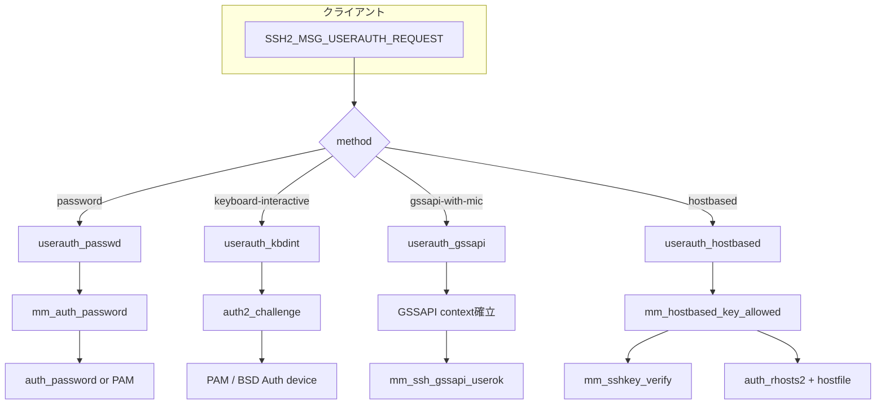
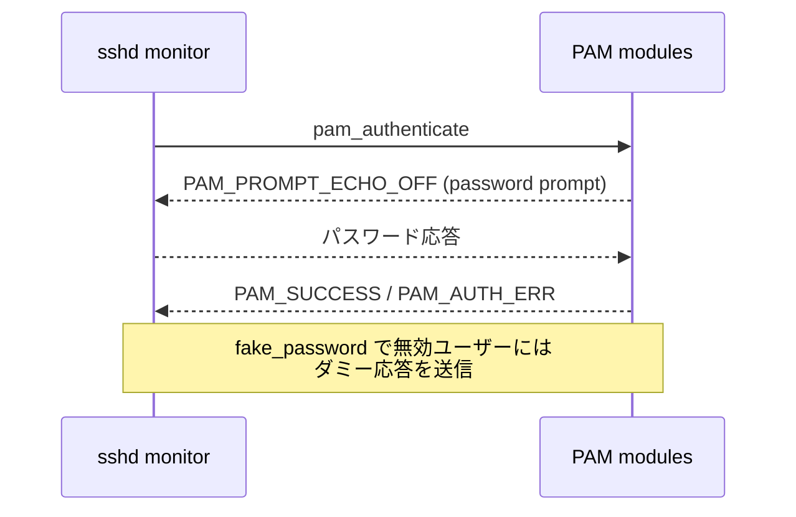

# 第7章 パスワード・KBDINT・GSSAPI 認証

> 本章で読むソース
>
> - [`auth2-passwd.c`](https://github.com/openssh/openssh-portable/blob/V_10_3_P1/auth2-passwd.c)
> - [`auth-pam.c`](https://github.com/openssh/openssh-portable/blob/V_10_3_P1/auth-pam.c)
> - [`auth-pam.h`](https://github.com/openssh/openssh-portable/blob/V_10_3_P1/auth-pam.h)
> - [`auth2-kbdint.c`](https://github.com/openssh/openssh-portable/blob/V_10_3_P1/auth2-kbdint.c)
> - [`auth2-chall.c`](https://github.com/openssh/openssh-portable/blob/V_10_3_P1/auth2-chall.c)
> - [`auth2-gss.c`](https://github.com/openssh/openssh-portable/blob/V_10_3_P1/auth2-gss.c)
> - [`gss-serv.c`](https://github.com/openssh/openssh-portable/blob/V_10_3_P1/gss-serv.c)
> - [`auth2-hostbased.c`](https://github.com/openssh/openssh-portable/blob/V_10_3_P1/auth2-hostbased.c)

## この章の狙い

公開鍵認証以外の認証方式（パスワード、キーボードインタラクティブ（KBDINT）、GSSAPI（Kerberos）、ホストベース認証）は、それぞれ異なるプロトコルメッセージと認証バックエンドを持つ。
本章ではこれらの実装と、特権モニタとの通信、PAM の会話フローを解説する。

## 前提

- 認証フレームワーク（第5章）の Authmethod ディスパッチを理解していること。
- 権限分離（第11章）により、パスワード検証などの機密操作はモニタプロセスで実行される。

## 方式間の比較



## パスワード認証（auth2-passwd.c）

[`auth2-passwd.c L52-L74`](https://github.com/openssh/openssh-portable/blob/V_10_3_P1/auth2-passwd.c#L52-L74)

パスワード認証は最も単純な方式である。
クライアントは `change` フラグとパスワード文字列を送信する。

```c
static int
userauth_passwd(struct ssh *ssh, const char *method)
{
	char *password = NULL;
	int authenticated = 0, r;
	u_char change;
	size_t len = 0;

	if ((r = sshpkt_get_u8(ssh, &change)) != 0 ||
	    (r = sshpkt_get_cstring(ssh, &password, &len)) != 0 ||
	    (change && (r = sshpkt_get_cstring(ssh, NULL, NULL)) != 0) ||
	    (r = sshpkt_get_end(ssh)) != 0) {
		freezero(password, len);
		fatal_fr(r, "parse packet");
	}

	if (change)
		logit("password change not supported");
	else if (mm_auth_password(ssh, password) == 1)
		authenticated = 1;
	freezero(password, len);
	return authenticated;
}
```

特筆すべきは `freezero()` によるパスワードメモリの安全な解放である。
パスワード文字列がスタックやヒープに残らないように `free()` の代わりに使われる。

`mm_auth_password()` は権限分離下でモニタプロセスにパスワード検証を委譲する。
モニタプロセス内部では `auth_password()` が呼ばれ、システムの crypt(3) や PAM で検証される。

### PAM パスワード認証（auth-pam.c）

[`auth-pam.c L1254-L1302`](https://github.com/openssh/openssh-portable/blob/V_10_3_P1/auth-pam.c#L1254-L1302)

`sshpam_auth_passwd()` は PAM によるパスワード検証を行う。

```c
int
sshpam_auth_passwd(Authctxt *authctxt, const char *password)
{
	int flags = (options.permit_empty_passwd == 0 ?
	    PAM_DISALLOW_NULL_AUTHTOK : 0);
	char *fake = NULL;

	sshpam_password = password;
	sshpam_authctxt = authctxt;

	if (!authctxt->valid || (authctxt->pw->pw_uid == 0 &&
	    options.permit_root_login != PERMIT_YES))
		sshpam_password = fake = fake_password(password);

	sshpam_err = pam_set_item(sshpam_handle, PAM_CONV,
	    (const void *)&passwd_conv);
	// ...
	sshpam_err = pam_authenticate(sshpam_handle, flags);
```

存在しないユーザーや root ログインが禁止されている場合、`fake_password()`（`auth-pam.c L939-L956`）で**元のパスワードと同じ長さのダミー文字列**を送る。
これは PAM スタックの処理時間がパスワード長に応じて変化するタイミング攻撃を防ぐための対策である。

### PAM 会話フロー

PAM は認証モジュールとアプリケーションの間で「会話」（conversation）を行う。
`sshpam_passwd_conv()`（`auth-pam.c L1194-L1247`）は echo-off プロンプトをパスワード入力として扱い、それ以外のメッセージを `loginmsg` バッファに保存する。



## KBDINT（キーボードインタラクティブ）認証

### userauth_kbdint（auth2-kbdint.c）

[`auth2-kbdint.c L47-L66`](https://github.com/openssh/openssh-portable/blob/V_10_3_P1/auth2-kbdint.c#L47-L66)

KBDINT はサーバーが任意のチャレンジを送り、クライアントが応答する多段階認証プロトコルである。
`auth2_challenge()` に処理を委譲する。

### auth2_challenge（auth2-chall.c）

[`auth2-chall.c L196-L209`](https://github.com/openssh/openssh-portable/blob/V_10_3_P1/auth2-chall.c#L196-L209)

```c
int
auth2_challenge(struct ssh *ssh, char *devs)
{
	Authctxt *authctxt = ssh->authctxt;
	debug("auth2_challenge: user=%s devs=%s",
	    authctxt->user ? authctxt->user : "<nouser>",
	    devs ? devs : "<no devs>");

	if (authctxt->user == NULL || !devs)
		return 0;
	if (authctxt->kbdintctxt == NULL)
		authctxt->kbdintctxt = kbdint_alloc(devs);
	return auth2_challenge_start(ssh);
}
```

認証デバイス（PAM または BSD Auth）が `KbdintDevice` 構造体として抽象化される。

デバイスは `devices[]` 配列に登録される。

[`auth2-chall.c L64-L73`](https://github.com/openssh/openssh-portable/blob/V_10_3_P1/auth2-chall.c#L64-L73)

```c
KbdintDevice *devices[] = {
#ifdef BSD_AUTH
	&mm_bsdauth_device,
#else
#ifdef USE_PAM
	&mm_sshpam_device,
#endif
#endif
	NULL
};
```

処理の流れは以下の通り。

1. `kbdint_alloc()` でコンテキストを割り当てる。
2. `kbdint_next_device()` で次のデバイスを選択する。
3. `device->init_ctx()` でデバイスを初期化する。
4. `send_userauth_info_request()` で `SSH2_MSG_USERAUTH_INFO_REQUEST` を送信する。
5. `input_userauth_info_response()` でクライアントの応答を処理し、`device->respond()` を呼ぶ。
6. respond の戻り値が 0（成功）、1（継続）、それ以外（失敗）に応じて状態を遷移する。

#### PAM の疑似スレッド

PAM モジュールの中にはブロックするものがあるため、`sshpam_init_ctx()`（`auth-pam.c L807-L849`）は `fork()` で子プロセスを生成し、ソケットペア経由でメッセージをやり取りする。

[`auth-pam.c L150-L241`](https://github.com/openssh/openssh-portable/blob/V_10_3_P1/auth-pam.c#L150-L241)

通常のビルドでは `UNSUPPORTED_POSIX_THREADS_HACK` が定義されず、`pthread_create` が `fork()` に置き換えられる。
これによりスレッド非対応のプラットフォームでも PAM を安全に使える。

#### fake_password によるタイミング攻撃対策

[`auth-pam.c L939-L956`](https://github.com/openssh/openssh-portable/blob/V_10_3_P1/auth-pam.c#L939-L956)

```c
static char *
fake_password(const char *wire_password)
{
	const char junk[] = "\b\n\r\177INCORRECT";
	char *ret = NULL;
	size_t i, l = wire_password != NULL ? strlen(wire_password) : 0;

	ret = malloc(l + 1);
	for (i = 0; i < l; i++)
		ret[i] = junk[i % (sizeof(junk) - 1)];
	ret[i] = '\0';
	return ret;
}
```

この関数は無効なユーザーや root に対し、実際のパスワードと**同じ長さ**のダミー応答を生成する。
PAM の処理時間がパスワード長に依存する場合でも、攻撃者は「どのユーザーが実在するか」を時間差で推測できない。

## GSSAPI 認証（auth2-gss.c, gss-serv.c）

[`auth2-gss.c L65-L143`](https://github.com/openssh/openssh-portable/blob/V_10_3_P1/auth2-gss.c#L65-L143)

GSSAPI 認証は Kerberos などの外部認証インフラと統合するための機構である。

### userauth_gssapi

クライアントが送信した OID リストから、サーバーがサポートする機構を選択する。
選択された OID を使って `mm_ssh_gssapi_server_ctx()` で GSSAPI コンテキストを作成し、`SSH2_MSG_USERAUTH_GSSAPI_RESPONSE` で選択結果を返す。

### GSSAPI トークンのやり取り

`input_gssapi_token()`（`auth2-gss.c L145-L207`）は GSSAPI の accept_sec_context を繰り返し呼び出す。
このループはコンテキストが確立されるまで続く。

コンテキスト確立後、以下の二つの経路がある。

1. **MIC 検証**（`GSS_C_INTEG_FLAG` 設定時）：`input_gssapi_mic()`（`auth2-gss.c L281-L325`）で署名（MIC）を検証する。
2. **Exchange Complete**（非 MIC）：`input_gssapi_exchange_complete()`（`auth2-gss.c L253-L279`）で完了を宣言する。

両経路とも最終的に `mm_ssh_gssapi_userok()` を呼び、GSSAPI クライアント名がローカルユーザーと対応するかを確認する。

### 特権操作

[`gss-serv.c L135-L143`](https://github.com/openssh/openssh-portable/blob/V_10_3_P1/gss-serv.c#L135-L143)

`ssh_gssapi_server_ctx()`、`ssh_gssapi_accept_ctx()`、`ssh_gssapi_userok()` はいずれも特権操作であり、モニタプロセスのコンテキストで実行される。
`mm_ssh_gssapi_server_ctx` などの `mm_` プレフィックス関数が、モニタへの要求をラップする。

## ホストベース認証（auth2-hostbased.c）

[`auth2-hostbased.c L59-L167`](https://github.com/openssh/openssh-portable/blob/V_10_3_P1/auth2-hostbased.c#L59-L167)

ホストベース認証は、SSH 接続元ホストがユーザーを保証する仕組みである。
`/etc/hosts.equiv` や `~/.shosts` の rhosts 認可と、ホスト鍵の known_hosts 検証を組み合わせる。

### userauth_hostbased

クライアントは以下の情報を送信する。

- 公開鍵アルゴリズムと鍵ブロブ
- クライアントホスト名（`chost`）
- クライアントユーザー名（`cuser`）
- 署名

サーバーはパケットを再構成して署名検証を行い、`mm_hostbased_key_allowed()` で認可を確認する。

### hostbased_key_allowed

[`auth2-hostbased.c L170-L263`](https://github.com/openssh/openssh-portable/blob/V_10_3_P1/auth2-hostbased.c#L170-L263)

1. 鍵が失効リストにないか確認する。
2. `auth_rhosts2()` で rhosts 認可を検証する。
   `hostbased_uses_name_from_packet_only` 設定により、DNS 解決を行うかパケットの値のみを使うかを制御する。
3. `sshkey_cert_check_host()` で証明書のホストチェック（証明書の場合）。
4. `check_key_in_hostfiles()` で known_hosts ファイルを検索する。
   システムの `/etc/ssh/ssh_known_hosts` とユーザーの `~/.ssh/known_hosts` が対象となる。

`check_key_in_hostfiles()`（`auth.c L414-L457`）は `load_hostkeys()` でファイルを読み込み、`check_key_in_hostkeys()` で鍵を照合する。

## 各方式のモニタ通信まとめ

全方式とも特権モニタプロセスとの通信を経由する。

| 方式 | モニタ関数 | 処理内容 |
|---|---|---|
| password | `mm_auth_password` | crypt(3) または PAM による検証 |
| keyboard-interactive | `mm_sshpam_query/respond` | PAM 会話のプロキシ |
| GSSAPI | `mm_ssh_gssapi_server_ctx/accept_ctx/userok` | GSSAPI コンテキスト管理 |
| hostbased | `mm_hostbased_key_allowed` + `mm_sshkey_verify` | rhosts 認可 + 署名検証 |

## まとめ

パスワード認証、KBDINT、GSSAPI、ホストベース認証は、認証フレームワークの `Authmethod` インタフェースから統一的に呼び出される。
各方式は特権モニタプロセスと通信し、パスワードや GSSAPI 資格情報などの機密データを非特権プロセスから隔離する。
PAM 統合はパスワード認証と KBDINT の両方で使われ、偽パスワード（`fake_password`）によるタイミング攻撃対策が施されている。

## 関連する章

- [第5章 認証フレームワーク](05-auth-framework.md)
- [第6章 公開鍵認証](06-public-key-auth.md)
- [第11章 権限分離](../part04-security/11-privilege-separation.md)
