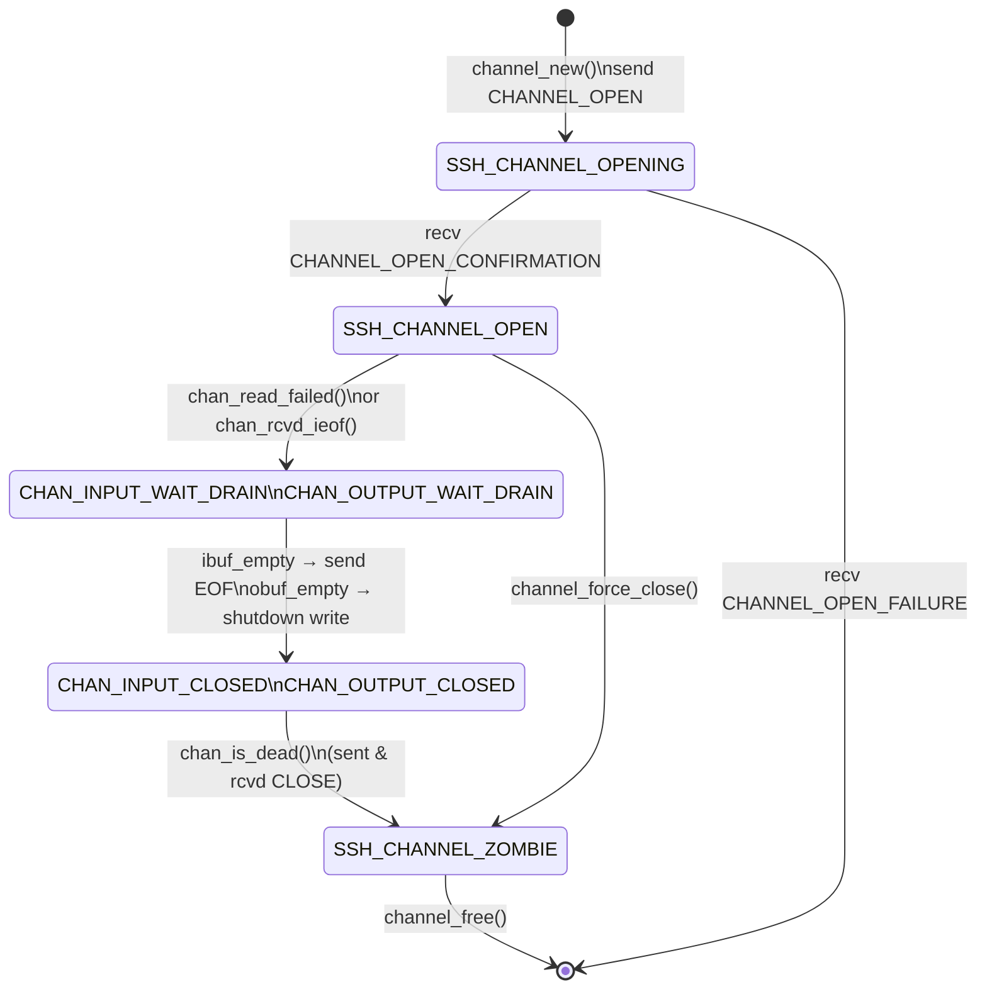

# 第8章 チャネルの多重化

> 本章で読むソース
>
> - [`channels.h`](https://github.com/openssh/openssh-portable/blob/V_10_3_P1/channels.h)
> - [`channels.c`](https://github.com/openssh/openssh-portable/blob/V_10_3_P1/channels.c)
> - [`nchan.c`](https://github.com/openssh/openssh-portable/blob/V_10_3_P1/nchan.c)

## この章の狙い

SSH では一つの暗号化接続（トランスポート）の上で、複数の独立したデータストリームを多重化する。
このデータストリームを**チャネル**と呼ぶ。
チャネルはシェルセッション、X11 転送、TCP ポート転送、エージェント転送など、あらゆるアプリケーションデータを運ぶ。
この章ではチャネルの構造、状態機械、転送機構、I/O 多重化の実装を解説する。

## 前提

- 第2章のパケットプロトコルを理解していること
- 第3章の鍵交換と暗号化の仕組みを理解していること

## Channel 構造体とチャネルの種類

チャネルの状態とデータは `struct Channel`（`channels.h:128-223`）で管理される。
各チャネルは次の属性を持つ。

- チャネル種別（`type`）と種別名（`ctype`）
- 自分側のチャネル ID（`self`）とリモート側の ID（`remote_id`）
- 入力状態（`istate`）と出力状態（`ostate`）
- 読み書き用のファイル記述子（`rfd`, `wfd`, `efd`, `sock`）
- バッファ（`input`, `output`, `extended`）
- フロー制御用のウインドウ値（`local_window`, `remote_window`, `local_maxpacket` など）
- コールバック関数群

チャネル種別は `channels.h:42-62` で定義される。
主な種別を示す。

| 定数 | 値 | 用途 |
|------|-----|------|
| `SSH_CHANNEL_X11_LISTENER` | 1 | X11 接続の待受 |
| `SSH_CHANNEL_PORT_LISTENER` | 2 | TCP ポート転送の待受（ローカル側） |
| `SSH_CHANNEL_OPEN` | 4 | 通常の双方向通信中 |
| `SSH_CHANNEL_AUTH_SOCKET` | 6 | 認証エージェントソケット |
| `SSH_CHANNEL_X11_OPEN` | 7 | X11 接続確立中 |
| `SSH_CHANNEL_DYNAMIC` | 13 | SOCKS 動的転送 |
| `SSH_CHANNEL_MUX_LISTENER` | 15 | 多重化マスターの待受 |
| `SSH_CHANNEL_UNIX_LISTENER` | 18 | Unix ドメインソケットの待受 |

## チャネルの生成と解放

### channel_new()

`channels.c:504-561` はチャネルを生成する。
空きスロットを探し、なければ配列を10スロットずつ拡張する。
初期状態は `CHAN_INPUT_OPEN`／`CHAN_OUTPUT_OPEN` で、ウインドウと最大パケットサイズを設定する。

[`channels.c L504-L561`](https://github.com/openssh/openssh-portable/blob/V_10_3_P1/channels.c#L504-L561)

### channel_send_open()

`channels.c:1177-1190` は `SSH2_MSG_CHANNEL_OPEN` をリモートに送信する。
`open_preamble()` でチャネル種別、送信元ウインドウ、最大パケットサイズをエンコードする。

[`channels.c L1177-L1190`](https://github.com/openssh/openssh-portable/blob/V_10_3_P1/channels.c#L1177-L1190)

### channel_input_data()

`channels.c:3478-3546` はリモートからデータを受信したときのハンドラである。
ウインドウサイズをチェックし、超過していなければ `c->output` バッファに追記する。
チャネルが非 OPEN 状態ならデータを消費せず破棄する。

[`channels.c L3478-L3546`](https://github.com/openssh/openssh-portable/blob/V_10_3_P1/channels.c#L3478-L3546)

```c
channel_input_data(int type, uint32_t seq, struct ssh *ssh)
{
	const u_char *data;
	size_t data_len, win_len;
	Channel *c = channel_from_packet_id(ssh, __func__, "data");
	int r;

	if (channel_proxy_upstream(c, type, seq, ssh))
		return 0;

	/* Ignore any data for non-open channels (might happen on close) */
	if (c->type != SSH_CHANNEL_OPEN &&
	    c->type != SSH_CHANNEL_RDYNAMIC_OPEN &&
	    c->type != SSH_CHANNEL_RDYNAMIC_FINISH &&
	    c->type != SSH_CHANNEL_X11_OPEN)
		return 0;

	/* Get the data. */
	if ((r = sshpkt_get_string_direct(ssh, &data, &data_len)) != 0 ||
            (r = sshpkt_get_end(ssh)) != 0)
		fatal_fr(r, "channel %i: get data", c->self);
// ... (中略) ...
	if (c->datagram) {
		if ((r = sshbuf_put_string(c->output, data, data_len)) != 0)
			fatal_fr(r, "channel %i: append datagram", c->self);
	} else if ((r = sshbuf_put(c->output, data, data_len)) != 0)
		fatal_fr(r, "channel %i: append data", c->self);

	return 0;
}
```

## チャネル状態機械（nchan.c）

`nchan.c` はチャネルの入力側と出力側を独立した状態機械で管理する。
SSH プロトコル 2.0 では EOF と CLOSE を分離しており、片方向ずつのクローズが可能である。

### 入力側の状態遷移

```text
CHAN_INPUT_OPEN
    ↓ read_failed
CHAN_INPUT_WAIT_DRAIN（入力バッファを空にするのを待つ）
    ↓ ibuf_empty → send EOF
CHAN_INPUT_CLOSED
```

### 出力側の状態遷移

```text
CHAN_OUTPUT_OPEN
    ↓ rcvd_ieof（リモートから EOF を受信）
CHAN_OUTPUT_WAIT_DRAIN（出力バッファが空になるのを待つ）
    ↓ obuf_empty → shutdown write
CHAN_OUTPUT_CLOSED
```

両方の状態が CLOSED になり、かつ CLOSE を送受信済みなら `chan_is_dead()`（`nchan.c:332-371`）が真を返し、チャネルは解放される。

### 最適化：EOF／CLOSE の分離

1.3 プロトコルでは CLOSE に対して CLOSE_CONFIRM が返る strict request-ack だった。
2.0 では EOF を先に送り、データが枯渇してから CLOSE を送る。
これにより送信側が EOF を送った後でも受信データを最後まで処理でき、データロストを防げる。

## TCP ポート転送

### ローカル転送

`channel_setup_local_fwd_listener()`（`channels.c:4235-4245`）はローカル側の TCP または Unix ドメインソケットで待受を開始する。
内部的に `channel_setup_fwd_listener_tcpip()` を呼び、`SSH_CHANNEL_PORT_LISTENER` 型のチャネルを生成する。
クライアントからの接続があると `channel_connect_to_port()`（`channels.c:4882`）でリモート側へ接続する。

[`channels.c L4235-L4245`](https://github.com/openssh/openssh-portable/blob/V_10_3_P1/channels.c#L4235-L4245)

### リモート転送

`channel_setup_remote_fwd_listener()`（`channels.c:4312-4344`）はサーバー側にリモート転送の待受を設定する。
`check_rfwd_permission()` で許可リスト（`permitted_user`／`permitted_admin`）を検証してから待受を開始する。

[`channels.c L4312-L4344`](https://github.com/openssh/openssh-portable/blob/V_10_3_P1/channels.c#L4312-L4344)

クライアント側では `channel_request_remote_forwarding()`（`channels.c:4368`）が `SSH2_MSG_GLOBAL_REQUEST` でリモート転送を要求する。

## X11 転送

`x11_create_display_inet()`（`channels.c:5078-5178`）は X11 転送用の待受ソケットを作成する。
X11 ベースポート（6000）からのオフセットでディスプレイ番号を決め、複数のアドレスファミリで bind を試行する。
成功したソケットごとに `SSH_CHANNEL_X11_LISTENER` 型のチャネルを生成する。

[`channels.c L5078-L5178`](https://github.com/openssh/openssh-portable/blob/V_10_3_P1/channels.c#L5078-L5178)

`x11_request_forwarding_with_spoofing()`（`channels.c:5361`）はクライアント側で偽の `DISPLAY` を設定し、サーバーに X11 転送を要求する。

## 動的転送（SOCKS5）

`channel_decode_socks5()`（`channels.c:1651-1750`）は SOCKS5 プロトコルをパースする。
認証フェーズ（`channel_socks5_check_auth()`）を通過後、CONNECT コマンドを解析して接続先のホスト名とポートを抽出する。
抽出した値を `c->path` と `c->host_port` に格納し、`channel_connect_to_port()` で実際の接続を開始する。

[`channels.c L1651-L1750`](https://github.com/openssh/openssh-portable/blob/V_10_3_P1/channels.c#L1651-L1750)

### 最適化：SOCKS5 クライアントの先読み対応

クライアントが認証完了を待たずに CONNECT リクエストを先送りしてくる場合がある。
`channel_decode_socks5()` は認証処理後、同じバッファに続くリクエストが存在すればそのままパースを継続する。
これにより余分な poll 呼び出しを省き、レイテンシを削減する。

## poll() による I/O 多重化

`channel_prepare_poll()`（`channels.c:2871-2909`）は全チャネルのファイル記述子を `pollfd` 配列に詰め込む。
各チャネルは最大4つの fd（rfd, wfd, efd, sock）を持つ。
`channel_after_poll()`（`channels.c:2940`）は poll の結果を各チャネルの `io_ready` ビットマスクに変換する。

[`channels.c L2871-L2909`](https://github.com/openssh/openssh-portable/blob/V_10_3_P1/channels.c#L2871-L2909)

`channel_output_poll()`（`channels.c:3135-3170`）は OPEN 状態のチャネルから出力バッファを読み取り、暗号化パケットに変換して送信キューに載せる。

[`channels.c L3135-L3170`](https://github.com/openssh/openssh-portable/blob/V_10_3_P1/channels.c#L3135-L3170)

### 最適化：pollfd の動的再割り当て

チャネル数は実行中に増減する。
`channel_prepare_poll()` はチャネル配列長の4倍の pollfd を確保し、足りなければ `xrecallocarray()` で動的に拡張する。
これにより静的な最大値制限を持たず、メモリ使用量がチャネル数に比例する。

### ウインドウ制御

`channel_check_window()`（`channels.c:2431-2456`）はローカルウインドウが `local_maxpacket * 3` 以上消費されたか、半分以下になったときに `SSH2_MSG_CHANNEL_WINDOW_ADJUST` を送信する。
ウインドウ更新が不足するとリモート側の送信が止まり、スループットが低下する。

[`channels.c L2431-L2456`](https://github.com/openssh/openssh-portable/blob/V_10_3_P1/channels.c#L2431-L2456)

```c
channel_check_window(struct ssh *ssh, Channel *c)
{
	int r;

	if (c->type == SSH_CHANNEL_OPEN &&
	    !(c->flags & (CHAN_CLOSE_SENT|CHAN_CLOSE_RCVD)) &&
	    ((c->local_window_max - c->local_window >
	    c->local_maxpacket*3) ||
	    c->local_window < c->local_window_max/2) &&
	    c->local_consumed > 0) {
		if (!c->have_remote_id)
			fatal_f("channel %d: no remote id", c->self);
		if ((r = sshpkt_start(ssh,
		    SSH2_MSG_CHANNEL_WINDOW_ADJUST)) != 0 ||
		    (r = sshpkt_put_u32(ssh, c->remote_id)) != 0 ||
		    (r = sshpkt_put_u32(ssh, c->local_consumed)) != 0 ||
		    (r = sshpkt_send(ssh)) != 0) {
			fatal_fr(r, "channel %i", c->self);
		}
		debug2("channel %d: window %d sent adjust %d", c->self,
		    c->local_window, c->local_consumed);
		c->local_window += c->local_consumed;
		c->local_consumed = 0;
	}
	return 1;
}
```

## チャネルのライフサイクル



チャネルは `channel_new()` で `SSH_CHANNEL_OPENING` として生まれ、リモートの確認応答を待つ。
確認後 `SSH_CHANNEL_OPEN` に遷移し、双方向データ転送が可能になる。
切断は EOF と CLOSE の二段階で進行し、両方向が閉じてから解放される。

## まとめ

チャネルは SSH のアプリケーションデータ多重化の基本単位である。
入力と出力を独立した状態機械で管理し、EOF と CLOSE を分離することで Graceful Shutdown を実現する。
TCP 転送、X11 転送、SOCKS5 動的転送など、すべての転送機能はチャネル機構の上に構築されている。
poll() による I/O 多重化はチャネル数の動的変化に対応し、ウインドウ制御でフローを調整する。

## 関連する章

- 第4章：暗号化パケットの上でチャネルデータが運ばれる
- 第9章：クライアントがチャネルを開いてセッションを確立する
- 第10章：サーバーがチャネル要求を処理して子プロセスを起動する
