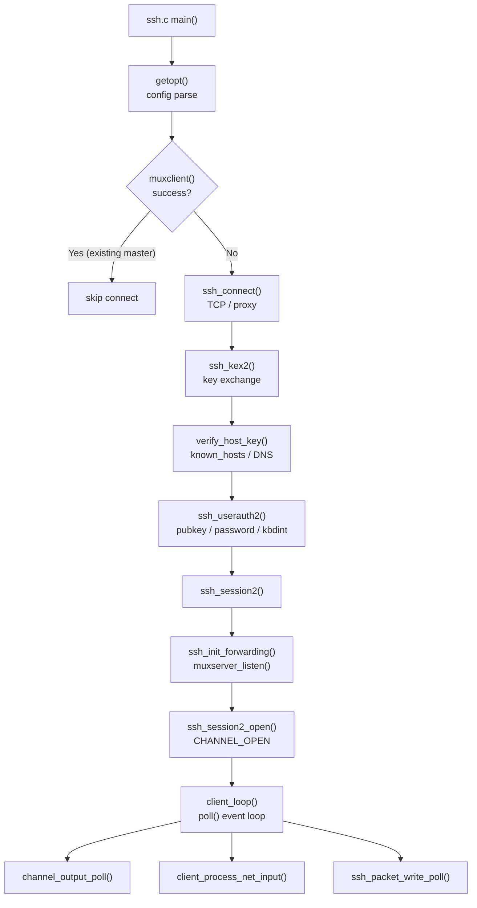

# 第9章 クライアント接続

> 本章で読むソース
>
> - [`ssh.c`](https://github.com/openssh/openssh-portable/blob/V_10_3_P1/ssh.c)
> - [`sshconnect.c`](https://github.com/openssh/openssh-portable/blob/V_10_3_P1/sshconnect.c)
> - [`sshconnect2.c`](https://github.com/openssh/openssh-portable/blob/V_10_3_P1/sshconnect2.c)
> - [`clientloop.c`](https://github.com/openssh/openssh-portable/blob/V_10_3_P1/clientloop.c)
> - [`mux.c`](https://github.com/openssh/openssh-portable/blob/V_10_3_P1/mux.c)

## この章の狙い

`ssh` クライアントはコマンドライン解析、設定ファイル読み込み、TCP 接続、鍵交換、ユーザー認証、そしてセッションの確立を順に実行する。
この章では `ssh.c` の `main()` から `client_loop()` に至るまでの全行程を追い、各段階でどのモジュールが呼ばれるかを示す。

## 前提

- 第2章のパケットプロトコルと第3章の鍵交換を理解していること
- 第5章の認証フレームワークを理解していること
- 第8章のチャネル機構を理解していること

## ssh.c: main()（エントリポイント）

`ssh.c:639-1850` がクライアント全体のエントリポイントである。
処理は次の順序で進む。

1. 初期化（乱数シード、パスワードエントリ取得、umask 設定）
2. `ssh_alloc_session_state()` でセッション状態を割り当て、`channel_init_channels()` でチャネル層を初期化
3. コマンドライン引数のパース（getopt ループ）
4. 設定ファイル `ssh_config` の読み込み
5. マルチプレクシングの試行（`muxclient()` が成功すれば接続をスキップ）
6. 名前解決
7. `ssh_connect()` で TCP 接続
8. ホスト鍵の読み込み（hostbased auth 用）
9. 公開鍵 ID ファイルの読み込み
10. `ssh_login()` → `ssh_kex2()` + `ssh_userauth2()`
11. `ssh_session2()` → `client_loop()`

[`ssh.c L639-L1850`](https://github.com/openssh/openssh-portable/blob/V_10_3_P1/ssh.c#L639-L1850)

## ssh_connect()（TCP 接続）

`sshconnect.c:532-558` は接続手段を選択する。

- `proxy_command == NULL`: `ssh_connect_direct()` で直接 TCP 接続
- `proxy_command == "-"`: stdin/stdout をそのまま接続に使う（ProxyCommand からのパイプ）
- `proxy_use_fdpass`: fd-passing によるプロキシ接続
- 上記以外: `ssh_proxy_connect()` で指定されたコマンドを起動し、そのパイプを接続に使う

[`sshconnect.c L532-L558`](https://github.com/openssh/openssh-portable/blob/V_10_3_P1/sshconnect.c#L532-L558)

## ssh_kex2()（鍵交換とホスト鍵検証）

`sshconnect2.c:219-292` は鍵交換の前準備を行う。

1. `kex_proposal_populate_entries()` で提案リストを組み立てる
2. `kex_setup()` で鍵交換コンテキストを初期化
3. DH／ECDH／Curve25519／ML-KEM の各方式をディスパッチテーブルに登録
4. `verify_host_key` コールバックに `verify_host_key_callback` を設定
5. `ssh_dispatch_run_fatal()` で鍵交換を完了させる

[`sshconnect2.c L219-L292`](https://github.com/openssh/openssh-portable/blob/V_10_3_P1/sshconnect2.c#L219-L292)

### 最適化：known_hosts の順序で HostkeyAlgorithms を優先

`order_hostkeyalgs()` は `known_hosts` に記録された鍵タイプを優先的に提案アルゴリズムの先頭に移動する。
これにより多くの場合、サーバーが最初の提案をそのまま受け入れ、余分な鍵交換のラウンドトリップを削減する。

### verify_host_key()

`sshconnect.c:1458-1537` はホスト鍵の検証を行う。
サーバーから受け取ったホスト鍵のフィンガープリントを計算し、`known_hosts` に照合する。
失効リスト（`RevokedHostKeys`）のチェック、DNS SSHFP レコード検証、ユーザーへの確認プロンプトを順に実行する。

[`sshconnect.c L1458-L1537`](https://github.com/openssh/openssh-portable/blob/V_10_3_P1/sshconnect.c#L1458-L1537)

## ssh_userauth2()（クライアント側認証）

`sshconnect2.c:424-489` は `ssh-connection` サービスに対するユーザー認証を実行する。

1. `SSH2_MSG_SERVICE_REQUEST` で `ssh-userauth` を要求
2. `SSH2_MSG_SERVICE_ACCEPT` を受信したら `userauth_none()` で空認証を送信
3. サーバーからの `SSH2_MSG_USERAUTH_FAILURE` に含まれる認証方式リストを解析
4. `preferred_authentications` の順序に従い、`pubkey`、`password`、`keyboard-interactive`、`gssapi-with-mic` などを順次試行
5. `SSH2_MSG_USERAUTH_SUCCESS` を受信するか、全方式を試行するまでループ
6. 認証成功後、ディスパッチテーブルをクリアする

[`sshconnect2.c L424-L489`](https://github.com/openssh/openssh-portable/blob/V_10_3_P1/sshconnect2.c#L424-L489)

## ssh_session2() → client_loop()（セッション確立とメインループ）

認証後、`ssh_session2()`（`ssh.c:2241-2340`）が以下の処理を行う。

1. ポート転送の初期化（`ssh_init_forwarding()`）
2. マルチプレクサの待受ソケット作成（`muxserver_listen()`）
3. セッションチャネルのオープン（`ssh_session2_open()`）
4. `no-more-sessions@openssh.com` の送信（ControlMaster が不要な場合）
5. `client_loop()` の呼び出し

[`ssh.c L2241-L2340`](https://github.com/openssh/openssh-portable/blob/V_10_3_P1/ssh.c#L2241-L2340)

```c
ssh_session2(struct ssh *ssh, const struct ssh_conn_info *cinfo)
{
	int r, id = -1;
	char *cp, *tun_fwd_ifname = NULL;

	/* XXX should be pre-session */
	if (!options.control_persist)
		ssh_init_stdio_forwarding(ssh);

	ssh_init_forwarding(ssh, &tun_fwd_ifname);

	if (options.local_command != NULL) {
		debug3("expanding LocalCommand: %s", options.local_command);
		cp = options.local_command;
		options.local_command = percent_expand(cp,
		    DEFAULT_CLIENT_PERCENT_EXPAND_ARGS(cinfo),
		    "T", tun_fwd_ifname == NULL ? "NONE" : tun_fwd_ifname,
		    (char *)NULL);
		debug3("expanded LocalCommand: %s", options.local_command);
		free(cp);
	}

	/* Start listening for multiplex clients */
	if (!ssh_packet_get_mux(ssh))
		muxserver_listen(ssh);

	/*
	 * If we are in control persist mode and have a working mux listen
	 * socket, then prepare to background ourselves and have a foreground
	 * client attach as a control client.
	 * NB. we must save copies of the flags that we override for
	 * the backgrounding, since we defer attachment of the client until
	 * after the connection is fully established (in particular,
	 * async rfwd replies have been received for ExitOnForwardFailure).
	 */
	if (options.control_persist && muxserver_sock != -1) {
		ostdin_null_flag = options.stdin_null;
		osession_type = options.session_type;
		orequest_tty = options.request_tty;
		otty_flag = tty_flag;
		ofork_after_authentication = options.fork_after_authentication;
		options.stdin_null = 1;
		options.session_type = SESSION_TYPE_NONE;
		tty_flag = 0;
		if ((osession_type != SESSION_TYPE_NONE ||
		    options.stdio_forward_host != NULL))
			need_controlpersist_detach = 1;
		options.fork_after_authentication = 1;
	}
	/*
	 * ControlPersist mux listen socket setup failed, attempt the
	 * stdio forward setup that we skipped earlier.
	 */
	if (options.control_persist && muxserver_sock == -1)
		ssh_init_stdio_forwarding(ssh);

	if (options.session_type != SESSION_TYPE_NONE)
		id = ssh_session2_open(ssh);

	/* If we don't expect to open a new session, then disallow it */
	if (options.control_master == SSHCTL_MASTER_NO &&
	    (ssh->compat & SSH_NEW_OPENSSH)) {
		debug("Requesting no-more-sessions@openssh.com");
		if ((r = sshpkt_start(ssh, SSH2_MSG_GLOBAL_REQUEST)) != 0 ||
		    (r = sshpkt_put_cstring(ssh,
		    "no-more-sessions@openssh.com")) != 0 ||
		    (r = sshpkt_put_u8(ssh, 0)) != 0 ||
		    (r = sshpkt_send(ssh)) != 0)
			fatal_fr(r, "send packet");
	}

	/* Execute a local command */
	if (options.local_command != NULL &&
	    options.permit_local_command)
		ssh_local_cmd(options.local_command);

	/*
	 * stdout is now owned by the session channel; clobber it here
	 * so future channel closes are propagated to the local fd.
	 * NB. this can only happen after LocalCommand has completed,
	 * as it may want to write to stdout.
	 */
	if (!need_controlpersist_detach && stdfd_devnull(0, 1, 0) == -1)
		error_f("stdfd_devnull failed");

	/*
	 * If requested and we are not interested in replies to remote
	 * forwarding requests, then let ssh continue in the background.
	 */
	if (options.fork_after_authentication) {
		if (options.exit_on_forward_failure &&
		    options.num_remote_forwards > 0) {
			debug("deferring postauth fork until remote forward "
			    "confirmation received");
		} else
			fork_postauth();
	}

	return client_loop(ssh, tty_flag, tty_flag ?
	    options.escape_char : SSH_ESCAPECHAR_NONE, id);
}
```

### client_loop() のイベントループ

`clientloop.c:1451-1709` は認証後のメインループである。

```text
while (!quit_pending)
    1. client_process_buffered_input_packets()
     2. channel_output_poll()（チャネルデータをパケット化）
     3. client_check_window_change()（端末サイズ変更検出）
     4. poll()（client_wait_until_can_do_something()）
     5. channel_after_poll()（I/O イベントをチャネルに反映）
     6. client_process_net_input()（ネットワーク入力の読み取り）
     7. ssh_packet_write_poll()（出力のフラッシュ）
```

[`clientloop.c L1451-L1709`](https://github.com/openssh/openssh-portable/blob/V_10_3_P1/clientloop.c#L1451-L1709)

### エスケープシーケンス

`client_simple_escape_filter()` はチャネルの入力フィルタとして登録される（`clientloop.c:1534-1540`）。
チルダ（`~`）で始まる特殊シーケンスを検出し、切断（`~.`）、ゾンビ状態表示（`~#`）、バックグラウンド投入（`~^Z`）などを処理する。

### 最適化：pledge() によるケーパビリティ制限

`client_loop()` の冒頭（`clientloop.c:1465-1496`）では OpenBSD の `pledge()` を使ってプロセスのケーパビリティを制限する。
X11 転送が必要か、ControlMaster が有効か、proxy コマンドを使うかに応じて異なる pledge 文字列を選ぶ。
この制限により、万が一クライアントプロセスが乗っ取られても、ファイルシステムへの書き込みやプロセス生成を抑制できる。

## ControlMaster 多重化（mux.c）

`muxserver_listen()`（`mux.c:1320`）は ControlMaster が有効な場合に Unix ドメインソケットで待受を開始する。
ソケットパスは一時的なパスで `bind()` → `listen()` した後、目的のパスに `link()` でアトミックに移動する。
これにより bind と listen の間に他のプロセスが割り込む Race Condition を防ぐ。

[`mux.c L1320-L1379`](https://github.com/openssh/openssh-portable/blob/V_10_3_P1/mux.c#L1320-L1379)

`muxclient()`（`mux.c:2368`）は既存の ControlMaster に接続する。
接続後、`SSHMUX_COMMAND_OPEN`（新規セッション）や `SSHMUX_COMMAND_STDIO_FWD`（stdio 転送）などのコマンドを送信し、制御を master プロセスに委譲する。

[`mux.c L2368-L2427`](https://github.com/openssh/openssh-portable/blob/V_10_3_P1/mux.c#L2368-L2427)

```c
muxclient(const char *path)
{
	struct sockaddr_un addr;
	int sock, timeout = options.connection_timeout, timeout_ms = -1;
	u_int pid;
	char *info = NULL;

	if (muxclient_command == 0) {
		if (options.stdio_forward_host != NULL)
			muxclient_command = SSHMUX_COMMAND_STDIO_FWD;
		else
			muxclient_command = SSHMUX_COMMAND_OPEN;
	}

	switch (options.control_master) {
	case SSHCTL_MASTER_AUTO:
	case SSHCTL_MASTER_AUTO_ASK:
		debug("auto-mux: Trying existing master at '%s'", path);
		/* FALLTHROUGH */
	case SSHCTL_MASTER_NO:
		break;
	default:
		return -1;
	}

	memset(&addr, '\0', sizeof(addr));
	addr.sun_family = AF_UNIX;

	if (strlcpy(addr.sun_path, path,
	    sizeof(addr.sun_path)) >= sizeof(addr.sun_path))
		fatal("ControlPath too long ('%s' >= %u bytes)", path,
		    (unsigned int)sizeof(addr.sun_path));

	if ((sock = socket(PF_UNIX, SOCK_STREAM, 0)) == -1)
		fatal_f("socket(): %s", strerror(errno));

	if (connect(sock, (struct sockaddr *)&addr, sizeof(addr)) == -1) {
		switch (muxclient_command) {
		case SSHMUX_COMMAND_OPEN:
		case SSHMUX_COMMAND_STDIO_FWD:
			break;
		default:
			fatal("Control socket connect(%.100s): %s", path,
			    strerror(errno));
		}
		if (errno == ECONNREFUSED &&
		    options.control_master != SSHCTL_MASTER_NO) {
			debug("Stale control socket %.100s, unlinking", path);
			unlink(path);
		} else if (errno == ENOENT) {
			debug("Control socket \"%.100s\" does not exist", path);
		} else {
			error("Control socket connect(%.100s): %s", path,
			    strerror(errno));
		}
		close(sock);
		return -1;
	}
	set_nonblock(sock);
```

## クライアント接続フロー



## まとめ

`ssh` クライアントは設定読み込み → TCP 接続 → 鍵交換 → 認証 → セッション確立の直列フローで構成される。
鍵交換では `order_hostkeyalgs()` による known_hosts ベースの優先順位付けが、認証後は `pledge()` によるケーパビリティ制限がセキュリティと効率を両立する。
ControlMaster 多重化は既存のセッションを再利用し、新規接続のコストを削減する。

## 関連する章

- 第8章：チャネル機構（client_loop がチャネルイベントを駆動する）
- 第5章：認証フレームワーク（ssh_userauth2 のサーバー側処理）
- 第10章：サーバーセッション（クライアント接続の相手側実装）
