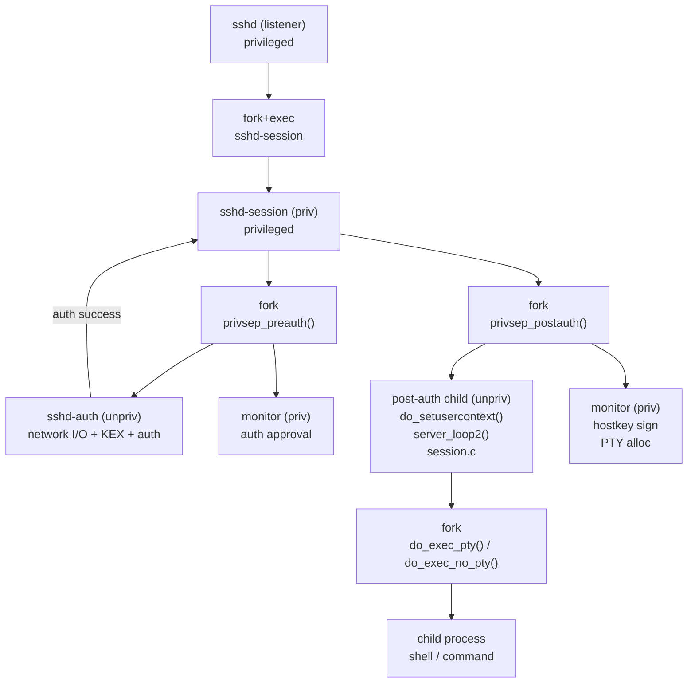

# 第10章 サーバーセッション

> 本章で読むソース
>
> - [`sshd.c`](https://github.com/openssh/openssh-portable/blob/V_10_3_P1/sshd.c)
> - [`sshd-session.c`](https://github.com/openssh/openssh-portable/blob/V_10_3_P1/sshd-session.c)
> - [`serverloop.c`](https://github.com/openssh/openssh-portable/blob/V_10_3_P1/serverloop.c)
> - [`session.c`](https://github.com/openssh/openssh-portable/blob/V_10_3_P1/session.c)
> - [`sshpty.c`](https://github.com/openssh/openssh-portable/blob/V_10_3_P1/sshpty.c)

## この章の狙い

`sshd` は一つのリストラプロセスと、接続ごとに生成される `sshd-session` プロセスの二段階構成で動作する。
この章ではリスナーの起動から認証権限分離、セッションの実行、後処理までの全行程を追う。

## 前提

- 第5章の認証フレームワークを理解していること
- 第8章のチャネル機構を理解していること
- 第11章（権限分離）の基盤を理解していること

## sshd.c: main()（リスナーの起動）

`sshd.c:1287-1911` は特権リスナープロセスとして動作する。

1. コマンドラインと設定ファイルのパース
2. ホスト鍵の読み込み（`load_host_key()`）
3. 設定されたポートで `ssh_listen()` による TCP 待受
4. `rexec_flag` が有効なら `fork()` → `exec()` で `sshd` を再実行（rexec）
5. `accept()` ループ（新規接続を受け付けるたびに `fork()` → `exec()` で `sshd-session` を起動）

[`sshd.c L1287-L1911`](https://github.com/openssh/openssh-portable/blob/V_10_3_P1/sshd.c#L1287-L1911)

### 最適化：rexec によるケーパビリティ保持

`sshd` は接続を受け付ける前に自身を `fork()` → `exec()` し直す。
これにより、リストラプロセスが純粋な accept 専用となり、ホスト鍵の秘密情報を子が継承せず、OpenBSD の `pledge()` 制限をより厳しくかけられる。

## sshd-session.c: main()（接続単位の特権プロセス）

`sshd-session.c:783-1321` は `sshd` から fork+exec された後のエントリポイントである。

大まかな流れは次の通り。

1. rexec 状態の復元（設定バッファの受信）
2. ホスト鍵の確認
3. ネットワークソケットの設定
4. チャネル層の初期化
5. LoginGraceTime タイマーの設定
6. `privsep_preauth()` の呼び出し（認証権限分離の開始）
7. 認証成功後の後処理（タイマー解除、`startup_pipe` への通知）
8. `privsep_postauth()` の呼び出し
9. `notify_hostkeys()` で全ホスト鍵をクライアントに送信
10. `do_authenticated()` でセッションを開始

[`sshd-session.c L783-L1321`](https://github.com/openssh/openssh-portable/blob/V_10_3_P1/sshd-session.c#L783-L1321)

## privsep_preauth()（認証前権限分離）

`sshd-session.c:303-369` は `fork()` で `sshd-auth` プロセスを生成する。

- **親（特権プロセス）**: `monitor_child_preauth()` を実行し、認証の可否を監視する
- **子（非特権プロセス）**: `execv()` で `sshd-auth` を実行。ネットワーク I/O を直接処理するが、特権操作は監視プロセスを経由する

[`sshd-session.c L303-L369`](https://github.com/openssh/openssh-portable/blob/V_10_3_P1/sshd-session.c#L303-L369)

## privsep_postauth()（認証後権限分離）

`sshd-session.c:372-427` は認証成功後にさらに `fork()` する。

- **親（モニタープロセス）**: `monitor_child_postauth()` で特権操作（ホスト鍵署名など）を代行する
- **子（非特権プロセス）**: `do_setusercontext()` で認証ユーザーの権限に降格し、`ssh_packet_set_authenticated()` で認証完了を通知する

[`sshd-session.c L372-L427`](https://github.com/openssh/openssh-portable/blob/V_10_3_P1/sshd-session.c#L372-L427)

### 最適化：FD passing 非対応環境での権限維持

`privsep_postauth()` の先頭では `DISABLE_FD_PASSING` をチェックする。
FD passing に対応しないシステムでは `skip_privdrop` フラグを立て、特権を放棄しない。
この場合、PTY の割り当てを特権プロセス自身が行う（V_9_7 以前の挙動と同じ）。

## do_authenticated() と server_loop2()

認証後、`sshd-session.c:1298` が `do_authenticated()` を呼ぶ。

### session.c: do_authenticated()

`session.c:312-343` はポート転送の許可設定を行い、`do_authenticated2()` を経由して `server_loop2()` に移行する。

[`session.c L312-L343`](https://github.com/openssh/openssh-portable/blob/V_10_3_P1/session.c#L312-L343)

```c
do_authenticated(struct ssh *ssh, Authctxt *authctxt)
{
	setproctitle("%s", authctxt->pw->pw_name);

	auth_log_authopts("active", auth_opts, 0);

	/* set up the channel layer */
	/* XXX - streamlocal? */
	set_fwdpermit_from_authopts(ssh, auth_opts);

	if (!auth_opts->permit_port_forwarding_flag ||
	    options.disable_forwarding) {
		channel_disable_admin(ssh, FORWARD_LOCAL);
		channel_disable_admin(ssh, FORWARD_REMOTE);
	} else {
		if ((options.allow_tcp_forwarding & FORWARD_LOCAL) == 0)
			channel_disable_admin(ssh, FORWARD_LOCAL);
		else
			channel_permit_all(ssh, FORWARD_LOCAL);
		if ((options.allow_tcp_forwarding & FORWARD_REMOTE) == 0)
			channel_disable_admin(ssh, FORWARD_REMOTE);
		else
			channel_permit_all(ssh, FORWARD_REMOTE);
	}
	auth_debug_send(ssh);

	prepare_auth_info_file(authctxt->pw, authctxt->session_info);

	do_authenticated2(ssh, authctxt);

	do_cleanup(ssh, authctxt);
}
```

### serverloop.c: server_loop2()

`serverloop.c:334-402` はサーバー側のメインイベントループである。

```text
for (;;)
    1. process_buffered_input_packets()
     2. channel_output_poll()（チャネルデータのパケット化）
     3. collect_children()（子プロセスの終了収集）
     4. wait_until_can_do_something()（poll() による待機）
     5. channel_after_poll()（I/O イベントのチャネル反映）
     6. process_input()（ネットワーク入力読み取り）
     7. process_output()（ネットワーク出力書き込み）
```

[`serverloop.c L334-L402`](https://github.com/openssh/openssh-portable/blob/V_10_3_P1/serverloop.c#L334-L402)

`collect_children()` はシグナルハンドラで設定された `child_terminated` フラグを契機に `waitpid()` を呼び、終了したセッション子プロセスの後処理を行う。

## session.c: セッション管理

### session_open()

`session.c:1753-1768` はチャネルとセッションを紐づける。
`Session` 構造体の配列から空きスロットを取得し、認証コンテキストとチャネル ID を保存する。

[`session.c L1753-L1768`](https://github.com/openssh/openssh-portable/blob/V_10_3_P1/session.c#L1753-L1768)

### do_exec() と PTY 割り当て

`do_exec()`（`session.c:631`）は強制コマンドの判定を行い、`do_exec_no_pty()` または `do_exec_pty()` にディスパッチする。

#### do_exec_no_pty()

`session.c:367-431` は `pipe()` で三組のパイプ（stdin, stdout, stderr）を作成し、`fork()` 後に子プロセスで `do_child()` を実行する。
親プロセスは `session_set_fds()` でチャネルの fd をパイプに接続する。

[`session.c L367-L431`](https://github.com/openssh/openssh-portable/blob/V_10_3_P1/session.c#L367-L431)

#### do_exec_pty()

`session.c:533-624` は `pty_allocate()` で疑似端末を割り当ててから `fork()` する。
子プロセスはスレーブ側を制御端末に設定し、`do_child()` でコマンドを実行する。
親はマスター側をチャネルの fd に接続する。

[`session.c L533-L624`](https://github.com/openssh/openssh-portable/blob/V_10_3_P1/session.c#L533-L624)

#### pty_allocate()

`sshpty.c:61-78` は `openpty()` を呼び出して疑似端末のマスターとスレーブを取得する。

[`sshpty.c L61-L78`](https://github.com/openssh/openssh-portable/blob/V_10_3_P1/sshpty.c#L61-L78)

### do_setup_env()

`session.c:934-1013` は子プロセス実行前に環境変数を構築する。
`USER`、`LOGNAME`、`HOME`、`PATH`、`SHELL`、`MAIL` などの基本変数に加え、クライアントから送信された環境変数と、設定ファイルの `SetEnv` ディレクティブを反映する。

[`session.c L934-L1013`](https://github.com/openssh/openssh-portable/blob/V_10_3_P1/session.c#L934-L1013)

### do_rc_files()

`session.c:1159-1229` は `~/.ssh/rc` または `/etc/ssh/sshrc` を実行する。
X11 転送が有効なら `xauth` コマンドを介して認証情報を `.Xauthority` に追加する。

[`session.c L1159-L1229`](https://github.com/openssh/openssh-portable/blob/V_10_3_P1/session.c#L1159-L1229)

```c
do_rc_files(struct ssh *ssh, Session *s, const char *shell)
{
	FILE *f = NULL;
	char *cmd = NULL, *user_rc = NULL;
	int do_xauth;
	struct stat st;

	do_xauth =
	    s->display != NULL && s->auth_proto != NULL && s->auth_data != NULL;
	xasprintf(&user_rc, "%s/%s", s->pw->pw_dir, _PATH_SSH_USER_RC);

	/* ignore _PATH_SSH_USER_RC for subsystems and admin forced commands */
	if (!s->is_subsystem && options.adm_forced_command == NULL &&
	    auth_opts->permit_user_rc && options.permit_user_rc &&
	    stat(user_rc, &st) >= 0) {
		if (xasprintf(&cmd, "%s -c '%s %s'", shell, _PATH_BSHELL,
		    user_rc) == -1)
			fatal_f("xasprintf: %s", strerror(errno));
		if (debug_flag)
			fprintf(stderr, "Running %s\n", cmd);
		f = popen(cmd, "w");
		if (f) {
			if (do_xauth)
				fprintf(f, "%s %s\n", s->auth_proto,
				    s->auth_data);
			pclose(f);
		} else
			fprintf(stderr, "Could not run %s\n",
			    user_rc);
	} else if (stat(_PATH_SSH_SYSTEM_RC, &st) >= 0) {
		if (debug_flag)
			fprintf(stderr, "Running %s %s\n", _PATH_BSHELL,
			    _PATH_SSH_SYSTEM_RC);
		f = popen(_PATH_BSHELL " " _PATH_SSH_SYSTEM_RC, "w");
		if (f) {
			if (do_xauth)
				fprintf(f, "%s %s\n", s->auth_proto,
				    s->auth_data);
			pclose(f);
		} else
			fprintf(stderr, "Could not run %s\n",
			    _PATH_SSH_SYSTEM_RC);
	} else if (do_xauth && options.xauth_location != NULL) {
		/* Add authority data to .Xauthority if appropriate. */
		if (debug_flag) {
			fprintf(stderr,
			    "Running %.500s remove %.100s\n",
			    options.xauth_location, s->auth_display);
			fprintf(stderr,
			    "%.500s add %.100s %.100s %.100s\n",
			    options.xauth_location, s->auth_display,
			    s->auth_proto, s->auth_data);
		}
		if (xasprintf(&cmd, "%s -q -", options.xauth_location) == -1)
			fatal_f("xasprintf: %s", strerror(errno));
		f = popen(cmd, "w");
		if (f) {
			fprintf(f, "remove %s\n",
			    s->auth_display);
			fprintf(f, "add %s %s %s\n",
			    s->auth_display, s->auth_proto,
			    s->auth_data);
			pclose(f);
		} else {
			fprintf(stderr, "Could not run %s\n",
			    cmd);
		}
	}
	free(cmd);
	free(user_rc);
}
```

## サーバープロセス階層



`sshd` リスナーは接続を受け付けると `sshd-session` を生成する。
`sshd-session` は認証前に非特権の `sshd-auth` を fork し、認証後にはさらに非特権の post-auth 子プロセスを fork する。
各段階で特権モニタープロセスが鍵操作や PTY 割り当てなどの特権操作を代行する。

## まとめ

OpenSSH サーバーはリスナー（sshd）、接続処理（sshd-session）、認証前権限分離（sshd-auth）、認証後権限分離（post-auth）の四層構造を持つ。
各層で最小権限の原則を徹底し、認証後はユーザー権限に降格してから `server_loop2()` でイベント駆動のセッション処理を行う。
`session.c` の PTY 割り当て、環境変数設定、rc ファイル実行は子プロセスを独立させ、チャネル層とパイプでデータをやり取りする。

## 関連する章

- 第8章：チャネル機構（server_loop2 がチャネルイベントを駆動する）
- 第9章：クライアント接続（本章のサーバー側に対応するクライアント側実装）
- 第11章：権限分離（privsep_preauth／postauth の詳細）
