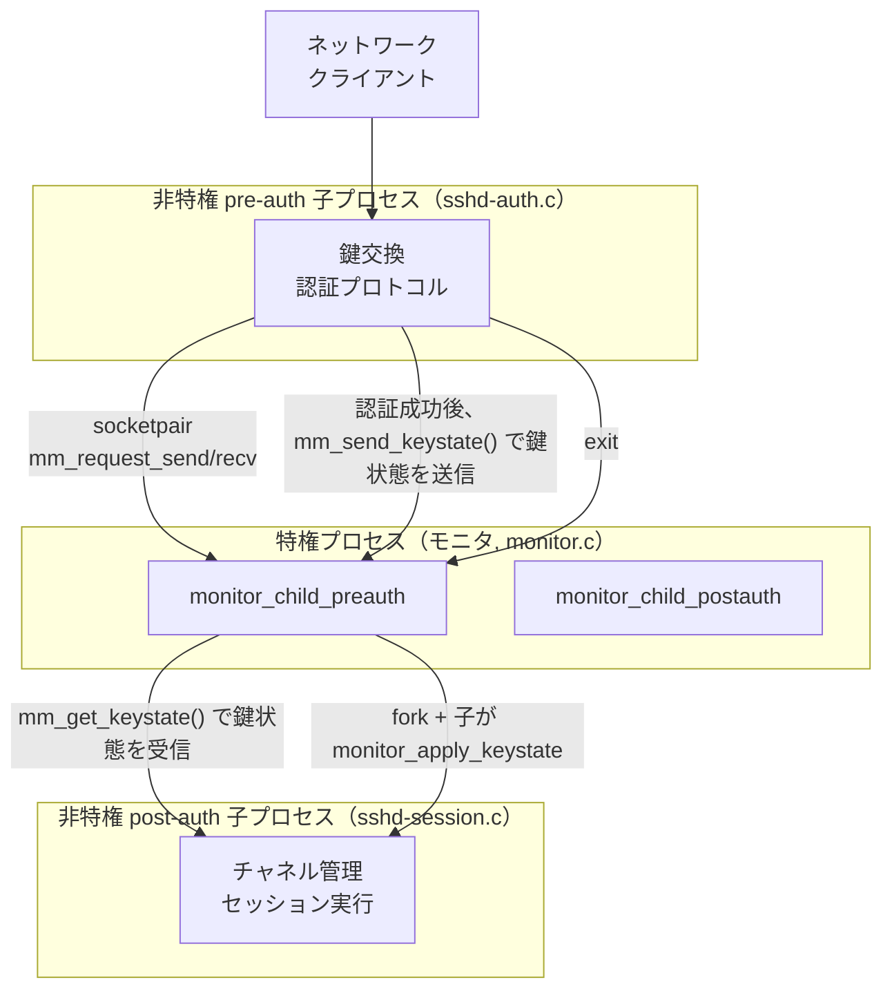

# 第11章 権限分離

> 本章で読むソース
>
> - [`monitor.h`](https://github.com/openssh/openssh-portable/blob/V_10_3_P1/monitor.h#L1-L106)
> - [`monitor.c`](https://github.com/openssh/openssh-portable/blob/V_10_3_P1/monitor.c#L1-L2108)
> - [`monitor_wrap.c`](https://github.com/openssh/openssh-portable/blob/V_10_3_P1/monitor_wrap.c#L1-L1251)
> - [`monitor_wrap.h`](https://github.com/openssh/openssh-portable/blob/V_10_3_P1/monitor_wrap.h#L1-L114)
> - [`sshd-auth.c`](https://github.com/openssh/openssh-portable/blob/V_10_3_P1/sshd-auth.c#L1-L867)
> - [`sshd-session.c`](https://github.com/openssh/openssh-portable/blob/V_10_3_P1/sshd-session.c#L371-L427)

## この章の狙い

OpenSSH は認証前のネットワーク通信を処理するプロセスを **権限のない** ユーザー（通常 `sshd` アカウント）で実行することで、リモートからの攻撃による被害を制限する。
この仕組みが **権限分離（privilege separation）** である。
本章では、特権モニタプロセスと非特権子プロセスの分割、ソケットペア通信、認証前後のディスパッチループ、鍵情報の引き継ぎを解説する。

## 前提

- 第5章（認証フレームワーク）で説明した認証の流れを理解していること
- 第10章（サーバーセッション）で説明した sshd 全体のプロセスモデルを理解していること
- Unix のプロセス分離（fork, chroot, setuid）の基礎知識

## 権限分離の目的

SSH サーバーはホスト秘密鍵やパスワード検証などの特権操作を必要とする。
しかし、鍵交換や認証のプロトコル処理をすべて root 権限で行うと、バッファオーバーフローなどのぜい弱性が発見されたときにサーバー全体が乗っ取られる。

OpenSSH は Niels Provos と Markus Friedl による設計で、認証前（pre-auth）のネットワーク処理を **非特権子プロセス** に委譲し、特権操作だけを **モニタプロセス** が代行する方式を採用した。
認証に成功すると、モニタプロセスは暗号鍵を引き継いで **認証後（post-auth）の非特権子プロセス** を起動し、ユーザー権限でセッションを実行する。

## アーキテクチャ全体図



## ソケットペア通信

モニタプロセスと子プロセスの間は Unix ドメインのソケットペアで結ばれる。

[`monitor.c` L1922-L1951](https://github.com/openssh/openssh-portable/blob/V_10_3_P1/monitor.c#L1922-L1951) の `monitor_openfds` で、`socketpair(AF_UNIX, SOCK_STREAM, 0, pair)` と `pipe` の2組のチャネルを作成する。

```c
// monitor.c L1929-L1951
	if (socketpair(AF_UNIX, SOCK_STREAM, 0, pair) == -1)
		fatal_f("socketpair: %s", strerror(errno));
	mon->m_recvfd = pair[0];
	mon->m_sendfd = pair[1];

	if (do_logfds) {
		if (pipe(pair) == -1)
			fatal_f("pipe: %s", strerror(errno));
		mon->m_log_recvfd = pair[0];
		mon->m_log_sendfd = pair[1];
	}
```

片方がメッセージ送信用、もう片方がログ転送用である。

[`monitor_wrap.c` L150-L171](https://github.com/openssh/openssh-portable/blob/V_10_3_P1/monitor_wrap.c#L150-L171) の `mm_request_send` と [`monitor_wrap.c` L173-L203](https://github.com/openssh/openssh-portable/blob/V_10_3_P1/monitor_wrap.c#L173-L203) の `mm_request_receive` が実際のデータ転送を行う。
メッセージの先頭4バイトが長さで、続く1バイトがリクエスト種別である。

```c
// monitor_wrap.c L150-L171
void
mm_request_send(int sock, enum monitor_reqtype type, struct sshbuf *m)
{
	u_char buf[5];
	POKE_U32(buf, mlen + 1);
	buf[4] = (u_char) type;
	if (atomicio(vwrite, sock, buf, sizeof(buf)) != sizeof(buf) ||
	    atomicio(vwrite, sock, sshbuf_mutable_ptr(m), mlen) != mlen) {
		// ...
	}
}
```

`mm_request_receive` は逆に長さを読み取り、バッファを確保して本体を受信する。
この単純な直列化プロトコルは子プロセスの暴走やメッセージの改ざんに対する保護を提供しないが、socketpair は同一ホスト内で閉じており、外部から介入できない。

## monitor_child_preauth ディスパッチループ

認証前のモニタプロセスは [`monitor.c` L266-L396](https://github.com/openssh/openssh-portable/blob/V_10_3_P1/monitor.c#L266-L396) の `monitor_child_preauth` でループする。

```c
// monitor.c L266-L300
void
monitor_child_preauth(struct ssh *ssh, struct monitor *pmonitor)
{
	struct mon_table *ent;
	int status, authenticated = 0, partial = 0;

	mon_dispatch = mon_dispatch_proto20;
	/* Permit requests for state, moduli and signatures */
	monitor_permit(mon_dispatch, MONITOR_REQ_STATE, 1);
	monitor_permit(mon_dispatch, MONITOR_REQ_MODULI, 1);
	monitor_permit(mon_dispatch, MONITOR_REQ_SETCOMPAT, 1);
	monitor_permit(mon_dispatch, MONITOR_REQ_SIGN, 1);

	while (!authenticated) {
		authenticated = (monitor_read(ssh, pmonitor,
		    mon_dispatch, &ent) == 1);
		// ...
	}
```

ループは一度に一つのリクエストを受け付け、ディスパッチテーブルに基づいてハンドラを呼び出す。
ディスパッチテーブルは [`monitor.c` L182-L233](https://github.com/openssh/openssh-portable/blob/V_10_3_P1/monitor.c#L182-L233) で定義される。

認証前のテーブル `mon_dispatch_proto20` には次のエントリが並ぶ。

| リクエスト種別 | フラグ | 意味 |
|---|---|---|
| `MONITOR_REQ_STATE` | MON_ONCE | 設定情報の転送 |
| `MONITOR_REQ_MODULI` | MON_ONCE | DH パラメータ選択 |
| `MONITOR_REQ_SIGN` | MON_ONCE | ホスト鍵署名 |
| `MONITOR_REQ_PWNAM` | MON_ONCE | パスワードエントリ取得 |
| `MONITOR_REQ_AUTHSERV` | MON_ONCE | サービス名通知 |
| `MONITOR_REQ_AUTHPASSWORD` | MON_AUTH | パスワード検証 |
| `MONITOR_REQ_KEYALLOWED` | MON_ISAUTH | 公開鍵の許可確認 |
| `MONITOR_REQ_KEYVERIFY` | MON_AUTH | 署名検証 |

フラグ `MON_AUTH` は「認証を決定できる」ことを示し、これが成功した返り値を返すとループが終了する。
フラグ `MON_ONCE` は一度使うと自動的に禁止されるため、同一リクエストの再送信を防げる。

## 特権操作の委譲

### 鍵署名（mm_answer_sign）

子プロセスは KEX の署名やホスト鍵証明のために、特権モニタに署名を依頼する。

[`monitor.c` L721-L822](https://github.com/openssh/openssh-portable/blob/V_10_3_P1/monitor.c#L721-L822) の `mm_answer_sign` は、子から受け取った公開鍵をもとにホスト鍵のインデックスを特定し、`sshkey_sign` を呼び出す。

```c
// monitor.c L793-L816
	if ((key = get_hostkey_by_index(keyid)) != NULL) {
		if ((r = sshkey_sign(key, &signature, &siglen, p, datlen, alg,
		    options.sk_provider, NULL, compat)) != 0)
			fatal_fr(r, "sign");
	} else if ((key = get_hostkey_public_by_index(keyid, ssh)) != NULL &&
	    auth_sock > 0) {
		if ((r = ssh_agent_sign(auth_sock, key, &signature, &siglen,
		    p, datlen, alg, compat)) != 0)
			fatal_fr(r, "agent sign");
	}
```

ホスト鍵は特権モニタだけが保持する。子プロセスは公開鍵しか持たないため、仮に乗っ取られてもホスト秘密鍵を奪取できない。

### パスワード検証（mm_answer_authpassword）

[`monitor.c` L1023-L1059](https://github.com/openssh/openssh-portable/blob/V_10_3_P1/monitor.c#L1023-L1059) の `mm_answer_authpassword` は、子プロセスから送られたパスワード文字列を `auth_password` に渡して検証する。

```c
// monitor.c L1031-L1038
	if ((r = sshbuf_get_cstring(m, &passwd, &plen)) != 0)
		fatal_fr(r, "parse");
	authenticated = options.password_authentication &&
	    auth_password(ssh, passwd);
	freezero(passwd, plen);
```

パスワードそのものは特権プロセスの中で検証され、子プロセスには成功/失敗の二値しか返らない。
これにより、非特権子プロセスがパスワードハッシュを盗むリスクを排除している。

### 公開鍵認証（mm_answer_keyallowed / mm_answer_keyverify）

公開鍵認証は2段階に分かれる。
[`monitor.c` L1297-L1387](https://github.com/openssh/openssh-portable/blob/V_10_3_P1/monitor.c#L1297-L1387) の `mm_answer_keyallowed` が鍵の許可確認を行い、[`monitor.c` L1539-L1654](https://github.com/openssh/openssh-portable/blob/V_10_3_P1/monitor.c#L1539-L1654) の `mm_answer_keyverify` が署名検証を行う。

`mm_answer_keyallowed` は、`auth2_key_already_used` による二重利用チェックと `user_key_allowed` による authorized_keys 照会を特権側で行う。
照合に成功すると鍵のバイナリをキャッシュし、`mm_answer_keyverify` でその鍵と署名の検証を実行する。
この2段階設計により、非特権プロセスが未許可の鍵で署名検証を試みることを防止できる。

## 鍵状態の引き継ぎ（monitor_clear_keystate / monitor_apply_keystate）

認証が成功した直後、非特権子プロセス（sshd-auth.c）は [`mm_send_keystate`](https://github.com/openssh/openssh-portable/blob/V_10_3_P1/monitor_wrap.c#L629-L642) で現在の暗号鍵状態をモニタに送信し、`exit(0)` する。

```c
// monitor_wrap.c L629-L642
void
mm_send_keystate(struct ssh *ssh, struct monitor *monitor)
{
	struct sshbuf *m;
	if ((r = ssh_packet_get_state(ssh, m)) != 0)
		fatal_fr(r, "ssh_packet_get_state");
	mm_request_send(monitor->m_recvfd, MONITOR_REQ_KEYEXPORT, m);
}
```

モニタは `mm_get_keystate` でこれを受信する（[`monitor.c` L1906-L1916](https://github.com/openssh/openssh-portable/blob/V_10_3_P1/monitor.c#L1906-L1916)）。

```c
// monitor.c L1906-L1916
void
mm_get_keystate(struct ssh *ssh, struct monitor *pmonitor)
{
	mm_request_receive_expect(pmonitor->m_sendfd, MONITOR_REQ_KEYEXPORT,
	    child_state);
}
```

その後、モニタは新しい子プロセス（sshd-session.c）を fork し、子プロセス側が `monitor_apply_keystate` で鍵状態を適用する（[`monitor.c` L1862-L1901](https://github.com/openssh/openssh-portable/blob/V_10_3_P1/monitor.c#L1862-L1901)）。
親モニタは `monitor_clear_keystate` で鍵状態を消去し、postauth monitor へ移行する。

```c
// monitor.c L1862-L1901
void
monitor_apply_keystate(struct ssh *ssh, struct monitor *pmonitor)
{
	if ((r = ssh_packet_set_state(ssh, child_state)) != 0)
		fatal_fr(r, "packet_set_state");
	// session ID の一致確認
	kex->sign = sshd_hostkey_sign;
}
```

一方、[`monitor_clear_keystate`](https://github.com/openssh/openssh-portable/blob/V_10_3_P1/monitor.c#L1853-L1860) はモニタの鍵状態を消去する。

```c
// monitor.c L1853-L1860
void
monitor_clear_keystate(struct ssh *ssh, struct monitor *pmonitor)
{
	ssh_clear_newkeys(ssh, MODE_IN);
	ssh_clear_newkeys(ssh, MODE_OUT);
	sshbuf_free(child_state);
	child_state = NULL;
}
```

これにより、モニタプロセスは古い暗号鍵を保持しない。
認証後の子プロセスだけが現在の暗号鍵を持つ。

## sshd-auth.c の非特権サンドボックス

[`sshd-auth.c` L178-L215](https://github.com/openssh/openssh-portable/blob/V_10_3_P1/sshd-auth.c#L178-L215) の `privsep_child_demote` が、子プロセスの権限を剥奪する。

```c
// sshd-auth.c L178-L215
static void
privsep_child_demote(void)
{
#ifndef HAVE_PLEDGE
	if ((box = ssh_sandbox_init(pmonitor)) == NULL)
		fatal_f("ssh_sandbox_init failed");
#endif
	if (privsep_chroot) {
		if (chroot(_PATH_PRIVSEP_CHROOT_DIR) == -1)
			fatal("chroot(...)");
		permanently_set_uid(privsep_pw);
	}
#ifdef HAVE_PLEDGE
	if (pledge("stdio", NULL) == -1)
		fatal_f("pledge()");
#else
	ssh_sandbox_child(box);
#endif
}
```

この関数は以下の3段階で権限を剥奪する。

1. **chroot**: 子プロセスを `/var/empty` などの空ディレクトリに閉じ込め、ファイルシステムへのアクセスを制限する
2. **setuid**: `sshd` ユーザーに実効 UID を変更する
3. **サンドボックス**: OpenBSD では `pledge("stdio", NULL)`、Linux では seccomp によるシステムコールフィルタを適用する

サンドボックスはプラットフォームごとに [`ssh-sandbox.h`](https://github.com/openssh/openssh-portable/blob/V_10_3_P1/ssh-sandbox.h) で抽象化されており、Linux の seccomp フィルタ（`ssh_sandbox_init`→`ssh_sandbox_child`）や FreeBSD の Capsicum が選択される。
非特権プロセスは `read`/`write`/`poll` などのごく限られたシステムコールしか実行できず、`open` や `connect` は禁止される。

## 認証後の権限分離（sshd-session.c）

認証が成功すると、モニタは新しい非特権子プロセス（sshd-session.c）を fork する。

[`sshd-session.c` L371-L427](https://github.com/openssh/openssh-portable/blob/V_10_3_P1/sshd-session.c#L371-L427) の `privsep_postauth` で、新しいソケットペアを作り、`monitor_child_postauth` に入る。

```c
// sshd-session.c L389-L427
	/* New socket pair */
	monitor_reinit(pmonitor);

	pmonitor->m_pid = fork();
	if (pmonitor->m_pid == -1)
		fatal("fork of unprivileged child failed");
	else if (pmonitor->m_pid != 0) {
		verbose("User child is on pid %ld", (long)pmonitor->m_pid);
		sshbuf_reset(loginmsg);
		monitor_clear_keystate(ssh, pmonitor);
		monitor_child_postauth(ssh, pmonitor);

		/* NEVERREACHED */
		exit(0);
	}

	/* child */

	close(pmonitor->m_sendfd);
	pmonitor->m_sendfd = -1;

	/* Demote the private keys to public keys. */
	demote_sensitive_data();

	reseed_prngs();

	/* Drop privileges */
	if (!skip_privdrop)
		do_setusercontext(authctxt->pw);

	/* It is safe now to apply the key state */
	monitor_apply_keystate(ssh, pmonitor);
```

認証後のディスパッチテーブル `mon_dispatch_postauth20`（[`monitor.c` L219-L233](https://github.com/openssh/openssh-portable/blob/V_10_3_P1/monitor.c#L219-L233)）は認証前より限定的で、`MONITOR_REQ_PTY`（PTY 割り当て）と `MONITOR_REQ_TERM`（セッション終了）だけを追加する。
署名リクエストはセッション中も再鍵で使用されるため引き続き許可される。

認証後も子プロセスはユーザー権限に降格され、`destroy_sensitive_data` でホスト鍵は破棄される。
PTY 割り当てのような特権操作はモニタ経由で行われる。

## まとめ

OpenSSH の権限分離は、「認証前のネットワーク処理を完全に非特権化する」という設計判断によって、リモートからの攻撃による被害をプロセス分離の壁で局限する。

1. 特権モニタと非特権子プロセスをソケットペアで結合し、限られたリクエスト種別だけを許可する
2. 認証前の子プロセスは chroot + setuid + seccomp/pledge の三重で制限される
3. 認証成功後は新しい子プロセスを起動し、暗号鍵を引き継ぐ
4. ホスト秘密鍵は決して子プロセスに渡らず、署名はモニタが代行する

この設計が OpenSSH の歴史上、深刻なバッファオーバーフローぜい弱性が発見されても、攻撃者が root 権限を得るまでに複数の障壁を越えなければならない理由である。

## 関連する章

- 第5章（認証フレームワーク）
- 第6章（公開鍵認証）
- 第10章（サーバーセッション）
- 第12章（鍵管理）
