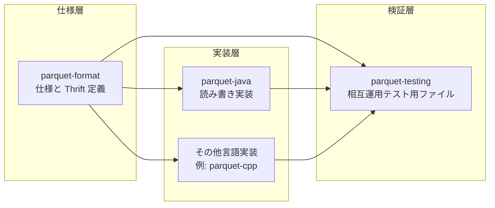
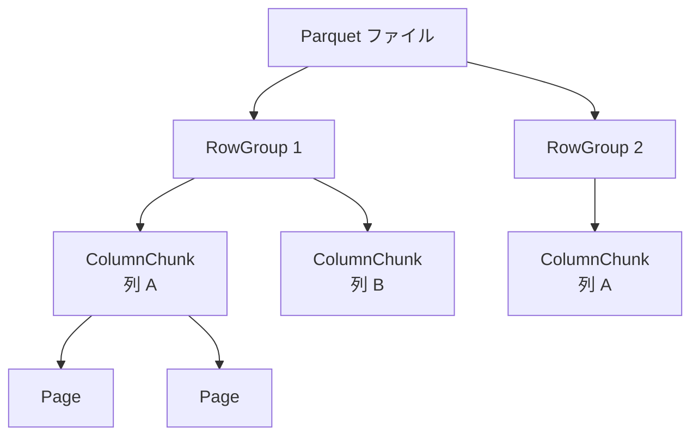
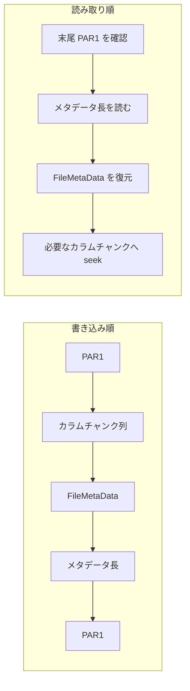

# 第1章 Parquet とは何か

> **本章で読むソース**
>
> - [`README.md`](https://github.com/apache/parquet-format/blob/apache-parquet-format-2.13.0/README.md)
> - [`src/main/thrift/parquet.thrift`](https://github.com/apache/parquet-format/blob/apache-parquet-format-2.13.0/src/main/thrift/parquet.thrift)

## この章の狙い

Apache Parquet が列指向ストレージフォーマットとして何を解決するために設計されたかを、仕様リポジトリの README から読み取る。
Motivation と Modules の記述を手がかりに、本書が扱う「仕様」と参照実装の境界を固定し、ファイル全体の階層用語を導入する。

## 前提

リレーショナルデータベースや分散ファイルシステム上の分析ワークロードに慣れていること。
行指向フォーマット（CSV、JSON Lines）と列指向フォーマットの違いを、スキャンする列の数が I/O 量に与える影響という観点で説明できる程度でよい。

## Parquet の位置づけ

**Parquet** は、効率的なデータ保存と取得のために設計された、オープンソースの列指向データファイルフォーマットである。
仕様リポジトリの冒頭が、その目的を一文で述べている。

[`README.md` L25-L29](https://github.com/apache/parquet-format/blob/apache-parquet-format-2.13.0/README.md#L25-L29)

```text
Apache Parquet is an open source, column-oriented data file format
designed for efficient data storage and retrieval. It provides high
performance compression and encoding schemes to handle complex data in
bulk and is supported in many programming languages and analytics
tools.
```

注目すべき語は "column-oriented data file format" である。
Parquet はクエリエンジンでもストレージサーバでもなく、1 ファイルあたりのバイト列の並び方とメタデータの意味を定める仕様である。
Spark、Trino、DuckDB、Pandas などの実装が同じ仕様に従って読み書きすることで、言語やフレームワークをまたいでファイルを交換できる。

同じリポジトリには、メタデータを読み書きするための Thrift 定義も含まれる。
README は、仕様本文と Thrift 定義を併読することを前提にしている。

[`README.md` L22-L23](https://github.com/apache/parquet-format/blob/apache-parquet-format-2.13.0/README.md#L22-L23)

```text
This repository contains the specification for [Apache Parquet] and
[Apache Thrift] definitions to read and write Parquet metadata.
```

本書は `apache/parquet-format` の仕様と Thrift 定義を対象とし、Java 実装（parquet-java）や C++ 実装（parquet-cpp）の内部には踏み込まない。

## 設計動機：Hadoop エコシステムへの共通基盤

Motivation 節は、Parquet が生まれた当時の文脈を短くまとめている。
最初の段落は、圧縮された列指向表現の利点を Hadoop エコシステム全体で共有したい、という動機を述べる。

[`README.md` L36](https://github.com/apache/parquet-format/blob/apache-parquet-format-2.13.0/README.md#L36)

```text
We created Parquet to make the advantages of compressed, efficient columnar data representation available to any project in the Hadoop ecosystem.
```

列指向表現の利点は、解析クエリが必要な列だけを読むときに、行全体をデシリアライズせずに済む点にある。
同種の値が連続して並ぶため、辞書符号化やランレングス符号化といったエンコーディングも効きやすい。
Motivation はこの利点を「どのフレームワークからも使える形で」提供することを目標に掲げている。

### ネスト構造と Dremel 由来の表現

2 段落目は、複雑なネスト構造を最初から想定した設計であることを示す。

[`README.md` L38](https://github.com/apache/parquet-format/blob/apache-parquet-format-2.13.0/README.md#L38)

```text
Parquet is built from the ground up with complex nested data structures in mind, and uses the [record shredding and assembly algorithm](https://github.com/julienledem/redelm/wiki/The-striping-and-assembly-algorithms-from-the-Dremel-paper) described in the Dremel paper. We believe this approach is superior to simple flattening of nested name spaces.
```

ネストしたレコードをフラットな列集合へ分解する手順は、Dremel 論文で示された shredding と assembly に由来する。
名前空間を単純に平坦化すると、繰り返しフィールドやオプショナルフィールドの出現位置が列の意味から読み取りにくくなる。
Parquet は定義レベルと繰り返しレベルという補助列を使い、元のネスト構造を復元できる形で値を格納する（詳細は第4章で扱う）。

### カラム単位の圧縮とエンコーディング

3 段落目は、圧縮とエンコーディングをカラム単位で選べることを強調している。

[`README.md` L40](https://github.com/apache/parquet-format/blob/apache-parquet-format-2.13.0/README.md#L40)

```text
Parquet is built to support very efficient compression and encoding schemes. Multiple projects have demonstrated the performance impact of applying the right compression and encoding scheme to the data. Parquet allows compression schemes to be specified on a per-column level, and is future-proofed to allow adding more encodings as they are invented and implemented.
```

行指向フォーマットでは、1 行の中に型の異なるフィールドが混在するため、1 つの符号化方式を全体に適用しにくい。
Parquet は `ColumnMetaData` に圧縮コーデックとエンコーディングの集合を記録し、列ごとに最適な組み合わせを選べる。
エンコーディングは Thrift の `Encoding` 列挙で拡張可能に定義され、仕様の後方互換を保ったまま新方式を追加できる（第5章、第6章）。

### 設計上の工夫：カラム単位の符号化選択

カラム単位の指定は、ディスク上のバイト列が「同型の値の連続」になるようにデータを並べ替える列指向レイアウトと組み合わさる。
整数列には差分符号化、文字列列には辞書符号化、浮動小数点列にはバイトストリーム分割といった選択が、他列の統計的性質に引きずられない。
その結果、ファイルサイズとデコードコストの両方を、列のデータ分布に合わせて独立に最適化できる。

### フレームワーク非依存の利用

最後の段落は、特定の処理フレームワークに依存しないことを明示する。

[`README.md` L42](https://github.com/apache/parquet-format/blob/apache-parquet-format-2.13.0/README.md#L42)

```text
Parquet is built to be used by anyone. The Hadoop ecosystem is rich with data processing frameworks, and we are not interested in playing favorites. We believe that an efficient, well-implemented columnar storage substrate should be useful to all frameworks without the cost of extensive and difficult to set up dependencies.
```

仕様がフレームワーク固有の API に依存しないのは、ファイルフォーマットが「データの物理配置」と「メタデータの意味」だけを固定するからである。
読み手は Thrift で定義された `FileMetaData` を解釈すれば、実装言語を問わず同じファイルを扱える。

## エコシステムにおける3つのリポジトリ

Modules 節は、Parquet 関連プロジェクトの役割分担を示す。
本書の主対象は `parquet-format` である。

[`README.md` L46-L50](https://github.com/apache/parquet-format/blob/apache-parquet-format-2.13.0/README.md#L46-L50)

```text
The [parquet-format] project contains format specifications and Thrift definitions of metadata required to properly read Parquet files.

The [parquet-java] project contains multiple sub-modules, which implement the core components of reading and writing a nested, column-oriented data stream, map this core onto the parquet format, and provide Hadoop Input/Output Formats, Pig loaders, and other java-based utilities for interacting with Parquet.

The [parquet-testing] project contains a set of files that can be used to verify that implementations in different languages can read and write each other's files.
```

3 つのリポジトリの関係を図示する。



`parquet-format` は「何を書くか」を定め、`parquet-java` などは「どう書くか」を担う。
`parquet-testing` は、実装間でバイト列が一致するかを確認するための共有テストデータを提供する。
本書は左端の仕様層を読み解くことに専念する。

## 階層用語と並列化の単位

ファイルを読む前に、README の Glossary が定義する階層用語を押さえておく。

[`README.md` L72-L85](https://github.com/apache/parquet-format/blob/apache-parquet-format-2.13.0/README.md#L72-L85)

```text
  - Row group: A logical horizontal partitioning of the data into rows.
    There is no physical structure that is guaranteed for a row group.
    A row group consists of a column chunk for each column in the dataset.

  - Column chunk: A chunk of the data for a particular column.  They live
    in a particular row group and are guaranteed to be contiguous in the file.

  - Page: Column chunks are divided up into pages.  A page is conceptually
    an indivisible unit (in terms of compression and encoding).  There can
    be multiple page types which are interleaved in a column chunk.

Hierarchically, a file consists of one or more row groups.  A row group
contains exactly one column chunk per column.  Column chunks contain one or
more pages.
```

**ロウグループ**は行方向の論理分割であり、ディスク上に専用の区切りブロックが必ず存在するわけではない。
**カラムチャンク**は特定ロウグループ内の1列分のデータ塊で、ファイル内で連続したバイト列として配置される。
**ページ**は圧縮とエンコーディングの最小単位であり、カラムチャンク内にヘッダ付きで並ぶ。

並列化の粒度は、処理の種類ごとに README が明示している。

[`README.md` L87-L90](https://github.com/apache/parquet-format/blob/apache-parquet-format-2.13.0/README.md#L87-L90)

```text
## Unit of parallelization
  - MapReduce - File/Row Group
  - IO - Column chunk
  - Encoding/Compression - Page
```

MapReduce 系のジョブはファイルまたはロウグループ単位でタスクを分割し、I/O はカラムチャンク単位でまとめて読む設計と相性がよい。
符号化と圧縮の並列化はページ単位で行える。
この対応は、メタデータがロウグループとカラムチャンクのオフセットを記録する理由とも一致する（第2章）。



## ファイルレイアウトの概要

File format 節は、バイト列の大まかな並びを ASCII 図で示す。
詳細なメタデータ構造は第2章で扱うが、ここでは全体像だけを押さえる。

[`README.md` L95-L111](https://github.com/apache/parquet-format/blob/apache-parquet-format-2.13.0/README.md#L95-L111)

```text
    4-byte magic number "PAR1"
    <Column 1 Chunk 1>
    <Column 2 Chunk 1>
    ...
    <Column N Chunk 1>
    <Column 1 Chunk 2>
    <Column 2 Chunk 2>
    ...
    <Column N Chunk 2>
    ...
    <Column 1 Chunk M>
    <Column 2 Chunk M>
    ...
    <Column N Chunk M>
    File Metadata
    4-byte length in bytes of file metadata (little endian)
    4-byte magic number "PAR1"
```

先頭と末尾の `PAR1` はマジックナンバーであり、ファイル形式の識別子として機能する。
データ領域は列ごとに全ロウグループ分のチャンクをまとめるのではなく、ロウグループごとに列1から列Nまでのカラムチャンクが連続して並ぶ。
すなわち `<Column 1 Chunk 1>` から `<Column N Chunk 1>` のあと `<Column 1 Chunk 2>` へ進む。
フッタは末尾から `PAR1`、その直前に4バイトのメタデータ長、さらに手前に `FileMetaData`（Thrift 構造体）が並ぶ。
読み手は末尾のマジックで形式を確認したあと直前の4バイトで長さを得、長さ分だけさかのぼって `FileMetaData` を読む。
メタデータ長が `FileMetaData` の後ろに置かれるからこそ、末尾から長さを取得できる。

読み手はまずフッタ側のメタデータを読み、必要なカラムチャンクの位置を特定してからデータ領域へ seek する。

[`README.md` L118-L121](https://github.com/apache/parquet-format/blob/apache-parquet-format-2.13.0/README.md#L118-L121)

```text
File Metadata is written after the data to allow for single pass writing.

Readers are expected to first read the file metadata to find all the column
chunks they are interested in.  The columns chunks should then be read sequentially.
```

### 設計上の工夫：フッタ末尾配置による一パス書き込み

メタデータをファイル末尾に置くと、書き込み側は全カラムチャンクを順に出力したあと、確定したオフセットと統計を集約して `FileMetaData` を一度だけ書ける。
先頭にメタデータを置く方式では、データ書き込み中にオフセットが変わるたびにメタデータを更新するか、二パス書き込みが必要になる。
フッタ配置は、大規模なバッチ書き込みでディスクへの走査回数を増やさないための構造選択である。



## 仕様リポジトリの中身

本書が「ソースコードリーディング」と呼ぶ対象は、実行可能なプログラムではなく、フォーマット定義の集合である。
中核は次の2種類に分かれる。

| 種類 | 代表ファイル | 役割 |
|------|-------------|------|
| Thrift 定義 | `src/main/thrift/parquet.thrift` | `FileMetaData`、`RowGroup`、`ColumnChunk` などメタデータ構造の型 |
| 仕様書 Markdown | `Encodings.md`、`LogicalTypes.md`、`Compression.md` など | エンコーディング手順、論理型の解釈規則、圧縮コーデックの意味 |

README の File format 節も、Thrift 定義との併読を求めている。

[`README.md` L93](https://github.com/apache/parquet-format/blob/apache-parquet-format-2.13.0/README.md#L93)

```text
This file and the [Thrift definition](src/main/thrift/parquet.thrift) should be read together to understand the format.
```

以降の章では、型（第3章）、エンコーディング（第5章、第6章）、ページ（第7章）、統計とインデックス（第9章以降）と、Thrift フィールドと仕様書 Markdown を対応づけながら読み進める。

## まとめ

Parquet は列指向のファイルフォーマット仕様であり、圧縮とエンコーディングをカラム単位で選べることが Motivation に繰り返し現れる。
ネスト構造は Dremel 由来の shredding で表現し、エコシステム全体で共有するために `parquet-format` が Thrift 定義と仕様書 Markdown を公開している。
ファイルは `PAR1` で囲まれたデータ領域とフッタの `FileMetaData` からなり、メタデータを末尾に置くことで一パス書き込みを可能にしている。

## 関連する章

- [第2章 ファイル構造とメタデータ階層](02-file-structure.md)
