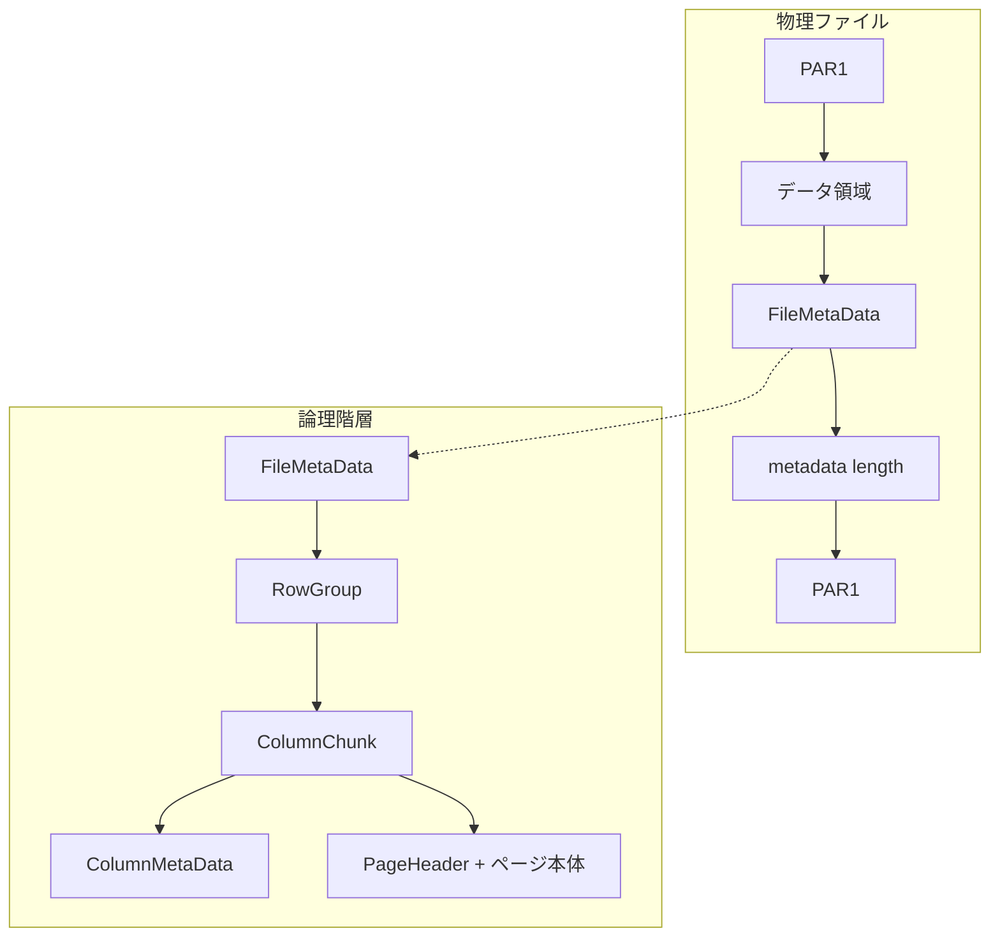
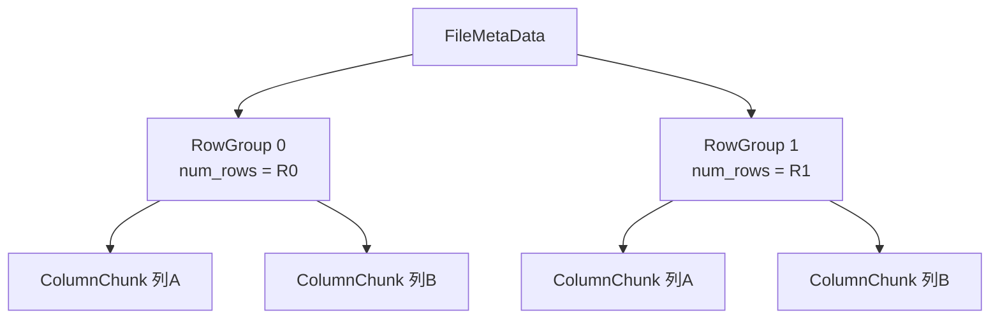
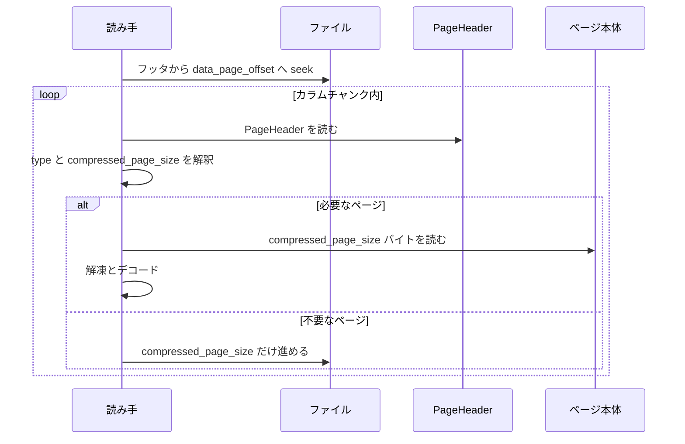

# 第2章 ファイル構造とメタデータ階層

> **本章で読むソース**
>
> - [`README.md`](https://github.com/apache/parquet-format/blob/apache-parquet-format-2.13.0/README.md)
> - [`src/main/thrift/parquet.thrift`](https://github.com/apache/parquet-format/blob/apache-parquet-format-2.13.0/src/main/thrift/parquet.thrift)

## この章の狙い

Parquet ファイルのバイト列レイアウトと、フッタに格納される Thrift メタデータの階層を対応づける。
`FileMetaData` から `RowGroup`、`ColumnChunk`、`ColumnMetaData`、`PageHeader` へと辿るフィールドの意味を押さえ、読み手がオフセット情報だけで必要列へ seek できる理由を説明する。

## 前提

第1章で列指向レイアウト、ロウグループ、カラムチャンク、ページの用語を導入済みであること。
Thrift が構造体とフィールド ID を持つ IDL であることは知っていればよい（本書ではメタデータの直列化形式としてのみ扱う）。

## 物理レイアウトと論理階層

README の File format 節は、N 列 M ロウグループの例でバイト列の並びを示す。

[`README.md` L95-L116](https://github.com/apache/parquet-format/blob/apache-parquet-format-2.13.0/README.md#L95-L116)

```text
    4-byte magic number "PAR1"
    <Column 1 Chunk 1>
    <Column 2 Chunk 1>
    ...
    <Column N Chunk 1>
    <Column 1 Chunk 2>
    <Column 2 Chunk 2>
    ...
    <Column N Chunk 2>
    ...
    <Column 1 Chunk M>
    <Column 2 Chunk M>
    ...
    <Column N Chunk M>
    File Metadata
    4-byte length in bytes of file metadata (little endian)
    4-byte magic number "PAR1"

In the above example, there are N columns in this table, split into M row
groups.  The file metadata contains the locations of all the column chunk
start locations.  More details on what is contained in the metadata can be found
in the Thrift definition.
```

物理ファイルは次の5領域に分けられる。

| 領域 | サイズ | 内容 |
|------|--------|------|
| 先頭マジック | 4 バイト | ASCII `PAR1` |
| データ領域 | 可変 | 全ロウグループの全カラムチャンク（ページ列を含む） |
| FileMetaData | 可変 | Thrift で直列化されたファイルメタデータ |
| メタデータ長 | 4 バイト | リトルエンディアン整数 |
| 末尾マジック | 4 バイト | ASCII `PAR1` |

論理階層は、ファイルがロウグループを含み、各ロウグループが列数と同じ個数のカラムチャンクを持ち、各カラムチャンクがページ列を含む、という木構造である。
物理配置では、同一ロウグループ内のカラムチャンクが連続して並ぶとは限らないが、各カラムチャンク自身のバイト列はファイル内で連続する（Glossary の "guaranteed to be contiguous"）。



## メタデータの二層と直列化プロトコル

Metadata 節は、メタデータが二種類あることと、Thrift 構造体の直列化方式を述べる。

[`README.md` L125-L128](https://github.com/apache/parquet-format/blob/apache-parquet-format-2.13.0/README.md#L125-L128)

```text
## Metadata
There are two types of metadata: file metadata and page header metadata.  All thrift structures
are serialized using the TCompactProtocol.
```

**ファイルメタデータ**はフッタの `FileMetaData` 構造体であり、スキーマ、ロウグループ一覧、各カラムチャンクのオフセットと統計を保持する。
**ページヘッダメタデータ**は各ページ先頭の `PageHeader` 構造体であり、そのページの種類、圧縮後サイズ、CRC などを保持する。

いずれも `TCompactProtocol` で直列化される。
フィールド ID と型情報を可変長整数で符号化するため、フィールド数が多い `FileMetaData` でも、固定幅バイナリよりヘッダが小さく収まりやすい。
フッタはファイル末尾の数 KB から数 MB になりうるため、メタデータ直列化のオーバーヘッドは全ファイルスキャンのたびに読み手が負担するコストになる。

### 設計上の工夫：TCompactProtocol によるフッタ縮小

`TCompactProtocol` はフィールド名をバイナリに含めず、型とフィールド ID だけを送る。
Parquet はスキーマとオフセット表がフッタに集中するため、メタデータのバイト数が小さいほど、列プルーニングだけを行うクエリでの初期 I/O が減る。

## FileMetaData：ファイル全体の索引

`FileMetaData` はフッタの中心構造体である。
必須フィールドはバージョン、スキーマ、行数、ロウグループ一覧の4つである。

[`src/main/thrift/parquet.thrift` L1365-L1388](https://github.com/apache/parquet-format/blob/apache-parquet-format-2.13.0/src/main/thrift/parquet.thrift#L1365-L1388)

```thrift
struct FileMetaData {
  /** Version of this file
    *
    * As of December 2025, there is no agreed upon consensus of what constitutes
    * version 2 of the file. For maximum compatibility with readers, writers should
    * always populate "1" for version. For maximum compatibility with writers,
    * readers should accept "1" and "2" interchangeably.  All other versions are
    * reserved for potential future use-cases.
    */
  1: required i32 version

  /** Parquet schema for this file.  This schema contains metadata for all the columns.
   * The schema is represented as a tree with a single root.  The nodes of the tree
   * are flattened to a list by doing a depth-first traversal.
   * The column metadata contains the path in the schema for that column which can be
   * used to map columns to nodes in the schema.
   * The first element is the root **/
  2: required list<SchemaElement> schema;

  /** Number of rows in this file **/
  3: required i64 num_rows

  /** Row groups in this file **/
  4: required list<RowGroup> row_groups
```

`schema` は木を深さ優先で平坦化した `SchemaElement` のリストであり、葉ノードが物理列に対応する。
`row_groups` の各要素が、データ領域内のカラムチャンク位置へ辿る入口になる。

任意フィールドには、作成アプリケーション名（`created_by`）、列ごとのソート順（`column_orders`）、暗号化アルゴリズム（`encryption_algorithm`）などがある。

[`src/main/thrift/parquet.thrift` L1390-L1415](https://github.com/apache/parquet-format/blob/apache-parquet-format-2.13.0/src/main/thrift/parquet.thrift#L1390-L1415)

```thrift
  /** Optional key/value metadata **/
  5: optional list<KeyValue> key_value_metadata

  /** String for application that wrote this file.  This should be in the format
   * <Application> version <App Version> (build <App Build Hash>).
   * e.g. impala version 1.0 (build 6cf94d29b2b7115df4de2c06e2ab4326d721eb55)
   **/
  6: optional string created_by

  /**
   * Sort order used for the min_value and max_value fields in the Statistics
   * objects and the min_values and max_values fields in the ColumnIndex
   * objects of each column in this file. Sort orders are listed in the order
   * matching the columns in the schema. The indexes are not necessarily the same
   * though, because only leaf nodes of the schema are represented in the list
   * of sort orders.
   *
   * Without column_orders, the meaning of the min_value and max_value fields
   * in the Statistics object and the ColumnIndex object is undefined. To ensure
   * well-defined behaviour, if these fields are written to a Parquet file,
   * column_orders must be written as well.
```

`column_orders` は統計値の比較規則を列ごとに固定する。
浮動小数点列で NaN の扱いが曖昧になる問題に対し、仕様は `IEEE_754_TOTAL_ORDER` の利用を推奨している（第9章）。

## RowGroup：水平分割とカラムチャンクの束

`RowGroup` は1つの水平スライスを表す。
`columns` リストの順序は、`FileMetaData.schema` の葉ノード順と一致しなければならない。

[`src/main/thrift/parquet.thrift` L1029-L1056](https://github.com/apache/parquet-format/blob/apache-parquet-format-2.13.0/src/main/thrift/parquet.thrift#L1029-L1056)

```thrift
struct RowGroup {
  /** Metadata for each column chunk in this row group.
   * This list must have the same order as the SchemaElement list in FileMetaData.
   **/
  1: required list<ColumnChunk> columns

  /** Total byte size of all the uncompressed column data in this row group **/
  2: required i64 total_byte_size

  /** Number of rows in this row group **/
  3: required i64 num_rows

  /** If set, specifies a sort ordering of the rows in this RowGroup.
   * The sorting columns can be a subset of all the columns.
   */
  4: optional list<SortingColumn> sorting_columns

  /** Byte offset from beginning of file to first page (data or dictionary)
   * in this row group **/
  5: optional i64 file_offset

  /** Total byte size of all compressed (and potentially encrypted) column data
   *  in this row group **/
  6: optional i64 total_compressed_size

  /** Row group ordinal in the file **/
  7: optional i16 ordinal
}
```

`num_rows` と `total_byte_size` は、実行計画でロウグループをスキップするかどうかの粗い見積もりに使える。
`sorting_columns` が設定されていれば、そのロウグループ内の行順序が分かる列の部分集合が記録される。
`file_offset` はロウグループ内で最初のページ（辞書ページを含む）へのシークを短縮するためのヒントである。



## ColumnChunk：カラムデータへの参照

`ColumnChunk` は、実データのバイト列そのものではなく、メタデータへの参照を保持する。
標準的な単一ファイルでは `file_path` は未設定であり、同じファイル内のオフセットだけで列データに到達する。

[`src/main/thrift/parquet.thrift` L971-L1027](https://github.com/apache/parquet-format/blob/apache-parquet-format-2.13.0/src/main/thrift/parquet.thrift#L971-L1027)

```thrift
struct ColumnChunk {
  /** File where column data is stored.  If not set, assumed to be same file as
    * metadata.  This path is relative to the current file.
    *
    * As of December 2025, the only known use-case for this field is writing summary
    * parquet files (i.e. "_metadata" files).  These files consolidate footers from
    * multiple parquet files to allow for efficient reading of footers to avoid file
    * listing costs and prune out files that do not need to be read based on statistics.
    *
    * These files do not appear to have ever been formally specified in the specification.
    * and are potentially problematic from a correctness perspective [1].
    *
    * [1] https://lists.apache.org/thread/ootf2kmyg3p01b1bvplpvp4ftd1bt72d
    *
    * There is no other known usage of this field. Specifically, there are no known
    * reference implementations that will read externally stored column data if this field is populated
    * within a standard parquet file. Making use of the field for this purpose is
    * not considered part of the Parquet specification.
    **/
  1: optional string file_path

  /** DEPRECATED: Byte offset in file_path to the ColumnMetaData
   *
   * Past use of this field has been inconsistent, with some implementations
   * using it to point to the ColumnMetaData and some using it to point to
   * the first page in the column chunk. In many cases, the ColumnMetaData at this
   * location is wrong. This field is now deprecated and should not be used.
   * Writers should set this field to 0 if no ColumnMetaData has been written outside
   * the footer.
   */
  2: required i64 file_offset = 0

  /** Column metadata for this chunk. Some writers may also replicate this at the
   * location pointed to by file_path/file_offset.
   * Note: while marked as optional, this field is in fact required by most major
   * Parquet implementations. As such, writers MUST populate this field.
   **/
  3: optional ColumnMetaData meta_data

  /** File offset of ColumnChunk's OffsetIndex **/
  4: optional i64 offset_index_offset

  /** Size of ColumnChunk's OffsetIndex, in bytes **/
  5: optional i32 offset_index_length

  /** File offset of ColumnChunk's ColumnIndex **/
  6: optional i64 column_index_offset

  /** Size of ColumnChunk's ColumnIndex, in bytes **/
  7: optional i32 column_index_length

  /** Crypto metadata of encrypted columns **/
  8: optional ColumnCryptoMetaData crypto_metadata

  /** Encrypted column metadata for this chunk **/
  9: optional binary encrypted_column_metadata
}
```

`meta_data` に格納される `ColumnMetaData` が、列の型、圧縮コーデック、先頭データページへのオフセットを担う。
`offset_index_offset` と `column_index_offset` はページインデックス（第10章）の位置を示し、ページ単位のスキップを可能にする。
`file_offset` フィールド（フィールド ID 2）は非推奨であり、新規 writer は 0 を書く。

## ColumnMetaData：列の符号化とオフセット

`ColumnMetaData` は、読み手がカラムチャンクをデコードするために必要な情報を集約する。

[`src/main/thrift/parquet.thrift` L888-L941](https://github.com/apache/parquet-format/blob/apache-parquet-format-2.13.0/src/main/thrift/parquet.thrift#L888-L941)

```thrift
struct ColumnMetaData {
  /** Type of this column **/
  1: required Type type

  /** Set of all encodings used for this column. The purpose is to validate
   * whether we can decode those pages. **/
  2: required list<Encoding> encodings

  /** Path in schema **/
  3: required list<string> path_in_schema

  /** Compression codec **/
  4: required CompressionCodec codec

  /** Number of values in this column **/
  5: required i64 num_values

  /** total byte size of all uncompressed pages in this column chunk (including the headers) **/
  6: required i64 total_uncompressed_size

  /** total byte size of all compressed, and potentially encrypted, pages
   *  in this column chunk (including the headers) **/
  7: required i64 total_compressed_size

  /** Optional key/value metadata **/
  8: optional list<KeyValue> key_value_metadata

  /** Byte offset from beginning of file to first data page **/
  9: required i64 data_page_offset

  /** Byte offset from beginning of file to root index page **/
  10: optional i64 index_page_offset

  /** Byte offset from the beginning of file to first (only) dictionary page **/
  11: optional i64 dictionary_page_offset

  /** optional statistics for this column chunk */
  12: optional Statistics statistics;

  /** Set of all encodings used for pages in this column chunk.
   * This information can be used to determine if all data pages are
   * dictionary encoded for example **/
  13: optional list<PageEncodingStats> encoding_stats;

  /** Byte offset from beginning of file to Bloom filter data. **/
  14: optional i64 bloom_filter_offset;

  /** Size of Bloom filter data including the serialized header, in bytes.
   * Added in 2.10 so readers may not read this field from old files and
   * it can be obtained after the BloomFilterHeader has been deserialized.
   * Writers should write this field so readers can read the bloom filter
   * in a single I/O.
   */
  15: optional i32 bloom_filter_length;
```

`data_page_offset` はファイル先頭からの絶対オフセットであり、列プルーニング時にフッタを読んだあと該当位置へ直接 seek するための鍵になる。
`dictionary_page_offset` が設定されている場合、辞書ページはカラムチャンクの先頭（データページより前）に置かれる（README の Column chunks 節）。
`statistics` は min/max などの集約統計であり、ロウグループ単位のプルーニングに使う（第9章）。
`bloom_filter_offset` と `bloom_filter_length` は、ブルームフィルタを1回の I/O で読み取れるよう長さを併記する。

### 設計上の工夫：data_page_offset による列単位シーク

行指向フォーマットでは、必要列だけを読むにも行全体を走査しがちである。
Parquet はフッタの `ColumnMetaData.data_page_offset` に各列の先頭ページ位置を記録するため、読み手は不要なカラムチャンクのバイト列を開かずに済む。
カラムチャンクがファイル内で連続しているため、一度 seek したあとはその列のページを順次読むだけでよく、ランダムアクセスと順次帯域の両方を活かせる。

## PageHeader：圧縮単位のメタデータ

カラムチャンクは `PageHeader` とページ本体の繰り返しで構成される。
`PageHeader` はページ種別、非圧縮サイズ、圧縮後サイズ、任意の CRC を保持する。

[`src/main/thrift/parquet.thrift` L810-L844](https://github.com/apache/parquet-format/blob/apache-parquet-format-2.13.0/src/main/thrift/parquet.thrift#L810-L844)

```thrift
struct PageHeader {
  /** the type of the page: indicates which of the *_header fields is set **/
  1: required PageType type

  /** Uncompressed page size in bytes (not including this header) **/
  2: required i32 uncompressed_page_size

  /** Compressed (and potentially encrypted) page size in bytes, not including this header **/
  3: required i32 compressed_page_size

  /** The 32-bit CRC checksum for the page, to be calculated as follows:
   *
   * - The standard CRC32 algorithm is used (with polynomial 0x04C11DB7,
   *   the same as in e.g. GZIP).
   * - All page types can have a CRC (v1 and v2 data pages, dictionary pages,
   *   etc.).
   * - The CRC is computed on the serialization binary representation of the page
   *   (not including the page header). For example, for v1
   *   data pages, the CRC is computed on the concatenation of repetition levels,
   *   definition levels and column values (optionally compressed, optionally
   *   encrypted).
   * - The CRC computation therefore takes place after any compression
   *   and encryption steps, if any.
   *
   * If enabled, this allows for disabling checksumming in HDFS if only a few
   * pages need to be read.
   */
  4: optional i32 crc

  // Headers for page specific data.  One only will be set.
  5: optional DataPageHeader data_page_header;
  6: optional IndexPageHeader index_page_header;
  7: optional DictionaryPageHeader dictionary_page_header;
  8: optional DataPageHeaderV2 data_page_header_v2;
}
```

`type` に応じて、`data_page_header`、`dictionary_page_header`、`data_page_header_v2` のいずれか1つだけが設定される。
圧縮とエンコーディングはページ本体に適用され、ヘッダは圧縮前のメタデータとして読み手が先に解釈する。

README の Column chunks 節は、ページを飛ばして読めることを述べる。

[`README.md` L207-L211](https://github.com/apache/parquet-format/blob/apache-parquet-format-2.13.0/README.md#L207-L211)

```text
## Column chunks
Column chunks are composed of pages written back to back.  The pages share a common
header and readers can skip over pages they are not interested in.  The data for the
page follows the header and can be compressed and/or encoded.  The compression and
encoding is specified in the page metadata.
```

`compressed_page_size` を読めば、次のページヘッダへスキップするバイト数が決まる。
ページインデックス（`OffsetIndex`）があれば、行境界に揃ったページ単位のスキップがさらに効率化される（第10章）。



## 読み取り手順の全体像

README が示す読み取り順序は、フッタから入る一点読み取りである。

[`README.md` L120-L121](https://github.com/apache/parquet-format/blob/apache-parquet-format-2.13.0/README.md#L120-L121)

```text
Readers are expected to first read the file metadata to find all the column
chunks they are interested in.  The columns chunks should then be read sequentially.
```

手順を整理すると次のとおりになる。

1. ファイル末尾の `PAR1` を確認し、直前の4バイトからメタデータ長を取得する。
2. メタデータ長ぶん後方へ seek し、`FileMetaData` を `TCompactProtocol` で復元する。
3. クエリに必要な葉列だけを選び、対応する `ColumnChunk.meta_data` をたどる。
4. 統計やブルームフィルタでロウグループやカラムチャンクをプルーニングする（第9章、第11章）。
5. `data_page_offset`（および必要なら `dictionary_page_offset`）へ seek し、`PageHeader` を繰り返し読んでページをデコードする。

書き込み手順は逆で、カラムチャンクを順に出力したのちフッタを書く（第1章）。

[`README.md` L118](https://github.com/apache/parquet-format/blob/apache-parquet-format-2.13.0/README.md#L118)

```text
File Metadata is written after the data to allow for single pass writing.
```

### 設計上の工夫：メタデータ先読みによる列プルーニング

読み手はデータ領域全体を先頭から走査する必要がない。
フッタだけを読めばスキーマと全オフセットが揃うため、オブジェクトストアでも末尾数 KB の Range GET から計画を始められる実装が多い。
これは「メタデータとデータの分離」方針（README の Separating metadata and column data 節）と一致し、1つのメタデータファイルが複数データファイルを参照する構成にも拡張しやすい。

## メタデータとデータの分離

仕様は、メタデータと列データを明示的に分離する設計であると述べる。

[`README.md` L245-L248](https://github.com/apache/parquet-format/blob/apache-parquet-format-2.13.0/README.md#L245-L248)

```text
## Separating metadata and column data
The format is explicitly designed to separate the metadata from the data.  This
allows splitting columns into multiple files, as well as having a single metadata
file reference multiple parquet files.
```

`ColumnChunk.file_path` のコメントが示す `_metadata` サマリファイルは、複数ファイルのフッタを集約してファイル一覧コストを減らす用途を想定している。
標準的な単一 Parquet ファイルでは `file_path` は空であり、メタデータとデータは同一ファイル内で末尾と前半に分かれる。

## 設定パラメータとレイアウトのトレードオフ

Configurations 節は、ロウグループサイズとページサイズが I/O とメモリのトレードオフを決めると説明する。

[`README.md` L251-L262](https://github.com/apache/parquet-format/blob/apache-parquet-format-2.13.0/README.md#L251-L262)

```text
## Configurations
- Row group size: Larger row groups allow for larger column chunks which makes it
possible to do larger sequential IO.  Larger groups also require more buffering in
the write path (or a two pass write).  We recommend large row groups (512MB - 1GB).
Since an entire row group might need to be read, we want it to completely fit on
one HDFS block.  Therefore, HDFS block sizes should also be set to be larger.  An
optimized read setup would be: 1GB row groups, 1GB HDFS block size, 1 HDFS block
per HDFS file.
- Data page size: Data pages should be considered indivisible so smaller data pages
allow for more fine-grained reading (e.g. single row lookup).  Larger page sizes
incur less space overhead (less page headers) and potentially less parsing overhead
(processing headers).  Note: for sequential scans, it is not expected to read a page
at a time; this is not the IO chunk.  We recommend 8KB for page sizes.
```

ロウグループを大きくするとカラムチャンクも長くなり、順次 I/O の帯域利用率は上がる一方、書き込みバッファが増える。
ページを小さくすると `PageHeader` の比率は上がるが、ページ単位の細かいスキップがしやすくなる。
I/O の並列化単位はカラムチャンク、符号化の単位はページである（第1章）という整理と合わせて、チューニングの軸がぶれない。

## まとめ

Parquet ファイルは `PAR1` で囲まれたデータ領域と、Thrift の `FileMetaData` からなるフッタで構成される。
`FileMetaData` → `RowGroup` → `ColumnChunk` → `ColumnMetaData` → `PageHeader` という階層が、スキーマ、オフセット、符号化方式、統計を運ぶ。
`data_page_offset` と連続したカラムチャンク配置により列単位シークが可能であり、フッタ末尾配置と `TCompactProtocol` は書き込み一回走査と読み取り時のメタデータ I/O を抑える。

## 関連する章

- [第1章 Parquet とは何か](01-what-is-parquet.md)
