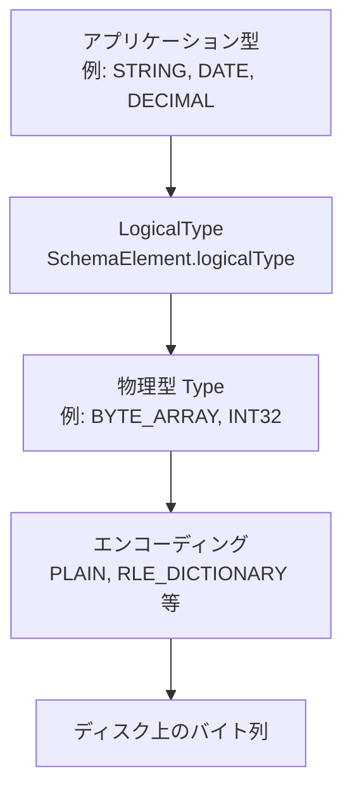
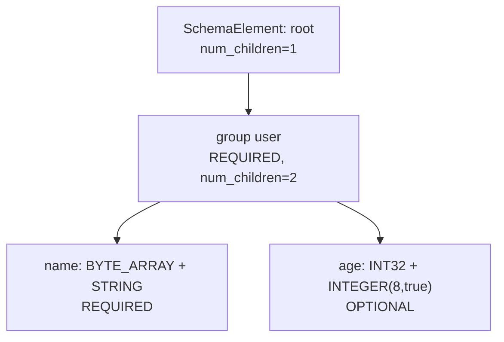

# 第3章 物理型と論理型

> **本章で読むソース**
>
> - [`src/main/thrift/parquet.thrift`](https://github.com/apache/parquet-format/blob/apache-parquet-format-2.13.0/src/main/thrift/parquet.thrift)
> - [`LogicalTypes.md`](https://github.com/apache/parquet-format/blob/apache-parquet-format-2.13.0/LogicalTypes.md)
> - [`README.md`](https://github.com/apache/parquet-format/blob/apache-parquet-format-2.13.0/README.md)

## この章の狙い

Parquet がディスク上に保持する**物理型**と、アプリケーションが解釈する**論理型**の二層構造を押さえる。
`Type` 列挙、`LogicalType` union、`SchemaElement` の3つを対応づけ、なぜ型の種類を最小限に抑えながら DATE や DECIMAL などを表現できるかを説明する。

## 前提

第2章で `FileMetaData.schema` が深さ優先に平坦化された `SchemaElement` のリストであることを把握していること。
リトルエンディアン整数表現と IEEE 754 浮動小数点の基礎知識があること。

## 物理型の設計思想

README の Types 節は、ストレージに影響する型だけを採用する方針を述べる。

[`README.md` L131-L144](https://github.com/apache/parquet-format/blob/apache-parquet-format-2.13.0/README.md#L131-L144)

```text
## Types
The types supported by the file format are intended to be as minimal as possible,
with a focus on how the types affect disk storage.  For example, 16-bit ints
are not explicitly supported in the storage format since they are covered by
32-bit ints with an efficient encoding.  This reduces the complexity of implementing
readers and writers for the format.  The types are:
  - BOOLEAN: 1-bit boolean
  - INT32: 32-bit signed ints
  - INT64: 64-bit signed ints
  - INT96: 96-bit signed ints
  - FLOAT: IEEE 32-bit floating point values
  - DOUBLE: IEEE 64-bit floating point values
  - BYTE_ARRAY: arbitrarily long byte arrays
  - FIXED_LEN_BYTE_ARRAY: fixed-length byte arrays
```

16 ビット整数を独立した物理型にしないのは、INT32 に格納してビット幅を論理型で注釈すれば、エンコーディングの実装を増やさずに済むからである。
読み手は物理型の種類が少ないほど、デコード経路の分岐が減る。

Thrift の `Type` 列挙がこの一覧をコード化している。

[`src/main/thrift/parquet.thrift` L27-L41](https://github.com/apache/parquet-format/blob/apache-parquet-format-2.13.0/src/main/thrift/parquet.thrift#L27-L41)

```thrift
/**
 * Types supported by Parquet.  These types are intended to be used in combination
 * with the encodings to control the on disk storage format.
 * For example INT16 is not included as a type since a good encoding of INT32
 * would handle this.
 */
enum Type {
  BOOLEAN = 0;
  INT32 = 1;
  INT64 = 2;
  INT96 = 3;  // deprecated, new Parquet writers should not write data in INT96
  FLOAT = 4;
  DOUBLE = 5;
  BYTE_ARRAY = 6;
  FIXED_LEN_BYTE_ARRAY = 7;
}
```

`INT96` は非推奨であり、新規 writer は書き込まない。
レガシーのタイムスタンプ表現として残っているが、新規データでは `TIMESTAMP` 論理型と INT64 の組み合わせが推奨される。

| 物理型 | ディスク上の意味 |
|--------|-----------------|
| `BOOLEAN` | 1 ビットの真偽値 |
| `INT32` | 4 バイト符号付き整数（リトルエンディアン） |
| `INT64` | 8 バイト符号付き整数 |
| `INT96` | 12 バイト（非推奨） |
| `FLOAT` | 4 バイト IEEE 754 |
| `DOUBLE` | 8 バイト IEEE 754 |
| `BYTE_ARRAY` | 4 バイト長プレフィックス + 可変長バイト列 |
| `FIXED_LEN_BYTE_ARRAY` | 固定長バイト列（長さは `type_length` で指定） |

## 論理型が担う役割

論理型は、物理型のバイト列をアプリケーション型へ解釈する注釈である。

[`README.md` L146-L153](https://github.com/apache/parquet-format/blob/apache-parquet-format-2.13.0/README.md#L146-L153)

```text
### Logical Types
Logical types are used to extend the types that parquet can be used to store,
by specifying how the primitive types should be interpreted. This keeps the set
of primitive types to a minimum and reuses parquet's efficient encodings. For
example, strings are stored with the primitive type BYTE_ARRAY with a STRING
annotation. These annotations define how to further decode and interpret the data.
Annotations are stored as `LogicalType` fields in the file metadata and are
documented in [LogicalTypes.md][logical-types].
```

文字列は `BYTE_ARRAY` として格納し、`STRING` 論理型で UTF-8 文字列であることを示す。
同じ `BYTE_ARRAY` でも、ENUM、JSON、BSON ではバイト列の解釈規則が異なる。
物理型を増やさず論理型で区別することで、辞書符号化や差分符号化といった既存のエンコーディングをそのまま再利用できる。



## LogicalType と ConvertedType の二重表現

仕様は論理型の表現として `ConvertedType`（旧）と `LogicalType`（新）の2系統を持つ。

[`LogicalTypes.md` L41-L55](https://github.com/apache/parquet-format/blob/apache-parquet-format-2.13.0/LogicalTypes.md#L41-L55)

```text
The Thrift definition of the metadata has two fields for logical types: `ConvertedType` and `LogicalType`.
`ConvertedType` is an enum of all available annotations. Since Thrift enums can't have additional type parameters,
it is cumbersome to define additional type parameters, like decimal scale and precision
(which are additional 32 bit integer fields on SchemaElement, and are relevant only for decimals) or time unit
and UTC adjustment flag for Timestamp types. To overcome this problem, a new logical type representation was introduced into
the metadata to replace `ConvertedType`: `LogicalType`.  The new representation is a union of structs of logical types,
this way allowing more flexible API, logical types can have type parameters.

`ConvertedType` is deprecated. However, to maintain compatibility with old writers,
Parquet readers should be able to read and interpret `ConvertedType` annotations
in case `LogicalType` annotations are not present. Parquet writers must always write
`LogicalType` annotations where applicable, but must also write the corresponding
`ConvertedType` annotations (if any) to maintain compatibility with old readers.
```

`ConvertedType` は Thrift の enum であるため、DECIMAL の scale や TIMESTAMP の UTC 調整フラグを enum だけでは表現しきれない。
`LogicalType` は struct の union として型パラメータを持てる。
writer は `LogicalType` を書き、対応する `ConvertedType` も併記して旧 reader との互換を保つ。
reader は `LogicalType` が無い旧ファイルでは `ConvertedType` から解釈を復元する。

Thrift の `LogicalType` union は次のように定義される。

[`src/main/thrift/parquet.thrift` L471-L504](https://github.com/apache/parquet-format/blob/apache-parquet-format-2.13.0/src/main/thrift/parquet.thrift#L471-L504)

```thrift
/**
 * LogicalType annotations to replace ConvertedType.
 *
 * To maintain compatibility, implementations using LogicalType for a
 * SchemaElement must also set the corresponding ConvertedType (if any)
 * from the following table.
 */
union LogicalType {
  1:  StringType STRING       // use ConvertedType UTF8
  2:  MapType MAP             // use ConvertedType MAP
  3:  ListType LIST           // use ConvertedType LIST
  4:  EnumType ENUM           // use ConvertedType ENUM
  5:  DecimalType DECIMAL     // use ConvertedType DECIMAL + SchemaElement.{scale, precision}
  6:  DateType DATE           // use ConvertedType DATE

  // use ConvertedType TIME_MICROS for TIME(isAdjustedToUTC = *, unit = MICROS)
  // use ConvertedType TIME_MILLIS for TIME(isAdjustedToUTC = *, unit = MILLIS)
  7:  TimeType TIME

  // use ConvertedType TIMESTAMP_MICROS for TIMESTAMP(isAdjustedToUTC = *, unit = MICROS)
  // use ConvertedType TIMESTAMP_MILLIS for TIMESTAMP(isAdjustedToUTC = *, unit = MILLIS)
  8:  TimestampType TIMESTAMP

  // 9: reserved for INTERVAL
  10: IntType INTEGER         // use ConvertedType INT_* or UINT_*
  11: NullType UNKNOWN        // no compatible ConvertedType
  12: JsonType JSON           // use ConvertedType JSON
  13: BsonType BSON           // use ConvertedType BSON
  14: UUIDType UUID           // no compatible ConvertedType
  15: Float16Type FLOAT16     // no compatible ConvertedType
  16: VariantType VARIANT     // no compatible ConvertedType
  17: GeometryType GEOMETRY   // no compatible ConvertedType
  18: GeographyType GEOGRAPHY // no compatible ConvertedType
}
```

パラメータを持つ型の例として `DecimalType` と `IntType` を示す。

[`src/main/thrift/parquet.thrift` L350-L353](https://github.com/apache/parquet-format/blob/apache-parquet-format-2.13.0/src/main/thrift/parquet.thrift#L350-L353)

```thrift
struct DecimalType {
  1: required i32 scale
  2: required i32 precision
}
```

[`src/main/thrift/parquet.thrift` L392-L395](https://github.com/apache/parquet-format/blob/apache-parquet-format-2.13.0/src/main/thrift/parquet.thrift#L392-L395)

```thrift
struct IntType {
  1: required i8 bitWidth
  2: required bool isSigned
}
```

`TimestampType` と `TimeType` は `isAdjustedToUTC` と `TimeUnit`（MILLIS、MICROS、NANOS）を持つ。
旧 `ConvertedType` の `TIMESTAMP_MILLIS` は `TimestampType(isAdjustedToUTC=true, unit=MILLIS)` に対応する。

## ConvertedType の後方互換

`ConvertedType` 列挙は拡張禁止の非推奨 API である。

[`src/main/thrift/parquet.thrift` L43-L51](https://github.com/apache/parquet-format/blob/apache-parquet-format-2.13.0/src/main/thrift/parquet.thrift#L43-L51)

```thrift
/**
 * DEPRECATED: Common types used by frameworks (e.g. Hive, Pig) using parquet.
 * ConvertedType is superseded by LogicalType.  This enum should not be extended.
 *
 * See LogicalTypes.md for conversion between ConvertedType and LogicalType.
 */
enum ConvertedType {
  /** a BYTE_ARRAY actually contains UTF8 encoded chars */
  UTF8 = 0;
```

DECIMAL の旧表現は `SchemaElement` の `scale` と `precision` フィールドに依存する。

[`src/main/thrift/parquet.thrift` L66-L79](https://github.com/apache/parquet-format/blob/apache-parquet-format-2.13.0/src/main/thrift/parquet.thrift#L66-L79)

```thrift
  /**
   * A decimal value.
   *
   * This may be used to annotate BYTE_ARRAY or FIXED_LEN_BYTE_ARRAY primitive
   * types. The underlying byte array stores the unscaled value encoded as two's
   * complement using big-endian byte order (the most significant byte is the
   * zeroth element). The value of the decimal is the value * 10^{-scale}.
   *
   * This must be accompanied by a (maximum) precision and a scale in the
   * SchemaElement. The precision specifies the number of digits in the decimal
   * and the scale stores the location of the decimal point. For example 1.23
   * would have precision 3 (3 total digits) and scale 2 (the decimal point is
   * 2 digits over).
   */
  DECIMAL = 5;
```

LogicalTypes.md は DECIMAL の物理型の選び方をより詳しく規定する。

[`LogicalTypes.md` L212-L233](https://github.com/apache/parquet-format/blob/apache-parquet-format-2.13.0/LogicalTypes.md#L212-L233)

```text
`DECIMAL` annotation represents arbitrary-precision signed decimal numbers of
the form `unscaledValue * 10^(-scale)`.

The primitive type stores an unscaled integer value. For `BYTE_ARRAY` and 
`FIXED_LEN_BYTE_ARRAY`, the unscaled number must be encoded as two's complement using
big-endian byte order (the most significant byte is the zeroth element). The
scale stores the number of digits of that value that are to the right of the
decimal point, and the precision stores the maximum number of digits supported
in the unscaled value.

`DECIMAL` can be used to annotate the following types:
* `int32`: for 1 <= precision <= 9
* `int64`: for 1 <= precision <= 18; precision < 10 will produce a
  warning
* `fixed_len_byte_array`: `precision` is limited by the array size. Length `n`
  can store <= `floor(log_10(2^(8*n - 1) - 1))` base-10 digits
* `byte_array`: `precision` is not limited, but is required. The minimum number of
  bytes to store the unscaled value should be used.
```

精度が 9 以下なら INT32、18 以下なら INT64 と格納幅を選べる。
これにより小さな DECIMAL 列は固定幅整数として PLAIN や DELTA_BINARY_PACKED で効率的に符号化できる。

### 文字列型 STRING

[`LogicalTypes.md` L63-L70](https://github.com/apache/parquet-format/blob/apache-parquet-format-2.13.0/LogicalTypes.md#L63-L70)

```text
`STRING` may only be used to annotate the `BYTE_ARRAY` primitive type and indicates
that the byte array should be interpreted as a UTF-8 encoded character string.

The sort order used for `STRING` strings is unsigned byte-wise comparison.

*Compatibility*

`STRING` corresponds to `UTF8` ConvertedType.
```

統計の min/max やページインデックスの比較順序は、符号なしバイト単位の辞書順である。

### 整数型 INT

[`LogicalTypes.md` L96-L112](https://github.com/apache/parquet-format/blob/apache-parquet-format-2.13.0/LogicalTypes.md#L96-L112)

```text
`INT` annotation can be used to specify the maximum number of bits in the stored value.
The annotation has two parameters: bit width and sign.
Allowed bit width values are `8`, `16`, `32`, `64`, and sign can be `true` or `false`.
For signed integers, the second parameter should be `true`,
for example, a signed integer with bit width of 8 is defined as `INT(8, true)`.
Implementations may use these annotations to produce smaller
in-memory representations when reading data.

If a stored value is larger than the maximum allowed by the annotation, the
behavior is not defined and can be determined by the implementation.
Implementations must not write values that are larger than the annotation
allows.

`INT(8, true)`, `INT(16, true)`, and `INT(32, true)` must annotate an `int32` primitive type and
`INT(64, true)` must annotate an `int64` primitive type. `INT(32, true)` and `INT(64, true)` are
implied by the `int32` and `int64` primitive types if no other annotation is
present and should be considered optional.
```

### 設計上の工夫：物理型の最小化と論理型による再利用

物理型を 8 種類に抑えると、エンコーディング実装は型ごとの分岐が固定される。
論理型はメタデータ上の注釈に留まるため、DATE を INT32 に載せても INT32 向けの符号化器をそのまま使える。
新しいセマンティクス（UUID、FLOAT16、GEOMETRY など）は `LogicalType` union に struct を足すだけで拡張でき、既存ファイルの物理レイアウト規則を壊さない。

## SchemaElement：スキーマ木の平坦化

`SchemaElement` はスキーマ木の各ノードを表す。
葉ノードは `type` を持ち、内部ノードは `num_children` で子の数を示す。

[`src/main/thrift/parquet.thrift` L506-L566](https://github.com/apache/parquet-format/blob/apache-parquet-format-2.13.0/src/main/thrift/parquet.thrift#L506-L566)

```thrift
/**
 * Represents an element inside a schema definition.
 *  - if it is a group (inner node) then type is undefined and num_children is defined
 *  - if it is a primitive type (leaf) then type is defined and num_children is undefined
 * the nodes are listed in depth first traversal order.
 */
struct SchemaElement {
  /** Data type for this field. Not set if the current element is a non-leaf node */
  1: optional Type type;

  /** If type is FIXED_LEN_BYTE_ARRAY, this is the byte length of the values.
   * Otherwise, if specified, this is the maximum bit length to store any of the values.
   * (e.g. a low cardinality INT col could have this set to 3).  Note that this is
   * in the schema, and therefore fixed for the entire file.
   */
  2: optional i32 type_length;

  /** repetition of the field. The root of the schema does not have a repetition_type.
   * All other nodes must have one */
  3: optional FieldRepetitionType repetition_type;

  /** Name of the field in the schema */
  4: required string name;

  /** Nested fields.  Since thrift does not support nested fields,
   * the nesting is flattened to a single list by a depth-first traversal.
   * The children count is used to reconstruct the nested relationship.
   * This field is not set when the element is a primitive type
   */
  5: optional i32 num_children;

  /**
   * DEPRECATED: When the schema is the result of a conversion from another model.
   * Used to record the original type to help with cross conversion.
   *
   * This is superseded by logicalType.
   */
  6: optional ConvertedType converted_type;

  /**
   * DEPRECATED: Used when this column contains decimal data.
   * See the DECIMAL converted type for more details.
   *
   * This is superseded by using the DecimalType annotation in logicalType.
   */
  7: optional i32 scale
  8: optional i32 precision

  /** When the original schema supports field ids, this will save the
   * original field id in the parquet schema
   */
  9: optional i32 field_id;

  /**
   * The logical type of this SchemaElement
   *
   * LogicalType replaces ConvertedType, but ConvertedType is still required
   * for some logical types to ensure forward-compatibility in format v1.
   */
  10: optional LogicalType logicalType
}
```

`num_children` を使い、平坦なリストから木を再構成する。
`path_in_schema`（`ColumnMetaData` 内）は葉までのフィールド名のパスであり、ネスト列の識別に使う（第4章）。

`type_length` は `FIXED_LEN_BYTE_ARRAY` のバイト長、または INT 列の最大ビット幅のヒントとして使える。
ファイル全体で固定されるため、writer はスキーマ確定時に値域を見積もって書く。



## 型とエンコーディングの関係

物理型はエンコーディングの適用可否を決める。
`Encoding` 列挙のコメントが、PLAIN エンコーディング時の物理型ごとのバイト配置を要約している。

[`src/main/thrift/parquet.thrift` L573-L583](https://github.com/apache/parquet-format/blob/apache-parquet-format-2.13.0/src/main/thrift/parquet.thrift#L573-L583)

```thrift
enum Encoding {
  /** Default encoding.
   * BOOLEAN - 1 bit per value. 0 is false; 1 is true.
   * INT32 - 4 bytes per value.  Stored as little-endian.
   * INT64 - 8 bytes per value.  Stored as little-endian.
   * FLOAT - 4 bytes per value.  IEEE. Stored as little-endian.
   * DOUBLE - 8 bytes per value.  IEEE. Stored as little-endian.
   * BYTE_ARRAY - 4 byte length stored as little endian, followed by bytes.
   * FIXED_LEN_BYTE_ARRAY - Just the bytes.
   */
  PLAIN = 0;
```

`DELTA_BINARY_PACKED` は INT32 と INT64 に、`DELTA_LENGTH_BYTE_ARRAY` は BYTE_ARRAY に限定される（第5章、第6章）。
論理型が STRING であっても物理型が BYTE_ARRAY である限り、文字列向けの差分エンコーディングが選べる。

## まとめ

Parquet の型システムは、少数の物理型と豊富な論理型注釈の二層で構成される。
`SchemaElement` がスキーマ木を平坦化して保持し、`logicalType` と後方互換の `converted_type` が解釈規則を与える。
物理型を最小化することでエンコーディングと reader 実装の複雑さを抑えつつ、DECIMAL や TIMESTAMP などのアプリケーション型を表現できる。

## 関連する章

- [第4章 ネスト構造と定義・繰り返しレベル](04-nested-encoding.md)
- [第2章 ファイル構造とメタデータ階層](../part00-overview/02-file-structure.md)
- [第5章 基本エンコーディング](../part02-encoding/05-basic-encodings.md)
