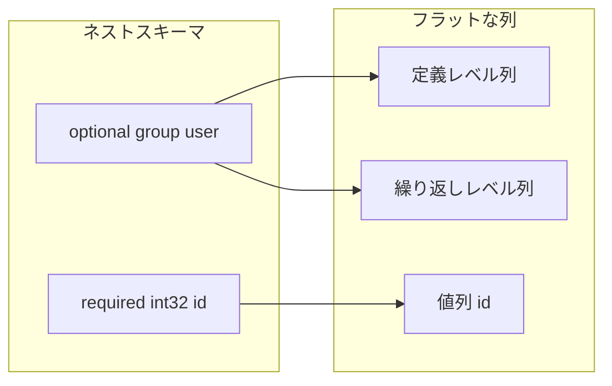
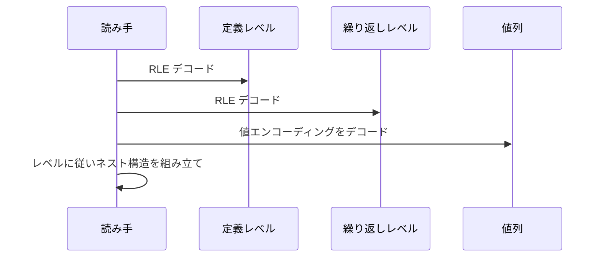

# 第4章 ネスト構造と定義・繰り返しレベル

> **本章で読むソース**
>
> - [`README.md`](https://github.com/apache/parquet-format/blob/apache-parquet-format-2.13.0/README.md)
> - [`src/main/thrift/parquet.thrift`](https://github.com/apache/parquet-format/blob/apache-parquet-format-2.13.0/src/main/thrift/parquet.thrift)
> - [`LogicalTypes.md`](https://github.com/apache/parquet-format/blob/apache-parquet-format-2.13.0/LogicalTypes.md)

## この章の狙い

ネストしたレコードをフラットな列集合として格納する Dremel 方式の仕組みを読み解く。
**定義レベル**と**繰り返しレベル**が NULL と繰り返しをどう符号化するか、データページ内の3分割レイアウトと結びつけて説明する。

## 前提

第3章で `SchemaElement` の `repetition_type` と `LogicalType` の LIST、MAP 注釈を導入済みであること。
列指向フォーマットで「行」が論理概念であり、物理的には列ごとに値が並ぶことを理解していること。

## FieldRepetitionType：必須・任意・繰り返し

スキーマの各フィールドは、出現回数の規則を `FieldRepetitionType` で宣言する。

[`src/main/thrift/parquet.thrift` L183-L192](https://github.com/apache/parquet-format/blob/apache-parquet-format-2.13.0/src/main/thrift/parquet.thrift#L183-L192)

```thrift
enum FieldRepetitionType {
  /** This field is required (can not be null) and each row has exactly 1 value. */
  REQUIRED = 0;

  /** The field is optional (can be null) and each row has 0 or 1 values. */
  OPTIONAL = 1;

  /** The field is repeated and can contain 0 or more values */
  REPEATED = 2;
}
```

`REQUIRED` は行あたりちょうど1値で NULL 不可である。
`OPTIONAL` は行あたり0または1値で NULL を許す。
`REPEATED` は0回以上の出現を許し、リストやマップの内側構造で使う。

ネストの深さと optional の数から、定義レベルの最大値が決まる。
繰り返しフィールドの数から、繰り返しレベルの最大値が決まる。

## Dremel エンコーディングの概要

README の Nested Encoding 節が、2種類のレベル列の意味を定義する。

[`README.md` L166-L175](https://github.com/apache/parquet-format/blob/apache-parquet-format-2.13.0/README.md#L166-L175)

```text
## Nested Encoding
To encode nested columns, Parquet uses the Dremel encoding with definition and
repetition levels.  Definition levels specify how many optional fields in the
path for the column are defined.  Repetition levels specify at what repeated field
in the path has the value repeated.  The max definition and repetition levels can
be computed from the schema (i.e. how much nesting there is).  This defines the
maximum number of bits required to store the levels (levels are defined for all
values in the column).

Two encodings for the levels are supported: `BIT_PACKED` and `RLE`. Only `RLE` is currently used as it supersedes `BIT_PACKED`.
```

**定義レベル**は、ルートから葉までのパス上で、いくつの optional フィールドが「値あり」と判定されたかを整数で表す。
**繰り返しレベル**は、同じ行内で値が繰り返されるとき、パス上のどの repeated 境界で新しい要素が始まったかを表す。

レベル列は値列と独立した補助列として格納され、RLE で符号化される。
`BIT_PACKED` は後方互換のために仕様に残るが、現行 writer は RLE のみを使う。



## NULL の符号化

NULL は値列にエントリを書かず、定義レベルだけで表現する。

[`README.md` L177-L181](https://github.com/apache/parquet-format/blob/apache-parquet-format-2.13.0/README.md#L177-L181)

```text
## Nulls
Nullity is encoded in the definition levels (which is run-length encoded).  NULL values
are not encoded in the data.  For example, in a non-nested schema, a column with 1000 NULLs
would be encoded with run-length encoding (0, 1000 times) for the definition levels and
nothing else.
```

ネストのない optional 列で 1000 個の NULL がある場合、定義レベル列は「0 が 1000 回連続」という RLE になり、値列は空に近いサイズになる。
NULL を値列にプレースホルダとして書かないため、高欠損率の列ではディスクとデコードの両方でコストが抑えられる。

### 設計上の工夫：定義レベルによる NULL の分離

値エンコーディング（PLAIN、辞書、差分など）は非 NULL 値だけを対象にできる。
定義レベル列が NULL の位置を担うため、値列は連続した有効データとして符号化され、辞書のカーディナリティも下がりやすい。

## データページ内の3分割

ネスト列のデータページは、ヘッダのあとに3つの領域を順に並べる。

[`README.md` L183-L200](https://github.com/apache/parquet-format/blob/apache-parquet-format-2.13.0/README.md#L183-L200)

```text
## Data Pages
For data pages, the 3 pieces of information are encoded back to back, after the page
header. No padding is allowed in the data page.
In order we have:
 1. repetition levels data
 1. definition levels data
 1. encoded values

The value of `uncompressed_page_size` specified in the header is for all the 3 pieces combined.

The encoded values for the data page are always required.  The definition and repetition levels
are optional, based on the schema definition.  If the column is not nested (i.e.
the path to the column has length 1), we do not encode the repetition levels (they would
always have the value 0).  For data that is required, the definition levels are
skipped (if encoded, they will always have the value of the max definition level).

For example, in the case where the column is non-nested and required, the data in the
page is only the encoded values.
```

順序は繰り返しレベル、定義レベル、符号化された値である。
`uncompressed_page_size` は3領域の合計サイズを指す。

スキーマに応じて補助列を省略できる。

| 条件 | 繰り返しレベル | 定義レベル |
|------|--------------|------------|
| パス長が1（ネストなし） | 省略 | スキーマ次第 |
| 値が REQUIRED | スキーマ次第 | 省略可 |
| ネストなしかつ REQUIRED | 省略 | 省略（値列のみ） |

必須の非ネスト列は値列だけがページに載る最も単純な形になる。


## LIST と MAP のスキーマ形状

ネストの LIST と MAP は、LogicalTypes.md が3層構造を規定する。

[`LogicalTypes.md` L670-L688](https://github.com/apache/parquet-format/blob/apache-parquet-format-2.13.0/LogicalTypes.md#L670-L688)

```text
`LIST` must always annotate a 3-level structure:

// ... (中略: 3-level schema example) ...

* The outer-most level must be a group annotated with `LIST` that contains a
  single field named `list`. The repetition of this level must be either
  `optional` or `required` and determines whether the list is nullable.
* The middle level, named `list`, must be a repeated group with a single
  field named `element`.
* The `element` field encodes the list's element type and repetition. Element
  repetition must be `required` or `optional`.
```

外側の LIST 注釈付きグループがリスト全体の NULL 可否を決める。
中間の `list` グループが `REPEATED` で要素の繰り返しを表す。
内側の `element` が要素型を持つ。

MAP も同様に3層である。

[`LogicalTypes.md` L815-L839](https://github.com/apache/parquet-format/blob/apache-parquet-format-2.13.0/LogicalTypes.md#L815-L839)

```text
### Maps

`MAP` is used to annotate types that should be interpreted as a map from keys
to values. `MAP` must annotate a 3-level structure:

// ... (中略: 3-level schema example) ...

* The outer-most level must be a group annotated with `MAP` that contains a
  single field named `key_value`. The repetition of this level must be either
  `optional` or `required` and determines whether the map is nullable.
* The middle level, named `key_value`, must be a repeated group with a `key`
  field for map keys and, optionally, a `value` field for map values. It must
  not contain any other values.
* The `key` field encodes the map's key type. This field must have
  repetition `required` and must always be present. It must always be the first
  field of the repeated `key_value` group.
* The `value` field encodes the map's value type and repetition. This field can
  be `required`, `optional`, or omitted. It must always be the second field of
  the repeated `key_value` group if present. If not present, it can be
  represented as a map with all null values or as a set of keys.
```

葉列を読むとき、`ColumnMetaData.path_in_schema` がルートから葉までの名前のパスを保持する。
定義レベルと繰り返しレベルは、そのパス上のグループ構造に対応してデコードされる。

## レベル列のビット幅

最大定義レベルと最大繰り返しレベルはスキーマから計算できる。
各レベル値に必要なビット数は、最大レベル値を表現するのに足りる幅になる（README L170-L173）。
RLE エンコーディングはビット幅をページメタデータで固定し、小さな整数の連続として効率よく格納する。

繰り返しレベルが常に0になる列では、繰り返しレベル列ごと省略できる。
これはネストのない列でページサイズとデコードコストを削る仕様上の最適化である。

## 後方互換の LIST 解釈

LogicalTypes.md は、旧 writer が生成した非標準の LIST 形状を読むための規則を列挙する。
新規 writer は常に3層構造を出力すべきである。

[`LogicalTypes.md` L725-L728](https://github.com/apache/parquet-format/blob/apache-parquet-format-2.13.0/LogicalTypes.md#L725-L728)

```text
New writer implementations should always produce the 3-level LIST structure shown
above. However, historically data files have been produced that use different
structures to represent list-like data, and readers may include compatibility
measures to interpret them as intended.
```

reader は `list` と `element` の名前が守られていない旧データも、繰り返しグループの形状から要素型を推定する。
本書は仕様の「正しい形状」を主に扱い、互換ルールの全列挙は LogicalTypes.md の Backward-compatibility rules に委ねる。

## assembly の読み取りイメージ

書き込み時はネストレコードを shredding して葉列ごとに定義レベル、繰り返しレベル、値を出力する。
読み取り時は逆に、同じ行インデックスで3列を同期して読み、レベル値からネスト構造を assembly する。

手順の骨格は次のとおりである。

1. スキーマから葉列と `path_in_schema` を列挙する。
2. 各葉列のデータページから繰り返しレベル列と定義レベル列をデコードする。
3. 定義レベルが「未定義」を示す位置では値をスキップする。
4. 繰り返しレベルが下がるたびに、リストやマップの内側コンテナを閉じる。
5. 全葉列のレベル列を消費し終えると、1行分のネストレコードが復元される。



## まとめ

Parquet は Dremel 方式でネストデータをフラットな葉列に分解する。
NULL は定義レベルにのみ現れ、値列からは除外される。
データページは繰り返しレベル、定義レベル、値の順に並び、スキーマが単純な列では補助列を省略できる。
LIST と MAP は LogicalTypes.md が規定する3層グループ形状でスキーマに表現する。

## 関連する章

- [第3章 物理型と論理型](03-physical-and-logical-types.md)
- [第5章 基本エンコーディング](../part02-encoding/05-basic-encodings.md)
