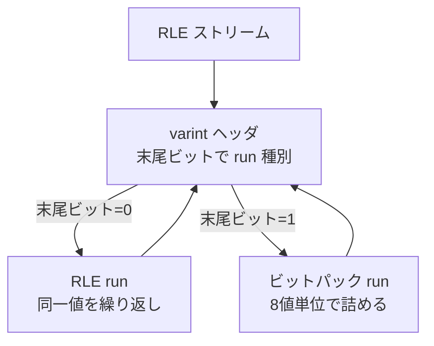
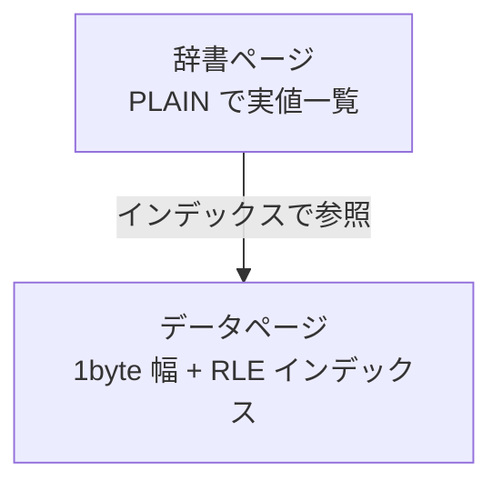

# 第5章 基本エンコーディング

> **本章で読むソース**
>
> - [`Encodings.md`](https://github.com/apache/parquet-format/blob/apache-parquet-format-2.13.0/Encodings.md)
> - [`src/main/thrift/parquet.thrift`](https://github.com/apache/parquet-format/blob/apache-parquet-format-2.13.0/src/main/thrift/parquet.thrift)

## この章の狙い

すべての reader が実装しなければならない **PLAIN**、レベル列と辞書索引に使う **RLE**、低カーディナリティ列向けの **辞書エンコーディング**の3つを、バイト列の構造レベルで読み解く。
`Encoding` 列挙と Encodings.md の仕様を対応づけ、各方式がどの物理型に適用できるかを整理する。

## 前提

第3章で物理型と第4章で定義レベル、繰り返しレベルの役割を把握していること。
ULEB128（可変長整数符号化）の概念があると RLE ヘッダの読み解けが容易になる。

## エンコーディング一覧

Encodings.md はサポートされる方式を表でまとめる。

[`Encodings.md` L28-L40](https://github.com/apache/parquet-format/blob/apache-parquet-format-2.13.0/Encodings.md#L28-L40)

```text
### Supported Encodings

| Encoding type                                    | Encoding enum                                             | Supported Types                                   |
| ------------------------------------------------ | --------------------------------------------------------- | ------------------------------------------------- |
| [Plain](#PLAIN)                                  | PLAIN = 0                                                 | All Physical Types                                |
| [Dictionary Encoding](#DICTIONARY)               | PLAIN_DICTIONARY = 2 (Deprecated) <br> RLE_DICTIONARY = 8 | All Physical Types                                |
| [Run Length Encoding / Bit-Packing Hybrid](#RLE) | RLE = 3                                                   | BOOLEAN, Dictionary Indices                       |
| [Delta Encoding](#DELTAENC)                      | DELTA_BINARY_PACKED = 5                                   | INT32, INT64                                      |
| [Delta-length byte array](#DELTALENGTH)          | DELTA_LENGTH_BYTE_ARRAY = 6                               | BYTE_ARRAY                                        |
| [Delta Strings](#DELTASTRING)                    | DELTA_BYTE_ARRAY = 7                                      | BYTE_ARRAY, FIXED_LEN_BYTE_ARRAY                  |
| [Byte Stream Split](#BYTESTREAMSPLIT)            | BYTE_STREAM_SPLIT = 9                                     | INT32, INT64, FLOAT, DOUBLE, FIXED_LEN_BYTE_ARRAY |

```

Thrift の `Encoding` 列挙が同じ識別子を定義する。
`ColumnMetaData.encodings` はカラムチャンク内で使われた方式の集合であり、reader がデコード可能か検証するために書かれる。

[`src/main/thrift/parquet.thrift` L568-L626](https://github.com/apache/parquet-format/blob/apache-parquet-format-2.13.0/src/main/thrift/parquet.thrift#L568-L626)

```thrift
/**
 * Encodings supported by Parquet.  Not all encodings are valid for all types.  These
 * enums are also used to specify the encoding of definition and repetition levels.
 * See the accompanying doc for the details of the more complicated encodings.
 */
enum Encoding {
  /** Default encoding.
   * BOOLEAN - 1 bit per value. 0 is false; 1 is true.
   * INT32 - 4 bytes per value.  Stored as little-endian.
   * INT64 - 8 bytes per value.  Stored as little-endian.
   * FLOAT - 4 bytes per value.  IEEE. Stored as little-endian.
   * DOUBLE - 8 bytes per value.  IEEE. Stored as little-endian.
   * BYTE_ARRAY - 4 byte length stored as little endian, followed by bytes.
   * FIXED_LEN_BYTE_ARRAY - Just the bytes.
   */
  PLAIN = 0;

  /**
   * DEPRECATED: Dictionary encoding. The values in the dictionary are encoded in the
   * plain type.
   * For a data page use RLE_DICTIONARY instead.
   * For a Dictionary page use PLAIN instead.
   */
  PLAIN_DICTIONARY = 2;

  /** Group packed run length encoding. Usable for definition/repetition levels
   * encoding and Booleans (on one bit: 0 is false; 1 is true.)
   */
  RLE = 3;

  /** DEPRECATED: Bit packed encoding.  This can only be used if the data has a known max
   * width.  Usable for definition/repetition levels encoding.
   * Superseded by RLE (which is a hybrid of RLE and bit packing); see Encodings.md.
   */
  BIT_PACKED = 4;

  /** Dictionary encoding: the ids are encoded using the RLE encoding
   */
  RLE_DICTIONARY = 8;

本章では PLAIN、RLE、辞書（PLAIN 辞書ページ + RLE_DICTIONARY データページ）に焦点を当てる。
差分系は第6章で扱う。

## PLAIN：フォールバックとなる素朴な符号化

PLAIN は全物理型でサポートされなければならない。

[`Encodings.md` L49-L73](https://github.com/apache/parquet-format/blob/apache-parquet-format-2.13.0/Encodings.md#L49-L73)

```text
### Plain: (PLAIN = 0)

Supported Types: all

This is the plain encoding that must be supported for types.  It is
intended to be the simplest encoding.  Values are encoded back to back.

The plain encoding is used whenever a more efficient encoding cannot be used. It
stores the data in the following format:
 - BOOLEAN: bit-packed, LSB first (using the same packing scheme as the
   [RLE/bit-packing hybrid](#RLE) encoding)
 - INT32: 4 bytes little endian
 - INT64: 8 bytes little endian
 - INT96: 12 bytes little endian (deprecated)
 - FLOAT: 4 bytes IEEE little endian
 - DOUBLE: 8 bytes IEEE little endian
 - BYTE_ARRAY: length in 4 bytes little endian followed by the bytes contained in the array
 - FIXED_LEN_BYTE_ARRAY: the bytes contained in the array

For native types, this outputs the data as little endian. Floating
    point types are encoded in IEEE.

For the byte array type, it encodes the length as a 4-byte little
endian integer, followed by the bytes.

```

固定長型は値を連続配置し、`BYTE_ARRAY` は各値の前に4バイトの長さを置く。
より効率的な方式が使えないときのフォールバックであり、辞書ページの実体も PLAIN で格納される。

BOOLEAN の PLAIN は1ビットずつ LSB 優先で詰める点が、後述の RLE ビットパックと同じ並びである。

## RLE とビットパックのハイブリッド

`RLE = 3` はランレングス符号化とビットパックを切り替えるハイブリッドである。

[`Encodings.md` L92-L113](https://github.com/apache/parquet-format/blob/apache-parquet-format-2.13.0/Encodings.md#L92-L113)

```text
### Run Length Encoding / Bit-Packing Hybrid (RLE = 3)

This encoding uses a combination of bit-packing and run length encoding to more efficiently store repeated values.

The grammar for this encoding looks like this, given a fixed bit-width known in advance:
rle-bit-packed-hybrid: <length> <encoded-data>
// length is not always prepended, please check the table below for more detail
length := length of the <encoded-data> in bytes stored as 4 bytes little endian (unsigned int32)
encoded-data := <run>*
run := <bit-packed-run> | <rle-run>
bit-packed-run := <bit-packed-header> <bit-packed-values>
bit-packed-header := varint-encode(<bit-pack-scaled-run-len> << 1 | 1)
// we always bit-pack a multiple of 8 values at a time, so we only store the number of values / 8
bit-pack-scaled-run-len := (bit-packed-run-len) / 8
bit-packed-run-len := *see 3 below*
bit-packed-values := *see 1 below*
rle-run := <rle-header> <repeated-value>
rle-header := varint-encode( (rle-run-len) << 1)
rle-run-len := *see 3 below*
repeated-value := value that is repeated, using a fixed-width of round-up-to-next-byte(bit-width)

```

run の先頭ビットが1ならビットパック run、0なら RLE run である。
ビット幅はページごとに固定され、定義レベルや繰り返しレベルではスキーマから導かれる最大レベルに基づく。

RLE が使われるデータの種類は次のとおりである。

[`Encodings.md` L148-L154](https://github.com/apache/parquet-format/blob/apache-parquet-format-2.13.0/Encodings.md#L148-L154)

```text
Note that the RLE encoding method is only supported for the following types of
data:

* Repetition and definition levels
* Dictionary indices
* Boolean values in data pages, as an alternative to PLAIN encoding

```

4バイトの `length` プレフィックスを付けるかは、ページ種別とデータ種別で異なる。

[`Encodings.md` L155-L170](https://github.com/apache/parquet-format/blob/apache-parquet-format-2.13.0/Encodings.md#L155-L170)

```text
Whether or not to prepend the four-byte `length` to the `encoded-data` is summarized in the table below:
+--------------+------------------------+-----------------+
| Page kind    | RLE-encoded data kind  | Prepend length? |
+--------------+------------------------+-----------------+
| Data page v1 | Definition levels      | Y               |
|              | Repetition levels      | Y               |
|              | Dictionary indices     | N               |
|              | Boolean values         | Y               |
+--------------+------------------------+-----------------+
| Data page v2 | Definition levels      | N               |
|              | Repetition levels      | N               |
|              | Dictionary indices     | N               |
|              | Boolean values         | Y               |
+--------------+------------------------+-----------------+

```

Data page v2 ではレベル列の長さはページヘッダ側で管理され、RLE 本体の前に4バイト長を付けない（第7章）。

### 設計上の工夫：リトルエンディアン向けビットパック順序

Encodings.md は、ビットパックのバイト内配置がリトルエンディアン CPU でのデシリアライズを意識していると述べる。

[`Encodings.md` L115-L137](https://github.com/apache/parquet-format/blob/apache-parquet-format-2.13.0/Encodings.md#L115-L137)

```text
1. The bit-packing here is done in a different order than the one in the [deprecated bit-packing](#BITPACKED) encoding.
   The values are packed from the least significant bit of each byte to the most significant bit,
   though the order of the bits in each value remains in the usual order of most significant to least
   significant. For example, to pack the same values as the example in the deprecated encoding above:

   The numbers 1 through 7 using bit width 3:
   dec value: 0   1   2   3   4   5   6   7
   bit value: 000 001 010 011 100 101 110 111
   bit label: ABC DEF GHI JKL MNO PQR STU VWX

   would be encoded like this where spaces mark byte boundaries (3 bytes):
   bit value: 10001000 11000110 11111010
   bit label: HIDEFABC RMNOJKLG VWXSTUPQ

   The reason for this packing order is to have fewer word-boundaries on little-endian hardware
   when deserializing more than one byte at a time. This is because 4 bytes can be read into a
   32-bit register (or 8 bytes into a 64-bit register) and values can be unpacked just by
   shifting and ORing with a mask. (to make this optimization work on a big-endian machine,
   you would have to use the ordering used in the [deprecated bit-packing](#BITPACKED) encoding)

```

同一値の連続が多い定義レベル列では RLE run が支配的になり、ビットパック run は値がばらつく区間で使われる。
2種類を1つの文法にまとめることで、レベル列1本のエンコーダで高欠損列も高カーディナリティ列も扱える。



## 非推奨 BIT_PACKED

`BIT_PACKED = 4` は RLE ハイブリッドに置き換えられた。

[`Encodings.md` L173-L183](https://github.com/apache/parquet-format/blob/apache-parquet-format-2.13.0/Encodings.md#L173-L183)

```text
### Bit-packed (Deprecated) (BIT_PACKED = 4)

This is a bit-packed only encoding, which is deprecated; it has been replaced by the [RLE/bit-packing](#RLE) hybrid encoding.
Each value is encoded back to back using a fixed width.
There is no padding between values (except for the last byte, which is padded with 0s).
For example, if the max repetition level was 3 (2 bits) and the max definition level was 3
(2 bits), to encode 30 values, we would have 30 * 2 = 60 bits = 8 bytes.

This implementation is deprecated because the [RLE/bit-packing](#RLE) hybrid is a superset of this implementation.
For compatibility reasons, this implementation packs values from the most significant bit to the least significant bit,
which is not the same as the [RLE/bit-packing](#RLE) hybrid.

```

旧ファイルのレベル列を読む reader だけが参照する。
新規 writer は RLE のみを使う（README L175）。

## 辞書エンコーディング

辞書方式は、カラムチャンクごとに値の辞書を構築し、データページには辞書インデックスだけを書く。

[`Encodings.md` L76-L89](https://github.com/apache/parquet-format/blob/apache-parquet-format-2.13.0/Encodings.md#L76-L89)

```text
### Dictionary Encoding (PLAIN_DICTIONARY = 2 and RLE_DICTIONARY = 8)
The dictionary encoding builds a dictionary of values encountered in a given column. The
dictionary will be stored in a dictionary page per column chunk. The values are stored as integers
using the [RLE/Bit-Packing Hybrid](#RLE) encoding. If the dictionary grows too big, whether in size
or number of distinct values, the encoding will fall back to the plain encoding. The dictionary page is
written first, before the data pages of the column chunk.

Dictionary page format: the entries in the dictionary using the [plain](#PLAIN) encoding.

Data page format: the bit width used to encode the entry ids stored as 1 byte (max bit width = 32),
followed by the values encoded using the RLE/Bit-Packing described above (with the given bit width).

Using the `PLAIN_DICTIONARY` enum value is deprecated, use `RLE_DICTIONARY`
in a data page and `PLAIN` in a dictionary page for new Parquet files.

```

手順を整理すると次のとおりである。

1. カラムチャンクの先頭に辞書ページを1つ置く（`dictionary_page_offset`）。
2. 辞書ページ内のエントリは PLAIN 符号化された実値である。
3. データページは1バイトのビット幅のあと、RLE で符号化されたインデックス列を載せる。
4. 辞書が大きくなりすぎたら PLAIN へフォールバックする。

### 設計上の工夫：辞書によるカーディナリティ削減

カテゴリ列のように distinct 数が少ない列では、データページに繰り返し現れる長い `BYTE_ARRAY` を毎回書かず、狭い整数インデックスに置き換えられる。
インデックス列は RLE と相性がよく、同じラベルが連続する区間は数バイトの RLE run に収まる。
辞書ページはチャンク内で1回だけ読めばよいため、スキャン全体では実値の重複ストレージを避けられる。



## エンコーディング選択の実務

writer は列の統計とカーディナリティを見て方式を選ぶ。
`ColumnMetaData.encoding_stats` はページ種別ごとのエンコーディング使用回数を記録し、全データページが辞書符号化かどうかを reader が判断する手がかりになる。

| データの性質 | 典型エンコーディング |
|-------------|-------------------|
| レベル列 | RLE |
| 低カーディナリティの値 | RLE_DICTIONARY |
| フォールバック、辞書実体 | PLAIN |
| ソート済み整数 | DELTA_BINARY_PACKED（第6章） |

## まとめ

PLAIN は全型の基盤であり、辞書ページの実体も PLAIN で書かれる。
RLE ハイブリッドは定義レベル、繰り返しレベル、辞書インデックス、BOOLEAN に使われ、連続同一値とビットパックを1つのストリームに統合する。
辞書エンコーディングはデータページをインデックス列に置き換え、カラムチャンク先頭の辞書ページで実値を共有する。

## 関連する章

- [第6章 差分・分割エンコーディング](06-delta-encodings.md)
- [第4章 ネスト構造と定義・繰り返しレベル](../part01-types/04-nested-encoding.md)
