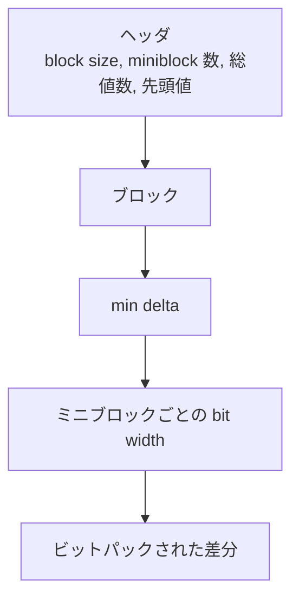
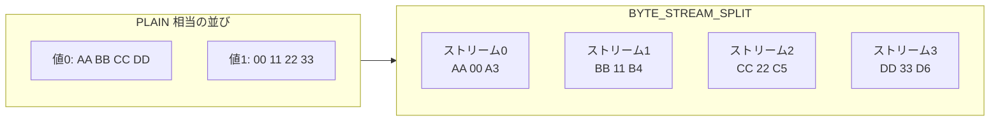

# 第6章 差分・分割エンコーディング

> **本章で読むソース**
>
> - [`Encodings.md`](https://github.com/apache/parquet-format/blob/apache-parquet-format-2.13.0/Encodings.md)
> - [`src/main/thrift/parquet.thrift`](https://github.com/apache/parquet-format/blob/apache-parquet-format-2.13.0/src/main/thrift/parquet.thrift)

## この章の狙い

ソート済み整数列、類似文字列、浮動小数点列向けの4方式（**DELTA_BINARY_PACKED**、**DELTA_LENGTH_BYTE_ARRAY**、**DELTA_BYTE_ARRAY**、**BYTE_STREAM_SPLIT**）を、バイト列の生成手順に沿って説明する。
第5章の PLAIN と辞書では拾いきれない「値の近さ」や「バイト位置の相関」を、どの段階で利用するかを整理する。

## 前提

第5章で PLAIN と RLE の構造を把握していること。
ソート済みデータで差分が小さくなること、および後段の圧縮コーデックがバイト単位の繰り返しに敏感であることを知っていると理解が進みやすい。

## Thrift 上の定義

差分系と BYTE_STREAM_SPLIT は `Encoding` 列挙の 5 から 9 に割り当てられる。

[`src/main/thrift/parquet.thrift` L609-L638](https://github.com/apache/parquet-format/blob/apache-parquet-format-2.13.0/src/main/thrift/parquet.thrift#L609-L638)

```thrift
  /** Delta encoding for integers. This can be used for int columns and works best
   * on sorted data
   */
  DELTA_BINARY_PACKED = 5;

  /** Encoding for byte arrays to separate the length values and the data. The lengths
   * are encoded using DELTA_BINARY_PACKED
   */
  DELTA_LENGTH_BYTE_ARRAY = 6;

  /** Incremental-encoded byte array. Prefix lengths are encoded using DELTA_BINARY_PACKED.
   * Suffixes are stored as delta length byte arrays.
   */
  DELTA_BYTE_ARRAY = 7;

  /** Dictionary encoding: the ids are encoded using the RLE encoding
   */
  RLE_DICTIONARY = 8;

  /** Encoding for fixed-width data (FLOAT, DOUBLE, INT32, INT64, FIXED_LEN_BYTE_ARRAY).
      K byte-streams are created where K is the size in bytes of the data type.
      The individual bytes of a value are scattered to the corresponding stream and
      the streams are concatenated.
      This itself does not reduce the size of the data but can lead to better compression
      afterwards.

      Added in 2.8 for FLOAT and DOUBLE.
      Support for INT32, INT64 and FIXED_LEN_BYTE_ARRAY added in 2.11.
   */
  BYTE_STREAM_SPLIT = 9;
```

Encodings.md の対応表では、DELTA_BINARY_PACKED が INT32 と INT64、DELTA_LENGTH が BYTE_ARRAY、DELTA_BYTE_ARRAY が BYTE_ARRAY と FIXED_LEN_BYTE_ARRAY、BYTE_STREAM_SPLIT が固定幅型に適用される。

## DELTA_BINARY_PACKED：ブロック単位の差分とミニブロック

DELTA_BINARY_PACKED は Lemire と Boytsov のバイナリパッキング手法に基づく。

[`Encodings.md` L201-L226](https://github.com/apache/parquet-format/blob/apache-parquet-format-2.13.0/Encodings.md#L201-L226)

```text
### Delta Encoding (DELTA_BINARY_PACKED = 5)
Supported Types: INT32, INT64

This encoding is adapted from the Binary packing described in
["Decoding billions of integers per second through vectorization"](https://arxiv.org/pdf/1209.2137v5.pdf)
by D. Lemire and L. Boytsov.

In delta encoding we make use of variable length integers for storing various
numbers (not the deltas themselves). For unsigned values, we use ULEB128,
which is the unsigned version of LEB128 (https://en.wikipedia.org/wiki/LEB128#Unsigned_LEB128).
For signed values, we use zigzag encoding (https://developers.google.com/protocol-buffers/docs/encoding#signed-integers)
to map negative values to positive ones and apply ULEB128 on the result.

Delta encoding consists of a header followed by blocks of delta encoded values
binary packed. Each block is made of miniblocks, each of them binary packed with its own bit width.

The header is defined as follows:
<block size in values> <number of miniblocks in a block> <total value count> <first value>
 * the block size is a multiple of 128; it is stored as a ULEB128 int
 * the miniblock count per block is a divisor of the block size such that their
   quotient, the number of values in a miniblock, is a multiple of 32; it is
   stored as a ULEB128 int
 * the total value count is stored as a ULEB128 int
 * the first value is stored as a zigzag ULEB128 int

```

各ブロック内では隣接値の差分を取り、ブロック内最小差分を引いて非負整数にそろえる。
ミニブロックごとにビット幅を選び、ビットパックする。

[`Encodings.md` L228-L236](https://github.com/apache/parquet-format/blob/apache-parquet-format-2.13.0/Encodings.md#L228-L236)

```text
Each block contains
<min delta> <list of bitwidths of miniblocks> <miniblocks>
 * the min delta is a zigzag ULEB128 int (we compute a minimum as we need
   positive integers for bit packing)
 * the bitwidth of each miniblock is stored as a byte
 * each miniblock is a list of bit-packed ints according to the bit width
   stored at the beginning of the block

```

符号化手順の要点は次のとおりである。

[`Encodings.md` L238-L255](https://github.com/apache/parquet-format/blob/apache-parquet-format-2.13.0/Encodings.md#L238-L255)

```text
To encode a block, we will:

1. Compute the differences between consecutive elements. For the first
   element in the block, use the last element in the previous block or, in
   the case of the first block, use the first value of the whole sequence,
   stored in the header.

2. Compute the frame of reference (the minimum of the deltas in the block).
   Subtract this min delta from all deltas in the block. This guarantees that
   all values are non-negative.

3. Encode the frame of reference (min delta) as a zigzag ULEB128 int followed
   by the bit widths of the miniblocks and the delta values (minus the min
   delta) bit-packed per miniblock.

Having multiple blocks allows us to adapt to changes in the data by changing
the frame of reference (the min delta) which can result in smaller values
after the subtraction which, again, means we can store them with a lower bit width.

```

### 設計上の工夫：ミニブロックごとのビット幅

ページ全体で1ビット幅に固定する RLE ビットパックとは異なり、DELTA_BINARY_PACKED はミニブロック単位で幅を変える。
ソート済み ID 列のように差分が局所的に大きく変わる列でも、多くのミニブロックは2〜4ビット幅に収まり、PLAIN の32ビット固定より小さくなる。
ブロック境界で基準（min delta）を更新するため、差分の分布が変化してもビット幅を追従できる。



Encodings.md の Example 1 は定数差分列を示す。

[`Encodings.md` L281-L298](https://github.com/apache/parquet-format/blob/apache-parquet-format-2.13.0/Encodings.md#L281-L298)

```text
#### Example 1
1, 2, 3, 4, 5

After step 1), we compute the deltas as:

1, 1, 1, 1

The minimum delta is 1 and after step 2, the relative deltas become:

0, 0, 0, 0

The final encoded data is:

 header:
8 (block size), 1 (miniblock count), 5 (value count), 1 (first value)

 block:
1 (minimum delta), 0 (bitwidth), (no data needed for bitwidth 0)

```

差分が一定なら相対差分はゼロになり、ビット幅0のミニブロックだけでブロックが完結する。

## DELTA_LENGTH_BYTE_ARRAY：長さと本体の分離

BYTE_ARRAY 列では、PLAIN では各値が「4バイト長 + 本体」と交互に並ぶ。
DELTA_LENGTH_BYTE_ARRAY は長さ列だけを DELTA_BINARY_PACKED し、本体バイトを後続に連結する。

[`Encodings.md` L322-L342](https://github.com/apache/parquet-format/blob/apache-parquet-format-2.13.0/Encodings.md#L322-L342)

```text
### Delta-length byte array: (DELTA_LENGTH_BYTE_ARRAY = 6)

Supported Types: BYTE_ARRAY

This encoding is always preferred over PLAIN for byte array columns.

For this encoding, we will take all the byte array lengths and encode them using delta
encoding (DELTA_BINARY_PACKED). The byte array data follows all of the length data just
concatenated back to back. The expected savings is from the cost of encoding the lengths
and possibly better compression in the data (it is no longer interleaved with the lengths).

The data stream looks like:
<Delta Encoded Lengths> <Byte Array Data>

For example, if the data was "Hello", "World", "Foobar", "ABCDEF"

then the encoded data would be comprised of the following segments:
- DeltaEncoding(5, 5, 6, 6) (the string lengths)
- "HelloWorldFoobarABCDEF"

```

長さが滑らかに変化する列では長さ列の差分が小さく、本体は連続バイト列になる。
後段の Snappy や ZSTD は同種バイトが続く領域を圧縮しやすいため、長さプレフィックスで本体が分割されないことが効く。

## DELTA_BYTE_ARRAY：接頭辞共有による文字列圧縮

DELTA_BYTE_ARRAY（別名 incremental encoding）は、ソート済みや類似文字列が多い列向けである。

[`Encodings.md` L345-L362](https://github.com/apache/parquet-format/blob/apache-parquet-format-2.13.0/Encodings.md#L345-L362)

```text
### Delta Strings: (DELTA_BYTE_ARRAY = 7)

Supported Types: BYTE_ARRAY, FIXED_LEN_BYTE_ARRAY

This is also known as incremental encoding or front compression: for each element in a
sequence of strings, store the prefix length of the previous entry plus the suffix.

For a longer description, see https://en.wikipedia.org/wiki/Incremental_encoding.

This is stored as a sequence of delta-encoded prefix lengths (DELTA_BINARY_PACKED), followed by
the suffixes encoded as delta length byte arrays (DELTA_LENGTH_BYTE_ARRAY).

For example, if the data was "axis", "axle", "babble", "babyhood"

then the encoded data would be comprised of the following segments:
- DeltaEncoding(0, 2, 0, 3) (the prefix lengths)
- DeltaEncoding(4, 2, 6, 5) (the suffix lengths)
- "axislebabbleyhood"

```

各文字列は「直前の文字列との共通接頭辞長」と「接尾辞」に分解される。
接頭辞長列は DELTA_BINARY_PACKED、接尾辞列は DELTA_LENGTH_BYTE_ARRAY で符号化される。
辞書方式が効かないほど文字列が長く類似している場合でも、接尾辞だけを残せる。

### 設計上の工夫：辞書と差分文字列の使い分け

辞書エンコーディングは distinct 数が少ない列でインデックス幅を最小化する。
DELTA_BYTE_ARRAY は distinct 数が多くても隣接行が似ている列で効く。
ソート済みの URL やキー列では、辞書が肥大化する前に差分文字列へ切り替える選択が現実的である。

## BYTE_STREAM_SPLIT：後段圧縮のためのバイト分割

BYTE_STREAM_SPLIT はデータサイズを直接は減らさないが、後段の圧縮率と速度を改善する。

[`Encodings.md` L367-L394](https://github.com/apache/parquet-format/blob/apache-parquet-format-2.13.0/Encodings.md#L367-L394)

```text
### Byte Stream Split: (BYTE_STREAM_SPLIT = 9)

Supported Types: FLOAT, DOUBLE, INT32, INT64, FIXED_LEN_BYTE_ARRAY

This encoding does not reduce the size of the data but can lead to a significantly better
compression ratio and speed when a compression algorithm is used afterwards.

This encoding creates K byte-streams of length N where K is the size in bytes of the data
type and N is the number of elements in the data sequence. For example, K is 4 for FLOAT
type and 8 for DOUBLE type.

The bytes of each value are scattered to the corresponding streams. The 0-th byte goes to the
0-th stream, the 1-st byte goes to the 1-st stream and so on.
The streams are concatenated in the following order: 0-th stream, 1-st stream, etc.
The total length of encoded streams is K * N bytes. Because it does not have any metadata
to indicate the total length, the end of the streams is also the end of data page. No padding
is allowed inside the data page.

Example:
Original data is three 32-bit floats and for simplicity we look at their raw representation.
       Element 0      Element 1      Element 2
Bytes  AA BB CC DD    00 11 22 33    A3 B4 C5 D6
After applying the transformation, the data has the following representation:
Bytes  AA 00 A3 BB 11 B4 CC 22 C5 DD 33 D6

```

FLOAT の4バイト値 N 個は、先頭バイト列 N バイト、次バイト列 N バイトという形に並べ替えられる。
固定幅値はリトルエンディアンで格納されるため、ストリーム0には各値の最下位バイトが集まり、符号と指数を多く含む最上位バイトはストリーム3に集まる。
同一バイト位置の相関を集める点は変わらず、LZ 系圧縮が連続したパターンを見つけやすくなる。



メタデータを持たないため、ページ末尾がストリーム末尾と一致する。
パディングは許されない（Encodings.md L382-L383）。

## 方式選択の指針

| 列の性質 | 推奨エンコーディング |
|---------|-------------------|
| ソート済み INT32/INT64 | DELTA_BINARY_PACKED |
| 任意 BYTE_ARRAY（一般） | DELTA_LENGTH_BYTE_ARRAY |
| 類似・ソート済み文字列 | DELTA_BYTE_ARRAY |
| FLOAT/DOUBLE（圧縮併用） | BYTE_STREAM_SPLIT |
| 低カーディナリティ | RLE_DICTIONARY（第5章） |

Encodings.md は DELTA_LENGTH_BYTE_ARRAY を BYTE_ARRAY 列で PLAIN より常に優先すると明記する（L326）。
writer はページサイズ上限や符号化コストとのトレードオフで最終選択を行う。

## オーバーフローとビット幅上限

DELTA_BINARY_PACKED の差分計算は2の補数でオーバーフローを許容する。

[`Encodings.md` L270-L276](https://github.com/apache/parquet-format/blob/apache-parquet-format-2.13.0/Encodings.md#L270-L276)

```text
Subtractions in steps 1) and 2) may incur signed arithmetic overflow, and so
will the corresponding additions when decoding. Overflow should be allowed
and handled as wrapping around in 2's complement notation so that the original
values are correctly restituted. This may require explicit care in some programming
languages (for example by doing all arithmetic in the unsigned domain). Writers
must not use more bits when bit packing the miniblock data than would be required
to PLAIN encode the physical type (e.g. INT32 data must not use more than 32 bits).

```

デコード側は言語の符号付き演算の罠を避ける必要がある。
ビットパック幅は物理型の PLAIN 幅を超えてはならない。

## まとめ

DELTA_BINARY_PACKED はブロックとミニブロックで差分のビット幅を適応させ、ソート済み整数に強い。
DELTA_LENGTH_BYTE_ARRAY は文字列長を差分符号化し、本体を連続配置して後段圧縮を助ける。
DELTA_BYTE_ARRAY は隣接文字列の接頭辞を共有し、類似文字列列を圧縮する。
BYTE_STREAM_SPLIT は固定幅値のバイトをストリームごとに集め、圧縮コーデックが相関を捉えやすくする。

## 関連する章

- [第5章 基本エンコーディング](05-basic-encodings.md)
- [第3章 物理型と論理型](../part01-types/03-physical-and-logical-types.md)
