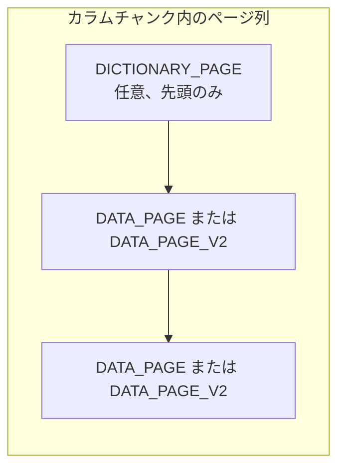
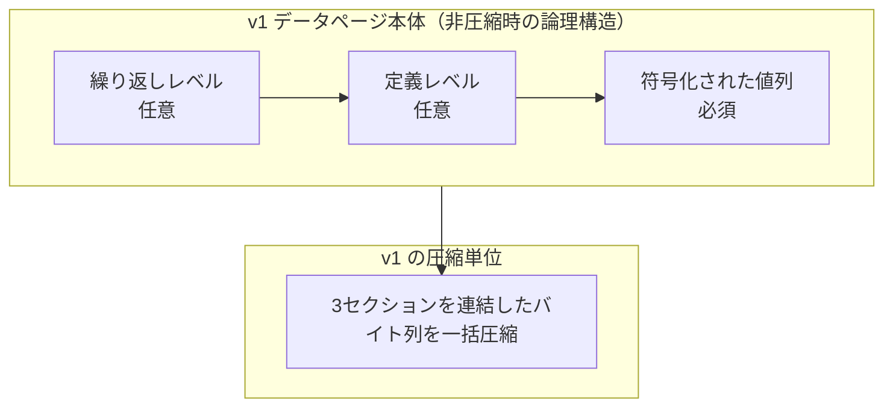

# 第7章 データページとページヘッダ

> **本章で読むソース**
>
> - [`src/main/thrift/parquet.thrift`](https://github.com/apache/parquet-format/blob/apache-parquet-format-2.13.0/src/main/thrift/parquet.thrift)
> - [`README.md`](https://github.com/apache/parquet-format/blob/apache-parquet-format-2.13.0/README.md)

## この章の狙い

カラムチャンクを構成する**ページ**の種類と、各ページ先頭の `PageHeader` が運ぶメタデータを、Thrift 定義と README の Data Pages 節に沿って説明する。
v1（`DATA_PAGE`）と v2（`DATA_PAGE_V2`）のデータページ形式の差、辞書ページの配置規則、ページ単位 CRC の計算対象を押さえ、読み手がページ本体を開く前に何がわかるかを整理する。

## 前提

第2章で `PageHeader` の概要と `compressed_page_size` によるスキップを触れている。
第4章で定義レベルと繰り返しレベルの意味、第5章と第6章でエンコーディング方式を読んでいること。
圧縮コーデックの詳細は第8章で扱う。

## PageType：4種類のページ

`PageType` はカラムチャンク内で出現しうるページ種別を列挙する。

[`src/main/thrift/parquet.thrift` L661-L666](https://github.com/apache/parquet-format/blob/apache-parquet-format-2.13.0/src/main/thrift/parquet.thrift#L661-L666)

```thrift
enum PageType {
  DATA_PAGE = 0;
  INDEX_PAGE = 1;
  DICTIONARY_PAGE = 2;
  DATA_PAGE_V2 = 3;
}
```

`DATA_PAGE` と `DATA_PAGE_V2` はいずれも値列を運ぶデータページだが、ヘッダ構造と本体レイアウトが異なる。
`DICTIONARY_PAGE` は辞書符号化時に実値を格納する専用ページである。
`INDEX_PAGE` は `IndexPageHeader` が TODO のまま残っており、現行の読み取り経路では実質使われない。



辞書ページがある場合、カラムチャンクの先頭に1枚だけ置かれる（後述）。
以降はデータページが `PageHeader` と本体の繰り返しで並ぶ。

## PageHeader：全ページ共通の枠

すべてのページは共通の `PageHeader` で始まる。
`type` に応じて、種別ヘッダの union メンバのうち1つだけが設定される。

[`src/main/thrift/parquet.thrift` L810-L844](https://github.com/apache/parquet-format/blob/apache-parquet-format-2.13.0/src/main/thrift/parquet.thrift#L810-L844)

```thrift
struct PageHeader {
  /** the type of the page: indicates which of the *_header fields is set **/
  1: required PageType type

  /** Uncompressed page size in bytes (not including this header) **/
  2: required i32 uncompressed_page_size

  /** Compressed (and potentially encrypted) page size in bytes, not including this header **/
  3: required i32 compressed_page_size

  /** The 32-bit CRC checksum for the page, to be calculated as follows:
   *
   * - The standard CRC32 algorithm is used (with polynomial 0x04C11DB7,
   *   the same as in e.g. GZIP).
   * - All page types can have a CRC (v1 and v2 data pages, dictionary pages,
   *   etc.).
   * - The CRC is computed on the serialization binary representation of the page
   *   (not including the page header). For example, for v1
   *   data pages, the CRC is computed on the concatenation of repetition levels,
   *   definition levels and column values (optionally compressed, optionally
   *   encrypted).
   * - The CRC computation therefore takes place after any compression
   *   and encryption steps, if any.
   *
   * If enabled, this allows for disabling checksumming in HDFS if only a few
   * pages need to be read.
   */
  4: optional i32 crc

  // Headers for page specific data.  One only will be set.
  5: optional DataPageHeader data_page_header;
  6: optional IndexPageHeader index_page_header;
  7: optional DictionaryPageHeader dictionary_page_header;
  8: optional DataPageHeaderV2 data_page_header_v2;
}
```

`uncompressed_page_size` はヘッダを除くページ本体の非圧縮バイト数である。
`compressed_page_size` は圧縮後（暗号化後を含む）の本体サイズであり、次の `PageHeader` へ進む距離を決める。
圧縮なしのとき両者は一致する。

### 設計上の工夫：compressed_page_size によるページスキップ

読み手は `PageHeader` だけを解釈し、`compressed_page_size` バイトだけファイル位置を進めれば、ページ本体を読まずに次ページへ到達できる。
プッシュダウンで不要なページが判明した場合、帯域と CPU の両方を節約できる。
ページインデックス（`OffsetIndex`）と組み合わせると、行境界に揃ったスキップがさらに効率化される（第10章）。

## DataPageHeader：v1 データページの種別ヘッダ

`type = DATA_PAGE` のとき `data_page_header` が設定される。

[`src/main/thrift/parquet.thrift` L679-L700](https://github.com/apache/parquet-format/blob/apache-parquet-format-2.13.0/src/main/thrift/parquet.thrift#L679-L700)

```thrift
/** Data page header */
struct DataPageHeader {
  /**
   * Number of values, including NULLs, in this data page.
   *
   * If an OffsetIndex is present, a page must begin at a row
   * boundary (repetition_level = 0). Otherwise, pages may begin
   * within a row (repetition_level > 0).
   **/
  1: required i32 num_values

  /** Encoding used for this data page **/
  2: required Encoding encoding

  /** Encoding used for definition levels **/
  3: required Encoding definition_level_encoding;

  /** Encoding used for repetition levels **/
  4: required Encoding repetition_level_encoding;

  /** Optional statistics for the data in this page **/
  5: optional Statistics statistics;
}
```

`num_values` は NULL を含む値の個数である。
`encoding` はデータ部（符号化された値列）のエンコーディングを示す。
定義レベルと繰り返しレベルはそれぞれ独立した `Encoding` フィールドを持つ（実運用では RLE が使われる）。

`OffsetIndex` があるファイルでは、ページは行境界（`repetition_level = 0`）で始まらなければならない。
インデックスがない場合、行の途中からページが始まることも許容される。

## データページ本体：3セクションの直列配置

README の Data Pages 節は、v1 データページ本体の並びを規定する。

[`README.md` L183-L201](https://github.com/apache/parquet-format/blob/apache-parquet-format-2.13.0/README.md#L183-L201)

```text
## Data Pages
For data pages, the 3 pieces of information are encoded back to back, after the page
header. No padding is allowed in the data page.
In order we have:
 1. repetition levels data
 1. definition levels data
 1. encoded values

The value of `uncompressed_page_size` specified in the header is for all the 3 pieces combined.

The encoded values for the data page are always required.  The definition and repetition levels
are optional, based on the schema definition.  If the column is not nested (i.e.
the path to the column has length 1), we do not encode the repetition levels (they would
always have the value 0).  For data that is required, the definition levels are
skipped (if encoded, they will always have the value of the max definition level).

For example, in the case where the column is non-nested and required, the data in the
page is only the encoded values.
```

3セクションはパディングなしで連結される。
`uncompressed_page_size` は3セクション合計の非圧縮サイズである。

v1 では、3セクション全体がまとめて1回圧縮される（第8章）。
読み手がレベルだけ欲しい場合でも、まず全体を解凍する必要がある。



ネストなし必須列では、本体は符号化された値列だけになる。
NULL は定義レベルに符号化され、値列には出現しない（README の Nulls 節）。

## DictionaryPageHeader：辞書ページ

辞書符号化されたカラムチャンクでは、辞書ページが先頭に置かれる。

[`src/main/thrift/parquet.thrift` L706-L720](https://github.com/apache/parquet-format/blob/apache-parquet-format-2.13.0/src/main/thrift/parquet.thrift#L706-L720)

```thrift
/**
 * The dictionary page must be placed at the first position of the column chunk
 * if it is partly or completely dictionary encoded. At most one dictionary page
 * can be placed in a column chunk.
 **/
struct DictionaryPageHeader {
  /** Number of values in the dictionary **/
  1: required i32 num_values;

  /** Encoding using this dictionary page **/
  2: required Encoding encoding

  /** If true, the entries in the dictionary are sorted in ascending order **/
  3: optional bool is_sorted;
}
```

`num_values` は辞書エントリ数である。
`encoding` は辞書内の実値の符号化方式（通常は `PLAIN`）を示す。
`is_sorted` が真なら辞書エントリは昇順に並ぶ。

README の Column chunks 節は配置規則を繰り返す。

[`README.md` L213-L218](https://github.com/apache/parquet-format/blob/apache-parquet-format-2.13.0/README.md#L213-L218)

```text
A column chunk might be partly or completely dictionary encoded. It means that
dictionary indexes are saved in the data pages instead of the actual values. The
actual values are stored in the dictionary page. See details in
[Encodings.md](https://github.com/apache/parquet-format/blob/master/Encodings.md#dictionary-encoding-plain_dictionary--2-and-rle_dictionary--8).
The dictionary page must be placed at the first position of the column chunk. At
most one dictionary page can be placed in a column chunk.
```

### 設計上の工夫：辞書の一回読み取り

データページには辞書インデックスだけが入り、実値は辞書ページに集約される。
読み手はカラムチャンクの先頭で辞書を1回デコードすれば、以降の全データページで再利用できる。
カーディナリティが低い列では、繰り返し出現する文字列やカテゴリ値の実体をページごとに重複保存しない。

## DataPageHeaderV2：レベルとデータの分離

`type = DATA_PAGE_V2` のとき `data_page_header_v2` が設定される。
v2 はレベル部とデータ部を分け、データ部だけを圧縮対象にできる。

[`src/main/thrift/parquet.thrift` L722-L763](https://github.com/apache/parquet-format/blob/apache-parquet-format-2.13.0/src/main/thrift/parquet.thrift#L722-L763)

```thrift
/**
 * Alternate page format allowing reading levels without decompressing the data
 * Repetition and definition levels are uncompressed
 * The remaining section containing the data is compressed if is_compressed is true
 *
 * Implementation note - this header is not necessarily a strict improvement over
 * `DataPageHeader` (in particular the original header might provide better compression
 * in some scenarios). Page indexes require pages to start and end at row boundaries,
 * regardless of which page header is used.
 **/
struct DataPageHeaderV2 {
  /** Number of values, including NULLs, in this data page. **/
  1: required i32 num_values
  /** Number of NULL values, in this data page.
      Number of non-null = num_values - num_nulls which is also the number of values in the data section **/
  2: required i32 num_nulls
  /**
   * Number of rows in this data page. Every page must begin at a
   * row boundary (repetition_level = 0): rows must **not** be
   * split across page boundaries when using V2 data pages.
   **/
  3: required i32 num_rows
  /** Encoding used for data in this page **/
  4: required Encoding encoding

  // repetition levels and definition levels are always using RLE (without size in it)

  /** Length of the definition levels */
  5: required i32 definition_levels_byte_length;
  /** Length of the repetition levels */
  6: required i32 repetition_levels_byte_length;

  /**  Whether the values are compressed.
  Which means the section of the page between
  definition_levels_byte_length + repetition_levels_byte_length and compressed_page_size (included)
  is compressed with the compression_codec.
  If missing it is considered compressed */
  7: optional bool is_compressed = true;

  /** Optional statistics for the data in this page **/
  8: optional Statistics statistics;
}
```

v2 の本体は次の順序である。

1. 定義レベル（非圧縮、RLE。サイズ前置きなし）
2. 繰り返しレベル（非圧縮、RLE。サイズ前置きなし）
3. 符号化された値列（`is_compressed` が真なら圧縮）

`num_nulls` から非 NULL 値数が導ける。
`num_rows` と行境界制約により、v2 ページは常に行単位で切られる。

### 設計上の工夫：レベルだけ先に読む

v2 では定義レベルと繰り返しレベルが非圧縮で先頭に置かれるため、読み手はデータ部を解凍せずに NULL 分布やネスト構造を調べられる。
プッシュダウンで値列が不要と判明したページでは、レベル部の解析だけで打ち切れる余地がある。

一方、Thrift コメントは v2 が常に v1 より優れるわけではないと明記する。
3セクションを一括圧縮する v1 のほうが圧縮率が高いケースもあり、writer は用途に応じて選ぶ。


v1 と v2 の対応を表にまとめる。

| 観点 | v1（`DATA_PAGE`） | v2（`DATA_PAGE_V2`） |
|------|-------------------|----------------------|
| レベルのエンコーディング指定 | ヘッダの個別フィールド | 常に RLE（サイズ前置きなし） |
| 圧縮範囲 | 3セクション一括 | 値列のみ（レベルは非圧縮） |
| 行境界 | インデックスあり時のみ必須 | 常に必須 |
| NULL 数 | レベルから導出 | `num_nulls` で明示 |

## ページ統計とカラムチャンクへの接続

`DataPageHeader` と `DataPageHeaderV2` はいずれも `optional Statistics statistics` を持つ。
ページ単位の min/max などは、カラムチャンク統計の構成要素になりうる（第9章）。

カラムチャンク全体の符号化方式一覧は `ColumnMetaData.encodings` に記録される。
ページヘッダの `encoding` は、そのページのデータ部に実際に使われた方式を示す。

## Checksumming：ページ単位 CRC32

README の Checksumming 節は、全種類のページに CRC を付けられることを述べる。

[`README.md` L224-L228](https://github.com/apache/parquet-format/blob/apache-parquet-format-2.13.0/README.md#L224-L228)

```text
## Checksumming
Pages of all kinds can be individually checksummed. This allows disabling of checksums
at the HDFS file level, to better support single row lookups. Checksums are calculated
using the standard CRC32 algorithm - as used in e.g. GZIP - on the serialized binary
representation of a page (not including the page header itself).
```

CRC の多項式は `0x04C11DB7`（GZIP と同じ）である。
計算対象はディスクに書かれたページ本体のバイト列であり、圧縮と暗号化の**後**の表現である。
ヘッダ自体は CRC に含めない。

### 設計上の工夫：HDFS ファイル全体チェックサムの無効化

HDFS はブロック単位のチェックサムを持つが、Parquet ページ CRC があればファイル全体のチェックサムを切っても、読んだページだけ整合性を検証できる。
単一行参照のようにごく一部のページだけ触るワークロードでは、二重チェックサムのコストを避けつつデータ破損を検出しやすい。

## カラムチャンク内のページ列

README はカラムチャンクをページの連続と定義する。

[`README.md` L207-L211](https://github.com/apache/parquet-format/blob/apache-parquet-format-2.13.0/README.md#L207-L211)

```text
## Column chunks
Column chunks are composed of pages written back to back.  The pages share a common
header and readers can skip over pages they are not interested in.  The data for the
page follows the header and can be compressed and/or encoded.  The compression and
encoding is specified in the page metadata.
```

圧縮コーデックは `ColumnMetaData.codec` でカラムチャンク単位に指定される（第8章）。
各ページの `PageHeader` は、そのコーデックで圧縮された本体サイズを伝える。

エラー回復の粒度はページ単位である。
ページヘッダが壊れると当該チャンクの残りページは読めなくなるが、他ロウグループの同名列は影響を受けない（README の Error recovery 節）。

## v1 と v2 の選択指針

writer が v2 を選ぶ典型理由は、レベルと値列の分離による部分読み取りと、行境界の厳格化である。
v1 を選ぶ典型理由は、3セクション一括圧縮によるサイズ効率である。

いずれの形式でも、ページインデックス利用時は行境界でページを切る必要がある。
v2 はその制約を常に課すため、ページインデックスとの相性を意識したレイアウトになりやすい。

ページサイズの推奨（8KB 前後）は README の Configurations 節にあり、ヘッダオーバーヘッドと細かいスキップのトレードオフを決める（第2章）。

## まとめ

`PageType` はデータページ（v1/v2）、辞書ページ、未使用のインデックスページを区別する。
`PageHeader` は非圧縮サイズ、圧縮後サイズ、任意の CRC を全ページ種別で共通に運ぶ。
v1 データページは繰り返しレベル、定義レベル、値列を直列配置し一括圧縮する。
v2 はレベルを非圧縮 RLE で先に置き、値列だけを圧縮でき、行境界と `num_nulls` をヘッダで明示する。
辞書ページはカラムチャンク先頭に最大1枚、データページは辞書インデックスを運ぶ。

## 関連する章

- [第2章 ファイル構造とメタデータ階層](../part00-overview/02-file-structure.md)
- [第4章 ネストとレベル符号化](../part01-types/04-nested-encoding.md)
- [第5章 基本エンコーディング](../part02-encoding/05-basic-encodings.md)
- [第8章 圧縮コーデック](08-compression.md)
