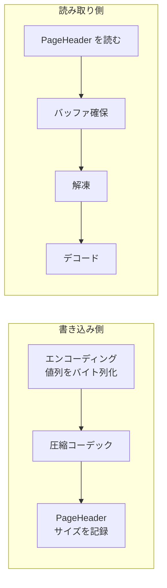

# 第8章 圧縮コーデック

> **本章で読むソース**
>
> - [`Compression.md`](https://github.com/apache/parquet-format/blob/apache-parquet-format-2.13.0/Compression.md)
> - [`src/main/thrift/parquet.thrift`](https://github.com/apache/parquet-format/blob/apache-parquet-format-2.13.0/src/main/thrift/parquet.thrift)

## この章の狙い

Parquet がサポートする**圧縮コーデック**を、`CompressionCodec` 列挙と `Compression.md` の仕様に沿って整理する。
ページ本体への適用方法、v1 と v2 データページでの圧縮範囲の差、非推奨 `LZ4` と後継 `LZ4_RAW` の経緯を説明し、エンコーディングとの組み合わせを踏まえた選択の軸を示す。

## 前提

第7章で `PageHeader` の `compressed_page_size` と `uncompressed_page_size`、v1 の一括圧縮と v2 の値列のみ圧縮を読んでいること。
第5章と第6章で、エンコーディングが値の表現を変え、圧縮はその後段でバイト列を縮める二段構造であることを知っていると理解が進みやすい。

## CompressionCodec：Thrift 上の列挙

圧縮方式は `CompressionCodec` 列挙で識別される。
詳細仕様は `Compression.md` を参照する旨がコメントに書かれる。

[`src/main/thrift/parquet.thrift` L641-L659](https://github.com/apache/parquet-format/blob/apache-parquet-format-2.13.0/src/main/thrift/parquet.thrift#L641-L659)

```thrift
/**
 * Supported compression algorithms.
 *
 * Codecs added in format version X.Y can be read by readers based on X.Y and later.
 * Codec support may vary between readers based on the format version and
 * libraries available at runtime.
 *
 * See Compression.md for a detailed specification of these algorithms.
 */
enum CompressionCodec {
  UNCOMPRESSED = 0;
  SNAPPY = 1;
  GZIP = 2;
  LZO = 3;
  BROTLI = 4;  // Added in 2.4
  LZ4 = 5;     // DEPRECATED (Added in 2.4)
  ZSTD = 6;    // Added in 2.4
  LZ4_RAW = 7; // Added in 2.9
}
```

フォーマット版 X.Y で追加されたコーデックは、X.Y 以降の reader が読める前提で書かれる。
実行時に利用可能なライブラリは実装依存であり、writer が選んでも reader が解凍できない場合がある。

カラムチャンク単位で1つの `codec` が `ColumnMetaData` に記録される。

[`src/main/thrift/parquet.thrift` L899-L900](https://github.com/apache/parquet-format/blob/apache-parquet-format-2.13.0/src/main/thrift/parquet.thrift#L899-L900)

```thrift
  /** Compression codec **/
  4: required CompressionCodec codec
```

同一カラムチャンク内の全ページ（辞書ページを含む）は同じコーデックで圧縮される。

## 圧縮の適用単位とバッファ割り当て

`Compression.md` の Overview は、圧縮対象と入出力の扱いを規定する。

[`Compression.md` L24-L38](https://github.com/apache/parquet-format/blob/apache-parquet-format-2.13.0/Compression.md#L24-L38)

```text
## Overview

Parquet allows the data block inside dictionary pages and data pages to
be compressed for better space efficiency. The Parquet format supports
several compression codecs covering different areas in the compression
ratio / processing cost spectrum.

The detailed specifications of compression codecs are maintained externally
by their respective authors or maintainers, which we reference hereafter.

For all compression codecs except the deprecated `LZ4` codec, the raw data
of a (data or dictionary) page is fed *as-is* to the underlying compression
library, without any additional framing or padding.  The information required
for precise allocation of compressed and decompressed buffers is written
in the `PageHeader` struct.
```

圧縮対象は辞書ページとデータページの**本体**である。
`PageHeader` 自体は圧縮されない。

非推奨 `LZ4` を除く全コーデックでは、ページ本体バイト列を追加フレーミングなしでそのまま圧縮ライブラリに渡す。
読み手は `uncompressed_page_size` と `compressed_page_size` から、解凍前後のバッファを正確に確保できる。



### 設計上の工夫：ページ単位サイズメタデータ

行指向フォーマットでファイル全体を1つの圧縮ストリームにすると、途中列だけ読むために広い範囲を解凍しなければならない。
Parquet はページごとに圧縮境界を切り、`PageHeader` で両サイズを宣言するため、必要ページだけを独立に解凍できる。
フレーミングオーバーヘッドを省くことで、圧縮率の損失も抑える。

## v1 と v2 での圧縮範囲

第7章で述べたとおり、データページ形式によって圧縮に入るバイト列が異なる。

v1（`DATA_PAGE`）では、繰り返しレベル、定義レベル、符号化された値列を連結したバイト列全体が圧縮対象である。
CRC もその連結後（圧縮後）のバイト列に対して計算される。

v2（`DATA_PAGE_V2`）では、定義レベルと繰り返しレベルは非圧縮のまま先頭に置かれる。
`is_compressed` が真（省略時も真）のとき、値列部分だけが `ColumnMetaData.codec` で圧縮される。
`compressed_page_size` はレベル部と圧縮された値列部の合計サイズである。

辞書ページの本体も、データページと同様にカラムチャンクの `codec` で圧縮される。

## UNCOMPRESSED

[`Compression.md` L42-L44](https://github.com/apache/parquet-format/blob/apache-parquet-format-2.13.0/Compression.md#L42-L44)

```text
### UNCOMPRESSED

No-op codec.  Data is left uncompressed.
```

エンコーディングだけ適用し、圧縮は行わない。
`uncompressed_page_size` と `compressed_page_size` は一致する。
すでに高いエントロピーの列や、圧縮コストが見合わない小さなページで選ばれることがある。

## SNAPPY

[`Compression.md` L46-L52](https://github.com/apache/parquet-format/blob/apache-parquet-format-2.13.0/Compression.md#L46-L52)

```text
### SNAPPY

A codec based on the
[Snappy compression format](https://github.com/google/snappy/blob/master/format_description.txt).
If any ambiguity arises when implementing this format, the implementation
provided by the [Snappy compression library](https://github.com/google/snappy/)
is authoritative.
```

Snappy は速度重視のコーデックである。
圧縮率は ZSTD や BROTLI より低いが、解凍 CPU が小さいためインタラクティブなクエリでよく使われる。
仕様の曖昧さは Google の Snappy ライブラリ実装が正とする。

## GZIP

[`Compression.md` L54-L63](https://github.com/apache/parquet-format/blob/apache-parquet-format-2.13.0/Compression.md#L54-L63)

```text
### GZIP

A codec based on the GZIP format (not the closely-related "zlib" or "deflate"
formats) defined by [RFC 1952](https://tools.ietf.org/html/rfc1952).
If any ambiguity arises when implementing this format, the implementation
provided by the [zlib compression library](https://zlib.net/) is authoritative.

Readers should support reading pages containing multiple GZIP members; however,
as this has historically not been supported by all implementations, it is recommended
that writers refrain from creating such pages by default for better interoperability.
```

zlib や raw deflate ではなく、RFC 1952 の GZIP 形式である。
reader は複数 GZIP メンバを含むページを読めるべきだが、歴史的に全実装が対応しているわけではない。
writer は既定で1メンバに留めることが推奨される。

アーカイブ用途やストレージコスト最優先のコールドデータで選ばれることが多い。

## LZO

[`Compression.md` L65-L68](https://github.com/apache/parquet-format/blob/apache-parquet-format-2.13.0/Compression.md#L65-L68)

```text
### LZO

A codec based on or interoperable with the
[LZO compression library](https://www.oberhumer.com/opensource/lzo/).
```

LZO はレガシー Hadoop 系スタックとの互換のために残る。
新規パイプラインでは SNAPPY や ZSTD を選ぶことが多い。

## BROTLI

[`Compression.md` L70-L76](https://github.com/apache/parquet-format/blob/apache-parquet-format-2.13.0/Compression.md#L70-L76)

```text
### BROTLI

A codec based on the Brotli format defined by
[RFC 7932](https://tools.ietf.org/html/rfc7932).
If any ambiguity arises when implementing this format, the implementation
provided by the [Brotli compression library](https://github.com/google/brotli)
is authoritative.
```

Brotli は高い圧縮率を狙えるが、エンコードが重い。
読み取り回数が圧倒的に多いデータレイクでは、書き込み時のコストと読み取り時の帯域削減のトレードオフで選ぶ。

## LZ4（非推奨）

[`Compression.md` L78-L87](https://github.com/apache/parquet-format/blob/apache-parquet-format-2.13.0/Compression.md#L78-L87)

```text
### LZ4

A **deprecated** codec loosely based on the LZ4 compression algorithm,
but with an additional undocumented framing scheme.  The framing is part
of the original Hadoop compression library and was historically copied
first in parquet-mr, then emulated with mixed results by parquet-cpp.

It is strongly suggested that implementors of Parquet writers deprecate
this compression codec in their user-facing APIs, and advise users to
switch to the newer, interoperable `LZ4_RAW` codec.
```

`LZ4` は LZ4 アルゴリズムに近いが、文書化されていない独自フレーミングを載せた例外である。
Hadoop 圧縮ライブラリ由来の枠が parquet-mr にコピーされ、parquet-cpp が模倣した結果、実装間の互換が崩れた。

writer API では非推奨とし、利用者には `LZ4_RAW` への移行を勧めるべきだと仕様が述べる。

### 設計上の工夫：LZ4_RAW による素のブロック形式

後述の `LZ4_RAW` は LZ4 ブロック形式をそのまま使い、他コーデックと同様に追加フレーミングがない。
これによりバッファサイズは `PageHeader` だけで決まり、実装間の解釈のずれを減らせる。

## ZSTD

[`Compression.md` L89-L95](https://github.com/apache/parquet-format/blob/apache-parquet-format-2.13.0/Compression.md#L89-L95)

```text
### ZSTD

A codec based on the Zstandard format defined by
[RFC 8878](https://tools.ietf.org/html/rfc8878).  If any ambiguity arises
when implementing this format, the implementation provided by the
[Zstandard compression library](https://facebook.github.io/zstd/)
is authoritative.
```

ZSTD は圧縮率と速度のバランスが良く、現行の汎用選択肢として広く使われる。
レベルパラメータで書き込みコストを調整できる実装が多い（仕様外の writer 設定）。

## LZ4_RAW

[`Compression.md` L97-L101](https://github.com/apache/parquet-format/blob/apache-parquet-format-2.13.0/Compression.md#L97-L101)

```text
### LZ4_RAW

A codec based on the [LZ4 block format](https://github.com/lz4/lz4/blob/dev/doc/lz4_Block_format.md).
If any ambiguity arises when implementing this format, the implementation
provided by the [LZ4 compression library](https://www.lz4.org/) is authoritative.
```

フォーマット 2.9 で追加された。
SNAPPY と同様に高速解凍を狙いつつ、非推奨 `LZ4` のフレーミング問題を避ける。

## コーデックの位置づけ

`Compression.md` は各コーデックのワイヤ形式を規定するが、圧縮率や解凍速度を共通尺度で測定したベンチマークは示さない。
仕様から導ける事実と、運用上の経験則は次のように分けて捉える。

### 仕様が定める位置づけ

- `CompressionCodec` は列挙型であり、将来のコーデック追加を想定している。
- フォーマット版 X.Y で追加されたコーデックは、X.Y 以降の reader が読める前提で書かれる。
- `LZ4` は非推奨であり、`LZ4_RAW` が後継として追加された（第8章前半）。
- `UNCOMPRESSED` は圧縮を行わない選択肢として常に存在する。

### 運用上の経験則

次の整理は仕様の順位付けではなく、実装選定でよく参照される傾向である。

- SNAPPY や `LZ4_RAW` は解凍速度を重視するワークロードでよく選ばれる。
- ZSTD や GZIP、BROTLI は圧縮率を重視する場面で検討されることが多い。
- 実際の比率と速度は列の内容、ページサイズ、writer 設定、実行時ライブラリに依存し、同一コーデックでも入れ替わる。
- 数値ワークロードで BYTE_STREAM_SPLIT エンコーディングを併用すると、同一コーデックでも圧縮率が大きく変わる（第6章）。

### 設計上の工夫：エンコーディングと圧縮の二段構え

エンコーディングは値の冗長性をバイト列のパターンに変換し、圧縮はそのパターンを捉える。
辞書符号化は繰り返し値をインデックスに置き換え、DELTA 系は隣接差分を小さくし、BYTE_STREAM_SPLIT は同一バイト位置の相関を強める。
いずれも単体では必ずしもファイルを小さくしないが、後段の LZ 系コーデックが効きやすいバイト列を作る。

writer はページサイズ上限のなかでエンコーディングを選び、カラムチャンク全体に1つの `codec` を適用する。
読み手は `ColumnMetaData.encodings` でデコード可能性を検証し、各ページヘッダで実際の方式を確認する。

## 圧縮と暗号化の順序

暗号化を有効にした場合、CRC は暗号化後のページ本体に対して計算される（`PageHeader` の crc コメント）。
圧縮してから暗号化するのが自然な順序であり、読み手は復号後に解凍する。
暗号化の詳細は第12章で扱う。

## 互換性とフォーマット版

`CompressionCodec` のコメントが示すとおり、BROTLI、LZ4、ZSTD は 2.4 で追加された。
LZ4_RAW は 2.9 で追加された。
古い reader は未知のコーデック値を含むファイルを拒否するか、当該列を読めない。

実行時ライブラリの有無も制約になる。
たとえば JVM 上の reader が native の ZSTD ライブラリをリンクしていなければ、メタデータ上は ZSTD でも読めない。

## 運用上の指針

次の表は、典型的な選択の出発点である。
ワークロードと SLA で必ず検証する。

| 優先事項 | 候補コーデック |
|---------|---------------|
| 読み取りレイテンシ | SNAPPY、LZ4_RAW、UNCOMPRESSED |
| ストレージコスト | ZSTD、BROTLI、GZIP |
| レガシー Hadoop 互換 | GZIP、LZO |
| 新規パイプライン | ZSTD または SNAPPY（LZ4 は避ける） |

v2 データページではレベルが非圧縮のため、圧縮率は v1 より下がりうる。
レベルだけ先に読む利点と、ストレージ効率のどちらを取るかはデータ形状に依存する。

ページサイズを大きくすると圧縮辞書の共有範囲は広がるが、細かいページスキップは難しくなる（第2章の Configurations 節）。
エンコーディング、ページ形式、コーデックは独立したノブではなく、一つのレイアウト設計として同時に決める。

## まとめ

`CompressionCodec` はカラムチャンク単位でページ本体の圧縮方式を指定する。
非推奨 `LZ4` を除き、ページ本体は追加フレーミングなしで各コーデックに渡される。
`PageHeader` のサイズフィールドが解凍バッファ割り当ての根拠になる。
v1 はレベルと値列を一括圧縮し、v2 は値列のみ圧縮する。
エンコーディングが作ったバイト列パターンを、コーデックがさらに縮める二段構えが Parquet のサイズ効率の基盤である。

## 関連する章

- [第6章 差分・分割エンコーディング](../part02-encoding/06-delta-encodings.md)
- [第7章 データページとページヘッダ](07-data-pages.md)
- [第2章 ファイル構造とメタデータ階層](../part00-overview/02-file-structure.md)
