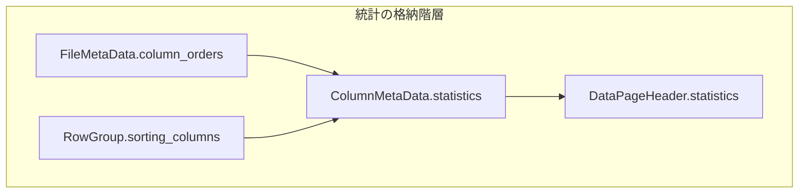

# 第9章 統計と列順序

> **本章で読むソース**
>
> - [`src/main/thrift/parquet.thrift`](https://github.com/apache/parquet-format/blob/apache-parquet-format-2.13.0/src/main/thrift/parquet.thrift)

## この章の狙い

**プレディケートプッシュダウン**の根拠となる `Statistics`、`SizeStatistics`、`ColumnOrder`、`SortingColumn`、`PageEncodingStats` を Thrift 定義に沿って説明する。
ロウグループ単位とページ単位で統計がどこに置かれ、min/max の比較順序を `column_orders` がどう規定するかを整理する。

## 前提

第2章で `ColumnMetaData` と `FileMetaData` の階層、第7章でページヘッダ内の `optional Statistics` を読んでいること。
物理型と論理型の対応は第3章、エンコーディングは第5章と第6章を参照する。

## Statistics：min/max と件数

`Statistics` はロウグループまたはページ単位の集約情報を運ぶ。
全フィールドは optional である。

[`src/main/thrift/parquet.thrift` L263-L319](https://github.com/apache/parquet-format/blob/apache-parquet-format-2.13.0/src/main/thrift/parquet.thrift#L263-L319)

```thrift
/**
 * Statistics per row group and per page
 * All fields are optional.
 */
struct Statistics {
   /**
    * DEPRECATED: min and max value of the column. Use min_value and max_value.
    *
    * Values are encoded using PLAIN encoding, except that variable-length byte
    * arrays do not include a length prefix.
    *
    * These fields encode min and max values determined by signed comparison
    * only. New files should use the correct order for a column's logical type
    * and store the values in the min_value and max_value fields.
    *
    * To support older readers, these may be set when the column order is
    * signed.
    */
   1: optional binary max;
   2: optional binary min;
   /**
    * Count of null values in the column.
    *
    * Writers SHOULD always write this field even if it is zero (i.e. no null value)
    * or the column is not nullable.
    * Readers MUST distinguish between null_count not being present and null_count == 0.
    * If null_count is not present, readers MUST NOT assume null_count == 0.
    */
   3: optional i64 null_count;
   /** count of distinct values occurring */
   4: optional i64 distinct_count;
   /**
    * Lower and upper bound values for the column, determined by its ColumnOrder.
    *
    * These may be the actual minimum and maximum values found on a page or column
    * chunk, but can also be (more compact) values that do not exist on a page or
    * column chunk. For example, instead of storing "Blart Versenwald III", a writer
    * may set min_value="B", max_value="C". Such more compact values must still be
    * valid values within the column's logical type.
    *
    * Values are encoded using PLAIN encoding, except that variable-length byte
    * arrays do not include a length prefix.
    */
   5: optional binary max_value;
   6: optional binary min_value;
   /** If true, max_value is the actual maximum value for a column */
   7: optional bool is_max_value_exact;
   /** If true, min_value is the actual minimum value for a column */
   8: optional bool is_min_value_exact;
   /**
    * Count of NaN values in the column; only present if physical type is FLOAT
    * or DOUBLE, or logical type is FLOAT16.
    * If this field is not present, readers MUST assume NaNs may be present
    * (i.e. MUST assume nan_count > 0 and MAY NOT assume nan_count == 0).
    */
   9: optional i64 nan_count;
}
```

`min` と `max` は非推奨であり、符号付き比較に固定されている。
新規ファイルは `min_value` と `max_value` を使い、比較順序は `ColumnOrder` に従う。

`null_count` は writer が 0 でも書くべき（SHOULD）とされ、reader は「未設定」と「0」を区別しなければならない（MUST）。
`distinct_count` はカーディナリティの目安になる。

min/max は実測値である必要はない。
長い文字列を `"B"` と `"C"` のような短い有効値に切り詰めてもよい。
`is_min_value_exact` と `is_max_value_exact` で実測かどうかを示せる。

浮動小数点列では `nan_count` の有無が reader の推論を変える。
未設定なら NaN が存在しうるとみなす。



## ColumnOrder：min/max の比較規則

`FileMetaData.column_orders` は、各葉列の `min_value` と `max_value` の順序を定義する。

[`src/main/thrift/parquet.thrift` L1399-L1415](https://github.com/apache/parquet-format/blob/apache-parquet-format-2.13.0/src/main/thrift/parquet.thrift#L1399-L1415)

```thrift
  /**
   * Sort order used for the min_value and max_value fields in the Statistics
   * objects and the min_values and max_values fields in the ColumnIndex
   * objects of each column in this file. Sort orders are listed in the order
   * matching the columns in the schema. The indexes are not necessarily the same
   * though, because only leaf nodes of the schema are represented in the list
   * of sort orders.
   *
   * Without column_orders, the meaning of the min_value and max_value fields
   * in the Statistics object and the ColumnIndex object is undefined. To ensure
   * well-defined behaviour, if these fields are written to a Parquet file,
   * column_orders must be written as well.
   *
   * The obsolete min and max fields in the Statistics object are always sorted
   * by signed comparison regardless of column_orders.
   */
  7: optional list<ColumnOrder> column_orders;
```

`column_orders` が無いとき、`min_value` と `max_value` の意味は未定義である。
これらを書くなら `column_orders` も書かなければならない。

`ColumnOrder` は union で、現行は `TYPE_ORDER` と `IEEE_754_TOTAL_ORDER` の2値である。

[`src/main/thrift/parquet.thrift` L1064-L1115](https://github.com/apache/parquet-format/blob/apache-parquet-format-2.13.0/src/main/thrift/parquet.thrift#L1064-L1115)

```thrift
/**
 * Union to specify the order used for the min_value and max_value fields for a
 * column. This union takes the role of an enhanced enum that allows rich
 * elements (which will be needed for a collation-based ordering in the future).
 *
 * Possible values are:
 * * TypeDefinedOrder - the column uses the order defined by its logical or
 *                      physical type (if there is no logical type).
 * * IEEE754TotalOrder - the floating point column uses IEEE 754 total order.
 *
 * If the reader does not support the value of this union, min and max stats
 * for this column should be ignored.
 */
union ColumnOrder {

  /**
   * The sort orders for logical types are:
   *   UTF8 - unsigned byte-wise comparison
   *   INT8 - signed comparison
   *   INT16 - signed comparison
   *   INT32 - signed comparison
   *   INT64 - signed comparison
   *   UINT8 - unsigned comparison
   *   UINT16 - unsigned comparison
   *   UINT32 - unsigned comparison
   *   UINT64 - unsigned comparison
   *   DECIMAL - signed comparison of the represented value
   *   DATE - signed comparison
   *   FLOAT16 - signed comparison of the represented value (*)
   *   TIME_MILLIS - signed comparison
   *   TIME_MICROS - signed comparison
   *   TIMESTAMP_MILLIS - signed comparison
   *   TIMESTAMP_MICROS - signed comparison
   *   INTERVAL - undefined
   *   JSON - unsigned byte-wise comparison
   *   BSON - unsigned byte-wise comparison
   *   ENUM - unsigned byte-wise comparison
   *   LIST - undefined
   *   MAP - undefined
   *   VARIANT - undefined
   *   GEOMETRY - undefined
   *   GEOGRAPHY - undefined
   *
   * In the absence of logical types, the sort order is determined by the physical type:
   *   BOOLEAN - false, true
   *   INT32 - signed comparison
   *   INT64 - signed comparison
   *   INT96 (only used for legacy timestamps) - undefined(+)
   *   FLOAT - signed comparison of the represented value (*)
   *   DOUBLE - signed comparison of the represented value (*)
   *   BYTE_ARRAY - unsigned byte-wise comparison
   *   FIXED_LEN_BYTE_ARRAY - unsigned byte-wise comparison
```

UTF8 や BYTE_ARRAY は符号なしバイト単位比較、INT32 は符号付き比較、といった対応が列挙される。
reader が union の値を解釈できない場合、その列の min/max 統計は無視すべきである。

浮動小数点では `TYPE_ORDER` は NaN と ±0 の扱いが曖昧になる。
writer には `IEEE_754_TOTAL_ORDER` の利用が推奨される。

[`src/main/thrift/parquet.thrift` L1171-L1186](https://github.com/apache/parquet-format/blob/apache-parquet-format-2.13.0/src/main/thrift/parquet.thrift#L1171-L1186)

```thrift
  /*
   * The floating point type is ordered according to the totalOrder predicate,
   * as defined in section 5.10 of IEEE-754 (2008 revision). Only columns of
   * physical type FLOAT or DOUBLE, or logical type FLOAT16 may use this ordering.
   *
   * Intuitively, this orders floats mathematically, but defines -0 to be less
   * than +0, -NaN to be less than anything else, and +NaN to be greater than
   * anything else. It also defines an order between different bit representations
   * of the same value.
   *
   * When writing statistics for columns with IEEE_754_TOTAL_ORDER order, then
   * following rules must be followed:
   * - Writing the nan_count field is mandatory when using this ordering.
   * - Min and max statistics must contain the smallest and largest non-NaN
   *   values respectively, or if all non-null values are NaN, the smallest and
   *   largest NaN values as defined by IEEE 754 total order.
```

### 設計上の工夫：column_orders による型ごとの正しい比較

旧 `min`/`max` は符号付き比較に固定され、UTF8 列で辞書順プルーニングが誤る危険があった。
`column_orders` は論理型ごとの順序をファイルに明示し、reader が統計だけでロウグループを安全に除外できるようにする。
浮動小数点では total order を選ぶことで NaN を統計から切り離し、`nan_count` と組み合わせた推論を可能にする。

## 統計の配置：カラムチャンクとページ

`ColumnMetaData` はロウグループ単位の統計を `statistics` に持つ。

[`src/main/thrift/parquet.thrift` L924-L925](https://github.com/apache/parquet-format/blob/apache-parquet-format-2.13.0/src/main/thrift/parquet.thrift#L924-L925)

```thrift
  /** optional statistics for this column chunk */
  12: optional Statistics statistics;
```

データページの `DataPageHeader` と `DataPageHeaderV2` は、ページ単位の `optional Statistics statistics` を持つ（第7章）。
カラムチャンク統計はページ統計の集約として書かれることが多いが、仕様上は独立した optional フィールドである。

読み手はまずフッタのカラムチャンク統計でロウグループ全体をプルーニングし、残ったチャンク内でページ統計やページインデックス（第10章）を使う。

## SizeStatistics：メモリ見積もりとネスト

`SizeStatistics` はカラムチャンクに付随し、バイト数とレベルヒストグラムを運ぶ。

[`src/main/thrift/parquet.thrift` L202-L238](https://github.com/apache/parquet-format/blob/apache-parquet-format-2.13.0/src/main/thrift/parquet.thrift#L202-L238)

```thrift
struct SizeStatistics {
   /**
    * The number of physical bytes stored for BYTE_ARRAY data values assuming
    * no encoding. This is exclusive of the bytes needed to store the length of
    * each byte array. In other words, this field is equivalent to the `(size
    * of PLAIN-ENCODING the byte array values) - (4 bytes * number of values
    * written)`. To determine unencoded sizes of other types readers can use
    * schema information multiplied by the number of non-null and null values.
    * The number of null/non-null values can be inferred from the histograms
    * below.
    *
    * For example, if a column chunk is dictionary-encoded with dictionary
    * ["a", "bc", "cde"], and a data page contains the indices [0, 0, 1, 2],
    * then this value for that data page should be 7 (1 + 1 + 2 + 3).
    *
    * This field should only be set for types that use BYTE_ARRAY as their
    * physical type.
    */
   1: optional i64 unencoded_byte_array_data_bytes;
   /**
    * When present, there is expected to be one element corresponding to each
    * repetition (i.e. size=max repetition_level+1) where each element
    * represents the number of times the repetition level was observed in the
    * data.
    *
    * This field may be omitted if max_repetition_level is 0 without loss
    * of information.
    **/
   2: optional list<i64> repetition_level_histogram;
   /**
    * Same as repetition_level_histogram except for definition levels.
    *
    * This field may be omitted if max_definition_level is 0 or 1 without
    * loss of information.
    **/
   3: optional list<i64> definition_level_histogram;
}
```

`unencoded_byte_array_data_bytes` は辞書インデックスから実文字列長を復元した合計である。
メモリ上の表現サイズ見積もりに使える。

定義レベルと繰り返しレベルのヒストグラムは、ネスト構造での NULL 分布の推定や、一部の述語プッシュダウンに使える。

[`src/main/thrift/parquet.thrift` L943-L949](https://github.com/apache/parquet-format/blob/apache-parquet-format-2.13.0/src/main/thrift/parquet.thrift#L943-L949)

```thrift
  /**
   * Optional statistics to help estimate total memory when converted to in-memory
   * representations. The histograms contained in these statistics can
   * also be useful in some cases for more fine-grained nullability/list length
   * filter pushdown.
   */
  16: optional SizeStatistics size_statistics;
```

### 設計上の工夫：ヒストグラムによるネスト列の細粒度プルーニング

フラット列では min/max と `null_count` だけで十分なことが多い。
`repetition_level_histogram` は各反復レベルが何回観測されたかの集計であり、個々のリスト境界ごとの長さ分布は保持しない。
たとえば長さ2のリストが複数ある場合と長さ3以上のリストがある場合を、集約ヒストグラムだけでは区別できない。
仕様コメントが list length filter pushdown に言及するのは、NULL 可否や反復レベルの出現有無など、ヒストグラムから推定できる範囲に限られる。
`SizeStatistics` は統計メタデータだけでメモリ計画と、その範囲の述語判定を可能にする。

## SortingColumn：ロウグループ内のソート宣言

`RowGroup.sorting_columns` は、そのロウグループの行がどの列でソートされているかを宣言する。

[`src/main/thrift/parquet.thrift` L1041-L1044](https://github.com/apache/parquet-format/blob/apache-parquet-format-2.13.0/src/main/thrift/parquet.thrift#L1041-L1044)

```thrift
  /** If set, specifies a sort ordering of the rows in this RowGroup.
   * The sorting columns can be a subset of all the columns.
   */
  4: optional list<SortingColumn> sorting_columns
```

[`src/main/thrift/parquet.thrift` L857-L867](https://github.com/apache/parquet-format/blob/apache-parquet-format-2.13.0/src/main/thrift/parquet.thrift#L857-L867)

```thrift
/**
 * Sort order within a RowGroup of a leaf column
 */
struct SortingColumn {
  /** The ordinal position of the column (in this row group) **/
  1: required i32 column_idx

  /** If true, indicates this column is sorted in descending order. **/
  2: required bool descending

  /** If true, nulls will come before non-null values, otherwise,
   * nulls go at the end. */
  3: required bool nulls_first
}
```

`column_idx` はロウグループ内の列位置である。
複合ソートキーはリストの順序で表現する。
ソート列であること自体は、ページインデックスの `BoundaryOrder`（第10章）やレンジスキャンの効率に影響する。

## PageEncodingStats：ページ符号化の概要

`PageEncodingStats` はカラムチャンク内のページ種別とエンコーディングの出現回数を要約する。

[`src/main/thrift/parquet.thrift` L872-L883](https://github.com/apache/parquet-format/blob/apache-parquet-format-2.13.0/src/main/thrift/parquet.thrift#L872-L883)

```thrift
/**
 * statistics of a given page type and encoding
 */
struct PageEncodingStats {

  /** the page type (data/dic/...) **/
  1: required PageType page_type;

  /** encoding of the page **/
  2: required Encoding encoding;

  /** number of pages of this type with this encoding **/
  3: required i32 count;

}
```

[`src/main/thrift/parquet.thrift` L927-L930](https://github.com/apache/parquet-format/blob/apache-parquet-format-2.13.0/src/main/thrift/parquet.thrift#L927-L930)

```thrift
  /** Set of all encodings used for pages in this column chunk.
   * This information can be used to determine if all data pages are
   * dictionary encoded for example **/
  13: optional list<PageEncodingStats> encoding_stats;
```

reader はページを開かずに「全データページが辞書符号化か」を判定できる。
デコード不能なエンコーディングが含まれるチャンクを早期に除外する用途にも使える。

## プルーニングの典型的な流れ

1. フッタの `FileMetaData` からスキーマと `column_orders` を読む。
2. 各 `ColumnMetaData.statistics` の min/max と `null_count` でロウグループを除外する。
3. 残ったチャンクで `encoding_stats` やブルームフィルタ（第11章）を確認する。
4. ページ単位の判定にはページインデックスまたはページヘッダ統計を使う（第10章）。

カラムチャンク統計だけでは、チャンク内の一部ページだけが述語に合う場合を区別できない。
その隙間をページインデックスが埋める。

### 設計上の工夫：ロウグループ統計による I/O 回避

オブジェクトストアではフッタの Range GET だけで全ロウグループの min/max が揃う。
述語が `WHERE id < 100` のとき、min が 100 以上のロウグループはデータ領域を一切読まずに除外できる。
max が 50 なら非 NULL 値はすべて `id < 100` を満たすため、除外対象にはならない。
統計は近似境界（切り詰め min/max）でも安全側に働く。
境界外と確定できれば除外し、境界と重なる場合だけデータを読む。

## まとめ

`Statistics` は `min_value`/`max_value`、`null_count`、`nan_count` などでプルーニングの根拠を与える。
`ColumnOrder` と `FileMetaData.column_orders` が比較規則を定義し、旧 `min`/`max` との互換も仕様が規定する。
`SizeStatistics` は BYTE_ARRAY の非符号化バイト数とレベルヒストグラムでメモリ見積もりと、ヒストグラムから推定できる範囲のネスト述語を支える。
`SortingColumn` はロウグループ内ソートを宣言し、`PageEncodingStats` はページを開かず符号化構成を要約する。

## 関連する章

- [第2章 ファイル構造とメタデータ階層](../part00-overview/02-file-structure.md)
- [第3章 物理型と論理型](../part01-types/03-physical-and-logical-types.md)
- [第7章 データページとページヘッダ](../part03-page/07-data-pages.md)
- [第10章 ページインデックス](10-page-index.md)
- [第11章 ブルームフィルタ](11-bloom-filter.md)
