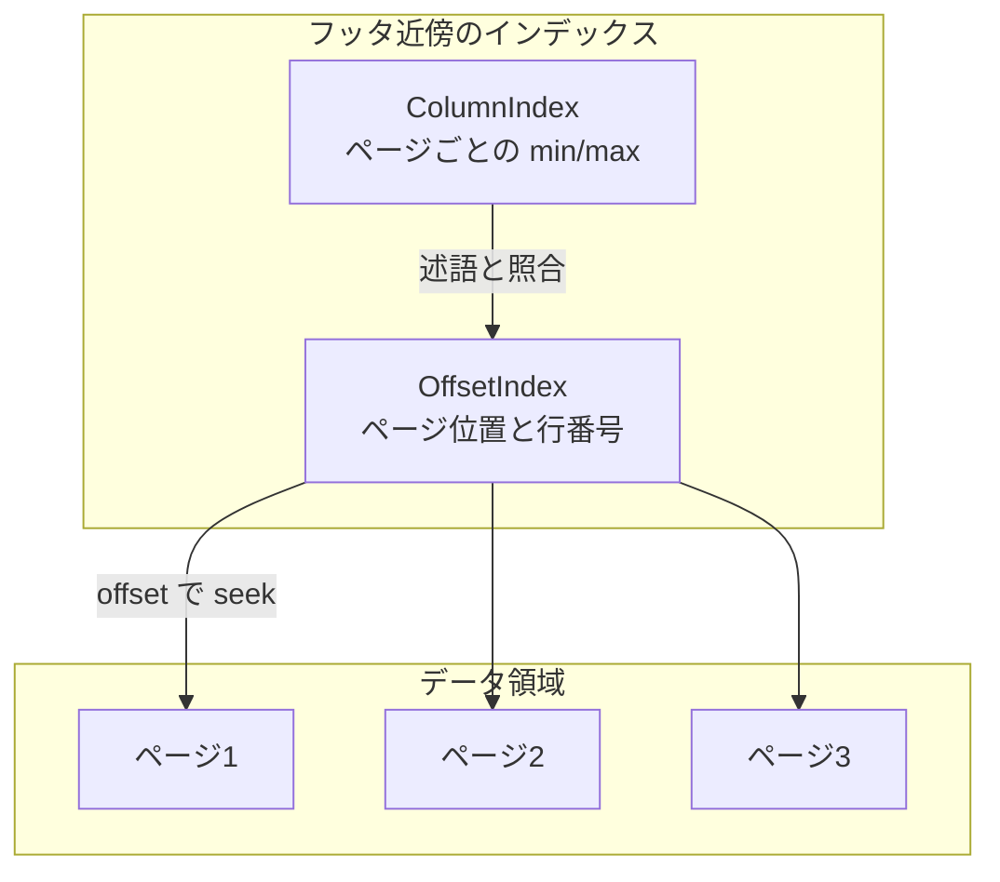
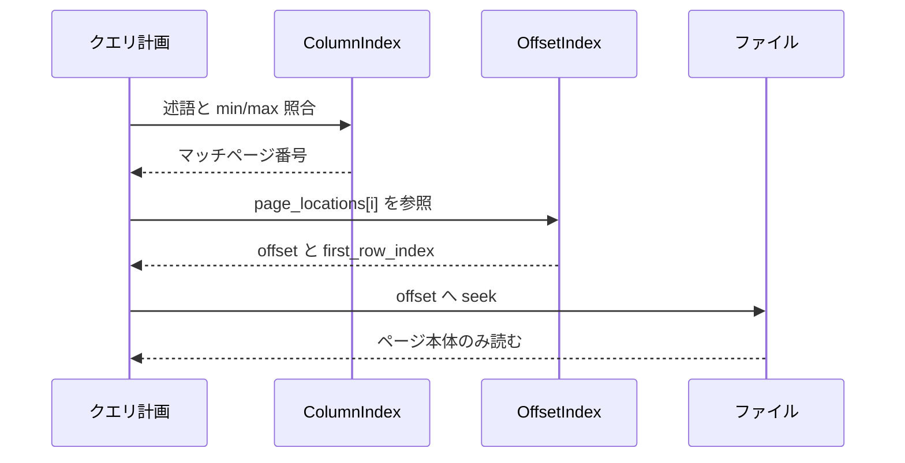

# 第10章 ページインデックス

> **本章で読むソース**
>
> - [`PageIndex.md`](https://github.com/apache/parquet-format/blob/apache-parquet-format-2.13.0/PageIndex.md)
> - [`src/main/thrift/parquet.thrift`](https://github.com/apache/parquet-format/blob/apache-parquet-format-2.13.0/src/main/thrift/parquet.thrift)

## この章の狙い

**ページインデックス**（`ColumnIndex` と `OffsetIndex`）が、カラムチャンク内のデータページを開かずにスキップする仕組みを説明する。
PageIndex.md が挙げる問題設定と目標に沿い、Thrift 構造体のフィールドが読み取り経路のどこに効くかを整理する。

## 前提

第9章で `Statistics`、`ColumnOrder`、`column_orders` を読んでいること。
第7章で `PageHeader` と `compressed_page_size` によるページスキップの基本を把握していること。

## 問題設定：ページ統計だけでは不十分だった

PageIndex.md は、従来の統計配置の限界を次のように述べる。

[`PageIndex.md` L28-L34](https://github.com/apache/parquet-format/blob/apache-parquet-format-2.13.0/PageIndex.md#L28-L34)

```text
## Problem Statement
In previous versions of the format, Statistics are stored for ColumnChunks in
ColumnMetaData and for individual pages inside DataPageHeader structs. When
reading pages, a reader had to process the page header to determine
whether the page could be skipped based on the statistics. This means the reader
had to access all pages in a column, thus likely reading most of the column
data from disk.
```

カラムチャンク統計はロウグループ単位の粗い境界である。
ページ統計は各 `PageHeader` の内側にあり、判定のたびにヘッダ（と場合によっては本体の先頭）へ触れる必要があった。
結果として、述語が選択的でも列の大半のページに I/O が発生しやすかった。

## 目標と非目標

[`PageIndex.md` L36-L54](https://github.com/apache/parquet-format/blob/apache-parquet-format-2.13.0/PageIndex.md#L36-L54)

```text
## Goals
1. Make both range scans and point lookups I/O efficient by allowing direct
   access to pages based on their min and max values. In particular:
    *  A single-row lookup in a row group based on the sort column of that row group
  will only read one data page per retrieved column.
    * Range scans on the sort column will only need to read the exact data 
      pages that contain relevant data.
    * Make other selective scans I/O efficient: if we have a very selective
      predicate on a non-sorting column, for the other retrieved columns we
      should only need to access data pages that contain matching rows.
2. No additional decoding effort for scans without selective predicates, e.g.,
   full-row group scans. If a reader determines that it does not need to read 
   the index data, it does not incur any overhead.
3. Index pages for sorted columns use minimal storage by storing only the
   boundary elements between pages.

## Non-Goals
* Support for the equivalent of secondary indices, i.e., an index structure
  sorted on the key values over non-sorted data.
```

単一行参照ではソート列上で1ページだけ読むことを目指す。
非選択的スキャンではインデックスを読まなければオーバーヘッドゼロとする。
非ソートデータに対する二次インデックス相当は非目標である。



## 二つの構造体：ColumnIndex と OffsetIndex

PageIndex.md の Technical Approach は役割分担を定義する。

[`PageIndex.md` L59-L72](https://github.com/apache/parquet-format/blob/apache-parquet-format-2.13.0/PageIndex.md#L59-L72)

```text
We add two new per-column structures to the row group metadata:
* ColumnIndex: this allows navigation to the pages of a column based on column
  values and is used to locate data pages that contain matching values for a
  scan predicate
* OffsetIndex: this allows navigation by row index and is used to retrieve
  values for rows identified as matches via the ColumnIndex. Once rows of a
  column are skipped, the corresponding rows in the other columns have to be
  skipped. Hence the OffsetIndexes for each column in a RowGroup are stored
  together.

The new index structures are stored separately from RowGroup, near the footer.  
This is done so that a reader does not have to pay the I/O and deserialization 
cost for reading them if it is not doing selective scans. The index structures'
location and length are stored in ColumnChunk.
```

`ColumnIndex` は値の境界でページを選ぶ。
`OffsetIndex` は行インデックスとファイルオフセットでページへジャンプする。
インデックス本体は `RowGroup` から分離しフッタ近傍に置き、選択的スキャン時だけ読む。

`ColumnChunk` はオフセットと長さを保持する。

[`src/main/thrift/parquet.thrift` L1010-L1020](https://github.com/apache/parquet-format/blob/apache-parquet-format-2.13.0/src/main/thrift/parquet.thrift#L1010-L1020)

```thrift
  /** File offset of ColumnChunk's OffsetIndex **/
  4: optional i64 offset_index_offset

  /** Size of ColumnChunk's OffsetIndex, in bytes **/
  5: optional i32 offset_index_length

  /** File offset of ColumnChunk's ColumnIndex **/
  6: optional i64 column_index_offset

  /** Size of ColumnChunk's ColumnIndex, in bytes **/
  7: optional i32 column_index_length
```

### 設計上の工夫：インデックスのフッタ分離

フルスキャンでは `offset_index_offset` すら辿らなければ、インデックスの I/O と Thrift 復元コストはゼロである。
選択的クエリだけがフッタ近傍のインデックス塊を追加で読む。
メタデータとデータの分離方針（第2章）を、ページ粒度まで拡張した配置である。

## PageLocation と OffsetIndex

`OffsetIndex` はページごとのファイル位置と行開始位置を列挙する。

[`src/main/thrift/parquet.thrift` L1200-L1238](https://github.com/apache/parquet-format/blob/apache-parquet-format-2.13.0/src/main/thrift/parquet.thrift#L1200-L1238)

```thrift
struct PageLocation {
  /** Offset of the page in the file **/
  1: required i64 offset

  /**
   * Size of the page, including header. Equal to the sum of the page's
   * PageHeader.compressed_page_size and the size of the serialized PageHeader.
   */
  2: required i32 compressed_page_size

  /**
   * Index within the RowGroup of the first row of the page. When an
   * OffsetIndex is present, pages must begin on row boundaries
   * (repetition_level = 0).
   */
  3: required i64 first_row_index
}

/**
 * Optional offsets for each data page in a ColumnChunk.
 *
 * Forms part of the page index, along with ColumnIndex.
 *
 * OffsetIndex may be present even if ColumnIndex is not.
 */
struct OffsetIndex {
  /**
   * PageLocations, ordered by increasing PageLocation.offset. It is required
   * that page_locations[i].first_row_index < page_locations[i+1].first_row_index.
   */
  1: required list<PageLocation> page_locations
  /**
   * Unencoded/uncompressed size for BYTE_ARRAY types.
   *
   * See documentation for unencoded_byte_array_data_bytes in SizeStatistics for
   * more details on this field.
   */
  2: optional list<i64> unencoded_byte_array_data_bytes
}
```

`offset` はファイル先頭からの絶対位置である。
`compressed_page_size` はヘッダを含むページ全体のサイズである。
`first_row_index` はロウグループ内の行番号であり、`OffsetIndex` があるときページは行境界で始まる。

`page_locations` は `offset` の昇順、`first_row_index` の昇順を満たす。

## ColumnIndex：ページごとの min/max 列

`ColumnIndex` は各ページの値境界をリストで保持する。
`ColumnIndex` があるとき `OffsetIndex` も必須である。

[`src/main/thrift/parquet.thrift` L1240-L1303](https://github.com/apache/parquet-format/blob/apache-parquet-format-2.13.0/src/main/thrift/parquet.thrift#L1240-L1303)

```thrift
/**
 * Optional statistics for each data page in a ColumnChunk.
 *
 * Forms part the page index, along with OffsetIndex.
 *
 * If this structure is present, OffsetIndex must also be present.
 *
 * For each field in this structure, <field>[i] refers to the page at
 * OffsetIndex.page_locations[i]
 */
struct ColumnIndex {
  /**
   * A list of Boolean values to determine the validity of the corresponding
   * min and max values. If true, a page contains only null values, and writers
   * have to set the corresponding entries in min_values and max_values to
   * byte[0], so that all lists have the same length. If false, the
   * corresponding entries in min_values and max_values must be valid.
   */
  1: required list<bool> null_pages

  /**
   * Two lists containing lower and upper bounds for the values of each page
   * determined by the ColumnOrder of the column. These may be the actual
   * minimum and maximum values found on a page, but can also be (more compact)
   * values that do not exist on a page. For example, instead of storing "Blart
   * Versenwald III", a writer may set min_values[i]="B", max_values[i]="C".
   * Such more compact values must still be valid values within the column's
   * logical type. Readers must make sure that list entries are populated before
   * using them by inspecting null_pages.
   *
   * For columns of physical type FLOAT or DOUBLE, or logical type FLOAT16,
   * NaN values are not to be included in these bounds. If all non-null values
   * of a page are NaN, then a writer must do the following:
   * - If the order of this column is TYPE_ORDER, then a column index must
   *   not be written for this column chunk. While this is unfortunate for
   *   performance, it is necessary to avoid conflict with legacy files that
   *   still included NaN in min_values and max_values even if the page had
   *   non-NaN values. To mitigate this, IEEE754_TOTAL_ORDER is recommended.
   * - If the order of this column is IEEE754_TOTAL_ORDER, then min_values[i]
   *   and max_values[i] of that page must be set to the smallest and largest
   *   NaN values as defined by IEEE 754 total order.
   */
  2: required list<binary> min_values
  3: required list<binary> max_values

  /**
   * Stores whether both min_values and max_values are ordered and if so, in
   * which direction. This allows readers to perform binary searches in both
   * lists. Readers cannot assume that max_values[i] <= min_values[i+1], even
   * if the lists are ordered.
   */
  4: required BoundaryOrder boundary_order

  /**
   * A list containing the number of null values for each page
   *
   * Writers SHOULD always write this field even if no null values
   * are present or the column is not nullable.
   * Readers MUST distinguish between null_counts not being present
   * and null_count being 0.
   * If null_counts are not present, readers MUST NOT assume all
   * null counts are 0.
   */
  5: optional list<i64> null_counts
```

`null_pages[i]` が真ならページ i は NULL のみで、min/max は `byte[0]` プレースホルダである。
`min_values` と `max_values` は `FileMetaData.column_orders` の順序で解釈する（PageIndex.md L102-L103）。

## BoundaryOrder：ソート列での二分探索

[`src/main/thrift/parquet.thrift` L668-L676](https://github.com/apache/parquet-format/blob/apache-parquet-format-2.13.0/src/main/thrift/parquet.thrift#L668-L676)

```thrift
/**
 * Enum to annotate whether lists of min/max elements inside ColumnIndex
 * are ordered and if so, in which direction.
 */
enum BoundaryOrder {
  UNORDERED = 0;
  ASCENDING = 1;
  DESCENDING = 2;
}
```

`ASCENDING` または `DESCENDING` のとき、reader は `min_values` と `max_values` 上で二分探索できる。
`UNORDERED` では全ページを順に調べる。

PageIndex.md はソート列と非ソート列の探索方法を対比する。

[`PageIndex.md` L92-L95](https://github.com/apache/parquet-format/blob/apache-parquet-format-2.13.0/PageIndex.md#L92-L95)

```text
For ordered columns, this allows a reader to find matching pages by performing
a binary search in `min_values` and `max_values`. For unordered columns, a
reader can find matching pages by sequentially reading `min_values` and
`max_values`.
```

### 設計上の工夫：ソート列での二分探索

ロウグループがソート済みで `boundary_order` が昇順または降順なら、ページ数 N に対し探索は O(log N) 回の境界比較で済む。
レンジスキャンでは連続するページ範囲だけを `OffsetIndex` から引き、不要ページの seek と帯域をまとめて省ける。

## 境界値の切り詰めとページ統計との関係

PageIndex.md の観察は、境界値の近似とレガシー互換を述べる。

[`PageIndex.md` L76-L90](https://github.com/apache/parquet-format/blob/apache-parquet-format-2.13.0/PageIndex.md#L76-L90)

```text
Some observations:
* We don't need to record the lower bound for the first page and the upper
  bound for the last page, because the row group Statistics can provide that.
  We still include those for the sake of uniformity, and the overhead should be
  negligible.
* We store lower and upper bounds for the values of each page. These may be the
  actual minimum and maximum values found on a page, but can also be (more
  compact) values that do not exist on a page. For example, instead of storing
  `"Blart Versenwald III"`, a writer may set `min_values[i]="B"`,
  `max_values[i]="C"`. This allows writers to truncate large values and writers
  should use this to enforce some reasonable bound on the size of the index
  structures.
* Readers that support ColumnIndex should not also use page statistics. The
  only reason to write page-level statistics when writing ColumnIndex structs
  is to support older readers (not recommended).
```

`ColumnIndex` を書く writer は、ページヘッダ内の統計を古い reader 向けに残すことは推奨されない。
`ColumnIndex` 対応 reader はページヘッダ統計を使わない。

## 読み取りフロー

選択的スキャンの典型手順は次のとおりである。

1. フッタで `column_index_offset` と `offset_index_offset` を取得する。
2. `ColumnIndex` を読み、述語と各ページの min/max を照合する。
3. マッチしたページ番号に対し、`OffsetIndex.page_locations[i].offset` へ seek する。
4. 他列では、同じ行インデックス範囲に対応するページを `first_row_index` で揃える。



## ColumnIndex の拡張フィールド

`ColumnIndex` はレベルヒストグラムと `nan_counts` も運べる。

[`src/main/thrift/parquet.thrift` L1305-L1329](https://github.com/apache/parquet-format/blob/apache-parquet-format-2.13.0/src/main/thrift/parquet.thrift#L1305-L1329)

```thrift
  /**
   * Contains repetition level histograms for each page
   * concatenated together.  The repetition_level_histogram field on
   * SizeStatistics contains more details.
   *
   * When present the length should always be (number of pages *
   * (max_repetition_level + 1)) elements.
   *
   * Element 0 is the first element of the histogram for the first page.
   * Element (max_repetition_level + 1) is the first element of the histogram
   * for the second page.
   **/
   6: optional list<i64> repetition_level_histograms;
   /**
    * Same as repetition_level_histograms except for definitions levels.
    **/
   7: optional list<i64> definition_level_histograms;

   /**
    * A list containing the number of NaN values for each page. Only present
    * for columns of physical type FLOAT or DOUBLE, or logical type FLOAT16.
    * If this field is not present, readers MUST assume that there might be
    * NaN values in any page.
    */
   8: optional list<i64> nan_counts
```

ページ単位の NULL 分布と NaN 件数までインデックス側に載せ、データページを開かない判定を広げられる。

## まとめ

ページインデックスは `ColumnIndex`（値境界）と `OffsetIndex`（位置と行番号）の二層で、ページ単位スキップをフッタ近傍から計画できる。
インデックスは選択的スキャン時だけ読み、フルスキャンではオーバーヘッドを避ける。
`BoundaryOrder` によりソート列では二分探索、非ソート列では順次走査となる。
`OffsetIndex` があるときページは行境界で切られ、列間で行位置を揃えられる。

## 関連する章

- [第7章 データページとページヘッダ](../part03-page/07-data-pages.md)
- [第9章 統計と列順序](09-statistics.md)
- [第2章 ファイル構造とメタデータ階層](../part00-overview/02-file-structure.md)
