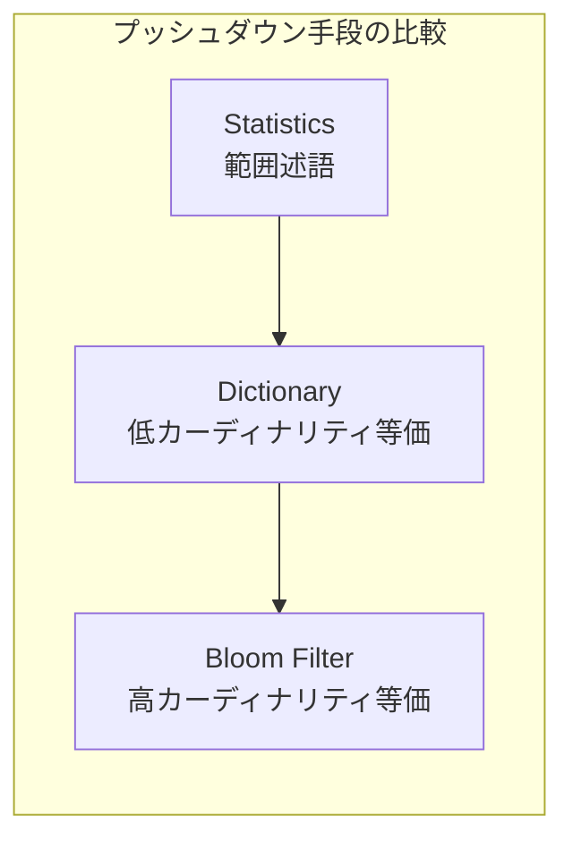
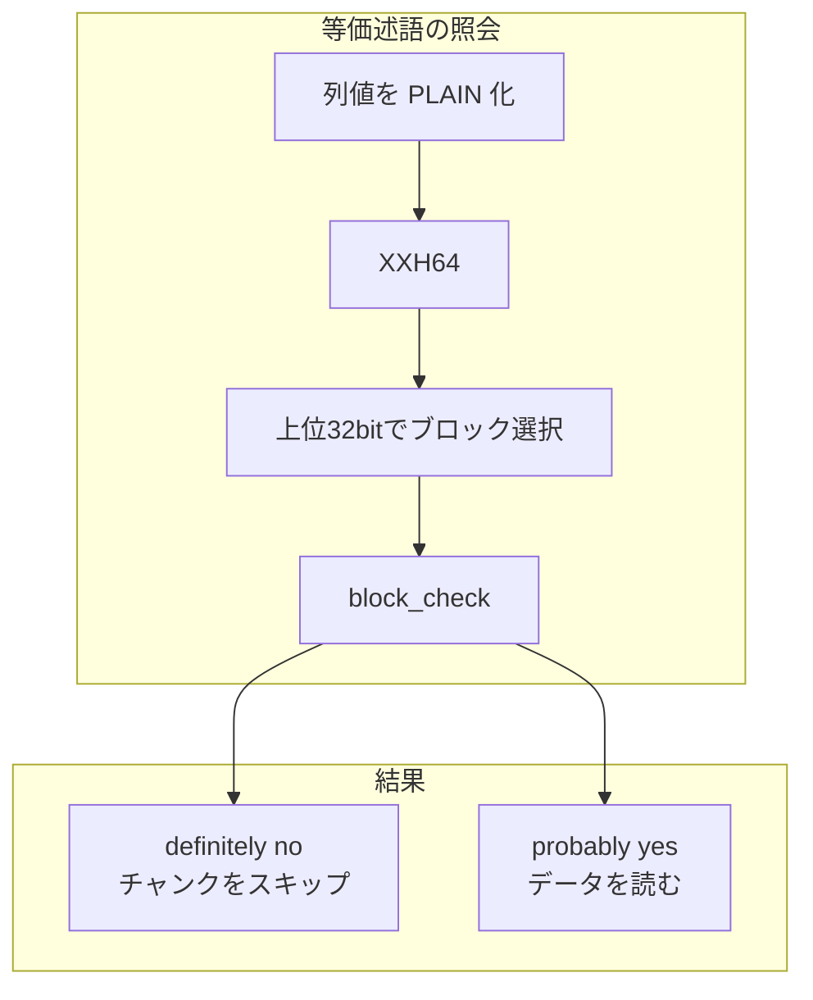

# 第11章 ブルームフィルタ

> **本章で読むソース**
>
> - [`BloomFilter.md`](https://github.com/apache/parquet-format/blob/apache-parquet-format-2.13.0/BloomFilter.md)
> - [`src/main/thrift/parquet.thrift`](https://github.com/apache/parquet-format/blob/apache-parquet-format-2.13.0/src/main/thrift/parquet.thrift)

## この章の狙い

高カーディナリティ列向けの**ブルームフィルタ**（Split Block Bloom Filter、SBBF）を、BloomFilter.md と Thrift 定義に沿って説明する。
辞書や min/max 統計では届かない等価述語のプッシュダウンを、どのデータ構造とファイル配置で実現するかを整理する。

## 前提

第9章で `Statistics` によるロウグループプルーニング、第5章で辞書符号化の適用範囲を読んでいること。
ブルームフィルタは「含まれる可能性あり」と答える確率的構造であり、否定だけが確実である。

## 問題設定：統計と辞書の隙間

BloomFilter.md は述語プッシュダウンの現状と限界を述べる。

[`BloomFilter.md` L22-L29](https://github.com/apache/parquet-format/blob/apache-parquet-format-2.13.0/BloomFilter.md#L22-L29)

```text
### Problem statement
In their current format, column statistics and dictionaries can be used for predicate
pushdown. Statistics include minimum and maximum value, which can be used to filter out
values not in the range. Dictionaries are more specific, and readers can filter out values
that are between min and max but not in the dictionary. However, when there are too many
distinct values, writers sometimes choose not to add dictionaries because of the extra
space they occupy. This leaves columns with large cardinalities and widely separated min
and max without support for predicate pushdown.

```

min/max は範囲が広いと除外力が弱い。
辞書は等価判定に強いが、カーディナリティが高いとサイズが膨らみ writer が付けないことがある。
その隙間をブルームフィルタが埋める。

## 目標

[`BloomFilter.md` L39-L44](https://github.com/apache/parquet-format/blob/apache-parquet-format-2.13.0/BloomFilter.md#L39-L44)

```text
### Goal
* Enable predicate pushdown for high-cardinality columns while using less space than
  dictionaries.

* Induce no additional I/O overhead when executing queries on columns without Bloom
  filters attached or when executing non-selective queries.

```

辞書より小さく等価述語を支え、フィルタのない列や非選択的クエリでは追加 I/O を発生させない。



## Thrift 定義：アルゴリズムとヘッダ

Parquet が規定するのは Split Block 方式である。

[`src/main/thrift/parquet.thrift` L765-L808](https://github.com/apache/parquet-format/blob/apache-parquet-format-2.13.0/src/main/thrift/parquet.thrift#L765-L808)

```thrift
/** Block-based algorithm type annotation. **/
struct SplitBlockAlgorithm {}
/** The algorithm used in Bloom filter. **/
union BloomFilterAlgorithm {
  /** Block-based Bloom filter. **/
  1: SplitBlockAlgorithm BLOCK;
}

/** Hash strategy type annotation. xxHash is an extremely fast non-cryptographic hash
 * algorithm. It uses 64 bits version of xxHash.
 **/
struct XxHash {}

/**
 * The hash function used in Bloom filter. This function takes the hash of a column value
 * using plain encoding.
 **/
union BloomFilterHash {
  /** xxHash Strategy. **/
  1: XxHash XXHASH;
}

/**
 * The compression used in the Bloom filter.
 **/
struct Uncompressed {}
union BloomFilterCompression {
  1: Uncompressed UNCOMPRESSED;
}

/**
  * Bloom filter header is stored at beginning of Bloom filter data of each column
  * and followed by its bitset.
  **/
struct BloomFilterHeader {
  /** The size of bitset in bytes **/
  1: required i32 numBytes;
  /** The algorithm for setting bits. **/
  2: required BloomFilterAlgorithm algorithm;
  /** The hash function used for Bloom filter. **/
  3: required BloomFilterHash hash;
  /** The compression used in the Bloom filter **/
  4: required BloomFilterCompression compression;
}

`BloomFilterHeader` の直後にビットセットが続く。
ハッシュは列値を PLAIN 符号化したバイト列に XXH64（seed 0）を適用する（BloomFilter.md）。

## ファイル内の配置

`ColumnMetaData` はブルームフィルタの位置と長さを記録する。

[`src/main/thrift/parquet.thrift` L932-L941](https://github.com/apache/parquet-format/blob/apache-parquet-format-2.13.0/src/main/thrift/parquet.thrift#L932-L941)

```thrift
  /** Byte offset from beginning of file to Bloom filter data. **/
  14: optional i64 bloom_filter_offset;

  /** Size of Bloom filter data including the serialized header, in bytes.
   * Added in 2.10 so readers may not read this field from old files and
   * it can be obtained after the BloomFilterHeader has been deserialized.
   * Writers should write this field so readers can read the bloom filter
   * in a single I/O.
   */
  15: optional i32 bloom_filter_length;

`bloom_filter_length` はヘッダ込みの全体長であり、1回の I/O で読み切れるようにするためのフィールドである（2.10 追加）。

BloomFilter.md は配置パターンを2通り示す。

[`BloomFilter.md` L268-L270](https://github.com/apache/parquet-format/blob/apache-parquet-format-2.13.0/BloomFilter.md#L268-L270)

```text
Each multi-block Bloom filter is required to work for only one column chunk. The data of a multi-block
Bloom filter consists of the Bloom filter header followed by the Bloom filter bitset. The Bloom filter
header encodes the size of the Bloom filter bitset in bytes that is used to read the bitset.

```

1カラムチャンクに1フィルタである。
ロウグループ単位で列順に並べ、全ロウグループの後またはロウグループ間に置ける。

### 設計上の工夫：bloom_filter_length による単発 I/O

ページインデックスと同様、述語が付いた列だけ `bloom_filter_offset` へ seek し、`bloom_filter_length` バイトを一括読みする。
データページ列を触る前に「この値は絶対に無い」と判定できれば、カラムチャンク全体をスキップできる。

## ブロック：256ビットの分割ブルーム

SBBF の基本単位は256ビットのブロックである。

[`BloomFilter.md` L52-L67](https://github.com/apache/parquet-format/blob/apache-parquet-format-2.13.0/BloomFilter.md#L52-L67)

```text
First we will describe a "block". This is the main component split
block Bloom filters are composed of.

Each block is 256 bits, broken up into eight contiguous "words", each
consisting of 32 bits. Each word is thought of as an array of bits;
each bit is either "set" or "not set".

When initialized, a block is "empty", which means each of the eight
component words has no bits set. In addition to initialization, a
block supports two other operations: `block_insert` and
`block_check`. Both take a single unsigned 32-bit integer as input;
`block_insert` returns no value, but modifies the block, while
`block_check` returns a boolean. The semantics of `block_check` are
that it must return `true` if `block_insert` was previously called on
the block with the same argument, and otherwise it returns `false`
with high probability. For more details of the probability, see below.

```

8語×32ビットの分割ブルームであり、キャッシュ効率を意識した構造である（BloomFilter.md は Putze らの論文を引用）。

`mask` 操作は salt 配列と乗算とシフトで各語に1ビットを立てる。

[`BloomFilter.md` L76-L88](https://github.com/apache/parquet-format/blob/apache-parquet-format-2.13.0/BloomFilter.md#L76-L88)

```text
unsigned int32 salt[8] = {0x47b6137bU, 0x44974d91U, 0x8824ad5bU,
                          0xa2b7289dU, 0x705495c7U, 0x2df1424bU,
                          0x9efc4947U, 0x5c6bfb31U}

block mask(unsigned int32 x) {
  block result
  for i in [0..7] {
    unsigned int32 y = x * salt[i]
    result.getWord(i).setBit(y >> 27)
  }
  return result
}

```

`block_insert` は `mask(x)` で立つビットをブロックに OR する。
`block_check` は `mask(x)` の全ビットがブロックに立っていれば真を返す。

## SBBF：複数ブロックと64ビットハッシュ

フィルタ全体は `z` 個のブロック（1 ≤ z < 2^31）からなる。

[`BloomFilter.md` L148-L170](https://github.com/apache/parquet-format/blob/apache-parquet-format-2.13.0/BloomFilter.md#L148-L170)

```text
Now that a block is defined, we can describe Parquet's split block
Bloom filters. A split block Bloom filter (henceforth "SBBF") is
composed of `z` blocks, where `z` is greater than or equal to one and
less than 2 to the 31st power. When an SBBF is initialized, each block
in it is initialized, which means each bit in each word in each block
in the SBBF is unset.

In addition to initialization, an SBBF supports an operation called
`filter_insert` and one called `filter_check`. Each takes as an
argument a 64-bit unsigned integer; `filter_check` returns a boolean
and `filter_insert` does not return a value, but does modify the SBBF.

The `filter_insert` operation first uses the most significant 32 bits
of its argument to select a block to operate on. Call the argument
"`h`", and recall the use of "`z`" to mean the number of blocks. Then
a block number `i` between `0` and `z-1` (inclusive) to operate on is
chosen as follows:

unsigned int64 h_top_bits = h >> 32;
unsigned int64 z_as_64_bit = z;
unsigned int32 i = (h_top_bits * z_as_64_bit) >> 32;

```

上位32ビットでブロック番号を選び、下位32ビットを `block_insert` に渡す。
ブロック選択は modulo ではなく64ビット積の上位32ビット抽出であり、除算より速い（BloomFilter.md L186-L191）。

[`BloomFilter.md` L206-L219](https://github.com/apache/parquet-format/blob/apache-parquet-format-2.13.0/BloomFilter.md#L206-L219)

```text
void filter_insert(SBBF filter, unsigned int64 x) {
  unsigned int64 i = ((x >> 32) * filter.numberOfBlocks()) >> 32;
  block b = filter.getBlock(i);
  block_insert(b, (unsigned int32)x)
}

boolean filter_check(SBBF filter, unsigned int64 x) {
  unsigned int64 i = ((x >> 32) * filter.numberOfBlocks()) >> 32;
  block b = filter.getBlock(i);
  return block_check(b, (unsigned int32)x)
}

```

### 設計上の工夫：分割ブロックと高速ハッシュ

通常のブルームフィルタは1つの大きなビット配列へのランダムアクセスがキャッシュミスを起こしやすい。
256ビットブロックに分割し、1回の照会で触るメモリを局所化する。
xxHash による64ビットハッシュは非暗号用途で高速であり、列値の PLAIN バイト列から一貫した `filter_check` 入力を作る。



## サイジングと誤検知率

BloomFilter.md はビット数と insert 数の比率と誤検知率の関係を例示する。

[`BloomFilter.md` L242-L253](https://github.com/apache/parquet-format/blob/apache-parquet-format-2.13.0/BloomFilter.md#L242-L253)

```text
A filter that uses 1024 blocks and has had 26,214 hash values
`insert`ed will have a false positive probability of around 1.26%. Each
of those 1024 blocks occupies 256 bits of space, so the total space
usage is 262,144. That means that the ratio of bits of space to hash
values is 10-to-1. Adding more hash values increases the denominator
and lowers the ratio, which increases the false positive
probability. For instance, inserting twice as many hash values
(52,428) decreases the ratio of bits of space per hash value inserted
to 5-to-1 and increases the false positive probability to
18%. Inserting half as many hash values (13,107) increases the ratio
of bits of space per hash value inserted to 20-to-1 and decreases the
false positive probability to 0.04%.

```

誤検知（false positive）はあるが、偽陰性（false negative）はない。
`filter_check` が偽なら値は確実に存在しない。
真なら存在する可能性があり、データを読んで確認する。

目標誤検知率に対するビット/insert 比の目安表も BloomFilter.md にある（L258-L264）。

## 他のプッシュダウン手段との使い分け

| 手段 | 得意な述語 | 除外の確実性 |
|------|-----------|-------------|
| Statistics min/max | 範囲比較 | 境界外は確実に除外 |
| Dictionary | 等価、IN リスト | 辞書外は確実に除外 |
| Bloom filter | 等価（高カーディナリティ） | 非含有は確実、含有は要確認 |
| ColumnIndex | ページ単位の範囲 | ページ境界外は確実に除外 |

ブルームフィルタはロウグループ内のカラムチャンク単位である。
ページ単位の細かさは ColumnIndex が担う（第10章）。

## 暗号化との関係

BloomFilter.md の Encryption 節は、フィルタが値の存在を漏らしうるため、機密列では列鍵で暗号化すべきだと述べる。
ヘッダとビットセットは別モジュールとして暗号化される。
詳細は第12章で扱う。

## まとめ

ブルームフィルタは高カーディナリティ列の等価述語プッシュダウンを、辞書より小さな空間で補う。
SBBF は256ビットブロックの配列と xxHash 64ビット入力で構成される。
`BloomFilterHeader` と `bloom_filter_offset`/`bloom_filter_length` が、ヘッダとビットセットの読み取りを規定する。
照会結果が偽ならカラムチャンクを安全にスキップでき、真のときだけデータページへ進む。

## 関連する章

- [第9章 統計と列順序](09-statistics.md)
- [第10章 ページインデックス](10-page-index.md)
- [第5章 基本エンコーディング](../part02-encoding/05-basic-encodings.md)
- [第2章 ファイル構造とメタデータ階層](../part00-overview/02-file-structure.md)
