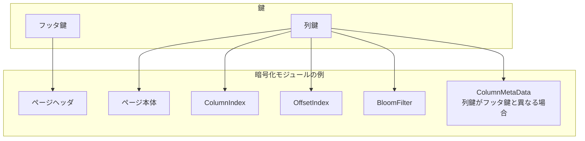
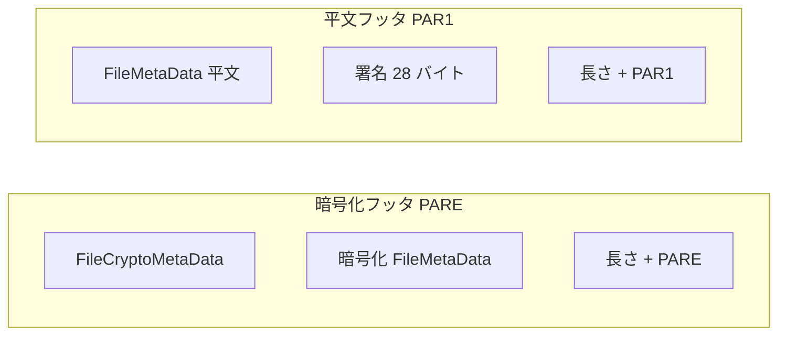

# 第12章 モジュラー暗号化

> **本章で読むソース**
>
> - [`Encryption.md`](https://github.com/apache/parquet-format/blob/apache-parquet-format-2.13.0/Encryption.md)
> - [`src/main/thrift/parquet.thrift`](https://github.com/apache/parquet-format/blob/apache-parquet-format-2.13.0/src/main/thrift/parquet.thrift)

## この章の狙い

Parquet の**モジュラー暗号化**が、列指向の選択的読み取り（列プルーニング、プレディケートプッシュダウン）を維持したまま機密データを保護する仕組みを説明する。
モジュール単位の暗号化、2種類の AES アルゴリズム、フッタ暗号化モードと平文フッタモードの差を、Encryption.md と Thrift 定義に沿って整理する。

## 前提

第2章で `FileMetaData` と `ColumnChunk` の構造、第7章でページとヘッダ、第8章で圧縮、第9章から第11章で統計とインデックスの配置を読んでいること。
暗号化は圧縮の後段で各モジュールに適用される（第8章）。

## 問題設定と目標

Encryption.md は、ファイル全体のフラット暗号化では列単位の読み取りが効かなくなる問題を挙げる。

[`Encryption.md` L27-L31](https://github.com/apache/parquet-format/blob/apache-parquet-format-2.13.0/Encryption.md#L27-L31)

```text
## 1 Problem Statement
Existing data protection solutions (such as flat encryption of files, in-storage encryption, 
or use of an encrypting storage client) can be applied to Parquet files, but have various 
security or performance issues. An encryption mechanism, integrated in the Parquet format, 
allows for an optimal combination of data security, processing speed and encryption granularity.
```

目標は次のとおりである。

[`Encryption.md` L33-L51](https://github.com/apache/parquet-format/blob/apache-parquet-format-2.13.0/Encryption.md#L33-L51)

```text
## 2 Goals
1. Protect Parquet data and metadata by encryption, while enabling selective reads 
(columnar projection, predicate push-down).
2. Implement "client-side" encryption/decryption (storage client). The storage server 
must not see plaintext data, metadata or encryption keys.
3. Leverage authenticated encryption that allows clients to check integrity of the retrieved 
data - making sure the file (or file parts) have not been replaced with a wrong version, or 
tampered with otherwise.
4. Enable different encryption keys for different columns and for the footer.
5. Allow for partial encryption - encrypt only column(s) with sensitive data.
6. Work with all compression and encoding mechanisms supported in Parquet.
7. Support multiple encryption algorithms, to account for different security and performance 
requirements.
8. Enable two modes for metadata protection -
   * full protection of file metadata
   * partial protection of file metadata that allows legacy readers to access unencrypted 
columns in an encrypted file.
9.	Minimize overhead of encryption - in terms of size of encrypted files, and throughput 
of write/read operations.
```

列単位の部分暗号化、クライアント側復号、認証付き暗号、鍵の分離が設計の柱である。

## モジュール：暗号化の単位

Encryption.md は、Parquet ファイルを個別に直列化される**モジュール**の集まりと定義する。

[`Encryption.md` L54-L86](https://github.com/apache/parquet-format/blob/apache-parquet-format-2.13.0/Encryption.md#L54-L86)

```text
## 3 Technical Approach
Parquet files are comprised of separately serialized components: pages, page headers, column 
indexes, offset indexes, bloom filter headers and bitsets, the footer. Parquet encryption 
mechanism denotes them as “modules” 
and encrypts each module separately – making it possible to fetch and decrypt the footer, 
find the offset of required pages, fetch the pages and decrypt the data. In this document, 
the term “footer” always refers to the regular Parquet footer - the `FileMetaData` structure, 
and its nested fields (row groups / column chunks). 

File encryption is flexible - each column and the footer can be encrypted with the same key, 
with a different key, or not encrypted at all.

The results of compression of column pages are encrypted before being written to the output 
stream. A new Thrift structure, with column crypto metadata, is added to column chunks of 
the encrypted columns. This metadata provides information about the column encryption keys.

The results of serialization of Thrift structures are encrypted, before being written 
to the output stream. 

The file footer can be either encrypted or left as a plaintext. In an encrypted footer mode, 
a new Thrift structure with file crypto metadata is added to the file. This metadata provides 
information about the file encryption algorithm and the footer encryption key. 

In a plaintext footer mode, the contents of the footer structure is visible and signed 
in order to verify its integrity. New footer fields keep an
information about the file encryption algorithm and the footer signing key.

For encrypted columns, the following modules are always encrypted, with the same column key: 
pages and page headers (both dictionary and data), column indexes, offset indexes, bloom filter 
headers and bitsets.  If the 
column key is different from the footer encryption key, the column metadata is serialized 
separately and encrypted with the column key. In this case, the column metadata is also 
considered to be a module.  
```

圧縮後のページ本体、Thrift 直列化結果、インデックス、ブルームフィルタがそれぞれ独立モジュールとして暗号化される。
フッタ鍵と列鍵が異なるとき、`ColumnMetaData` 自体も別モジュールになる。



### 設計上の工夫：モジュール単位暗号化による選択的復号

ファイル全体を1ストリームで暗号化すると、1列だけ読むにも全体を復号しなければならない。
モジュール単位暗号化は、フッタを復号してオフセットを得たあと、必要ページだけを復号する経路を残す。
列プルーニングとプレディケートプッシュダウンの前提が暗号化後も維持される。

## EncryptionAlgorithm：2種類の AES 方式

Thrift の `EncryptionAlgorithm` は `AES_GCM_V1` と `AES_GCM_CTR_V1` を提供する。

[`src/main/thrift/parquet.thrift` L1333-L1360](https://github.com/apache/parquet-format/blob/apache-parquet-format-2.13.0/src/main/thrift/parquet.thrift#L1333-L1360)

```thrift
struct AesGcmV1 {
  /** AAD prefix **/
  1: optional binary aad_prefix

  /** Unique file identifier part of AAD suffix **/
  2: optional binary aad_file_unique

  /** In files encrypted with AAD prefix without storing it,
   * readers must supply the prefix **/
  3: optional bool supply_aad_prefix
}

struct AesGcmCtrV1 {
  /** AAD prefix **/
  1: optional binary aad_prefix

  /** Unique file identifier part of AAD suffix **/
  2: optional binary aad_file_unique

  /** In files encrypted with AAD prefix without storing it,
   * readers must supply the prefix **/
  3: optional bool supply_aad_prefix
}

union EncryptionAlgorithm {
  1: AesGcmV1 AES_GCM_V1
  2: AesGcmCtrV1 AES_GCM_CTR_V1
}
```

`AES_GCM_V1` は全モジュールを AES-GCM で暗号化する。
GCM は認証付き暗号であり、16バイトの認証タグで改ざん検出ができる。

[`Encryption.md` L100-L108](https://github.com/apache/parquet-format/blob/apache-parquet-format-2.13.0/Encryption.md#L100-L108)

```text
#### 4.1.1 AES GCM
AES GCM is an authenticated encryption. Besides the data confidentiality (encryption), it 
supports two levels of integrity verification (authentication): of the data (default), 
and of the data combined with an optional AAD (“additional authenticated data”). The 
authentication makes it possible to verify that the data has not been tampered with. An AAD
is a free text to be authenticated, together with the data. The user can, for example, pass the 
file name with its version (or creation timestamp) as an AAD input, to verify that the 
file has not been replaced with an older version. The details on how Parquet creates 
and uses AADs are provided in the section 4.4.
```

`AES_GCM_CTR_V1` はページ以外を GCM、ページ本体を CTR で暗号化する。

[`Encryption.md` L164-L175](https://github.com/apache/parquet-format/blob/apache-parquet-format-2.13.0/Encryption.md#L164-L175)

```text
#### 4.2.2 AES_GCM_CTR_V1

In this Parquet algorithm, all modules except pages are encrypted with the GCM cipher, as described 
above. The pages are encrypted by the CTR cipher without padding. This makes it possible to encrypt/decrypt
the bulk of the data faster, while still verifying the metadata integrity and making 
sure the file has not been replaced with a wrong version. However, tampering with the 
page data might go unnoticed. The AES CTR cipher
must be implemented by a cryptographic provider according to the NIST SP 800-38A specification. 

In Parquet, an input to the CTR cipher is an encryption key, a 16-byte IV and a plaintext. IVs are comprised of 
a 12-byte nonce and a 4-byte initial counter field. The first 31 bits of the initial counter field are set 
to 0, the last bit is set to 1. The output is a ciphertext with the length equal to that of plaintext.
```

### 設計上の工夫：ページだけ CTR に切り替える

データ量の大半はページ本体である。
メタデータとヘッダを GCM で保護しつつ、ページを CTR にすれば、帯域の大部分で認証タグ計算を省略できる。
ページ改ざんの検出は弱まるが、AAD によるモジュール入れ替え防止とメタデータの GCM 認証は残る。

## 暗号化バッファの直列化形式

GCM モジュールの出力形式は次のとおりである。

[`Encryption.md` L292-L299](https://github.com/apache/parquet-format/blob/apache-parquet-format-2.13.0/Encryption.md#L292-L299)

```text
### 5.1 Encrypted module serialization
All modules, except column pages, are encrypted with the GCM cipher. In the AES_GCM_V1 algorithm, 
the column pages are also encrypted with AES GCM. For each module, the GCM encryption 
buffer is comprised of a nonce, ciphertext and tag, described in the Algorithms section. The length of 
the encryption buffer (a 4-byte little endian) is written to the output stream, followed by the buffer itself.

|length (4 bytes) | nonce (12 bytes) | ciphertext (length-28 bytes) | tag (16 bytes) |
|-----------------|------------------|------------------------------|----------------|
```

CTR ページの形式はタグがない。

[`Encryption.md` L302-L308](https://github.com/apache/parquet-format/blob/apache-parquet-format-2.13.0/Encryption.md#L302-L308)

```text
In the AES_GCM_CTR_V1 algorithm, the column pages are encrypted with AES CTR.
For each page, the CTR encryption buffer is comprised of a nonce and ciphertext, 
described in the Algorithms section. The length of the encryption buffer 
(a 4-byte little endian) is written to the output stream, followed by the buffer itself.

|length (4 bytes) | nonce (12 bytes) | ciphertext (length-12 bytes) |
|-----------------|------------------|------------------------------|
```

各モジュール先頭に4バイトのリトルエンディアン長が付き、続けて nonce と暗号文（と GCM タグ）が並ぶ。

## ColumnCryptoMetaData：列の暗号化メタデータ

暗号化された列の `ColumnChunk` には `crypto_metadata` が設定される。

[`src/main/thrift/parquet.thrift` L955-L969](https://github.com/apache/parquet-format/blob/apache-parquet-format-2.13.0/src/main/thrift/parquet.thrift#L955-L969)

```thrift
struct EncryptionWithFooterKey {
}

struct EncryptionWithColumnKey {
  /** Column path in schema **/
  1: required list<string> path_in_schema

  /** Retrieval metadata of column encryption key **/
  2: optional binary key_metadata
}

union ColumnCryptoMetaData {
  1: EncryptionWithFooterKey ENCRYPTION_WITH_FOOTER_KEY
  2: EncryptionWithColumnKey ENCRYPTION_WITH_COLUMN_KEY
}
```

`ENCRYPTION_WITH_FOOTER_KEY` はフッタと同じ鍵で列を暗号化したことを示す。
`ENCRYPTION_WITH_COLUMN_KEY` は列専用鍵を使い、`key_metadata` で鍵の取得方法を運ぶ。

[`src/main/thrift/parquet.thrift` L1022-L1026](https://github.com/apache/parquet-format/blob/apache-parquet-format-2.13.0/src/main/thrift/parquet.thrift#L1022-L1026)

```thrift
  /** Crypto metadata of encrypted columns **/
  8: optional ColumnCryptoMetaData crypto_metadata

  /** Encrypted column metadata for this chunk **/
  9: optional binary encrypted_column_metadata
```

列鍵がフッタ鍵と異なるとき、`ColumnMetaData` は `encrypted_column_metadata` に暗号化されて格納される。
平文の `meta_data` フィールドは設定されない。

## key_metadata：鍵管理の拡張点

Encryption.md は `key_metadata` を任意のバイト列として定義し、KMS 連携の拡張点とする。

[`Encryption.md` L177-L205](https://github.com/apache/parquet-format/blob/apache-parquet-format-2.13.0/Encryption.md#L177-L205)

```text
### 4.3 Key metadata
A wide variety of services and tools for management of encryption keys exist in the 
industry today. Public clouds offer different key management services (KMS), and 
organizational IT systems either build proprietary key managers in-house or adopt open source 
tools for on-premises deployment. Besides the diversity of management tools, there are many 
ways to generate and handle the keys themselves (generate Data keys inside KMS – or locally 
upon data encryption; use Data keys only, or use Master keys to encrypt the Data keys; 
store the encrypted key material inside the data file, or at a separate location; etc). There 
is also a large variety of authorization and certification methods, required to control the 
access to encryption keys.

Parquet is not limited to a single KMS, key generation/wrapping method, or authorization service. 
Instead, Parquet provides a developer with a simple interface that can be utilized for implementation 
of any key management scheme. For each column or footer key, a file writer can generate and pass an 
arbitrary `key_metadata` byte array that will be stored in the file. This field is made available to 
file readers to enable recovery of the key. For example, the key_metadata 
can keep a serialized

   * String ID of a Data key. This enables direct retrieval of the Data key from a KMS.
   * Encrypted Data key, and string ID of a Master key. The Data key is generated randomly and 
   encrypted with a Master key either remotely in a KMS, or locally after retrieving the Master key from a KMS.
   Master key rotation requires modification of the data file footer.
   * Short ID (counter) of a Data key inside the Parquet data file. The Data key is encrypted with a 
   Master key using one of the options described above – but the resulting key material is stored 
   separately, outside the data file, and will be retrieved using the counter and file path.
   Master key rotation doesn't require modification of the data file.
   
Key metadata can also be empty - in a case the encryption keys are fully managed by the caller 
code, and passed explicitly to Parquet readers for the file footer and each encrypted column.
```

仕様は鍵の生成と保管方式を固定せず、reader が鍵を復元するための不透明なバイト列として渡す。

## AAD：モジュール入れ替えの防止

GCM だけでは、同一鍵で暗号化された別の暗号文への差し替えを防げない。
Parquet は AAD（Additional Authenticated Data）でモジュールとファイルの同一性を縛る。

[`Encryption.md` L207-L222](https://github.com/apache/parquet-format/blob/apache-parquet-format-2.13.0/Encryption.md#L207-L222)

```text
### 4.4 Additional Authenticated Data
The AES GCM cipher protects against byte replacement inside a ciphertext - but, without an AAD, 
it can't prevent replacement of one ciphertext with another (encrypted with the same key). 
Parquet modular encryption leverages AADs to protect against swapping ciphertext modules (encrypted 
with AES GCM) inside a file or between files. Parquet can also protect against swapping full 
files - for example, replacement of a file with an old version, or replacement of one table 
partition with another. AADs are built to reflect the identity of a file and of the modules 
inside the file. 

Parquet constructs a module AAD from two components: an optional AAD prefix - a string provided 
by the user for the file, and an AAD suffix, built internally for each GCM-encrypted module 
inside the file. The AAD prefix should reflect the target identity that helps to detect file 
swapping (a simple example - table name with a date and partition, e.g. "employees_23May2018.part0"). 
The AAD suffix reflects the internal identity of modules inside the file, which for example 
prevents replacement of column pages in row group 0 by pages from the same column in row 
group 1. The module AAD is a direct concatenation of the prefix and suffix parts. 
```

AAD suffix は内部ファイル ID、モジュール種別、ロウグループ序数、列序数、ページ序数（該当時）を連結する。

[`Encryption.md` L254-L272](https://github.com/apache/parquet-format/blob/apache-parquet-format-2.13.0/Encryption.md#L254-L272)

```text
Unlike AAD prefix, a suffix is built internally by Parquet, by direct concatenation of the following parts: 
1.	[All modules] internal file identifier - a random byte array generated for each file (implementation-defined length)
2.	[All modules] module type (1 byte)
3.	[All modules except footer] row group ordinal (2-byte short, little-endian)
4.	[All modules except footer] column ordinal (2-byte short, little-endian)
5.	[Data page and header only] page ordinal (2-byte short, little-endian)

The following module types are defined:  

   * Footer (0)
   * ColumnMetaData (1)
   * Data Page (2)
   * Dictionary Page (3)
   * Data Page Header (4)
   * Dictionary Page Header (5)
   * ColumnIndex (6)
   * OffsetIndex (7)
   * BloomFilter Header (8)
   * BloomFilter Bitset (9)
```

## フッタ暗号化モードと平文フッタモード

### 暗号化フッタ（PARE）

機密列を含むファイルではフッタも暗号化するのが推奨される。

[`Encryption.md` L425-L445](https://github.com/apache/parquet-format/blob/apache-parquet-format-2.13.0/Encryption.md#L425-L445)

```text
### 5.4 Encrypted footer mode
In files with sensitive column data, a good security practice is to encrypt not only the 
secret columns, but also the file footer metadata. This hides the file schema, 
number of rows, key-value properties, column sort order, names of the encrypted columns 
and metadata of the column encryption keys. 

The columns encrypted with the same key as the footer must leave the column metadata at the original 
location, `optional ColumnMetaData meta_data` in the `ColumnChunk` structure. 
This field is not set for columns encrypted with a column-specific key - instead, the `ColumnMetaData`
is Thrift-serialized, encrypted with the column key and written to the `encrypted_column_metadata` 
field in the `ColumnChunk` structure, as described in the section 5.3.

A Thrift-serialized `FileCryptoMetaData` structure is written before the encrypted footer. 
It contains information on the file encryption algorithm and on the footer key metadata. Then 
the combined length of this structure and of the encrypted footer is written as a 4-byte 
little endian integer, followed by a final magic string, "PARE". The same magic bytes are 
written at the beginning of the file (offset 0). Parquet readers start file parsing by 
reading and checking the magic string. Therefore, the encrypted footer mode uses a new 
magic string ("PARE") in order to instruct readers to look for a file crypto metadata 
before the footer - and also to immediately inform legacy readers (expecting "PAR1" 
bytes) that they can’t parse this file.
```

[`src/main/thrift/parquet.thrift` L1431-L1443](https://github.com/apache/parquet-format/blob/apache-parquet-format-2.13.0/src/main/thrift/parquet.thrift#L1431-L1443)

```thrift
/** Crypto metadata for files with encrypted footer **/
struct FileCryptoMetaData {
  /**
   * Encryption algorithm. This field is only used for files
   * with encrypted footer. Files with plaintext footer store algorithm id
   * inside footer (FileMetaData structure).
   */
  1: required EncryptionAlgorithm encryption_algorithm

  /** Retrieval metadata of key used for encryption of footer,
   *  and (possibly) columns **/
  2: optional binary key_metadata
}
```

マジックは `PARE` となり、レガシー reader は即座に解析不能と判断できる。

### 平文フッタ（PAR1）

移行期には平文フッタモードが使える。

[`Encryption.md` L466-L479](https://github.com/apache/parquet-format/blob/apache-parquet-format-2.13.0/Encryption.md#L466-L479)

```text
### 5.5 Plaintext footer mode
This mode allows legacy Parquet versions (released before the encryption support) to access 
unencrypted columns in encrypted files - at a price of leaving certain metadata fields 
unprotected in these files. 

The plaintext footer mode can be useful during a transitional period in organizations where 
some frameworks can't be upgraded to a new Parquet library for a while. Data writers will 
upgrade and run with a new Parquet version, producing encrypted files in this mode. Data 
readers working with sensitive data will also upgrade to a new Parquet library. But other 
readers that don't need the sensitive columns, can continue working with an older Parquet 
version. They will be able to access plaintext columns in encrypted files. A legacy reader, 
trying to access a sensitive column data in an encrypted file with a plaintext footer, will 
get an exception. More specifically, a Thrift parsing exception on an encrypted page header 
structure. Again, using legacy Parquet readers for encrypted files is a temporary solution.
```

平文フッタは GCM で署名され、nonce と tag の28バイトだけがファイルに残る。

[`Encryption.md` L490-L499](https://github.com/apache/parquet-format/blob/apache-parquet-format-2.13.0/Encryption.md#L490-L499)

```text
The plaintext footer is signed in order to prevent tampering with the 
`FileMetaData` contents. The footer signing is done by encrypting the serialized `FileMetaData` 
structure with the 
AES GCM algorithm - using a footer signing key, and an AAD constructed according to the instructions 
of the section 4.4. Only the nonce and GCM tag are stored in the file – as a 28-byte 
fixed-length array, written right after the footer itself. The ciphertext is not stored, 
because it is not required for footer integrity verification by readers.

| nonce (12 bytes) |  tag (16 bytes) |
|------------------|-----------------|
```

[`src/main/thrift/parquet.thrift` L1417-L1428](https://github.com/apache/parquet-format/blob/apache-parquet-format-2.13.0/src/main/thrift/parquet.thrift#L1417-L1428)

```thrift
  /**
   * Encryption algorithm. This field is set only in encrypted files
   * with plaintext footer. Files with encrypted footer store algorithm id
   * in FileCryptoMetaData structure.
   */
  8: optional EncryptionAlgorithm encryption_algorithm

  /**
   * Retrieval metadata of key used for signing the footer.
   * Used only in encrypted files with plaintext footer.
   */
  9: optional binary footer_signing_key_metadata
```



## 鍵の呼び出し回数制限

NIST SP 800-38D は GCM の同一鍵あたりの呼び出し上限を 2^32 とする。

[`Encryption.md` L130-L142](https://github.com/apache/parquet-format/blob/apache-parquet-format-2.13.0/Encryption.md#L130-L142)

```text
#### 4.1.4 Invocation limit
According to the section 8.3 of the NIST SP 800-38D document, *"The total number of invocations 
of the authenticated encryption function shall not exceed 2^32, including all IV lengths and 
all instances of the authenticated encryption function with the given key"*. This restriction is
related to the "uniqueness requirement of IVs and keys" (section 8 in the NIST spec) - *"if even 
one IV is ever repeated, then the implementation may be vulnerable"*. *"Compliance with this 
requirement is crucial to the security of GCM"*.

The bulk of modules in a Parquet file are page headers and data pages. Therefore, one encryption 
key shall not be used for more than 2^32 total module encryptions, as per the NIST specification.
Since each data page requires two module encryptions (header + data), this means in practice no
more than 2^31 pages per key. In Parquet files encrypted with multiple keys (footer and column
keys), the constraint on the number of invocations is applied to each key separately.
```

1ページはヘッダとデータの2モジュールであるため、実質 2^31 ページ/鍵が上限の目安になる。

## 暗号化オーバーヘッド

Encryption.md はサイズオーバーヘッドが小さいと述べる。

[`Encryption.md` L532-L538](https://github.com/apache/parquet-format/blob/apache-parquet-format-2.13.0/Encryption.md#L532-L538)

```text
## 6. Encryption Overhead
The size overhead of Parquet modular encryption is negligible, since most of the encryption 
operations are performed on pages (the minimal unit of Parquet data storage and compression). 
The overhead order of magnitude is adding 1 byte per each ~30,000 bytes of original 
data - calculated by comparing the page encryption overhead (nonce + tag + length = 32 bytes) 
to the default page size (1 MB). This is a rough estimation, and can change with the encryption
algorithm (no 16-byte tag in AES_GCM_CTR_V1) and with page configuration or data encoding/compression.
```

ページ単位であることが、オーバーヘッドをデータ量に対して微小に抑える要因である。

## まとめ

モジュラー暗号化はページ、ヘッダ、インデックス、ブルームフィルタ、メタデータを独立モジュールとして暗号化し、選択的読み取りを維持する。
`AES_GCM_V1` は全モジュールを認証付き GCM で保護し、`AES_GCM_CTR_V1` はページ本体を CTR で高速化する。
`ColumnCryptoMetaData` と `encrypted_column_metadata` が列鍵の運用を規定する。
暗号化フッタ（`PARE`）はスキーマごと隠蔽し、平文フッタ（`PAR1`）は移行期の互換と署名で整合性を守る。

## 関連する章

- [第2章 ファイル構造とメタデータ階層](../part00-overview/02-file-structure.md)
- [第7章 データページとページヘッダ](../part03-page/07-data-pages.md)
- [第8章 圧縮コーデック](../part03-page/08-compression.md)
- [第11章 ブルームフィルタ](../part04-index/11-bloom-filter.md)
