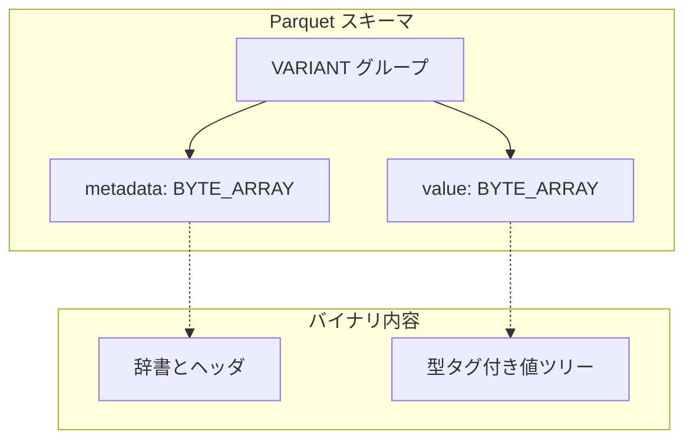
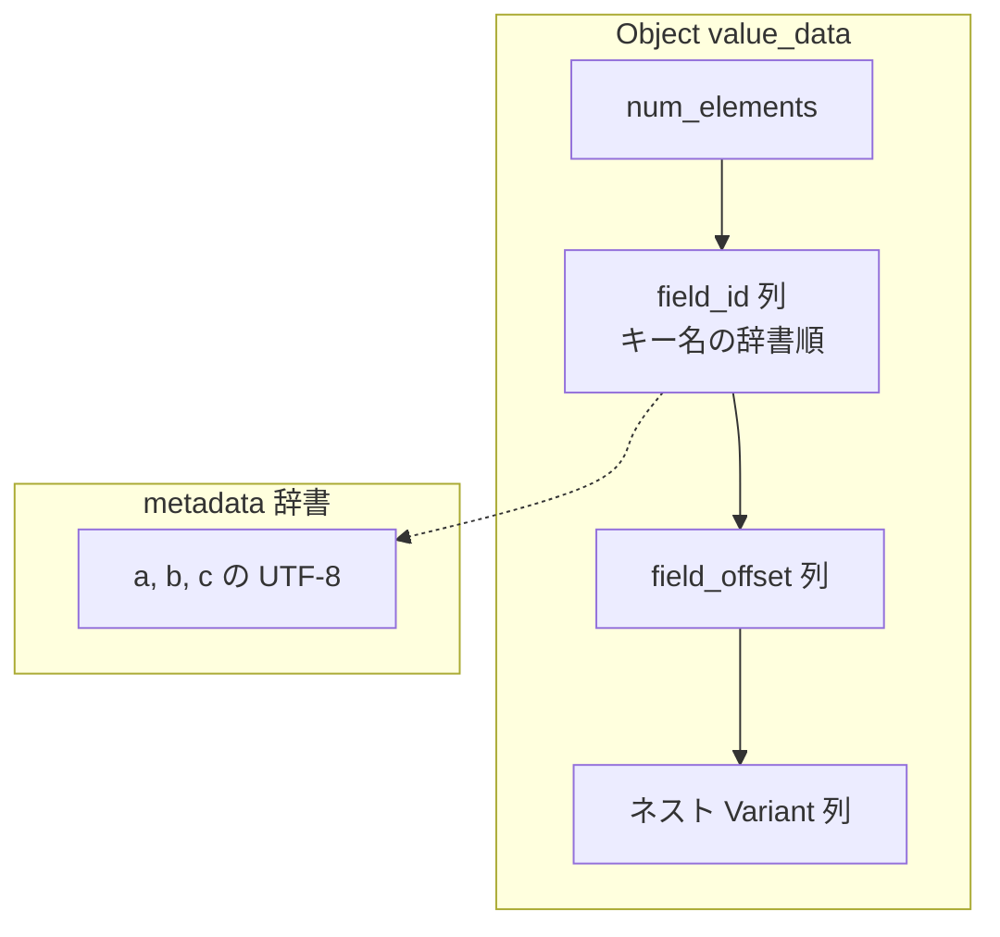

# 第13章 Variant バイナリエンコーディング

> **本章で読むソース**
>
> - [`VariantEncoding.md`](https://github.com/apache/parquet-format/blob/apache-parquet-format-2.13.0/VariantEncoding.md)
> - [`src/main/thrift/parquet.thrift`](https://github.com/apache/parquet-format/blob/apache-parquet-format-2.13.0/src/main/thrift/parquet.thrift)

## この章の狙い

半構造化データ（JSON 相当）を Parquet に載せる **Variant** 型のバイナリ表現を、VariantEncoding.md と Thrift の `VariantType` に沿って説明する。
`metadata` と `value` の二分割、オブジェクトのフィールド ID 辞書、ネスト値の自己完結性を押さえ、パス指定での効率的なアクセスが可能な理由を整理する。

## 前提

第3章で `LogicalType` と `SchemaElement`、第4章でネスト構造のレベル符号化を読んでいること。
Variant の一部フィールドを別列に抽出する**シュレッディング**は第14章で扱う。

## Variant とは何を表すか

VariantEncoding.md は Variant が持ちうる3形態を定義する。

[`VariantEncoding.md` L22-L27](https://github.com/apache/parquet-format/blob/apache-parquet-format-2.13.0/VariantEncoding.md#L22-L27)

```text
A Variant represents a type that contains one of:
- Primitive: A type and corresponding value (e.g. INT, STRING)
- Array: An ordered list of Variant values
- Object: An unordered collection of string/Variant pairs (i.e. key/value pairs). An object may not contain duplicate keys.

A Variant is encoded with 2 binary values, the [value](#value-encoding) and the [metadata](#metadata-encoding).

```

すべての Variant は **value**（値本体）と **metadata**（文字列辞書など）の2つのバイナリ列で表現される。
metadata を共有すれば、ネストした内部 value だけを切り出しても独立した Variant として解釈できる。

[`VariantEncoding.md` L32-L36](https://github.com/apache/parquet-format/blob/apache-parquet-format-2.13.0/VariantEncoding.md#L32-L36)

```text
The Variant Binary Encoding allows representation of semi-structured data (e.g. JSON) in a form that can be efficiently queried by path.
The design is intended to allow efficient access to nested data even in the presence of very wide or deep structures.

Another motivation for the representation is that (aside from metadata) each nested Variant value is contiguous and self-contained.
For example, in a Variant containing an Array of Variant values, the representation of an inner Variant value, when paired with the metadata of the full variant, is itself a valid Variant.

```

### 設計上の工夫：value と metadata の分離

JSON を1本の文字列として BYTE_ARRAY に入れると、フィールド1つ読むにも全体をパースしなければならない。
Variant は metadata にキー辞書を集約し、value 内ではフィールド ID とオフセットだけを並べる。
深いネストでも、目的のサブツリーに対応する value バイト列だけを切り出して解釈できる。

## Parquet スキーマ上の Variant 列

Thrift では `VariantType` が論理型注釈として定義される。

[`src/main/thrift/parquet.thrift` L413-L420](https://github.com/apache/parquet-format/blob/apache-parquet-format-2.13.0/src/main/thrift/parquet.thrift#L413-L420)

```thrift
/**
 * Embedded Variant logical type annotation
 */
struct VariantType {
  // The version of the variant specification that the variant was
  // written with.
  1: optional i8 specification_version
}

```

[`src/main/thrift/parquet.thrift` L501](https://github.com/apache/parquet-format/blob/apache-parquet-format-2.13.0/src/main/thrift/parquet.thrift#L501)

```thrift
  16: VariantType VARIANT     // no compatible ConvertedType

```

Parquet 上の Variant 列は、`VARIANT` 論理型注釈付きのグループである。

[`VariantEncoding.md` L45-L49](https://github.com/apache/parquet-format/blob/apache-parquet-format-2.13.0/VariantEncoding.md#L45-L49)

```text
A Variant value in Parquet is represented by a group with 2 fields, named `value` and `metadata`.

* The Variant group must be annotated with the `VARIANT` logical type.
* Both fields `value` and `metadata` must be of type `binary` (called `BYTE_ARRAY` in the Parquet thrift definition).
* The `metadata` field is `required` and must be a valid Variant metadata, as defined below.

```

`value` は非シュレッディング時は `required`、一部を別列に抽出した場合は `optional` となる（VariantEncoding.md L50）。
存在するとき `value` は有効な Variant value でなければならない（VariantEncoding.md L51）。

[`VariantEncoding.md` L55-L60](https://github.com/apache/parquet-format/blob/apache-parquet-format-2.13.0/VariantEncoding.md#L55-L60)

```text
This is the expected unshredded representation in Parquet:

optional group variant_name (VARIANT(1)) {
  required binary metadata;
  required binary value;
}

```

物理型はどちらも `BYTE_ARRAY` である。
`specification_version` はスキーマ注釈側でもバージョンを記録できる。



## Metadata エンコーディング

metadata はヘッダ1バイトから始まる。

[`VariantEncoding.md` L76-L89](https://github.com/apache/parquet-format/blob/apache-parquet-format-2.13.0/VariantEncoding.md#L76-L89)

```text
The encoded metadata always starts with a header byte.
             7     6  5   4  3             0
            +-------+---+---+---------------+
header      |       |   |   |    version    |
            +-------+---+---+---------------+
                ^         ^
                |         +-- sorted_strings
                +-- offset_size_minus_one
The `version` is a 4-bit value that must always contain the value `1`.
`sorted_strings` is a 1-bit value indicating whether dictionary strings are sorted and unique.
`offset_size_minus_one` is a 2-bit value providing the number of bytes per dictionary size and offset field.
The actual number of bytes, `offset_size`, is `offset_size_minus_one + 1`.

```

`version` は現行 1 固定である。
`sorted_strings` が 1 なら辞書文字列は昇順かつ一意であり、フィールド名検索に二分探索が使える。
`offset_size` は辞書サイズとオフセット表の各エントリ幅を決める。

metadata 全体のレイアウトは次のとおりである。

[`VariantEncoding.md` L91-L115](https://github.com/apache/parquet-format/blob/apache-parquet-format-2.13.0/VariantEncoding.md#L91-L115)

```text
The entire metadata is encoded as the following diagram shows:
           7                     0
          +-----------------------+
metadata  |        header         |
          +-----------------------+
          |                       |
          :    dictionary_size    :  <-- unsigned little-endian, `offset_size` bytes
          |                       |
          +-----------------------+
          |                       |
          :        offset         :  <-- unsigned little-endian, `offset_size` bytes
          |                       |
          +-----------------------+
                      :
          +-----------------------+
          |                       |
          :        offset         :  <-- unsigned little-endian, `offset_size` bytes
          |                       |      (`dictionary_size + 1` offsets)
          +-----------------------+
          |                       |
          :         bytes         :
          |                       |
          +-----------------------+

```

`dictionary_size` は辞書エントリ数である。
オフセットは `dictionary_size + 1` 個あり、最後の値は `bytes` 全体長になる。
辞書文字列はすべて UTF-8 である。

文法の要約は次のとおりである。

[`VariantEncoding.md` L128-L137](https://github.com/apache/parquet-format/blob/apache-parquet-format-2.13.0/VariantEncoding.md#L128-L137)

```text
metadata: <header> <dictionary_size> <dictionary>
header: 1 byte (<version> | <sorted_strings> << 4 | (<offset_size_minus_one> << 6))
version: a 4-bit version ID. Currently, must always contain the value 1
sorted_strings: a 1-bit value indicating whether metadata strings are sorted
offset_size_minus_one: 2-bit value providing the number of bytes per dictionary size and offset field.
dictionary_size: `offset_size` bytes. unsigned little-endian value indicating the number of strings in the dictionary
dictionary: <offset>* <bytes>
offset: `offset_size` bytes. unsigned little-endian value indicating the starting position of the ith string in `bytes`. The list should contain `dictionary_size + 1` values, where the last value is the total length of `bytes`.
bytes: UTF-8 encoded dictionary string values

```

### 設計上の工夫：キー文字列の辞書化

オブジェクトの各キーを value 内に繰り返し埋め込まず、metadata 辞書の ID を参照する。
広いオブジェクトでもキー名の重複コストが行数に比例しない。
`sorted_strings` を立てれば、ID から名前を引いたあと二分探索でフィールド検索ができる。

## Value エンコーディング：基本型タグ

value は先頭1バイトの `value_metadata` と、続く `value_data` で構成される。

[`VariantEncoding.md` L150-L164](https://github.com/apache/parquet-format/blob/apache-parquet-format-2.13.0/VariantEncoding.md#L150-L164)

```text
The entire encoded Variant value includes the `value_metadata` byte, and then 0 or more bytes for the `val`.
           7                                  2 1          0
          +------------------------------------+------------+
value     |            value_header            | basic_type |  <-- value_metadata
          +------------------------------------+------------+
          |                                                 |
          :                   value_data                    :  <-- 0 or more bytes
          |                                                 |
          +-------------------------------------------------+
### Basic Type

The `basic_type` is 2-bit value that represents which basic type the Variant value is.
The [basic types table](#encoding-types) shows what each value represents.

```

下位2ビットが `basic_type`、上位6ビットが型ごとの `value_header` である。

基本型は4種類である。

[`VariantEncoding.md` L396-L401](https://github.com/apache/parquet-format/blob/apache-parquet-format-2.13.0/VariantEncoding.md#L396-L401)

```text
| Basic Type   | ID  | Description                                       |
|--------------|-----|---------------------------------------------------|
| Primitive    | `0` | One of the primitive types                        |
| Short string | `1` | A string with a length less than 64 bytes         |
| Object       | `2` | A collection of (string-key, variant-value) pairs |
| Array        | `3` | An ordered sequence of variant values             |

```

## プリミティブ型と Short string

`basic_type = 0` のとき、上位6ビットは `primitive_header` である。
`basic_type = 1` のとき、上位6ビットは文字列長（0〜63）そのものである。

[`VariantEncoding.md` L388-L391](https://github.com/apache/parquet-format/blob/apache-parquet-format-2.13.0/VariantEncoding.md#L388-L391)

```text
The "short string" basic type may be used as an optimization to fold string length into the type byte for strings less than 64 bytes.
It is semantically identical to the "string" primitive type.

The Decimal type contains a scale, but no precision. The implied precision of a decimal value is `floor(log_10(val)) + 1`.

```

### 設計上の工夫：Short string による1バイト文字列

64バイト未満の文字列は、長さ前置きの primitive string ではなく `basic_type = 1` で1バイトに長さを畳み込める。
短い文字列が多い JSON では、型タグとデータの合計バイトが削減される。

プリミティブ型 ID の一部を示す。

[`VariantEncoding.md` L407-L423](https://github.com/apache/parquet-format/blob/apache-parquet-format-2.13.0/VariantEncoding.md#L407-L423)

```text
| Equivalence Class    | Variant Physical Type       | Type ID | Equivalent Parquet Type     | Binary format                                                                                                       |
|----------------------|-----------------------------|---------|-----------------------------|---------------------------------------------------------------------------------------------------------------------|
| NullType             | null                        | `0`     | UNKNOWN                     | none                                                                                                                |
| Boolean              | boolean (True)              | `1`     | BOOLEAN                     | none                                                                                                                |
| Boolean              | boolean (False)             | `2`     | BOOLEAN                     | none                                                                                                                |
| Exact Numeric        | int8                        | `3`     | INT(8, signed)              | 1 byte                                                                                                              |
| Exact Numeric        | int16                       | `4`     | INT(16, signed)             | 2 byte little-endian                                                                                                |
| Exact Numeric        | int32                       | `5`     | INT(32, signed)             | 4 byte little-endian                                                                                                |
| Exact Numeric        | int64                       | `6`     | INT(64, signed)             | 8 byte little-endian                                                                                                |
| Double               | double                      | `7`     | DOUBLE                      | IEEE little-endian                                                                                                  |
| Exact Numeric        | decimal4                    | `8`     | DECIMAL(precision, scale)   | 1 byte scale in range [0, 38], followed by little-endian unscaled value (see decimal table)                         |
| Exact Numeric        | decimal8                    | `9`     | DECIMAL(precision, scale)   | 1 byte scale in range [0, 38], followed by little-endian unscaled value (see decimal table)                         |
| Exact Numeric        | decimal16                   | `10`    | DECIMAL(precision, scale)   | 1 byte scale in range [0, 38], followed by little-endian unscaled value (see decimal table)                         |
| Date                 | date                        | `11`    | DATE                        | 4 byte little-endian                                                                                                |
| Timestamp            | timestamp                   | `12`    | TIMESTAMP(isAdjustedToUTC=true, MICROS)     | 8-byte little-endian                                                                                |
| TimestampNTZ         | timestamp without time zone | `13`    | TIMESTAMP(isAdjustedToUTC=false, MICROS)    | 8-byte little-endian                                                                                |
| Float                | float                       | `14`    | FLOAT                       | IEEE little-endian                                                                                                  |
| Binary               | binary                      | `15`    | BINARY                      | 4 byte little-endian size, followed by bytes                                                                        |
| String               | string                      | `16`    | STRING                      | 4 byte little-endian size, followed by UTF-8 encoded bytes                                                          |

```

boolean と null は `value_data` を持たない（VariantEncoding.md L376）。

## Object の value_data レイアウト

`basic_type = 2` のオブジェクトは、要素数、フィールド ID 列、オフセット列、ネスト value 列で構成される。

[`VariantEncoding.md` L192-L208](https://github.com/apache/parquet-format/blob/apache-parquet-format-2.13.0/VariantEncoding.md#L192-L208)

```text
When `basic_type` is `2`, `value_header` is made up of `field_offset_size_minus_one`, `field_id_size_minus_one`, and `is_large`.
                  5   4  3     2 1     0
                +---+---+-------+-------+
value_header    |   |   |       |       |
                +---+---+-------+-------+
                      ^     ^       ^
                      |     |       +-- field_offset_size_minus_one
                      |     +-- field_id_size_minus_one
                      +-- is_large
`field_offset_size_minus_one` and `field_id_size_minus_one` are 2-bit values that represent the number of bytes used to encode the field offsets and field ids.
The actual number of bytes is computed as `field_offset_size_minus_one + 1` and `field_id_size_minus_one + 1`.
`is_large` is a 1-bit value that indicates how many bytes are used to encode the number of elements.
If `is_large` is `0`, 1 byte is used, and if `is_large` is `1`, 4 bytes are used.

```

フィールド ID は metadata 辞書へのインデックスである。
オフセットはネスト value 列内の相対位置を指す。

[`VariantEncoding.md` L283-L294](https://github.com/apache/parquet-format/blob/apache-parquet-format-2.13.0/VariantEncoding.md#L283-L294)

```text
An object `value_data` begins with `num_elements`, a 1-byte or 4-byte unsigned little-endian value, representing the number of elements in the object.
The size in bytes of `num_elements` is indicated by `is_large` in the `value_header`.
Next, is a list of `field_id` values.
There are `num_elements` number of entries and each `field_id` is an unsigned little-endian value of `field_id_size` bytes.
A `field_id` is an index into the dictionary in the metadata.
The `field_id` list is followed by a `field_offset` list.
There are `num_elements + 1` number of entries and each `field_offset` is an unsigned little-endian value of `field_offset_size` bytes.
A `field_offset` represents the byte offset (relative to the first byte of the first `value`) where the i-th `value` starts.
The last `field_offset` points to the byte after the end of the last `value`.
The `field_offset` list is followed by the `value` list.
There are `num_elements` number of `value` entries and each `value` is an encoded Variant value.
For the i-th key-value pair of the object, the key is the metadata dictionary entry indexed by the i-th `field_id`, and the value is the Variant `value` starting from the i-th `field_offset` byte offset.

```

フィールド ID 列はキー名の辞書順に並べなければならない。
value 列の物理順序は任意であり、オフセットは単調増加しない場合がある。

[`VariantEncoding.md` L296-L309](https://github.com/apache/parquet-format/blob/apache-parquet-format-2.13.0/VariantEncoding.md#L296-L309)

```text
The field ids and field offsets must be in lexicographical order of the corresponding field names in the metadata dictionary.
However, the actual `value` entries do not need to be in any particular order.
This implies that the `field_offset` values may not be monotonically increasing.
For example, for the following object:
{
  "c": 3,
  "b": 2,
  "a": 1
}
The `field_id` list must be `[<id for key "a">, <id for key "b">, <id for key "c">]`, in lexicographical order.
The `field_offset` list must be `[<offset for value 1>, <offset for value 2>, <offset for value 3>, <last offset>]`.
The `value` list can be in any order.

```



## Array の value_data

配列はフィールド ID を持たず、要素数、オフセット列、value 列で構成される。

[`VariantEncoding.md` L342-L350](https://github.com/apache/parquet-format/blob/apache-parquet-format-2.13.0/VariantEncoding.md#L342-L350)

```text
An array `value_data` begins with `num_elements`, a 1-byte or 4-byte unsigned little-endian value, representing the number of elements in the array.
The size in bytes of `num_elements` is indicated by `is_large` in the `value_header`.
Next, is a `field_offset` list.
There are `num_elements + 1` number of entries and each `field_offset` is an unsigned little-endian value of `field_offset_size` bytes.
A `field_offset` represents the byte offset (relative to the first byte of the first `value`) where the i-th `value` starts.
The last `field_offset` points to the byte after the last byte of the last `value`.
The `field_offset` list is followed by the `value` list.
There are `num_elements` number of `value` entries and each `value` is an encoded Variant value.
For the i-th array entry, the value is the Variant `value` starting from the i-th `field_offset` byte offset.

```

256要素超は `is_large = 1` で4バイトの要素数が必須である（VariantEncoding.md L384-L386）。

## オブジェクトのキー順序と一意性

[`VariantEncoding.md` L447-L459](https://github.com/apache/parquet-format/blob/apache-parquet-format-2.13.0/VariantEncoding.md#L447-L459)

```text
## Object field ID order and uniqueness

For objects, field IDs and offsets must be listed in the order of the corresponding field names, sorted lexicographically (using unsigned byte ordering for UTF-8).
Note that the field values themselves are not required to follow this order.
As a result, offsets will not necessarily be listed in ascending order.
The field values are not required to be in the same order as the field IDs, to enable flexibility when constructing Variant values.

An implementation may rely on this field ID order in searching for field names.
E.g. a binary search on field IDs (combined with metadata lookups) may be used to find a field with a given name.

Field names are case-sensitive.
Field names are required to be unique for each object.
It is an error for an object to contain two fields with the same name, whether or not they have distinct dictionary IDs.

```

キー名の大小文字は区別される。
同一オブジェクト内で同名フィールドはエラーである。

## バージョンと拡張

[`VariantEncoding.md` L461-L465](https://github.com/apache/parquet-format/blob/apache-parquet-format-2.13.0/VariantEncoding.md#L461-L465)

```text
## Versions and extensions

An implementation is not expected to parse a Variant value whose metadata version is higher than the version supported by the implementation.
However, new types may be added to the specification without incrementing the version ID.
In such a situation, an implementation should be able to read the rest of the Variant value if desired.

```

metadata の `version` が実装対応を超える場合は拒否してよい。
型 ID の追加は version を上げずに行われうる。

## シュレッディングへの橋

単一の Variant 列だけでは、よく使うフィールドを毎回パースするコストが残る。
VariantEncoding.md は、フィールドを型付き Parquet 列へ抽出する**シュレッディング**を別仕様とする。

[`VariantEncoding.md` L38-L40](https://github.com/apache/parquet-format/blob/apache-parquet-format-2.13.0/VariantEncoding.md#L38-L40)

```text
This document describes the Variant Binary Encoding scheme.
Variant fields can also be _shredded_.
Shredding refers to extracting some elements of the variant into separate columns for more efficient extraction/filter pushdown.

```

別文書 VariantShredding.md が、型付き Parquet 列への抽出詳細を定義する（VariantEncoding.md L41）。

シュレッディング時は `value` が optional になり、抽出済みフィールドは別葉列に載る（VariantEncoding.md L62-L68）。
詳細は第14章で扱う。

## まとめ

Variant は `metadata`（文字列辞書）と `value`（型タグ付きツリー）の二進表現で半構造化データを運ぶ。
Parquet 上は `VARIANT` 論理型の2フィールドグループとして格納する。
オブジェクトはフィールド ID とオフセットでキーを辞書参照し、配列はオフセット列で要素にジャンプする。
Short string と sorted 辞書は、バイト数とフィールド検索コストを抑える最適化である。

## 関連する章

- [第3章 物理型と論理型](../part01-types/03-physical-and-logical-types.md)
- [第4章 ネストとレベル符号化](../part01-types/04-nested-encoding.md)
- [第5章 基本エンコーディング](../part02-encoding/05-basic-encodings.md)
