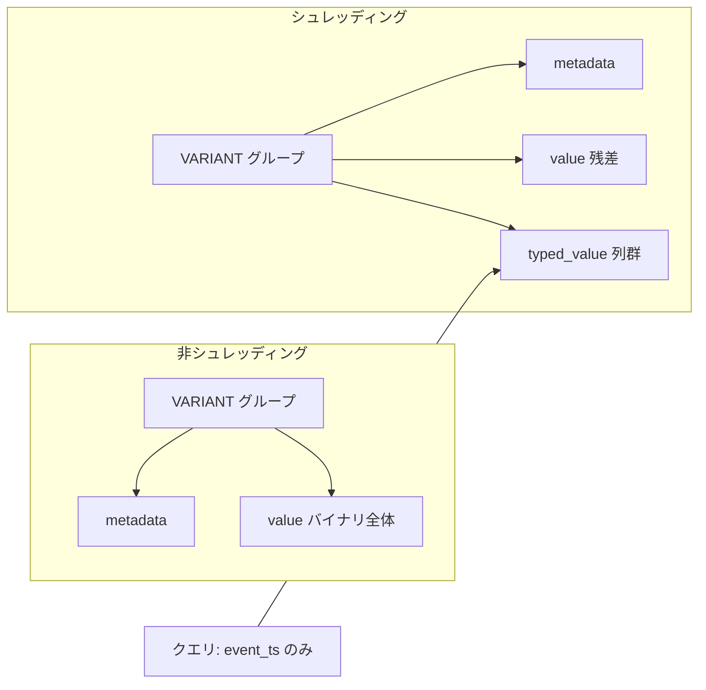

# 第14章 Variant シュレッディング

> **本章で読むソース**
>
> - [`VariantShredding.md`](https://github.com/apache/parquet-format/blob/apache-parquet-format-2.13.0/VariantShredding.md)

## この章の狙い

第13章で読んだ Variant バイナリ表現に、**シュレッディング**（shredding）を重ねる仕様を VariantShredding.md に沿って説明する。
よく使うフィールドを型付き Parquet 列へ抽出し、列指向の投影と統計によるスキップを効かせる構造を押さえる。

## 前提

第13章で `metadata` と `value` の二分割、および `VARIANT` 論理型のスキーマ表現を読んでいること。
第3章の論理型と物理型の対応、第4章のネスト表現（`LIST` グループ）も参照する。

## シュレッディングが解く問題

VariantShredding.md は、半構造化データが列内で不均一でも自己記述形式で格納できる一方、一部フィールドだけを読むクエリでは非効率になりうると述べる。

[`VariantShredding.md` L20-L30](https://github.com/apache/parquet-format/blob/apache-parquet-format-2.13.0/VariantShredding.md#L20-L30)

```text
# Variant Shredding

The Variant type is designed to store and process semi-structured data efficiently, even with heterogeneous values.
Query engines encode each Variant value in a self-describing format, and store it as a group containing `value` and `metadata` binary fields in Parquet.
Since data is often partially homogeneous, it can be beneficial to extract certain fields into separate Parquet columns to further improve performance.
This process is called **shredding**.

Shredding enables the use of Parquet's columnar representation for more compact data encoding, column statistics for data skipping, and partial projections.

For example, the query `SELECT variant_get(event, '$.event_ts', 'timestamp') FROM tbl` only needs to load field `event_ts`, and if that column is shredded, it can be read by columnar projection without reading or deserializing the rest of the `event` Variant.
Similarly, for the query `SELECT * FROM tbl WHERE variant_get(event, '$.event_type', 'string') = 'signup'`, the `event_type` shredded column metadata can be used for skipping and to lazily load the rest of the Variant.

```

**シュレッディング**とは、Variant 内の特定フィールドを別の Parquet 列（`typed_value` 系）へ抽出する手続きである。
列指向のエンコーディング、カラム統計、部分投影の3点が同時に効く。

### 設計上の工夫：列指向への橋渡し

`value` バイナリだけを読む経路では、フィルタ用の1フィールドでも Variant 全体のデシリアライズが残りやすい。
`typed_value` を INT64 や STRING として並べれば、既存の Parquet リーダーがページ統計や `ColumnIndex` をそのまま使える。
I/O と CPU の両方で、ホットパスを既知型の列読み取りへ寄せられる。



## Metadata の共通性

metadata はシュレッディングの有無にかかわらず、トップレベル Variant グループの `metadata` 列に置く。

[`VariantShredding.md` L32-L37](https://github.com/apache/parquet-format/blob/apache-parquet-format-2.13.0/VariantShredding.md#L32-L37)

```text
## Variant Metadata

Variant metadata is stored in the top-level Variant group in a binary `metadata` column regardless of whether the Variant value is shredded.

All `value` columns within the Variant must use the same `metadata`.
All field names of a Variant, whether shredded or not, must be present in the metadata.

```

Variant 内のすべての `value` 列は同一の `metadata` を共有する。
シュレッディング済みか否かにかかわらず、フィールド名は metadata の辞書に登録されていなければならない。

## Value シュレッディングの基本形

各 `value` フィールドには、型が一致するとき用の `typed_value` を付けられる。

[`VariantShredding.md` L39-L52](https://github.com/apache/parquet-format/blob/apache-parquet-format-2.13.0/VariantShredding.md#L39-L52)

```text
## Value Shredding

Variant values are stored in Parquet fields named `value`.
Each `value` field may have an associated shredded field named `typed_value` that stores the value when it matches a specific type.
When `typed_value` is present, readers **must** reconstruct shredded values according to this specification.

For example, a Variant field, `measurement` may be shredded as long values by adding `typed_value` with type `int64`:
required group measurement (VARIANT(1)) {
  required binary metadata;
  optional binary value;
  optional int64 typed_value;
}

```

列へのアクセスは位置ではなく名前で行う。

[`VariantShredding.md` L54](https://github.com/apache/parquet-format/blob/apache-parquet-format-2.13.0/VariantShredding.md#L54)

```text
The Parquet columns used to store variant metadata and values must be accessed by name, not by position.

```

スキーマの深さ優先列挙順に依存せず、`metadata` と `value` と `typed_value` を名前で解決する。

## value と typed_value の意味表

2列は1つの論理値を共同で表す。

[`VariantShredding.md` L65-L76](https://github.com/apache/parquet-format/blob/apache-parquet-format-2.13.0/VariantShredding.md#L65-L76)

```text
Both `value` and `typed_value` are optional fields used together to encode a single value.
Values in the two fields must be interpreted according to the following table:

| `value`  | `typed_value` | Meaning                                                     |
|----------|---------------|-------------------------------------------------------------|
| null     | null          | The value is missing; only valid for shredded object fields |
| non-null | null          | The value is present and may be any type, including null    |
| null     | non-null      | The value is present and is the shredded type               |
| non-null | non-null      | The value is present and is a partially shredded object     |

An object is _partially shredded_ when the `value` is an object and the `typed_value` is a shredded object.
Writers must not produce data where both `value` and `typed_value` are non-null, unless the Variant value is an object.

```

プリミティブを完全にシュレッディングした行では `value` が null で `typed_value` が非 null になる。
オブジェクトだけが、両方非 null の**部分シュレッディング**を許す。

測定値 `34, null, "n/a", 100` の格納例は次のとおりである。

[`VariantShredding.md` L56-L63](https://github.com/apache/parquet-format/blob/apache-parquet-format-2.13.0/VariantShredding.md#L56-L63)

```text
The series of measurements `34, null, "n/a", 100` would be stored as:

| Value   | `metadata`       | `value`               | `typed_value` |
|---------|------------------|-----------------------|---------------|
| 34      | `01 00` v1/empty | null                  | `34`          |
| null    | `01 00` v1/empty | `00` (null)           | null          |
| "n/a"   | `01 00` v1/empty | `13 6E 2F 61` (`n/a`) | null          |
| 100     | `01 00` v1/empty | null                  | `100`         |

```

型がシュレッディング対象外の `"n/a"` は `value` 側の Variant バイナリに残る。

必須コンテキストで両方 null のとき、読み手は Variant null（`00`）を返す。

[`VariantShredding.md` L78-L79](https://github.com/apache/parquet-format/blob/apache-parquet-format-2.13.0/VariantShredding.md#L78-L79)

```text
If a Variant is missing in a context where a value is required, readers must return a Variant null (`00`): basic type 0 (primitive) and physical type 0 (null).
For example, if a Variant is required (like `measurement` above) and both `value` and `typed_value` are null, the returned `value` must be `00` (Variant null).

```

## シュレッディング可能な型

Variant 型と Parquet 物理型・論理型の対応は固定表にある。

[`VariantShredding.md` L81-L107](https://github.com/apache/parquet-format/blob/apache-parquet-format-2.13.0/VariantShredding.md#L81-L107)

```text
### Shredded Value Types

Shredded values must use the following Parquet types:

| Variant Type                | Parquet Physical Type             | Parquet Logical Type     |
|-----------------------------|-----------------------------------|--------------------------|
| boolean                     | BOOLEAN                           |                          |
| int8                        | INT32                             | INT(8, signed=true)      |
| int16                       | INT32                             | INT(16, signed=true)     |
| int32                       | INT32                             |                          |
| int64                       | INT64                             |                          |
| float                       | FLOAT                             |                          |
| double                      | DOUBLE                            |                          |
| decimal4                    | INT32                             | DECIMAL(P, S)            |
| decimal8                    | INT64                             | DECIMAL(P, S)            |
| decimal16                   | BYTE_ARRAY / FIXED_LEN_BYTE_ARRAY | DECIMAL(P, S)            |
| date                        | INT32                             | DATE                     |
| time                        | INT64                             | TIME(false, MICROS)      |
| timestamptz(6)              | INT64                             | TIMESTAMP(true, MICROS)  |
| timestamptz(9)              | INT64                             | TIMESTAMP(true, NANOS)   |
| timestampntz(6)             | INT64                             | TIMESTAMP(false, MICROS) |
| timestampntz(9)             | INT64                             | TIMESTAMP(false, NANOS)  |
| binary                      | BINARY                            |                          |
| string                      | BINARY                            | STRING                   |
| uuid                        | FIXED_LEN_BYTE_ARRAY[len=16]      | UUID                     |
| array                       | GROUP; see Arrays below           | LIST                     |
| object                      | GROUP; see Objects below          |                          |

```

オブジェクト以外では、`typed_value` か `value` のどちらか一方だけが非 null でなければならない。

[`VariantShredding.md` L109-L113](https://github.com/apache/parquet-format/blob/apache-parquet-format-2.13.0/VariantShredding.md#L109-L113)

```text
#### Primitive Types

Primitive values can be shredded using the equivalent Parquet primitive type from the table above for `typed_value`.

Unless the value is shredded as an object (see [Objects](#objects)), `typed_value` or `value` (but not both) must be non-null.

```

## 配列のシュレッディング

配列は `typed_value` に3段 `LIST` を使う。

[`VariantShredding.md` L115-L127](https://github.com/apache/parquet-format/blob/apache-parquet-format-2.13.0/VariantShredding.md#L115-L127)

```text
#### Arrays

Arrays can be shredded by using a 3-level Parquet list for `typed_value`.

If the value is not an array, `typed_value` must be null.
If the value is an array, `value` must be null.

The list `element` must be a required group.
The `element` group can contain `value` and `typed_value` fields.
The element's `value` field stores the element as Variant-encoded `binary` when the `typed_value` is not present or cannot represent it.
The `typed_value` field may be omitted when not shredding elements as a specific type.
The `value` field may be omitted when shredding elements as a specific type.
However, at least one of the two fields must be present.

```

`tags` を文字列リストとしてシュレッディングするスキーマ例である。

[`VariantShredding.md` L129-L143](https://github.com/apache/parquet-format/blob/apache-parquet-format-2.13.0/VariantShredding.md#L129-L143)

```text
For example, a `tags` Variant may be shredded as a list of strings using the following definition:
optional group tags (VARIANT(1)) {
  required binary metadata;
  optional binary value;
  optional group typed_value (LIST) {   # must be optional to allow a null list
    repeated group list {
      required group element {          # shredded element
        optional binary value;
        optional binary typed_value (STRING);
      }
    }
  }
}

```

配列要素に「欠損」は許されない。
null 要素は Variant null として `value` に載せる。

[`VariantShredding.md` L145-L147](https://github.com/apache/parquet-format/blob/apache-parquet-format-2.13.0/VariantShredding.md#L145-L147)

```text
All elements of an array must be present (not missing) because the `array` Variant encoding does not allow missing elements.
That is, either `typed_value` or `value` (but not both) must be non-null.
Null elements must be encoded in `value` as Variant null: basic type 0 (primitive) and physical type 0 (null).

```

## オブジェクトのシュレッディング

オブジェクトの各フィールドは `typed_value` グループ内の required グループになる。

[`VariantShredding.md` L158-L173](https://github.com/apache/parquet-format/blob/apache-parquet-format-2.13.0/VariantShredding.md#L158-L173)

```text
#### Objects

Fields of an object can be shredded using a Parquet group for `typed_value` that contains shredded fields.

If the value is an object, `typed_value` must be non-null.
If the value is not an object, `typed_value` must be null.
Readers can assume that a value is not an object if `typed_value` is null and that `typed_value` field values are correct; that is, readers do not need to read the `value` column if `typed_value` fields satisfy the required fields.

Each shredded field in the `typed_value` group is represented as a required group that contains optional `value` and `typed_value` fields.
The `value` field stores the value as Variant-encoded `binary` when the `typed_value` cannot represent the field.
This layout enables readers to skip data based on the field statistics for `value` and `typed_value`.
The `typed_value` field may be omitted when not shredding fields as a specific type.

The `value` column of a partially shredded object must never contain fields represented by the Parquet columns in `typed_value` (shredded fields).
Readers may always assume that data is written correctly and that shredded fields in `typed_value` are not present in `value`.
As a result, reads when a field is defined in both `value` and a `typed_value` shredded field may be inconsistent.

```

`typed_value` が非 null ならオブジェクトとみなし、要件を満たすなら `value` 列を読まなくてよい。
これが投影最適化の根拠である。

`event` オブジェクトの例では `event_type` と `event_ts` を別列化する。

[`VariantShredding.md` L175-L191](https://github.com/apache/parquet-format/blob/apache-parquet-format-2.13.0/VariantShredding.md#L175-L191)

```text
For example, a Variant `event` field may shred `event_type` (`string`) and `event_ts` (`timestamp`) columns using the following definition:
optional group event (VARIANT(1)) {
  required binary metadata;
  optional binary value;                # a variant, expected to be an object
  optional group typed_value {          # shredded fields for the variant object
    required group event_type {         # shredded field for event_type
      optional binary value;
      optional binary typed_value (STRING);
    }
    required group event_ts {           # shredded field for event_ts
      optional binary value;
      optional int64 typed_value (TIMESTAMP(true, MICROS));
    }
  }
}

The group for each named field must use repetition level `required`.

```

フィールドの存在と null の区別は次のとおりである。

[`VariantShredding.md` L193-L201](https://github.com/apache/parquet-format/blob/apache-parquet-format-2.13.0/VariantShredding.md#L193-L201)

```text
A field's `value` and `typed_value` are set to null (missing) to indicate that the field does not exist in the variant.
To encode a field that is present with a null value, the `value` must contain a Variant null: basic type 0 (primitive) and physical type 0 (null).

When both `value` and `typed_value` for a field are non-null, engines should fail.
If engines choose to read in such cases, then the `typed_value` column must be used.
Readers may always assume that data is written correctly and that only `value` or `typed_value` is defined.
As a result, reads when both `value` and `typed_value` are defined may be inconsistent with optimized reads that require only one of the columns.

```

部分シュレッディングでは、未抽出フィールドだけが `value` のオブジェクトに残る。

[`VariantShredding.md` L207-L208](https://github.com/apache/parquet-format/blob/apache-parquet-format-2.13.0/VariantShredding.md#L207-L208)

```text
| `{"event_type": "login", "event_ts": 1729794146402, "email": "user@example.com"}` | `{"email": "user@example.com"}`   | non-null      | null                           | `login`                              | null                         | 1729794146402                      | Partially shredded object                                                  |

```

仕様違反の例として、シュレッディング済みフィールドが `value` に重複して現れるケースが列挙される。

[`VariantShredding.md` L217-L220](https://github.com/apache/parquet-format/blob/apache-parquet-format-2.13.0/VariantShredding.md#L217-L220)

```text
| INVALID: `{"event_type": "login", "event_ts": 1729795057774}`                     | `{"event_type": "login"}`         | non-null      | null                           | `login`                              | null                         | 1729795057774                      | INVALID: Shredded field is present in `value`                              |
| INVALID: `{"event_type": "login"}`                                                | `{"event_type": "login"}`         | null          |                                |                                      |                              |                                    | INVALID: Shredded field is present in `value`, while `typed_value` is null |
| INVALID: `"a"`                                                                    | `"a"`                             | non-null      | null                           | null                                 | null                         | null                               | INVALID: `typed_value` is present and `value` is not an object             |
| INVALID: `{}`                                                                     | `02 00` (object with 0 fields)    | null          |                                |                                      |                              |                                    | INVALID: `typed_value` is null for object                                  |

```

ライターは invalid 行を出力してはならない。

[`VariantShredding.md` L222-L223](https://github.com/apache/parquet-format/blob/apache-parquet-format-2.13.0/VariantShredding.md#L222-L223)

```text
Invalid cases in the table above must not be produced by writers.
Readers must return an object when `typed_value` is non-null containing the shredded fields.

```

## ネストしたシュレッディング

`typed_value` は再帰的に任意のシュレッディング型を取れる。

[`VariantShredding.md` L225-L270](https://github.com/apache/parquet-format/blob/apache-parquet-format-2.13.0/VariantShredding.md#L225-L270)

```text
## Nesting

The `typed_value` associated with any Variant `value` field can be any shredded type, as shown in the sections above.

For example, the `event` object above may also shred sub-fields as object (`location`) or array (`tags`).

optional group event (VARIANT(1)) {
  required binary metadata;
  optional binary value;
  optional group typed_value {
    required group event_type {
      optional binary value;
      optional binary typed_value (STRING);
    }
    required group event_ts {
      optional binary value;
      optional int64 typed_value (TIMESTAMP(true, MICROS));
    }
    required group location {
      optional binary value;
      optional group typed_value {
        required group latitude {
          optional binary value;
          optional double typed_value;
        }
        required group longitude {
          optional binary value;
          optional double typed_value;
        }
      }
    }
    required group tags {
      optional binary value;
      optional group typed_value (LIST) {
        repeated group list {
          required group element {
            optional binary value;
            optional binary typed_value (STRING);
          }
        }
      }
    }
  }
}

```

オブジェクト内のオブジェクト、配列内の要素まで、同じ `value` と `typed_value` 規則が繰り返される。

## データスキップ

`value` が常に null の `typed_value` 列では、通常のカラム統計でファイルやロウグループ、ページのスキップが有効になる。

[`VariantShredding.md` L272-L280](https://github.com/apache/parquet-format/blob/apache-parquet-format-2.13.0/VariantShredding.md#L272-L280)

```text
# Data Skipping

Statistics for `typed_value` columns can be used for file, row group, or page skipping when `value` is always null (missing).

When the corresponding `value` column is all nulls, all values must be the shredded `typed_value` field's type.
Because the type is known, comparisons with values of that type are valid.
`IS NULL`/`IS NOT NULL` and `IS NAN`/`IS NOT NAN` filter results are also valid.

Comparisons with values of other types are not necessarily valid and data should not be skipped.

```

型が固定されている行だけでは、比較述語を安全にプッシュダウンできる。
型が一致しない可能性がある行では、統計によるスキップは慎重に扱う。

## シュレッディング Variant の再構成

仕様は再帰的 `construct_variant` を提示する。

[`VariantShredding.md` L291-L335](https://github.com/apache/parquet-format/blob/apache-parquet-format-2.13.0/VariantShredding.md#L291-L335)

```text
def construct_variant(metadata: Metadata, value: Variant, typed_value: Any) -> Variant:
    """Constructs a Variant from value and typed_value"""
    if typed_value is not None:
        if isinstance(typed_value, dict):
            # this is a shredded object
            object_fields = {
                name: construct_variant(metadata, field.value, field.typed_value)
                for (name, field) in typed_value
            }

            if value is not None:
                # this is a partially shredded object
                assert isinstance(value, VariantObject), "partially shredded value must be an object"
                assert typed_value.keys().isdisjoint(value.keys()), "object keys must be disjoint"

                # union the shredded fields and non-shredded fields
                # (field IDs and offsets must be in the order of the
                # corresponding field names, sorted lexicographically
                # (unsigned byte ordering for UTF-8))
                return VariantObject(metadata, object_fields).union(VariantObject(metadata, value))

            else:
                return VariantObject(metadata, object_fields)

        elif isinstance(typed_value, list):
            # this is a shredded array
            assert value is None, "shredded array must not conflict with variant value"

            elements = [
                construct_variant(metadata, elem.value, elem.typed_value)
                for elem in list(typed_value)
            ]
            return VariantArray(metadata, elements)

        else:
            # this is a shredded primitive
            assert value is None, "shredded primitive must not conflict with variant value"

            return primitive_to_variant(typed_value)

    elif value is not None:
        return Variant(metadata, value)

    else:
        # value is missing
        return None

```

部分オブジェクトでは、辞書キーが互いに素であることを前提に `union` する。
読み手が正しいデータを仮定できるのは、ライターが重複キーを書かない契約があるためである。

## 後方互換とスキーマのばらつき

シュレッディングは任意機能であり、`metadata` と `value` だけのグループは引き続き読める。

[`VariantShredding.md` L346-L354](https://github.com/apache/parquet-format/blob/apache-parquet-format-2.13.0/VariantShredding.md#L346-L354)

```text
## Backward and forward compatibility

Shredding is an optional feature of Variant, and readers must continue to be able to read a group containing only `value` and `metadata` fields.

Engines that do not write shredded values must be able to read shredded values according to this spec or must fail.

Different files may contain conflicting shredding schemas.
That is, files may contain different `typed_value` columns for the same Variant with incompatible types.
It may not be possible to infer or specify a single shredded schema that would allow all Parquet files for a table to be read without reconstructing the value as a Variant.

```

同一テーブル内でもファイルごとにシュレッディング列が異なりうる。
単一の固定スキーマを全ファイルに強制できない場合、Variant として再構成して読む必要が残る。

## まとめ

シュレッディングは `typed_value` 列群でホットフィールドを型付き Parquet 列に展開し、列統計と投影を既存の仕組みへ接続する。
`value` と `typed_value` の4通りの組み合わせが、完全抽出、残差オブジェクト、欠損、null を区別する。
オブジェクトでは部分シュレッディングが許され、未抽出フィールドだけ `value` に残る。
`value` が全 null の `typed_value` 列では、プッシュダウンとスキップが通常列と同様に効く。

## 関連する章

- [第13章 Variant バイナリエンコーディング](13-variant-encoding.md)
- [第3章 物理型と論理型](../part01-types/03-physical-and-logical-types.md)
- [第4章 ネストとレベル符号化](../part01-types/04-nested-encoding.md)
- [第9章 統計とソート順](../part04-index/09-statistics.md)
- [第10章 ページインデックス](../part04-index/10-page-index.md)
