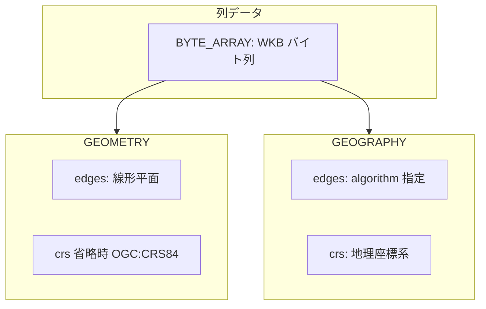
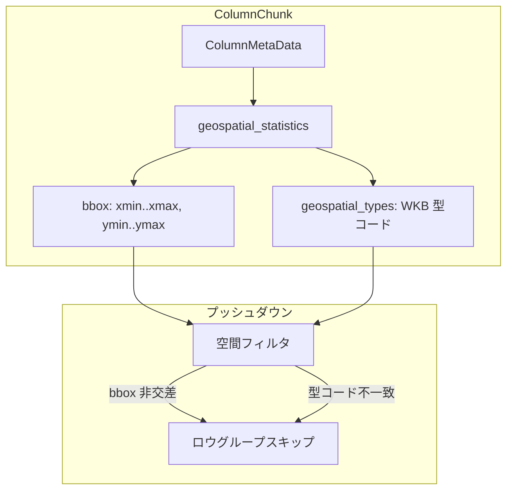

# 第15章 地理空間型

> **本章で読むソース**
>
> - [`Geospatial.md`](https://github.com/apache/parquet-format/blob/apache-parquet-format-2.13.0/Geospatial.md)
> - [`src/main/thrift/parquet.thrift`](https://github.com/apache/parquet-format/blob/apache-parquet-format-2.13.0/src/main/thrift/parquet.thrift)

## この章の狙い

Parquet が WKB 形式の地理空間データをどう論理型注釈し、専用統計でプッシュダウンを支えるかを Geospatial.md と Thrift 定義に沿って説明する。
`GEOMETRY` と `GEOGRAPHY` の違い、境界箱（bounding box）、ジオ空間型コードの集約を押さえる。

## 前提

第3章で `LogicalType` と `BYTE_ARRAY` 物理型、第9章で `Statistics` と `ColumnMetaData` を読んでいること。
WKB（Well-Known Binary）のバイト列が列データ本体である。

## 仕様の位置づけ

Geospatial.md は地理空間型と統計の定義を担う。

[`Geospatial.md` L20-L34](https://github.com/apache/parquet-format/blob/apache-parquet-format-2.13.0/Geospatial.md#L20-L34)

```text
Geospatial Definitions
====

This document contains the specification of geospatial types and statistics.

# Background

The Geometry and Geography class hierarchy and its Well-Known Text (WKT) and
Well-Known Binary (WKB) serializations (ISO variant supporting XY, XYZ, XYM,
XYZM) are defined by [OpenGIS Implementation Specification for Geographic
information - Simple feature access - Part 1: Common architecture][sfa-part1],
from [OGC (Open Geospatial Consortium)][ogc].

The version of the OGC standard first used here is 1.2.1, but future versions
may also be used if the WKB representation remains wire-compatible.
```

幾何クラス階層と WKB 直列化は OGC Simple Features に従う。
将来の OGC 版も、WKB のワイヤ互換が保たれる限り採用しうる。

## 論理型の二系統

[`Geospatial.md` L69-L73](https://github.com/apache/parquet-format/blob/apache-parquet-format-2.13.0/Geospatial.md#L69-L73)

```text
# Logical Types

Two geospatial logical type annotations are supported:
* `GEOMETRY`: geospatial features in the WKB format with linear/planar edge interpolation. See [Geometry](LogicalTypes.md#geometry)
* `GEOGRAPHY`: geospatial features in the WKB format with an explicit (non-linear/non-planar) edge interpolation algorithm. See [Geography](LogicalTypes.md#geography)
```

**GEOMETRY** は辺を平面（直線）補間として扱う。
**GEOGRAPHY** は球面など非平面の辺補間アルゴリズムを明示する。

Thrift では `LogicalType` union のメンバーとして定義される。

[`src/main/thrift/parquet.thrift` L501-L503](https://github.com/apache/parquet-format/blob/apache-parquet-format-2.13.0/src/main/thrift/parquet.thrift#L501-L503)

```thrift
  16: VariantType VARIANT     // no compatible ConvertedType
  17: GeometryType GEOMETRY   // no compatible ConvertedType
  18: GeographyType GEOGRAPHY // no compatible ConvertedType
```

いずれも `ConvertedType` との対応はなく、新規論理型として追加されている。



## GeometryType

[`src/main/thrift/parquet.thrift` L431-L447](https://github.com/apache/parquet-format/blob/apache-parquet-format-2.13.0/src/main/thrift/parquet.thrift#L431-L447)

```thrift
/**
 * Embedded Geometry logical type annotation
 *
 * Geospatial features in the Well-Known Binary (WKB) format and `edges` interpolation
 * is always linear/planar.
 *
 * A custom CRS can be set by the crs field. If unset, it defaults to "OGC:CRS84",
 * which means that the geometries must be stored in longitude, latitude based on
 * the WGS84 datum.
 *
 * Allowed for physical type: BYTE_ARRAY.
 *
 * See Geospatial.md for details.
 */
struct GeometryType {
  1: optional string crs;
}
```

物理型は `BYTE_ARRAY` のみ。
`crs` 未設定時は `OGC:CRS84`（WGS84 上の経度緯度順）が暗黙の前提になる。

LogicalTypes.md でも同趣旨が述べられる。

[`LogicalTypes.md` L609-L610](https://github.com/apache/parquet-format/blob/apache-parquet-format-2.13.0/LogicalTypes.md#L609-L610)

```text
`GEOMETRY` is used for geospatial features in the Well-Known Binary (WKB) format
with linear/planar `edges` interpolation. It must annotate a `BYTE_ARRAY`
```

さらに詳細は Geospatial.md を参照する旨が続く（LogicalTypes.md L611）。

[`LogicalTypes.md` L613-L616](https://github.com/apache/parquet-format/blob/apache-parquet-format-2.13.0/LogicalTypes.md#L613-L616)

```text
The type has only one type parameter:
- `crs`: An optional string value for CRS. If unset, the CRS defaults to
  `"OGC:CRS84"`, which means that the geometries must be stored in longitude,
  latitude based on the WGS84 datum.
```

[`LogicalTypes.md` L618-L620](https://github.com/apache/parquet-format/blob/apache-parquet-format-2.13.0/LogicalTypes.md#L618-L620)

```text
The sort order used for `GEOMETRY` is undefined. When writing data, no min/max
statistics should be saved for this type and if such non-compliant statistics
are found during reading, they must be ignored.
```

`GEOMETRY` では汎用 `min`/`max` 統計を書いてはならず、読み手は誤った統計を無視する。

## GeographyType と辺補間

[`src/main/thrift/parquet.thrift` L422-L429](https://github.com/apache/parquet-format/blob/apache-parquet-format-2.13.0/src/main/thrift/parquet.thrift#L422-L429)

```thrift
/** Edge interpolation algorithm for Geography logical type */
enum EdgeInterpolationAlgorithm {
  SPHERICAL = 0;
  VINCENTY = 1;
  THOMAS = 2;
  ANDOYER = 3;
  KARNEY = 4;
}
```

[`src/main/thrift/parquet.thrift` L449-L469](https://github.com/apache/parquet-format/blob/apache-parquet-format-2.13.0/src/main/thrift/parquet.thrift#L449-L469)

```thrift
/**
 * Embedded Geography logical type annotation
 *
 * Geospatial features in the WKB format with an explicit (non-linear/non-planar)
 * `edges` interpolation algorithm.
 *
 * A custom geographic CRS can be set by the crs field, where longitudes are
 * bound by [-180, 180] and latitudes are bound by [-90, 90]. If unset, the CRS
 * defaults to "OGC:CRS84".
 *
 * An optional algorithm can be set to correctly interpret `edges` interpolation
 * of the geometries. If unset, the algorithm defaults to SPHERICAL.
 *
 * Allowed for physical type: BYTE_ARRAY.
 *
 * See Geospatial.md for details.
 */
struct GeographyType {
  1: optional string crs;
  2: optional EdgeInterpolationAlgorithm algorithm;
}
```

**GEOGRAPHY** は地理座標系に限定され、経度緯度の正規範囲が注釈に書かれる。
`algorithm` 未設定時は `SPHERICAL` が既定である。

Geospatial.md の列挙と一致する。

[`Geospatial.md` L59-L67](https://github.com/apache/parquet-format/blob/apache-parquet-format-2.13.0/Geospatial.md#L59-L67)

```text
## Edge Interpolation Algorithm

An algorithm for interpolating edges. It is one of the following values:

* `SPHERICAL`: edges are interpolated as geodesics on a sphere.
* `VINCENTY`: [https://en.wikipedia.org/wiki/Vincenty%27s_formulae](https://en.wikipedia.org/wiki/Vincenty%27s_formulae)
* `THOMAS`: Thomas, Paul D. Spheroidal geodesics, reference systems, & local geometry. US Naval Oceanographic Office, 1970.
* `ANDOYER`: Thomas, Paul D. Mathematical models for navigation systems. US Naval Oceanographic Office, 1965.
* `KARNEY`: [Karney, Charles FF. "Algorithms for geodesics." Journal of Geodesy 87 (2013): 43-55](https://link.springer.com/content/pdf/10.1007/s00190-012-0578-z.pdf), and [GeographicLib](https://geographiclib.sourceforge.io/)
```

同一 WKB でも、辺の解釈（測地線か平面か）がクエリ結果に効く。
型注釈に algorithm を載せることで、読み手が補間規則をファイルから復元できる。

## 座標参照系

**CRS**（Coordinate Reference System）は座標と地球上の位置の対応を定める。

[`Geospatial.md` L39-L55](https://github.com/apache/parquet-format/blob/apache-parquet-format-2.13.0/Geospatial.md#L39-L55)

```text
## Coordinate Reference System

Coordinate Reference System (CRS) is a mapping of how coordinates refer to
locations on Earth.

The default CRS `OGC:CRS84` means that the geospatial features must be stored
in the order of longitude/latitude based on the WGS84 datum.

Non-default CRS values are specified by any string that uniquely identifies a coordinate reference system associated with this type.
To maximize interoperability, suggested (but not limited to) formats for CRS are:
* `<projjson>` - A complete CRS definition embedded directly using the [PROJJSON](https://proj.org/en/stable/specifications/projjson.html) specification. Example for `OGC:CRS83`: `{"$schema": "https://proj.org/schemas/v0.7/projjson.schema.json","type": "GeographicCRS","name": "NAD83 (CRS83)","datum": {"type": "GeodeticReferenceFrame"...`
* `<authority>:<code>` - where `<authority>` represents some well-known authorities, and `code` is the code used by the authority to identify the CRS. Examples are - `OGC:CRS84`, `OGC:CRS83`, `OGC:CRS27`, `EPSG:4326`, `EPSG:3857`, `IGNF:ATI`. See [https://spatialreference.org/](https://spatialreference.org/) for definitions of coordinate reference systems provided by some well-known authorities.
* `srid:<identifier>` -  A reference using a [Spatial reference identifier (SRID)](https://en.wikipedia.org/wiki/Spatial_reference_system#Identifier), where <identifier> is the numeric SRID value. For example: `srid:0`.
* `projjson:<key_name>` - where <key_name> refers to a key within the file key-value metadata, where CRS definition in [PROJJSON](https://proj.org/en/stable/specifications/projjson.html) format is stored.
```

地理 CRS では経度は [-180, 180]、緯度は [-90, 90] に拘束される。

[`Geospatial.md` L54-L55](https://github.com/apache/parquet-format/blob/apache-parquet-format-2.13.0/Geospatial.md#L54-L55)

```text
For geographic CRS, longitudes are bound by [-180, 180] and latitudes are bound
by [-90, 90].
```

## 座標軸の順序

WKB と境界箱の軸順は、CRS 定義より WKB の慣行に従う。

[`Geospatial.md` L157-L163](https://github.com/apache/parquet-format/blob/apache-parquet-format-2.13.0/Geospatial.md#L157-L163)

```text
# Coordinate Axis Order

The axis order of the coordinates in WKB and bounding box stored in Parquet
follows the de facto standard for axis order in WKB and is therefore always
(x, y) where x is easting or longitude and y is northing or latitude. This
ordering explicitly overrides the axis order as specified in the CRS.
```

CRS が緯度先行を規定していても、Parquet 上は常に (x, y) で、x は経度または東距、y は緯度または北距である。
`GEOMETRY` は EPSG:3857 など投影 CRS も取り得るため、軸は常に経度緯度とは限らない。

## GeospatialStatistics

地理空間列専用の統計は `ColumnMetaData` の任意フィールドに載る。

[`Geospatial.md` L75-L80](https://github.com/apache/parquet-format/blob/apache-parquet-format-2.13.0/Geospatial.md#L75-L80)

```text
# Statistics

`GeospatialStatistics` is a struct specific for `GEOMETRY` and `GEOGRAPHY`
logical types to store statistics of a column chunk. It is an optional field in
the `ColumnMetaData` and contains [Bounding Box](#bounding-box) and [Geospatial
Types](#geospatial-types) that are described below in detail.
```

[`src/main/thrift/parquet.thrift` L951-L952](https://github.com/apache/parquet-format/blob/apache-parquet-format-2.13.0/src/main/thrift/parquet.thrift#L951-L952)

```thrift
  /** Optional statistics specific for Geometry and Geography logical types */
  17: optional GeospatialStatistics geospatial_statistics;
```

[`src/main/thrift/parquet.thrift` L255-L261](https://github.com/apache/parquet-format/blob/apache-parquet-format-2.13.0/src/main/thrift/parquet.thrift#L255-L261)

```thrift
/** Statistics specific to Geometry and Geography logical types */
struct GeospatialStatistics {
  /** A bounding box of geospatial instances */
  1: optional BoundingBox bbox;
  /** Geospatial type codes of all instances, or an empty list if not known */
  2: optional list<i32> geospatial_types;
}
```

汎用 `Statistics` の min/max ではなく、空間謂詞向けの `bbox` と型コード集合を別構造で持つ。

### 設計上の工夫：空間プッシュダウン用の境界箱

バイト列比較の min/max では「矩形と交差するか」を安全に判定できない。
`BoundingBox` は各軸の min/max を double で持ち、contains/intersects 系のフィルタに使える。

[`Geospatial.md` L82-L105](https://github.com/apache/parquet-format/blob/apache-parquet-format-2.13.0/Geospatial.md#L82-L105)

```text
## Bounding Box

A geospatial instance has at least two coordinate dimensions: X and Y for 2D
coordinates of each point. Please note that X is longitude/easting and Y is
latitude/northing. A geospatial instance can optionally have Z and/or M values
associated with each point.

The Z values introduce the third dimension coordinate. Usually they are used to
indicate the height, or elevation.

M values are an opportunity for a geospatial instance to track a value in a 
fourth dimension. These values can be used as a linear reference value (e.g., 
highway milepost value), a timestamp, or some other value as defined by the CRS.

Bounding box is defined as the thrift struct below in the representation of
min/max value pair of coordinates from each axis. Note that X and Y values are
always present. Z and M are omitted for 2D geospatial instances.

When calculating a bounding box, null or NaN values in a coordinate 
dimension are skipped. For example, `POINT (1 NaN)` contributes a value to X 
but no values to Y, Z, or M dimension of the bounding box. If a dimension has 
only null or NaN values, that dimension is omitted from the bounding box. If 
either the X or Y dimension is missing, then the bounding box itself is not 
produced.
```

[`src/main/thrift/parquet.thrift` L244-L253](https://github.com/apache/parquet-format/blob/apache-parquet-format-2.13.0/src/main/thrift/parquet.thrift#L244-L253)

```thrift
struct BoundingBox {
  1: required double xmin;
  2: required double xmax;
  3: required double ymin;
  4: required double ymax;
  5: optional double zmin;
  6: optional double zmax;
  7: optional double mmin;
  8: optional double mmax;
}
```

X または Y が欠ける場合、境界箱自体を出力しない。

日付変更線をまたぐ場合、X では `xmin > xmax` のラップアラウンド表現が許される。

[`Geospatial.md` L107-L112](https://github.com/apache/parquet-format/blob/apache-parquet-format-2.13.0/Geospatial.md#L107-L112)

```text
For the X values only, xmin may be greater than xmax. In this case, an object
in this bounding box may match if it contains an X such that `x >= xmin` OR
`x <= xmax`. This wraparound occurs only when the corresponding bounding box
crosses the antimeridian line. In geographic terminology, the concepts of `xmin`,
`xmax`, `ymin`, and `ymax` are also known as `westernmost`, `easternmost`,
`southernmost` and `northernmost`, respectively.
```

`GEOGRAPHY` では X/Y が正規範囲に収まる。

[`Geospatial.md` L114-L115](https://github.com/apache/parquet-format/blob/apache-parquet-format-2.13.0/Geospatial.md#L114-L115)

```text
For `GEOGRAPHY` types, X and Y values are restricted to the canonical ranges of
[-180, 180] for X and [-90, 90] for Y.
```



## Geospatial Types 一覧

列チャンク内に現れる WKB 型コードの集合を記録する。

[`Geospatial.md` L130-L152](https://github.com/apache/parquet-format/blob/apache-parquet-format-2.13.0/Geospatial.md#L130-L152)

```text
## Geospatial Types

A list of geospatial types from all instances in the `GEOMETRY` or `GEOGRAPHY`
column, or an empty list if they are not known.

This is borrowed from [geometry_types of GeoParquet][geometry-types] except that
values in the list are [WKB (ISO-variant) integer codes][wkb-integer-code].
The table below shows the most common geospatial types and their codes:

| Type               | XY   | XYZ  | XYM  | XYZM |
| :----------------- | :--- | :--- | :--- | :--- |
| Point              | 0001 | 1001 | 2001 | 3001 |
| LineString         | 0002 | 1002 | 2002 | 3002 |
| Polygon            | 0003 | 1003 | 2003 | 3003 |
| MultiPoint         | 0004 | 1004 | 2004 | 3004 |
| MultiLineString    | 0005 | 1005 | 2005 | 3005 |
| MultiPolygon       | 0006 | 1006 | 2006 | 3006 |
| GeometryCollection | 0007 | 1007 | 2007 | 3007 |

In addition, the following rules are applied:
- A list of multiple values indicates that multiple geospatial types are present (e.g. `[0003, 0006]`).
- An empty array explicitly signals that the geospatial types are not known.
- The geospatial types in the list must be unique (e.g. `[0001, 0001]` is not valid).
```

複数値は混合型のチャンクを示す。
空配列は「型不明」を明示し、読み手は型によるスキップを控えるべきである。

## まとめ

地理空間列は WKB を `BYTE_ARRAY` に載せ、`GEOMETRY` か `GEOGRAPHY` で辺補間と CRS を注釈する。
`GeospatialStatistics` は汎用 min/max の代わりに `BoundingBox` と WKB 型コード集合を提供し、空間フィルタのプッシュダウンを支える。
軸順は WKB 慣行の (x, y)（x は経度または東距、y は緯度または北距）に固定され、日付変更線横断は xmin/xmax のラップアラウンドで表現する。

## 関連する章

- [第3章 物理型と論理型](../part01-types/03-physical-and-logical-types.md)
- [第9章 統計とソート順](../part04-index/09-statistics.md)
- [第10章 ページインデックス](../part04-index/10-page-index.md)
- [第16章 スキーマ進化と後方互換](../part07-compat/16-schema-evolution.md)
