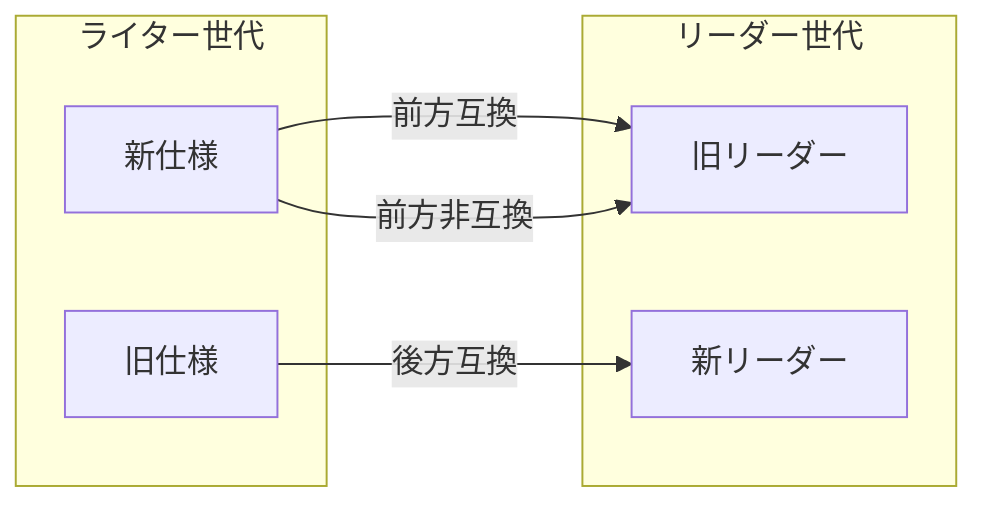

# 第16章 スキーマ進化と後方互換

> **本章で読むソース**
>
> - [`src/main/thrift/parquet.thrift`](https://github.com/apache/parquet-format/blob/apache-parquet-format-2.13.0/src/main/thrift/parquet.thrift)
> - [`LogicalTypes.md`](https://github.com/apache/parquet-format/blob/apache-parquet-format-2.13.0/LogicalTypes.md)
> - [`CHANGES.md`](https://github.com/apache/parquet-format/blob/apache-parquet-format-2.13.0/CHANGES.md)

## この章の狙い

Parquet が古いファイルを読み続けられるように、Thrift 定義と LogicalTypes.md がどの層で互換性を規定しているかを整理する。
`ConvertedType` から `LogicalType` への移行、非推奨フィールド、ネスト表現の読み取り規則を、仕様変更の履歴と対応づける。

## 前提

第2章で `FileMetaData` と `SchemaElement`、第3章で物理型と論理型、第5章でエンコーディングを読んでいること。
本章は「列の追加・型変更」の運用ガイドではなく、フォーマット仕様が互換をどう記述するかに焦点を当てる。

## 互換性の分類

仕様の互換議論は、古いファイルを新しい読み手が読めること（後方互換）と、新しいファイルを古い読み手がどこまで復元できるか（前方互換）に分かれる。
LogicalTypes.md は読み手が `ConvertedType` のみの古いファイルを解釈し続ける義務を置く。

[`LogicalTypes.md` L51-L55](https://github.com/apache/parquet-format/blob/apache-parquet-format-2.13.0/LogicalTypes.md#L51-L55)

```text
`ConvertedType` is deprecated. However, to maintain compatibility with old writers,
Parquet readers should be able to read and interpret `ConvertedType` annotations
in case `LogicalType` annotations are not present. Parquet writers must always write
`LogicalType` annotations where applicable, but must also write the corresponding
`ConvertedType` annotations (if any) to maintain compatibility with old readers.

```

`ConvertedType` 対応のない新論理型（`UUID`、`VARIANT`、`GEOMETRY` など）は、古い読み手にとって意味は失われてもバイト列として読める前方互換の追加である。
未知の圧縮コーデックや enum 値は、古い読み手が失敗判定できる前方非互換の典型である（`CompressionCodec` の版注記を参照）。



## ConvertedType から LogicalType へ

Thrift には論理型を表す2系統が並存する。

[`src/main/thrift/parquet.thrift` L43-L48](https://github.com/apache/parquet-format/blob/apache-parquet-format-2.13.0/src/main/thrift/parquet.thrift#L43-L48)

```thrift
/**
 * DEPRECATED: Common types used by frameworks (e.g. Hive, Pig) using parquet.
 * ConvertedType is superseded by LogicalType.  This enum should not be extended.
 *
 * See LogicalTypes.md for conversion between ConvertedType and LogicalType.
 */
enum ConvertedType {

```

[`src/main/thrift/parquet.thrift` L471-L477](https://github.com/apache/parquet-format/blob/apache-parquet-format-2.13.0/src/main/thrift/parquet.thrift#L471-L477)

```thrift
/**
 * LogicalType annotations to replace ConvertedType.
 *
 * To maintain compatibility, implementations using LogicalType for a
 * SchemaElement must also set the corresponding ConvertedType (if any)
 * from the following table.
 */
union LogicalType {

```

`ConvertedType` は拡張してはならない非推奨 enum である。
新しい `LogicalType` を書く実装は、対応する `ConvertedType` も併記しなければならない（対応がある場合）。

LogicalTypes.md の互換節は読み手と書き手の義務を明示する。

[`LogicalTypes.md` L36-L57](https://github.com/apache/parquet-format/blob/apache-parquet-format-2.13.0/LogicalTypes.md#L36-L57)

```text
There is an older representation of the logical type annotations called `ConvertedType`.
To support backward compatibility with old files, readers should interpret `LogicalTypes`
in the same way as `ConvertedType`, and writers should populate `ConvertedType` in the metadata
according to well defined conversion rules.

### Compatibility

The Thrift definition of the metadata has two fields for logical types: `ConvertedType` and `LogicalType`.
`ConvertedType` is an enum of all available annotations. Since Thrift enums can't have additional type parameters,
it is cumbersome to define additional type parameters, like decimal scale and precision
(which are additional 32 bit integer fields on SchemaElement, and are relevant only for decimals) or time unit
and UTC adjustment flag for Timestamp types. To overcome this problem, a new logical type representation was introduced into
the metadata to replace `ConvertedType`: `LogicalType`.  The new representation is a union of structs of logical types,
this way allowing more flexible API, logical types can have type parameters.

`ConvertedType` is deprecated. However, to maintain compatibility with old writers,
Parquet readers should be able to read and interpret `ConvertedType` annotations
in case `LogicalType` annotations are not present. Parquet writers must always write
`LogicalType` annotations where applicable, but must also write the corresponding
`ConvertedType` annotations (if any) to maintain compatibility with old readers.

Compatibility considerations are mentioned for each annotation in the corresponding section.

```

読み手は `LogicalType` が無い古いファイルを `ConvertedType` だけから解釈する。
書き手は `LogicalType` を書きつつ、古い読み手向けに `ConvertedType` も埋める。

### 設計上の工夫：二重注釈による段階的移行

enum だけの `ConvertedType` では DECIMAL の scale や TIMESTAMP の単位を表現しきれない。
struct union の `LogicalType` は型パラメータを持てる一方、旧ライブラリは enum しか見ない。
両方を同時に書く規則により、意味の拡張と旧読み手の生存を両立する。

## SchemaElement の非推奨フィールド

葉ノードの `SchemaElement` には、移行用の重複フィールドがある。

[`src/main/thrift/parquet.thrift` L537-L565](https://github.com/apache/parquet-format/blob/apache-parquet-format-2.13.0/src/main/thrift/parquet.thrift#L537-L565)

```thrift
  /**
   * DEPRECATED: When the schema is the result of a conversion from another model.
   * Used to record the original type to help with cross conversion.
   *
   * This is superseded by logicalType.
   */
  6: optional ConvertedType converted_type;

  /**
   * DEPRECATED: Used when this column contains decimal data.
   * See the DECIMAL converted type for more details.
   *
   * This is superseded by using the DecimalType annotation in logicalType.
   */
  7: optional i32 scale
  8: optional i32 precision

  /** When the original schema supports field ids, this will save the
   * original field id in the parquet schema
   */
  9: optional i32 field_id;

  /**
   * The logical type of this SchemaElement
   *
   * LogicalType replaces ConvertedType, but ConvertedType is still required
   * for some logical types to ensure forward-compatibility in format v1.
   */
  10: optional LogicalType logicalType

```

`scale` と `precision` は `DecimalType` へ移ったが、旧読み手のため `SchemaElement` 上にも残る。

[`LogicalTypes.md` L244-L247](https://github.com/apache/parquet-format/blob/apache-parquet-format-2.13.0/LogicalTypes.md#L244-L247)

```text
*Compatibility*

To support compatibility with older readers, implementations of parquet-format should
write `DecimalType` precision and scale into the corresponding SchemaElement field in metadata.

```

## 物理型の非推奨：INT96

[`src/main/thrift/parquet.thrift` L32-L40](https://github.com/apache/parquet-format/blob/apache-parquet-format-2.13.0/src/main/thrift/parquet.thrift#L32-L40)

```thrift
enum Type {
  BOOLEAN = 0;
  INT32 = 1;
  INT64 = 2;
  INT96 = 3;  // deprecated, new Parquet writers should not write data in INT96
  FLOAT = 4;
  DOUBLE = 5;
  BYTE_ARRAY = 6;
  FIXED_LEN_BYTE_ARRAY = 7;
}

```

新規ライターは `INT96` を書くべきではない。
CHANGES.md は 2.5.0 で非推奨明記を記録する。

[`CHANGES.md` L171](https://github.com/apache/parquet-format/blob/apache-parquet-format-2.13.0/CHANGES.md#L171)

```text
*   [PARQUET-323](https://issues.apache.org/jira/browse/PARQUET-323) - INT96 should be marked as deprecated

```

レガシー TIMESTAMP として残存するファイル向けに、統計の並び順だけ特別規則がある。

[`src/main/thrift/parquet.thrift` L1117-L1124](https://github.com/apache/parquet-format/blob/apache-parquet-format-2.13.0/src/main/thrift/parquet.thrift#L1117-L1124)

```thrift
   * (+) While the INT96 type has been deprecated, at the time of writing it is
   *    still used in many legacy systems. If a Parquet implementation chooses
   *    to write statistics for INT96 columns, it is recommended to order them
   *    according to the legacy rules:
   *    - compare the last 4 bytes (days) as a little-endian 32-bit signed integer
   *    - if equal last 4 bytes, compare the first 8 bytes as a little-endian
   *      64-bit signed integer (nanos)
   *    See https://github.com/apache/parquet-format/issues/502 for more details

```

## LogicalType union の予約と新規型

union メンバー ID 9 は将来用に予約されている。

[`src/main/thrift/parquet.thrift` L494](https://github.com/apache/parquet-format/blob/apache-parquet-format-2.13.0/src/main/thrift/parquet.thrift#L494)

```thrift
  // 9: reserved for INTERVAL

```

`UUID`、`VARIANT`、`GEOMETRY`、`GEOGRAPHY` は `ConvertedType` 対応なしとして追加された。

[`src/main/thrift/parquet.thrift` L499-L503](https://github.com/apache/parquet-format/blob/apache-parquet-format-2.13.0/src/main/thrift/parquet.thrift#L499-L503)

```thrift
  14: UUIDType UUID           // no compatible ConvertedType
  15: Float16Type FLOAT16     // no compatible ConvertedType
  16: VariantType VARIANT     // no compatible ConvertedType
  17: GeometryType GEOMETRY   // no compatible ConvertedType
  18: GeographyType GEOGRAPHY // no compatible ConvertedType

```

未知の `LogicalType` union メンバーを含むファイルでは、Thrift が未知フィールドをスキップできることと、旧 reader が列を利用可能な形で返すことは別問題である。
物理型のバイト列だけを読むことは理論上可能でも、生成コードやスキーマ検証層が未知 union、未注釈の物理型、想定外のネストを拒否する場合がある。
旧読み手が当該列を開くと、論理意味は失われ、実装によってはエラーになるか、物理値への縮退読み取りにとどまる。
CHANGES.md では 2.4.0 で UUID、2.10.0 で Float16 が追加されたと記録される。

[`CHANGES.md` L32](https://github.com/apache/parquet-format/blob/apache-parquet-format-2.13.0/CHANGES.md#L32)

```text
*   [PARQUET-758](https://issues.apache.org/jira/browse/PARQUET-758) - Add Float16/Half-float logical type 

```

[`CHANGES.md` L229](https://github.com/apache/parquet-format/blob/apache-parquet-format-2.13.0/CHANGES.md#L229)

```text
*   [PARQUET-1125](https://issues.apache.org/jira/browse/PARQUET-1125) - Add UUID logical type

```

## 整数と時刻の変換表

非推奨 `ConvertedType` と `LogicalType` の対応は型ごとに表で固定される。

[`LogicalTypes.md` L137-L164](https://github.com/apache/parquet-format/blob/apache-parquet-format-2.13.0/LogicalTypes.md#L137-L164)

```text
### Deprecated integer ConvertedType

`INT_8`, `INT_16`, `INT_32`, and `INT_64` annotations can be also used to specify
signed integers with 8, 16, 32, or 64 bit width.

`INT_8`, `INT_16`, and `INT_32` must annotate an `int32` primitive type and
`INT_64` must annotate an `int64` primitive type. `INT_32` and `INT_64` are
implied by the `int32` and `int64` primitive types if no other annotation is
present and should be considered optional.

`UINT_8`, `UINT_16`, `UINT_32`, and `UINT_64` annotations can be also used to specify
unsigned integers with 8, 16, 32, or 64 bit width.

`UINT_8`, `UINT_16`, and `UINT_32` must annotate an `int32` primitive type and
`UINT_64` must annotate an `int64` primitive type.

*Backward compatibility:*

| ConvertedType | LogicalType |
|---------------|-------------|
| INT_8  | IntType (bitWidth = 8, isSigned = true) |
| INT_16 | IntType (bitWidth = 16, isSigned = true) |
| INT_32 | IntType (bitWidth = 32, isSigned = true) |
| INT_64 | IntType (bitWidth = 64, isSigned = true) |
| UINT_8  | IntType (bitWidth = 8, isSigned = false) |
| UINT_16 | IntType (bitWidth = 16, isSigned = false) |
| UINT_32 | IntType (bitWidth = 32, isSigned = false) |
| UINT_64 | IntType (bitWidth = 64, isSigned = false) |

```

ローカル時刻の前方互換では、legacy `TIME_MICROS` 注釈を併記する義務がある。

[`LogicalTypes.md` L303-L307](https://github.com/apache/parquet-format/blob/apache-parquet-format-2.13.0/LogicalTypes.md#L303-L307)

```text
Although there is no exact corresponding ConvertedType for local time semantic,
in order to support forward compatibility with those libraries, which annotated
their local time with legacy `TIME_MICROS` and `TIME_MILLIS` annotations,
Parquet writer implementations *must* annotate local time with legacy annotations too,
as shown below.

```

タイムスタンプも同様である。

[`LogicalTypes.md` L479-L483](https://github.com/apache/parquet-format/blob/apache-parquet-format-2.13.0/LogicalTypes.md#L479-L483)

```text
Although there is no exact corresponding ConvertedType for local timestamp semantic,
in order to support forward compatibility with those libraries, which annotated
their local timestamps with legacy `TIMESTAMP_MICROS` and `TIMESTAMP_MILLIS` annotations,
Parquet writer implementations *must* annotate local timestamps with legacy annotations too,
as shown below.

```

`DecimalType` は format v1 向けに `SchemaElement` へ scale/precision を重複記録する。

[`src/main/thrift/parquet.thrift` L345-L346](https://github.com/apache/parquet-format/blob/apache-parquet-format-2.13.0/src/main/thrift/parquet.thrift#L345-L346)

```thrift
 * To maintain forward-compatibility in v1, implementations using this logical
 * type must also set scale and precision on the annotated SchemaElement.

```

## エンコーディングと圧縮の後方互換

非推奨エンコーディングは読み手が残すが、書き手は使わない。

[`src/main/thrift/parquet.thrift` L590-L607](https://github.com/apache/parquet-format/blob/apache-parquet-format-2.13.0/src/main/thrift/parquet.thrift#L590-L607)

```thrift
  /**
   * DEPRECATED: Dictionary encoding. The values in the dictionary are encoded in the
   * plain type.
   * For a data page use RLE_DICTIONARY instead.
   * For a Dictionary page use PLAIN instead.
   */
  PLAIN_DICTIONARY = 2;

  /** Group packed run length encoding. Usable for definition/repetition levels
   * encoding and Booleans (on one bit: 0 is false; 1 is true.)
   */
  RLE = 3;

  /** DEPRECATED: Bit packed encoding.  This can only be used if the data has a known max
   * width.  Usable for definition/repetition levels encoding.
   * Superseded by RLE (which is a hybrid of RLE and bit packing); see Encodings.md.
   */
  BIT_PACKED = 4;

```

圧縮コーデックはフォーマット版ごとに追加され、古い読み手は未知値で失敗しうる。

[`src/main/thrift/parquet.thrift` L641-L658](https://github.com/apache/parquet-format/blob/apache-parquet-format-2.13.0/src/main/thrift/parquet.thrift#L641-L658)

```thrift
/**
 * Supported compression algorithms.
 *
 * Codecs added in format version X.Y can be read by readers based on X.Y and later.
 * Codec support may vary between readers based on the format version and
 * libraries available at runtime.
 *
 * See Compression.md for a detailed specification of these algorithms.
 */
enum CompressionCodec {
  UNCOMPRESSED = 0;
  SNAPPY = 1;
  GZIP = 2;
  LZO = 3;
  BROTLI = 4;  // Added in 2.4
  LZ4 = 5;     // DEPRECATED (Added in 2.4)
  ZSTD = 6;    // Added in 2.4
  LZ4_RAW = 7; // Added in 2.9
}

```

CHANGES.md は LZ4 の互換コーデック追加（2.9.0）と `ConvertedType` 非推奨の明文化（2.9.0）を記す。

[`CHANGES.md` L86](https://github.com/apache/parquet-format/blob/apache-parquet-format-2.13.0/CHANGES.md#L86)

```text
*   [PARQUET-1996](https://issues.apache.org/jira/browse/PARQUET-1996) - \[Format\] Add interoperable LZ4 codec, deprecate existing LZ4 codec

```

[`CHANGES.md` L91](https://github.com/apache/parquet-format/blob/apache-parquet-format-2.13.0/CHANGES.md#L91)

```text
*   [PARQUET-2013](https://issues.apache.org/jira/browse/PARQUET-2013) - \[Format\] Mention that converted types are deprecated

```

## ネスト LIST/MAP の読み取り互換

新規ライターは3段 LIST を書くべきだが、読み手は歴史的な2段や命名ゆらぎを解釈する。

[`LogicalTypes.md` L723-L751](https://github.com/apache/parquet-format/blob/apache-parquet-format-2.13.0/LogicalTypes.md#L723-L751)

```text
#### Backward-compatibility rules

New writer implementations should always produce the 3-level LIST structure shown
above. However, historically data files have been produced that use different
structures to represent list-like data, and readers may include compatibility
measures to interpret them as intended.

It is required that the repeated group of elements is named `list` and that
its element field is named `element`. However, these names may not be used in
existing data and should not be enforced as errors when reading. For example,
the following field schema should produce a nullable list of non-null strings,
even though the repeated group is named `element`.

optional group my_list (LIST) {
  repeated group element {
    required binary str (STRING);
  };
}

Some existing data does not include the inner element layer, resulting in a
`LIST` that annotates a 2-level structure. Unlike the 3-level structure, the
repetition of a 2-level structure can be `optional`, `required`, or `repeated`.
When it is `repeated`, the `LIST`-annotated 2-level structure can only serve as
an element within another `LIST`-annotated 2-level structure.

For backward-compatibility, the type of elements in `LIST`-annotated structures
should always be determined by the following rules:

```

5つの判定規則により、Hive 時代の多様な LIST 形を1つの意味へ復元する。

MAP でも `key_value` 命名の厳密一致を読み取り時に強制しない。

[`LogicalTypes.md` L860-L870](https://github.com/apache/parquet-format/blob/apache-parquet-format-2.13.0/LogicalTypes.md#L860-L870)

```text
#### Backward-compatibility rules

It is required that the repeated group of key-value pairs is named `key_value`
and that its fields are named `key` and `value`. However, these names may not
be used in existing data and should not be enforced as errors when reading.
(`key` and `value` can be identified by their position in case of misnaming.)

Some existing data incorrectly used `MAP_KEY_VALUE` in place of `MAP`. For
backward-compatibility, a group annotated with `MAP_KEY_VALUE` that is not
contained by a `MAP`-annotated group should be handled as a `MAP`-annotated
group.

```

## メタデータフィールドの進化

### Statistics の min/max

旧 `min`/`max` は符号付き比較に固定され、非推奨である。

[`src/main/thrift/parquet.thrift` L267-L280](https://github.com/apache/parquet-format/blob/apache-parquet-format-2.13.0/src/main/thrift/parquet.thrift#L267-L280)

```thrift
struct Statistics {
   /**
    * DEPRECATED: min and max value of the column. Use min_value and max_value.
    *
    * Values are encoded using PLAIN encoding, except that variable-length byte
    * arrays do not include a length prefix.
    *
    * These fields encode min and max values determined by signed comparison
    * only. New files should use the correct order for a column's logical type
    * and store the values in the min_value and max_value fields.
    *
    * To support older readers, these may be set when the column order is
    * signed.
    */
   1: optional binary max;
   2: optional binary min;

```

新ファイルは `ColumnOrder` に従う `min_value`/`max_value` を使う（第9章）。
旧読み手のため、符号付き順のときだけ legacy フィールドを併記してよい。

### ColumnChunk の非推奨 offset

[`src/main/thrift/parquet.thrift` L992-L1001](https://github.com/apache/parquet-format/blob/apache-parquet-format-2.13.0/src/main/thrift/parquet.thrift#L992-L1001)

```thrift
  /** DEPRECATED: Byte offset in file_path to the ColumnMetaData
   *
   * Past use of this field has been inconsistent, with some implementations
   * using it to point to the ColumnMetaData and some using it to point to the
   * first page in the column chunk. In many cases, the ColumnMetaData at this
   * location is wrong. This field is now deprecated and should not be used.
   * Writers should set this field to 0 if no ColumnMetaData has been written outside
   * the footer.
   */
  2: required i64 file_offset = 0

```

外部ファイル参照と offset の組み合わせは実装間で一貫せず、現行仕様の正規経路ではない。

### FileMetaData.version

[`src/main/thrift/parquet.thrift` L1366-L1374](https://github.com/apache/parquet-format/blob/apache-parquet-format-2.13.0/src/main/thrift/parquet.thrift#L1366-L1374)

```thrift
  /** Version of this file
    *
    * As of December 2025, there is no agreed upon consensus of what constitutes
    * version 2 of the file. For maximum compatibility with readers, writers should
    * always populate "1" for version. For maximum compatibility with writers,
    * readers should accept "1" and "2" interchangeably.  All other versions are
    * reserved for potential future use-cases.
    */
  1: required i32 version

```

ファイル版番号は実質的に 1 と 2 のみ互換扱いであり、それ以外は予約である。

### 後から追加された任意フィールド

`bloom_filter_length` は 2.10 追加で、旧ファイルには無い。

[`src/main/thrift/parquet.thrift` L935-L940](https://github.com/apache/parquet-format/blob/apache-parquet-format-2.13.0/src/main/thrift/parquet.thrift#L935-L940)

```thrift
  /** Size of Bloom filter data including the serialized header, in bytes.
   * Added in 2.10 so readers may not read this field from old files and
   * it can be obtained after the BloomFilterHeader has been deserialized.
   * Writers should write this field so readers can read the bloom filter
   * in a single I/O.
   */
  15: optional i32 bloom_filter_length;

```

読み手はフィールド欠如を想定し、ヘッダ解析後に長さを得る経路を残す。
これが Thrift 任意フィールドによる段階的機能追加の典型である。

## CHANGES.md が示す進化の筋道

フォーマット版のリリースノートは、互換に効く変更の年表になる。

[`CHANGES.md` L231-L236](https://github.com/apache/parquet-format/blob/apache-parquet-format-2.13.0/CHANGES.md#L231-L236)

```text
### Version 2.2.0 ###

* [PARQUET-23](https://issues.apache.org/jira/browse/PARQUET-23): Rename packages and maven coordinates to org.apache
* [PARQUET-119](https://issues.apache.org/jira/browse/PARQUET-119): Add encoding stats to ColumnMetaData
* [PARQUET-79](https://issues.apache.org/jira/browse/PARQUET-79): Streaming thrift API
* [PARQUET-12](https://issues.apache.org/jira/browse/PARQUET-12): New logical types

```

2.2.0 で `LogicalType` 体系が導入された。

[`CHANGES.md` L238-L239](https://github.com/apache/parquet-format/blob/apache-parquet-format-2.13.0/CHANGES.md#L238-L239)

```text
### Version 2.1.0 ###
* ISSUE [84](https://github.com/Parquet/parquet-format/pull/84): Add metadata in the schema for storing decimals.

```

2.0.0 ではデータページ v2 やエンコーディング整理が行われた（CHANGES.md L245-L255）。

[`CHANGES.md` L250](https://github.com/apache/parquet-format/blob/apache-parquet-format-2.13.0/CHANGES.md#L250)

```text
* ISSUE [64](https://github.com/Parquet/parquet-format/pull/64): new data page and stats

```

仕様は「破壊的に書き換える」のではなく、非推奨注釈、変換表、読み取り規則、任意フィールドの積み重ねで進化する。

## まとめ

後方互換は Thrift の DEPRECATED 注釈、LogicalTypes.md の変換表、ネストの読み取り規則に分散して記述される。
`ConvertedType` と `LogicalType` の二重書き込みは、旧読み手と新しい型パラメータ表現の橋である。
物理型、エンコーディング、圧縮、統計、ColumnMetaData の各層で非推奨と追加が独立して進み、CHANGES.md がその時系列を補う。
読み手は未知の union メンバや欠如した任意フィールドを前提に動作を決めるが、物理バイト列の読み出し可能性と、旧実装が列を返せるかは一致しない。
未知 union では失敗、縮退読み取り、列のスキップのいずれも起こり得る。

## 関連する章

- [第2章 ファイル構造](../part00-overview/02-file-structure.md)
- [第3章 物理型と論理型](../part01-types/03-physical-and-logical-types.md)
- [第4章 ネストとレベル符号化](../part01-types/04-nested-encoding.md)
- [第5章 基本エンコーディング](../part02-encoding/05-basic-encodings.md)
- [第8章 圧縮](../part03-page/08-compression.md)
- [第9章 統計とソート順](../part04-index/09-statistics.md)
- [第14章 Variant シュレッディング](../part06-extensions/14-variant-shredding.md)
- [第15章 地理空間型](../part06-extensions/15-geospatial.md)
