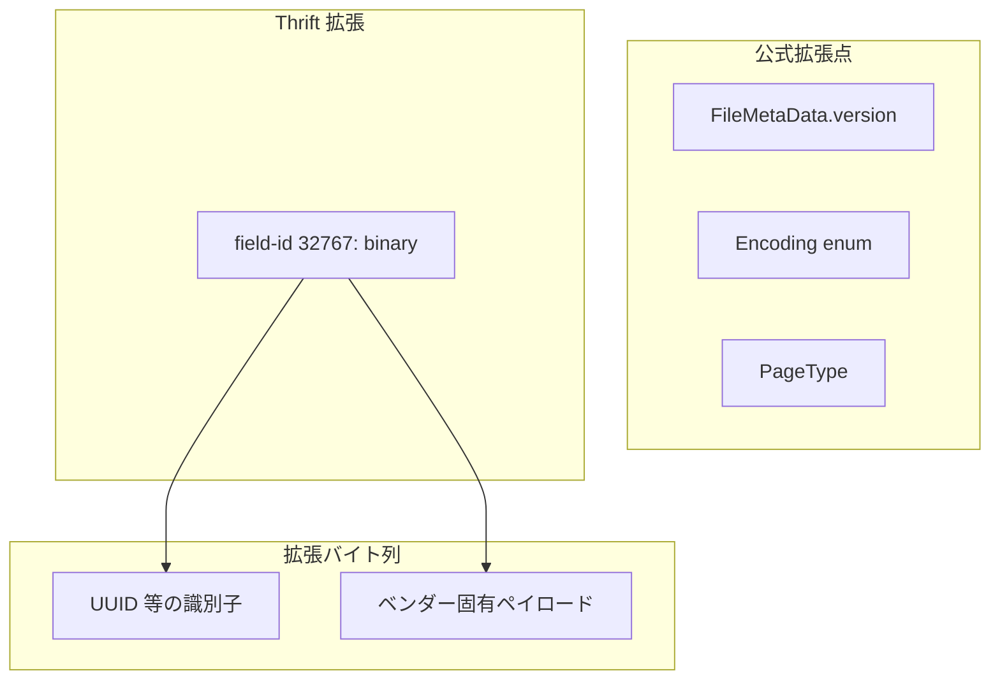
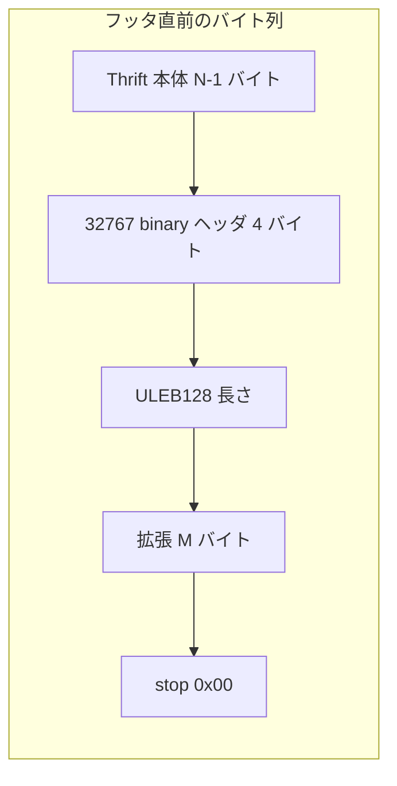

# 第17章 バイナリプロトコル拡張と設定

> **本章で読むソース**
>
> - [`BinaryProtocolExtensions.md`](https://github.com/apache/parquet-format/blob/apache-parquet-format-2.13.0/BinaryProtocolExtensions.md)
> - [`README.md`](https://github.com/apache/parquet-format/blob/apache-parquet-format-2.13.0/README.md)

## この章の狙い

Parquet が Thrift メタデータをどう拡張し、運用上どの設定を推奨するかを、BinaryProtocolExtensions.md と README.md の後半節に沿って説明する。
フィールド ID `32767` のバイナリ拡張、エラー回復の粒度、メタデータと列データの分離、推奨パラメータを押さえ、第16章の互換議論を「将来の変更をどう載せるか」へ接続する。

## 前提

第2章でファイル構造とフッタ、第16章でスキーマ進化と後方互換を読んでいること。
Thrift compact protocol の基本（フィールド ID と stop バイト）を知っていると、拡張のワイヤ表現が追いやすい。

## 仕様が示す拡張の入口

README.md は、フォーマットに互換拡張を入れられる箇所を列挙する。

[`README.md` L264-L268](https://github.com/apache/parquet-format/blob/apache-parquet-format-2.13.0/README.md#L264-L268)

```text
## Extensibility
There are many places in the format for compatible extensions:
- File Version: The file metadata contains a version.
- Encodings: Encodings are specified by enum and more can be added in the future.
- Page types: Additional page types can be added and safely skipped.
```

[`README.md` L272-L273](https://github.com/apache/parquet-format/blob/apache-parquet-format-2.13.0/README.md#L272-L273)

```text
Parquet Thrift IDL reserves field-id `32767` of every Thrift struct for extensions.
The (Thrift) type of this field is always `binary`.
```

README.md が列挙する拡張点のうち、既存読み手が未知値を安全にスキップできると明記されているのは追加ページ型だけである。
ファイル版やエンコーディング enum も将来の追加を想定しているが、未知ファイル版の受理や未知エンコーディングを使った既知ページの値復元は保証されない。
未知エンコーディングのページはデコードできず、ページ単位では読み飛ばせない。
Thrift 構造体はさらに、全 struct で **フィールド ID `32767`** の `binary` フィールドを予約する。



## バイナリプロトコル拡張の性質

BinaryProtocolExtensions.md は、`32767` 機構の利点を4点にまとめる。

[`BinaryProtocolExtensions.md` L22-L27](https://github.com/apache/parquet-format/blob/apache-parquet-format-2.13.0/BinaryProtocolExtensions.md#L22-L27)

```text
The extension mechanism of the `binary` Thrift field-id `32767` has some desirable properties:

* Existing readers will ignore these extensions without any modifications  
* Existing readers will ignore the extension bytes with little processing overhead  
* The content of the extension is freeform and can be encoded in any format. This format is not restricted to Thrift.  
* Extensions can be appended to existing Thrift serialized structs [without requiring Thrift libraries](#appending-extensions-to-thrift) for manipulation (or changes to the thrift IDL).
```

既存リーダーは改変なしで拡張を無視できる。
拡張本体は Thrift に限定されず、既存の直列化バイト列の末尾へ追記できる。

### 設計上の工夫：単一フィールド ID の希少性

予約 ID は1つだけである。

[`BinaryProtocolExtensions.md` L29-L35](https://github.com/apache/parquet-format/blob/apache-parquet-format-2.13.0/BinaryProtocolExtensions.md#L29-L35)

```text
Because only one field-id is reserved the extension bytes themselves require
disambiguation; otherwise readers will not be able to decode extensions safely.
This is left to implementers who MUST put enough unique state in their extension
bytes for disambiguation. This can be relatively easily achieved by adding a
[UUID](https://en.wikipedia.org/wiki/Universally\_unique\_identifier) at the
start or end of the extension bytes. The extension does not specify a
disambiguation mechanism to allow more flexibility to implementers.
```

拡張バイト列の先頭か末尾に UUID を置き、ベンダー間の衝突を避ける。
ID が1つしかないため、私的拡張を複数併用しにくく、標準化への圧力が働く。

[`BinaryProtocolExtensions.md` L45](https://github.com/apache/parquet-format/blob/apache-parquet-format-2.13.0/BinaryProtocolExtensions.md#L45)

```text
The choice to reserve only one field-id has an additional (and frankly unintended) property. It creates scarcity in the extension space and disincentivizes vendors from keeping their extensions private. As a vendor having an extension means one cannot use it in tandem with other extensions from other vendors even if such extensions are publicly known. The easiest path of interoperability and ability to further experiment is to push an extension through standardization and continue experimenting with other ideas internally on top of the (now) standardized version.
```

## ワイヤ上のレイアウト

`FileMetaData` を拡張する場合のバイト列は次のとおりである。

[`BinaryProtocolExtensions.md` L37-L43](https://github.com/apache/parquet-format/blob/apache-parquet-format-2.13.0/BinaryProtocolExtensions.md#L37-L43)

```text
Putting everything together in an example, if we would extend `FileMetaData` it would look like this on the wire.

    N-1 bytes | Thrift compact protocol encoded FileMetaData (minus \0 thrift stop field)
    4 bytes   | 08 FF FF 01 (long form header for 32767: binary)
    1-5 bytes | ULEB128(M) encoded size of the extension
    M bytes   | extension bytes
    1 byte    | \0 (thrift stop field)
```

元の Thrift 本体の stop バイト（`\0`）の直前に、フィールド `32767` の binary ヘッダと ULEB128 長さ付きペイロードを挿入する。
最後に stop を置き直す。



## 標準化への道

私的拡張はベンダー UUID で共存しうるが、公式採用時は移行経路を設計する。

[`BinaryProtocolExtensions.md` L47-L51](https://github.com/apache/parquet-format/blob/apache-parquet-format-2.13.0/BinaryProtocolExtensions.md#L47-L51)

```text
#### Path to standardization

So far the above specification shows how different vendors can add extensions without stepping on each other's toes. As long as extensions are private this works out ok.

Unavoidably (and desirably) some extensions will make it into the official specification. Depending on the nature of the extension, migration can take different paths. While it is out of the scope of this document to design all such migrations, we illustrate some of these paths in the [examples](#examples).
```

仕様書はすべての移行を規定するのではなく、Footer と Encoding の2例でパターンを示す。

## 例：フッタの FlatBuffers 置換

仮想例では、Thrift `FileMetaData` の代わりに FlatBuffers 表現を試す。

[`BinaryProtocolExtensions.md` L57-L74](https://github.com/apache/parquet-format/blob/apache-parquet-format-2.13.0/BinaryProtocolExtensions.md#L57-L74)

```text
### Footer

A variant of `FileMetaData` encoded in FlatBuffers is introduced. This variant is more performant and can scale to very wide tables, something that current Thrift `FileMetaData` struggles with.

In its private form the footer of a Parquet file will look like so:

    N-1 bytes | Thrift compact protocol encoded FileMetaData (minus \0 thrift stop field)
    4 bytes   | 08 FF FF 01 (long form header for 32767: binary)
    1-5 bytes | ULEB128(K+28) encoded size of the extension
    K bytes   | FlatBuffers representation (v0) of FileMetaData
    4 bytes   | little-endian crc32(flatbuffer)
    4 bytes   | little-endian size(flatbuffer)
    4 bytes   | little-endian crc32(size(flatbuffer))
    16 bytes  | some-UUID
    1 byte    | \0 (thrift stop field)
    4 bytes   | PAR1

some-UUID is some UUID picked for this extension and it is used throughout (possibly internal) experimentation. It is put at the end to allow detection of the extension when parsed in reverse. The little-endian sizes and crc32s are also to the end to facilitate efficient parsing the footer in reverse without requiring parsing the Thrift compact protocol that precedes it.
```

UUID と CRC、サイズを末尾に寄せると、ファイル末尾から逆方向にフッタを探索できる。
Thrift 全体を先にパースしなくても、拡張の有無を判定しやすい。

コミュニティ採用時の移行要件は次の3点である。

[`BinaryProtocolExtensions.md` L78-L82](https://github.com/apache/parquet-format/blob/apache-parquet-format-2.13.0/BinaryProtocolExtensions.md#L78-L82)

```text
The community reviews the proposal and (potentially) proposes changes to the FlatBuffers IDL representation. In addition, because this extension is a *replacement* of an existing struct, it must:

1. have some way of being extended in the future much like what it replaces. Because the extension mechanism only allows for a single extension, without this in place we cannot have footer extensions during the migration.  
2. consider its intermediate form where both the **Thrift** `FileMetaData` and the **FlatBuffers** `FileMetaData` will be present.  
3. consider its final form where the long form header for `32767: binary` may not be present.
```

移行期間中は Thrift と FlatBuffers の二重書き込みを行う。

[`BinaryProtocolExtensions.md` L84-L95](https://github.com/apache/parquet-format/blob/apache-parquet-format-2.13.0/BinaryProtocolExtensions.md#L84-L95)

```text
Once the design is ratified the new `FileMetaData` encoding is made final with the following migration plan. For the next N years writers will write both the Thrift and the FlatBuffers `FileMetaData`. It will look much like its private form except the FlatBuffers IDL may be different:

    N-1 bytes | Thrift compact protocol encoded FileMetaData (minus \0 thrift stop field)
    4 bytes   | 08 FF FF 01 (long form header for 32767: binary)
    1-5 bytes | ULEB128(K+28) encoded size of the extension
    K bytes   | FlatBuffers representation (v1) of FileMetaData
    4 bytes   | little-endian crc32(flatbuffer)
    4 bytes   | little-endian size(flatbuffer)
    4 bytes   | little-endian crc32(size(flatbuffer))
    16 bytes  | some-other-UUID
    1 byte    | \0 (thrift stop field)
    4 bytes   | PAR1
```

最終形では Thrift ラッパーが外れ、マジックも `PAR3` に変わる例が示される。

[`BinaryProtocolExtensions.md` L97-L103](https://github.com/apache/parquet-format/blob/apache-parquet-format-2.13.0/BinaryProtocolExtensions.md#L97-L103)

```text
After the migration period, the end of the Parquet file may look like this:

    K bytes   | FlatBuffers representation (v1) of FileMetaData
    4 bytes   | little-endian crc32(flatbuffer)
    4 bytes   | little-endian size(flatbuffer)
    4 bytes   | little-endian crc32(size(flatbuffer))
    4 bytes   | PAR3
```

設計判断の要点は次のとおりである。

[`BinaryProtocolExtensions.md` L105-L110](https://github.com/apache/parquet-format/blob/apache-parquet-format-2.13.0/BinaryProtocolExtensions.md#L105-L110)

```text
In this example, we see several design decisions for the extension at play:

* There is a new some-other-UUID for the accepted change to the standard and now the Thrift `FileMetaData` cannot be extended itself.  
* The length of the footer and the crc32 of the length itself, guarantees that new readers will not overshoot reading bytes in case of corrupt bits in these critical 8 bytes of the file.  
* The crc32 of the flatbuffer representation enhances Parquet to have crc32 for metadata as well which is arguably more important than crc32 for data.  
* The new encoding itself, which MUST contain some way to be extended in the future (much like Thrift does with this specification).
```

メタデータにも CRC を載せ、長さフィールド自体の CRC で末尾8バイトの破損時の読み越しを防ぐ。

## 例：エンコーディング拡張

新エンコーディングを試す間、旧エンコーディングの複製を残し、拡張で新データのオフセットを指す。

[`BinaryProtocolExtensions.md` L112-L115](https://github.com/apache/parquet-format/blob/apache-parquet-format-2.13.0/BinaryProtocolExtensions.md#L112-L115)

```text
### Encoding

The community experiments with a new encoding extension. At the same time they want to keep the newly encoded Parquet files open for everyone to read. So they add a new encoding via an extension to the `ColumnMetaData` struct. The extension stores offsets in the Parquet file where the new and duplicate encoded data for this column lives. The new writer carefully places all the new encodings at the start of the row group and all the old encodings at the end of the row group. This layout minimizes disruption for readers unaware of the new encodings.
```

未知のエンコーディングをロウグループ先頭に、既知の複製を末尾に置く。
旧リーダーは従来のオフセットだけを読めばよく、レイアウト変更の影響を局所化できる。

私的実験時のファイル配置は次のとおりである。

[`BinaryProtocolExtensions.md` L116-L132](https://github.com/apache/parquet-format/blob/apache-parquet-format-2.13.0/BinaryProtocolExtensions.md#L116-L132)

```text
In its private form Parquet files look like so:

    4 bytes   | PAR1
              |             | Column b (new encoding)
              |             | Column c (new encoding)
    R bytes   |  Row Group  | Column a
              |     0       | Column d
              |             | Column b (old encoding)
              |             | Column c (old encoding)
              |             | FileMetaData
              |             | ColumnMetaData: a
              |             | ColumnMetaData: b
    F bytes   |             | <extension-blob with offsets to new encoding>
              |             | ColumnMetaData: c
              |             | <extension-blob with offsets to new encoding>
              |             | ColumnMetaData: d
    4 bytes   | PAR1
```

拡張対応リーダーは Thrift IDL に `32767: binary` を含め、UUID を探してオフセットを復元する。

[`BinaryProtocolExtensions.md` L134-L136](https://github.com/apache/parquet-format/blob/apache-parquet-format-2.13.0/BinaryProtocolExtensions.md#L134-L136)

```text
The custom reader is compiled with thrift IDL with a binary for field with id 32767. This is done to become extension aware and inspect the extension bytes looking for the UUID disambiguator. If that’s found it decodes the offsets from the rest of the bytes and reads the region of the file containing the new encoding.

If/when the encoding is ratified, it is added to the official specification as an additional type in `Encodings` at which point the extension is no longer necessary, nor the duplicated data in the row group.
```

標準化後は `Encoding` enum へ昇格し、二重格納と拡張バイト列は不要になる。

## Thrift 直列化への拡張追記

Thrift ライブラリなしで拡張を付ける C++ 例がある。

[`BinaryProtocolExtensions.md` L141-L158](https://github.com/apache/parquet-format/blob/apache-parquet-format-2.13.0/BinaryProtocolExtensions.md#L141-L158)

```text
void AppendUleb(uint32_t x, std::string* out) {
  while (true) {
    uint8_t c = x & 0x7F;
    if (x < 0x80) return out->push_back(c);
    out->push_back(c + 0x80);
    x >>= 7;
  }
};

std::string AppendExtension(std::string thrift, const std::string& ext) {
  assert(thrift.back() == '\x00');   // there was a stop field in the first place
  thrift.back() = '\x08';      // replace stop field with binary type
  AppendUleb(32767, &thrift);  // field-id
  AppendUleb(ext.size(), &thrift);
  thrift += ext;
  thrift += '\x00';  // add the stop field
  return thrift;
}
```

末尾の `\0` を binary 型タグ `\x08` に差し替え、ULEB128 でフィールド ID `32767` と長さを書き、拡張バイト列と stop を足す。
IDL 変更なしで実験拡張を載せられる。

## エラー回復の粒度

破損がどの層まで波及するかは README.md に明示される。

[`README.md` L230-L235](https://github.com/apache/parquet-format/blob/apache-parquet-format-2.13.0/README.md#L230-L235)

```text
## Error recovery
If the file metadata is corrupt, the file is lost.  If the column metadata is corrupt,
that column chunk is lost (but column chunks for this column in other row groups are
okay).  If a page header is corrupt, the remaining pages in that chunk are lost.  If
the data within a page is corrupt, that page is lost.  The file will be more
resilient to corruption with smaller row groups.
```

ファイルメタデータ破損はファイル全体の喪失である。
列メタデータはチャンク単位、ページヘッダは当該チャンクの残りページ、ページデータは当該ページに限定される。
ロウグループを小さくすると、破損の影響範囲が狭まる。

将来拡張として、メタデータの定期書き込みが示される。

[`README.md` L237-L243](https://github.com/apache/parquet-format/blob/apache-parquet-format-2.13.0/README.md#L237-L243)

```text
Potential extension: With smaller row groups, the biggest issue is placing the file
metadata at the end.  If an error happens while writing the file metadata, all the
data written will be unreadable.  This can be fixed by writing the file metadata
every Nth row group.
Each file metadata would be cumulative and include all the row groups written so
far.  Combining this with the strategy used for RCFile or Avro files using sync markers,
a reader could recover partially written files.
```

フッタは通常ファイル末尾に1つであるため、書き込み失敗時に全データが読めなくなるリスクがある。
N ロウグループごとに累積メタデータを書けば、部分書き込みファイルの回復がしやすくなる。

## メタデータと列データの分離

フォーマットはメタデータとデータの分離を明示的に設計している。

[`README.md` L245-L248](https://github.com/apache/parquet-format/blob/apache-parquet-format-2.13.0/README.md#L245-L248)

```text
## Separating metadata and column data
The format is explicitly designed to separate the metadata from the data.  This
allows splitting columns into multiple files, as well as having a single metadata
file reference multiple parquet files.
```

列を別ファイルに分割したり、1つのメタデータが複数 Parquet ファイルを参照したりできる。
第2章のフッタ集中と合わせて、データ部だけを分散配置する基盤になる。

## 推奨設定

README.md はロウグループサイズとデータページサイズのトレードオフを述べる。

[`README.md` L250-L262](https://github.com/apache/parquet-format/blob/apache-parquet-format-2.13.0/README.md#L250-L262)

```text
## Configurations
- Row group size: Larger row groups allow for larger column chunks which makes it
possible to do larger sequential IO.  Larger groups also require more buffering in
the write path (or a two pass write).  We recommend large row groups (512MB - 1GB).
Since an entire row group might need to be read, we want it to completely fit on
one HDFS block.  Therefore, HDFS block sizes should also be set to be larger.  An
optimized read setup would be: 1GB row groups, 1GB HDFS block size, 1 HDFS block
per HDFS file.
- Data page size: Data pages should be considered indivisible so smaller data pages
allow for more fine-grained reading (e.g. single row lookup).  Larger page sizes
incur less space overhead (less page headers) and potentially less parsing overhead
(processing headers).  Note: for sequential scans, it is not expected to read a page
at a time; this is not the IO chunk.  We recommend 8KB for page sizes.
```

ロウグループを大きくすると順次 I/O と圧縮効率が上がる一方、書き込みバッファと破損時の影響範囲が増える。
データページを小さくすると細かい読み取りに向くが、ページヘッダのオーバーヘッドが増える。
順次スキャンではページ単位がそのまま I/O 単位になるわけではない点に注意する。

### 設計上の工夫：ロウグループと HDFS ブロックの整列

1GB ロウグループ、1GB HDFS ブロック、1ファイル1ブロックという組み合わせは、ロウグループ全体を1回の連続読み取りに収めるための推奨である。
エラー回復の節が小さなロウグループを勧めるのは耐障害性の話であり、スループット最適化とはトレードオフになる。

## まとめ

Parquet の拡張は、enum や版番号による公式拡張点と、Thrift `32767: binary` による実験的拡張の二層で構成される。
`32767` 拡張は既存リーダーを壊さず、UUID で識別し、標準化後は enum や本体フォーマットへ昇格する移行パターンを持つ。
README.md は破損粒度、メタデータ分離、ロウグループとページサイズの推奨を述べ、運用とフォーマット設計を接続する。

## 関連する章

- [第2章 ファイル構造](../part00-overview/02-file-structure.md)
- [第5章 基本エンコーディング](../part02-encoding/05-basic-encodings.md)
- [第7章 データページ](../part03-page/07-data-pages.md)
- [第16章 スキーマ進化と後方互換](16-schema-evolution.md)
