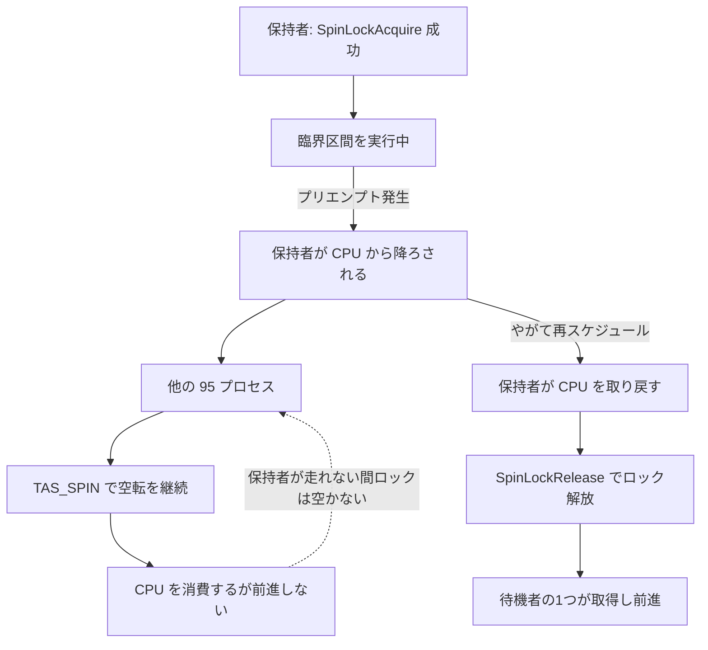

# 付録A　Linux カーネルの `PREEMPT_NONE` 廃止とスピンロックの性能問題

> **本付録で読むソース**
>
> - [`src/include/storage/spin.h`](https://github.com/postgres/postgres/blob/REL_18_4/src/include/storage/spin.h)
> - [`src/backend/storage/lmgr/README`](https://github.com/postgres/postgres/blob/REL_18_4/src/backend/storage/lmgr/README)
> - [`src/backend/storage/lmgr/s_lock.c`](https://github.com/postgres/postgres/blob/REL_18_4/src/backend/storage/lmgr/s_lock.c)
> - [`src/include/storage/s_lock.h`](https://github.com/postgres/postgres/blob/REL_18_4/src/include/storage/s_lock.h)
> - [`src/backend/storage/buffer/freelist.c`](https://github.com/postgres/postgres/blob/REL_18_4/src/backend/storage/buffer/freelist.c)
> - [`src/backend/port/sysv_shmem.c`](https://github.com/postgres/postgres/blob/REL_18_4/src/backend/port/sysv_shmem.c)

## この付録の狙い

2026 年、Linux カーネルが既定のプリエンプションモデルを変更したところ、PostgreSQL のスループットが特定のワークロードでおよそ半分まで落ちる、という報告が現れた。
発端は外部の検証記事である（[Linux 7.0 の `PREEMPT_NONE` 廃止で PostgreSQL のスループットが半減したという報告](https://lilting.ch/articles/linux-7-preempt-none-postgresql-throughput-halved)）。
記事はこの劣化の主因を PostgreSQL のスピンロックに帰し、緩和策として huge pages を挙げている。

本付録は、この現象を PostgreSQL 18.4 の実コードに即して読み解く。
特に区別したいのは、PostgreSQL のソースから直接確認できる事実と、記事が報告したベンチマーク結果やカーネル側の挙動である。
前者はスピンロックの設計契約と実装そのものであり、後者は本付録では確かめようがない外部の観測である。
記事が報告するカーネルの変更とベンチマーク値については、すべて「記事によれば」「報告では」と帰属を明示して述べる。

加えて、もう一つの訂正がある。
記事はボトルネックを `BufFreeListLock` と呼ぶが、これは歴史的な名称である。
PostgreSQL 18.4 でバッファのフリーリストを保護するのは、`freelist.c` のスピンロック `buffer_strategy_lock` である。
本付録では 18.4 の実コードが何をしているかに沿って、この点を後述する。

## 前提

スピンロックそのものの実装は[第36章　スピンロック](../part08-transactions-concurrency/36-spinlocks.md)で扱う。
バッファ管理とフリーリストの仕組みは[第22章　共有バッファとバッファ管理](../part05-storage-buffer/22-buffer-manager.md)と[第23章　バッファ置換戦略とフリーリスト](../part05-storage-buffer/23-buffer-replacement-strategy.md)で扱う。
本付録はそれらの内容を前提に、スピンロックの設計契約がカーネルのスケジューリング前提に依存していること、その前提が崩れたときに何が起きるかを述べる。

## スピンロックの設計契約

PostgreSQL のスピンロックは、ごく短い臨界区間を守るためだけの道具として設計されている。
この前提は API ヘッダのコメントに明文化されている。

[`src/include/storage/spin.h` L33-L36](https://github.com/postgres/postgres/blob/REL_18_4/src/include/storage/spin.h#L33-L36)

```c
 *	Keep in mind the coding rule that spinlocks must not be held for more
 *	than a few instructions.  In particular, we assume it is not possible
 *	for a CHECK_FOR_INTERRUPTS() to occur while holding a spinlock, and so
 *	it is not necessary to do HOLD/RESUME_INTERRUPTS() in these macros.
```

「スピンロックを数命令以上保持してはならない」という規約が、ここで言語化されている。
ロックマネージャの README も、スピンロックを「*very* short-term locks」と位置づけ、その想定保持時間の短さを強調する。

[`src/backend/storage/lmgr/README` L8-L18](https://github.com/postgres/postgres/blob/REL_18_4/src/backend/storage/lmgr/README#L8-L18)

```text
* Spinlocks.  These are intended for *very* short-term locks.  If a lock
is to be held more than a few dozen instructions, or across any sort of
kernel call (or even a call to a nontrivial subroutine), don't use a
spinlock. Spinlocks are primarily used as infrastructure for lightweight
locks. They are implemented using a hardware atomic-test-and-set
instruction, if available.  Waiting processes busy-loop until they can
get the lock. There is no provision for deadlock detection, automatic
release on error, or any other nicety.  There is a timeout if the lock
cannot be gotten after a minute or so (which is approximately forever in
comparison to the intended lock hold time, so this is certainly an error
condition).
```

待機するプロセスはロックを取れるまでビジーループで回り、スリープしない。
カーネル呼び出しをまたぐ用途は禁じられ、数十命令を超える保持も避けるよう求められている。
この設計が成り立つのは、ロックを保持したプロセスが臨界区間を必ず短時間で走り抜け、待機者がビジーループしているわずかな間にロックを手放す、という前提があるからである。
言い換えれば、スピンロックの効率は「保持者が CPU を握り続け、すぐ解放する」というスケジューリング上の暗黙の仮定に依存している。

## スピンロックの実装と待機

スピンロックの取得は、ハードウェアのアトミックなテストアンドセット命令を起点とする。
`spin.h` のマクロは下位のハードウェア依存マクロへ展開される。

[`src/include/storage/spin.h` L57-L63](https://github.com/postgres/postgres/blob/REL_18_4/src/include/storage/spin.h#L57-L63)

```c
#define SpinLockInit(lock)	S_INIT_LOCK(lock)

#define SpinLockAcquire(lock) S_LOCK(lock)

#define SpinLockRelease(lock) S_UNLOCK(lock)

#define SpinLockFree(lock)	S_LOCK_FREE(lock)
```

ロック取得の中核は `TAS` と `TAS_SPIN` である。
`TAS` はアトミックなテストアンドセットで、待たずに一度だけ取得を試みる。
`TAS_SPIN` は競合が判明したロックを待つ版で、アーキテクチャによってはロック解放をアンロック命令で監視し、空いたときだけアトミック命令を再実行する。

[`src/include/storage/s_lock.h` L38-L56](https://github.com/postgres/postgres/blob/REL_18_4/src/include/storage/s_lock.h#L38-L56)

```c
 *	int TAS(slock_t *lock)
 *		Atomic test-and-set instruction.  Attempt to acquire the lock,
 *		but do *not* wait.	Returns 0 if successful, nonzero if unable
 *		to acquire the lock.
 *
 *	int TAS_SPIN(slock_t *lock)
 *		Like TAS(), but this version is used when waiting for a lock
 *		previously found to be contended.  By default, this is the
 *		same as TAS(), but on some architectures it's better to poll a
 *		contended lock using an unlocked instruction and retry the
 *		atomic test-and-set only when it appears free.
 *
 *	TAS() and TAS_SPIN() are NOT part of the API, and should never be called
 *	directly.
 *
 *	CAUTION: on some platforms TAS() and/or TAS_SPIN() may sometimes report
 *	failure to acquire a lock even when the lock is not locked.  For example,
 *	on Alpha TAS() will "fail" if interrupted.  Therefore a retry loop must
 *	always be used, even if you are certain the lock is free.
```

最初の `TAS` が失敗すると、待機側はプラットフォーム非依存の `s_lock` へ入る。
`s_lock` は `TAS_SPIN` が成功するまでループし、失敗のたびに `perform_spin_delay` を呼ぶ。

[`src/backend/storage/lmgr/s_lock.c` L97-L112](https://github.com/postgres/postgres/blob/REL_18_4/src/backend/storage/lmgr/s_lock.c#L97-L112)

```c
int
s_lock(volatile slock_t *lock, const char *file, int line, const char *func)
{
	SpinDelayStatus delayStatus;

	init_spin_delay(&delayStatus, file, line, func);

	while (TAS_SPIN(lock))
	{
		perform_spin_delay(&delayStatus);
	}

	finish_spin_delay(&delayStatus);

	return delayStatus.delays;
}
```

`perform_spin_delay` は、まず `SPIN_DELAY()` で CPU 固有の短い待機を入れ、一定回数空転したら `pg_usleep` で実際にスリープする。
スリープするたびに遅延時間を 1 ミリ秒からおよそ 1 秒まで指数的に伸ばし、上限を超えたら最小値へ戻す。
そして `NUM_DELAYS` 回（18.4 では 1000 回）スリープしても取れなければ、`s_lock_stuck` を呼んで PANIC する。

[`src/backend/storage/lmgr/s_lock.c` L125-L166](https://github.com/postgres/postgres/blob/REL_18_4/src/backend/storage/lmgr/s_lock.c#L125-L166)

```c
void
perform_spin_delay(SpinDelayStatus *status)
{
	/* CPU-specific delay each time through the loop */
	SPIN_DELAY();

	/* Block the process every spins_per_delay tries */
	if (++(status->spins) >= spins_per_delay)
	{
		if (++(status->delays) > NUM_DELAYS)
			s_lock_stuck(status->file, status->line, status->func);

		if (status->cur_delay == 0) /* first time to delay? */
			status->cur_delay = MIN_DELAY_USEC;

		/*
		 * Once we start sleeping, the overhead of reporting a wait event is
		 * justified. Actively spinning easily stands out in profilers, but
		 * sleeping with an exponential backoff is harder to spot...
		 *
		 * We might want to report something more granular at some point, but
		 * this is better than nothing.
		 */
		pgstat_report_wait_start(WAIT_EVENT_SPIN_DELAY);
		pg_usleep(status->cur_delay);
		pgstat_report_wait_end();

#if defined(S_LOCK_TEST)
		fprintf(stdout, "*");
		fflush(stdout);
#endif

		/* increase delay by a random fraction between 1X and 2X */
		status->cur_delay += (int) (status->cur_delay *
									pg_prng_double(&pg_global_prng_state) + 0.5);
		/* wrap back to minimum delay when max is exceeded */
		if (status->cur_delay > MAX_DELAY_USEC)
			status->cur_delay = MIN_DELAY_USEC;

		status->spins = 0;
	}
}
```

ここで定数を確認しておく。

[`src/backend/storage/lmgr/s_lock.c` L57-L61](https://github.com/postgres/postgres/blob/REL_18_4/src/backend/storage/lmgr/s_lock.c#L57-L61)

```c
#define MIN_SPINS_PER_DELAY 10
#define MAX_SPINS_PER_DELAY 1000
#define NUM_DELAYS			1000
#define MIN_DELAY_USEC		1000L
#define MAX_DELAY_USEC		1000000L
```

待機の流れは「アトミックなテストアンドセット、空転、スリープする、最終的に行き詰まりとして PANIC」という段階を踏む。
この設計は、保持者がすぐロックを手放すことを期待している。
高速化の工夫として読めるのは、最初の空転段階だ。
保持時間が数命令で済むなら、待機者は CPU を手放してカーネルへ降りる費用を払う前に、空転している間にロックを取り直せる。
これは「ロックは一瞬で空く」という前提に賭けたコストの先送りである。

## なぜプリエンプトに弱いか

この賭けが外れるのは、ロックを保持したプロセスが臨界区間の途中でプリエンプトされ、CPU を奪われたときである。
保持者が走らない間、待機者は CPU 上で空転し続け、いずれスリープする。
保持者が CPU を取り戻すまで臨界区間は終わらず、その間ずっと待機者は無駄に CPU を焼く。

注目すべきは、`s_lock.c` 冒頭のコメントが、この失敗モードをすでに予期している点である。

[`src/backend/storage/lmgr/s_lock.c` L21-L31](https://github.com/postgres/postgres/blob/REL_18_4/src/backend/storage/lmgr/s_lock.c#L21-L31)

```c
 * Once we do decide to block, we use randomly increasing pg_usleep()
 * delays. The first delay is 1 msec, then the delay randomly increases to
 * about one second, after which we reset to 1 msec and start again.  The
 * idea here is that in the presence of heavy contention we need to
 * increase the delay, else the spinlock holder may never get to run and
 * release the lock.  (Consider situation where spinlock holder has been
 * nice'd down in priority by the scheduler --- it will not get scheduled
 * until all would-be acquirers are sleeping, so if we always use a 1-msec
 * sleep, there is a real possibility of starvation.)  But we can't just
 * clamp the delay to an upper bound, else it would take a long time to
 * make a reasonable number of tries.
```

このコメントは、スケジューラによって優先度を下げられた（nice された）保持者が、待機者が全員スリープするまでスケジュールされず、そのため飢餓（starvation）が起こりうる、と述べている。
スリープの遅延を指数的に増やすのは、待機者が早くスリープすることで保持者に CPU を譲り、保持者が走って解放できるようにするためである。
ここで想定されているのは「保持者が優先度引き下げで走れない」という状況だが、その構造はプリエンプションそのものと同じだ。
保持者が CPU を奪われて走れず、待機者が空転して場を占めてしまう、という連鎖である。
スピンロックの待機ループは、保持者がプリエンプトされうる世界を、限定的ながらすでに視野に入れていたと読める。

ここまでの議論は特定の1ロックに限らない。
PostgreSQL のスピンロックは総じて「保持者は数命令で完了し、その間プリエンプトされない」という前提に立つ。
その前提は PostgreSQL のコードからは保証できず、カーネルのスケジューリング方針に委ねられている。
特定のロックが「最も熱い」のは、そのロックを取り合うプロセス数とロック取得の頻度の問題であって、弱点の所在はスピンロック機構そのものにある。



## 最も熱い臨界区間

このワークロードで最も激しく競合する臨界区間が、バッファのフリーリストを保護するスピンロックである。
そのロックは `freelist.c` の制御構造体に置かれている。

[`src/backend/storage/buffer/freelist.c` L30-L33](https://github.com/postgres/postgres/blob/REL_18_4/src/backend/storage/buffer/freelist.c#L30-L33)

```c
typedef struct
{
	/* Spinlock: protects the values below */
	slock_t		buffer_strategy_lock;
```

ここで名称を訂正する。
記事はこのボトルネックを `BufFreeListLock` と呼ぶが、それは歴史的な名称である。
PostgreSQL 18.4 でフリーリストとバッファ置換を保護するのはスピンロック `buffer_strategy_lock` であり、かつての LWLock `BufFreeListLock` はスピンロックとアトミックなクロックスイープへ置き換えられている。
バッファ管理の README も、このロックが軽量ロックではなくスピンロックである理由を効率に求め、保持中は他のいかなるロックも取らないと述べる。

[`src/backend/storage/buffer/README` L130-L135](https://github.com/postgres/postgres/blob/REL_18_4/src/backend/storage/buffer/README#L130-L135)

```text
* A separate system-wide spinlock, buffer_strategy_lock, provides mutual
exclusion for operations that access the buffer free list or select
buffers for replacement.  A spinlock is used here rather than a lightweight
lock for efficiency; no other locks of any sort should be acquired while
buffer_strategy_lock is held.  This is essential to allow buffer replacement
to happen in multiple backends with reasonable concurrency.
```

`StrategyGetBuffer` が、空きバッファをフリーリストから1つ取り出すために、このスピンロックを取得する。
取得する区間は、リストの先頭を読み、それを取り外し、リンクを更新するだけのごく短い処理である。

[`src/backend/storage/buffer/freelist.c` L268-L292](https://github.com/postgres/postgres/blob/REL_18_4/src/backend/storage/buffer/freelist.c#L268-L292)

```c
	if (StrategyControl->firstFreeBuffer >= 0)
	{
		while (true)
		{
			/* Acquire the spinlock to remove element from the freelist */
			SpinLockAcquire(&StrategyControl->buffer_strategy_lock);

			if (StrategyControl->firstFreeBuffer < 0)
			{
				SpinLockRelease(&StrategyControl->buffer_strategy_lock);
				break;
			}

			buf = GetBufferDescriptor(StrategyControl->firstFreeBuffer);
			Assert(buf->freeNext != FREENEXT_NOT_IN_LIST);

			/* Unconditionally remove buffer from freelist */
			StrategyControl->firstFreeBuffer = buf->freeNext;
			buf->freeNext = FREENEXT_NOT_IN_LIST;

			/*
			 * Release the lock so someone else can access the freelist while
			 * we check out this buffer.
			 */
			SpinLockRelease(&StrategyControl->buffer_strategy_lock);
```

この臨界区間は、まさにスピンロックが想定する「数命令」の用途に合っている。
ロックを取り、フリーリストの先頭を付け替え、すぐ手放す。
取得から解放までの間にカーネル呼び出しはなく、ポインタの読み書きだけが並ぶ。
保持者がこの区間を一瞬で走り抜けるなら、競合してもコストはわずかで済む。
裏を返せば、この一瞬の区間の最中に保持者が CPU を奪われると、想定が崩れる。
ただし 18.4 では、すべてのバッファ取得がこの臨界区間を通るわけではない。
`StrategyGetBuffer` はまずリング戦略を試し、フリーリストはその先頭が空でないときだけ参照する。
定常状態でフリーリストが尽きると、取得はクロックスイープへ移る。
クロックスイープは犠牲候補を指す `nextVictimBuffer` をアトミックに進め、`buffer_strategy_lock` を取るのは針が一周したときの統計更新などに限られる。
記事がこのロックを最も熱いボトルネックと報告したのは特定の pgbench ワークロードでの観測であり、その計測結果は外部の報告として扱う。

## カーネル側の変化とベンチマーク結果

ここからはコードでは確かめられない、記事が報告した内容である。

記事によれば、Linux 7.0 で主要アーキテクチャから `PREEMPT_NONE` と `PREEMPT_VOLUNTARY` が削除され、`PREEMPT_LAZY`（6.13 で導入され、タイムスライス境界でのみプリエンプトする方式）へ一本化された。
報告では、`PREEMPT_NONE` の下ではスピンロックの保持者がプリエンプトされず、臨界区間が短時間で完了していた。
一方 `PREEMPT_LAZY` の下では、保持者もプリエンプトされうる。
記事によれば、96 コアの環境で保持者がプリエンプトされると、残り 95 プロセスがビジーウェイトに入って連鎖的に競合し、プロファイル上では CPU の 55% が `s_lock` で消費されたという。

ベンチマークの条件と結果も記事の報告として引く。
報告では、AWS の m8g.24xlarge（Graviton4、96 vCPU）上で PostgreSQL 17 を用い、pgbench の simple-update を 1024 クライアント、96 スレッド、1200 秒で実行している。
記事によれば、`PREEMPT_LAZY` ではおよそ 50,751 TPS、`PREEMPT_NONE` を復元するとおよそ 98,565 TPS となり、およそ 49% の低下が観測された。
これらの数値とカーネル挙動は本付録では検証できないため、外部の観測として扱う。

PostgreSQL 18.4 のコードから言えるのは、この報告された挙動が前節までの分析と整合する、ということだけである。
スピンロックは保持者がプリエンプトされない前提に立ち、その前提が崩れると待機者が空転して CPU を焼く。
報告された `s_lock` のプロファイル占有は、その失敗モードが実際に起きたときに現れる症状と一致する。

## 緩和策としての huge pages

記事は緩和策として huge pages を挙げ、`huge_pages = on` でスループットがほぼ回復したと報告している。
なぜ huge pages が効くのかは、スピンロックの保持時間という観点から説明できる。

スピンロックを保持している間にマイナーページフォルトが起きると、フォルト処理の分だけ臨界区間が伸びる。
4KB ページではバックエンドが共有メモリへ初めて触れるたびにマイナーフォルトが積み上がり、その処理中に保持者がプリエンプトや遅延の対象となれば、本来数命令で終わるはずの区間が長引く。
huge page は1ページで広い範囲を覆うため、TLB ミスとフォルトの回数がともに減り、保持中にフォルトを踏む確率が下がる。
結果として保持時間が短く保たれ、スピンロックの前提に近づく、と考えられる。

PostgreSQL は Linux で共有メモリを確保するとき、huge page を試みる経路を持つ。
`GetHugePageSize` が huge page のサイズと mmap フラグを求める。

[`src/backend/port/sysv_shmem.c` L478-L481](https://github.com/postgres/postgres/blob/REL_18_4/src/backend/port/sysv_shmem.c#L478-L481)

```c
void
GetHugePageSize(Size *hugepagesize, int *mmap_flags)
{
#ifdef MAP_HUGETLB
```

そのフラグの実体が `MAP_HUGETLB` である。

[`src/backend/port/sysv_shmem.c` L543-L543](https://github.com/postgres/postgres/blob/REL_18_4/src/backend/port/sysv_shmem.c#L543-L543)

```c
	mmap_flags_local = MAP_HUGETLB;
```

匿名共有セグメントを作る `CreateAnonymousSegment` が、`huge_pages` の設定に応じて huge page での確保を `mmap` で試みる。

[`src/backend/port/sysv_shmem.c` L609-L628](https://github.com/postgres/postgres/blob/REL_18_4/src/backend/port/sysv_shmem.c#L609-L628)

```c
	if (huge_pages == HUGE_PAGES_ON || huge_pages == HUGE_PAGES_TRY)
	{
		/*
		 * Round up the request size to a suitable large value.
		 */
		Size		hugepagesize;
		int			mmap_flags;

		GetHugePageSize(&hugepagesize, &mmap_flags);

		if (allocsize % hugepagesize != 0)
			allocsize += hugepagesize - (allocsize % hugepagesize);

		ptr = mmap(NULL, allocsize, PROT_READ | PROT_WRITE,
				   PG_MMAP_FLAGS | mmap_flags, -1, 0);
		mmap_errno = errno;
		if (huge_pages == HUGE_PAGES_TRY && ptr == MAP_FAILED)
			elog(DEBUG1, "mmap(%zu) with MAP_HUGETLB failed, huge pages disabled: %m",
				 allocsize);
	}
```

`huge_pages` の値は GUC で制御され、`on` を指定すると huge page での確保を要求し、`try` なら可能なら使う。
記事によれば、huge pages はスピンロック保持中のページフォルトをほぼ解消し、スループットを回復させた。
huge pages はあくまで保持時間を短く保つ間接的な緩和であって、保持者がプリエンプトされうるという前提そのものを変えるわけではない。

記事はさらに、RSEQ のタイムスライス拡張 API は移植性の理由で採用しなかったと述べ、根本対処として trunk では当該ロック周辺のリファクタが完了したものの、14 から 17 にはバックポートされていないと報告している。
これらも本付録では検証できないため、外部の報告として扱う。
根本的な方向としては、最も熱い臨界区間を狭めるか、スピンロックそのものをアトミック操作で置き換えて、保持者がプリエンプトされても他者が前進できるようにする道がある、と考えられる。

## まとめ

PostgreSQL のスピンロックは、保持者が数命令で臨界区間を走り抜けることを前提に置く。
`spin.h` の規約と `README` が明文化しているのは「数命令だけ保持し、カーネル呼び出しをまたがない」という点であり、保持者がプリエンプトされないとまでは書いていない。
待機ループの実装は保持者がすぐ解放することに賭けてコストを先送りしているが、その効率はスケジューラが保持者を走らせ続けることに暗黙に頼っている。
前提が崩れて保持者が臨界区間の途中で CPU を奪われると、待機者は空転して CPU を焼き、連鎖的な競合が起こる。
`s_lock.c` のコメントは、優先度引き下げによる類似の飢餓をすでに視野に入れていた。

記事が報告したカーネルの変更（`PREEMPT_NONE` から `PREEMPT_LAZY` への一本化）とベンチマーク結果は、この失敗モードと整合する。
最も熱い臨界区間は、記事が `BufFreeListLock` と呼ぶものに相当するが、18.4 の実体はフリーリストを守るスピンロック `buffer_strategy_lock` である。
緩和策の huge pages は、保持中のページフォルトを減らして保持時間を短く保つことで効く。
弱点は特定の1ロックではなく、スピンロック機構がカーネルのスケジューリング前提に依存していること自体にある。

## 関連する章

- [第22章　共有バッファとバッファ管理](../part05-storage-buffer/22-buffer-manager.md)
- [第23章　バッファ置換戦略とフリーリスト](../part05-storage-buffer/23-buffer-replacement-strategy.md)
- [第36章　スピンロック](../part08-transactions-concurrency/36-spinlocks.md)
