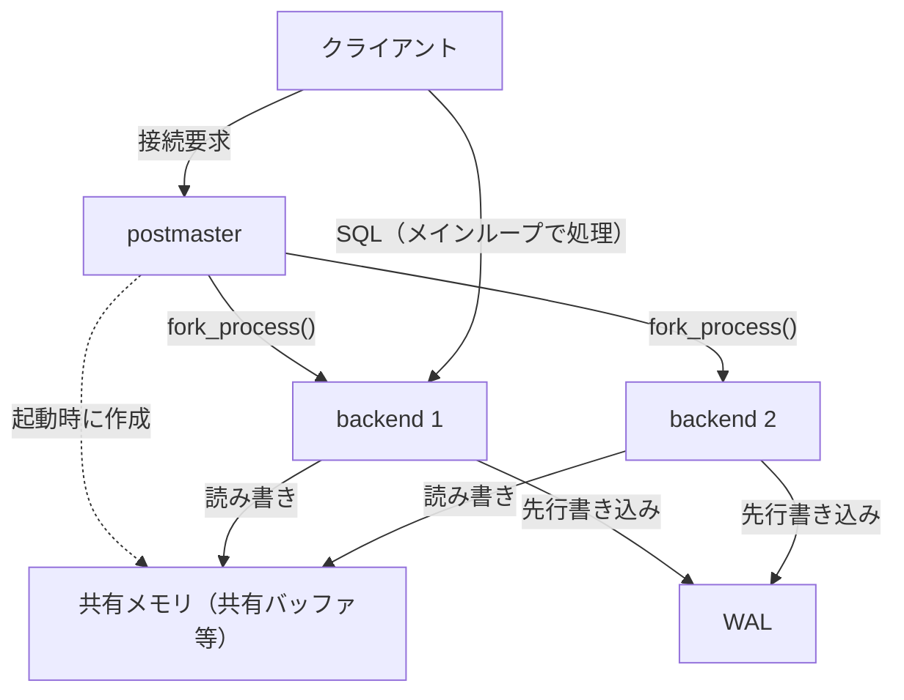

# 第1章 PostgreSQL とは何か

> **本章で読むソース**
>
> - [`src/backend/main/main.c`](https://github.com/postgres/postgres/blob/REL_18_4/src/backend/main/main.c)
> - [`src/backend/postmaster/postmaster.c`](https://github.com/postgres/postgres/blob/REL_18_4/src/backend/postmaster/postmaster.c)
> - [`src/backend/postmaster/launch_backend.c`](https://github.com/postgres/postgres/blob/REL_18_4/src/backend/postmaster/launch_backend.c)
> - [`src/backend/tcop/postgres.c`](https://github.com/postgres/postgres/blob/REL_18_4/src/backend/tcop/postgres.c)
> - [`configure.ac`](https://github.com/postgres/postgres/blob/REL_18_4/configure.ac)

## この章の狙い

本書は **PostgreSQL** 18.4 のソースコードを、起動から問い合わせ処理、ストレージ、トランザクション、WAL とリカバリまで順に読む。
この第1章はその入口として、PostgreSQL がどんなシステムかを四つの柱で概観する。
リレーショナルデータベースであること、追記型のストレージと **MVCC**（多版型同時実行制御）で版を管理すること、WAL によって永続性を保証すること、アクセスメソッドを差し替えられる拡張性を持つことの四つである。

そのうえで本章は、これらの柱を載せる土台である**プロセスモデル**を核に据える。
PostgreSQL は1つの接続を1つのバックエンドプロセスが担当するフォーク型のサーバである。
各プロセスは独立したアドレス空間を持ちながら、共有メモリと WAL を介して協調する。
この構造を `main.c` の起動分岐から `postmaster.c` のフォーク、`postgres.c` のメインループまでをたどって示し、各テーマの詳細は後続章へのリンクで橋渡しする。

## 前提

対象は安定版リリースの PostgreSQL 18.4 である。
バージョンはビルド設定の冒頭で宣言されている。

[`configure.ac` L20-L20](https://github.com/postgres/postgres/blob/REL_18_4/configure.ac#L20-L20)

```text
AC_INIT([PostgreSQL], [18.4], [pgsql-bugs@lists.postgresql.org], [], [https://www.postgresql.org/])
```

本章はソースの所在と起動経路を俯瞰するにとどめ、各サブシステムの内部には踏み込まない。
個別の仕組みは該当する後続章で読む。

## PostgreSQL を支える四つの柱

PostgreSQL はリレーショナルデータベース管理システムである。
データを行と列からなるテーブルに格納し、SQL で問い合わせる。
本書ではこのうち、サーバ内部の実装を性能と正しさの観点から読み解く。
入口として、内部実装を貫く四つの柱を先に名付けておく。

第一の柱は**追記型ストレージ**と MVCC である。
PostgreSQL は行を更新するとき、既存の行を上書きせず、新しい版のタプルを書き足す。
各タプルは自分を作成したトランザクションと削除したトランザクションの識別子（xid）を持ち、読み手は自分のスナップショットに照らしてどの版が見えるかを判定する。
これにより、読み手は書き手をブロックせず、書き手は読み手をブロックしない。
可視性判定の規則は[第27章 MVCC と可視性判定](../part06-table-mvcc/27-mvcc-and-visibility.md)で読む。
上書きしない設計の代償として不要になった版（デッドタプル）がたまるため、これを回収する VACUUM が必要になる。
回収の仕組みは[第28章 VACUUM と HOT](../part06-table-mvcc/28-vacuum-and-hot.md)で扱う。

第二の柱は WAL（先行書き込みログ）による永続性である。
PostgreSQL はデータページの変更をディスクに書き戻す前に、その変更を記録した WAL レコードを先にログへ書き出す。
クラッシュで未書き込みのページが失われても、WAL を再生すれば変更を復元できる。
WAL の構造と再生の仕組みは[第38章 WAL の仕組み](../part09-wal-recovery/38-wal.md)で読む。

第三の柱はバッファ管理である。
ディスク上のページは共有メモリ上の**共有バッファ**に読み込まれ、複数のバックエンドがそこを通してデータを読み書きする。
どのページをメモリに残すかの置換戦略が、ディスクアクセスの回数を左右する。
共有バッファの構造は[第22章 共有バッファとバッファ管理](../part05-storage-buffer/22-buffer-manager.md)で読む。

第四の柱は拡張性である。
テーブルやインデックスへのアクセスは**アクセスメソッド**という抽象を介して行われ、実装を差し替えられる。
たとえばインデックスは B-tree、GiST、GIN、BRIN などが共通のインターフェースに従い、同じプランナとエグゼキュータから一様に呼ばれる。
インデックスアクセスメソッドの抽象は[第30章 インデックスアクセスメソッド](../part07-indexes/30-index-access-method.md)で読む。

これら四つの柱は、いずれも複数のプロセスが同じデータを安全に共有することを前提にしている。
そこで本章の残りは、その共有を成り立たせるプロセスモデルに集中する。

## プロセスモデル

PostgreSQL のサーバは複数のプロセスから構成される。
中心にいるのが `postmaster` で、クライアントからの接続を受け付け、接続ごとに1つの**バックエンド**プロセスをフォークして処理を任せる。
この役割分担は `postmaster.c` の冒頭コメントに明記されている。

[`src/backend/postmaster/postmaster.c` L4-L23](https://github.com/postgres/postgres/blob/REL_18_4/src/backend/postmaster/postmaster.c#L4-L23)

```c
 *	  This program acts as a clearing house for requests to the
 *	  POSTGRES system.  Frontend programs connect to the Postmaster,
 *	  and postmaster forks a new backend process to handle the
 *	  connection.
 *
 *	  The postmaster also manages system-wide operations such as
 *	  startup and shutdown. The postmaster itself doesn't do those
 *	  operations, mind you --- it just forks off a subprocess to do them
 *	  at the right times.  It also takes care of resetting the system
 *	  if a backend crashes.
 *
 *	  The postmaster process creates the shared memory and semaphore
 *	  pools during startup, but as a rule does not touch them itself.
 *	  In particular, it is not a member of the PGPROC array of backends
 *	  and so it cannot participate in lock-manager operations.  Keeping
 *	  the postmaster away from shared memory operations makes it simpler
 *	  and more reliable.  The postmaster is almost always able to recover
 *	  from crashes of individual backends by resetting shared memory;
 *	  if it did much with shared memory then it would be prone to crashing
 *	  along with the backends.
```

ここに、このモデルの設計の要点が二つ書かれている。
`postmaster` は起動時に共有メモリとセマフォを用意するが、原則として自分ではそこに触れない。
共有メモリ操作から `postmaster` を遠ざけておくことで、あるバックエンドが共有メモリ上のロックやデータを壊しても、`postmaster` 自身は巻き添えにならずに済む。
そのため `postmaster` は、個々のバックエンドがクラッシュしても共有メモリをリセットして全体を復旧できる。

### 起動時のモード分岐

サーバの実行ファイルはどのモードでも同じ `main` から始まる。
`main` は引数の先頭を見て、`postmaster` として動くか、ブートストラップやシングルユーザなど別のモードで動くかを決める。

[`src/backend/main/main.c` L204-L229](https://github.com/postgres/postgres/blob/REL_18_4/src/backend/main/main.c#L204-L229)

```c
	switch (dispatch_option)
	{
		case DISPATCH_CHECK:
			BootstrapModeMain(argc, argv, true);
			break;
		case DISPATCH_BOOT:
			BootstrapModeMain(argc, argv, false);
			break;
		case DISPATCH_FORKCHILD:
#ifdef EXEC_BACKEND
			SubPostmasterMain(argc, argv);
#else
			Assert(false);		/* should never happen */
#endif
			break;
		case DISPATCH_DESCRIBE_CONFIG:
			GucInfoMain();
			break;
		case DISPATCH_SINGLE:
			PostgresSingleUserMain(argc, argv,
								   strdup(get_user_name_or_exit(progname)));
			break;
		case DISPATCH_POSTMASTER:
			PostmasterMain(argc, argv);
			break;
	}
```

引数に特別なモード指定がなければ `dispatch_option` は `DISPATCH_POSTMASTER` のままになり、`PostmasterMain` が呼ばれる。
これが通常のサーバ起動で、ここから `postmaster` が接続を待ち受ける常駐プロセスになる。
`PostmasterMain` の内部で何が初期化されるかは[第4章 postmaster とプロセスの起動](../part01-process-memory/04-postmaster-and-processes.md)で読む。

### 接続ごとのフォーク

`postmaster` は接続要求を受け取ると、ただちにフォークして子プロセスを作る。
`postmaster.c` のコメントは、なぜフォークを即座に行うのかを説明している。

[`src/backend/postmaster/postmaster.c` L25-L32](https://github.com/postgres/postgres/blob/REL_18_4/src/backend/postmaster/postmaster.c#L25-L32)

```c
 *	  When a request message is received, we now fork() immediately.
 *	  The child process performs authentication of the request, and
 *	  then becomes a backend if successful.  This allows the auth code
 *	  to be written in a simple single-threaded style (as opposed to the
 *	  crufty "poor man's multitasking" code that used to be needed).
 *	  More importantly, it ensures that blockages in non-multithreaded
 *	  libraries like SSL or PAM cannot cause denial of service to other
 *	  clients.
```

認証を子プロセス側で行うことで、認証コードを単純な単一スレッド型で書ける。
さらに重要な利点として、SSL や PAM のようなスレッド非対応のライブラリが認証中に長時間ブロックしても、それは1つの子プロセス内に閉じ込められ、ほかのクライアントへのサービス停止につながらない。

接続を受け付けたあとの実際のフォークは `BackendStartup` が起こす。
子スロットを確保してから `postmaster_child_launch` を呼ぶ。

[`src/backend/postmaster/postmaster.c` L3569-L3571](https://github.com/postgres/postgres/blob/REL_18_4/src/backend/postmaster/postmaster.c#L3569-L3571)

```c
	pid = postmaster_child_launch(bn->bkend_type, bn->child_slot,
								  &startup_data, sizeof(startup_data),
								  client_sock);
```

`postmaster_child_launch` の内部で `fork_process` が呼ばれ、戻り値が 0 の枝が子プロセスになる。

[`src/backend/postmaster/launch_backend.c` L246-L263](https://github.com/postgres/postgres/blob/REL_18_4/src/backend/postmaster/launch_backend.c#L246-L263)

```c
	pid = fork_process();
	if (pid == 0)				/* child */
	{
		/* Capture and transfer timings that may be needed for logging */
		if (IsExternalConnectionBackend(child_type))
		{
			conn_timing.socket_create =
				((BackendStartupData *) startup_data)->socket_created;
			conn_timing.fork_start =
				((BackendStartupData *) startup_data)->fork_started;
			conn_timing.fork_end = GetCurrentTimestamp();
		}

		/* Close the postmaster's sockets */
		ClosePostmasterPorts(child_type == B_LOGGER);

		/* Detangle from postmaster */
		InitPostmasterChild();
```

子プロセスは `postmaster` から受け継いだソケットを閉じ、`InitPostmasterChild` で `postmaster` 環境から切り離されてから、自分の役割の `Main` 関数へ進む。
スレッドではなくプロセスで分離する設計が、前掲のクラッシュ耐性を支えている。
1つのバックエンドが異常終了しても、独立したアドレス空間を持つほかのバックエンドや `postmaster` のメモリは直接は壊れない。
起動経路と共有メモリへの接続の詳細は[第4章 postmaster とプロセスの起動](../part01-process-memory/04-postmaster-and-processes.md)と[第5章 共有メモリとプロセス間通信](../part01-process-memory/05-shared-memory-and-ipc.md)で読む。

### バックエンドのメインループ

接続を任されたバックエンドは `PostgresMain` に入り、ここでクライアントからのコマンドを処理する。
関数の冒頭コメントが、これがすべてのバックエンドの中心ループであることを述べている。

[`src/backend/tcop/postgres.c` L4178-L4188](https://github.com/postgres/postgres/blob/REL_18_4/src/backend/tcop/postgres.c#L4178-L4188)

```c
 *	   postgres main loop -- all backends, interactive or otherwise loop here
 *
 * dbname is the name of the database to connect to, username is the
 * PostgreSQL user name to be used for the session.
 *
 * NB: Single user mode specific setup should go to PostgresSingleUserMain()
 * if reasonably possible.
 * ----------------------------------------------------------------
 */
void
PostgresMain(const char *dbname, const char *username)
```

ループ本体は `for (;;)` で、毎回コマンドを1つ読んで処理する。

[`src/backend/tcop/postgres.c` L4520-L4523](https://github.com/postgres/postgres/blob/REL_18_4/src/backend/tcop/postgres.c#L4520-L4523)

```c
	for (;;)
	{
		int			firstchar;
		StringInfoData input_message;
```

ループは `ReadCommand` でクライアントからのメッセージを読む箇所でブロックする。

[`src/backend/tcop/postgres.c` L4700-L4702](https://github.com/postgres/postgres/blob/REL_18_4/src/backend/tcop/postgres.c#L4700-L4702)

```c
		 * (3) read a command (loop blocks here)
		 */
		firstchar = ReadCommand(&input_message);
```

読み取ったメッセージの種別（`firstchar`）に応じて、問い合わせの解析と実行、プリペアドステートメントの処理、トランザクションの終了などへ分岐する。
1つのバックエンドは接続が閉じるまでこのループを回し続け、1つのセッションを最初から最後まで担当する。
このループとフロントエンドとのメッセージのやり取りは[第9章 フロントエンド／バックエンドプロトコルとメインループ](../part02-connection-protocol/09-frontend-backend-protocol.md)で読む。

### 構造の図

ここまでの起動とフォークの流れ、および共有メモリと WAL を介した協調を図にまとめる。



`postmaster` は接続ごとにバックエンドをフォークし、各バックエンドが1つのセッションを担当する。
バックエンドどうしは共有メモリ上の共有バッファを通じてデータを共有し、変更は WAL に先行書き込みしてから反映する。
`postmaster` は共有メモリを用意するが原則として触れない立場にとどまる。

## 高速化と最適化の工夫

このプロセスモデル自体に、性能を支える機構が組み込まれている。

接続ごとに新しいプロセスを `fork` で生成する設計は、コピーオンライトを使って起動コストを抑える。
`fork` の直後、子プロセスは親のアドレス空間を物理的に複製せず、同じ物理ページを共有したまま読み取り専用で参照する。
書き込みが起きたページだけが複製されるため、`postmaster` が起動時に初期化したカタログキャッシュなどの読み取り専用データを、各バックエンドは複製コストなしで引き継げる。

さらに本質的な最適化は、データそのものを共有メモリに置く点にある。
ディスクページを各プロセスが個別にメモリへ読み込むのではなく、共有バッファという単一のプールに読み込んで全バックエンドで共有する。
これにより、あるバックエンドが読み込んだページを別のバックエンドがディスクアクセスなしで再利用でき、同じページを何度も読み直す無駄が省ける。
プロセス分離による堅牢性と、共有メモリによるキャッシュの一元化を両立させるのが、このモデルの要点である。
共有バッファの置換戦略がこの効果をどこまで引き出すかは[第22章 共有バッファとバッファ管理](../part05-storage-buffer/22-buffer-manager.md)で読む。

## まとめ

PostgreSQL 18.4 は、リレーショナルデータベース、追記型ストレージと MVCC、WAL による永続性、アクセスメソッドによる拡張性という四つの柱を持つ。
これらはいずれも、複数のプロセスが同じデータを安全に共有することを前提とする。
その共有を成り立たせるのがプロセスモデルである。
同じ `main` から起動した実行ファイルがモードを分岐して `postmaster` になり、接続ごとにバックエンドをフォークして1セッションを任せる。
バックエンドどうしは独立したアドレス空間を保ったまま、共有メモリと WAL を介して協調する。
プロセス分離による堅牢性と、共有メモリによるキャッシュ一元化の両立が、このモデルの設計の核である。

## 関連する章

- [第2章 全体アーキテクチャとプロセスモデル](02-architecture-overview.md)
- [第4章 postmaster とプロセスの起動](../part01-process-memory/04-postmaster-and-processes.md)
- [第5章 共有メモリとプロセス間通信](../part01-process-memory/05-shared-memory-and-ipc.md)
- [第9章 フロントエンド／バックエンドプロトコルとメインループ](../part02-connection-protocol/09-frontend-backend-protocol.md)
- [第22章 共有バッファとバッファ管理](../part05-storage-buffer/22-buffer-manager.md)
- [第27章 MVCC と可視性判定](../part06-table-mvcc/27-mvcc-and-visibility.md)
- [第28章 VACUUM と HOT](../part06-table-mvcc/28-vacuum-and-hot.md)
- [第30章 インデックスアクセスメソッド](../part07-indexes/30-index-access-method.md)
- [第38章 WAL の仕組み](../part09-wal-recovery/38-wal.md)
