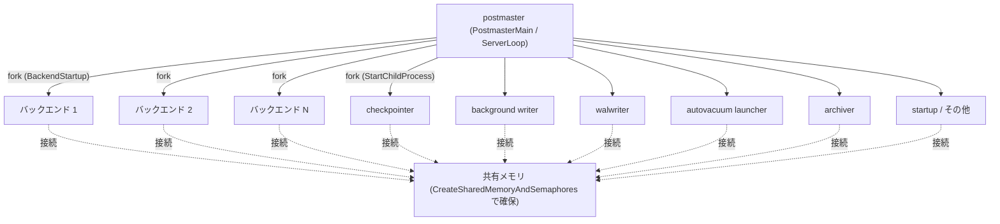

# 第2章 全体アーキテクチャとプロセスモデル

> **本章で読むソース**
>
> - [`src/backend/postmaster/postmaster.c`](https://github.com/postgres/postgres/blob/REL_18_4/src/backend/postmaster/postmaster.c)
> - [`src/backend/postmaster/launch_backend.c`](https://github.com/postgres/postgres/blob/REL_18_4/src/backend/postmaster/launch_backend.c)
> - [`src/backend/postmaster/checkpointer.c`](https://github.com/postgres/postgres/blob/REL_18_4/src/backend/postmaster/checkpointer.c)
> - [`src/backend/postmaster/bgwriter.c`](https://github.com/postgres/postgres/blob/REL_18_4/src/backend/postmaster/bgwriter.c)
> - [`src/backend/postmaster/walwriter.c`](https://github.com/postgres/postgres/blob/REL_18_4/src/backend/postmaster/walwriter.c)
> - [`src/backend/postmaster/autovacuum.c`](https://github.com/postgres/postgres/blob/REL_18_4/src/backend/postmaster/autovacuum.c)
> - [`src/backend/postmaster/pgarch.c`](https://github.com/postgres/postgres/blob/REL_18_4/src/backend/postmaster/pgarch.c)
> - [`src/backend/storage/ipc/ipci.c`](https://github.com/postgres/postgres/blob/REL_18_4/src/backend/storage/ipc/ipci.c)
> - [`src/backend/storage/ipc/shmem.c`](https://github.com/postgres/postgres/blob/REL_18_4/src/backend/storage/ipc/shmem.c)
> - [`src/include/storage/proc.h`](https://github.com/postgres/postgres/blob/REL_18_4/src/include/storage/proc.h)

## この章の狙い

PostgreSQL のサーバは1個のプロセスではない。
1つの親プロセス `postmaster` が、接続を受け取るたびに子プロセスを生み、それとは別に決まった役目を持つ補助プロセスを常駐させる。
これらのプロセスは独立したアドレス空間で動きながら、起動時に確保した1つの共有メモリ領域を通じて、バッファや実行中トランザクションの一覧、ロックの状態を共有する。

本章は、この「親が子を産むプロセス構成」と「全プロセスが見る共有メモリ」という2本の柱で、PostgreSQL の全体像を描く。
`postmaster` の起動から接続受理、バックエンド生成までの流れをコードで追い、補助プロセス群と共有メモリの主要構造を概観する。
個々のプロセスやデータ構造の内部は後続の章に譲り、本章は地図の役割に徹する。

## 前提

第1章でリレーショナルデータベースとしての PostgreSQL の位置づけを確認した。
本章ではサーバプロセスの内部構造を扱うため、UNIX の `fork()` によるプロセス生成と、複数プロセスが同じ物理メモリ領域を共有する共有メモリ（System V または POSIX 共有メモリ）の基本を前提とする。

## postmaster という親プロセス

サーバを起動すると、最初に動き出すのが `postmaster` である。
`postmaster` は問い合わせを自分で処理しない。
役目は、設定の読み込みと共有メモリの確保、待ち受けソケットの用意、補助プロセスの起動、そして接続要求を受けて子プロセスを生むことに限られる。
言い換えれば、`postmaster` はクラスタ全体の管理者であり、実際のSQL処理は子プロセスである各バックエンドが受け持つ。

`postmaster` の本体は `PostmasterMain` 関数である。
この関数はサーバの初期化手順を順に実行し、最後に接続受理ループへ入る。
初期化の中で本章の主題に直結するのが、共有メモリの確保である。

[`src/backend/postmaster/postmaster.c` L997-L1004](https://github.com/postgres/postgres/blob/REL_18_4/src/backend/postmaster/postmaster.c#L997-L1004)

```c
	/*
	 * Set up shared memory and semaphores.
	 *
	 * Note: if using SysV shmem and/or semas, each postmaster startup will
	 * normally choose the same IPC keys.  This helps ensure that we will
	 * clean up dead IPC objects if the postmaster crashes and is restarted.
	 */
	CreateSharedMemoryAndSemaphores();
```

`CreateSharedMemoryAndSemaphores` は子プロセスを生むより前、`postmaster` のプロセス内で1度だけ呼ばれる。
ここで確保したメモリを後述の `fork()` で子へ引き継ぐため、全バックエンドと補助プロセスが同じ共有メモリを指す。
この呼び出しの中身は本章の後半で扱う。

初期化を終えると、`postmaster` はクラッシュリカバリのためのスタートアッププロセスを起動し、回復処理を助けるためにチェックポインタとバックグラウンドライタも先に立ち上げる。

[`src/backend/postmaster/postmaster.c` L1385-L1396](https://github.com/postgres/postgres/blob/REL_18_4/src/backend/postmaster/postmaster.c#L1385-L1396)

```c
	/* Start bgwriter and checkpointer so they can help with recovery */
	if (CheckpointerPMChild == NULL)
		CheckpointerPMChild = StartChildProcess(B_CHECKPOINTER);
	if (BgWriterPMChild == NULL)
		BgWriterPMChild = StartChildProcess(B_BG_WRITER);

	/*
	 * We're ready to rock and roll...
	 */
	StartupPMChild = StartChildProcess(B_STARTUP);
	Assert(StartupPMChild != NULL);
	StartupStatus = STARTUP_RUNNING;
```

クラッシュリカバリそのものは第40章で扱う。
ここで重要なのは、補助プロセスもクライアント接続のバックエンドも、`StartChildProcess` や後述の `BackendStartup` を通じて同じ仕組みで生成される点である。

## 接続受理ループ ServerLoop

初期化が済むと、`postmaster` は `ServerLoop` 関数の無限ループに入り、ここがサーバの定常状態になる。
ループの中心は、待ち受けソケットやシグナル由来のラッチを `WaitEventSetWait` で待つことである。
イベントが届くと、それが新しい接続要求なのか、設定再読み込みや停止要求なのかを判別して処理する。

[`src/backend/postmaster/postmaster.c` L1698-L1711](https://github.com/postgres/postgres/blob/REL_18_4/src/backend/postmaster/postmaster.c#L1698-L1711)

```c
			if (events[i].events & WL_SOCKET_ACCEPT)
			{
				ClientSocket s;

				if (AcceptConnection(events[i].fd, &s) == STATUS_OK)
					BackendStartup(&s);

				/* We no longer need the open socket in this process */
				if (s.sock != PGINVALID_SOCKET)
				{
					if (closesocket(s.sock) != 0)
						elog(LOG, "could not close client socket: %m");
				}
			}
```

ソケットに接続が来ると `AcceptConnection` で受理し、続けて `BackendStartup` を呼んで接続専用の子プロセスを起こす。
`postmaster` 自身は受理したソケットをすぐに閉じる。
このソケットは `fork()` した子に引き継がれており、以後のクライアントとの通信は子であるバックエンドが担うためである。

ループの末尾では `LaunchMissingBackgroundProcesses` を呼び、停止していた補助プロセスがあれば起動し直す。
補助プロセスが異常終了しても、次のループで `postmaster` が再起動を試みるため、クラスタは自己回復する。

ラッチとシグナルによる待ち受けの仕組みは第7章で詳しく扱う。

## バックエンドの生成 BackendStartup と fork

接続ごとのバックエンドを生む `BackendStartup` は、子プロセス用のスロットを確保したうえで `postmaster_child_launch` を呼ぶ。

[`src/backend/postmaster/postmaster.c` L3569-L3596](https://github.com/postgres/postgres/blob/REL_18_4/src/backend/postmaster/postmaster.c#L3569-L3596)

```c
	pid = postmaster_child_launch(bn->bkend_type, bn->child_slot,
								  &startup_data, sizeof(startup_data),
								  client_sock);
	if (pid < 0)
	{
		/* in parent, fork failed */
		int			save_errno = errno;

		(void) ReleasePostmasterChildSlot(bn);
		errno = save_errno;
		ereport(LOG,
				(errmsg("could not fork new process for connection: %m")));
		report_fork_failure_to_client(client_sock, save_errno);
		return STATUS_ERROR;
	}

	/* in parent, successful fork */
	ereport(DEBUG2,
			(errmsg_internal("forked new %s, pid=%d socket=%d",
							 GetBackendTypeDesc(bn->bkend_type),
							 (int) pid, (int) client_sock->sock)));

	/*
	 * Everything's been successful, it's safe to add this backend to our list
	 * of backends.
	 */
	bn->pid = pid;
	return STATUS_OK;
```

実際にプロセスを分裂させるのは `postmaster_child_launch` である。
この関数は、子プロセスがどの種類であっても同じ手順で生成できるように作られている。

[`src/backend/postmaster/launch_backend.c` L245-L293](https://github.com/postgres/postgres/blob/REL_18_4/src/backend/postmaster/launch_backend.c#L245-L293)

```c
#else							/* !EXEC_BACKEND */
	pid = fork_process();
	if (pid == 0)				/* child */
	{
		/* Capture and transfer timings that may be needed for logging */
		if (IsExternalConnectionBackend(child_type))
		{
			conn_timing.socket_create =
				((BackendStartupData *) startup_data)->socket_created;
			conn_timing.fork_start =
				((BackendStartupData *) startup_data)->fork_started;
			conn_timing.fork_end = GetCurrentTimestamp();
		}

		/* Close the postmaster's sockets */
		ClosePostmasterPorts(child_type == B_LOGGER);

		/* Detangle from postmaster */
		InitPostmasterChild();

		/* Detach shared memory if not needed. */
		if (!child_process_kinds[child_type].shmem_attach)
		{
			dsm_detach_all();
			PGSharedMemoryDetach();
		}

		/*
		 * Enter the Main function with TopMemoryContext.  The startup data is
		 * allocated in PostmasterContext, so we cannot release it here yet.
		 * The Main function will do it after it's done handling the startup
		 * data.
		 */
		MemoryContextSwitchTo(TopMemoryContext);

		MyPMChildSlot = child_slot;
		if (client_sock)
		{
			MyClientSocket = palloc(sizeof(ClientSocket));
			memcpy(MyClientSocket, client_sock, sizeof(ClientSocket));
		}

		/*
		 * Run the appropriate Main function
		 */
		child_process_kinds[child_type].main_fn(startup_data, startup_data_len);
		pg_unreachable();		/* main_fn never returns */
	}
#endif							/* EXEC_BACKEND */
```

`fork_process` が返ると、親では子のプロセスIDが、子では `0` が得られる。
子の側では `postmaster` のソケットを閉じ、不要なら共有メモリを切り離したうえで、種類ごとに決められた `main_fn`（メイン関数）へ分岐する。
このメイン関数は戻らないため、子プロセスはそのまま自分の役目を果たし続ける。

`fork()` を選んだことが、PostgreSQL の高速化と頑健性の両方を支える機構になっている。
この設計の意味は本章の最後でまとめて述べる。

### 子プロセスの種類を表で引く

子プロセスの分岐先は、`child_process_kinds` という配列の表で管理される。
プロセスの種類を表す `BackendType` を添字にして、表示名、メイン関数、共有メモリへ接続するかどうかの3点を引く。

[`src/backend/postmaster/launch_backend.c` L179-L208](https://github.com/postgres/postgres/blob/REL_18_4/src/backend/postmaster/launch_backend.c#L179-L208)

```c
static child_process_kind child_process_kinds[] = {
	[B_INVALID] = {"invalid", NULL, false},

	[B_BACKEND] = {"backend", BackendMain, true},
	[B_DEAD_END_BACKEND] = {"dead-end backend", BackendMain, true},
	[B_AUTOVAC_LAUNCHER] = {"autovacuum launcher", AutoVacLauncherMain, true},
	[B_AUTOVAC_WORKER] = {"autovacuum worker", AutoVacWorkerMain, true},
	[B_BG_WORKER] = {"bgworker", BackgroundWorkerMain, true},

	/*
	 * WAL senders start their life as regular backend processes, and change
	 * their type after authenticating the client for replication.  We list it
	 * here for PostmasterChildName() but cannot launch them directly.
	 */
	[B_WAL_SENDER] = {"wal sender", NULL, true},
	[B_SLOTSYNC_WORKER] = {"slot sync worker", ReplSlotSyncWorkerMain, true},

	[B_STANDALONE_BACKEND] = {"standalone backend", NULL, false},

	[B_ARCHIVER] = {"archiver", PgArchiverMain, true},
	[B_BG_WRITER] = {"bgwriter", BackgroundWriterMain, true},
	[B_CHECKPOINTER] = {"checkpointer", CheckpointerMain, true},
	[B_IO_WORKER] = {"io_worker", IoWorkerMain, true},
	[B_STARTUP] = {"startup", StartupProcessMain, true},
	[B_WAL_RECEIVER] = {"wal_receiver", WalReceiverMain, true},
	[B_WAL_SUMMARIZER] = {"wal_summarizer", WalSummarizerMain, true},
	[B_WAL_WRITER] = {"wal_writer", WalWriterMain, true},

	[B_LOGGER] = {"syslogger", SysLoggerMain, false},
};
```

この表があるおかげで、`postmaster_child_launch` は種類ごとの条件分岐を書かずに済む。
新しい種類のプロセスを増やすときも、この表に1行加えるだけで生成経路に乗る。
通常のバックエンド（`B_BACKEND`）も、後述する補助プロセスも、すべてこの1つの表から枝分かれする。

## 補助プロセス群

`postmaster` は、接続のあるなしに関わらず動く専任のプロセスを常駐させる。
これらは共有メモリ上の状態を見ながら、バックエンドが個別に持つには重すぎる仕事を肩代わりする。
主なものを挙げる。
いずれも `child_process_kinds` の表に載るメイン関数から始まり、詳細は後続章で扱う。

- **checkpointer**：定期的にチェックポイントを実行し、共有バッファ上の変更済みページをディスクへ書き出して、クラッシュ後の回復に読むWAL量を抑える。
  エントリは [`CheckpointerMain`](https://github.com/postgres/postgres/blob/REL_18_4/src/backend/postmaster/checkpointer.c#L182-L182)。
  第39章で扱う。
- **background writer**：チェックポイントの合間にも、変更済みバッファを少しずつ書き出し、バックエンドがバッファを再利用するときの書き出し負担を平準化する。
  エントリは [`BackgroundWriterMain`](https://github.com/postgres/postgres/blob/REL_18_4/src/backend/postmaster/bgwriter.c#L88-L88)。
  第23章で扱う。
- **walwriter**：WALバッファ上のログレコードを定期的にディスクへ書き出し、各バックエンドがコミット時に自前で書き出す頻度を下げる。
  エントリは [`WalWriterMain`](https://github.com/postgres/postgres/blob/REL_18_4/src/backend/postmaster/walwriter.c#L88-L88)。
  第38章で扱う。
- **autovacuum launcher**：不要タプルの回収（バキューム）と統計更新を担うワーカーを、対象データベースごとに起動する司令塔である。
  エントリは [`AutoVacLauncherMain`](https://github.com/postgres/postgres/blob/REL_18_4/src/backend/postmaster/autovacuum.c#L368-L368)。
  第43章で扱う。
- **archiver**：完了したWALセグメントを退避先へコピーし、ベースバックアップと組み合わせたリカバリやレプリケーションを支える。
  エントリは [`PgArchiverMain`](https://github.com/postgres/postgres/blob/REL_18_4/src/backend/postmaster/pgarch.c#L218-L218)。
  第41章で扱う。

このほか、回復処理を担うスタートアッププロセス、ログ収集の syslogger、レプリケーションの WAL receiver や WAL summarizer なども `postmaster` の管理下にある。
どの補助プロセスを起動すべきかは、サーバの状態 `pmState` に応じて `LaunchMissingBackgroundProcesses` が判断する。

[`src/backend/postmaster/postmaster.c` L3292-L3306](https://github.com/postgres/postgres/blob/REL_18_4/src/backend/postmaster/postmaster.c#L3292-L3306)

```c
	if (pmState == PM_RUN || pmState == PM_RECOVERY ||
		pmState == PM_HOT_STANDBY || pmState == PM_STARTUP)
	{
		if (CheckpointerPMChild == NULL)
			CheckpointerPMChild = StartChildProcess(B_CHECKPOINTER);
		if (BgWriterPMChild == NULL)
			BgWriterPMChild = StartChildProcess(B_BG_WRITER);
	}

	/*
	 * WAL writer is needed only in normal operation (else we cannot be
	 * writing any new WAL).
	 */
	if (WalWriterPMChild == NULL && pmState == PM_RUN)
		WalWriterPMChild = StartChildProcess(B_WAL_WRITER);
```

checkpointer と background writer は回復中も含めて広い状態で動くのに対し、walwriter は通常運転（`PM_RUN`）でのみ動く。
このように、各補助プロセスは必要な局面が状態で切り分けられている。

### プロセスツリーの全体像

ここまでの構成を図にまとめる。
`postmaster` を頂点に、接続ごとのバックエンドと補助プロセスがぶら下がり、すべてが1つの共有メモリを介してつながる。



クライアントと直接やり取りするのはバックエンドだけである。
補助プロセスはクライアントを持たず、共有メモリ上の状態を見て自分の役目を進める。

## 共有メモリとそこに載る主要構造

プロセスを分離した設計では、全プロセスが見るべき状態をどこに置くかが問題になる。
PostgreSQL はこれを起動時に確保する1つの共有メモリ領域へ集約する。
領域を作るのが、先に登場した `CreateSharedMemoryAndSemaphores` である。

[`src/backend/storage/ipc/ipci.c` L209-L240](https://github.com/postgres/postgres/blob/REL_18_4/src/backend/storage/ipc/ipci.c#L209-L240)

```c
	/* Compute the size of the shared-memory block */
	size = CalculateShmemSize(&numSemas);
	elog(DEBUG3, "invoking IpcMemoryCreate(size=%zu)", size);

	/*
	 * Create the shmem segment
	 */
	seghdr = PGSharedMemoryCreate(size, &shim);

	/*
	 * Make sure that huge pages are never reported as "unknown" while the
	 * server is running.
	 */
	Assert(strcmp("unknown",
				  GetConfigOption("huge_pages_status", false, false)) != 0);

	InitShmemAccess(seghdr);

	/*
	 * Create semaphores.  (This is done here for historical reasons.  We used
	 * to support emulating spinlocks with semaphores, which required
	 * initializing semaphores early.)
	 */
	PGReserveSemaphores(numSemas);

	/*
	 * Set up shared memory allocation mechanism
	 */
	InitShmemAllocation();

	/* Initialize subsystems */
	CreateOrAttachShmemStructs();
```

必要なサイズをあらかじめ計算してから1つのセグメントを確保する点に注目したい。
PostgreSQL の共有メモリは起動後に伸縮しない固定サイズである。
このため、サブシステムが必要とする領域を `CalculateShmemSize` で合算してから、`PGSharedMemoryCreate` で一括確保する。

確保した領域に各サブシステムの構造を作り込むのが `CreateOrAttachShmemStructs` である。

[`src/backend/storage/ipc/ipci.c` L287-L315](https://github.com/postgres/postgres/blob/REL_18_4/src/backend/storage/ipc/ipci.c#L287-L315)

```c
	VarsupShmemInit();
	XLOGShmemInit();
	XLogPrefetchShmemInit();
	XLogRecoveryShmemInit();
	CLOGShmemInit();
	CommitTsShmemInit();
	SUBTRANSShmemInit();
	MultiXactShmemInit();
	BufferManagerShmemInit();

	/*
	 * Set up lock manager
	 */
	LockManagerShmemInit();

	/*
	 * Set up predicate lock manager
	 */
	PredicateLockShmemInit();

	/*
	 * Set up process table
	 */
	if (!IsUnderPostmaster)
		InitProcGlobal();
	ProcArrayShmemInit();
	BackendStatusShmemInit();
	TwoPhaseShmemInit();
	BackgroundWorkerShmemInit();
```

この初期化呼び出しの並びが、共有メモリに載る主要構造の一覧そのものである。
本章で押さえたいのは次の4つで、いずれも後続章で詳しく扱う。

- **共有バッファ**：`BufferManagerShmemInit` が用意するバッファプールで、ディスク上のページをメモリ上にキャッシュする。
  全バックエンドがここを介してテーブルやインデックスのページを読み書きする。
  第22章で扱う。
- **ProcArray**：`ProcArrayShmemInit` が用意する、実行中の全プロセスの状態（後述の `PGPROC`）の配列である。
  スナップショットを取るとき、どのトランザクションが見えるかをここから判定する。
  第37章で扱う。
- **ロックテーブル**：`LockManagerShmemInit` が用意する重量ロックの管理表で、テーブルや行に対するロックの取得と待ち合わせを調停する。
  第34章で扱う。
- **WALバッファ**：`XLOGShmemInit` が用意する、ディスクへ書き出す前のWALレコードを溜める領域である。
  各バックエンドが生成したログを集約し、walwriter やコミットの契機でまとめて書き出す。
  第38章で扱う。

各プロセスの状態は、`PGPROC` という構造体1つで表される。
共有メモリ上にプロセス数ぶんの `PGPROC` が並び、`ProcArray` がそれらを束ねる。

[`src/include/storage/proc.h` L176-L181](https://github.com/postgres/postgres/blob/REL_18_4/src/include/storage/proc.h#L176-L181)

```c
struct PGPROC
{
	dlist_node	links;			/* list link if process is in a list */
	dlist_head *procgloballist; /* procglobal list that owns this PGPROC */

	PGSemaphore sem;			/* ONE semaphore to sleep on */
```

`PGPROC` には待ち合わせ用のセマフォや、保持中のロック、実行中トランザクションの識別子などが収まる。
あるプロセスが他のプロセスの状態を知りたいときは、共有メモリ上の相手の `PGPROC` を読む。
プロセスが分離していても協調できるのは、この共有された状態があるからである。

### 名前で構造を引く ShmemIndex

確保した共有メモリのどこに何があるかは、`ShmemIndex` というハッシュテーブルで名前から引ける。
各サブシステムは `ShmemInitStruct` に名前とサイズを渡して領域を予約し、別のプロセスは同じ名前で同じ領域へ接続する。

[`src/backend/storage/ipc/shmem.c` L387-L392](https://github.com/postgres/postgres/blob/REL_18_4/src/backend/storage/ipc/shmem.c#L387-L392)

```c
ShmemInitStruct(const char *name, Size size, bool *foundPtr)
{
	ShmemIndexEnt *result;
	void	   *structPtr;

	LWLockAcquire(ShmemIndexLock, LW_EXCLUSIVE);
```

`fork()` する通常の構成では、子は親のポインタ値をそのまま受け継ぐため、この名前引きは主にどの領域を初期化済みかの管理に使われる。
一方、Windows などで `fork()` を使えない `EXEC_BACKEND` 構成では、子が共有メモリへ物理的に接続し直し、名前から各構造のアドレスを復元する。
このため `ShmemIndex` は、どの構成でも同じ初期化経路を通せるようにする要になっている。

## 高速化の工夫 プロセス分離と共有メモリの組み合わせ

PostgreSQL が接続ごとに `fork()` でプロセスを分けるのは、単純さと頑健性のための選択である。
各バックエンドは独立したアドレス空間を持つため、あるバックエンドがクラッシュしても他へメモリ破壊が波及しにくい。
さらに `fork()` は親のアドレス空間をコピーオンライトで引き継ぐので、起動済みの `postmaster` が抱える初期化済みの状態を、子はコピーの実費を払わずに受け取れる。
共有メモリの確保を `fork()` より前に1度だけ行うのも、この引き継ぎを効かせるためである。

ただしプロセスを分けただけでは、全プロセスが触る共有バッファや `ProcArray` への同時アクセスが競合する。
ここで効くのが、共有メモリ上の構造ごとに保護の粒度を変える設計である。
読み取りが多く保持時間の短いアクセスには軽量ロック（LWLock）を、ごく短い不可分操作にはスピンロックを使い、変更頻度の低い状態の一部はロックを取らずに読めるようにしてある。
先ほどの `PGPROC` のヘッダコメントは、この使い分けを明示している。

[`src/include/storage/proc.h` L160-L172](https://github.com/postgres/postgres/blob/REL_18_4/src/include/storage/proc.h#L160-L172)

```c
 * We allow many fields of this struct to be accessed without locks, such as
 * delayChkptFlags and isRegularBackend. However, keep in mind that writing
 * mirrored ones (see below) requires holding ProcArrayLock or XidGenLock in
 * at least shared mode, so that pgxactoff does not change concurrently.
 *
 * Mirrored fields:
 *
 * Some fields in PGPROC (see "mirrored in ..." comment) are mirrored into an
 * element of more densely packed ProcGlobal arrays. These arrays are indexed
 * by PGPROC->pgxactoff. Both copies need to be maintained coherently.
 *
 * NB: The pgxactoff indexed value can *never* be accessed without holding
 * locks.
```

ロックなしで読める領域と、`ProcArrayLock` などの共有ロックが要る領域を、フィールド単位で分けているのが読み取れる。
頻繁に読まれる値をロックなしの経路に置き、整合性が要る更新だけにロックを掛けることで、多数のバックエンドが同じ `ProcArray` を見ても競合が深刻になりにくい。
この「プロセス分離で隔離し、共有メモリで協調し、保護の粒度を変えて競合を抑える」三段構えが、PostgreSQL の並行性を支える基本機構である。
LWLock とスピンロックの実装は第35章と第36章で扱う。

## 1つの問い合わせがバックエンド内をどう流れるか

最後に、1個のバックエンドの内側に視点を移す。
クライアントから届いたSQLは、1つのバックエンドプロセスの中で、解析から実行、ストレージアクセスまでを順にたどる。
各段の内部は第3部以降で章ごとに扱うため、ここでは流れの俯瞰だけを示す。


パーサがSQL文字列を構文木へ変換し、アナライザとリライタが意味解析とルール適用を施す。
プランナが複数の実行方法からコストの低いプランを選び、エグゼキュータがそのプランを駆動して結果を作る。
エグゼキュータはテーブルやインデックスのページを共有バッファ経由で読み書きするため、最終的には本章で見た共有メモリへ行き着く。
この一連の流れは、各バックエンドが自分のプロセス内で独立に実行する。

## まとめ

PostgreSQL のサーバは、親プロセス `postmaster` と、その子である多数のバックエンドおよび補助プロセスからなる。
`postmaster` は `PostmasterMain` で初期化と共有メモリの確保を済ませ、`ServerLoop` で接続を待ち受け、接続が来るたびに `BackendStartup` から `fork()` でバックエンドを生む。
補助プロセス（checkpointer、background writer、walwriter、autovacuum launcher、archiver ほか）は、サーバの状態に応じて常駐し、バックエンドには重い定常的な仕事を肩代わりする。
すべてのプロセスは起動時に1度だけ確保した共有メモリ（共有バッファ、ProcArray、ロックテーブル、WALバッファ）を介して協調する。
プロセス分離で障害を隔離しつつ、共有メモリと保護粒度の使い分けで競合を抑えるのが、この構成の核となる工夫である。

## 関連する章

- 第3章 [ソースツリーとビルド、問い合わせ処理の俯瞰](03-source-tree-and-build.md)
- 第4章 [postmaster とプロセスの起動](../part01-process-memory/04-postmaster-and-processes.md)
- 第5章 [共有メモリとプロセス間通信](../part01-process-memory/05-shared-memory-and-ipc.md)
- 第7章 [ラッチとシグナル処理](../part01-process-memory/07-latches-and-signals.md)
- 第22章 [共有バッファとバッファ管理](../part05-storage-buffer/22-buffer-manager.md)
- 第35章 [軽量ロック（LWLock）](../part08-transactions-concurrency/35-lightweight-locks.md)
- 第37章 [スナップショットと ProcArray](../part08-transactions-concurrency/37-snapshots-and-procarray.md)
- 第43章 [バックグラウンドワーカーと autovacuum](../part10-catalog-utilities/43-background-workers-autovacuum.md)
