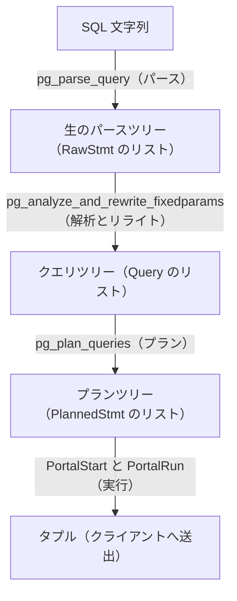

# 第3章 ソースツリーとビルド、問い合わせ処理の俯瞰

> **本章で読むソース**
>
> - [`src/backend/tcop/postgres.c`](https://github.com/postgres/postgres/blob/REL_18_4/src/backend/tcop/postgres.c)
> - [`src/backend/Makefile`](https://github.com/postgres/postgres/blob/REL_18_4/src/backend/Makefile)
> - [`meson.build`](https://github.com/postgres/postgres/blob/REL_18_4/meson.build)

## この章の狙い

本書はこのあと、プロセスモデルからメモリ管理、問い合わせの解析と最適化、エグゼキュータ、ストレージ、トランザクション、WAL までを部ごとに分けて読む。
個々の章はソースツリーの一隅を深く掘る。
そのため、最初に全体の地図がないと、いま読んでいるコードがサーバ全体のどこに位置するのかを見失いやすい。

この章は二つの地図を与える。
一つはソースツリーの地図で、`src/backend/` 以下の主要サブディレクトリが何を担うかを表で一望する。
もう一つは制御フローの地図で、1つの単純な SQL 文がサーバに届いてから結果が返るまで、どの段階をどの順で通るかを `exec_simple_query` の呼び出しに沿って追う。
個々の段階の中身は後続章にゆずり、ここでは段階どうしのつながりだけを示す。

## 前提

第2章で、PostgreSQL がプロセスごとに1つのバックエンドを割り当てるマルチプロセス構成を取ること、クライアントの接続を `postmaster` が受けてバックエンドを fork することを見た。
本章が追う処理は、すでに接続が確立したバックエンドの内側で起きる。
接続確立とプロトコルの詳細は第8章と第9章で扱う。

## ソースツリーの構成

PostgreSQL のソースは、リポジトリ直下の `src/` にほぼすべてが収まる。
`src/` の主要な区分は次のとおりである。

| パス | 役割 |
| --- | --- |
| `src/backend/` | サーバ本体（バックエンドと補助プロセス）で、本書が読む大半のコードがここにある。 |
| `src/include/` | サーバとクライアント共通のヘッダで、構造体定義やマクロ、関数プロトタイプを置く。 |
| `src/common/` | サーバとフロントエンドツールの双方からリンクされる共通コードで、base64 や CRC、設定情報の取得などを含む。 |
| `src/bin/` | `psql`、`pg_dump`、`pg_ctl`、`initdb`、`pg_basebackup`、`pg_upgrade` などのコマンド群。 |
| `src/interfaces/` | クライアントライブラリで、libpq（C クライアント API）と ECPG（埋め込み SQL）を含む。 |
| `src/port/` | プラットフォーム間の差を吸収する OS 依存処理の移植層。 |
| `contrib/` | 本体と別管理の拡張モジュール群（`pg_stat_statements`、`auto_explain`、`btree_gin` など）。 |

サーバ本体 `src/backend/` の内側は、機能領域ごとにサブディレクトリへ分かれる。
問い合わせ処理の流れに対応づけて主要なものを並べると次の表になる。

| サブディレクトリ | 役割 | 主に読む章 |
| --- | --- | --- |
| `tcop/` | `postgres.c` が1文の処理全体を束ねる、バックエンドのメインループと問い合わせ処理の入口（traffic cop）。 | 第9章 |
| `parser/` | SQL 文字列をトークン化し、文法に従って生のパースツリーを作り、意味解析でクエリツリーへ変換する。 | 第10章、第11章 |
| `rewrite/` | ビューやルールに基づきクエリツリーを書き換えるルールシステム（リライタ）。 | 第12章 |
| `optimizer/` | クエリツリーから実行可能なプランツリーを生成するプランナとオプティマイザ。 | 第13章、第14章、第15章 |
| `executor/` | プランツリーをたどってタプルを生成するエグゼキュータ。 | 第16章から第20章 |
| `nodes/` | パースツリー、プランツリー、実行状態ツリーを構成するノード型と、その複製や比較、直列化の支援関数。 | 第10章、第13章 |
| `access/` | ヒープ（`heap/`）、各種インデックス（`nbtree/`、`hash/`、`gist/`、`gin/`、`brin/`、`spgist/`）、テーブル抽象（`table/`）、トランザクション管理（`transam/`）を含むアクセスメソッド層。 | 第25章から第32章、第33章、第38章 |
| `storage/` | バッファ管理（`buffer/`）、ストレージマネージャ（`smgr/`）、ロックマネージャ（`lmgr/`）、共有メモリ（`ipc/`）、空き領域マップ（`freespace/`）を担う物理ストレージとプロセス間通信の層。 | 第5部、第34章、第35章 |
| `catalog/` | `pg_class` や `pg_attribute` などのカタログ表、名前空間、依存関係を扱うシステムカタログの定義と操作。 | 第42章 |
| `replication/` | WAL 送信（walsender）と受信（walreceiver）、論理デコーディングを含むレプリケーション層。 | 第41章 |
| `postmaster/` | `postmaster` 本体と補助プロセス（`bgwriter`、`checkpointer`、`walwriter`、autovacuum ランチャー、バックグラウンドワーカー）。 | 第4章、第43章 |
| `utils/` | メモリコンテキスト（`mmgr/`）、各種キャッシュ（`cache/`）、エラー報告（`error/`）、関数マネージャ（`fmgr/`）、データ型処理（`adt/`）、ソート（`sort/`）を提供する運用基盤のユーティリティ群。 | 第6章、第42章 |
| `commands/` | `CREATE TABLE` や `VACUUM`、`COPY` など、プランナを通さないユーティリティ文の実装。 | 第28章 |

`src/include/` のディレクトリ構成は `src/backend/` のサブディレクトリにおおむね対応する。
たとえば `src/backend/optimizer/` のヘッダは `src/include/optimizer/` に置かれる。
本書でコードを読むときも、関数の宣言（プロトタイプ）と構造体定義は `src/include/` 側を、実装は `src/backend/` 側を見ることになる。

表に挙げたサブディレクトリの一覧は、説明のための分類にとどまらず、`src/backend/Makefile` の `SUBDIRS` 変数として実体を持つ。

[`src/backend/Makefile` L19-L24](https://github.com/postgres/postgres/blob/REL_18_4/src/backend/Makefile#L19-L24)

```text
SUBDIRS = access archive backup bootstrap catalog parser commands executor \
	foreign lib libpq \
	main nodes optimizer partitioning port postmaster \
	regex replication rewrite \
	statistics storage tcop tsearch utils $(top_builddir)/src/timezone \
	jit
```

Autoconf 系のビルドでは、`make` はこの変数を頼りに `src/backend/` 直下の各サブディレクトリへ順に降りて再帰的にビルドする。
一覧の並びが本節の表とほぼ一致するのは、両者が同じ機能領域の区切りを指しているためである。

## ビルド系は2系統ある

PostgreSQL 18.4 のソースには、ビルド構成を生成する仕組みが2系統含まれる。

一つは伝統的な Autoconf 系で、リポジトリ直下の `configure.ac` から生成された `configure` スクリプトを実行し、`Makefile` に従って `make` でビルドする。
もう一つは Meson 系で、直下の `meson.build` を起点に `meson setup` でビルドディレクトリを構成し、`ninja` でビルドする。
両者は同じソースから同じ成果物を作るための代替手段であり、開発者は環境に応じてどちらかを選ぶ。

Meson 系の起点は、リポジトリ直下の `meson.build` が呼ぶ `project` 宣言である。

[`meson.build` L9-L17](https://github.com/postgres/postgres/blob/REL_18_4/meson.build#L9-L17)

```text
project('postgresql',
  ['c'],
  version: '18.4',
  license: 'PostgreSQL',

  # We want < 0.56 for python 3.5 compatibility on old platforms. EPEL for
  # RHEL 7 has 0.55. < 0.54 would require replacing some uses of the fs
  # module, < 0.53 all uses of fs. So far there's no need to go to >=0.56.
  meson_version: '>=0.54',
```

この宣言でプロジェクト名とバージョンを定め、以後 `meson.build` はディレクトリごとに現れて、そのディレクトリのビルド対象を Meson へ伝える。
本書はビルド手順そのものには立ち入らないが、ソースを追うときに `meson.build` というファイルがディレクトリごとに現れる理由はここにある。

## 1つの単純な問い合わせがサーバ内をどう流れるか

ここからは制御フローの地図に移る。
クライアントが単純問い合わせプロトコル（simple Query）で1つの SQL 文を送ると、バックエンドのメインループはそれを `exec_simple_query` に渡す。
この関数は `src/backend/tcop/postgres.c` にあり、1文の処理の全段階をこの中で順に呼び出す。

[`src/backend/tcop/postgres.c` L1011-L1012](https://github.com/postgres/postgres/blob/REL_18_4/src/backend/tcop/postgres.c#L1011-L1012)

```c
static void
exec_simple_query(const char *query_string)
```

引数は SQL 文字列1つだけであり、この文字列を起点にパースから結果送出までの全段階が進む。
各段階の中身は後続章にゆずり、ここでは呼び出しの並びだけを追う。

### パース（生のパースツリーを作る）

最初の段階は、SQL 文字列を文法に従って解析し、生のパースツリーへ変換することである。
`exec_simple_query` は `pg_parse_query` を呼ぶ。

[`src/backend/tcop/postgres.c` L1065](https://github.com/postgres/postgres/blob/REL_18_4/src/backend/tcop/postgres.c#L1065)

```c
	parsetree_list = pg_parse_query(query_string);
```

この段階はデータベースのテーブルに一切触れない。
触れないことには理由がある。
パース結果から `COMMIT` や `ABORT` のような文を識別できるようにしておけば、トランザクションが異常終了した状態でも、生のパースだけは安全に実行でき、後続のコマンドを受け付け続けられるからである。
パーサの内部は第10章で読む。

`pg_parse_query` は生のパースツリーのリストを返す。
1つの単純問い合わせメッセージに複数の SQL 文が含まれることがあるため、結果はリストになる。
`exec_simple_query` はこのリストを `foreach` で1文ずつ処理する。

### 解析とリライト（クエリツリーへ）

次の段階は、生のパースツリーに意味を与え、必要ならルールで書き換えることである。
`exec_simple_query` は1文ごとに `pg_analyze_and_rewrite_fixedparams` を呼ぶ。

[`src/backend/tcop/postgres.c` L1190-L1191](https://github.com/postgres/postgres/blob/REL_18_4/src/backend/tcop/postgres.c#L1190-L1191)

```c
		querytree_list = pg_analyze_and_rewrite_fixedparams(parsetree, query_string,
															NULL, 0, NULL);
```

この関数は内部で二つの仕事を順にこなす。
まず意味解析（parse analysis）で、テーブル名や列名をカタログと照合して実体に結びつけ、生のパースツリーをクエリツリー（`Query` ノード）へ変換する。
続いてリライト（rewrite）で、ビューやルールに基づいてクエリツリーを書き換える。
意味解析もリライトもカタログにアクセスするため、生のパースとは分離されており、異常終了状態では実行されない。
意味解析は第11章、リライタとルールシステムは第12章で読む。

意味解析とリライトは、1つのクエリツリーを複数に展開しうる。
そのため `pg_analyze_and_rewrite_fixedparams` の戻り値はクエリツリーのリストになる。

### プラン（プランツリーへ）

クエリツリーが得られたら、それを実行可能な形に落とす。
`exec_simple_query` は `pg_plan_queries` を呼ぶ。

[`src/backend/tcop/postgres.c` L1193-L1194](https://github.com/postgres/postgres/blob/REL_18_4/src/backend/tcop/postgres.c#L1193-L1194)

```c
		plantree_list = pg_plan_queries(querytree_list, query_string,
										CURSOR_OPT_PARALLEL_OK, NULL);
```

`pg_plan_queries` はクエリツリーのリストを受け取り、各クエリツリーに対応するプランツリー（`PlannedStmt` ノード）のリストを返す。
ここで `CURSOR_OPT_PARALLEL_OK` を渡しているのは、この文がパラレルクエリの対象になりうることをプランナに伝えるためである。

最適化の本体はこの段階にある。
通常の問い合わせ文はプランナへ渡され、テーブルを結合する順序やスキャン方法ごとにパス（`Path`）を作ってコストを見積もり、その中から最も安いパスを選んでプランへ変換する。
`CREATE TABLE` のようなユーティリティ文はプランの余地がないため、プランナを通さず `PlannedStmt` の薄いラッパーで包むだけにする。
プランナの全体像は第13章、パス生成とコスト見積もりは第14章、プランの実体化は第15章で読む。

### 実行と結果送出（タプルへ）

最後に、プランツリーをエグゼキュータで走らせて結果のタプルを得て、クライアントへ送る。
`exec_simple_query` はまずポータル（実行中の問い合わせを表すオブジェクト）を作ってプランを結びつけ、`PortalStart` で実行を準備する。

[`src/backend/tcop/postgres.c` L1235](https://github.com/postgres/postgres/blob/REL_18_4/src/backend/tcop/postgres.c#L1235)

```c
		PortalStart(portal, NULL, 0, InvalidSnapshot);
```

準備が済んだら `PortalRun` でポータルを最後まで走らせる。

[`src/backend/tcop/postgres.c` L1274-L1279](https://github.com/postgres/postgres/blob/REL_18_4/src/backend/tcop/postgres.c#L1274-L1279)

```c
		(void) PortalRun(portal,
						 FETCH_ALL,
						 true,	/* always top level */
						 receiver,
						 receiver,
						 &qc);
```

`PortalRun` はエグゼキュータを駆動し、プランツリーをたどって1タプルずつ取り出す。
得られたタプルは、引数で渡した宛先受信オブジェクト（`DestReceiver`）を通じてクライアントへ送られる。
エグゼキュータの骨格は第16章、宛先への送出を含むメインループの作りは第9章で読む。

ここまでで1文の処理が終わり、`exec_simple_query` はポータルを破棄して `foreach` の次の文へ進む。

### 全体の流れ

5つの段階は、前段の出力が後段の入力になる一本のパイプラインを成す。
SQL 文字列がパースツリーへ、パースツリーがクエリツリーへ、クエリツリーがプランツリーへと姿を変え、最後にエグゼキュータがプランツリーからタプルを取り出す。



## 高速化や最適化の工夫

この章の制御フローには、性能に直結する設計が一つ埋め込まれている。
プランの段階で、ユーティリティ文と通常の問い合わせ文を分け、ユーティリティ文にはプランナを走らせない点である。
`pg_plan_queries` は、各クエリツリーが `CMD_UTILITY` かどうかを見て、ユーティリティ文なら `PlannedStmt` を作って `utilityStmt` を詰めるだけで済ませ、そうでない文だけを `pg_plan_query` に渡す。

[`src/backend/tcop/postgres.c` L982-L997](https://github.com/postgres/postgres/blob/REL_18_4/src/backend/tcop/postgres.c#L982-L997)

```c
		if (query->commandType == CMD_UTILITY)
		{
			/* Utility commands require no planning. */
			stmt = makeNode(PlannedStmt);
			stmt->commandType = CMD_UTILITY;
			stmt->canSetTag = query->canSetTag;
			stmt->utilityStmt = query->utilityStmt;
			stmt->stmt_location = query->stmt_location;
			stmt->stmt_len = query->stmt_len;
			stmt->queryId = query->queryId;
		}
		else
		{
			stmt = pg_plan_query(query, query_string, cursorOptions,
								 boundParams);
		}
```

なぜこれが効くのか。
プランナはパスを列挙してコストを見積もる探索を行うため、それ自体に相応のコストがかかる。
`CREATE TABLE` や `BEGIN` のようなユーティリティ文には選ぶべき実行計画がそもそも存在しないため、探索は無駄になる。
分岐で探索ごと省くことで、これらの文はプランナの探索コストを一切払わずに実行段階へ進める。

## まとめ

この章では二つの地図を示した。
ソースツリーの地図では、`src/backend/` の主要サブディレクトリが問い合わせ処理のどの局面を担うかを表で対応づけ、`src/include/` や `src/common/`、`src/bin/`、`contrib/` の位置も押さえた。
制御フローの地図では、`exec_simple_query` を起点に、パース、解析とリライト、プラン、実行という4回の呼び出しが一本のパイプラインを成すことを確認した。
SQL 文字列はこのパイプラインを通って、パースツリー、クエリツリー、プランツリーへと姿を変え、最後にタプルとしてクライアントへ返る。
以後の章は、このパイプラインの各段を一つずつ開けて中身を読んでいく。

## 関連する章

- [第2章 全体アーキテクチャとプロセスモデル](02-architecture-overview.md)
- [第9章 フロントエンド／バックエンドプロトコルとメインループ](../part02-connection-protocol/09-frontend-backend-protocol.md)
- [第10章 パーサ](../part03-query-frontend/10-parser.md)
- [第11章 アナライザ（意味解析）](../part03-query-frontend/11-analyzer.md)
- [第12章 リライタとルールシステム](../part03-query-frontend/12-rewriter.md)
- [第13章 プランナの全体像](../part03-query-frontend/13-planner-overview.md)
- [第16章 エグゼキュータの骨格](../part04-executor/16-executor-overview.md)
