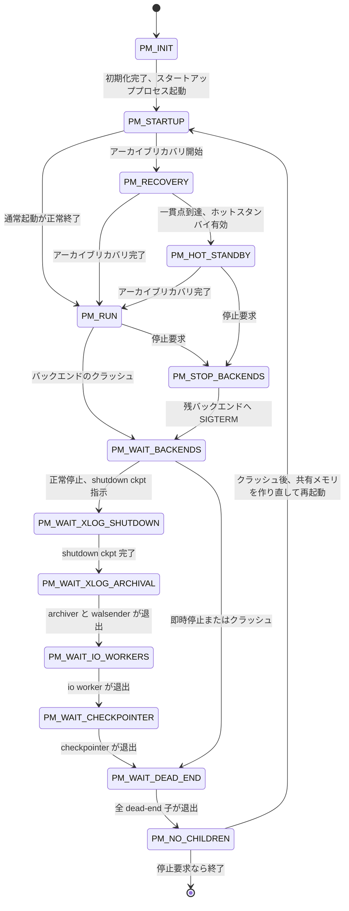

# 第4章 postmaster とプロセスの起動

> **本章で読むソース**
>
> - [`src/backend/postmaster/postmaster.c`](https://github.com/postgres/postgres/blob/REL_18_4/src/backend/postmaster/postmaster.c)
> - [`src/backend/postmaster/launch_backend.c`](https://github.com/postgres/postgres/blob/REL_18_4/src/backend/postmaster/launch_backend.c)

## この章の狙い

第2章では、`postmaster` を親とするプロセス構成と共有メモリの組み合わせを地図として概観した。
本章は同じ `postmaster` を、起動から定常運転、停止までを貫く1つの状態機械として読む。

`postmaster` のソースには、設計者が状態機械と明言したコメントがある。

[`src/backend/postmaster/postmaster.c` L292-L294](https://github.com/postgres/postgres/blob/REL_18_4/src/backend/postmaster/postmaster.c#L292-L294)

```c
/*
 * We use a simple state machine to control startup, shutdown, and
 * crash recovery (which is rather like shutdown followed by startup).
```

注目したいのは、クラッシュリカバリを「停止のあとに起動が続くようなもの」と位置づけている点である。
起動、停止、クラッシュからの復帰という3つの局面を、`postmaster` は1つの状態変数 `pmState` の遷移として統一的に扱う。
本章では、初期化シーケンスがどの順で何を確保するか、`pmState` がどう遷移するか、子プロセスがどう生まれてどう刈り取られるか、そして補助プロセスがどう自己回復するかを、コードに即してたどる。

## 前提

第2章で、接続ごとのバックエンドと常駐の補助プロセスが `postmaster` の子として `fork()` で生まれること、全プロセスが起動時に確保した1つの共有メモリを共有することを確認した。
本章はその続きとして、`postmaster` プロセスの内部制御に踏み込む。
共有メモリの中身は第5章、ラッチとシグナルによる待ち受けの仕組みは第7章で扱うため、本章ではそれらを既知のものとして用いる。

## 初期化シーケンス PostmasterMain

`postmaster` の本体は `PostmasterMain` である。
この関数は数百行にわたって初期化を順に実行し、最後に接続受理ループへ入る。
順序には意味があり、ある段の成果が次の段の前提になっている。
本章で押さえたいのは、設定の読み込み、待ち受けソケットの用意、共有メモリの確保、補助プロセスの起動という4段が、この順に並んでいることである。

最初に設定を確定させる。
`InitializeGUCOptions` で GUC（実行時設定パラメータ）の初期値を組み立て、コマンドラインを解析したのち、`SelectConfigFiles` で `postgresql.conf` を読む。

[`src/backend/postmaster/postmaster.c` L590-L590](https://github.com/postgres/postgres/blob/REL_18_4/src/backend/postmaster/postmaster.c#L590)

```c
	InitializeGUCOptions();
```

[`src/backend/postmaster/postmaster.c` L786-L787](https://github.com/postgres/postgres/blob/REL_18_4/src/backend/postmaster/postmaster.c#L786-L787)

```c
	if (!SelectConfigFiles(userDoption, progname))
		ExitPostmaster(2);
```

設定を先に確定させるのは、後続の段がここで決まった値に依存するためである。
たとえば共有メモリのサイズは `shared_buffers` などの GUC から計算され、待ち受けるアドレスは `listen_addresses` で決まる。
設定の読み込みが失敗すれば `postmaster` は子を1つも生まずに終了する。

設定が定まると、クライアントを迎える入口である待ち受けソケットを用意する。

[`src/backend/postmaster/postmaster.c` L1106-L1113](https://github.com/postgres/postgres/blob/REL_18_4/src/backend/postmaster/postmaster.c#L1106-L1113)

```c
	/*
	 * Establish input sockets.
	 *
	 * First set up an on_proc_exit function that's charged with closing the
	 * sockets again at postmaster shutdown.
	 */
	ListenSockets = palloc(MAXLISTEN * sizeof(pgsocket));
	on_proc_exit(CloseServerPorts, 0);
```

ここで開いたソケットは `postmaster` が `listen` した状態で保持し続ける。
接続要求が届くたびに、このソケットから `accept` してバックエンドへ引き渡す。

ソケットの次に、全プロセスが共有する状態の置き場である共有メモリを確保する。

[`src/backend/postmaster/postmaster.c` L997-L1004](https://github.com/postgres/postgres/blob/REL_18_4/src/backend/postmaster/postmaster.c#L997-L1004)

```c
	/*
	 * Set up shared memory and semaphores.
	 *
	 * Note: if using SysV shmem and/or semas, each postmaster startup will
	 * normally choose the same IPC keys.  This helps ensure that we will
	 * clean up dead IPC objects if the postmaster crashes and is restarted.
	 */
	CreateSharedMemoryAndSemaphores();
```

`CreateSharedMemoryAndSemaphores` は子を生む前に1度だけ呼ばれ、確保した領域を後続の `fork()` で子へ引き継ぐ。
このため、ソケットの用意よりも共有メモリの確保が先に来る順序自体は厳密な依存ではないが、いずれも子を生むより前に完了している必要がある。
共有メモリの内部構造は第5章で扱う。

ここまでの初期化を終えると、`postmaster` は状態を `PM_STARTUP` へ進め、回復処理を担うスタートアッププロセスと、それを助ける補助プロセスを起動する。

[`src/backend/postmaster/postmaster.c` L1378-L1396](https://github.com/postgres/postgres/blob/REL_18_4/src/backend/postmaster/postmaster.c#L1378-L1396)

```c
	AddToDataDirLockFile(LOCK_FILE_LINE_PM_STATUS, PM_STATUS_STARTING);

	UpdatePMState(PM_STARTUP);

	/* Make sure we can perform I/O while starting up. */
	maybe_adjust_io_workers();

	/* Start bgwriter and checkpointer so they can help with recovery */
	if (CheckpointerPMChild == NULL)
		CheckpointerPMChild = StartChildProcess(B_CHECKPOINTER);
	if (BgWriterPMChild == NULL)
		BgWriterPMChild = StartChildProcess(B_BG_WRITER);

	/*
	 * We're ready to rock and roll...
	 */
	StartupPMChild = StartChildProcess(B_STARTUP);
	Assert(StartupPMChild != NULL);
	StartupStatus = STARTUP_RUNNING;
```

checkpointer と background writer をスタートアッププロセスより先に起こすのは、回復処理がディスクへの書き出しを伴うためである。
スタートアッププロセスはWALを適用してデータベースを一貫した状態へ戻し、その間に書き出しが必要になればこれらの補助プロセスが引き受ける。
状態を `PM_STARTUP` に進めてからスタートアッププロセスを起こす順序は、後述の状態機械が「いまどの局面か」を一貫して判断できるようにするためである。

初期化の最後に、`postmaster` は接続受理ループ `ServerLoop` へ入る。
これ以降、`postmaster` はこのループの中で定常運転を続ける。

## pmState という状態変数

`postmaster` の振る舞いを決めるのが、状態変数 `pmState` である。
取りうる値は1つの列挙型で定義され、起動から運転、停止までの局面を表す。

[`src/backend/postmaster/postmaster.c` L335-L354](https://github.com/postgres/postgres/blob/REL_18_4/src/backend/postmaster/postmaster.c#L335-L354)

```c
typedef enum
{
	PM_INIT,					/* postmaster starting */
	PM_STARTUP,					/* waiting for startup subprocess */
	PM_RECOVERY,				/* in archive recovery mode */
	PM_HOT_STANDBY,				/* in hot standby mode */
	PM_RUN,						/* normal "database is alive" state */
	PM_STOP_BACKENDS,			/* need to stop remaining backends */
	PM_WAIT_BACKENDS,			/* waiting for live backends to exit */
	PM_WAIT_XLOG_SHUTDOWN,		/* waiting for checkpointer to do shutdown
								 * ckpt */
	PM_WAIT_XLOG_ARCHIVAL,		/* waiting for archiver and walsenders to
								 * finish */
	PM_WAIT_IO_WORKERS,			/* waiting for io workers to exit */
	PM_WAIT_CHECKPOINTER,		/* waiting for checkpointer to shut down */
	PM_WAIT_DEAD_END,			/* waiting for dead-end children to exit */
	PM_NO_CHILDREN,				/* all important children have exited */
} PMState;

static PMState pmState = PM_INIT;
```

前半の `PM_INIT` から `PM_RUN` までが起動と運転、`PM_STOP_BACKENDS` 以降が停止に向けた段階的な待ち合わせを表す。
`PM_RUN` が「データベースが生きている」通常状態であり、ここで初めてクライアントのバックエンドを受け入れる。

状態の意味で押さえたいのは、この変数が「いまどの局面か」だけを表し、「なぜその局面に至ったか」は別の変数が持つ点である。
ソースのコメントがこれを明言している。

[`src/backend/postmaster/postmaster.c` L327-L334](https://github.com/postgres/postgres/blob/REL_18_4/src/backend/postmaster/postmaster.c#L327-L334)

```c
 * Notice that this state variable does not distinguish *why* we entered
 * states later than PM_RUN --- Shutdown and FatalError must be consulted
 * to find that out.  FatalError is never true in PM_RECOVERY, PM_HOT_STANDBY,
 * or PM_RUN states, nor in PM_WAIT_XLOG_SHUTDOWN states (because we don't
 * enter those states when trying to recover from a crash).  It can be true in
 * PM_STARTUP state, because we don't clear it until we've successfully
 * started WAL redo.
 */
```

`PM_RUN` より後の状態へ進む理由は、停止要求（`Shutdown`）かバックエンドのクラッシュ（`FatalError`）のいずれかである。
`pmState` は同じ「バックエンドの退出を待つ」状態（`PM_WAIT_BACKENDS`）を両者で共有し、退出を待ち終えたあとの分岐で `Shutdown` と `FatalError` を見て、停止して終了するか共有メモリを作り直して再起動するかを決める。
この分離によって、停止とクラッシュ復帰という別々の局面が、待ち合わせの段階では同じ遷移経路を再利用できる。

### 起動から運転までの遷移

起動側の遷移は、スタートアッププロセスからの合図で進む。
`PM_STARTUP` で起動したスタートアッププロセスは、通常起動なら回復を終えて正常終了し、`postmaster` はこれを受けて `PM_RUN` へ移る。
一方、アーカイブリカバリは時間がかかるため、回復の途中でも問い合わせを受けられるよう別経路をたどる。

スタートアッププロセスがアーカイブリカバリを始めると、`PMSIGNAL_RECOVERY_STARTED` を `postmaster` へ送り、状態が `PM_RECOVERY` へ進む。

[`src/backend/postmaster/postmaster.c` L3685-L3715](https://github.com/postgres/postgres/blob/REL_18_4/src/backend/postmaster/postmaster.c#L3685-L3715)

```c
	if (CheckPostmasterSignal(PMSIGNAL_RECOVERY_STARTED) &&
		pmState == PM_STARTUP && Shutdown == NoShutdown)
	{
		/* WAL redo has started. We're out of reinitialization. */
		FatalError = false;
		AbortStartTime = 0;
		reachedConsistency = false;

// ... (中略) ...

		UpdatePMState(PM_RECOVERY);
	}
```

回復がWAL上の一貫点に達し、ホットスタンバイが有効なら、スタートアッププロセスはさらに `PMSIGNAL_BEGIN_HOT_STANDBY` を送る。
これを受けて `postmaster` は `PM_HOT_STANDBY` へ移り、読み取り専用の接続を受け付け始める。

[`src/backend/postmaster/postmaster.c` L3723-L3740](https://github.com/postgres/postgres/blob/REL_18_4/src/backend/postmaster/postmaster.c#L3723-L3740)

```c
	if (CheckPostmasterSignal(PMSIGNAL_BEGIN_HOT_STANDBY) &&
		(pmState == PM_RECOVERY && Shutdown == NoShutdown))
	{
		ereport(LOG,
				(errmsg("database system is ready to accept read-only connections")));

// ... (中略) ...

		UpdatePMState(PM_HOT_STANDBY);
		connsAllowed = true;

		/* Some workers may be scheduled to start now */
		StartWorkerNeeded = true;
	}
```

アーカイブリカバリが完了すると、スタートアッププロセスは正常終了する。
その終了を `postmaster` が刈り取った時点で、状態は `PM_RUN` へ進む。
正常起動でもアーカイブリカバリ経由でも、最終的に到達するのは同じ `PM_RUN` である。

スタートアッププロセスの正常終了を `PM_RUN` へつなぐのは、後述する子プロセスの刈り取り処理である。

[`src/backend/postmaster/postmaster.c` L2313-L2332](https://github.com/postgres/postgres/blob/REL_18_4/src/backend/postmaster/postmaster.c#L2313-L2332)

```c
			/*
			 * Startup succeeded, commence normal operations
			 */
			StartupStatus = STARTUP_NOT_RUNNING;
			FatalError = false;
			AbortStartTime = 0;
			ReachedNormalRunning = true;
			UpdatePMState(PM_RUN);
			connsAllowed = true;

			/*
			 * At the next iteration of the postmaster's main loop, we will
			 * crank up the background tasks like the autovacuum launcher and
			 * background workers that were not started earlier already.
			 */
			StartWorkerNeeded = true;

			/* at this point we are really open for business */
			ereport(LOG,
					(errmsg("database system is ready to accept connections")));
```

`PM_RUN` へ移ると `FatalError` を `false` に戻し、クライアント接続を許可する。
ログに「database system is ready to accept connections」が出るのはこの瞬間である。

### 状態遷移の図

起動から運転、停止までの主要な遷移を図にまとめる。
停止とクラッシュ復帰がともに `PM_WAIT_BACKENDS` を経由し、そこから先で分岐する点に注目したい。



停止の各段階は、checkpointer による shutdown checkpoint、archiver や walsender の退出、io worker の退出というように、依存順に1つずつ待ち合わせる。
この段階分けがあるため、停止処理の途中でさらにクラッシュが起きても、`postmaster` は現在の状態に応じた適切な待ち合わせから処理を続けられる。

## 接続受理ループ ServerLoop

`PM_RUN` に至った `postmaster` の定常状態が、`ServerLoop` の無限ループである。
ループの先頭で `WaitEventSetWait` により待ち受けソケットとラッチをまとめて待ち、届いたイベントを種類で振り分ける。

[`src/backend/postmaster/postmaster.c` L1663-L1718](https://github.com/postgres/postgres/blob/REL_18_4/src/backend/postmaster/postmaster.c#L1663-L1718)

```c
	for (;;)
	{
		time_t		now;

		nevents = WaitEventSetWait(pm_wait_set,
								   DetermineSleepTime(),
								   events,
								   lengthof(events),
								   0 /* postmaster posts no wait_events */ );

// ... (中略) ...
		/*
		 * Latch set by signal handler, or new connection pending on any of
		 * our sockets? If the latter, fork a child process to deal with it.
		 */
		for (int i = 0; i < nevents; i++)
		{
			if (events[i].events & WL_LATCH_SET)
				ResetLatch(MyLatch);

			/*
			 * The following requests are handled unconditionally, even if we
			 * didn't see WL_LATCH_SET.  This gives high priority to shutdown
			 * and reload requests where the latch happens to appear later in
			 * events[] or will be reported by a later call to
			 * WaitEventSetWait().
			 */
			if (pending_pm_shutdown_request)
				process_pm_shutdown_request();
			if (pending_pm_reload_request)
				process_pm_reload_request();
			if (pending_pm_child_exit)
				process_pm_child_exit();
			if (pending_pm_pmsignal)
				process_pm_pmsignal();

			if (events[i].events & WL_SOCKET_ACCEPT)
			{
				ClientSocket s;

				if (AcceptConnection(events[i].fd, &s) == STATUS_OK)
					BackendStartup(&s);

				/* We no longer need the open socket in this process */
				if (s.sock != PGINVALID_SOCKET)
				{
					if (closesocket(s.sock) != 0)
						elog(LOG, "could not close client socket: %m");
				}
			}
		}

		/*
		 * If we need to launch any background processes after changing state
		 * or because some exited, do so now.
		 */
		LaunchMissingBackgroundProcesses();
```

`postmaster` 自身はシグナルハンドラの中で重い処理をしない。
シグナルハンドラは `pending_pm_shutdown_request` などのフラグを立ててラッチを起こすだけで、実際の処理はループ本体で行う。
ループでは、これらの保留フラグを毎周回でかならず点検する。
停止要求と設定再読み込みを高優先で処理するためで、ソケットイベントが届いていなくても保留中の要求があれば先に片付ける。

ソケットに接続が来た場合は `WL_SOCKET_ACCEPT` が立ち、`AcceptConnection` で受理してから `BackendStartup` でバックエンドを生む。
`postmaster` 自身は受理済みソケットをすぐ閉じる。
このソケットは `fork()` した子へ引き継がれており、以後の通信は子が担うためである。

ループ末尾の `LaunchMissingBackgroundProcesses` が、本章後半で扱う自己回復の起点である。
ラッチとシグナルを使った待ち受けの内部は第7章で扱う。

## 子プロセスの起動

接続ごとのバックエンドも常駐の補助プロセスも、最終的には同じ生成経路を通る。
補助プロセスの起動口が `StartChildProcess` である。

[`src/backend/postmaster/postmaster.c` L3941-L3982](https://github.com/postgres/postgres/blob/REL_18_4/src/backend/postmaster/postmaster.c#L3941-L3982)

```c
static PMChild *
StartChildProcess(BackendType type)
{
	PMChild    *pmchild;
	pid_t		pid;

	pmchild = AssignPostmasterChildSlot(type);
	if (!pmchild)
	{
		if (type == B_AUTOVAC_WORKER)
			ereport(LOG,
					(errcode(ERRCODE_CONFIGURATION_LIMIT_EXCEEDED),
					 errmsg("no slot available for new autovacuum worker process")));
		else
		{
			/* shouldn't happen because we allocate enough slots */
			elog(LOG, "no postmaster child slot available for aux process");
		}
		return NULL;
	}

	pid = postmaster_child_launch(type, pmchild->child_slot, NULL, 0, NULL);
	if (pid < 0)
	{
		/* in parent, fork failed */
		ReleasePostmasterChildSlot(pmchild);
		ereport(LOG,
				(errmsg("could not fork \"%s\" process: %m", PostmasterChildName(type))));

		/*
		 * fork failure is fatal during startup, but there's no need to choke
		 * immediately if starting other child types fails.
		 */
		if (type == B_STARTUP)
			ExitPostmaster(1);
		return NULL;
	}

	/* in parent, successful fork */
	pmchild->pid = pid;
	return pmchild;
}
```

まず `AssignPostmasterChildSlot` で子の管理スロット（`PMChild`）を確保し、確保できなければ起動を諦める。
スロットが取れたら `postmaster_child_launch` で実際にプロセスを分裂させる。
`fork()` 失敗はスタートアッププロセスの場合だけ致命的とみなして即終了し、ほかの種類なら次の機会に再試行する。
管理スロットの確保を `fork()` の前に置くのは、生まれた子をかならず `postmaster` の管理下に置き、刈り取り漏れを防ぐためである。

プロセスを分裂させる `postmaster_child_launch` は、子の種類によらず同じ手順を踏む。

[`src/backend/postmaster/launch_backend.c` L245-L294](https://github.com/postgres/postgres/blob/REL_18_4/src/backend/postmaster/launch_backend.c#L245-L294)

```c
#else							/* !EXEC_BACKEND */
	pid = fork_process();
	if (pid == 0)				/* child */
	{
// ... (中略) ...

		/* Close the postmaster's sockets */
		ClosePostmasterPorts(child_type == B_LOGGER);

		/* Detangle from postmaster */
		InitPostmasterChild();

		/* Detach shared memory if not needed. */
		if (!child_process_kinds[child_type].shmem_attach)
		{
			dsm_detach_all();
			PGSharedMemoryDetach();
		}

// ... (中略) ...

		/*
		 * Run the appropriate Main function
		 */
		child_process_kinds[child_type].main_fn(startup_data, startup_data_len);
		pg_unreachable();		/* main_fn never returns */
	}
#endif							/* EXEC_BACKEND */
	return pid;
```

`fork_process` が返ると、子の側では `postmaster` のソケットを閉じ、不要なら共有メモリを切り離してから、種類ごとに決められたメイン関数（`main_fn`）へ分岐する。
このメイン関数は戻らないため、子はそのまま自分の役目を果たし続ける。

子の種類ごとの分岐先は、`child_process_kind` という構造体の配列で表に持つ。

[`src/backend/postmaster/launch_backend.c` L172-L177](https://github.com/postgres/postgres/blob/REL_18_4/src/backend/postmaster/launch_backend.c#L172-L177)

```c
typedef struct
{
	const char *name;
	void		(*main_fn) (const void *startup_data, size_t startup_data_len);
	bool		shmem_attach;
} child_process_kind;
```

各要素は表示名、メイン関数、共有メモリへ接続するかどうかの3点を持つ。
この表のおかげで、`postmaster_child_launch` は子の種類ごとの条件分岐を書かずに済む。
表の全体（`child_process_kinds` 配列）は第2章で見たとおりで、通常のバックエンドも補助プロセスもすべてこの1つの表から枝分かれする。

## 子プロセスの刈り取り

子プロセスが終了すると、`postmaster` はその後始末をして管理状態を更新する。
UNIX では子の終了が親へ `SIGCHLD` で届くが、`postmaster` のシグナルハンドラはフラグを立てるだけで、刈り取り本体は `ServerLoop` から呼ばれる `process_pm_child_exit` が行う。

[`src/backend/postmaster/postmaster.c` L2232-L2253](https://github.com/postgres/postgres/blob/REL_18_4/src/backend/postmaster/postmaster.c#L2232-L2253)

```c
static void
process_pm_child_exit(void)
{
	int			pid;			/* process id of dead child process */
	int			exitstatus;		/* its exit status */

	pending_pm_child_exit = false;

	ereport(DEBUG4,
			(errmsg_internal("reaping dead processes")));

	while ((pid = waitpid(-1, &exitstatus, WNOHANG)) > 0)
	{
		PMChild    *pmchild;

		/*
		 * Check if this child was a startup process.
		 */
		if (StartupPMChild && pid == StartupPMChild->pid)
		{
			ReleasePostmasterChildSlot(StartupPMChild);
			StartupPMChild = NULL;
```

`waitpid` を `WNOHANG` 付きでループ呼び出しし、終了した子をまとめて回収する。
1回の `SIGCHLD` で複数の子が同時に終わっていることがあるため、終了した子がなくなるまで回し続ける。
回収した `pid` が誰だったかを順に照合し、種類ごとに後始末を分ける。
たとえば終了したのがスタートアッププロセスで、それが正常終了なら、前述のとおり `PM_RUN` へ移って通常運転を始める。

終了が想定外、つまりクラッシュだった場合は扱いが変わる。
スタートアッププロセスやバックエンドが0以外の終了コードやシグナルで落ちると、`process_pm_child_exit` は `HandleChildCrash` を呼ぶ。

[`src/backend/postmaster/postmaster.c` L2771-L2793](https://github.com/postgres/postgres/blob/REL_18_4/src/backend/postmaster/postmaster.c#L2771-L2793)

```c
static void
HandleChildCrash(int pid, int exitstatus, const char *procname)
{
	/*
	 * We only log messages and send signals if this is the first process
	 * crash and we're not doing an immediate shutdown; otherwise, we're only
	 * here to update postmaster's idea of live processes.  If we have already
	 * signaled children, nonzero exit status is to be expected, so don't
	 * clutter log.
	 */
	if (FatalError || Shutdown == ImmediateShutdown)
		return;

	LogChildExit(LOG, procname, pid, exitstatus);
	ereport(LOG,
			(errmsg("terminating any other active server processes")));

	/*
	 * Switch into error state. The crashed process has already been removed
	 * from ActiveChildList.
	 */
	HandleFatalError(PMQUIT_FOR_CRASH, true);
}
```

あるバックエンドが共有メモリを壊した可能性があるため、`HandleChildCrash` は生き残った子をすべて止めにかかる。
`HandleFatalError` がほかの子へ終了シグナルを送り、`FatalError` を立て、状態を退出待ちへ進める。
ここで全プロセスをいったん畳むのは、壊れたかもしれない共有メモリを使い続けるより、作り直して回復したほうが安全だからである。

子の終了を1巡回収し終えると、`process_pm_child_exit` は最後に状態機械を1回進める。

[`src/backend/postmaster/postmaster.c` L2536-L2540](https://github.com/postgres/postgres/blob/REL_18_4/src/backend/postmaster/postmaster.c#L2536-L2540)

```c
	/*
	 * After cleaning out the SIGCHLD queue, see if we have any state changes
	 * or actions to make.
	 */
	PostmasterStateMachine();
```

刈り取りと状態遷移を分けてあるのが要点である。
個々の子の終了処理は `pmState` を必要な値へ動かすだけにとどめ、退出が出そろったかどうかの判定と次への遷移は `PostmasterStateMachine` に一任する。

## クラッシュからの自己回復

`HandleChildCrash` が全プロセスを畳んだあと、退出待ちを進めて全員がいなくなると、状態は `PM_NO_CHILDREN` に至る。
このとき `FatalError` が立っていれば、`PostmasterStateMachine` は停止ではなく再初期化を選ぶ。

[`src/backend/postmaster/postmaster.c` L3184-L3217](https://github.com/postgres/postgres/blob/REL_18_4/src/backend/postmaster/postmaster.c#L3184-L3217)

```c
	if (FatalError && pmState == PM_NO_CHILDREN)
	{
		ereport(LOG,
				(errmsg("all server processes terminated; reinitializing")));

		/* remove leftover temporary files after a crash */
		if (remove_temp_files_after_crash)
			RemovePgTempFiles();

		/* allow background workers to immediately restart */
		ResetBackgroundWorkerCrashTimes();

		shmem_exit(1);

		/* re-read control file into local memory */
		LocalProcessControlFile(true);

		/* re-create shared memory and semaphores */
		CreateSharedMemoryAndSemaphores();

		UpdatePMState(PM_STARTUP);

		/* Make sure we can perform I/O while starting up. */
		maybe_adjust_io_workers();

		StartupPMChild = StartChildProcess(B_STARTUP);
		Assert(StartupPMChild != NULL);
		StartupStatus = STARTUP_RUNNING;
		/* crash recovery started, reset SIGKILL flag */
		AbortStartTime = 0;

		/* start accepting server socket connection events again */
		ConfigurePostmasterWaitSet(true);
	}
```

ここで `postmaster` は共有メモリを破棄して作り直し、状態を `PM_STARTUP` に戻してスタートアッププロセスを起こし直す。
クラッシュリカバリを「停止のあとに起動が続くようなもの」と呼んだ冒頭のコメントが、この一段に体現されている。
共有メモリを丸ごと作り直すため、クラッシュしたバックエンドが残したかもしれない壊れた状態は引き継がれない。
スタートアッププロセスがWALを再適用してデータベースを一貫した状態へ戻し、再び `PM_RUN` を目指す。

この自己回復が成り立つのは、`postmaster` 自身が共有メモリをほとんど触らない設計だからである。
後述するように、`postmaster` は共有メモリの中身を読み書きする処理を持たないため、バックエンドの暴走に巻き込まれて壊れる経路がほとんどない。
畳んで作り直す側のプロセスが健全であることが、この回復の前提になっている。

## 補助プロセスの自己回復

クラッシュ全体の畳み込みとは別に、個々の補助プロセスが単独で落ちる場合もある。
たとえば background writer が0でない終了コードで落ちれば、`process_pm_child_exit` はそれをクラッシュとして扱い全体を畳むが、正常終了した場合はその場では何もせず、次の機会に起動し直す。
この再起動を担うのが、`ServerLoop` の末尾で毎周回呼ばれる `LaunchMissingBackgroundProcesses` である。

[`src/backend/postmaster/postmaster.c` L3266-L3306](https://github.com/postgres/postgres/blob/REL_18_4/src/backend/postmaster/postmaster.c#L3266-L3306)

```c
static void
LaunchMissingBackgroundProcesses(void)
{
	/* Syslogger is active in all states */
	if (SysLoggerPMChild == NULL && Logging_collector)
		StartSysLogger();

// ... (中略) ...

	/*
	 * The checkpointer and the background writer are active from the start,
	 * until shutdown is initiated.
	 *
	 * (If the checkpointer is not running when we enter the
	 * PM_WAIT_XLOG_SHUTDOWN state, it is launched one more time to perform
	 * the shutdown checkpoint.  That's done in PostmasterStateMachine(), not
	 * here.)
	 */
	if (pmState == PM_RUN || pmState == PM_RECOVERY ||
		pmState == PM_HOT_STANDBY || pmState == PM_STARTUP)
	{
		if (CheckpointerPMChild == NULL)
			CheckpointerPMChild = StartChildProcess(B_CHECKPOINTER);
		if (BgWriterPMChild == NULL)
			BgWriterPMChild = StartChildProcess(B_BG_WRITER);
	}

	/*
	 * WAL writer is needed only in normal operation (else we cannot be
	 * writing any new WAL).
	 */
	if (WalWriterPMChild == NULL && pmState == PM_RUN)
		WalWriterPMChild = StartChildProcess(B_WAL_WRITER);
```

この関数は、いまの `pmState` で動いているべき補助プロセスのうち、止まっているものを見つけて起こし直す。
各補助プロセスを指す変数（`CheckpointerPMChild` など）が `NULL` であれば、その補助プロセスはいま走っていない。
`NULL` かどうかを条件に `StartChildProcess` を呼ぶことで、落ちた補助プロセスを次の周回で自動的に補充する。

どの状態でどの補助プロセスを動かすかが、状態を条件にして書き分けられている点が要点である。
checkpointer と background writer は起動中（`PM_STARTUP`）から運転中まで広く動かすのに対し、walwriter は新しいWALを書く通常運転（`PM_RUN`）でのみ動かす。
この条件分岐により、停止に向かう局面では補充をやめ、運転局面では欠けたものだけを補うという挙動が、1つの関数で表現される。
補助プロセスが何をするかは第2章で概観し、個々の内部は後続章で扱う。

## 高速化と頑健性の工夫 postmaster の共有メモリ隔離

`postmaster` をプロセス群の頂点に置く設計には、頑健性のための明確な工夫がある。
`postmaster` 自身は共有メモリの中身を読み書きしない。
共有メモリ上のバッファやロックを実際に触るのはバックエンドと補助プロセスであり、`postmaster` は子の生成と刈り取り、状態遷移だけを受け持つ。

この隔離が効くのは、バックエンドがクラッシュしたときである。
あるバックエンドが共有メモリを壊しても、`postmaster` はその壊れた領域を参照していないため巻き込まれにくい。
クラッシュを検知した `postmaster` は、生き残った子をすべて畳んでから共有メモリを丸ごと作り直し、何ごともなかったかのように再起動できる。
先ほど読んだ `HandleChildCrash` による畳み込みと、`PM_NO_CHILDREN` での共有メモリ再作成は、この「壊れたら作り直して吸収する」方針の両輪である。
畳んで作り直すコストは、壊れたかもしれない状態を使い続けて被害を広げるより小さい、という判断がここにある。

頑健性だけでなく速度の面でも、子の生成が `fork()` であることが効く。
`fork()` は親のアドレス空間をコピーオンライトで引き継ぐため、`postmaster` が初期化済みに保っている状態を、子はコピーの実費を払わずに受け取れる。
共有メモリの確保を `fork()` より前に1度だけ行うのも、この引き継ぎを効かせるためである。
第2章で述べた「プロセス分離で隔離し、共有メモリで協調する」構図を、`postmaster` の側から見ると、隔離の要は `postmaster` 自身を共有メモリ操作から遠ざけることにある。

## まとめ

`postmaster` は、起動、運転、停止、クラッシュ復帰を1つの状態変数 `pmState` の遷移として扱う状態機械である。
`PostmasterMain` は設定の読み込み、待ち受けソケットの用意、共有メモリの確保、補助プロセスの起動の順で初期化を進め、状態を `PM_STARTUP` にしてスタートアッププロセスを起こす。
スタートアッププロセスからの合図と正常終了を経て `PM_RUN` に至り、`ServerLoop` の中で接続を受理し、子の終了を刈り取り、欠けた補助プロセスを補充する定常運転に入る。
子の生成は種類によらず `StartChildProcess` から `postmaster_child_launch` を通り、刈り取りは `process_pm_child_exit` が `waitpid` で回収して状態機械を進める。
バックエンドのクラッシュは `HandleChildCrash` が全プロセスを畳み、`PM_NO_CHILDREN` で共有メモリを作り直して `PM_STARTUP` へ戻ることで吸収する。
`postmaster` を共有メモリ操作から隔離し、壊れたら作り直して再起動する設計が、このクラスタ全体の頑健性を支えている。

## 関連する章

- 第2章 [全体アーキテクチャとプロセスモデル](../part00-introduction/02-architecture-overview.md)
- 第5章 [共有メモリとプロセス間通信](05-shared-memory-and-ipc.md)
- 第7章 [ラッチとシグナル処理](07-latches-and-signals.md)
- 第39章 [チェックポイント](../part09-wal-recovery/39-checkpoints.md)
- 第40章 [クラッシュリカバリと REDO](../part09-wal-recovery/40-crash-recovery.md)
- 第43章 [バックグラウンドワーカーと autovacuum](../part10-catalog-utilities/43-background-workers-autovacuum.md)
