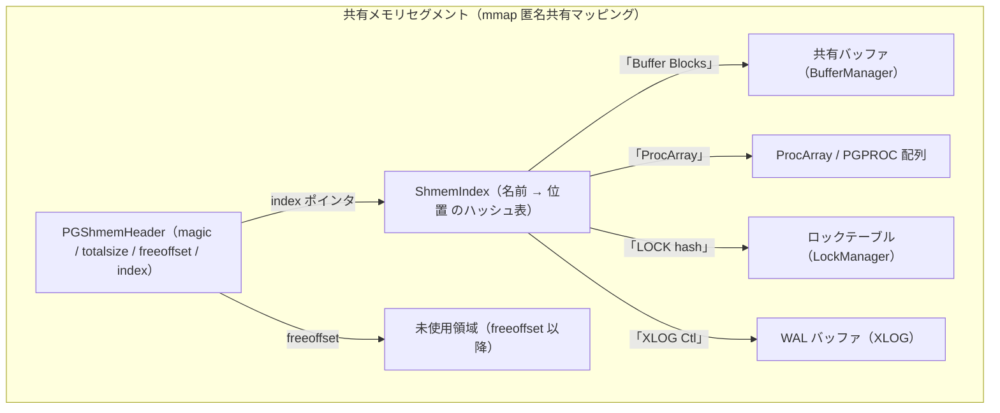

# 第5章 共有メモリとプロセス間通信

> **本章で読むソース**
>
> - [`src/backend/storage/ipc/ipci.c`](https://github.com/postgres/postgres/blob/REL_18_4/src/backend/storage/ipc/ipci.c)
> - [`src/backend/storage/ipc/shmem.c`](https://github.com/postgres/postgres/blob/REL_18_4/src/backend/storage/ipc/shmem.c)
> - [`src/backend/port/sysv_shmem.c`](https://github.com/postgres/postgres/blob/REL_18_4/src/backend/port/sysv_shmem.c)
> - [`src/backend/storage/ipc/dsm.c`](https://github.com/postgres/postgres/blob/REL_18_4/src/backend/storage/ipc/dsm.c)
> - [`src/include/storage/pg_shmem.h`](https://github.com/postgres/postgres/blob/REL_18_4/src/include/storage/pg_shmem.h)
> - [`src/include/storage/shmem.h`](https://github.com/postgres/postgres/blob/REL_18_4/src/include/storage/shmem.h)

## この章の狙い

PostgreSQL のバックエンドと補助プロセスは、それぞれ独立したアドレス空間で動く別々のプロセスである。
にもかかわらず、共有バッファや実行中トランザクションの一覧、ロックの状態を1つの領域として共有できる。
第2章では、この共有メモリを `postmaster` が起動時に確保し、`fork()` で子に引き継ぐ大枠を見た。

本章はその内側を読む。
全プロセスが見る共有メモリは、起動時に「必要量を計算し、1つのセグメントとして一括確保し、その中へ各サブシステムの構造を名前付きで切り出す」という3段階で作られる。
この3段階を担う `CalculateShmemSize`、`PGSharedMemoryCreate`、`ShmemInitStruct` をコードで追い、固定サイズを起動時に決め打ちする設計が、実行時のメモリ確保とプロセス間のポインタ共有のコストをどう避けているかを読み解く。
動的共有メモリ（DSM）は、この固定領域では足りないパラレルクエリ用の追加領域として、本章では概観にとどめる。

## 前提

第4章で `postmaster` がプロセスを起動する流れを、第2章でプロセス構成と共有メモリの大枠を確認した。
本章はその共有メモリの確保と構造化を主題とするため、UNIX の `fork()` でアドレス空間がコピーオンライトで子へ引き継がれること、`mmap()` の匿名共有マッピングと System V 共有メモリ（`shmget`）という2つの共有メモリ機構があることを前提とする。

共有メモリ上の構造を保護する軽量ロック（LWLock）とスピンロックの実装は第35章と第36章で扱う。
本章では、それらが共有メモリの確保時点ですでに使われている事実だけを押さえる。

## 確保の入り口 CreateSharedMemoryAndSemaphores

共有メモリの確保は `CreateSharedMemoryAndSemaphores` 関数に集約される。
この関数は `postmaster` のプロセス内で、子を生むより前に1度だけ呼ばれる。

[`src/backend/storage/ipc/ipci.c` L199-L250](https://github.com/postgres/postgres/blob/REL_18_4/src/backend/storage/ipc/ipci.c#L199-L250)

```c
void
CreateSharedMemoryAndSemaphores(void)
{
	PGShmemHeader *shim;
	PGShmemHeader *seghdr;
	Size		size;
	int			numSemas;

	Assert(!IsUnderPostmaster);

	/* Compute the size of the shared-memory block */
	size = CalculateShmemSize(&numSemas);
	elog(DEBUG3, "invoking IpcMemoryCreate(size=%zu)", size);

	/*
	 * Create the shmem segment
	 */
	seghdr = PGSharedMemoryCreate(size, &shim);

	/*
	 * Make sure that huge pages are never reported as "unknown" while the
	 * server is running.
	 */
	Assert(strcmp("unknown",
				  GetConfigOption("huge_pages_status", false, false)) != 0);

	InitShmemAccess(seghdr);

	/*
	 * Create semaphores.  (This is done here for historical reasons.  We used
	 * to support emulating spinlocks with semaphores, which required
	 * initializing semaphores early.)
	 */
	PGReserveSemaphores(numSemas);

	/*
	 * Set up shared memory allocation mechanism
	 */
	InitShmemAllocation();

	/* Initialize subsystems */
	CreateOrAttachShmemStructs();

	/* Initialize dynamic shared memory facilities. */
	dsm_postmaster_startup(shim);

	/*
	 * Now give loadable modules a chance to set up their shmem allocations
	 */
	if (shmem_startup_hook)
		shmem_startup_hook();
}
```

先頭の `Assert(!IsUnderPostmaster)` が、この関数が `postmaster`（またはスタンドアロンバックエンド）だけで動くことを示す。
処理は4段に分かれる。
`CalculateShmemSize` で必要量を見積もり、`PGSharedMemoryCreate` でその量のセグメントを OS から確保し、`InitShmemAccess` と `InitShmemAllocation` で領域内の割り当て機構を用意し、`CreateOrAttachShmemStructs` で各サブシステムの構造を領域内に作り込む。
最後の `dsm_postmaster_startup` が、本章後半で触れる動的共有メモリの土台を整える。

以降の節で、この4段を「サイズ見積もり」「OS からの確保」「領域内の割り当てと名前引き」の順に読む。

## サイズ見積もり CalculateShmemSize

PostgreSQL の共有メモリは、起動後に伸縮しない固定サイズである。
そのため確保の前に、全サブシステムが必要とする量を漏れなく合算しなければならない。
それを担うのが `CalculateShmemSize` である。

[`src/backend/storage/ipc/ipci.c` L88-L122](https://github.com/postgres/postgres/blob/REL_18_4/src/backend/storage/ipc/ipci.c#L88-L122)

```c
Size
CalculateShmemSize(int *num_semaphores)
{
	Size		size;
	int			numSemas;

	/* Compute number of semaphores we'll need */
	numSemas = ProcGlobalSemas();

	/* Return the number of semaphores if requested by the caller */
	if (num_semaphores)
		*num_semaphores = numSemas;

	/*
	 * Size of the Postgres shared-memory block is estimated via moderately-
	 * accurate estimates for the big hogs, plus 100K for the stuff that's too
	 * small to bother with estimating.
	 *
	 * We take some care to ensure that the total size request doesn't
	 * overflow size_t.  If this gets through, we don't need to be so careful
	 * during the actual allocation phase.
	 */
	size = 100000;
	size = add_size(size, PGSemaphoreShmemSize(numSemas));
	size = add_size(size, hash_estimate_size(SHMEM_INDEX_SIZE,
											 sizeof(ShmemIndexEnt)));
	size = add_size(size, dsm_estimate_size());
	size = add_size(size, DSMRegistryShmemSize());
	size = add_size(size, BufferManagerShmemSize());
	size = add_size(size, LockManagerShmemSize());
	size = add_size(size, PredicateLockShmemSize());
	size = add_size(size, ProcGlobalShmemSize());
	size = add_size(size, XLogPrefetchShmemSize());
	size = add_size(size, VarsupShmemSize());
	size = add_size(size, XLOGShmemSize());
```

`size` の初期値 `100000` は、個別に見積もるほどでもない小さな構造のための余裕分である。
そこへ各サブシステムの `...ShmemSize()` 関数の戻り値を順に足し込む。
共有バッファの量を返す `BufferManagerShmemSize`、ロックテーブルの量を返す `LockManagerShmemSize`、プロセス配列の量を返す `ProcGlobalShmemSize` などが並ぶ。
足し込みは生の `+` ではなく `add_size` を使う。
コメントが述べるとおり、合計が `size_t` を溢れないようにここで桁あふれを検査しておけば、実際の確保フェーズでは溢れを気にせず済むためである。

足し込みの一覧は、確保される共有メモリに何が載るかの目録そのものになっている。
個々のサブシステムが何バイト要求するかは、その量がプロセス数やバッファ枚数といった設定（GUC）から計算される点が共通する。
末尾では、合計をページサイズの倍数へ丸める。

[`src/backend/storage/ipc/ipci.c` L157-L160](https://github.com/postgres/postgres/blob/REL_18_4/src/backend/storage/ipc/ipci.c#L157-L160)

```c
	/* might as well round it off to a multiple of a typical page size */
	size = add_size(size, 8192 - (size % 8192));

	return size;
```

`shared_buffers` や `max_connections` などの設定を変えると、ここで合算される量が変わり、確保される共有メモリの総量も変わる。
このため共有メモリのサイズは設定で決まり、起動後は固定される。
同じ `CalculateShmemSize` は `InitializeShmemGUCs` からも呼ばれ、その値が `shared_memory_size`（必要バイト数）や `shared_memory_size_in_huge_pages`（必要な huge page 数）として実行時計算の GUC に書き戻される。
つまり起動前に必要量を知る経路と、実際に確保する経路が同じ計算を共有する。

## OS からの確保 PGSharedMemoryCreate

見積もったサイズを実際に OS から取るのが `PGSharedMemoryCreate` である。
ここで PostgreSQL は、確保の主役を `mmap()` の匿名共有マッピングに置き、System V 共有メモリは小さな目印としてだけ使う。

[`src/backend/port/sysv_shmem.c` L737-L755](https://github.com/postgres/postgres/blob/REL_18_4/src/backend/port/sysv_shmem.c#L737-L755)

```c
	if (shared_memory_type == SHMEM_TYPE_MMAP)
	{
		AnonymousShmem = CreateAnonymousSegment(&size);
		AnonymousShmemSize = size;

		/* Register on-exit routine to unmap the anonymous segment */
		on_shmem_exit(AnonymousShmemDetach, (Datum) 0);

		/* Now we need only allocate a minimal-sized SysV shmem block. */
		sysvsize = sizeof(PGShmemHeader);
	}
	else
	{
		sysvsize = size;

		/* huge pages are only available with mmap */
		SetConfigOption("huge_pages_status", "off",
						PGC_INTERNAL, PGC_S_DYNAMIC_DEFAULT);
	}
```

`shared_memory_type` の既定値は `SHMEM_TYPE_MMAP` であり、この分岐に入る。
本体は `CreateAnonymousSegment` が返す匿名共有マッピングが受け持ち、System V 側は `PGShmemHeader` 1個ぶん（`sysvsize`）しか取らない。

この2段構えの理由は、ファイル冒頭のコメントに書かれている。
多くのシステムは System V 共有メモリに小さい上限を設けており、大きな共有メモリを取ろうとすると OS のカーネル設定の調整を強いられる。
そこで本体を匿名 `mmap()` に移し、System V には最小限の領域だけを残す。
残した小さな System V セグメントは、データディレクトリと結びつく目印として働く。
`PGSharedMemoryCreate` の前段では、データディレクトリの inode から導いた鍵で `shmget` を試み、過去にクラッシュした `postmaster` が残したセグメントが生きていないかを判定する。
この目印があるおかげで、同じデータディレクトリに対して二重にサーバを起動する事故を検出でき、古い残骸があれば再利用できる。

本体側の匿名マッピングを作るのが `CreateAnonymousSegment` である。

[`src/backend/port/sysv_shmem.c` L639-L667](https://github.com/postgres/postgres/blob/REL_18_4/src/backend/port/sysv_shmem.c#L639-L667)

```c
	if (ptr == MAP_FAILED && huge_pages != HUGE_PAGES_ON)
	{
		/*
		 * Use the original size, not the rounded-up value, when falling back
		 * to non-huge pages.
		 */
		allocsize = *size;
		ptr = mmap(NULL, allocsize, PROT_READ | PROT_WRITE,
				   PG_MMAP_FLAGS, -1, 0);
		mmap_errno = errno;
	}

	if (ptr == MAP_FAILED)
	{
		errno = mmap_errno;
		ereport(FATAL,
				(errmsg("could not map anonymous shared memory: %m"),
				 (mmap_errno == ENOMEM) ?
				 errhint("This error usually means that PostgreSQL's request "
						 "for a shared memory segment exceeded available memory, "
						 "swap space, or huge pages. To reduce the request size "
						 "(currently %zu bytes), reduce PostgreSQL's shared "
						 "memory usage, perhaps by reducing \"shared_buffers\" or "
						 "\"max_connections\".",
						 allocsize) : 0));
	}

	*size = allocsize;
	return ptr;
```

マッピングの旗（フラグ）は `PG_MMAP_FLAGS` にまとまっており、その実体は `MAP_SHARED|MAP_ANONYMOUS|MAP_HASSEMAPHORE` である。
`MAP_ANONYMOUS` はファイルに紐づかないメモリを、`MAP_SHARED` は `fork()` した子と物理ページを共有するマッピングを指す。
この2つの組み合わせが、ファイルを介さずに全プロセスが同じ物理メモリを見るための鍵になる。
`mmap` の第1引数を `NULL` にしているため、配置アドレスは OS が選ぶ。

確保したセグメントの先頭には、標準ヘッダ `PGShmemHeader` が置かれる。

[`src/include/storage/pg_shmem.h` L29-L42](https://github.com/postgres/postgres/blob/REL_18_4/src/include/storage/pg_shmem.h#L29-L42)

```c
typedef struct PGShmemHeader	/* standard header for all Postgres shmem */
{
	int32		magic;			/* magic # to identify Postgres segments */
#define PGShmemMagic  679834894
	pid_t		creatorPID;		/* PID of creating process (set but unread) */
	Size		totalsize;		/* total size of segment */
	Size		freeoffset;		/* offset to first free space */
	dsm_handle	dsm_control;	/* ID of dynamic shared memory control seg */
	void	   *index;			/* pointer to ShmemIndex table */
#ifndef WIN32					/* Windows doesn't have useful inode#s */
	dev_t		device;			/* device data directory is on */
	ino_t		inode;			/* inode number of data directory */
#endif
} PGShmemHeader;
```

`totalsize` はセグメント全体の大きさ、`freeoffset` は未使用領域の先頭までのオフセットである。
このヘッダ自身が領域の管理情報を兼ねており、後述の割り当ては `freeoffset` を進めることで進む。
`index` は本章で扱う `ShmemIndex`（名前引き表）の先頭を指す。
匿名 `mmap()` を使う構成では、`PGSharedMemoryCreate` の末尾で、この初期化済みヘッダを System V 側から匿名セグメントの先頭へコピーし、匿名セグメントのほうを本体として返す。

### huge pages

`CreateAnonymousSegment` は、`huge_pages` 設定が `on` または `try` のとき、まず `MAP_HUGETLB` 付きで `mmap()` を試みる。
huge pages は、通常4KiB のメモリページをより大きな単位（たとえば2MiB）でまとめて扱う仕組みである。
共有メモリのような広い領域を大きなページで覆うと、アドレス変換表（TLB）の引きが当たりやすくなり、変換の失敗による遅延が減る。
`try` で確保に失敗した場合は、先のコードで見たとおり丸める前の元サイズに戻して通常ページで `mmap()` をやり直す。
huge pages の必要数の計算や設定の詳細は付録Aで扱う。

## 領域内の割り当て ShmemAlloc

OS からセグメントを取ったあと、その中を各サブシステムへ切り分ける割り当て器が要る。
`InitShmemAccess` がヘッダから領域の先頭と末尾を覚え、`InitShmemAllocation` が割り当て用のスピンロックを用意したうえで、割り当ての本体 `ShmemAlloc` が使えるようになる。

[`src/backend/storage/ipc/shmem.c` L185-L227](https://github.com/postgres/postgres/blob/REL_18_4/src/backend/storage/ipc/shmem.c#L185-L227)

```c
static void *
ShmemAllocRaw(Size size, Size *allocated_size)
{
	Size		newStart;
	Size		newFree;
	void	   *newSpace;

	/*
	 * Ensure all space is adequately aligned.  We used to only MAXALIGN this
	 * space but experience has proved that on modern systems that is not good
	 * enough.  Many parts of the system are very sensitive to critical data
	 * structures getting split across cache line boundaries.  To avoid that,
	 * attempt to align the beginning of the allocation to a cache line
	 * boundary.  The calling code will still need to be careful about how it
	 * uses the allocated space - e.g. by padding each element in an array of
	 * structures out to a power-of-two size - but without this, even that
	 * won't be sufficient.
	 */
	size = CACHELINEALIGN(size);
	*allocated_size = size;

	Assert(ShmemSegHdr != NULL);

	SpinLockAcquire(ShmemLock);

	newStart = ShmemSegHdr->freeoffset;

	newFree = newStart + size;
	if (newFree <= ShmemSegHdr->totalsize)
	{
		newSpace = (char *) ShmemBase + newStart;
		ShmemSegHdr->freeoffset = newFree;
	}
	else
		newSpace = NULL;

	SpinLockRelease(ShmemLock);

	/* note this assert is okay with newSpace == NULL */
	Assert(newSpace == (void *) CACHELINEALIGN(newSpace));

	return newSpace;
}
```

割り当ての仕組みは単純な前進方式である。
`freeoffset` が指す位置から要求量ぶんを切り出し、`freeoffset` をその先へ進めるだけで、空き領域を探す処理も解放の処理もない。
ヘッダコメントが述べるとおり、この割り当て器は二度と解放しないことを前提に設計されている。
共有メモリは起動時にすべて確保され、確保した構造は稼働中ずっと使われ続けるため、解放を捨てて確保を最速にしている。

割り当ての前に `size = CACHELINEALIGN(size)` でサイズをキャッシュライン境界へ丸める点も読み取りたい。
共有メモリ上の構造は多数のプロセスから同時に触られるため、別々の構造が同じキャッシュラインに同居すると、片方の更新がもう片方のキャッシュを無効化する偽の共有が起きる。
確保の単位をキャッシュライン境界にそろえることで、この干渉を起こりにくくしている。
`ShmemLock` を握る区間はオフセットを進めるだけのごく短い操作なので、保護にはスピンロックを使う。

## 名前で構造を引く ShmemIndex

`ShmemAlloc` は領域を切り出すが、切り出した領域がどのサブシステムのものかは記録しない。
それを名前で管理するのが `ShmemIndex` というハッシュ表である。
各サブシステムは `ShmemInitStruct` に名前とサイズを渡して領域を予約し、初期化済みかどうかを名前で判定する。

[`src/backend/storage/ipc/shmem.c` L386-L429](https://github.com/postgres/postgres/blob/REL_18_4/src/backend/storage/ipc/shmem.c#L386-L429)

```c
void *
ShmemInitStruct(const char *name, Size size, bool *foundPtr)
{
	ShmemIndexEnt *result;
	void	   *structPtr;

	LWLockAcquire(ShmemIndexLock, LW_EXCLUSIVE);

	if (!ShmemIndex)
	{
		PGShmemHeader *shmemseghdr = ShmemSegHdr;

		/* Must be trying to create/attach to ShmemIndex itself */
		Assert(strcmp(name, "ShmemIndex") == 0);

		if (IsUnderPostmaster)
		{
			/* Must be initializing a (non-standalone) backend */
			Assert(shmemseghdr->index != NULL);
			structPtr = shmemseghdr->index;
			*foundPtr = true;
		}
		else
		{
			/*
			 * If the shmem index doesn't exist, we are bootstrapping: we must
			 * be trying to init the shmem index itself.
			 *
			 * Notice that the ShmemIndexLock is released before the shmem
			 * index has been initialized.  This should be OK because no other
			 * process can be accessing shared memory yet.
			 */
			Assert(shmemseghdr->index == NULL);
			structPtr = ShmemAlloc(size);
			shmemseghdr->index = structPtr;
			*foundPtr = false;
		}
		LWLockRelease(ShmemIndexLock);
		return structPtr;
	}

	/* look it up in the shmem index */
	result = (ShmemIndexEnt *)
		hash_search(ShmemIndex, name, HASH_ENTER_NULL, foundPtr);
```

冒頭の `if (!ShmemIndex)` は、名前引き表そのものをまだ作っていない初期化の最初の一手を捌く特別扱いである。
表が空のうちに表自身を引こうとする鶏と卵の関係を、`ShmemIndex` という決め打ちの名前で回避している。
この特別扱いを過ぎれば、あとは `hash_search` で名前を引くだけになる。

名前が表になければ（`*foundPtr` が偽）、`ShmemAllocRaw` で新しく領域を切り出し、その位置とサイズを表へ記録する。

[`src/backend/storage/ipc/shmem.c` L440-L485](https://github.com/postgres/postgres/blob/REL_18_4/src/backend/storage/ipc/shmem.c#L440-L485)

```c
	if (*foundPtr)
	{
		/*
		 * Structure is in the shmem index so someone else has allocated it
		 * already.  The size better be the same as the size we are trying to
		 * initialize to, or there is a name conflict (or worse).
		 */
		if (result->size != size)
		{
			LWLockRelease(ShmemIndexLock);
			ereport(ERROR,
					(errmsg("ShmemIndex entry size is wrong for data structure"
							" \"%s\": expected %zu, actual %zu",
							name, size, result->size)));
		}
		structPtr = result->location;
	}
	else
	{
		Size		allocated_size;

		/* It isn't in the table yet. allocate and initialize it */
		structPtr = ShmemAllocRaw(size, &allocated_size);
		if (structPtr == NULL)
		{
			/* out of memory; remove the failed ShmemIndex entry */
			hash_search(ShmemIndex, name, HASH_REMOVE, NULL);
			LWLockRelease(ShmemIndexLock);
			ereport(ERROR,
					(errcode(ERRCODE_OUT_OF_MEMORY),
					 errmsg("not enough shared memory for data structure"
							" \"%s\" (%zu bytes requested)",
							name, size)));
		}
		result->size = size;
		result->allocated_size = allocated_size;
		result->location = structPtr;
	}

	LWLockRelease(ShmemIndexLock);

	Assert(ShmemAddrIsValid(structPtr));

	Assert(structPtr == (void *) CACHELINEALIGN(structPtr));

	return structPtr;
```

名前がすでに表にあれば（`*foundPtr` が真）、新たに切り出さず、表に記録済みの位置 `result->location` を返す。
このとき要求サイズが記録と食い違えば名前の衝突としてエラーにする。
表の各エントリは `ShmemIndexEnt` で、名前、領域の位置、要求サイズ、実際に確保したサイズを持つ。

[`src/include/storage/shmem.h` L53-L60](https://github.com/postgres/postgres/blob/REL_18_4/src/include/storage/shmem.h#L53-L60)

```c
/* this is a hash bucket in the shmem index table */
typedef struct
{
	char		key[SHMEM_INDEX_KEYSIZE];	/* string name */
	void	   *location;		/* location in shared mem */
	Size		size;			/* # bytes requested for the structure */
	Size		allocated_size; /* # bytes actually allocated */
} ShmemIndexEnt;
```

### fork とポインタ共有、そして EXEC_BACKEND

`ShmemInitStruct` が返すのは、共有メモリ領域内の生のポインタである。
通常の `fork()` 構成では、子は親のアドレス空間をそのまま引き継ぐため、親が初期化時に得たポインタ値が子でもそのまま有効になる。
匿名 `mmap()` を `MAP_SHARED` で作ってあるので、親と子は同じ物理ページを同じ仮想アドレスで見る。
だから子のバックエンドは、共有構造のアドレスを引き直す必要がなく、親が起動時に1度だけ初期化した結果を受け取るだけで済む。

この経路では `ShmemInitStruct` の名前引きは、主にどの構造を初期化済みかを管理する役に回る。
一方、Windows などプロセスの `fork()` を使えない `EXEC_BACKEND` 構成では事情が変わる。
子は親のアドレス空間を引き継がず、共有メモリへ物理的に接続し直すため、各構造のアドレスを自力で復元しなければならない。

[`src/backend/storage/ipc/shmem.c` L50-L55](https://github.com/postgres/postgres/blob/REL_18_4/src/backend/storage/ipc/shmem.c#L50-L55)

```c
 *		(c) In standard Unix-ish environments, individual backends do not
 *	need to re-establish their local pointers into shared memory, because
 *	they inherit correct values of those variables via fork() from the
 *	postmaster.  However, this does not work in the EXEC_BACKEND case.
 *	In ports using EXEC_BACKEND, new backends have to set up their local
 *	pointers using the method described in (b) above.
```

`EXEC_BACKEND` の子は `CreateOrAttachShmemStructs` を通じて初期化経路をもう一度たどり、各サブシステムが同じ名前で `ShmemInitStruct` を呼び直す。
名前が表にすでにあるため、確保はされず、記録済みの位置がローカルのポインタへ復元される。
こうして `ShmemIndex` は、`fork()` 構成と `EXEC_BACKEND` 構成のどちらでも同じ初期化コードを通せるようにする要になっている。

### レイアウトと名前引きの全体像

ここまでの構造を図にまとめる。
OS から取った1つのセグメントの先頭にヘッダがあり、その直後から `ShmemAlloc` が前進方式で各構造を切り出す。
`ShmemIndex` は、その各構造の位置を名前から引ける表として、同じ領域内に置かれる。



各サブシステムは初期化時に自分の名前で `ShmemInitStruct` を呼び、領域を予約して `ShmemIndex` に登録する。
別のプロセスが同じ構造を探すときは、同じ名前で引けば同じ位置にたどり着く。
領域全体は `pg_get_shmem_allocations` ビューで名前ごとの割り当て量として確認でき、この表がそのまま観測点になっている。

## 動的共有メモリ DSM の位置づけ

ここまで見た共有メモリは、起動時に固定サイズで確保され、稼働中は伸縮しない。
これに対し、稼働中に一時的な共有領域が要る場面もある。
代表例がパラレルクエリで、1つの問い合わせを複数のワーカープロセスで分担するとき、親とワーカーが結果や中間状態を受け渡す領域を実行時に確保したい。
これを担うのが**動的共有メモリ**（DSM）であり、`dsm.c` が管理する。

[`src/backend/storage/ipc/dsm.c` L505-L516](https://github.com/postgres/postgres/blob/REL_18_4/src/backend/storage/ipc/dsm.c#L505-L516)

```c
/*
 * Create a new dynamic shared memory segment.
 *
 * If there is a non-NULL CurrentResourceOwner, the new segment is associated
 * with it and must be detached before the resource owner releases, or a
 * warning will be logged.  If CurrentResourceOwner is NULL, the segment
 * remains attached until explicitly detached or the session ends.
 * Creating with a NULL CurrentResourceOwner is equivalent to creating
 * with a non-NULL CurrentResourceOwner and then calling dsm_pin_mapping.
 */
dsm_segment *
dsm_create(Size size, int flags)
```

固定領域との違いは2点ある。
第1に、`dsm_create` は稼働中に呼べて、要求した量のセグメントを動的に確保する。
第2に、確保したセグメントはリソースオーナーに結びつき、不要になれば解放される。
起動時一括確保で二度と解放しない固定領域とは、寿命の扱いが逆である。

DSM のセグメントは別々のプロセスが独立に `mmap()` するため、同じセグメントでもプロセスごとに配置アドレスが異なりうる。
そのため DSM 上のポインタは生アドレスでは共有できず、セグメント先頭からのオフセットでやり取りする決まりになっている。
固定領域が `fork()` でアドレスごと共有できたのとは対照的で、この違いがパラレルクエリ側のコードに制約を課す。
DSM の内部実装とパラレルクエリでの使われ方は、エグゼキュータを扱う章に送る。

## 高速化の工夫 起動時一括確保と名前引きの組み合わせ

本章の中心にある工夫は、共有メモリを「起動時に固定サイズで一括確保し、その中を二度と解放しない前進方式で切り出し、名前引き表で位置を共有する」点に集約される。
これが効くのは、稼働中の2つのコストを起動時へ前倒しして消しているからである。

1つ目は、実行時のメモリ確保のコストである。
必要量を `CalculateShmemSize` で先に合算して1回の `mmap()` で取り切るため、稼働中に共有領域を取り直す必要がない。
切り出しも `freeoffset` を進めるだけの前進方式で、空き探索も解放も持たない。
共有構造は稼働中ずっと生き続けるので、解放を捨てることが確保を最速にする選択になる。

2つ目は、プロセス間でポインタを共有するコストである。
`fork()` 構成では、親が起動時に得た共有構造のポインタ値が、コピーオンライトで子へそのまま渡る。
匿名 `mmap()` を `MAP_SHARED` で作ってあるため、親と子は同じ物理ページを同じアドレスで見る。
だから子は、共有構造のアドレスを問い合わせる手続きを踏まずに、親の初期化結果を受け取るだけで全構造を指せる。

名前引きの `ShmemIndex` は、この2つを支えつつ、`fork()` を使えない `EXEC_BACKEND` 構成でも同じ初期化コードを通せるようにする。
通常構成では初期化済みかの管理に、`EXEC_BACKEND` 構成ではアドレスの復元に、同じ表が使われる。
固定領域で実行時コストを消し、構成差を名前引きで吸収する、この組み合わせが PostgreSQL の共有メモリ設計の核である。

## まとめ

PostgreSQL の共有メモリは、`postmaster` が子を生むより前に `CreateSharedMemoryAndSemaphores` で1度だけ確保する。
まず `CalculateShmemSize` が全サブシステムの必要量を設定から合算し、`PGSharedMemoryCreate` がその量を匿名 `mmap()` で一括確保して、System V には目印の小領域だけを残す。
領域内は `ShmemAlloc` が `freeoffset` を進める前進方式で切り出し、解放を持たない。
切り出した各構造は `ShmemInitStruct` を通じて `ShmemIndex` に名前で登録され、別プロセスは同じ名前で同じ位置へたどり着く。
`fork()` 構成では子が親のポインタをそのまま継ぐため名前引きは初期化管理に回り、`EXEC_BACKEND` 構成では同じ表がアドレス復元に使われる。
固定サイズの起動時一括確保と名前引きの組み合わせが、実行時のメモリ確保とポインタ共有のコストを起動時へ前倒しして消している。
パラレルクエリ用の追加領域を動的に確保する DSM は、寿命と配置アドレスの扱いが固定領域と異なり、詳細はエグゼキュータの章に送る。

## 関連する章

- 第2章 [全体アーキテクチャとプロセスモデル](../part00-introduction/02-architecture-overview.md)
- 第4章 [postmaster とプロセスの起動](04-postmaster-and-processes.md)
- 第6章 [メモリコンテキストと palloc](06-memory-contexts.md)
- 第7章 [ラッチとシグナル処理](07-latches-and-signals.md)
- 第22章 [共有バッファとバッファ管理](../part05-storage-buffer/22-buffer-manager.md)
- 第35章 [軽量ロック（LWLock）](../part08-transactions-concurrency/35-lightweight-locks.md)
- 第36章 [スピンロック](../part08-transactions-concurrency/36-spinlocks.md)
- 第37章 [スナップショットと ProcArray](../part08-transactions-concurrency/37-snapshots-and-procarray.md)
- [付録A　Linux カーネルの `PREEMPT_NONE` 廃止とスピンロックの性能問題](../appendix/A01-preempt-none-and-spinlocks.md)
