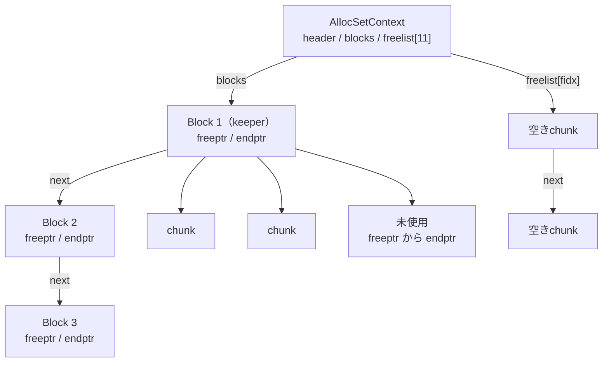
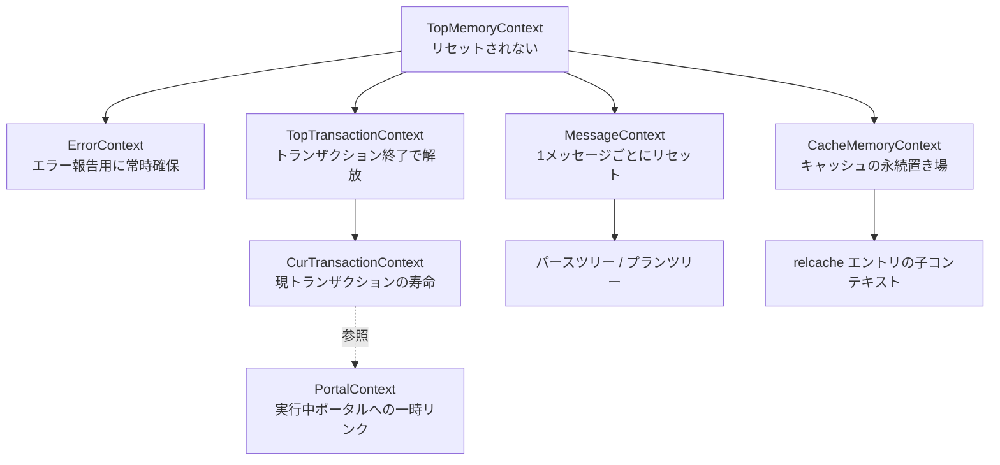

# 第6章 メモリコンテキストと palloc

> **本章で読むソース**
>
> - [`src/backend/utils/mmgr/mcxt.c`](https://github.com/postgres/postgres/blob/REL_18_4/src/backend/utils/mmgr/mcxt.c)
> - [`src/backend/utils/mmgr/aset.c`](https://github.com/postgres/postgres/blob/REL_18_4/src/backend/utils/mmgr/aset.c)
> - [`src/include/nodes/memnodes.h`](https://github.com/postgres/postgres/blob/REL_18_4/src/include/nodes/memnodes.h)
> - [`src/include/utils/palloc.h`](https://github.com/postgres/postgres/blob/REL_18_4/src/include/utils/palloc.h)
> - [`src/include/utils/memutils.h`](https://github.com/postgres/postgres/blob/REL_18_4/src/include/utils/memutils.h)

## この章の狙い

C 言語には `malloc` と `free` しかない。
1つの問い合わせを処理するあいだにパースツリー、プランツリー、実行状態など数千の小さな構造体を確保し、問い合わせが終わったらそれらをすべて解放する。
この解放を個別の `free` で漏れなく行うのは難しく、エラーで処理が中断するとなおさら難しい。

PostgreSQL はこの問題を、**メモリコンテキスト**（MemoryContext）という独自のメモリ管理層で解いている。
すべての確保はいずれかのコンテキストに属し、コンテキストを1回リセットまたは削除すれば、そこに属する確保がまとめて解放される。
個別の `free` を呼ぶ必要がなく、解放漏れも起きにくい。

本章は三つの層を順に読む。
まず抽象層として、コンテキストが親子のツリーをなすことと、`palloc` がどのコンテキストへ確保するかを `mcxt.c` で読む。
次に実装層として、標準の実装である `AllocSet` が `malloc` から取った大きなブロックを小さなチャンクに切り分け、フリーリストで再利用する仕組みを `aset.c` で読む。
最後に、コンテキスト単位の一括解放がなぜ速く、なぜ漏れに強いのかを機構として説明する。

## 前提

第4章で `postmaster` がバックエンドを fork すること、第5章で共有メモリの構成を見た。
本章が扱うのは共有メモリではなく、バックエンドプロセスごとに独立したヒープ（プロセスローカルなメモリ）の管理である。
複数プロセスで共有するメモリには別の仕組みが要り、それは第5章で扱った。

メモリコンテキストは PostgreSQL のほぼ全モジュールが使う基盤であり、後続のパーサ（第10章）、プランナ（第13章）、エグゼキュータ（第16章）はいずれも自分専用のコンテキストを作って働く。

## コンテキストは抽象型である

メモリコンテキストは1つの実装に固定されていない。
ヘッダ `memnodes.h` は、コンテキストの共通フィールドを持つ構造体 `MemoryContextData` と、確保や解放の具体的なふるまいを関数ポインタで束ねた**メソッドテーブル**（`MemoryContextMethods`）を分けて定義する。
コメントが述べるとおり、これは C++ でいう仮想関数テーブルにあたる。

[`src/include/nodes/memnodes.h` L58-L69](https://github.com/postgres/postgres/blob/REL_18_4/src/include/nodes/memnodes.h#L58-L69)

```c
typedef struct MemoryContextMethods
{
	/*
	 * Function to handle memory allocation requests of 'size' to allocate
	 * memory into the given 'context'.  The function must handle flags
	 * MCXT_ALLOC_HUGE and MCXT_ALLOC_NO_OOM.  MCXT_ALLOC_ZERO is handled by
	 * the calling function.
	 */
	void	   *(*alloc) (MemoryContext context, Size size, int flags);

	/* call this free_p in case someone #define's free() */
	void		(*free_p) (void *pointer);
```

`alloc` は確保、`free_p` は解放、`reset` はコンテキスト内の全確保を無効化、`delete_context` はコンテキストの全メモリ解放を担う。
これらが関数ポインタになっているため、`palloc` などの共通コードは実装の中身を知らずに「いまのコンテキストの `alloc` を呼ぶ」とだけ書ける。

コンテキスト本体 `MemoryContextData` は、メソッドテーブルへのポインタと、親子をつなぐリンクを持つ。

[`src/include/nodes/memnodes.h` L117-L134](https://github.com/postgres/postgres/blob/REL_18_4/src/include/nodes/memnodes.h#L117-L134)

```c
typedef struct MemoryContextData
{
	pg_node_attr(abstract)		/* there are no nodes of this type */

	NodeTag		type;			/* identifies exact kind of context */
	/* these two fields are placed here to minimize alignment wastage: */
	bool		isReset;		/* T = no space alloced since last reset */
	bool		allowInCritSection; /* allow palloc in critical section */
	Size		mem_allocated;	/* track memory allocated for this context */
	const MemoryContextMethods *methods;	/* virtual function table */
	MemoryContext parent;		/* NULL if no parent (toplevel context) */
	MemoryContext firstchild;	/* head of linked list of children */
	MemoryContext prevchild;	/* previous child of same parent */
	MemoryContext nextchild;	/* next child of same parent */
	const char *name;			/* context name */
	const char *ident;			/* context ID if any */
	MemoryContextCallback *reset_cbs;	/* list of reset/delete callbacks */
} MemoryContextData;
```

`parent`、`firstchild`、`prevchild`、`nextchild` の4本のリンクが、コンテキストを親子のツリーへ組み上げる。
親は子のリストの先頭（`firstchild`）だけを持ち、子どうしは `nextchild` と `prevchild` で双方向につながる。
このツリー構造が、後で見る一括解放の土台になる。

`isReset` は、このコンテキストで前回のリセット以降に確保が行われていないことを示すフラグである。
このフラグがあるおかげで、何も確保していないコンテキストのリセットを、実際の解放処理を呼ばずに省ける。

PostgreSQL 18.4 には実装が四つある。
ヘッダの `MemoryContextIsValid` マクロが受け付ける型がそれを示す。

[`src/include/nodes/memnodes.h` L145-L150](https://github.com/postgres/postgres/blob/REL_18_4/src/include/nodes/memnodes.h#L145-L150)

```c
#define MemoryContextIsValid(context) \
	((context) != NULL && \
	 (IsA((context), AllocSetContext) || \
	  IsA((context), SlabContext) || \
	  IsA((context), GenerationContext) || \
	  IsA((context), BumpContext)))
```

`AllocSet` は汎用の標準実装で、本章が読むのはこれである。
`Slab` は同じサイズのオブジェクトを大量に扱う用途、`Generation` は確保順とほぼ逆順に解放される用途、`Bump` は個別解放を捨てて確保だけを極限まで速くした用途に、それぞれ向けて作られている。
いずれも `MemoryContextMethods` という同じインタフェースを実装するため、利用側のコードは実装を区別せずに `palloc` や `pfree` を呼べる。

## トップレベルのコンテキストと CurrentMemoryContext

コンテキストのツリーには、決まった根がある。
`mcxt.c` はグローバル変数として `TopMemoryContext` をはじめとする標準コンテキストを宣言する。

[`src/backend/utils/mmgr/mcxt.c` L150-L159](https://github.com/postgres/postgres/blob/REL_18_4/src/backend/utils/mmgr/mcxt.c#L150-L159)

```c
MemoryContext TopMemoryContext = NULL;
MemoryContext ErrorContext = NULL;
MemoryContext PostmasterContext = NULL;
MemoryContext CacheMemoryContext = NULL;
MemoryContext MessageContext = NULL;
MemoryContext TopTransactionContext = NULL;
MemoryContext CurTransactionContext = NULL;

/* This is a transient link to the active portal's memory context: */
MemoryContext PortalContext = NULL;
```

`TopMemoryContext` はツリーの根であり、他のすべてのコンテキストはこの直接または間接の子になる。
`mmgr/README` が述べるとおり、ここはリセットも削除もされないため、ここでの確保は事実上 `malloc` と同じ寿命を持つ。
そのため、寿命の長いものだけをここに置く。

寿命の異なる作業ごとに、専用のコンテキストが用意されている。
`MessageContext` はフロントエンドから来た1つのコマンドメッセージと、そこから派生したパースツリーやプランツリーを保持する。
`TopTransactionContext` はトップレベルトランザクションの終わりまで生きるデータを、`CurTransactionContext` は現在のトランザクション（サブトランザクションを含む）の終わりまで生きるデータを保持する。
`PortalContext` は実行中のポータルのコンテキストへの一時的なリンクである。
`CacheMemoryContext` はリレーションキャッシュやカタログキャッシュの永続的な置き場で、こちらもリセットされない。

これらのコンテキストは、バックエンドの起動時に `MemoryContextInit` でツリーへ組まれる。
この関数はまず `TopMemoryContext` を `AllocSet` として作り、`CurrentMemoryContext` をそこへ向ける。

[`src/backend/utils/mmgr/mcxt.c` L344-L360](https://github.com/postgres/postgres/blob/REL_18_4/src/backend/utils/mmgr/mcxt.c#L344-L360)

```c
void
MemoryContextInit(void)
{
	Assert(TopMemoryContext == NULL);

	/*
	 * First, initialize TopMemoryContext, which is the parent of all others.
	 */
	TopMemoryContext = AllocSetContextCreate((MemoryContext) NULL,
											 "TopMemoryContext",
											 ALLOCSET_DEFAULT_SIZES);

	/*
	 * Not having any other place to point CurrentMemoryContext, make it point
	 * to TopMemoryContext.  Caller should change this soon!
	 */
	CurrentMemoryContext = TopMemoryContext;
```

`CurrentMemoryContext` は、`palloc` が確保先に使う既定のコンテキストである。
各モジュールは自分の作業用コンテキストへ切り替えてから確保を行い、終わったら元へ戻す。
この切り替えは `MemoryContextSwitchTo` で行う。

[`src/include/utils/palloc.h` L137-L144](https://github.com/postgres/postgres/blob/REL_18_4/src/include/utils/palloc.h#L137-L144)

```c
static inline MemoryContext
MemoryContextSwitchTo(MemoryContext context)
{
	MemoryContext old = CurrentMemoryContext;

	CurrentMemoryContext = context;
	return old;
}
```

`MemoryContextSwitchTo` は `CurrentMemoryContext` を差し替え、**切り替え前のコンテキストを返す**。
呼び出し側はこの戻り値を保存しておき、作業のあとで再び `MemoryContextSwitchTo` に渡して元へ戻す。
処理は単なる代入であり、インライン関数として書かれているため呼び出しのコストもない。

このイディオムは PostgreSQL のコード全体で繰り返し現れる。
たとえばバックエンドのメインループは、1つの単純問い合わせをパースする前に `MessageContext` へ切り替える。

[`src/backend/tcop/postgres.c` L1059](https://github.com/postgres/postgres/blob/REL_18_4/src/backend/tcop/postgres.c#L1059)

```c
	oldcontext = MemoryContextSwitchTo(MessageContext);
```

以後の `palloc` はすべて `MessageContext` へ確保される。
その問い合わせのためのパースツリーやプランツリーは、こうして1つのコンテキストへ集まる。

## palloc と pfree

`palloc` の中身は、いま見た切り替えの仕組みの上に乗っている。
`CurrentMemoryContext` を取り出し、そのメソッドテーブルの `alloc` を呼ぶだけである。

[`src/backend/utils/mmgr/mcxt.c` L1345-L1373](https://github.com/postgres/postgres/blob/REL_18_4/src/backend/utils/mmgr/mcxt.c#L1345-L1373)

```c
void *
palloc(Size size)
{
	/* duplicates MemoryContextAlloc to avoid increased overhead */
	void	   *ret;
	MemoryContext context = CurrentMemoryContext;

	Assert(MemoryContextIsValid(context));
	AssertNotInCriticalSection(context);

	context->isReset = false;

	/*
	 * For efficiency reasons, we purposefully offload the handling of
	 * allocation failures to the MemoryContextMethods implementation as this
	 * allows these checks to be performed only when an actual malloc needs to
	 * be done to request more memory from the OS.  Additionally, not having
	 * to execute any instructions after this call allows the compiler to use
	 * the sibling call optimization.  If you're considering adding code after
	 * this call, consider making it the responsibility of the 'alloc'
	 * function instead.
	 */
	ret = context->methods->alloc(context, size, 0);
	/* We expect OOM to be handled by the alloc function */
	Assert(ret != NULL);
	VALGRIND_MEMPOOL_ALLOC(context, ret, size);

	return ret;
}
```

`palloc` は確保した瞬間に `context->isReset = false` を立て、このコンテキストにまだ生きた確保があることを記録する。
メモリ不足の処理は呼び出し側ではなく `alloc` 実装の中で行う。
コメントが説明するとおり、これは確保が成功する通常経路に余計な命令を挟まないための設計で、`alloc` の呼び出しを関数の末尾に置くことでコンパイラの末尾呼び出し最適化も効かせている。

`palloc` は確保先のコンテキストを引数で受け取らない。
つまり、どのコンテキストに置くかは、確保のたびに指定するのではなく、`MemoryContextSwitchTo` で設定した「いまのコンテキスト」に従う。
特定のコンテキストを名指しして確保したいときは `MemoryContextAlloc(context, size)` を使う。

解放側の `pfree` は、確保先のコンテキストを引数に取らない点がより重要である。

[`src/backend/utils/mmgr/mcxt.c` L1552-L1566](https://github.com/postgres/postgres/blob/REL_18_4/src/backend/utils/mmgr/mcxt.c#L1552-L1566)

```c
void
pfree(void *pointer)
{
#ifdef USE_VALGRIND
	MemoryContextMethodID method = GetMemoryChunkMethodID(pointer);
	MemoryContext context = GetMemoryChunkContext(pointer);
#endif

	MCXT_METHOD(pointer, free_p) (pointer);

#ifdef USE_VALGRIND
	if (method != MCTX_ALIGNED_REDIRECT_ID)
		VALGRIND_MEMPOOL_FREE(context, pointer);
#endif
}
```

`pfree` はポインタ1つだけを受け取り、どの実装の `free_p` を呼ぶべきかをポインタ自身から復元する。
その鍵が `GetMemoryChunkMethodID` で、確保されたチャンクの直前に置かれた8バイトのヘッダを読む。

[`src/backend/utils/mmgr/mcxt.c` L196-L217](https://github.com/postgres/postgres/blob/REL_18_4/src/backend/utils/mmgr/mcxt.c#L196-L217)

```c
static inline MemoryContextMethodID
GetMemoryChunkMethodID(const void *pointer)
{
	uint64		header;

	/*
	 * Try to detect bogus pointers handed to us, poorly though we can.
	 * Presumably, a pointer that isn't MAXALIGNED isn't pointing at an
	 * allocated chunk.
	 */
	Assert(pointer == (const void *) MAXALIGN(pointer));

	/* Allow access to the uint64 header */
	VALGRIND_MAKE_MEM_DEFINED((char *) pointer - sizeof(uint64), sizeof(uint64));

	header = *((const uint64 *) ((const char *) pointer - sizeof(uint64)));

	/* Disallow access to the uint64 header */
	VALGRIND_MAKE_MEM_NOACCESS((char *) pointer - sizeof(uint64), sizeof(uint64));

	return (MemoryContextMethodID) (header & MEMORY_CONTEXT_METHODID_MASK);
}
```

ヘッダの下位4ビットが実装の種別（メソッド ID）を表す。
`pfree` はこの ID で `mcxt_methods` 表を引き、対応する実装の `free_p` を呼ぶ。
このおかげで、確保したチャンクへのポインタさえあれば、それがどのコンテキストのどの実装に属するかを呼び出し側が覚えていなくても解放できる。

ここまでで抽象層が見えた。
コンテキストは親子のツリーをなし、`palloc` はいまのコンテキストへ、`pfree` はチャンクヘッダをたどって正しい実装へ、それぞれ仕事を委譲する。
次に、その委譲先である `AllocSet` の中身を読む。

## AllocSet ブロックとチャンク

`AllocSet` の基本方針は、ファイル冒頭のコメントが簡潔に述べている。
多数の小さな確保要求を、少数の大きなブロックにまとめて詰める。
`malloc` から取ったブロックを自前で切り分け、`pfree` では普通は `malloc` の `free` を呼ばず、解放領域を後で再利用するためのリストに載せるだけにする。

[`src/backend/utils/mmgr/aset.c` L16-L24](https://github.com/postgres/postgres/blob/REL_18_4/src/backend/utils/mmgr/aset.c#L16-L24)

```c
 * NOTE:
 *	This is a new (Feb. 05, 1999) implementation of the allocation set
 *	routines. AllocSet...() does not use OrderedSet...() any more.
 *	Instead it manages allocations in a block pool by itself, combining
 *	many small allocations in a few bigger blocks. AllocSetFree() normally
 *	doesn't free() memory really. It just add's the free'd area to some
 *	list for later reuse by AllocSetAlloc(). All memory blocks are free()'d
 *	at once on AllocSetReset(), which happens when the memory context gets
 *	destroyed.
```

`AllocSet` のメモリは2つの単位で語られる。
**ブロック**（block）は `malloc` から取る単位で、複数のチャンクを収める。
**チャンク**（chunk）は `palloc` が返す単位で、1つの確保要求に対応する。
ブロックは1個のチャンクとして `malloc` へ返すことはできず、`pfree` されたチャンクはフリーリストに載って次の確保で再利用される。

`AllocSetContext` 構造体が、この管理状態を保持する。

[`src/backend/utils/mmgr/aset.c` L152-L165](https://github.com/postgres/postgres/blob/REL_18_4/src/backend/utils/mmgr/aset.c#L152-L165)

```c
typedef struct AllocSetContext
{
	MemoryContextData header;	/* Standard memory-context fields */
	/* Info about storage allocated in this context: */
	AllocBlock	blocks;			/* head of list of blocks in this set */
	MemoryChunk *freelist[ALLOCSET_NUM_FREELISTS];	/* free chunk lists */
	/* Allocation parameters for this context: */
	uint32		initBlockSize;	/* initial block size */
	uint32		maxBlockSize;	/* maximum block size */
	uint32		nextBlockSize;	/* next block size to allocate */
	uint32		allocChunkLimit;	/* effective chunk size limit */
	/* freelist this context could be put in, or -1 if not a candidate: */
	int			freeListIndex;	/* index in context_freelists[], or -1 */
} AllocSetContext;
```

先頭が `MemoryContextData header` であることが要点である。
コメントが述べたとおり、コンテキストの実装はすべて `MemoryContextData` と同じフィールドから始まらなければならない。
そのため `AllocSet` へのポインタを `MemoryContext`（抽象型）へそのままキャストでき、抽象層のコードは具体型を知らずに `header` のフィールドを読める。

`blocks` はこのコンテキストが持つブロックの連結リストの先頭、`freelist` はサイズ別の空きチャンクリストの配列である。

### チャンクのサイズクラス

`freelist` がサイズ別なのは、再利用を効かせるためである。
`AllocSet` は8バイトから始まる2のべき乗のサイズクラスを11段持つ。

[`src/backend/utils/mmgr/aset.c` L83-L85](https://github.com/postgres/postgres/blob/REL_18_4/src/backend/utils/mmgr/aset.c#L83-L85)

```c
#define ALLOC_MINBITS		3	/* smallest chunk size is 8 bytes */
#define ALLOCSET_NUM_FREELISTS	11
#define ALLOC_CHUNK_LIMIT	(1 << (ALLOCSET_NUM_FREELISTS-1+ALLOC_MINBITS))
```

最小のチャンクは `1 << 3` で8バイト、フリーリストは11本ある。
`k` 番目のリストはサイズ `1 << (k + 3)` のチャンク、つまり8、16、32、……、8192バイトのチャンクを保持する。
要求サイズはこの11段のいずれかへ切り上げられる。
要求が最後のクラス（8192バイト）を超えると、それは `AllocSetAllocLarge` がブロック1個を専有させる別経路で処理し、フリーリストには載せない。

要求サイズからフリーリストの番号を求めるのが `AllocSetFreeIndex` で、`ceil(log2(size))` に相当する計算を行う。
冒頭のコメントが、サイズを2のべき乗に切り上げる理由を断片化の観点から述べている。

[`src/backend/utils/mmgr/aset.c` L59-L61](https://github.com/postgres/postgres/blob/REL_18_4/src/backend/utils/mmgr/aset.c#L59-L61)

```c
 * Note that all chunks in the freelists have power-of-2 sizes.  This
 * improves recyclability: we may waste some space, but the wasted space
 * should stay pretty constant as requests are made and released.
```

サイズを2のべき乗にそろえると、解放されたチャンクが別の要求にぴったり再利用されやすくなる。
端数を許すと、わずかに大きい空きチャンクが少しだけ小さい要求を満たすために使われ、その差分が無駄として積もっていく。
サイズクラスに固定すれば無駄は出るが、その無駄は確保と解放を繰り返してもほぼ一定に保たれる、というのがコメントの言う「recyclability（再利用しやすさ）」の意味である。

### ブロックからチャンクを切り出す

確保の本体は `AllocSetAlloc` である。
通常経路だけをこの関数に置き、まれな経路は別関数へ追い出してある。
要求が `allocChunkLimit` を超えるなら大きな確保の経路へ、そうでなければまずフリーリストを見る。

[`src/backend/utils/mmgr/aset.c` L981-L1035](https://github.com/postgres/postgres/blob/REL_18_4/src/backend/utils/mmgr/aset.c#L981-L1035)

```c
	/*
	 * If requested size exceeds maximum for chunks we hand the request off to
	 * AllocSetAllocLarge().
	 */
	if (size > set->allocChunkLimit)
		return AllocSetAllocLarge(context, size, flags);

	/*
	 * Request is small enough to be treated as a chunk.  Look in the
	 * corresponding free list to see if there is a free chunk we could reuse.
	 * If one is found, remove it from the free list, make it again a member
	 * of the alloc set and return its data address.
	 *
	 * Note that we don't attempt to ensure there's space for the sentinel
	 * byte here.  We expect a large proportion of allocations to be for sizes
	 * which are already a power of 2.  If we were to always make space for a
	 * sentinel byte in MEMORY_CONTEXT_CHECKING builds, then we'd end up
	 * doubling the memory requirements for such allocations.
	 */
	fidx = AllocSetFreeIndex(size);
	chunk = set->freelist[fidx];
	if (chunk != NULL)
	{
		AllocFreeListLink *link = GetFreeListLink(chunk);

		/* Allow access to the chunk header. */
		VALGRIND_MAKE_MEM_DEFINED(chunk, ALLOC_CHUNKHDRSZ);

		Assert(fidx == MemoryChunkGetValue(chunk));

		/* pop this chunk off the freelist */
		VALGRIND_MAKE_MEM_DEFINED(link, sizeof(AllocFreeListLink));
		set->freelist[fidx] = link->next;
		VALGRIND_MAKE_MEM_NOACCESS(link, sizeof(AllocFreeListLink));

// ... (中略) ...

		return MemoryChunkGetPointer(chunk);
	}
```

サイズクラス `fidx` のフリーリストに空きチャンクがあれば、それをリストの先頭から外して返す。
ここで `malloc` は呼ばれない。
解放済みのチャンクの本体を、次のリスト要素を指すポインタの置き場として使い回している点が巧妙で、別途リンク用のメモリを持たずにフリーリストを構成できる。

フリーリストが空のときは、現在のブロックの未使用部分から切り出す。

[`src/backend/utils/mmgr/aset.c` L1037-L1054](https://github.com/postgres/postgres/blob/REL_18_4/src/backend/utils/mmgr/aset.c#L1037-L1054)

```c
	/*
	 * Choose the actual chunk size to allocate.
	 */
	chunk_size = GetChunkSizeFromFreeListIdx(fidx);
	Assert(chunk_size >= size);

	block = set->blocks;
	availspace = block->endptr - block->freeptr;

	/*
	 * If there is enough room in the active allocation block, we will put the
	 * chunk into that block.  Else must start a new one.
	 */
	if (unlikely(availspace < (chunk_size + ALLOC_CHUNKHDRSZ)))
		return AllocSetAllocFromNewBlock(context, size, flags, fidx);

	/* There's enough space on the current block, so allocate from that */
	return AllocSetAllocChunkFromBlock(context, block, size, chunk_size, fidx);
```

ブロックは未使用領域の先頭を指す `freeptr` と末尾の `endptr` を持つ。
そこに収まるなら `freeptr` を進めるだけでチャンクを切り出せる（`AllocSetAllocChunkFromBlock`）。
収まらなければ新しいブロックを `malloc` で確保する（`AllocSetAllocFromNewBlock`）。
ブロックのサイズは、確保のたびに `malloc` を呼ぶ頻度を下げるため、必要になるたびに倍々で大きくなり `maxBlockSize` で頭打ちになる。



## 一括解放という最適化

ここまでで確保の道筋を見た。
本章の主題である一括解放は、解放の側にある。

`pfree` による個別解放は、`AllocSet` ではチャンクをフリーリストへ載せるだけで、`malloc` のメモリは保持したままにする。
これに対し、コンテキスト全体をまとめて返すのが `MemoryContextReset` と `MemoryContextDelete` である。
リセットはコンテキストを空にして再利用できる状態へ戻し、削除はコンテキストそのものを消す。

`MemoryContextReset` は、まず子コンテキストをすべて削除し、それから自分自身のメモリを実装に解放させる。

[`src/backend/utils/mmgr/mcxt.c` L388-L400](https://github.com/postgres/postgres/blob/REL_18_4/src/backend/utils/mmgr/mcxt.c#L388-L400)

```c
void
MemoryContextReset(MemoryContext context)
{
	Assert(MemoryContextIsValid(context));

	/* save a function call in common case where there are no children */
	if (context->firstchild != NULL)
		MemoryContextDeleteChildren(context);

	/* save a function call if no pallocs since startup or last reset */
	if (!context->isReset)
		MemoryContextResetOnly(context);
}
```

2つの `if` がどちらも処理の省略である。
子がいなければ子の削除を呼ばず、前回のリセット以降に確保がなければ（`isReset` が立っていれば）自分のリセットも呼ばない。
前者は `firstchild` リンクで、後者は `palloc` が下ろしていた `isReset` フラグで判定する。

実体の解放を行う `MemoryContextResetOnly` は、登録済みのコールバックを呼んでから実装の `reset` を呼ぶ。

[`src/backend/utils/mmgr/mcxt.c` L407-L430](https://github.com/postgres/postgres/blob/REL_18_4/src/backend/utils/mmgr/mcxt.c#L407-L430)

```c
void
MemoryContextResetOnly(MemoryContext context)
{
	Assert(MemoryContextIsValid(context));

	/* Nothing to do if no pallocs since startup or last reset */
	if (!context->isReset)
	{
		MemoryContextCallResetCallbacks(context);

// ... (中略) ...

		context->methods->reset(context);
		context->isReset = true;
		VALGRIND_DESTROY_MEMPOOL(context);
		VALGRIND_CREATE_MEMPOOL(context, 0, false);
	}
}
```

`AllocSet` 側の `reset` 実装が `AllocSetReset` である。
そのコメントが、一括解放が per-tuple のような短命コンテキストにどう効くかを述べている。

[`src/backend/utils/mmgr/aset.c` L528-L534](https://github.com/postgres/postgres/blob/REL_18_4/src/backend/utils/mmgr/aset.c#L528-L534)

```c
 * Actually, this routine has some discretion about what to do.
 * It should mark all allocated chunks freed, but it need not necessarily
 * give back all the resources the set owns.  Our actual implementation is
 * that we give back all but the "keeper" block (which we must keep, since
 * it shares a malloc chunk with the context header).  In this way, we don't
 * thrash malloc() when a context is repeatedly reset after small allocations,
 * which is typical behavior for per-tuple contexts.
```

`AllocSetReset` は、フリーリストを一掃し、最初の**キーパーブロック**（keeper block）を残してそれ以外のブロックを `malloc` の `free` へ返す。

[`src/backend/utils/mmgr/aset.c` L553-L591](https://github.com/postgres/postgres/blob/REL_18_4/src/backend/utils/mmgr/aset.c#L553-L591)

```c
	/* Clear chunk freelists */
	MemSetAligned(set->freelist, 0, sizeof(set->freelist));

	block = set->blocks;

	/* New blocks list will be just the keeper block */
	set->blocks = KeeperBlock(set);

	while (block != NULL)
	{
		AllocBlock	next = block->next;

		if (IsKeeperBlock(set, block))
		{
			/* Reset the block, but don't return it to malloc */
			char	   *datastart = ((char *) block) + ALLOC_BLOCKHDRSZ;

// ... (中略) ...
			block->freeptr = datastart;
			block->prev = NULL;
			block->next = NULL;
		}
		else
		{
			/* Normal case, release the block */
			context->mem_allocated -= block->endptr - ((char *) block);

// ... (中略) ...
			free(block);
		}
		block = next;
	}
```

ここに本章の主題である最適化が現れる。
コンテキストに何千個のチャンクを `palloc` していても、`AllocSetReset` がたどるのはブロックの連結リストだけで、その本数は確保数よりはるかに少ない。
個々のチャンクを1つずつ解放するのではなく、チャンクを束ねたブロック単位で `malloc` へ返すため、解放のコストはチャンク数ではなくブロック数に比例する。
さらにキーパーブロックは `free` せず再利用するので、同じコンテキストをリセットして使い直す per-tuple の処理では、毎回 `malloc` と `free` を往復する「thrash」が起きない。

加えて、断片化も抑えられる。
チャンクを個別に解放すると、ブロックの内部に虫食いの空きが残り、それが再利用されないまま `malloc` から見て解放されない状態が続く。
一括解放はブロックごとまとめて返すので、こうした虫食いを残さない。

`MemoryContextDelete` は、コンテキストとその子孫をすべて消す。
注目すべきは、子孫を再帰ではなく明示的な反復でたどる点である。

[`src/backend/utils/mmgr/mcxt.c` L459-L494](https://github.com/postgres/postgres/blob/REL_18_4/src/backend/utils/mmgr/mcxt.c#L459-L494)

```c
void
MemoryContextDelete(MemoryContext context)
{
	MemoryContext curr;

	Assert(MemoryContextIsValid(context));

	/*
	 * Delete subcontexts from the bottom up.
	 *
	 * Note: Do not use recursion here.  A "stack depth limit exceeded" error
	 * would be unpleasant if we're already in the process of cleaning up from
	 * transaction abort.  We also cannot use MemoryContextTraverseNext() here
	 * because we modify the tree as we go.
	 */
	curr = context;
	for (;;)
	{
		MemoryContext parent;

		/* Descend down until we find a leaf context with no children */
		while (curr->firstchild != NULL)
			curr = curr->firstchild;

		/*
		 * We're now at a leaf with no children. Free it and continue from the
		 * parent.  Or if this was the original node, we're all done.
		 */
		parent = curr->parent;
		MemoryContextDeleteOnly(curr);

		if (curr == context)
			break;
		curr = parent;
	}
}
```

コメントが理由を述べる。
削除はトランザクションのアボート処理の最中に呼ばれることがあり、そこで深い再帰によるスタック超過が起きるのは具合が悪い。
そこで葉から順にたどる反復で実装してある。
削除されたコンテキストが `AllocSet` であって所定のパラメータに合うなら、`AllocSetDelete` はそれを破棄せずコンテキスト用のフリーリストへ載せ、次に同種のコンテキストを作るときに使い回す。

この親子ツリーと一括解放が、章の冒頭で挙げた問題を解く。
1つの問い合わせのための確保を `MessageContext` の配下に集めておけば、問い合わせが終わったときに、その配下を1回のリセットでまとめて返せる。
バックエンドのメインループは、まさにそれを各サイクルの先頭で行う。

[`src/backend/tcop/postgres.c` L4542-L4543](https://github.com/postgres/postgres/blob/REL_18_4/src/backend/tcop/postgres.c#L4542-L4543)

```c
		MemoryContextSwitchTo(MessageContext);
		MemoryContextReset(MessageContext);
```

前のサイクルで `MessageContext` に積み上がったパースツリーやプランツリーが、ここで一掃される。
処理の途中でどれだけ細かく `palloc` していても、個別の `pfree` を書く必要はなく、エラーで途中終了しても確保はコンテキストに紐づいたまま残るため、トランザクションのアボート時にコンテキストごと回収できる。

## コンテキストのツリーと寿命

ここまでに見た標準コンテキストを、ツリーと寿命の観点で1つの図にまとめる。



寿命の長いものほど根に近く、短いものほど葉に置かれる。
ある作業の寿命に合うコンテキストを選んで `palloc` し、その作業が終わるコンテキストをリセットまたは削除すれば、寿命の管理が確保ごとの個別判断から、コンテキストの選択という一段抽象的な判断へ移る。

## まとめ

メモリコンテキストは、確保を寿命ごとのコンテキストへ束ね、コンテキスト単位で一括解放することで、C のヒープ管理を解放漏れに強くする層である。
抽象層の `mcxt.c` はコンテキストを親子ツリーとして扱い、`palloc` は `CurrentMemoryContext` へ確保し、`pfree` はチャンクヘッダから実装をたどって解放する。
標準実装の `AllocSet` は `malloc` から取ったブロックを2のべき乗のサイズクラスのチャンクへ切り分け、`pfree` されたチャンクをサイズ別のフリーリストで再利用する。

本章の最適化は一括解放である。
`MemoryContextReset` と `MemoryContextDelete` は、チャンクを1つずつではなくブロック単位で `malloc` へ返すため、解放コストが確保数ではなくブロック数に比例し、虫食いの断片化も残さない。
キーパーブロックとコンテキストのフリーリストにより、短命コンテキストを使い回すときの `malloc` の往復も避けられる。
バックエンドが問い合わせのたびに `MessageContext` を1回リセットするだけで多数の確保がまとめて返るのは、この機構の上に成り立っている。

## 関連する章

- 第5章「共有メモリとプロセス間通信」が扱うプロセス間で共有するメモリに対し、本章のメモリコンテキストはプロセスローカルなヒープを管理する。
- 第10章「パーサ」、第13章「プランナの全体像」、第16章「エグゼキュータの骨格」は、いずれも本章のコンテキストを使って作業用メモリを確保する。
- 第33章「トランザクション管理」では、`TopTransactionContext` と `CurTransactionContext` がトランザクションの境界でどうリセットされるかを扱う。
